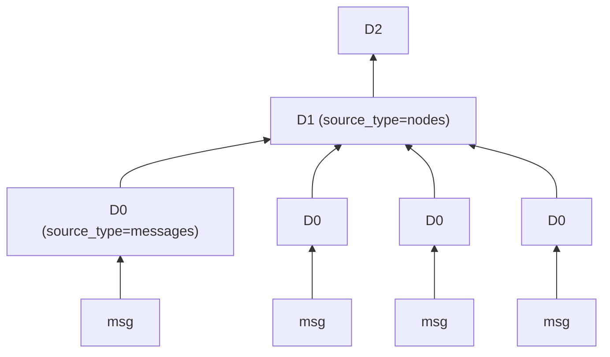
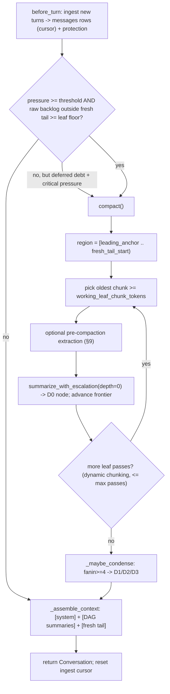

# daemon-context-lcm: a Rust port of hermes-lcm as the default `ContextEngine`

> Research artifact + architecture description + buildable specification for porting the
> Python [`hermes-lcm`](https://github.com/stephenschoettler/hermes-lcm) plugin (~15.7K LOC)
> into a Rust crate `crates/engine/daemon-context-lcm` that implements `daemon-core`'s §10
> `ContextEngine` trait and ships as the **default** in-session context manager.
>
> Companion to the high-level [`hermes-lcm-architecture.md`](../../../../../daemon-hermes/hermes-lcm-architecture.md)
> (the visual map) — this document is the deeper, port-oriented contract with `path:line`
> references, schema DDL, algorithms, crate selections, and milestones.

## Source roots & citation convention

Two repositories are involved. To keep references unambiguous, this document uses these prefixes:

- **`LCM:`** — the Python source under the sibling workspace `daemon-hermes/hermes-lcm/`.
  Example: `LCM:engine.py:3243` means `daemon-hermes/hermes-lcm/engine.py`, line 3243.
- **`CORE:`** — the Rust source under this workspace `daemon/`.
  Example: `CORE:crates/engine/daemon-core/src/conversation.rs:88`.
- **`SPEC:`** — `CORE:crates/engine/daemon-core/docs/daemon-core-spec.md` (the engine spec family),
  cited by section (`SPEC §10`) and line range where useful.

All `path:line` ranges were captured from a full source audit (June 2026, hermes-lcm v0.17.x,
schema v4). Line numbers are load-bearing only as navigation aids; the *constants* and *DDL* quoted
here are the contract.

---

## 1. Executive summary

### 1.1 What hermes-lcm is

`hermes-lcm` is a **Lossless Context Management** engine: a drop-in replacement for an agent host's
built-in lossy context compressor. Instead of replacing old turns with a flat summary (and losing
the detail), it:

1. **Persists every message** verbatim to its own SQLite file (`lcm.db`) before any compaction.
2. **Compacts** everything outside a fixed *fresh tail* into a **depth-aware summary DAG**
   (D0 leaves over raw messages → D1/D2/D3 condensations over lower nodes).
3. **Escalates** summary quality under a token budget with guaranteed convergence
   (L1 detailed LLM summary → L2 aggressive bullets → L3 deterministic truncation).
4. **Assembles** the active prompt as `[system anchor] + [highest-depth DAG summaries] + [fresh tail]`.
5. **Exposes seven paged drill-down tools** (`lcm_grep`, `lcm_load_session`, `lcm_describe`,
   `lcm_expand`, `lcm_expand_query`, `lcm_status`, `lcm_doctor`) so the agent can recover the exact
   compacted material on demand, within bounded token budgets, inside the current session.

The slogan — *"bounded context, unbounded memory; nothing is ever lost"* — is the design
contract: the active prompt stays bounded, while raw history remains recoverable from SQLite.

### 1.2 LCM vs. built-in compaction (the value proposition)

A built-in compressor rewrites the active prompt and depends on a *separate* history path
(e.g. cross-session search) for recovery — which the model may never invoke. LCM is different
because **recall is part of the active context engine**:

- a plugin-local store + DAG built specifically for drill-down;
- current-session retrieval through LCM tools, not an auxiliary cross-session step;
- explicit source-lineage and session-boundary rules.

This maps cleanly onto `daemon-core`'s §10 framing: the `ContextEngine` is the **single compaction
owner of the active prompt** and *owns its drill-down tools*, distinct from the §11 `MemoryProvider`
cross-session recall domain and the §14 `SessionStore` activation domain (`SPEC §10`; the
three-domain contract in `CORE:docs/specs/daemon-lifecycle-persistence.md` §6).

### 1.3 Scope of this port

**Full parity.** The port targets the complete LCM feature set: ingest + protection, SQLite store
+ FTS5, the summary DAG + condensation, 3-level escalation, all seven `lcm_*` tools,
externalization, sensitive redaction, lifecycle/debt tracking, presets, model routing, session/
message filters, and diagnostics.

**Deferred (documented, not specced line-by-line):** the `/lcm` operator slash-command surface
(`LCM:command.py`, 1,749 lines) and the benchmarking/stress harness. These are operator tooling, not
the context-engine hot path; they become a late milestone (§15).

**Out of scope for *this artifact*:** writing crate code, editing `Cargo.toml`, or modifying
`daemon-core`. This document is the specification that a subsequent implementation phase consumes.

### 1.4 Foundation assumption

This port builds **on top of** the `daemon_core_model_io_foundation` phase, which is assumed
complete. That phase introduces `CORE:.../src/context.rs` carrying the §10 `ContextEngine` trait,
the `Pressure` type, the `PromptAssembler`, and a cheap default `BudgetedContextEngine`
(`DropOldest` + anti-thrash). **This port replaces that default** with the full LCM engine, living
in a sibling crate so `daemon-core` itself stays SQLite-free (mirroring how networked providers live
in a sibling `daemon-providers` crate).

> If the foundation's trait shapes differ from those quoted in §2 (the spec leaves several
> supporting types — `Pressure`, `ModelInfo`, `ToolCx` — as signatures without struct bodies), the
> implementer reconciles against the *landed* `context.rs`; this spec flags every such open type in
> §14.

---

## 2. The daemon-core integration contract

### 2.1 The `ContextEngine` trait (the surface to implement)

`SPEC §10` defines the trait the port implements. **RECONCILED (as-built):** the seam is now
implemented in [`context.rs`](../src/context.rs) with the signatures below. The differences from
earlier drafts: `before_turn`/`after_response`/session hooks are **sync** (LCM enqueues to its store,
not awaiting in the hook); `compact` takes `budget: usize`; and **tools are not on the seam** —
`tools()` returns only the advisory *names* the engine owns, while the actual `lcm_*` drill-down tools
register through the §12 [`ToolRegistry`](../src/tools.rs) (an `Arc<LcmContextEngine>` captured in the
tool closure, mirroring `MemoryProviderTool` in `bins/daemon`).

```rust
#[async_trait]
pub trait ContextEngine: Send + Sync {
    fn on_model(&self, model: &ModelInfo) {}                                  // set budgets/threshold
    fn before_turn(&self, conv: &Conversation, budget: Option<usize>) -> Pressure;
    async fn compact(&self, conv: Conversation, budget: usize) -> Conversation;  // THE step
    fn after_response(&self, usage: &UsageDelta) {}
    fn on_session_start(&self, session: &SessionId) {}                        // once, before turn 1
    fn on_session_end(&self, session: &SessionId, conv: &Conversation) {}     // on teardown
    fn tools(&self) -> Vec<String> { Vec::new() }                            // advisory names only
}
```

`ModelInfo { model: String, max_context: Option<u32> }` is supplied by the engine from
`Provider::capabilities()`. The engine calls `on_model` + `on_session_start` once before the first
turn and `on_session_end` from `Engine::end_session` on teardown.

The §11 hook order the loop guarantees (`SPEC §10`/§11 mermaid, lines 913–933):

```
recall → before_turn → [before_compact → compact (if over budget)] → assemble → LLM+tools → after_turn → after_response
```

Engine-owned tools get the live conversation **by construction**: `call_tool` receives a `ToolCx`
carrying `&Conversation` — this is the structural win over `hermes-lcm`'s runtime host-capability
sniff (`context_engine_tool_handlers_receive_messages`) that the Python plugin must probe (see §10.1).

### 2.2 The typed `Conversation` (the body LCM operates on)

`CORE:crates/engine/daemon-core/src/conversation.rs:11–94`. Unlike Python's flat
`[{role, content, tool_calls, tool_call_id}]` list, the body is a typed tree with **structural tool
pairing**:

```rust
pub struct SystemPrompt { pub text: String }                       // :12

pub struct AssistantMsg { pub text: String, pub reasoning: Option<String> }   // :26

pub struct ToolCall   { pub call_id: String, pub name: String, pub args: String }  // :45
pub struct ToolResult { pub call_id: String, pub ok: bool, pub content: String }   // :56

pub struct ToolTurn {                                              // :68
    pub assistant: AssistantMsg,
    pub calls: Vec<(ToolCall, ToolResult)>,                        // call+result always paired
}

pub enum Turn {                                                    // :77
    User(UserMsg),                                                 // UserMsg { text } in daemon-protocol
    Assistant(AssistantMsg),
    Tool(ToolTurn),
}

pub struct Conversation { pub system: SystemPrompt, pub turns: Vec<Turn> }      // :88
```

**Invariant (`conversation.rs:1–6`):** *"a tool call cannot exist without its result slot … so an
orphaned tool result is unrepresentable and compaction operating on `Turn`s cannot split a pair."*
This is the single most important difference from the Python design and it makes LCM's
`_sanitize_active_context_messages` tool-pair guardrail (`LCM:engine.py:4130`) **free** in Rust.

The `Conversation` lives inside the durable `Snapshot` (`CORE:.../src/snapshot.rs:41`), which is the
only checkpointed engine state. `compact()` returns a new `Conversation` that the engine swaps into
the snapshot; LCM's SQLite DB is a *parallel* durable store (§4), never serialized into the snapshot
(`daemon-lifecycle-persistence.md` §6, rule 3: a `Snapshot` carries `Conversation` content only;
external stores reload their own state on rehydration).

### 2.3 Where the hooks wire into the turn loop

`CORE:crates/engine/daemon-core/src/engine.rs`. Today the loop calls a naive
`build_context(&conv, &tools)` (`CORE:.../src/provider.rs:271`) that flattens all turns with no
compaction. The foundation phase inserts the §10/§11 hooks; LCM plugs into them:

| Hook | Loop insertion point (`engine.rs`) | LCM responsibility |
| --- | --- | --- |
| `on_model(&ModelInfo)` | engine construction / model update | set `context_length`, compute `threshold_tokens`, pick tokenizer |
| `before_turn(conv) -> Pressure` | before the ReAct loop (~`:398`, after `boundary`) | **ingest** new turns → `lcm.db`; report pressure vs. threshold |
| `compact(conv, budget) -> Conversation` | replaces the `build_context` body when over budget | run the leaf→condense→assemble pipeline; return `[summary turn] + [fresh tail]` |
| error-driven `compact` | wrap `call_model`: on `Failure::ContextOverflow`/`PayloadTooLarge` (`provider.rs:148–153`) | compact + retry once (`SPEC §8 → §10` tie-in) |
| `after_response(&Usage)` | inside `call_model` after a successful `chat` (~`:330`) | record `last_prompt/completion/total` tokens, cache metrics |
| `tools()` / `call_tool` | model offered `tools()`; dispatched with `ToolCx{&Conversation}` | the seven `lcm_*` tools |
| `on_session_start` / `on_session_end` | session bind / finalize | lifecycle bind, frontier restore / final ingest + finalize |

The actor (`CORE:.../src/actor.rs`) and the durable activation path both call `engine.run_turn`, so
hooks added there cover the **live and durable lifecycles uniformly** — no double wiring.

### 2.4 The budget knob

`CORE:crates/engine/daemon-core/src/config.rs:41`:

```rust
/// A soft context-token budget hint for `build_context` (not yet enforced; reserved for the
/// compaction slice).
pub context_budget_tokens: Option<u32>,   // default None
```

This is the reserved trigger. In Python the trigger is `threshold_tokens = context_length *
context_threshold` (`LCM:engine.py:500–521`, default `0.35`). The port computes its own
`threshold_tokens` in `on_model` from the model's `max_context` (`Capabilities.max_context`,
`provider.rs:38`) and the LCM `context_threshold` config, and treats `context_budget_tokens` as the
host-level override/cap. `compact()`'s `budget: Tokens` argument is the post-compaction target.

### 2.5 Construction & injection

`CORE:.../src/profile.rs` — `EngineProfile` is the single construction seam. The foundation adds
`with_context_engine(Arc<dyn ContextEngine>)` mirroring `with_exec` (`profile.rs:92`). The binary
wires LCM as the default:

```rust
let lcm = Arc::new(LcmContextEngine::open(lcm_config, aux_provider)?);
let profile = EngineProfile::new(provider_builder, registry, system)
    .with_context_engine(lcm);   // replaces BudgetedContextEngine default
```

The auxiliary summarization provider (§7) is injected here too — it is **not** `Engine.provider`
(the main model); it lives on the `ContextEngine` so LCM controls its own summarization route.

---

## 3. Python → Rust hook mapping

`hermes-lcm`'s `LCMEngine` implements the Hermes `ContextEngine` ABC plus host-specific helpers.
This table is the authoritative method-by-method mapping; each Python method's behavior is specced
in the section noted.

| Python `LCMEngine` method | `LCM:engine.py` | daemon-core equivalent | Notes / spec § |
| --- | --- | --- | --- |
| `name` (property → `"lcm"`) | `:541` | engine identity constant | — |
| `update_model(model, context_length, …)` | `:2502–2519` | `on_model(&ModelInfo)` | sets `context_length`, `threshold_tokens`, tokenizer (§6.1, §12) |
| `_set_context_length(len, source)` | `:500–521` | (inside `on_model`) | `threshold = len * context_threshold` |
| `on_session_start(session_id, **kw)` | `:2082–2130` | `on_session_start(&SessionId)` | lifecycle bind, frontier restore, filter refresh (§4.6) |
| `should_compress_preflight(messages)` **(ingests!)** | `:663–694` | first half of `before_turn` | ingest new slice; return whether replay differs (§6.2) |
| `should_compress(prompt_tokens)` | `:651–661` | second half of `before_turn` → `Pressure` | threshold/cooldown/overflow gate (§6.3) |
| `compress(messages, current_tokens, focus_topic)` | `:851–1177` | `compact(conv, budget) -> Conversation` | the pipeline (§6) |
| `update_from_response(usage)` | `:614–629` | `after_response(&Usage)` | token metrics (§6.7) |
| `on_session_end(session_id, messages)` | `:2132–2200` | `on_session_end(&SessionId, &Conversation)` | final ingest + `finalize_session` (§4.5) |
| `on_session_reset()` | `:2202–2219` | (session-switch path) | DAG prune by `new_session_retain_depth` (§4.5) |
| `carry_over_new_session_context(old, new)` | `:2221–2238` | (session-switch path) | reassign retained DAG nodes (§4.5) |
| `rollover_session(old, new, …)` | `:2240–2305` | (session-switch path) | ordered end→reset→start→carry-over |
| `get_tool_schemas()` | `:2307–2316` | `tools() -> Vec<ToolDef>` | seven `lcm_*` schemas (§10) |
| `handle_tool_call(name, args, **kw)` | `:2318–2342` | `call_tool(name, args, ToolCx)` | typed `&Conversation` replaces the host sniff (§10) |
| `get_status()` | `:2402–2500` | (folded into `lcm_status` tool) | diagnostics (§10.6) |
| `clone_for_agent()` | `:399–416` | per-engine construction via `EngineProfile` | — |

**Two structural simplifications the Rust port gets for free:**

1. **No preflight/`compress` split.** Python separates `should_compress_preflight` (which also
   ingests as a side effect) from `compress`. daemon-core's `before_turn` is the natural single
   ingest+pressure hook; `compact` is invoked by the loop only when `Pressure` says over-budget. The
   port keeps the Python *logic* but folds it into these two hooks.
2. **No tool-handler capability sniff.** `call_tool` always receives `&Conversation` via `ToolCx`,
   so the seven tools never probe the host for message access (the Python plugin's
   `context_engine_tool_handlers_receive_messages` dance disappears).

---

## 4. Storage layer (SQLite, schema v4)

A single `lcm.db` file owned by the LCM engine (default path resolves like Python's
`HERMES_HOME/lcm.db` → here `<data_root>/lcm.db`). WAL mode, `synchronous=FULL`. Lineage is encoded
in each node's `source_ids` JSON — **there is no edges table**. Three Python store classes
(`MessageStore`, `SummaryDAG`, `LifecycleStateStore`) share the one file, each with its own
connection; the Rust port unifies them behind a **store actor** (§4.7).

### 4.1 Connection configuration (pragmas)

`LCM:db_bootstrap.py:51–88`, `SCHEMA_VERSION = 4`, `SQLITE_BUSY_TIMEOUT_MS = 30_000`:

```sql
PRAGMA journal_mode=WAL;            -- readers don't block the writer
PRAGMA synchronous=FULL;           -- fsync WAL+index every commit; power-loss safe under WAL
PRAGMA busy_timeout=30000;         -- wait on lock contention
PRAGMA wal_autocheckpoint=500;     -- ~2 MB passive checkpoint hint
PRAGMA journal_size_limit=67108864;-- 64 MiB WAL cap after checkpoint
PRAGMA mmap_size=268435456;        -- 256 MiB memory-mapped reads
```

On graceful close, all three Python stores run `PRAGMA wal_checkpoint(PASSIVE)`
(`LCM:store.py:1018`, `dag.py:604`, `lifecycle_state.py:59`). The Rust store actor does the same on
shutdown.

> **rusqlite note.** The `bundled` feature compiles SQLite ≥3.51 with FTS5 + external-content
> virtual tables + triggers, so all DDL below works unchanged. `synchronous=FULL` (not the
> `daemon-store` activation DB's `NORMAL`) is intentional: LCM's lossless contract wants per-commit
> durability.

### 4.2 `messages` table

`LCM:store.py:239–255`:

```sql
CREATE TABLE IF NOT EXISTS messages (
    store_id        INTEGER PRIMARY KEY AUTOINCREMENT,
    session_id      TEXT    NOT NULL,
    source          TEXT    DEFAULT '',        -- platform/source; blank normalized to 'unknown'
    role            TEXT    NOT NULL,          -- user | assistant | tool | system
    content         TEXT,                      -- nullable; FTS-indexed
    tool_call_id    TEXT,
    tool_calls      TEXT,                      -- JSON blob
    tool_name       TEXT,
    timestamp       REAL    NOT NULL,          -- unix seconds
    token_estimate  INTEGER DEFAULT 0,
    pinned          INTEGER DEFAULT 0          -- 0/1
);
CREATE INDEX IF NOT EXISTS idx_msg_session        ON messages(session_id, store_id);
CREATE INDEX IF NOT EXISTS idx_msg_session_ts     ON messages(session_id, timestamp);
CREATE INDEX IF NOT EXISTS idx_msg_source_session ON messages(source, session_id, store_id);
```

`store_id` is the stable lossless-recovery identity referenced by D0 nodes and the `lcm_expand`
tool. `source` write/read normalization: blank/NULL → `"unknown"` (`LCM:store.py:69–80`); the
filter clause expands `unknown` to `(source = 'unknown' OR <legacy-blank>)`.

### 4.3 `summary_nodes` table

`LCM:dag.py:164–179`:

```sql
CREATE TABLE IF NOT EXISTS summary_nodes (
    node_id            INTEGER PRIMARY KEY AUTOINCREMENT,
    session_id         TEXT    NOT NULL,
    depth              INTEGER NOT NULL DEFAULT 0,    -- D0 leaf … D3 condensation
    summary            TEXT    NOT NULL,              -- FTS-indexed
    token_count        INTEGER DEFAULT 0,             -- tokens of the summary
    source_token_count INTEGER DEFAULT 0,             -- tokens of the sources it covers
    source_ids         TEXT    NOT NULL DEFAULT '[]', -- JSON array of store_id OR node_id
    source_type        TEXT    NOT NULL DEFAULT 'messages', -- 'messages' | 'nodes'
    created_at         REAL    NOT NULL,
    earliest_at        REAL,                          -- source time-window min
    latest_at          REAL,                          -- source time-window max
    expand_hint        TEXT    DEFAULT ''             -- "Expand for details about: …"
);
CREATE INDEX IF NOT EXISTS idx_nodes_session_depth  ON summary_nodes(session_id, depth, created_at);
CREATE INDEX IF NOT EXISTS idx_nodes_session_latest ON summary_nodes(session_id, latest_at, created_at);
```

Summary nodes are **append-only in practice** (no `UPDATE summary_nodes` path exists in Python),
which is why `nodes_fts` has no update trigger (§4.4).

### 4.4 FTS5 external-content virtual tables + triggers

Created via `LCM:db_bootstrap.py:547–558`. External-content tables index `content`/`summary` without
duplicating the bytes; triggers keep them in sync.

```sql
CREATE VIRTUAL TABLE messages_fts USING fts5(content, content=messages,       content_rowid=store_id);
CREATE VIRTUAL TABLE nodes_fts    USING fts5(summary, content=summary_nodes,   content_rowid=node_id);
```

`messages_fts` triggers — insert, delete, **and update-of-content** (`LCM:store.py:180–202`):

```sql
CREATE TRIGGER msg_fts_insert AFTER INSERT ON messages BEGIN
    INSERT INTO messages_fts(rowid, content) VALUES (new.store_id, new.content);
END;
CREATE TRIGGER msg_fts_delete AFTER DELETE ON messages BEGIN
    INSERT INTO messages_fts(messages_fts, rowid, content) VALUES('delete', old.store_id, old.content);
END;
CREATE TRIGGER msg_fts_update AFTER UPDATE OF content ON messages BEGIN
    INSERT INTO messages_fts(messages_fts, rowid, content) VALUES('delete', old.store_id, old.content);
    INSERT INTO messages_fts(rowid, content) VALUES (new.store_id, new.content);
END;
```

`nodes_fts` triggers — insert + delete only, **no update** (`LCM:dag.py:115–128`).

The `messages` update-of-content trigger exists for exactly one narrow path: transcript-GC rewrites
a tool-row's `content` in place to a placeholder (`LCM:store.py:381–405`, §9), preserving `store_id`.

### 4.5 Lifecycle, metadata, and migration tables

`lcm_lifecycle_state` — per-conversation compaction frontier + debt (`LCM:db_bootstrap.py:127–152`):

```sql
CREATE TABLE IF NOT EXISTS lcm_lifecycle_state (
    conversation_id                    TEXT PRIMARY KEY,
    current_session_id                 TEXT,
    last_finalized_session_id          TEXT,
    current_frontier_store_id          INTEGER NOT NULL DEFAULT 0,  -- compaction high-water mark
    last_finalized_frontier_store_id   INTEGER NOT NULL DEFAULT 0,
    debt_kind                          TEXT,                        -- e.g. 'raw_backlog'
    debt_size_estimate                 INTEGER NOT NULL DEFAULT 0,
    current_bound_at                   REAL,
    last_finalized_at                  REAL,
    debt_updated_at                    REAL,
    last_maintenance_attempt_at        REAL,
    last_rollover_at                   REAL,
    last_reset_at                      REAL,
    updated_at                         REAL NOT NULL DEFAULT (strftime('%s','now'))
);
CREATE INDEX IF NOT EXISTS idx_lcm_lifecycle_current_session        ON lcm_lifecycle_state(current_session_id);
CREATE INDEX IF NOT EXISTS idx_lcm_lifecycle_last_finalized_session ON lcm_lifecycle_state(last_finalized_session_id);
```

`metadata` (`key TEXT PRIMARY KEY, value TEXT`; `LCM:store.py:257–260`) holds `schema_version` and
`fts_integrity_checked_at:<table>`. `lcm_migration_state` (`step_name TEXT PRIMARY KEY, completed_at
REAL`; `LCM:db_bootstrap.py:115–123`) logs idempotent migration steps.

`REQUIRED_CORE_TABLES` (`LCM:db_bootstrap.py:23–31`): `messages, metadata, summary_nodes,
lcm_lifecycle_state, lcm_migration_state, messages_fts, nodes_fts`.

### 4.6 Migrations

`run_versioned_migrations` (`LCM:db_bootstrap.py:580–601`) is a linear ladder to v4:
`v2_external_content_fts_triggers` → `v3_lifecycle_state` → `v4_lifecycle_debt_columns`. Two
column-presence migrations run **outside** the version gate every init: `_ensure_source_column`
(`store.py:270`) and `_ensure_source_window_columns` (`dag.py:194`). FTS is (re)built via
`repair_external_content_fts(..., throttle=True)` on every open.

**Rust port:** a fresh DB is created directly at v4 (no historical ladder needed for greenfield);
the migration table + `schema_version` are still written so a future migration has the same hook.
The implementer keeps `run_versioned_migrations`-equivalent only if importing legacy `lcm.db` files
is in scope (it is not for the default path).

### 4.7 The store actor (async over blocking SQLite)

`rusqlite` is synchronous and `Connection` is `Send` but `!Sync`; the §10 trait methods are `async`.
Two viable designs:

- **Store actor (recommended):** a dedicated OS thread owns the `Connection`(s) and processes a
  `mpsc` command queue; `async` methods send a command + a `oneshot` reply. Keeps SQLite entirely
  off the tokio executor, gives a natural single-writer serialization point (matching Python's
  `MessageStore._write_lock`), and mirrors the daemon's existing actor patterns.
- **`spawn_blocking` + `Arc<Mutex<Connection>>`:** simpler, but every call hops onto the blocking
  pool and the `Mutex` must be held across the blocking call.

The spec recommends the actor. Note the Python asymmetry to preserve: `MessageStore` serializes
writes under an `RLock`; `SummaryDAG` has no lock; `LifecycleStateStore` uses autocommit + `BEGIN
IMMEDIATE` only for its GC pass. A single actor owning one connection makes all of this a
non-issue (one writer, sequential commands), at the cost of serializing reads — acceptable for a
context engine. If read concurrency matters later, open a second read-only connection in the actor.

---

## 5. The summary DAG

`LCM:dag.py` defines `SummaryNode` + `SummaryDAG`. Depth encodes timescale; condensation builds
higher levels once enough siblings accumulate. The Rust port is a near-direct translation.

### 5.1 `SummaryNode`

`LCM:dag.py:133–149` → Rust:

```rust
pub struct SummaryNode {
    pub node_id: i64,
    pub session_id: String,
    pub depth: i64,                 // 0 = leaf over raw messages; 1+ = condensation over nodes
    pub summary: String,
    pub token_count: i64,           // tokens of `summary`
    pub source_token_count: i64,    // tokens of the sources it covers
    pub source_ids: Vec<i64>,       // store_ids if source_type==Messages, else node_ids
    pub source_type: SourceType,    // Messages | Nodes
    pub created_at: f64,
    pub earliest_at: Option<f64>,
    pub latest_at: Option<f64>,
    pub expand_hint: String,
    // search-only, not persisted:
    pub search_rank: Option<f64>,
    pub search_directness: f64,
}
pub enum SourceType { Messages, Nodes }
```

### 5.2 Lineage (no edges table)

Lineage is the `source_ids` JSON array interpreted by `source_type`:

- `source_type = Messages` → `source_ids` are `messages.store_id`s (a D0 leaf).
- `source_type = Nodes` → `source_ids` are child `summary_nodes.node_id`s (a D≥1 condensation).



### 5.3 Source-aware filtering — the recursive CTE

The one piece of real SQL cleverness. To filter summaries by descendant raw-message `source`, the
node-search post-filter walks `source_ids` down to leaves (`LCM:dag.py:505–533`):

```sql
WITH RECURSIVE source_walk(source_type, source_id) AS (
    SELECT n.source_type, CAST(j.value AS INTEGER)
    FROM summary_nodes n, json_each(n.source_ids) j
    WHERE n.node_id = ?
    UNION ALL
    SELECT child.source_type, CAST(j.value AS INTEGER)
    FROM summary_nodes child
    JOIN source_walk walk ON walk.source_type = 'nodes' AND child.node_id = walk.source_id
    JOIN json_each(child.source_ids) j
)
SELECT 1 FROM source_walk walk
JOIN messages m ON walk.source_type = 'messages' AND m.store_id = walk.source_id
WHERE CASE WHEN ? = ? THEN (m.source = ? OR <legacy_blank_clause>) ELSE m.source = ? END
LIMIT 1;
```

This depends on SQLite's `json_each` (available in `bundled`). The Rust port issues this verbatim;
no Rust-side graph walk is needed.

### 5.4 `SummaryDAG` API (the methods the compaction engine + tools call)

`LCM:dag.py`: `add_node` (`:208`), `delete_below_depth` (`:233`), `get_node` (`:274`),
`get_session_nodes(session, depth?, limit)` (`:280`), `count_at_depth` (`:300`),
`get_uncondensed_at_depth(session, depth, limit)` (`:309`, the condensation feeder),
`search(query, session?, limit, sort, source?)` (`:331`, FTS5 + LIKE fallback),
`get_source_nodes(node)` (`:479`), `_node_matches_source` (`:492`, the CTE above),
`get_source_time_window(node_ids)` (`:539`), `describe_subtree(node_id)` (`:555`, the `lcm_describe`
payload). The Rust port maps each to an actor command.

`describe_subtree` returns the shape `lcm_describe` exposes (`LCM:dag.py:572–583`): `node_id, depth,
token_count, source_token_count, source_type, num_sources, earliest_at, latest_at, expand_hint,
children[{node_id, depth, token_count, source_token_count, expand_hint}]`.

---

## 6. The compaction engine

This is the heart of the port: `LCMEngine.compress` (`LCM:engine.py:851–1177`) plus its helpers,
re-expressed against the typed `Conversation`. The flow per `compact()` call:



### 6.1 Threshold & tokenizer (`on_model`)

`LCM:engine.py:500–521`: `threshold_tokens = int(context_length * context_threshold)`,
`context_threshold` default `0.35` (`LCM:config.py:212`). The Rust `on_model(&ModelInfo)` sets
`context_length` from `ModelInfo` (or `Capabilities.max_context`), computes `threshold_tokens`, and
selects the tiktoken encoding by model family (§12.2).

### 6.2 Ingest (the first half of `before_turn`)

`LCMEngine._ingest_messages` (`LCM:engine.py:3243–3371`). In Python this scans a flat active-message
list from an `_ingest_cursor`; in Rust it scans `conv.turns` from a cursor. Steps:

1. **Early exit** if no session, or session is *ignored*/*stateless* (§12.5) — return a redacted
   replay view only, no writes (`:3256`).
2. **Cursor + scan window** (`:3268`): `cursor = clamp(ingest_cursor, 0, n)`; scan only the new
   suffix (`turns[cursor..]`) unless a reconcile is pending.
3. **Ignore-pattern pass** (`:3272`): mark turns whose text matches `ignore_message_patterns`.
4. **Quarantine** loop/heartbeat noise (`:3281`, §8.3).
5. **Active-replay redaction** (`:3289`, §8.1) for the provider-facing copy.
6. **Cursor reconciliation** after restart (`:3290`): align the cursor with the durable store tail
   (`_reconcile_ingest_cursor_from_store`, `:3125`).
7. **Filter ignored** before store (`:3315`); increment `ignored_message_count`.
8. **Protection** (`:3339`, §8): `protect_messages_for_ingest(...)` → externalize/redact.
9. **Persist** (`:3357`): `append_batch(session_id, protected, estimates, source=platform)`.
10. **Advance cursor** (`:3364`): `ingest_cursor = n`.

**Turn → message flattening (the binding rule, §14.1):** each `Turn` becomes one or more `messages`
rows so `store_id` lineage matches Python:

| `Turn` variant | rows written |
| --- | --- |
| `User(UserMsg)` | one `role='user'` row (`content = text`) |
| `Assistant(AssistantMsg)` | one `role='assistant'` row; `reasoning` is **not** stored as content (Python drops reasoning from context too — §14.4) |
| `Tool(ToolTurn)` | one `role='assistant'` row for `assistant.text` (+`tool_calls` JSON of the calls), then one `role='tool'` row per `(call, result)` carrying `result.content`, `tool_call_id`, `tool_name` |

The **ingest cursor** is therefore a `(turn_index_high_water, frontier_store_id)` pair: `turn_index`
is the count of `conv.turns` already flattened; `frontier_store_id` is the durable
`current_frontier_store_id` reconciled from `lcm_lifecycle_state` on rehydration (since the snapshot
carries the `Conversation` but not the cursor).

### 6.3 Pressure (the second half of `before_turn`)

`should_compress` (`:651–661`) + `should_compress_preflight` tail (`:663–694`). Returns
**over-budget** when, after ingest, the (rough) prompt token count `>= threshold_tokens` **and**
there is eligible raw backlog outside the fresh tail; plus forced-overflow recovery; minus
ignored/stateless/boundary-cooldown gates. The Rust `Pressure` return encodes this (the exact
`Pressure` shape is a foundation open type, §14.2 — minimally an over-budget bool + observed/budget
tokens).

**Boundary cooldown** (`:637–649`): for **60 seconds** after a skipped compression boundary, both
pressure checks return "don't compact" — prevents a compaction cascade after a failed boundary
carry-over. Tracked by a `last_boundary_skip_time: Instant`.

### 6.4 Region selection

`compact()` operates on the body between a **leading anchor** and the **fresh tail**:

- **Leading anchor** (`_leading_anchor_count`, `:1594–1605`): `1` if the first turn is the system
  prompt, else `0`. In daemon-core the system prompt is `Conversation.system` (separate from
  `turns`), so the anchor is structurally the `system` field; the candidate region is
  `turns[0 .. fresh_tail_start)`.
- **Fresh tail** (`fresh_tail_count`, default **32**, `LCM:config.py:206`):
  `fresh_tail_start = max(0, turns.len() - fresh_tail_count)`. These turns are **always kept
  verbatim**.
- **Replayed-scaffold stripping** (`:955–963`): prior LCM summary turns + preserved-objective
  scaffolding at the region head are skipped before leaf selection (so we don't re-summarize a
  summary). In Rust these are the synthetic summary turns from a previous `compact()` (§6.6).

### 6.5 Leaf selection, escalation, and the multi-pass loop

- **Dynamic chunk size** (`_working_leaf_chunk_tokens`, `:735–743`): base `leaf_chunk_tokens`
  (default **20000**), doubling toward `dynamic_leaf_chunk_max` (default **40000**) while the raw
  backlog outside the tail exceeds `working * 2`. Only active when `dynamic_leaf_chunk_enabled`
  (default false); otherwise the whole non-tail region is one chunk.
- **Oldest-chunk selection** (`_select_oldest_leaf_chunk`, `:745–758`): greedy prefix from the
  oldest messages until the token sum exceeds the working chunk size.
- **Leaf summarization with rescue** (`_summarize_leaf_chunk_with_rescue`, `:801–849`): up to **3**
  attempts; token budget `max(2000, int(source_tokens * 0.20))` capped at **12000** (`:814`). On
  retry-worthy errors (timeout, context-length) it shrinks the input chunk (75%/50%/drop-last) and
  re-invokes escalation. The result is a **D0 node** (`source_type=Messages`,
  `source_ids = store_ids`); `last_compacted_store_id = max(store_ids)`; the lifecycle frontier is
  advanced (`_persist_frontier_marker`, `:1220–1227`).
- **Pass cap** (`:923–926`): up to **4** leaf passes when dynamic chunking (or deferred maintenance)
  is on, else **1**. Early break (`:1042–1061`) once estimated active tokens drop below threshold or
  remaining backlog falls below the dynamic threshold.

### 6.6 Condensation (`_maybe_condense`, `:3842–3934`)

For each depth `d` from 0 up to `incremental_max_depth` (default **3**; `0` disables, `-1`
unlimited):

- if `count_uncondensed_at_depth(d) >= condensation_fanin` (default **4**), take the first `fanin`
  uncondensed nodes and summarize them into a new node at `depth d+1`
  (`source_type=Nodes`, `source_ids = child node_ids`), token budget `max(1000, int(source_tokens *
  0.40))` (`:3890`), via `summarize_with_escalation(depth = d+1)`.
- a **cache-friendly** gate (`_should_allow_follow_on_condensation`, `:3817`) limits follow-on
  condensation to one pass per `compact()` when the leaf step already ran this turn; debt threshold
  `fanin * max(1, cache_friendly_min_debt_groups)` (default `4*2 = 8`).

### 6.7 Assembly (`_assemble_context`, `:4017+`)

Builds the returned body: `[system anchor] + [combined DAG summaries (+ optional preserved-objective
anchor)] + [fresh tail]`:

1. **System anchor** (`:4036`): the `system` prompt; on the *first* compaction an "LCM note" is
   appended once (`compression_count == 0`).
2. **Assembly cap** (`:4048`): `min(max_assembly_tokens, context_length - reserve_tokens_floor)` when
   configured (both default `0` = disabled).
3. **Tail budgeting** (reverse scan, `:4060`): accumulate fresh-tail turns from newest backward
   until the cap; may **skip** droppable assistant/tool turns to reach older user intent.
4. **Preserved-objective anchor** (`:4082`, `_latest_user_context_anchor`): inject the newest real
   user objective that fell out of the tail into the summary block.
5. **DAG summaries** (`:4094`): all *uncondensed* nodes, highest depth first, labeled by depth
   ("Recent" / "Session Arc" / "Durable" …); greedily fit within `summary_budget = cap - leading -
   tail`.
6. **Append tail + sanitize** (`:4130`): the tool-pair guardrail — **free** in Rust because the
   fresh tail is already `Vec<Turn>` with intact `ToolTurn`s.

**Output mapping (§14.1):** the returned `Conversation` is
`{ system, turns: [synthetic_summary_turn(s)] ++ fresh_tail_turns }`. The summary block becomes one
leading synthetic `Turn::Assistant` (reference-only text; the LCM note marks it as recoverable via
tools) rather than mutating `system.text`. After a successful `compact()`, the ingest cursor resets
to the new `turns.len()` (Python `:1154`).

### 6.8 Deferred debt, critical pressure

`deferred_maintenance_enabled` (default false) lets LCM **record debt** instead of compacting when
backlog is below the leaf floor: `record_debt(kind="raw_backlog", size_estimate=raw_tokens)`
(`_refresh_raw_backlog_debt`, `:1676–1702`). `critical_budget_pressure_ratio` (default `0.0` =
disabled) is the escape hatch: at/above `observed_tokens / context_length >= ratio` (`:1624–1656`),
LCM may run deferred maintenance on sub-threshold backlog and bypass the cache-friendly gates. These
are opt-in; the default config never triggers them.

---

## 7. Escalation & auxiliary-provider summarization

### 7.1 The 3-level escalation

`summarize_with_escalation` (`LCM:escalation.py:288–347`). Each level must produce
`count_tokens(result) < source_tokens` or it escalates; L3 always converges. Signature:

```rust
// (summary_text, level_used)
fn summarize_with_escalation(
    text: &str, source_tokens: usize, token_budget: usize, depth: i64,
    /* model routing */ summary_model: &str, fallback_models: &[String],
    circuit_breaker: &mut SummaryCircuitBreaker, timeout: Duration,
    l2_budget_ratio: f64 /*0.50*/, l3_truncate_tokens: usize /*512*/,
    focus_topic: &str, custom_instructions: &str,
) -> (String, u8);
```

| Level | Mechanism | Budget | Accept |
| --- | --- | --- | --- |
| L1 | detailed LLM summary | `token_budget` (leaf: 20% src cap 12k; condense: 40% src) | `tokens(result) < source_tokens` |
| L2 | aggressive bullets | `token_budget * l2_budget_ratio` (0.50) | same |
| L3 | deterministic head/tail truncation | `l3_truncate_tokens` (512) | always |

The LLM call requests `max_tokens = level_budget * 2` while the *prompt* targets the level budget
(`:313`, `:332`).

### 7.2 Verbatim prompts (carry these exactly)

**Depth-aware L1 guidance** (`LCM:escalation.py:221–229`): depth 0 → "Preserve decisions, rationale,
constraints, tasks, paths, commands, values"; depth 1 → "Arc-level outcomes; drop per-turn detail";
depth ≥2 → "Durable narrative; drop process detail".

**L1 prompt** (`_build_l1_prompt`, `:237–246`):

```text
Summarize this conversation segment for future turns.
{depth_guidance}
Remove repetition and conversational filler.
End with: "Expand for details about: <what was compressed>"
{focus_guidance}{custom_block}

Target ~{token_budget} tokens.

CONTENT:
{text}
```

**L2 prompt** (`_build_l2_prompt`, `:258–264`; `{token_budget}` here is the L2 half-budget):

```text
Compress this into bullet points. Maximum {token_budget} tokens.
Keep only: decisions made, files changed, errors hit, current state.
Drop all reasoning, alternatives considered, and process detail.
{focus_guidance}{custom_block}

CONTENT:
{text}
```

**L3 deterministic truncate** (`_deterministic_truncate`, `:267–285`): `char_budget = max_tokens *
4`; keep `head = 40%`, `tail = 40%`, with the marker
`\n\n[...deterministic truncation — details available via lcm_expand...]\n\n` between. No LLM.

**Reasoning-block strip** (`_strip_reasoning_blocks`, `:90–95`): before persisting summaries, strip
`<think>`, `<thinking>`, `<reasoning>`, `<thought>`, `<REASONING_SCRATCHPAD>` blocks. (daemon-core
already routes reasoning to a separate channel, so this is belt-and-suspenders for summary text.)

### 7.3 Circuit breaker & fallback chain

`SummaryCircuitBreaker` (`LCM:escalation.py:42–87`): `failure_threshold = 2`, `cooldown_seconds =
300` (`LCM:config.py:302–304`). `_invoke_summary_llm_chain` (`:180–218`) tries the primary
`summary_model` then `summary_fallback_models` (deduped), per-route `record_failure`/`record_success`;
an open route is skipped; if **all** routes are open it falls through to L3.

### 7.4 Mapping summarization onto a daemon-core `Provider`

This is the key adaptation (§14.3). Python calls `agent.auxiliary_client.call_llm(task="compression",
model=..., provider=..., temperature=0.3, max_tokens=..., timeout=...)` with per-call model routing
(`LCM:escalation.py:98–119`, `model_routing.py`). daemon-core's `Provider::chat(Request)` has **no
per-call model/provider kwarg** — the provider *is* the model.

**Resolution:** the LCM engine holds an **aux provider** `Arc<dyn Provider>` (injected via
`EngineProfile`, §2.5). Escalation builds a `Request` with `system = ""` (or a short system),
`messages = [RequestMsg{role:"user", content: prompt}]`, `tools = []`, and calls
`aux.chat(req)` with a timeout (`tokio::time::timeout`, default 60s, `summary_timeout_ms`). The
`ModelOutput.text` is the summary.

- `summary_model` / `fallback_models` map to **a list of aux providers** (or aux profiles resolved
  through `ProviderRegistry`), not call kwargs. The minimal port takes a single aux provider; the
  full port takes `Vec<Arc<dyn Provider>>` for the fallback chain and applies the circuit breaker
  per index.
- `model_routing.py`'s `provider/model` parsing (`:61–104`) becomes config that selects which
  registered aux profile to resolve; document it as a thin config-to-profile shim (§12.4).
- Temperatures (compression 0.3, extraction 0.2) and `task` labels have no direct daemon-core
  equivalent; carry temperature only if the aux `Provider` exposes it (otherwise it is the aux
  provider's fixed config).

---

## 8. Ingest protection

`LCM:ingest_protection.py` (~1,275 lines) guards SQLite at the write boundary. It is **storage /
size / secret / repetition** focused — *not* a prompt-injection filter. The entry point is
`protect_message_for_ingest` (`:806–888`), order: **sensitive redaction → normalize → skip if
already externalized → assistant quarantine → optional whole-message externalize → substring
externalization (always-on storage guard) → tool_calls protection**.

### 8.1 Sensitive redaction (opt-in)

Gated by `sensitive_patterns_enabled` (default **false**). Catalog
(`_SENSITIVE_PATTERN_CATALOG`, `:106–128`):

| Name | Matches |
| --- | --- |
| `api_key` | `(api_key\|api_token\|access_token\|secret_key\|client_secret)` + `:=` + secret ≥12 chars |
| `bearer_token` | `Bearer ` + secret ≥12 chars |
| `password_assignment` | `(password\|passwd\|pwd\|passphrase)` + `:=` + quoted/unquoted ≥6 |
| `private_key` | PEM `-----BEGIN … PRIVATE KEY-----` … `-----END … PRIVATE KEY-----` (DOTALL) |

**Placeholder format** (`:224–233`):
`[LCM sensitive redaction: name=<pattern>; chars=<n>; bytes=<n>; sha256=<16 hex>]`. The SHA-256 is
the first **16 hex** of the UTF-8 secret; **`password_assignment` omits `sha256`** (to avoid making
password-like values dictionary-checkable). Functions: `redact_sensitive_text` (`:271`),
`redact_sensitive_value` (recursive over dict/list/str, key-heuristic, `:291`),
`_sensitive_pattern_for_key` (`:252`). Redaction is **forward-only**: it never rewrites existing
rows. Rust uses the `regex` + `sha2` crates; the recursion walks `serde_json::Value`.

### 8.2 Storage-boundary guard (always on)

Even with redaction off, LCM scans every message at the write boundary for media-ish / oversized
base64 and externalizes it (so `lcm.db`, FTS, WAL, and backups don't carry payload bytes). Regexes
(`:82–89`): a `data:*;base64,<≥256 base64 chars>` data-URI matcher and a `_BASE64_RUN_RE` for bare
runs `[A-Za-z0-9+/=_-]{4096,}`. `looks_like_long_base64` (`:525–547`) validates: length ≥ min,
`len(compact) % 4 != 1`, full match of the base64 alphabet, base64-char ratio ≥ **0.98**, ≥ **8**
distinct chars. Matches are replaced with the placeholder
`[Externalized LCM ingest payload: kind=…; field=…; chars=…; bytes=…; ref=…]` and written to the
externalized-payload dir (§9). On externalize failure, the original text is left inline (no data
loss; warn only). Rust uses the `base64` crate for validation + `regex`.

### 8.3 Loop / heartbeat quarantine

Catches runaway/degenerate assistant output before it bloats the store. Constants (`:92–102`):
`_QUARANTINED_ASSISTANT_MIN_CHARS = 65_536`, `_QUARANTINED_ASSISTANT_MIN_TOKENS = 1_000`,
`_HEARTBEAT_NOISE_MAX_CHARS = 256`. Gate `assistant_output_quarantine_reason` (`:360–400`): require
≥65,536 chars; tokenize on `[A-Za-z0-9_]+`; quarantine when `unique_token_ratio <= 0.03` AND
(top-segment ≥0.10 OR duplicate-segment ≥0.50 OR top-token ≥0.08), OR `unique_token_ratio <= 0.015`
AND distinct-chars ≤64. Quarantined output is either externalized to disk
(`_externalize_quarantined_assistant_output`, `:426`) or replaced with a volatile active-replay
placeholder `[LCM active replay placeholder: … sha256=<16>]` (`:414`). Heartbeat detection
(`heartbeat_noise_reason`, `:341`) is **diagnostic-only** (does not quarantine on ingest):
`still working|working on it|processing|checking|one moment|ping|heartbeat|no update`.

### 8.4 Content normalization

`message_content.py`: `normalize_content_value` (`:30–45`) — `None`→`None`, `str`→itself, else
`json.dumps(sort_keys=True, ensure_ascii=False)`. `text_content_for_pattern_matching` (`:48`)
concatenates text parts from structured/multimodal content (for ignore-pattern matching), falling
back to the normalized JSON. In Rust this normalizes `serde_json::Value`; daemon-core `UserMsg`/
`AssistantMsg` are already plain text, so structured content only appears in tool results/args.

---

## 9. Externalization & extraction (opt-in side channels)

### 9.1 Large-payload externalization

`LCM:externalize.py`. Storage dir default `<data_root>/lcm-large-outputs` (mode `0700`;
`get_large_output_storage_dir`, `:48–78`); files written `O_CREAT|O_EXCL`, mode `0600`, JSON indent
2 (`_write_externalized_payload`, `:81`). Digest = first **12 hex** of SHA-256 of the content. Three
threshold-externalization placeholder families (`:115–137`):

- tool output: `[Externalized tool output: tool_call_id=…; chars=…; bytes=…; ref=…]`
- generic payload: `[Externalized payload: kind=…; role=…; chars=…; bytes=…; ref=…]`
- transcript GC: `[GC'd externalized tool output: …]` / `[GC'd externalized payload: …]`

Ref extraction regex `_EXTERNALIZED_REF_RE` (`:21–23`):
`\[(?:Externalized|GC'd externalized) (?:tool output|payload):.*?;\s*ref=([^;\]\s]+)\]`.
Threshold gate `maybe_externalize_payload` (`:342–432`): requires
`large_output_externalization_enabled`; threshold `large_output_externalization_threshold_chars`
(default **12000**); dedups via a `*_{digest12}_*.json` glob. Recovered through
`lcm_expand(externalized_ref=…)` / `lcm_describe(externalized_ref=…)` (§10).

**Transcript GC** (opt-in, `large_output_transcript_gc_enabled`): after leaf compaction, rewrite
*already-externalized, already-summarized* tool rows' `content` to a compact placeholder in place
(`gc_externalized_tool_result`, `LCM:store.py:381–405`) — the one path that uses the `messages`
update trigger and the `store_id`-preserving UPDATE.

Rust uses `std::fs` + `serde_json` + `sha2`; the dir is under the LCM data root, never in the DB.

### 9.2 Pre-compaction extraction

`LCM:extraction.py`. Gated by `extraction_enabled` (default **false**); invoked in the compaction
loop before summarization (`LCM:engine.py:1003–1005`). Best-effort, **never blocks compaction**;
appends bullet extractions to a daily markdown file `<output>/YYYY-MM-DD.md` so durable decisions
survive even DAG summary loss. Prompt (`:29–42`):

```text
Extract decisions, commitments, outcomes, and rules from this conversation segment.

Format as a flat list of bullet points. Each bullet should be self-contained and understandable
without the surrounding conversation. Include:
- Decisions made (what was chosen, and why if stated)
- Commitments (who will do what)
- Outcomes (what happened as a result of an action)
- Rules or constraints discovered

Skip: greetings, meta-discussion, reasoning that led nowhere, repeated information.
If there is nothing worth extracting, respond with exactly: NOTHING_TO_EXTRACT

CONTENT:
{text}
```

`_call_extraction_llm` (`:45–67`): `task="extraction"`, temperature 0.2, `max_tokens=2000`, strips
reasoning blocks; on `NOTHING_TO_EXTRACT`/empty → success, no write. Also provides
`sanitize_pre_compaction_content` (`:175–192`) — strip base64 media URIs to `[Media attachment]`
markers before serializing a chunk for summarization. Rust routes the extraction call through the
same aux provider (§7.4) with a distinct prompt.

---

## 10. The seven `lcm_*` drill-down tools

Registered in `LCM:__init__.py:85–92`; handlers in `LCM:tools.py` (~1,935 lines); JSON schemas in
`LCM:schemas.py`. All handlers return a JSON string. In the port these become
`ContextEngine::tools() -> Vec<ToolDef>` + `call_tool(name, args, ToolCx)`; the `ToolCx` carries
`&Conversation`, so tools use the **live conversation** for current-session scope without the Python
host-capability sniff.

**Two cross-cutting invariants (§14):**
1. **Session identity:** tools use the *foreground* session (`engine.current_session_id`), not the
   bound/side-channel session — relevant for `lcm_grep`/`lcm_status`/`lcm_describe`/`lcm_expand`
   node modes.
2. **Two pagination cursor families + two truncation units:** store-id cursor
   (`after_store_id`/`next_cursor`, `lcm_load_session`) vs. expand cursors
   (`source_offset`/`next_source_offset` + `content_offset`/`next_content_offset`, `lcm_expand`);
   char caps (`load_session`) vs. token caps (`expand`, escalation). Token budgeting uses
   `_truncate_text_to_token_budget` (binary search, `LCM:tools.py:100–120`); pagination via
   `_pagination_payload` (`:272–299`).

### 10.1 `lcm_grep` (`tools.py:771–971`, schema `:3–92`)

Search current-session raw messages **and** summaries, with optional cross-session scope. Params:
`query` (required, FTS5 syntax), `limit` (10, cap **200**), `sort` (`recency`|`relevance`|`hybrid`),
`session_scope` (`current`|`all`|`session`), `session_id` (required iff scope=`session`), `source`,
`role`, `time_from`/`time_to` (Unix or tz-aware ISO; naive ISO rejected). When any raw filter
(`role`/`time_*`) is set, **summary hits are omitted** and `summary_results_omitted` is reported.
`session_scope`: `current` searches the foreground session (summaries included); `all`/`session`
return **raw-message hits only** (recover via `lcm_expand(store_id=…)`). Hybrid boosts strongly
direct summary hits (+8 over best message directness). Returns `{query, sort, session_scope, source,
limit, total_results, results[…], …}` with message items (`type:"message", depth:"raw", store_id,
…, snippet`) and summary items (`type:"summary", depth:"d{N}", node_id, …, expand_hint`).

### 10.2 `lcm_load_session` (`tools.py:682–768`, schema `:94–151`)

Ordered raw-message page for an explicit `session_id` (enumeration, not search). Params:
`session_id` (required), `limit` (100, cap 200), `max_content_chars` (4000, cap 20000),
`after_store_id` (exclusive cursor), `roles`, `time_from`/`time_to`. Fetches `limit+1` to detect
`has_more`; `next_cursor` = last row's `store_id`. Per-row **char** truncation with
`content_truncated`/`next_content_offset`; full content via `lcm_expand(store_id=…,
content_offset=…)`. Backed by `MessageStore.load_session_page` (`LCM:store.py:510–539`).

### 10.3 `lcm_describe` (`tools.py:974–1033`, schema `:153–179`)

Metadata only (no content load). Modes: `externalized_ref` (metadata + 500-char preview),
`node_id` (`SummaryDAG.describe_subtree`, §5.4), or no-arg session DAG overview (per-depth counts,
≤20 node stubs/depth). Current session only.

### 10.4 `lcm_expand` (`tools.py:1036–1223`, schema `:181–240`)

The recovery workhorse. Exactly one of: `node_id` (current session), `externalized_ref` (current
session), or `store_id` (**cross-session** raw message). Params: `max_tokens` (4000), `source_offset`
(0, node mode), `source_limit`, `content_offset` (0). For `node_id` with `source_type=messages`:
pages the source list (`source_offset`+`source_limit`), shares a token budget across sources, and
pages within an oversized single source (`content_offset`). For `source_type=nodes`: returns child
summaries truncated to budget. Returns a `pagination` object
(`source_offset, content_offset, source_limit, returned_sources, total_sources, next_source_offset,
next_content_offset, has_more, remaining_sources`). Cross-session externalized content is **not**
expandable (only raw `store_id`).

### 10.5 `lcm_expand_query` (`tools.py:1226–1446`, schema `:277–319`)

NL Q&A over expanded current-session LCM context, bounded answer. Params: `prompt` (required),
`query`/`node_ids` (candidate selection), `max_results` (5), `max_tokens` (2000, answer budget),
`context_max_tokens` (32000 / `expansion_context_tokens`). Resolves nodes, builds context blocks
(hydrating externalized content), and synthesizes via the **expansion model** (the aux provider,
§7.4) — distinct from the summary model in Python but the same aux-provider seam in Rust. On
timeout/empty → degraded response with `context_pagination` hints for manual `lcm_expand`.

### 10.6 `lcm_status` (`tools.py:1532–1651`, schema `:242–260`) & `lcm_doctor` (`:1654–1935`, `:262–275`)

`lcm_status`: no params; reports compression stats, context pressure, store/DAG counts, config
snapshot, session-filter state, lifecycle/debt, ingest-protection state, and `preset_suggestion`.
`lcm_doctor`: no params; runs a checks array (`database_integrity`, `schema_core_tables`,
`messages_fts_integrity`, `nodes_fts_integrity`, `sqlite_storage`, `payload_storage`,
`sensitive_pattern_handling`, `fts_index_sync`, `orphaned_dag_nodes`, `summary_quality`,
`config_validation`, `source_lineage_hygiene`, `lifecycle_fragmentation`, `context_pressure`),
returning `{overall: healthy|warnings|unhealthy, runtime_identity, checks[{check, status, detail}]}`.
Doctor output is metadata-only (no raw payload previews).

### 10.7 `ToolDef`/`call_tool` mechanics

`ToolDef { name, schema }` (`CORE:.../src/tools.rs:51`). The seven schemas (`LCM:schemas.py`) port
directly to JSON-schema strings. `call_tool` parses `args: serde_json::Value`, dispatches by name to
a store-actor query, and returns a `ToolResult { call_id, ok, content }` whose `content` is the JSON
string. Because these are `ContextEngine`-owned, the loop must offer them alongside the registry's
tools and route their calls to `ContextEngine::call_tool` rather than the main `ToolRegistry` (the
dual-dispatch the foundation wires; §14.6).

---

## 11. Search stack

`LCM:search_query.py` (FTS5 sanitization, LIKE fallback, sort, directness) plus the search methods
on `MessageStore` (`LCM:store.py:671–981`) and `SummaryDAG` (`LCM:dag.py:331–475`).

### 11.1 FTS5 sanitization

`sanitize_fts5_query` (`:37–65`): strips FTS5 special chars outside balanced quotes
(`_FTS5_SPECIAL_CHARS = '"()*^-:{}.'`, `:29`), preserving `"phrase"` quotes; an unclosed quote tail
is sanitized.

### 11.2 LIKE fallback

`requires_like_fallback(query)` (`:89–90`) → true on CJK (`_CJK_RE`), emoji (`_EMOJI_RE`), or risky
ASCII (`contains_risky_fts_ascii`, `:79` — unbalanced quotes or `[A-Za-z0-9][-:/][A-Za-z0-9]`
tokens). The LIKE path builds terms via `extract_search_terms` (`:115`) and runs `content LIKE
'%term%' ESCAPE '\'` (`escape_like`, `:148`) OR'd across terms, scored in Python. SQLite FTS errors
also route to LIKE (`store.py:747–758`). Rust replicates both paths; `regex` + plain `LIKE` SQL.

### 11.3 Sort modes & directness

Modes normalize to `recency` on invalid input (`:259`); `AGE_DECAY_RATE = 0.001` (`:256`):

| Mode | Message FTS `ORDER BY` |
| --- | --- |
| recency | `timestamp DESC`, role bias, `rank ASC` |
| relevance | `rank ASC`, role bias, `timestamp DESC` |
| hybrid | `rank / (1 + age_hours * 0.001) ASC`, … |

**Directness** (`:160–218`): `score = unique_hits*5 + phrase_hits*8`, minus a repetition penalty
capped at 6, with extra penalties for interior gaps between repeated phrases. Applied as a small
FTS-rank nudge (`-directness * 3e-7` messages, `2e-7` nodes) only for *precise* query shapes
(`_is_precise_query_shape`: 1 term, or 1 phrase + ≤2 terms; `:221`). Fetch-widening (`:239`): base
`max(limit*5, limit, 20)`; precise `max(…, limit*10, 50)`; candidate cap `min(max(limit*20, limit,
500), 5000)`. Snippet builder (`:265`): 80-char window around the first matching term.

---

## 12. Configuration surface

### 12.1 `LcmConfig` (full field table)

`LCM:config.py` — `LCMConfig.from_env()` (`:337–465`). The Rust `LcmConfig` mirrors every field;
the host supplies it via TOML/env (the daemon convention: the engine never reads env itself, but the
*field names + defaults* below are the contract). Bool parsing: truthy `1/true/yes/on`, falsy
`0/false/no/off`. List fields are comma-separated. Two fields have config-file fallbacks
(`context_threshold` ← host compression threshold; `summary_timeout_ms` ← host auxiliary timeout).

| Field | Type | Default | Env (`LCM_*`) |
| --- | --- | --- | --- |
| `fresh_tail_count` | int | `32` | `FRESH_TAIL_COUNT` |
| `leaf_chunk_tokens` | int | `20000` | `LEAF_CHUNK_TOKENS` |
| `context_threshold` | f64 | `0.35` | `CONTEXT_THRESHOLD` |
| `incremental_max_depth` | int | `3` | `INCREMENTAL_MAX_DEPTH` |
| `condensation_fanin` | int | `4` | `CONDENSATION_FANIN` |
| `dynamic_leaf_chunk_enabled` | bool | `false` | `DYNAMIC_LEAF_CHUNK_ENABLED` |
| `dynamic_leaf_chunk_max` | int | `40000` | `DYNAMIC_LEAF_CHUNK_MAX` |
| `cache_friendly_condensation_enabled` | bool | `false` | `CACHE_FRIENDLY_CONDENSATION_ENABLED` |
| `cache_friendly_min_debt_groups` | int | `2` | `CACHE_FRIENDLY_MIN_DEBT_GROUPS` |
| `deferred_maintenance_enabled` | bool | `false` | `DEFERRED_MAINTENANCE_ENABLED` |
| `deferred_maintenance_max_passes` | int | `4` | `DEFERRED_MAINTENANCE_MAX_PASSES` |
| `critical_budget_pressure_ratio` | f64 | `0.0` (off) | `CRITICAL_BUDGET_PRESSURE_RATIO` |
| `l2_budget_ratio` | f64 | `0.50` | `L2_BUDGET_RATIO` |
| `l3_truncate_tokens` | int | `512` | `L3_TRUNCATE_TOKENS` |
| `max_assembly_tokens` | int | `0` (off) | `MAX_ASSEMBLY_TOKENS` |
| `reserve_tokens_floor` | int | `0` (off) | `RESERVE_TOKENS_FLOOR` |
| `custom_instructions` | string | `""` | `CUSTOM_INSTRUCTIONS` |
| `ignore_session_patterns` | list | `[]` | `IGNORE_SESSION_PATTERNS` |
| `stateless_session_patterns` | list | `[]` | `STATELESS_SESSION_PATTERNS` |
| `ignore_message_patterns` | list | `[]` | `IGNORE_MESSAGE_PATTERNS` |
| `extraction_enabled` | bool | `false` | `EXTRACTION_ENABLED` |
| `extraction_model` | string | `""` (→ summary_model) | `EXTRACTION_MODEL` |
| `extraction_output_path` | string | `""` (auto) | `EXTRACTION_OUTPUT_PATH` |
| `sensitive_patterns_enabled` | bool | `false` | `SENSITIVE_PATTERNS_ENABLED` |
| `sensitive_patterns` | list | `[api_key, bearer_token, password_assignment, private_key]` | `SENSITIVE_PATTERNS` |
| `large_output_externalization_enabled` | bool | `false` | `LARGE_OUTPUT_EXTERNALIZATION_ENABLED` |
| `large_output_externalization_threshold_chars` | int | `12000` | `LARGE_OUTPUT_EXTERNALIZATION_THRESHOLD_CHARS` |
| `large_output_externalization_path` | string | `""` (auto) | `LARGE_OUTPUT_EXTERNALIZATION_PATH` |
| `large_output_transcript_gc_enabled` | bool | `false` | `LARGE_OUTPUT_TRANSCRIPT_GC_ENABLED` |
| `summary_model` | string | `""` (aux default) | `SUMMARY_MODEL` |
| `summary_fallback_models` | list | `[]` | `SUMMARY_FALLBACK_MODELS` |
| `summary_circuit_breaker_failure_threshold` | int | `2` | `SUMMARY_CIRCUIT_BREAKER_FAILURE_THRESHOLD` |
| `summary_circuit_breaker_cooldown_seconds` | int | `300` | `SUMMARY_CIRCUIT_BREAKER_COOLDOWN_SECONDS` |
| `expansion_model` | string | `""` (→ summary/aux) | `EXPANSION_MODEL` |
| `expansion_context_tokens` | int | `32000` | `EXPANSION_CONTEXT_TOKENS` |
| `summary_timeout_ms` | int | `60000` | `SUMMARY_TIMEOUT_MS` |
| `expansion_timeout_ms` | int | `120000` | `EXPANSION_TIMEOUT_MS` |
| `database_path` | string | `""` (→ `<data_root>/lcm.db`) | `DATABASE_PATH` |
| `new_session_retain_depth` | int | `2` (`-1` all, `0` none) | `NEW_SESSION_RETAIN_DEPTH` |
| `doctor_clean_apply_enabled` | bool | `false` | `DOCTOR_CLEAN_APPLY_ENABLED` |
| `empty_lifecycle_gc_enabled` | bool | `true` | `EMPTY_LIFECYCLE_GC_ENABLED` |
| `empty_lifecycle_gc_threshold` | int | `200` | `EMPTY_LIFECYCLE_GC_THRESHOLD` |
| `empty_lifecycle_gc_max_age_hours` | Option<f64> | `24.0` | `EMPTY_LIFECYCLE_GC_MAX_AGE_HOURS` |
| `fts_integrity_check_interval_hours` | f64 | `24` | `FTS_INTEGRITY_CHECK_INTERVAL_HOURS` |

(Plus `*_source` diagnostic fields — `default` vs `env` — for status reporting; no env override.)

### 12.2 Token counting (`tokens.py`)

`count_tokens` (`:32–42`): tiktoken `cl100k_base` else `len/4 + 1` fallback (`_CHARS_PER_TOKEN = 4`).
`count_message_tokens` (`:45–56`): base overhead **4** per message + **3** per tool call + name/args
tokens. Rust uses `tiktoken-rs` singletons; pick `cl100k_base` for GPT-4-class and `o200k_base` for
GPT-4o/GPT-5/codex by model-family match in `on_model`; fall back to chars/4 for unknown models.

### 12.3 Patterns (`message_patterns.py`, `session_patterns.py`)

**Message ignore** — Python compiles regexes via the optional `regex` package with a 50 ms per-match
timeout (`MESSAGE_PATTERN_MATCH_TIMEOUT_SECONDS = 0.05`, `:23`); if `regex` is absent, filtering is
disabled with a warning. **Rust simplification:** the `regex` crate guarantees linear-time matching,
so the timeout machinery is unnecessary — compile once, match directly, drop invalid patterns with a
warning (`compile_message_patterns`, `:33–65`). **Session globs** (`:13–22`): `*` → `[^:]*` (one
colon segment), `**` → `.*` (across colons), anchored `^…$`; match keys are `session_id`,
`platform`, `platform:session_id` (`build_session_match_keys`, `:30`). Hand-roll this (don't use
`globset` — colon semantics differ).

### 12.4 Model routing (`model_routing.py`)

`parse_lcm_model_override` (`:61–88`): split on first `/`; `custom:<name>` prefixes route to a named
custom provider; otherwise resolvable only for an allowlisted registry provider, else treated as a
model-only override. `apply_lcm_model_route` (`:91–104`) mutates `{provider, model}` call kwargs. In
daemon-core there are no per-call kwargs (§7.4): this becomes a **config-to-aux-profile shim** —
`summary_model`/`expansion_model` strings select which registered aux profile/`Provider` the engine
resolves. Document the parse rules; the routing *effect* is provider selection at construction.

### 12.5 Session/message filter state

On session bind, `_refresh_session_filters` sets `session_ignored`/`session_stateless` from the
compiled globs (`LCM:engine.py:2521–2536`): *ignored* → no ingest/compaction; *stateless* →
read-only (may read carried-over state, no writes). The `ignored_message_count` is a
process-lifetime counter surfaced by `lcm_status`.

### 12.6 Presets (`presets.py`)

Read-only suggestion metadata; **no live config mutation** (`:14–16`). Two shipped presets
(`:127–130`): `codex_gpt_long_context` (`context_threshold=0.75, fresh_tail_count=24,
leaf_chunk_tokens=8000`, ≥200k windows) and `codex_spark_context`
(`…fresh_tail_count=16…`, 110k–200k). `suggest_preset_for_engine` (`:316–330`) picks by
`context_length`. The port exposes these as inert metadata + a `preset_suggestion` field in
`lcm_status`; it never writes config.

---

## 13. Crate layout & dependencies

### 13.1 New crate

`crates/engine/daemon-context-lcm` — a sibling of `daemon-core`, depending on it. `daemon-core`
gains **nothing** (stays SQLite-free); wiring is additive at the binary.

### 13.2 Module map (Python → Rust)

```text
daemon-context-lcm/
  Cargo.toml
  src/
    lib.rs          # LcmContextEngine: impl ContextEngine; re-exports; the store-actor handle
    config.rs       # <- config.py        (LcmConfig: §12.1 table)
    tokens.rs       # <- tokens.py        (tiktoken-rs + chars/4 fallback)
    bootstrap.rs    # <- db_bootstrap.py  (pragmas, schema v4 DDL, FTS create/repair, migrations)
    store/
      mod.rs        # store-actor: owns Connection(s), mpsc command loop (§4.7)
      messages.rs   # <- store.py         (MessageStore: append_batch, load_session_page, search)
      dag.rs        # <- dag.py           (SummaryNode/SummaryDAG, recursive-CTE lineage)
      lifecycle.rs  # <- lifecycle_state.py (frontier, debt, empty-row GC)
    compaction.rs   # <- engine.py core   (region/leaf/condense/assemble, debt/pressure/cooldown)
    escalation.rs   # <- escalation.py    (L1/L2/L3, SummaryCircuitBreaker, verbatim prompts)
    ingest.rs       # <- engine ingest    (_ingest_messages: cursor, turn->message flatten)
    protection.rs   # <- ingest_protection.py (redaction / base64 guard / quarantine)
    externalize.rs  # <- externalize.py   (payload files, placeholders, transcript GC)
    extraction.rs   # <- extraction.py    (opt-in pre-compaction daily files)
    search.rs       # <- search_query.py  (FTS5 sanitize, LIKE fallback, sort, directness)
    patterns.rs     # <- message_patterns.py + session_patterns.py
    model_routing.rs# <- model_routing.py (config-to-aux-profile shim)
    presets.rs      # <- presets.py       (inert suggestion metadata)
    tools/
      mod.rs        # ContextEngine::tools()/call_tool() dispatch
      grep.rs load_session.rs describe.rs expand.rs expand_query.rs status.rs doctor.rs
      schemas.rs    # <- schemas.py       (7 JSON-schema strings)
```

### 13.3 Dependencies (`Cargo.toml`)

| Crate | Version | Feature | Purpose | Replaces |
| --- | --- | --- | --- | --- |
| `daemon-core` | workspace | — | `ContextEngine`, `Conversation`, `Provider`, `ToolDef`, `ToolCx` | the host ABC |
| `rusqlite` | `0.40` (≥ workspace `0.32`) | `bundled` | SQLite 3.5x + FTS5 + `json_each` + triggers | `sqlite3` stdlib |
| `tiktoken-rs` | `0.12` | — | `cl100k_base`/`o200k_base` token counts | `tiktoken` |
| `regex` | `1` | — | message-ignore patterns, redaction, base64/sanitize | `re`/`regex` pkg (timeout dance dropped) |
| `serde` / `serde_json` | workspace | — | config, tool args/returns, `source_ids` JSON | `json` |
| `sha2` | `0.10` | — | redaction (16-hex) + externalize (12-hex) digests | `hashlib.sha256` |
| `base64` | `0.22` | — | storage-boundary guard validation | `base64`/`binascii` |
| `async-trait` | workspace | — | `ContextEngine` impl | — |
| `thiserror` | workspace | — | error taxonomy | exceptions |
| `tokio` | workspace | `sync`,`time`,`rt` | store-actor channels, `timeout` for aux calls | threading/asyncio |
| `tracing` | workspace | — | warnings (invalid patterns, externalize failure) | `logging` |

No glob crate (hand-rolled), no extra FTS crate (bundled SQLite). Optional `cargo` feature
`vendored-sqlite` is implied by `rusqlite/bundled`; expose a crate feature `tiktoken` if a chars/4-
only build is ever wanted (keeps the crate usable without the BPE data).

### 13.4 Public surface (`lib.rs`)

```rust
pub struct LcmContextEngine { /* store-actor handle, aux provider(s), config, runtime state */ }

impl LcmContextEngine {
    pub fn open(config: LcmConfig, aux: Arc<dyn Provider>) -> Result<Self, LcmError>;
    pub fn open_with_fallbacks(config: LcmConfig, aux: Vec<Arc<dyn Provider>>) -> Result<Self, LcmError>;
}

#[async_trait]
impl daemon_core::ContextEngine for LcmContextEngine { /* §2.1 */ }

pub use config::LcmConfig;
pub use store::SummaryNode;   // for tests/inspection
```

---

## 14. Impedance mismatches & binding decisions

Each is a decision the implementer must honor; the rationale is in the cited sections.

### 14.1 Storage granularity = message; reassembly granularity = turn

LCM's lossless contract and `store_id` lineage are message-level; daemon-core's body is turn-level
with paired tools. **Decision:** store at message granularity (the §6.2 flatten table), reassemble at
turn granularity (§6.7). `compact()` returns `{system, [synthetic_summary_turn] ++ fresh_tail_turns}`.
This keeps `lcm_expand`/`lcm_load_session` byte-faithful to Python while preserving `ToolTurn` pair
integrity for free.

### 14.2 `Pressure`, `ModelInfo`, `Tokens` are foundation open types

`SPEC §10` references `Pressure`, `ModelInfo`, `Tokens`, `Usage`, `ToolCx` without struct bodies. The
port consumes whatever the foundation's `context.rs` lands. Minimum expectations: `Pressure` carries
over-budget + observed/budget tokens; `ModelInfo` carries model name + context window; `ToolCx`
carries `&Conversation`. If a field is missing, the port adds it in the foundation (a one-line
struct change), not in the LCM crate.

### 14.3 Summarization model routing → aux provider(s)

daemon-core `Provider` has no per-call model kwarg (§7.4). **Decision:** the engine holds
`Vec<Arc<dyn Provider>>` (primary + fallbacks); the circuit breaker indexes into it;
`summary_model`/`expansion_model`/`model_routing.py` parsing become a config-to-profile shim
selecting which registered aux provider to use. The minimal port supports one aux provider.

### 14.4 Reasoning is not stored as content

`build_context` drops `AssistantMsg.reasoning` from the flattened request
(`CORE:.../src/provider.rs:279`), and Python likewise excludes reasoning from summarized content.
**Decision:** the message-flatten (§6.2) stores assistant `text` only; reasoning stays on the
durable `AssistantMsg` but is neither persisted to `messages.content` nor summarized. (A later
enhancement could store reasoning in a sidecar column; out of scope.)

### 14.5 Async over blocking SQLite

**Decision:** the store-actor (§4.7), not `spawn_blocking` + `Mutex`. One writer, sequential
commands, SQLite off the executor.

### 14.6 Tool dual-dispatch

The seven `lcm_*` tools are `ContextEngine`-owned, not in the main `ToolRegistry`. **Decision:** the
loop offers `registry.names()` ∪ `context_engine.tools()` to the model and routes a call to whichever
owns it (`ContextEngine::call_tool` for `lcm_*`). This wiring is the foundation's responsibility; the
port supplies `tools()`/`call_tool`.

### 14.7 Regex-timeout machinery dropped

Rust `regex` is linear-time; Python's 50 ms per-match timeout + optional `regex` package (§12.3) is
unnecessary. **Decision:** compile-once, match-directly; this is a *simplification*, not a parity gap
(matching semantics are equivalent for the anchored patterns LCM uses).

### 14.8 Single DB, separate domain

LCM owns `lcm.db`; it is never merged with the `daemon-store` activation DB or Mnemosyne banks
(`daemon-lifecycle-persistence.md` §6, rule 2). **Decision:** the LCM data root is independent;
relate to other domains only through the `ContextEngine`/`MemoryProvider` hooks.

---

## 15. Implementation milestones

Each milestone is independently testable; constants from §6/§7/§8 are carried verbatim.

- **M1 — Store + schema.** `bootstrap.rs` (pragmas, v4 DDL, FTS create/triggers, `json_each`
  smoke-test) + the store-actor + `MessageStore` (`append_batch`, `get`, `load_session_page`) +
  `LifecycleStateStore` (bind/finalize/advance_frontier/debt). Acceptance: round-trip a transcript,
  FTS sync via triggers, frontier monotonicity. (§4)
- **M2 — Tokens + config + on_model.** `tokens.rs` (tiktoken-rs + fallback), `config.rs` (§12.1
  table), threshold computation. Acceptance: token counts match a fixture within tolerance; threshold
  = `len * 0.35`. (§6.1, §12.1–12.2)
- **M3 — DAG + escalation + aux provider.** `dag.rs` (add_node, uncondensed feeder, recursive-CTE
  filter), `escalation.rs` (L1/L2/L3, circuit breaker, verbatim prompts), aux-provider call path with
  `timeout`. Acceptance: leaf+condense produce well-formed nodes; L3 always converges; an
  all-routes-open breaker falls to L3. (§5, §7)
- **M4 — Compaction engine.** `compaction.rs` + `ingest.rs`: region selection, dynamic leaf
  chunking, multi-pass loop, `_maybe_condense`, `_assemble_context`, the turn↔message mapping,
  cursor + frontier reconcile, debt/critical-pressure/boundary-cooldown. Wire `before_turn`/`compact`.
  Acceptance: a long synthetic conversation compacts to `[summary]+[tail]` under budget; tool pairs
  intact; idempotent re-compaction is a no-op (anti-thrash). (§6)
- **M5 — Protection.** `protection.rs` (redaction catalog + placeholder formats, base64 storage
  guard, quarantine) + `externalize.rs` + `extraction.rs`. Acceptance: secrets redacted with correct
  digest length; oversized base64 externalized with recoverable ref; degenerate assistant output
  quarantined at the exact thresholds. (§8, §9)
- **M6 — Tools + search.** `search.rs` (FTS5 sanitize, LIKE fallback, sort, directness) + the seven
  `tools/*` + `schemas.rs`; `tools()`/`call_tool` dispatch. Acceptance: each tool's paged return
  shape + cursor families match the schema; cross-session `lcm_grep` returns raw-only;
  `lcm_expand(store_id)` recovers exact content. (§10, §11)
- **M7 — Routing + presets + filters.** `model_routing.rs` shim, `presets.rs` metadata,
  `patterns.rs` (session globs + message regex). Acceptance: ignored/stateless sessions skip
  ingest/writes; preset suggestion by context window; glob colon-semantics. (§12.3–12.6)
- **M8 — Wire as default + conformance.** `EngineProfile::with_context_engine(lcm)` at the binary;
  error-driven compaction retry on `ContextOverflow`. Acceptance: the engine/ReAct conformance suites
  stay green with LCM as the default engine; a context-overflow turn compacts and retries once. (§2.5)
- **Deferred (post-parity):** the `/lcm` slash-command operator surface (`LCM:command.py`), the
  benchmarking/stress harness, legacy `lcm.db` import (`scripts/import_lossless_claw.py`), and a
  reasoning sidecar column.

---

## 16. Test strategy & parity-risk register

### 16.1 Test strategy

- **In-memory SQLite** (`rusqlite::Connection::open_in_memory()`) for store/DAG/lifecycle unit tests
  — fast, isolated, exercises the real FTS5 + triggers + `json_each`.
- **Fixture transcripts**: a small set of canned `Conversation`s (mixed user/assistant/tool turns,
  oversized tool results, base64 payloads, degenerate loops) driven through `before_turn`/`compact`.
- **A deterministic aux `Provider`** (a daemon-core `ScriptedProvider`-style stub) returns canned
  summaries so escalation/compaction are deterministic; no network.
- **Parity assertions against Python constants**: assert the exact defaults/thresholds in §6/§7/§8
  (fresh_tail 32, threshold 0.35, leaf 20k/40k, fanin 4, depth 3, l2 0.50, l3 512, leaf budget
  max(2000,20%) cap 12k, condense max(1000,40%), breaker 2/300s, cooldown 60s, quarantine
  65536/1000, base64 4096/256, redaction digest 12 vs 16 hex).
- **Tool-contract tests**: schema round-trips, cursor pagination (`after_store_id`/`next_cursor`,
  `source_offset`/`content_offset`), token vs char budgets, `session_scope` raw-only rules.
- **Conformance**: the existing engine/ReAct suites run with LCM as the default `ContextEngine` and
  must stay green (LCM must be a transparent drop-in for short conversations under threshold).

### 16.2 Parity-risk register

| Risk | Why | Mitigation |
| --- | --- | --- |
| Token-count drift vs Python | tiktoken-rs vs tiktoken edge cases; message overhead constants | assert within ±1–2% on fixtures; keep the `4 + 3/tool` overhead exact |
| Turn↔message round-trip loss | flatten/reassemble must preserve order + pairing | property test: ingest→compact→assemble keeps fresh-tail turns byte-equal |
| FTS5 trigger/`json_each` availability | depends on `rusqlite/bundled` | M1 smoke-test asserts FTS MATCH + recursive CTE work |
| Summary non-convergence | L1/L2 may not shrink | L3 deterministic truncate guarantees convergence; test the all-open-breaker path |
| Aux-provider routing semantics | no per-call model kwarg | document the profile shim (§14.3); test fallback chain + breaker indexing |
| Anti-thrash / cascade | repeated compaction churn | boundary cooldown (60s) + early-break; test idempotent re-compaction is a no-op |
| Redaction false-negatives | regex catalog must match Python | port the exact catalog regexes; test each named pattern + placeholder digest length |
| Cross-session expand boundary | only raw `store_id` is cross-session | test that externalized refs are current-session only |

---

## Appendix A — Key constants (single source of truth)

```text
fresh_tail_count            = 32
context_threshold           = 0.35
leaf_chunk_tokens           = 20000      dynamic_leaf_chunk_max = 40000
condensation_fanin          = 4          incremental_max_depth  = 3   (0 disable, -1 unlimited)
l2_budget_ratio             = 0.50       l3_truncate_tokens     = 512
leaf token budget           = max(2000, 20% of source_tokens), capped 12000   (3 rescue attempts)
condense token budget       = max(1000, 40% of source_tokens)
summary_timeout_ms          = 60000      expansion_timeout_ms   = 120000
circuit breaker             = 2 failures / 300s cooldown per route
boundary cooldown           = 60s
quarantine                  = >= 65536 chars AND >= 1000 tokens (degenerate)
base64 storage guard        = data-URI >= 256 base64 chars; bare run >= 4096 chars; ratio >= 0.98; >= 8 distinct
redaction digest            = 16 hex (sha256), password_assignment omits digest
externalize digest          = 12 hex (sha256)
externalize threshold       = 12000 chars
expansion_context_tokens    = 32000
new_session_retain_depth    = 2          empty_lifecycle_gc: enabled, threshold 200, max_age 24h
SCHEMA_VERSION              = 4          SQLITE_BUSY_TIMEOUT_MS = 30000
pragmas: journal_mode=WAL, synchronous=FULL, wal_autocheckpoint=500, journal_size_limit=64MiB, mmap_size=256MiB
```

## Appendix B — One-paragraph summary

`daemon-context-lcm` is a Rust port of `hermes-lcm` that implements `daemon-core`'s §10
`ContextEngine` as the default in-session compaction owner. It persists every message to its own
`lcm.db` (rusqlite, WAL, FTS5 external-content + triggers), compacts everything outside a 32-turn
fresh tail into a depth-aware summary DAG (D0 leaves → D1/D2/D3 condensations via `json_each`
lineage), summarizes with a 3-level escalation that always converges, assembles the prompt as
`[system] + [DAG summaries] + [fresh tail]`, and exposes seven paged drill-down tools through
`call_tool(ToolCx{&Conversation})`. The load-bearing adaptation is the **message-storage /
turn-reassembly** split that keeps lossless `store_id` lineage while preserving daemon-core's
structural `ToolTurn` pairing; the load-bearing simplifications are typed tool context (no host
sniff), structural tool-pair safety (no sanitizer), and linear-time regex (no timeout machinery).


