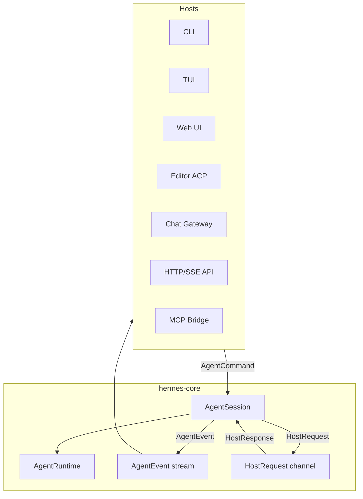

# daemon-core Host Interface Architecture

This note proposes a better abstraction for the boundary between `hermes-rs`
core and the outside world: CLIs, TUIs, web UIs, editor integrations, chat
gateways, API servers, MCP bridges, and other I/O surfaces.

It is written in response to the Python `hermes-agent` host contract documented
in `hermes-agent-host-interface.md`.

## Short Verdict

The Python interface is a **callback-in / `run_conversation()`-out** contract:

```text
host constructs AIAgent(callbacks...)
host calls run_conversation(...)
runtime calls positional callbacks
runtime returns a loose result dict
```

That worked for Python Hermes, but it is not the best abstraction for a Rust
port.

For `hermes-rs`, the better abstraction is a **typed bidirectional session
protocol**:

```text
Host -> Core: AgentCommand
Core -> Host: AgentEvent
Core -> Host -> Core: HostRequest / HostResponse
Core -> Host: TurnSummary
```

This keeps the core independent from any specific GUI or transport while making
streaming, lifecycle, approvals, blocking prompts, interrupts, steering, and
final results explicit.

## Why Not Copy The Python Callback Contract?

The Python host interface has real strengths:

- It is simple to embed.
- A CLI can pass a few callbacks and print output.
- A gateway can wrap the same callbacks in queues or RPCs.
- The runtime owns conversation state and returns a single result dict.

But it has drawbacks that Rust can avoid:

- Too many optional positional callbacks.
- No single typed event protocol on the live path.
- `None` is used as a segment-break sentinel in text streaming.
- Blocking host interactions are hidden as callbacks.
- Early error returns produce partial result dictionaries.
- Each surface has to adapt callback quirks independently.
- Agent initialization becomes aware of many host concerns.
- Multi-consumer event streaming is awkward.
- Tests need callback harnesses instead of a clean protocol transcript.

Rust should not preserve those accidental constraints.

## Design Goal

`hermes-core` should not know whether it is being driven by:

- a terminal CLI
- a Ratatui or Ink TUI
- a browser UI
- an editor ACP adapter
- a chat gateway
- an OpenAI-compatible HTTP/SSE API
- an MCP server
- an automation or SDK

The core should only know:

```text
I receive typed commands.
I emit typed events.
Sometimes I need a typed response from the host.
At the end of a turn I produce a typed summary.
```

Every surface becomes an adapter around that protocol.

## Proposed Boundary



The boundary has three message families:

1. `AgentCommand`
2. `AgentEvent`
3. `HostRequest` / `HostResponse`

The final turn result is a `TurnSummary`, not a loose dictionary.

## 1. Agent Commands

Commands are instructions from the host to the agent session.

They replace direct calls like `run_conversation(...)`, `interrupt()`,
`steer(...)`, `session.cwd.set`, and manual compression entry points.

Example:

```rust
pub enum AgentCommand {
    StartTurn {
        input: UserInput,
        options: TurnOptions,
        response: oneshot::Sender<Result<TurnSummary>>,
    },
    Interrupt {
        message: Option<String>,
    },
    Steer {
        text: String,
    },
    SetCwd {
        cwd: PathBuf,
    },
    Compress {
        mode: CompressionMode,
        response: oneshot::Sender<Result<CompressionSummary>>,
    },
    Resume {
        session_id: SessionId,
        response: oneshot::Sender<Result<()>>,
    },
    Shutdown,
}
```

The command layer gives every surface the same control vocabulary.

### Important Command Semantics

`StartTurn` starts exactly one user-visible turn. It should return quickly only
after the turn reaches a terminal state: completed, failed, interrupted, or
partial.

`Interrupt` asks the runtime to stop the active turn. It should flow into the
same cancellation token used by model calls and tools.

`Steer` is not the same as interrupt. It supplies mid-run user guidance that
the agent can inject at a safe boundary, such as the next tool observation.

`SetCwd` changes session execution context without requiring every host to know
how workspace resolution works.

`Compress` lets a host trigger manual or partial compaction using the same
context manager used by automatic compression.

## 2. Agent Events

Events are emitted by the core to describe what is happening.

They replace the Python callback bag:

- `stream_delta_callback`
- `interim_assistant_callback`
- `tool_progress_callback`
- `tool_start_callback`
- `tool_complete_callback`
- `tool_gen_callback`
- `thinking_callback`
- `reasoning_callback`
- `step_callback`
- `status_callback`
- `notice_callback`
- `notice_clear_callback`
- `background_review_callback`

Example:

```rust
pub enum AgentEvent {
    TurnStarted {
        turn_id: TurnId,
        session_id: SessionId,
    },
    ModelRequestStarted {
        attempt: u32,
        model: String,
        provider: String,
    },
    MessageStarted {
        message_id: MessageId,
        role: MessageRole,
    },
    MessageDelta {
        message_id: MessageId,
        text: String,
    },
    MessageSegmentEnded {
        message_id: MessageId,
    },
    AssistantMessage {
        message_id: MessageId,
        text: String,
        already_streamed: bool,
    },
    ReasoningDelta {
        text: String,
    },
    ToolCallStarted {
        call: ToolCallView,
    },
    ToolCallDelta {
        call_id: ToolCallId,
        preview: String,
    },
    ToolCallCompleted {
        call_id: ToolCallId,
        result: ToolResultView,
        duration_ms: u64,
    },
    ToolCallFailed {
        call_id: ToolCallId,
        error: ToolErrorView,
        duration_ms: u64,
    },
    Status {
        level: StatusLevel,
        text: String,
    },
    Notice {
        notice: Notice,
    },
    NoticeCleared {
        key: String,
    },
    Usage {
        usage: UsageSnapshot,
    },
    BackgroundReviewCompleted {
        message: String,
    },
    TurnCompleted {
        summary: TurnSummary,
    },
    TurnFailed {
        error: AgentErrorView,
    },
}
```

This removes sentinel values. A segment break is not `None`; it is
`MessageSegmentEnded`.

> **Note (structured operation payloads).** The canonical §17 surface (`daemon-protocol`, see
> [`daemon-core-spec.md`](daemon-core-spec.md) §17) carries an **opaque structured envelope** for
> transcript-grade rendering: `ToolDetail { kind, body }` on `ToolStarted`/`ToolFinished` (a tool's
> arguments object, a diff, a search-result list, an image), plus a tool-independent
> `ContentDelta { kind, body }` event for stream content not tied to a tool (a terminal/PTY stream
> under a reserved kind such as `"ansi-stream"` / `"pty"`, or a foreign agent's raw rendered output).
> The daemon never interprets the envelope — the brain (or a foreign-agent adapter) and the consuming
> GUI agree on the schema; the host/orchestrator/node surface pass it through untouched. A consumer
> reads the full stream verbatim through the node's per-unit rich drain (`unit_outbound`).

## 3. Host Requests And Responses

Some operations require the runtime to ask the host for input and wait.

In Python these are blocking callbacks or surface-specific approval queues:

- `clarify_callback`
- `read_terminal_callback`
- terminal approval
- edit approval
- sudo/password prompt
- secret prompt

In Rust they should be one typed request/response protocol.

```rust
pub enum HostRequest {
    Clarify {
        request_id: HostRequestId,
        question: String,
        choices: Vec<Choice>,
        timeout: Option<Duration>,
    },
    ReadTerminal {
        request_id: HostRequestId,
        start: Option<usize>,
        count: Option<usize>,
        timeout: Option<Duration>,
    },
    ApproveCommand {
        request_id: HostRequestId,
        command: String,
        risk: RiskReport,
        timeout: Option<Duration>,
    },
    ApproveEdit {
        request_id: HostRequestId,
        proposal: EditProposal,
        timeout: Option<Duration>,
    },
    RequestSecret {
        request_id: HostRequestId,
        key: String,
        prompt: String,
        timeout: Option<Duration>,
    },
}

pub enum HostResponse {
    Clarification(String),
    TerminalText(String),
    Approval(ApprovalDecision),
    Secret(SecretValue),
    Cancelled,
    TimedOut,
    Unsupported,
}
```

This lets every host decide how to answer:

- CLI prompts inline.
- TUI sends JSON-RPC request event and waits for response.
- Web UI opens a modal.
- ACP maps to editor permission requests.
- Chat gateway sends approval buttons or waits for a reply.
- Headless API can reject unsupported blocking requests or use configured
  policies.

## 4. Turn Summary

Python returns a dict with many possible keys, and some error paths return only
a subset. Rust should return a typed `TurnSummary`.

```rust
pub struct TurnSummary {
    pub session_id: SessionId,
    pub turn_id: TurnId,
    pub status: TurnStatus,
    pub final_response: Option<String>,
    pub last_reasoning: Option<String>,
    pub api_calls: u32,
    pub usage: Option<UsageSnapshot>,
    pub cost: Option<CostSnapshot>,
    pub model: ModelIdentity,
    pub messages_after_turn: Vec<MessageId>,
    pub guardrail: Option<GuardrailSummary>,
    pub pending_steer: Option<String>,
    pub interrupt_message: Option<String>,
    pub error: Option<AgentErrorView>,
}

pub enum TurnStatus {
    Completed,
    Partial,
    Failed,
    Interrupted,
    MaxIterations,
}
```

Hosts can still get the full transcript through `SessionStore` or explicit
commands, but the turn result itself should be compact and stable.

## 5. Agent Session As Actor

The cleanest Rust implementation is an actor-like session.

```rust
pub struct AgentHandle {
    command_tx: mpsc::Sender<AgentCommand>,
    event_tx: broadcast::Sender<AgentEvent>,
}

impl AgentHandle {
    pub async fn start_turn(
        &self,
        input: UserInput,
        options: TurnOptions,
    ) -> Result<TurnSummary>;

    pub async fn interrupt(&self, message: Option<String>) -> Result<()>;

    pub async fn steer(&self, text: String) -> Result<()>;

    pub fn subscribe(&self) -> broadcast::Receiver<AgentEvent>;
}
```

Internally:

```rust
pub async fn spawn_agent_session(
    runtime: AgentRuntime,
    host: Arc<dyn HostRequestHandler>,
) -> AgentHandle;
```

The session owns:

- active conversation state
- current cancellation token
- pending steer queue
- current working directory
- session id
- event broadcast
- command receiver

The runtime subsystems remain separate:

- model router
- prompt builder
- context manager
- tool pipeline
- memory service
- session store

## 6. Host Adapter Trait

Most hosts need two things:

1. Subscribe to events.
2. Answer blocking host requests.

```rust
#[async_trait]
pub trait HostRequestHandler: Send + Sync {
    async fn handle_request(&self, request: HostRequest) -> HostResponse;
}
```

For hosts that also want a bundled adapter:

```rust
#[async_trait]
pub trait HostAdapter: Send + Sync {
    async fn run(self, handle: AgentHandle) -> Result<()>;
}
```

The adapter should not be part of the agent core. It belongs in CLI/TUI/gateway
crates.

## 7. Surface Mapping

| Surface | Adapter responsibility |
|---------|------------------------|
| CLI | Print `AgentEvent`s, prompt inline for `HostRequest`s, call `start_turn`. |
| TUI | Map commands/events/requests to internal UI state and input widgets. |
| Web UI | Usually speak to a server adapter over WebSocket or SSE. |
| ACP editor | Convert events to ACP message/thought/tool updates; convert host requests to permission/edit prompts. |
| Chat gateway | Convert message/tool/status events to chat messages; convert approvals/clarify to platform interactions. |
| HTTP/SSE API | Convert REST calls to commands and stream `AgentEvent`s as SSE. |
| MCP bridge | Expose commands and session data as MCP tools/resources without embedding runtime policy. |

The core protocol stays the same.

## 8. Transport Encodings

The internal Rust protocol should be typed Rust enums. External transports can
encode the same protocol differently:

- CLI: direct function calls and stdout rendering.
- TUI/web control plane: JSON-RPC over WebSocket.
- HTTP API: REST command endpoints plus SSE event stream.
- ACP: ACP-specific method calls and permission requests.
- MCP: tools/resources that operate on sessions.

The important rule: transport schemas are adapters, not the core contract.

## 9. Event Stream Design Rules

Agent events should be:

- ordered per session
- assigned monotonically increasing sequence numbers by adapters that need them
- replayable from `SessionStore` where possible
- safe to ignore if a host does not care
- stable enough for UI clients to depend on
- expressive enough to avoid sentinel hacks

Useful common envelope:

```rust
pub struct AgentEventEnvelope {
    pub session_id: SessionId,
    pub turn_id: Option<TurnId>,
    pub seq: u64,
    pub timestamp: SystemTime,
    pub event: AgentEvent,
}
```

The core can emit raw `AgentEvent`; transport adapters can add envelopes.

## 10. Blocking Request Design Rules

Host requests should be:

- explicitly typed
- cancelable
- timeout-aware
- correlated by request id
- surface-independent
- able to return `Unsupported`

The core must never assume that a host can display a modal or read stdin. A
headless server may reject a blocking request and let policy decide whether the
turn fails, defaults, or asks the model to proceed differently.

## 11. Relationship To Tool Pipeline

Host requests should be used by the tool pipeline for human-in-the-loop actions:

- command approval
- edit approval
- secret prompt
- clarify
- terminal scrollback

The tool pipeline should not know whether the request is answered by a TUI,
editor, chat platform, or API client. It should only wait on `HostResponse`.

## 12. Relationship To Session Store

The host interface should not return full mutable conversation state after every
turn. Instead:

- `TurnSummary` returns stable metadata and final state.
- `AgentEvent`s stream live behavior.
- `SessionStore` provides transcript retrieval, search, resume, and replay.

This avoids Python's loose `messages` field becoming the primary host data
contract.

## 13. Relationship To MCP

The MCP server should be a host adapter or session-data bridge, not a special
case inside the runtime.

Possible MCP tools:

- `session_start_turn`
- `session_interrupt`
- `session_steer`
- `session_events_read`
- `session_messages_read`
- `host_request_respond`

The same commands/events/requests apply.

## 14. Minimal MVP

A minimal version for `hermes-rs` does not need every event on day one.

Start with:

```rust
pub enum AgentCommand {
    StartTurn { input: UserInput, response: oneshot::Sender<Result<TurnSummary>> },
    Interrupt { message: Option<String> },
    Steer { text: String },
    Shutdown,
}

pub enum AgentEvent {
    MessageDelta { text: String },
    ReasoningDelta { text: String },
    ToolCallStarted { name: String, arguments: String },
    ToolCallCompleted { name: String, result: String },
    Status { text: String },
    TurnCompleted { summary: TurnSummary },
    TurnFailed { error: AgentErrorView },
}

pub enum HostRequest {
    Clarify { request_id: HostRequestId, question: String, choices: Vec<Choice> },
    ApproveCommand { request_id: HostRequestId, command: String, risk: RiskReport },
}
```

Keep `request_id` even in the MVP. It is the only thing that makes concurrent
blocking requests routable, and the moment tools run in parallel (the Python
runtime dispatches up to 8 tool workers) two approvals can be outstanding at
once. Dropping the id only works if the MVP also declares tool execution
strictly sequential.

Then grow the protocol as surfaces need it.

## 15. Open Questions And Semantics To Pin Down

> **Superseded — resolved in [`daemon-core-spec.md`](daemon-core-spec.md) §17.1.** This section is
> retained for historical context, but every open question below is now decided in the authoritative
> engine spec; where they differ, **§17.1 wins**:
> - §15.1 event delivery / `broadcast` lossiness → §17.1 item 1: **lossless-primary** with monotonic
>   `seq`; lossy live transports must **resync from the last acked `seq`** via `SessionStore`.
> - §15.2 channel vs trait → §17.1 item 2: commit to the **`HostRequestHandler` trait** for blocking
>   requests; events stay a streaming sink.
> - §15.3 request correlation / typed responses → §17.1 item 3: **mandatory `request_id`** + typed
>   per-kind responses.
> - §15.4 busy / queue for a second turn → §17.1 item 4: **reject / queue / steer** trichotomy.
> - §15.5 background completions that start a turn → §17.1 item 5: **`BackgroundCompletion` as a
>   durable wake** that causes rehydration.
> - §15.6 smaller semantics (`TurnSummary` authority, steer ack) → §17.1 item 6.

```
Read it. Strong direction overall — this is the right instinct for Rust, and it's a genuine improvement over porting the callback bag. But there are a handful of real gaps I'd want resolved before anyone builds it. My perspective, grounded against both the Python contract and the rest of your redesign docs:

## Where it's right

- **Typed command/event/request triad over a callback bag.** This is the correct call. It removes the `None` segment-break sentinel (→ `MessageSegmentEnded`), kills the partial-dict problem (→ `TurnSummary` + `TurnStatus`), and makes the boundary testable by scripting a transcript. That last point is the strongest single argument and it's real.
- **Unifying blocking I/O into `HostRequest`/`HostResponse`.** The Python side genuinely hides these — `clarify_callback`/`read_terminal_callback` are blocking callbacks, while terminal/edit/secret approval are *separate* surface-specific queues. Collapsing them into one typed, timeout-aware, `Unsupported`-capable protocol is the biggest concrete win here, and it composes cleanly with the tool-pipeline cancellation token from your parity map.
- **MCP as an adapter, not a runtime special-case** (§13) directly fixes the oddity I flagged in the Python doc, where `mcp_serve.py` bridges messaging data rather than the loop.
- **Pushing transcript/`messages` to `SessionStore`** (§12) keeps `AgentCommand` from bloating and avoids the loose-`messages`-field-as-contract trap.

## The gaps I'd push on (roughly prioritized)

1. **`broadcast` is lossy — that contradicts the event-stream rules.** `tokio::sync::broadcast` (§5) drops messages for slow receivers (`RecvError::Lagged`). For a token delta stream feeding a slow WebSocket, that means **silently missing `MessageDelta`s**. Yet §9 wants events "ordered" and "stable enough for UI clients to depend on." Those can't both be true over raw broadcast. You need to decide explicitly: events are best-effort + reconcile against `SessionStore` (then UIs must tolerate gaps), *or* per-subscriber buffered/backpressured channels (then a stalled host can stall the turn). This tension is unaddressed and it's the most important one.

2. **Channel vs trait for host requests — pick one.** The mermaid shows a `HostRequest`/`HostResponse` *channel*; §6 defines a `HostRequestHandler` *trait* the core calls directly. These are different architectures. The trait (core awaits `handle_request` inline, with cancellation) is cleaner and I'd commit to it — but then the request channel in the diagram is misleading and should go.

3. **`request_id` is mandatory, not optional — and the MVP drops it.** §3 correctly correlates by `request_id`, but the §14 MVP `HostRequest` removes it. The moment tools run in parallel (Python runs up to 8 workers), two approvals can be in flight at once, and a flat `HostResponse` with no id can't be routed. Either the MVP keeps `request_id`, or it must also declare tools strictly sequential. Relatedly, the flat `HostResponse` enum lets a `Secret` answer a `Clarify` request — type-safe-at-compile would be per-request `oneshot<SpecificResponse>`; the flat enum reintroduces a runtime check.

4. **Busy/queue semantics are missing.** This design models `Steer` and `Interrupt` but not "user sends input while a turn is running." The Python side solved exactly this with the `busy_input_mode` trichotomy (interrupt / queue / steer) plus pending-message slots and FIFO overflow. Here, `StartTurn` "returns only after terminal state" — so what happens to a *second* `StartTurn` arriving mid-turn? Rejected? Queued? The actor channel serializes it, but the semantics need to be stated, because that's a primary GUI behavior.

5. **Background completions can't start a turn.** Python delivers async-delegation and process completions as *new idle turns* via the shared completion queue. In this model events flow core→host, but starting a turn is host→core. So who issues the follow-up `StartTurn` when a background sub-agent finishes? Either the host observes a `BackgroundCompletion` event and re-issues `StartTurn`, or the core self-initiates — and the doc has `BackgroundReviewCompleted` as an event but doesn't model delegation-completion-as-turn at all. Needs a decision.

## Smaller notes

- **`Steer -> Result<()>` loses information.** Python's `steer()` returns `bool` (rejected if no active turn). With no response channel the host can't learn the steer was dropped; consider an ack or an event.
- **Double-delivery of `TurnSummary`** — it's both the `StartTurn` oneshot return *and* the `TurnCompleted` event payload. Fine, but state which is authoritative so hosts don't double-handle.
- **Wire versioning.** Once `AgentEvent` is serialized over SSE/JSON-RPC it's a compatibility contract. "Grow the protocol as surfaces need it" needs `#[non_exhaustive]` + a serde tagging/versioning policy, or you'll break UI clients.
- **Keep think-scrubbing core-side.** Confirm the core scrubs `<think>`/memory tags before emitting `MessageDelta` (with `ReasoningDelta` as the separate channel it already has), so every adapter benefits rather than each re-implementing it.

## Bottom line

The abstraction is correct and consistent with the rest of your redesign (typed `Conversation`, `SessionStore`, cancellation-aware tool pipeline) — I'd adopt the command/event/request/`TurnSummary` shape. The work that's actually load-bearing isn't the enums; it's the four semantic questions the doc currently glosses: **event-delivery guarantees, the channel-vs-trait decision, concurrent-request correlation, and busy/queue + background-completion turn initiation.** Nail those and this is a solid foundation; ship the enums without them and you'll rediscover the same races the Python gateway already paid for.

If it's useful, I can fold these into the doc as an "Open questions / semantics to pin down" section (and tighten the MVP to keep `request_id`) — say the word and I'll edit it.
```

The enums above are the easy part. The load-bearing decisions are the semantics
the protocol implies but does not yet specify. These should be resolved before
building, because each one maps to a race the Python gateway already paid for.

### 15.1 Event delivery guarantees vs `broadcast` lossiness

`tokio::sync::broadcast` (Section 5) drops messages for slow receivers
(`RecvError::Lagged`). For a `MessageDelta` token stream feeding a slow
WebSocket, that means **silently missing deltas** — which conflicts with the
Section 9 rules that events be "ordered" and "stable enough for UI clients to
depend on." These cannot both hold over raw broadcast. Decide explicitly:

- **Best-effort + reconcile:** events are lossy and UIs reconcile against
  `SessionStore` (then "stable enough to depend on" must be softened, and clients
  need a resync path keyed on `seq`), or
- **Per-subscriber buffered/backpressured channels:** delivery is lossless but a
  stalled host can apply backpressure to the turn (then define the stall policy:
  drop the subscriber, time it out, or block).

This is the single most important open question.

### 15.2 Channel vs trait for host requests

The boundary diagram shows a `HostRequest`/`HostResponse` **channel**; Section 6
defines a `HostRequestHandler` **trait** the core calls directly. These are
different architectures. Commit to one. The trait (core `await`s
`handle_request` inline, integrated with the turn cancellation token) is simpler
and composes with cancellation; if it is chosen, drop the request channel from
the diagram to avoid implying both.

### 15.3 Concurrent request correlation and response typing

With parallel tools, multiple `HostRequest`s are outstanding at once, so
`request_id` correlation is mandatory (see Section 14). Separately, the flat
`HostResponse` enum lets a `Secret` answer a `Clarify` — a type mismatch the core
must check at runtime. A more type-safe alternative pairs each request with its
own `oneshot::Sender<SpecificResponse>` so the wrong variant is unrepresentable.
Choose flat-enum-plus-runtime-check or per-request typed responses.

### 15.4 Busy / queue semantics for a second turn

The protocol models `Steer` and `Interrupt` but not "host submits input while a
turn is running." The Python side solved this with the `busy_input_mode`
trichotomy (interrupt / queue / steer) plus a pending-message slot and FIFO
overflow. Define what a second `StartTurn` arriving mid-turn does: reject,
queue, or coalesce. The actor command channel serializes it for free, but the
**policy** still has to be stated, because it is a primary GUI behavior.

### 15.5 Background completions that must start a turn

Python delivers async sub-agent and process completions as **new idle turns**
via a shared completion queue. In this model events flow core to host, but
*starting* a turn flows host to core, so something must bridge the two. Decide
whether the host observes a completion event (e.g. `BackgroundCompletion`) and
re-issues `StartTurn`, or the core self-initiates a follow-up turn.
`BackgroundReviewCompleted` exists as an event today, but delegation completion
as a new turn is not yet modeled.

### 15.6 Smaller semantics

- **`Steer` ack.** Python's `steer()` returns `bool` (rejected when no turn is
  active). `Steer { text }` has no response channel, so the host cannot learn it
  was dropped. Add an ack (response channel or event).
- **`TurnSummary` is delivered twice** — as the `StartTurn` oneshot return and as
  the `TurnCompleted` event payload. State which is authoritative so hosts do not
  double-handle.
- **Wire versioning.** Once `AgentEvent` is serialized over SSE/JSON-RPC it is a
  compatibility contract. "Grow the protocol as surfaces need it" needs
  `#[non_exhaustive]` plus a serde tagging/versioning policy, or new variants
  break existing UI clients.
- **Keep tag-scrubbing core-side.** The core should strip `<think>`/memory tags
  before emitting `MessageDelta` (with `ReasoningDelta` as the separate channel it
  already defines), so every adapter benefits instead of re-implementing it.
- **Read-only session ops belong in `SessionStore`, not `AgentCommand`.** Things
  like title/usage/status/history/undo (the tui_gateway `session.*` surface) are
  queries, not agent control. Keeping them out of `AgentCommand` is what prevents
  the command enum from becoming the very callback-bag-equivalent this design
  rejects.

## Final Recommendation

`hermes-rs` should use a **typed actor/session boundary**, not a Python-style
callback bag.

The durable abstraction should be:

```text
AgentCommand in
AgentEvent out
HostRequest / HostResponse for blocking I/O
TurnSummary as final result
SessionStore for transcript and replay
```

This gives every GUI and I/O surface the same contract while keeping
`hermes-core` independent from any particular host. It also makes the boundary
testable: a unit test can send commands, script host responses, and assert the
event transcript without booting a CLI, WebSocket server, editor adapter, or
chat gateway.
