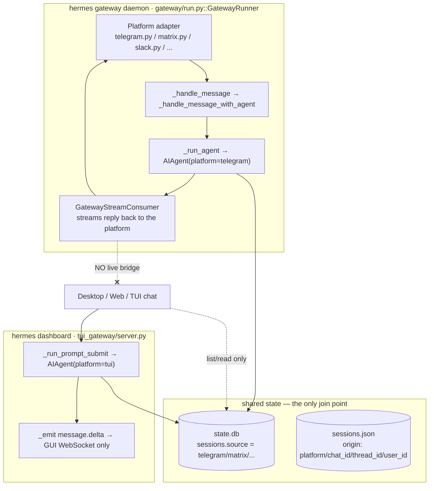
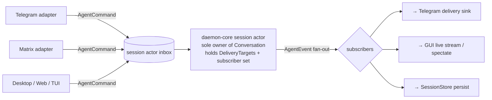

# daemon-core Messaging Surface: One Conversation Across Platforms and GUIs

How to architect the boundary between **protocol chats** (Telegram, Matrix, Slack, Discord, …)
and **Hermes chat sessions** (the GUI/TUI conversation) in the Rust rewrite, so that a platform
conversation can be **surfaced** (watched live), **proxied** (driven from the GUI), and treated as
**one conversation with many attached transports** rather than two disconnected pipelines.

The motivating problem: in `hermes-agent` today there is **no way to surface or proxy messages
from a protocol chat through to a chat session**. This document first maps *why* (the current
two-engine split, which is otherwise undocumented), then proposes the Rust model.

Companion to [daemon-core-host-interface.md](daemon-core-host-interface.md) (the typed
command/event/request boundary), [daemon-core-runtime-model.md](daemon-core-runtime-model.md) (the
session actor + effects), and [daemon-core-gui-surfaces.md](daemon-core-gui-surfaces.md) (embeddable
core, thin shells). Current-state citations are to the Python source mapped in
[hermes-gui-surfaces.md](../../../../docs/research/hermes/hermes-gui-surfaces.md) and
[hermes-agent-runtime-adjacent.md](../../../../docs/research/hermes/hermes-agent-runtime-adjacent.md).

> **Status — downstream / deferred.** The messaging gateway / platform fan-out is **out of scope**
> for the current in-process `daemon-core` + `daemon-host` vertical slice and is explicitly deferred
> (see [daemon-core-spec.md](daemon-core-spec.md) §1.2 non-goals). Nothing here is committed; it is
> the direction for a later track. The event-delivery model below is aligned to the authoritative
> lossless-primary + `seq`-resync rules now pinned in [daemon-core-spec.md](daemon-core-spec.md)
> §17.1.

---

## 1. The problem in one sentence

A protocol chat and a GUI chat are, today, **two separate turn engines in two separate processes
that only share a database** — so the GUI can *list and read* a Telegram conversation but cannot
*watch it live*, cannot *reply into it*, and is never the same "active turn" as the gateway.

---

## 2. Current state: two turn engines, one database

Hermes has two independent pipelines that both construct an `AIAgent`, run a turn, and persist to
the same store — but never exchange live events.



### 2.1 The inbound platform flow (gateway side)

1. **Receive + normalize.** A platform adapter (`gateway/platforms/*.py`, all extending
   `BasePlatformAdapter` in `base.py`) receives a message and builds a `MessageEvent` carrying a
   `SessionSource` (`gateway/session.py`): `platform`, `chat_id`, `chat_type` (`dm`/`group`/
   `channel`/`thread`), `thread_id`, `user_id`, `message_id`, media, reply anchors.
2. **Route to a session.** `build_session_key(source, …)` (`gateway/session.py`) deterministically
   maps the tuple to a stable key:
   - DM: `agent:main:telegram:dm:123456789` (optionally `:{thread_id}` for a DM topic lane)
   - Group (per-user default): `agent:main:telegram:group:-100123:987654321`
   - Shared forum topic / Matrix thread: `agent:main:matrix:group:!room:host:$eventId`
   `SessionStore.get_or_create_session()` mints a transcript `session_id`
   (`YYYYMMDD_HHMMSS_8hex`) and persists the `origin` dict in `sessions.json`.
3. **Gate + run.** `GatewayRunner._handle_message` applies auth (`authz_mixin`, pairing,
   allowlists), then `_handle_message_with_agent` builds session context, loads transcript, and
   `_run_agent` constructs an `AIAgent` **with `platform=telegram`** and the chat/thread/user IDs.
4. **Deliver back to the platform.** `GatewayStreamConsumer` (+ `stream_dispatch`/`stream_events`)
   streams partial/final output **to the originating platform** via the adapter's `send*` methods.
   Mid-turn input is handled by busy/queue/steer (see
   [runtime-adjacent §4](../../../../docs/research/hermes/hermes-agent-runtime-adjacent.md)).

### 2.2 The GUI flow (dashboard side)

Desktop/web/TUI chat talk to **`tui_gateway`** (in-process in `hermes dashboard`, or spawned for
the Ink TUI). A GUI turn calls `session.resume` then `prompt.submit` →
`tui_gateway/server.py::_run_prompt_submit`, which constructs an `AIAgent` **with `platform=tui`**
and `_emit`s `message.delta` events **only to the GUI WebSocket**. It does **not** load the
session's `origin` and does **not** invoke any platform adapter.

### 2.3 What the GUI can and cannot see

- **Can:** list, label, search, open, and read platform sessions — they are first-class rows in
  the shared `state.db` (`sessions.source` ∈ `telegram`, `matrix`, …; surfaced via
  `apps/desktop/src/lib/session-source.ts` `MESSAGING_SESSION_SOURCE_IDS` and `/api/sessions`).
- **Cannot:** watch an in-progress platform turn, or reply into the platform from the GUI.

### 2.4 What `mirror.py` is (and is not)

`gateway/mirror.py::mirror_to_session` appends a *"this is what I sent"* assistant annotation to a
target session's transcript after the **`send_message` tool** fires — outbound delivery context,
DB-only, not live, inbound-blind, and explicitly **not** used for cron. It is frequently mistaken
for surfacing; it is not.

---

## 3. The four gaps

| Desired | Current reality | Structural root cause |
| --- | --- | --- |
| **Surface** — watch an in-progress Telegram/Matrix turn live in the GUI | Refresh / re-open only | `GatewayStreamConsumer` streams to the *platform*; nothing publishes to `tui_gateway`/GUI |
| **Proxy** — type in the GUI on a Telegram session and have the reply go to Telegram | Reply lands only in the local transcript | `_run_prompt_submit` hardcodes `platform=tui` and never loads the session `origin` routing |
| **Single conversation** — GUI + platform participants on one safe active turn | Two processes append to one DB; races mitigated by cache invalidation | No single owner / single active turn for a session |
| **Real-time inbound** — a Matrix message appears in the GUI instantly | Poll / refresh only | No event fan-out; the database is the only join point |

These are not four features; they are four symptoms of one fact: **delivery and "which platform"
are baked into how each host builds the agent, and each host owns its own turn loop.**

> Related but distinct: there is no `gateway/platforms/discord.py` — Discord is a *plugin*
> (`plugins/platforms/discord/`). That is the redesign's "breadth out-of-process via plugins/MCP"
> instinct already in play, and it is orthogonal to the surfacing problem.

---

## 4. Why the docs you have don't cover this

- [hermes-agent-runtime-adjacent.md](../../../../docs/research/hermes/hermes-agent-runtime-adjacent.md) maps the **completion-queue
  rail** for background delegation (§6) and **Telegram topic bindings** (§7.5) — adjacent, but not
  the platform-ingest → session → GUI bus.
- [hermes-agent-host-interface.md](../../../../docs/research/hermes/hermes-agent-host-interface.md) maps the **agent callback
  boundary** the gateway sits *behind* — not platform routing or GUI surfacing.

The messaging bus itself is undocumented; §2 above is the missing map.

---

## 5. The Rust model: one session actor, typed event fan-out, delivery as a session property

The fix falls directly out of the three commitments we have already written down. The key inversion:

> **A "platform" is not how the agent is constructed — it is a transport attached to a session.
> The session actor emits typed `AgentEvent`s to a *subscriber set*; the platform adapter and the
> GUI are both just subscribers. Where a reply is delivered is a property of the session, not of
> the caller.**



### 5.1 Three changes vs the Python design

| Python today | Rust target | From |
| --- | --- | --- |
| `AIAgent(platform="telegram")` vs `platform="tui")` — platform baked into construction; delivery is a hidden side effect inside each host | The agent emits `AgentEvent`s; **delivery is a subscriber set, not a constructor arg** | host-interface §15.1 (event fan-out / delivery guarantees) |
| Reply destination derived from *how the agent was built* | **`DeliveryTarget`s are a property of the session**, populated from `origin`; "send to Telegram" / "emit to GUI" are `Effect`s dispatched to registered sinks | runtime-model Commitment 3 (effects as values) |
| Two processes, two turn loops, DB-as-IPC | **One session actor is the sole writer**; every adapter and the GUI send `AgentCommand`s to the same inbox; the messaging gateway and GUI server embed the *same core* | runtime-model Commitment 1 + gui-surfaces (embeddable core) |

### 5.2 The three asks become one mechanism

- **Surface** = the GUI subscribes to a platform session's `AgentEvent` stream (a read-only
  spectator sink). Live tokens/tools appear because it is the *same* stream the Telegram sink
  consumes — no second pipeline.
- **Proxy / take over** = the GUI sends `AgentCommand::StartTurn` / `Steer` to the same actor. The
  session's `DeliveryTarget`s already include Telegram, so the reply is delivered there *and*
  rendered in the GUI.
- **One conversation** = there was only ever one session actor and one event stream; "which
  platform" is just which sinks are attached. Multi-writer safety is the existing busy/queue/steer
  policy (host-interface §15.4), now first-class because all input funnels through one inbox.

### 5.3 Sketch

```rust
/// Where a session's output should be delivered. Owned by the session, not the caller.
struct DeliveryTarget {
    transport: TransportId,          // telegram / matrix / slack / gui / api / ...
    route: RouteAddr,                // chat_id, thread_id, user_id (the old `origin`)
    kind: SinkKind,                  // Primary (drives replies) | Spectator (read-only)
}

/// A sink renders AgentEvents for one attached surface.
#[async_trait]
trait DeliverySink: Send + Sync {
    fn id(&self) -> SinkId;
    async fn deliver(&self, ev: &AgentEvent) -> Result<()>;   // Telegram send / GUI push / persist
}

// The session actor (sole owner — runtime-model Commitment 1):
//   owns:   Conversation, Vec<DeliveryTarget>, subscriber set of DeliverySink
//   inbox:  mpsc<AgentCommand>           // from Telegram adapter, Matrix adapter, GUI, ...
//   out:    AgentEvent fan-out to every subscribed sink
//   effects: Effect::Deliver{ target, event } applied to the matching sink(s)
```

Inbound symmetry: a platform adapter and the GUI both translate their native input into
`AgentCommand::StartTurn { input, … }` (or `Steer`/`Interrupt`) against the same session inbox. The
adapter is a thin translator (host-interface §6–7), not a turn engine.

### 5.4 Spectator vs primary, and concurrency

- A session has at most one **primary** delivery target driving user-visible replies, plus any
  number of **spectator** sinks (GUI watching, audit, a second platform mirror).
- "Take over from the GUI" = promote the GUI to primary (or add it as an additional primary) for
  the next turn; the platform stays a spectator or co-primary per policy.
- Concurrent input from platform + GUI is resolved by the **busy/queue/steer** policy at the
  single inbox — the cross-process race in the Python design cannot occur because there is no
  second writer.

### 5.5 Delivery guarantees (the load-bearing detail)

Surfacing follows the event-delivery model now resolved in
[daemon-core-spec.md](daemon-core-spec.md) §17.1 item 1 (which supersedes host-interface §15.1): a
raw lossy `broadcast` would drop deltas to a slow GUI spectator, so instead: 

- **Primary platform sinks** should be lossless/backpressured (a dropped Telegram delta is a bug).
- **Spectator GUI sinks** may be best-effort **with resync**: each `AgentEvent` carries a
  monotonic `seq` (host-interface §9 envelope), and a lagging GUI reconciles against `SessionStore`
  on a gap. This keeps a slow watcher from stalling a live platform turn while still letting it
  catch up.

---

## 6. What this buys us

- **Surfacing and proxying are the same primitive** — subscribe to / command a session actor — not
  two new subsystems.
- **No messaging-gateway/dashboard split.** Both are adapters embedding one core (gui-surfaces
  doc); `state.db`/`sessions.json`-as-IPC disappears, and with it the cache-invalidation dance.
- **`origin` becomes load-bearing in one place** (the session's `DeliveryTarget`s) instead of
  being stored in `sessions.json` but ignored by `tui_gateway`.
- **`mirror.py` is unnecessary** — "what was sent" is just the event history every sink already
  saw, persisted once by the store sink.

---

## 7. Open questions to pin down (before building)

1. **Primary handover policy.** When the GUI takes over a platform session, does the platform
   remain a co-primary (replies go to both) or drop to spectator? Per-session config vs per-turn.
2. **Authorization across transports.** A platform session is gated by platform allowlists/pairing;
   a GUI spectator/primary must be gated by the local/remote auth model. Define how a GUI user is
   authorized to drive a platform-origin session.
3. **Spectator delivery contract.** Confirm best-effort + `seq` resync for GUI watchers vs
   lossless for primary platform sinks (host-interface §15.1).
4. **Inbound attribution in shared sessions.** Group/multi-user sessions prefix `[user_name]`
   today; define how GUI-injected turns are attributed in a shared platform session.
5. **Interrupt/cancel reach.** A GUI `Interrupt` must reach a turn that may have been started by a
   platform message — trivial with one actor, but the cancellation token wiring must be the
   session's, not the caller's.

---

## 8. One-line summary

Today a protocol chat and a GUI chat are two turn engines sharing a database, so platform
conversations can be read but never watched live or replied into from the GUI. In the Rust model
there is **one session actor** per conversation; **platforms and GUIs are interchangeable sinks and
command sources**, and **delivery routing is a property of the session** — which turns "surface",
"proxy", and "one unified conversation" into a single subscribe-and-command primitive instead of a
missing feature.
