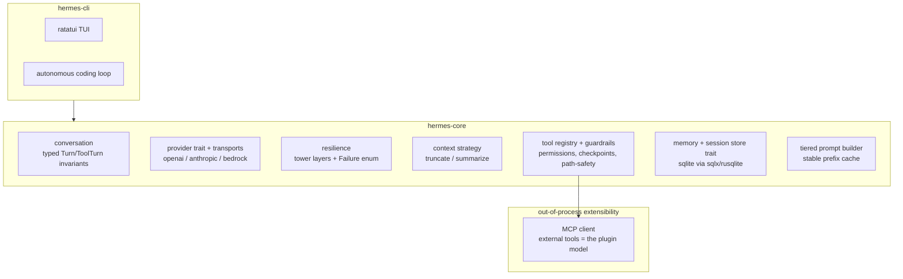

# A Better Rust Hermes: Redesign Proposal

What a stronger Rust implementation of Hermes would look like, and what should be done
differently from the current [`hermes-rs/`](hermes-rs/). Grounded in the analysis in
[hermes-rs-vs-hermes-agent.md](../../../../docs/research/hermes/hermes-rs-vs-hermes-agent.md) and
[hermes-agent-architecture.md](../../../../docs/research/hermes/hermes-agent-architecture.md).

---

## 1. Scoping stance (this changes everything)

- **The wrong goal:** a 1:1 faithful port of all of `hermes-agent` (29 providers, ~25 chat
  platforms, in-process plugin zoo, web/desktop). That chases breadth Rust is bad at and
  Python already does well.
- **The right goal:** a focused, *resilient*, *correct-by-construction* agent core + coding
  CLI that treats the things Python learned the hard way (resilience, untrusted output,
  context management) as first-class, and pushes breadth (extra tools, platforms)
  **out-of-process via MCP**. This is also where `hermes-rs` is already heading (autonomous
  coding).

Everything below targets the second goal.

> **Thesis:** A better Rust Hermes doesn't out-feature the Python — it **moves Python's
> hardest runtime problems into the type system and the middleware stack**. Illegal
> conversations become unrepresentable, the error taxonomy becomes an exhaustive enum,
> resilience becomes composable layers shipped by default, and breadth is delegated to MCP
> instead of reimplemented in-process. That is smaller than Python *and* more robust than
> `hermes-rs`.

---

## 2. The five things `hermes-rs` got wrong (and the better answer)

### 2.1 Tool-calling: native-first, XML as a negotiated fallback

**Problem:** `hermes-rs` makes the XML `<tool_call>` text format the *primary* path, which
reintroduces exactly the parsing fragility Python avoids — while shipping *less* repair logic
than Python (no arg-JSON repair, no hallucinated-name recovery). Its architecture and its
omissions actively conflict.

**Better:** make tool calls a **canonical internal type** with per-provider encode/decode,
and let capability negotiation pick the wire format.

```rust
enum ToolCallFormat { Native, AnthropicToolUse, HermesXml }

trait Provider {
    fn capabilities(&self) -> Capabilities; // supports_native_tools, streaming, ...
    async fn chat(&self, req: ChatRequest) -> Result<ChatResponse>;
    fn stream(&self, req: ChatRequest) -> BoxStream<'static, Result<StreamEvent>>;
}
```

XML parsing + tolerant arg repair then runs **only** for models that cannot do native
function calling (the actual Hermes open models). For GPT/Claude-class models you use
structured `tool_calls`, and the whole class of malformed-tag / malformed-JSON bugs
disappears.

### 2.2 Make illegal conversations unrepresentable

**Problem:** Python spends ~444 lines in `message_sanitization.py` plus chunks of
`agent_runtime_helpers.py` repairing role alternation, orphaned tool results, and
thinking-only turns *at runtime, before every call*. That whole category exists because the
conversation is a loose `list[dict]`.

**Better:** encode the invariants in the type system so they cannot be violated.

```rust
// A tool turn groups an assistant message with its tool calls AND their results.
struct ToolTurn { assistant: AssistantMsg, calls: Vec<(ToolCall, ToolResult)> }
enum Turn { User(UserMsg), Tool(ToolTurn), Assistant(AssistantMsg) }
struct Conversation { system: SystemPrompt, turns: Vec<Turn> }
```

If a `ToolCall` cannot exist without its `ToolResult` slot, you *cannot* produce an orphaned
tool result. Compaction operates on `Turn`s, so it can never split a tool-call/result pair
(the thing Python's `_align_boundary_backward` does manually). This is the single biggest
leverage point Rust has over Python: **replace runtime repair with compile-time
impossibility.**

### 2.3 Resilience is the product — model it as typed middleware

**Problem:** Python's resilience is a ~2,400-line inline retry block. `hermes-rs` ships
essentially none of it (a client error propagates up and ends the run; no retry, no backoff,
no stale-stream timeout).

**Better:** the error taxonomy (Python's `FailoverReason`) becomes a Rust enum where the
compiler *forces* handling of every case, and recovery becomes a composable middleware stack.

```rust
enum Failure {
    RateLimit { retry_after: Option<Duration> },
    Billing, Auth, ContextOverflow, ContentFilter, Transient, Fatal(String),
}

fn recovery(f: &Failure) -> Recovery { /* exhaustive match — cannot forget a case */ }
```

Build recovery as a `tower`-style Service/Layer stack wrapping the provider, instead of inline
branching:


Each concern is an independent, unit-testable layer; the loop stays tiny. Crucially,
**retry/backoff and stale-stream timeouts ship in v1** — they are not multi-provider
luxuries, they are what the unattended autonomous mode needs to survive a single 429 or a
wedged SSE stream.

### 2.4 Context: a `ContextStrategy` trait with real summarization

**Problem:** `hermes-rs` only truncates (drops oldest), silently discarding the original task
definition and early decisions in long coding sessions.

**Better:** a strategy trait with summarization as the default.

```rust
trait ContextStrategy {
    async fn fit(&self, conv: &Conversation, budget: Tokens) -> Conversation;
}
struct DropOldest;                            // current behavior, fine for one-shot
struct Summarize { aux: Arc<dyn Provider> };  // LLM summary of middle turns
```

Because it operates on `Turn`s, head/tail protection and pair integrity are structural, not
hand-rolled. Add anti-thrashing (skip if last passes saved <10%) and preflight + mid-turn
triggers.

### 2.5 Stop rebuilding the system prompt every turn

**Problem:** `hermes-rs` reassembles the prompt each turn, defeating upstream prompt caching.

**Better:** adopt Python's tiered model explicitly — a `StablePrefix` (identity + tools +
skills index) built once and held byte-stable, plus a `Volatile` suffix (memory snapshot,
timestamp) rebuilt only on compaction. Cache the rendered prefix on the agent.

---

## 3. What `hermes-rs` got right — keep it

- Trait-based `HermesTool` registry + `schemars` schema generation. Clean and idiomatic.
- Two-crate split (`core` lib vs `cli`), `tokio`, `tracing`.
- Pair-preserving compaction grouping (good instinct — promote it into the type system).
- Auth profiles that reference env vars instead of storing secrets.

---

## 4. Proposed module shape



### Structural decisions beyond the five pillars

- **Extensibility via MCP, not in-process plugins.** Python's plugin zoo is hard to replicate
  safely in Rust (no easy dynamic loading). MCP is *already* an out-of-process plugin
  protocol — lean on it. In-process stays trait-based and compile-time.
- **Agent as an actor.** Instead of `Arc<RwLock<Vec<Message>>>` shared mutability, give the
  agent a single owning task with an `mpsc` command channel (`Run`, `Steer`, `Interrupt`).
  This makes mid-run steering and interrupts (which Python handles with flags + locks) natural
  and race-free.
- **Session store behind a trait**, default `rusqlite`/`sqlx` with FTS5 — gives resume +
  search that `hermes-rs` lacks entirely, without coupling the core to SQLite.
- **Tool guardrails + file-safety + checkpoints in v1**, because the autonomous mode is
  unattended. A `ToolGuard` middleware (loop detection, path denylist for `.ssh`/`.env`,
  snapshot-before-mutate) wrapping the registry.
- **Deterministic replay testing.** Record provider responses to fixtures and replay them to
  test the loop and resilience layers without a live model. Rust's trait mocking + serde make
  golden-trajectory tests trivial — this is how you actually verify the middleware stack.

---

## 5. Suggested phasing

1. **Typed conversation core** (`Turn`/`ToolTurn`/`Conversation`) + canonical `Message`/
   `ToolCall`/`StreamEvent` model. Everything else builds on this.
2. **Provider trait + 1–2 transports** (OpenAI-compatible first, then Anthropic native) with
   capability negotiation and native-first tool calling.
3. **Resilience middleware** (timeout + stale-stream watchdog, retry/backoff, then fallback /
   credential layers) with the `Failure` enum.
4. **Context strategy** (truncate -> summarize with aux provider), operating on `Turn`s.
5. **Tool guardrails + session store** for safe unattended autonomous runs.
6. **Tiered prompt + prefix caching.**
7. **Deterministic replay test harness** throughout (not last — wire it in from step 1).

---

## 6. The inversion, summarized

`hermes-rs` today is **XML-first, resilience-optional, breadth-via-config**. The redesign
inverts each:

- XML-first -> **native-first** (XML only when negotiated).
- Resilience-optional -> **resilience shipped by default as typed middleware**.
- Runtime message repair -> **compile-time invariants** (illegal states unrepresentable).
- Truncation -> **summarization strategy**.
- In-process breadth -> **out-of-process via MCP**.

The result is smaller than Python (it skips the multi-provider fleet and platform zoo) while
being more robust than the current `hermes-rs` (it treats untrusted output and flaky networks
as the normal case, which they are).
