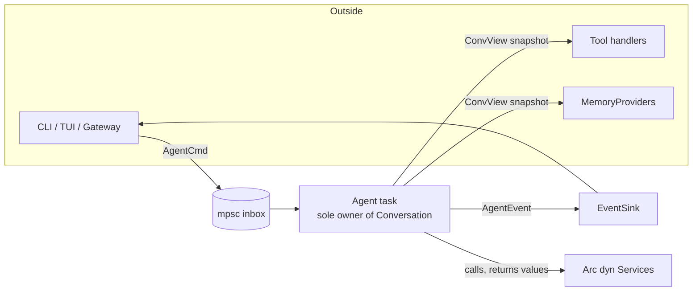
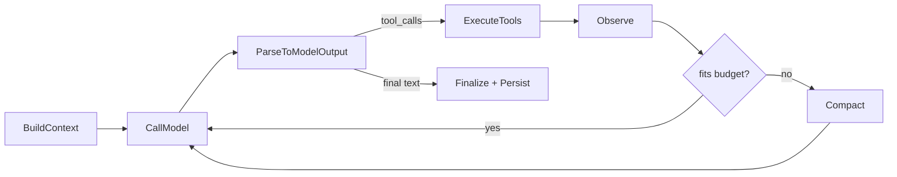
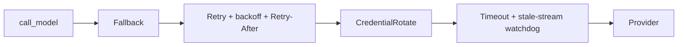

# daemon-core Runtime Model

The runtime ownership and data-flow model for the Rust core. This is the companion to
[hermes-god-object-architecture.md](../../../../docs/research/hermes/hermes-god-object-architecture.md): that doc defines the
**module boundaries** (who owns what code); this one defines the **runtime model** (who owns
what *state*, and how a turn moves through the system). The module split is necessary but not
sufficient — a clean box diagram still collapses into a god object if the orchestrator holds
`&mut` to every subsystem and they mutate shared state through it. The four commitments below
are what actually hold the design together.

Builds on the typed `Conversation` from [daemon-core-redesign.md](daemon-core-redesign.md) and the
seams in [hermes-memory-context-ecosystem.md](../../../../docs/research/hermes/hermes-memory-context-ecosystem.md).

---

## The problem with a star topology

The natural "thin orchestrator" drawing is `Agent -> {9 subsystems}` — an ownership star. In
Rust that shape fights the borrow checker: the moment a tool emits an event mid-execution, or
memory writes while the model streams, or steering arrives mid-turn, you get aliasing conflicts
and the "fix" is to hide everything behind the one object that owns it all — the god object
returns as `Arc<Mutex<AgentState>>`.

The model below avoids that by committing to ownership and data-flow rules, not just modules.

---

## Commitment 1 — One owner of mutable state (actor)

Exactly one task owns the `Conversation` and runtime state. Every other subsystem is either a
stateless `Arc<dyn Service>` (called, returns values) or communicates by message. No one else
ever holds `&mut Conversation`.

```rust
enum AgentCmd {
    Run(UserMsg),
    Steer(String),
    Interrupt,
    Snapshot(oneshot::Sender<ConvView>),   // read-only view for tools/UI/memory
}

// The agent task:
//   owns: Conversation, ContextEngine state cursor, turn phase
//   holds: Arc<dyn Provider>, Arc<dyn SessionStore>, Vec<Arc<dyn MemoryProvider>>, EventSink
//   receives: AgentCmd via mpsc inbox
```

Consequences:

- The typed-conversation invariants (no orphan tool result, no split tool pair) hold **at
  runtime**, not just at construction, because only the owner can append, and it appends whole
  `Turn`s.
- **Steering and cancellation are inbox messages** checked at phase boundaries — no control
  plane threaded through every function signature.
- Tools, memory, and frontends get a **`ConvView` snapshot** or send **append-commands**; they
  cannot splice the conversation themselves.



---

## Commitment 2 — A turn is typed phases; the orchestrator is wiring

Model the turn as explicit phase functions, each independently testable. `agent.rs` becomes a
state machine that sequences phases and owns *ordering only*.

```rust
async fn build_context(conv: &Conversation, cx: &TurnCx) -> Request;
async fn call_model(req: Request, cx: &TurnCx) -> Result<ModelOutput, Failure>;
async fn execute_tools(calls: Vec<ToolCall>, cx: &TurnCx) -> Vec<ToolOutcome>;
async fn compact(conv: Conversation, budget: Tokens, cx: &TurnCx) -> Conversation;
```



`TurnCx` carries the cross-cutting concerns so they never pollute phase signatures
individually:

```rust
struct TurnCx<'a> {
    cancel: CancellationToken,        // cooperative; checked at phase boundaries + in streams
    events: &'a EventSink,            // emit progress without owning UI
    services: &'a Services,           // Arc handles to provider/store/memory/...
    budget: IterationBudget,
}
```

---

## Commitment 3 — Effects as values (the main anti-regression lever)

Phases and tools do **not** perform side effects directly. They **return** effects as data; one
applier executes them in a defined order. This is what keeps behavior from leaking back into a
central mutable object.

```rust
enum Effect {
    Persist(TurnDelta),
    Emit(AgentEvent),
    Checkpoint(PathBuf),
    MemoryWrite(Fact),
    ExternalizePayload { ref_id: String, bytes: Vec<u8> },
}

struct ToolOutcome { result: ToolResult, effects: Vec<Effect> }
```

The whole turn becomes a near-pure function:

```text
(Conversation, Services) -> (Conversation, Vec<Effect>)
```

Benefits:

- **Centralized, ordered effects** — "who writes when" is explicit, not emergent.
- **Record/replay testing** — capture provider responses + assert the produced `Vec<Effect>`;
  no live model, no disk, fully deterministic.
- **No hidden coupling** — a tool cannot quietly mutate the session DB or the conversation; it
  can only request effects the applier understands.

---

## Commitment 4 — Decode in the provider layer; quarantine XML

Tool-call decoding is format-specific (native function calling vs Anthropic `tool_use` vs
Hermes XML). It belongs in the provider/model layer, which returns a **canonical
`ModelOutput`**. The orchestrator and tool pipeline never know XML exists.

```rust
struct ModelOutput {
    text: String,
    reasoning: Option<String>,
    tool_calls: Vec<ToolCall>,   // already decoded to the canonical type
}

trait Provider {
    fn capabilities(&self) -> Capabilities;   // supports_native_tools, streaming, ...
    fn stream(&self, req: Request) -> BoxStream<'static, Result<StreamEvent, Failure>>;
}
```

This operationalizes the native-first decision from the redesign: the tolerant XML parser +
argument repair live behind exactly one `Provider` impl (for models that can't do native tool
calls) and never leak into the core.

---

## Recovery is middleware, driven by typed failures

`call_model` does not branch inline per provider quirk. It calls a stack that returns either a
normalized stream or a classified `Failure`, with each concern as an independent layer.

```rust
enum Failure {
    RateLimit { retry_after: Option<Duration> },
    Billing, Auth, ContextOverflow, PayloadTooLarge,
    ContentPolicy, FormatError, TransientTransport, ProviderOverloaded, Fatal(String),
}
```



`ContextOverflow` / `PayloadTooLarge` route back to the `Compact` phase rather than failing the
turn. An exhaustive `match` on `Failure` forces every recovery decision to be made explicitly.

---

## Service ownership and discipline rules

### Single owner, many contributors (from the ecosystem doc)

- **One `ContextEngine`** owns the conversation *body* compaction and any drill-down tools
  (in-core default; hermes-lcm port is just another `ContextEngine`).
- **Many `MemoryProvider`s** contribute recalled blocks, persist facts, and own their tools
  (Mnemosyne and `MEMORY.md` as peers), with a `before_compact` hook so cross-session memory
  captures detail before the body shrinks.
- The agent calls `recall -> before_turn -> before_compact -> compact -> assemble -> after_turn`
  in that fixed, documented order.

### Trait only with a second implementation

Introduce a trait only when a real second impl or a test fake exists:

- **Trait:** `Provider` (many), `SessionStore` (sqlite + in-memory fake), `ContextEngine`
  (default + LCM), `MemoryProvider` (builtin + Mnemosyne).
- **Concrete (no trait):** the orchestrator, the phase functions, `PromptAssembler`, the effect
  applier.

This keeps the seam count honest and avoids the "dozens of tiny traits before the domain is
stable" failure mode.

---

## The testing story (why this model is worth it)

Because the turn is `(Conversation, Services) -> (Conversation, Vec<Effect>)` and all I/O sits
behind traits:

- **Golden trajectories:** record real `StreamEvent`s to fixtures; replay through a
  `MockProvider`; assert the resulting `Conversation` + `Vec<Effect>`.
- **Phase unit tests:** test `compact` boundary integrity, `execute_tools` safety, recovery
  `match` arms in isolation — no full agent required.
- **Resilience tests:** feed `Failure` sequences to the recovery middleware and assert the
  layer behavior (retry count, rotation, fallback, compaction) deterministically.

This is the property the god-object doc wants ("safety policies tested without a full agent
run") made concrete.

---

## What this changes in the file layout

Keep the layout from the god-object doc; add the runtime-model pieces:

```text
hermes-core/
  conversation.rs       typed turns + wire conversion (Commitment: invariants)
  agent.rs              actor: owns Conversation, sequences phases (small, inert)
  turn.rs               typed phases + TurnCx + Effect + applier
  provider.rs           Provider trait, capabilities, canonical ModelOutput (Commitment 4)
  model_router.rs       call_model entry
  recovery.rs           Failure taxonomy + middleware layers
  prompt.rs             tiered PromptAssembler (stable vs volatile)
  context.rs            ContextEngine trait + in-core default
  tool_pipeline.rs      validate/safety/checkpoint/execute -> ToolOutcome(effects)
  tools.rs              registry only
  memory.rs             MemoryProvider trait + builtin
  session_store.rs      SessionStore trait (sqlite + fake)
  events.rs             EventSink + AgentEvent
  control.rs            AgentCmd inbox, CancellationToken, steering
```

---

## One-line summary

The god-object doc makes `agent.rs` **small**; this runtime model makes it **inert** — one
actor task owning the typed `Conversation`, sequencing typed phases, where every subsystem
communicates through **values** (snapshots in, effects out) rather than shared mutation, model
failures are an exhaustive enum handled by middleware, tool-call format lives behind the
provider, and the whole turn is a deterministic, replay-testable function.
