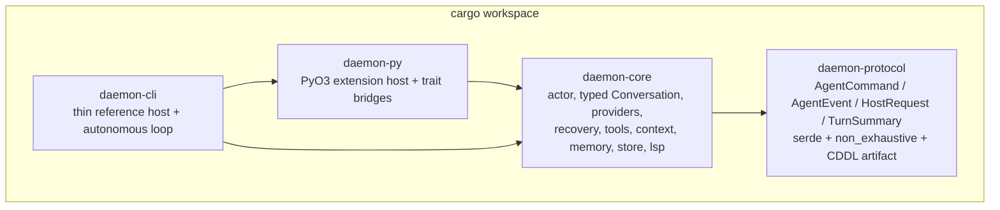
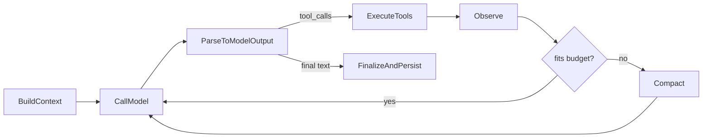
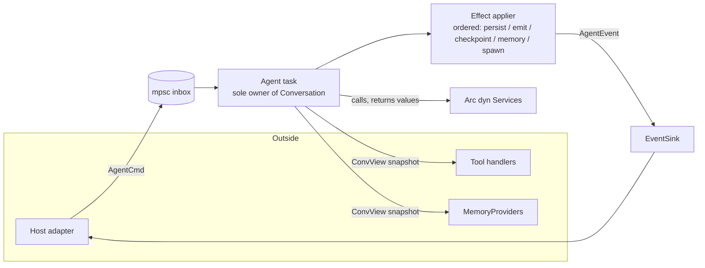
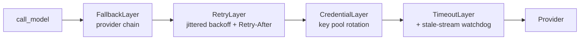
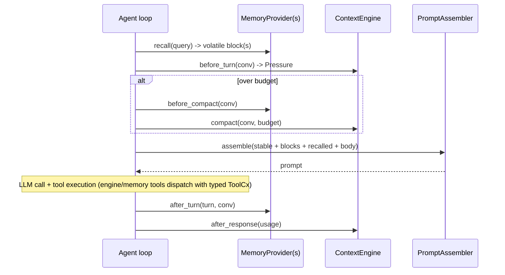

# daemon-core: Technical Specification

> Status: Draft v1. Authoritative specification for `daemon-core`, a greenfield Rust
> re-implementation of the **`hermes-agent`** embeddable agent core plus its core-adjacent
> runtime services, with in-process Python (PyO3) extensions.

> **Implementation status (the brain — P4 landed).** The engine is no longer a single-pass mock.
> `run_turn` is now a real **in-turn ReAct loop** (§4.2): `build_context → call_model →
> execute_tools → observe → call_model …` repeating until the model returns final text, guarded by
> the §20 **iteration budget** (`Config::max_iterations`, default 90) — on exhaustion it makes one
> toolless summary call and ends `EndReason::BudgetExhausted`. The loop runs fully in-process within
> one durable turn; only `Effect::Delegate` crosses the suspension boundary, so dehydration
> semantics are unchanged. The §12 `run_tool` pipeline executes every tool through a §13
> **`ExecutionEnvironment`** (in-core `LocalEnvironment`, per-session workspace-rooted, containment +
> child-env scrub; the trait stays host-routable), applies the sanitize+result-byte-budget stage,
> and surfaces structured `ToolDetail` into the `ToolCall`/`ToolResult` transcript views. Real
> **fs** (read/write/list/edit) and **shell** (exec, with hardline-deny + approval gate) tools ship
> in `tools/daemon-tool-fs` + `tools/daemon-tool-shell` and are registered on every node engine, so a
> leaf/session/orchestrator does real local work in its workspace. **Still deferred** (provider stays
> deterministic this phase): the real networked provider (P3 — a `ScriptedProvider`/`MockProvider`
> drives the loop+tools end-to-end without network/keys), context/memory depth (P2), mutating-op
> checkpoints, untrusted-output wrapping, parallel tool batching, and remote (docker/ssh) exec
> backends.

## Source-of-truth discipline (read first)

This document has one authoritative reference and several supporting ones. Keeping them straight
matters, because two different things have historically been called "hermes-rs":

- **Primary reference: [`hermes-agent/`](hermes-agent/) (Python).** The complete, battle-tested
  implementation, including all of the failure-handling, message/tool repair, recovery, safety,
  and provider-quirk logic (the "non-happy path"). Every subsystem section below carries **line
  references into `hermes-agent/`**, and the behavioral contract for `daemon-core` is derived from
  it.
- **Cautionary contrast only: the third-party [`hermes-rs/`](hermes-rs/) repository.** This is an
  unofficial community Rust port that re-implements roughly the happy path (~5% of the scale,
  shipping ~2 of ~15 resilience categories). `daemon-core` does **not** fork, port, or "lift
  algorithms from" it. It appears in this spec only where a concrete contrast illustrates a
  failure mode to avoid, always cited from [`hermes-rs-vs-hermes-agent.md`](../../../../docs/research/hermes/hermes-rs-vs-hermes-agent.md).
- **Design rationale (our own analysis docs):** [`daemon-core-redesign.md`](daemon-core-redesign.md),
  [`daemon-core-runtime-model.md`](daemon-core-runtime-model.md),
  [`daemon-core-host-interface.md`](daemon-core-host-interface.md),
  [`daemon-core-messaging-surface.md`](daemon-core-messaging-surface.md),
  [`daemon-core-gui-surfaces.md`](daemon-core-gui-surfaces.md),
  [`hermes-agent-parity-map.md`](../../../../docs/research/hermes/hermes-agent-parity-map.md),
  [`hermes-agent-runtime-adjacent.md`](../../../../docs/research/hermes/hermes-agent-runtime-adjacent.md),
  [`hermes-agent-host-interface.md`](../../../../docs/research/hermes/hermes-agent-host-interface.md),
  [`hermes-memory-context-ecosystem.md`](../../../../docs/research/hermes/hermes-memory-context-ecosystem.md),
  [`hermes-lcm-architecture.md`](../../../../docs/research/hermes/hermes-lcm-architecture.md),
  [`mnemosyne-architecture.md`](../../../../docs/research/hermes/mnemosyne-architecture.md).

> Throughout, "the third-party port" means the `hermes-rs/` repo. "Our project" is `daemon-core`.
> Each subsystem section follows a consistent template: **Purpose / `hermes-agent` behavior (with
> line refs) / daemon-core design / Priority**, with an optional "incomplete-port contrast" note.
> Priorities use the parity-map tiers: **P0** production survival, **P1** long-session coding,
> **P2** multi-provider + memory ecosystem, **P3** ecosystem/maintenance.

## Document map

1. Overview, goals, non-goals
2. Scope and boundary (incl. 2.3 orchestration boundary: profiles, sessions, the fleet)
3. Crate and module layout
4. Runtime model (the four commitments)
5. Typed conversation core
6. Serialization and encoding
7. Provider layer
8. Recovery middleware
9. Message, tool-call, and output repair
10. Context and prompt assembly
11. Memory
12. Tool pipeline and safety
13. Execution environments
14. Session store
15. LSP diagnostics
16. Process registry (16.1) and sub-agent delegation capability (16.2)
17. Host interface protocol (incl. 17.3 orchestratability)
18. Python extension layer (PyO3)
19. Trajectory export
20. Configuration
21. Testing strategy
22. Phased roadmap
23. Line-reference appendix

---

## 1. Overview, goals, non-goals

`daemon-core` is an **embeddable Rust agent runtime**: a hardened ReAct loop that a host links as a
library, drives with typed commands, and observes through a typed event stream. It is the Rust
counterpart of the single shared `AIAgent` runtime in `hermes-agent`
([`hermes-agent-architecture.md`](../../../../docs/research/hermes/hermes-agent-architecture.md) §1), minus the surface breadth
(CLI/TUI/web/desktop/editors/chat platforms) that `hermes-agent` wraps around that runtime.

### 1.1 Goals

- **Faithful behavioral parity with `hermes-agent`'s core**, prioritizing the resilience and safety
  logic that the third-party port omits: retry/backoff, stale-stream watchdogs, message/tool-call
  repair, LLM context summarization, tool safety, cancellation, and result budgeting
  ([`hermes-agent-parity-map.md`](../../../../docs/research/hermes/hermes-agent-parity-map.md) §1-§4).
- **Correct-by-construction core**: illegal conversations are unrepresentable in the type system,
  so the large body of runtime repair `hermes-agent` performs on loose `list[dict]` messages
  becomes either unnecessary or a thin transport-edge concern
  ([`daemon-core-redesign.md`](daemon-core-redesign.md) §2.2).
- **Embeddable anywhere**: one core library + one typed protocol, with in-process and
  out-of-process embedding modes ([`daemon-core-host-interface.md`](daemon-core-host-interface.md)).
- **Extensible via in-process Python (PyO3) and MCP**, not a reimplemented in-process Rust plugin
  zoo. The Python context engine [`hermes-lcm`](hermes-lcm/) and the Python memory layer
  [`Mnemosyne`](Mnemosyne/) run in-process as the **default** context-engine and memory-provider
  ports ([`hermes-memory-context-ecosystem.md`](../../../../docs/research/hermes/hermes-memory-context-ecosystem.md)).
- **More complete and robust than the third-party port**, which is the explicit bar for this work.

### 1.2 Non-goals (explicitly out of scope)

- **TUI / GUI / desktop surfaces** (the `daemon-core-gui-surfaces.md` targets). `daemon-core`
  exposes the typed host protocol; rendering surfaces are separate crates/projects.
- **Messaging gateway and chat platforms** (Telegram/Matrix/Slack/Discord/etc.). The entire
  `hermes-agent/gateway/` daemon and `gateway/platforms/*` are out of scope, including the
  `DeliverySink`/`DeliveryTarget` fan-out seam proposed in
  [`daemon-core-messaging-surface.md`](daemon-core-messaging-surface.md). Breadth lives
  out-of-process (PyO3 extensions, MCP) or in downstream projects.
- **In-process Rust plugin system.** `hermes-agent`'s Python plugin zoo
  ([`hermes-agent-runtime-adjacent.md`](../../../../docs/research/hermes/hermes-agent-runtime-adjacent.md) §3) is served by the
  PyO3 extension layer (§18) and MCP, not a Rust dynamic-loading mechanism.
- **The third-party port's XML-first tool-calling.** `daemon-core` is native-first (§7).
- **Fleet / profile / multi-session orchestration.** `daemon-core` is a single-conversation engine
  *configured by* a profile; it runs under an **external orchestration/host layer** that owns the
  fleet, profiles, scheduling, retries, and cross-task concurrency. That layer is a **separate
  specification** (§2.3) and is out of scope here. The engine only needs to be cleanly
  *orchestratable* (§17.3).

### 1.3 The one-sentence definition

`daemon-core` is a thin agent **orchestrator actor** that owns a typed `Conversation`, sequences a
turn as typed phases that return **effects as values**, wraps model I/O in **typed recovery
middleware**, runs tools through a **safety pipeline**, and exposes everything to hosts through a
**typed command/event/request protocol** — preserving `hermes-agent`'s hard-won runtime behavior
while making its god-object coupling
([`hermes-god-object-architecture.md`](../../../../docs/research/hermes/hermes-god-object-architecture.md)) structurally impossible.

---

## 2. Scope and boundary

### 2.1 In scope vs out of scope

| Area | In `daemon-core` | Out (separate project / surface) |
|------|------------------|----------------------------------|
| Turn orchestration (ReAct loop) | Yes — actor + typed phases | — |
| Typed conversation + invariants | Yes | — |
| Model I/O (OpenAI + Anthropic native) | Yes | Additional transports later (P2/P3) |
| Recovery (retry/backoff/watchdog/classify) | Yes (P0) | — |
| Message/tool-call/output repair | Yes (P0) | — |
| Context engine trait + in-core default | Yes | LCM is a Python extension (default) |
| Memory provider trait + builtin | Yes | Mnemosyne is a Python extension (default) |
| Tool pipeline + safety + guardrails | Yes (P0/P1) | — |
| Execution environments | Local in-core; docker/ssh/modal adjacent | Remote backends optional |
| Session store (SQLite + FTS) | Yes (P1) | — |
| LSP diagnostics | Yes | — |
| Process registry (local OS processes) | Yes | — |
| Sub-agent delegation | **Initiate** (capability, §16.2) | **Running** the children = orchestrator |
| Host protocol (command/event/request) | Yes | The transports/surfaces that speak it |
| Python (PyO3) extension host | Yes | The extensions themselves ship separately |
| Trajectory export | Yes (P2) | Offline trajectory compression tooling |
| Profiles / fleet / multi-session manager | **No** (engine is *configured by* a profile, §2.3) | external orchestration/host spec |
| Messaging gateway / chat platforms | **No** | `hermes-agent/gateway/`-equivalent project |
| TUI / GUI / desktop / installer | **No** | `daemon-core-gui-surfaces.md` targets |

### 2.2 daemon-core vs the third-party `hermes-rs/`

These are different artifacts and must not be conflated:

- **`daemon-core`** (this spec) is our greenfield port, derived from `hermes-agent`.
- **`hermes-rs/`** is a pre-existing third-party community port. We reference its *gaps* (analyzed
  in [`hermes-rs-vs-hermes-agent.md`](../../../../docs/research/hermes/hermes-rs-vs-hermes-agent.md)) as a checklist of what an
  incomplete port looks like, e.g. no retry/backoff or stale-stream timeout
  ([`hermes-rs/crates/hermes-core/src/client.rs`](hermes-rs/crates/hermes-core/src/client.rs)),
  drop-oldest truncation instead of summarization
  ([`hermes-rs/crates/hermes-core/src/context.rs`](hermes-rs/crates/hermes-core/src/context.rs)),
  and XML-first tool calling
  ([`hermes-rs/crates/hermes-core/src/agent.rs`](hermes-rs/crates/hermes-core/src/agent.rs) ~L322).
  We do not depend on, fork, or copy it.

### 2.3 Orchestration boundary: profiles, sessions, and the fleet

`daemon-core` is a **single-conversation engine** and a **general-purpose learning agent** (Hermes-
like, not a coding-agent per se). One agent actor owns exactly one `Conversation`/session (§4.1). The
ownership of *many* sessions, *profiles*, and *scheduling* sits **above** the engine, in an external
orchestration/host layer that is **a separate specification** (out of scope here). This boundary is
referenced by §16.2 (delegation), §14 (session store), and §17 (host protocol).

- **A profile is a configuration, not a core object.** "Profile" = the `Config` + `Services` bundle
  (`Provider`/`ProviderProfile` selection (§7), `SessionStore` (§14), memory (§11), context (§10),
  toolset, identity/system prompt) **plus a host-supplied data-root** that the orchestrator/host uses
  to **construct and configure** an engine instance. `daemon-core` is *configured by* a profile; it
  does **not** define, name, list, switch, or own profiles, and it never reads a hardcoded home
  directory. (This mirrors `hermes-agent`, where profile management lives in the CLI layer —
  [`hermes-agent/hermes_cli/profiles.py`](hermes-agent/hermes_cli/profiles.py) — not the runtime.)
- **"Many sessions per profile" is an orchestration property.** The orchestrator constructs many
  engine instances against one profile's config and `SessionStore` root; isolation is by store
  instance / data-root (§14), mirroring `hermes-agent`'s per-`state.db` partitioning
  ([`hermes-agent/hermes_state.py`](hermes-agent/hermes_state.py)).
- **The fleet/session-manager is external.** Scheduling, retries, cross-task concurrency, workspace
  lifecycle, and the ownership of a set of running sessions belong to the orchestration layer. It
  also **fulfils** `daemon-core`'s delegation requests (§16.2) by instantiating and running child
  engine instances. `daemon-core` only requests; it never runs a fleet.
- **Intra-session vs cross-task.** The in-core delegation *capability* (§16.2) is **intra-session**
  (a parent helping with its own task). A fleet of independent tasks/agents is **cross-task
  orchestration** and is wholly external.

> The engine is designed to be cleanly *orchestratable* (§17.3) — it exposes a stable session id,
> completion/end-reason, approval, usage/rate-limit telemetry, budget caps, a workspace root, and a
> delegation request channel — without the spec depending on, or naming, any particular orchestrator.

---

## 3. Crate and module layout

`daemon-core` is a small Cargo workspace. The split keeps the embeddable core free of any Python
or host-transport dependencies, so it can be linked by tests and surfaces without pulling CPython.



- **`daemon-protocol`** — the typed host boundary as `serde` enums plus a published CDDL contract
  (see §17). No runtime logic; depended on by `daemon-core` and any out-of-process host. Splitting
  it out is the lesson from `daemon-core-gui-surfaces.md` Decision A (one protocol crate, generated
  for TS, single source of truth).
- **`daemon-core`** — the embeddable library. No PyO3, no transport server. Module map mirrors the
  runtime-model file layout ([`daemon-core-runtime-model.md`](daemon-core-runtime-model.md) "What
  this changes in the file layout"):

| Module | Owns |
|--------|------|
| `conversation.rs` | typed `Conversation`/`Turn`/`ToolTurn` + provider-wire conversion |
| `agent.rs` | the actor: owns `Conversation`, sequences phases (small, inert) |
| `turn.rs` | typed phase functions + `TurnCx` + `Effect` + the effect applier |
| `provider.rs` | `Provider` trait, `Capabilities`, canonical `ModelOutput` |
| `providers/` | `openai.rs`, `anthropic.rs`, `hermes_xml.rs` (fallback decoder) |
| `model_router.rs` | `call_model` entry; wires the recovery stack |
| `recovery.rs` | `Failure` taxonomy + tower-style layers |
| `provider_profile.rs` | declarative provider quirks + registry |
| `credential_pool.rs` | multi-key selection, cooldown, refresh — the **default embedded `CredentialProvider` impl** for standalone (L1) use; under a host the authority-backed impl is injected (§7) |
| `prompt.rs` | tiered `PromptAssembler` (stable / context / volatile) |
| `context.rs` | `ContextEngine` trait + in-core default strategies |
| `context_compressor.rs` | LLM summarization pipeline (in-core default engine) |
| `memory.rs` | `MemoryProvider` trait + builtin `MEMORY.md`/`USER.md` |
| `tool_pipeline.rs` | validate / safety / checkpoint / execute -> `ToolOutcome` |
| `delegation.rs` | `delegate` tool + `DelegationSpec` building (toolset intersection + deny-set + budget hint) + request emission (`HostRequest::Delegate` / `Effect::Delegate`) — *not* a child runner (§16.2) |
| `tools.rs` | registry only (schema/handler/metadata/budgets) |
| `tools/` | built-in tools |
| `path_security.rs`, `approval.rs`, `tool_guardrails.rs`, `checkpoint.rs`, `tool_result_store.rs` | safety subsystems |
| `exec/` | `ExecutionEnvironment` trait + `local.rs` (+ adjacent backends) |
| `session_store.rs` | `SessionStore` trait + SQLite impl |
| `lsp/` | `LspService`, server registry, delta/line-shift |
| `process_registry.rs` | engine-side **handle-view** of OS processes + completion/watch rail; the live process is **host-owned** (the engine holds handles so it can suspend while work continues — §16.1) |
| `events.rs` | `EventSink` + `AgentEvent` |
| `control.rs` | `AgentCmd` inbox, `CancellationToken`, steering |
| `config.rs` | typed configuration |
| `trajectory.rs` | ShareGPT JSONL export |

- **`daemon-py`** — embeds CPython via PyO3, discovers Python extensions, and bridges them to the
  `daemon-core` traits (tool, hook/middleware, `ContextEngine`, `MemoryProvider`, `Provider`). It
  depends on `daemon-core` (for the traits) but `daemon-core` never depends on it: a build with no
  Python is fully functional. LCM and Mnemosyne are wired here as defaults (§18).
- **`daemon-cli`** — a thin reference host that drives the actor and renders events to stdout; also
  hosts an optional autonomous coding loop. It exists to exercise the protocol end-to-end and is
  not the product.

> **Trait discipline** ([`daemon-core-runtime-model.md`](daemon-core-runtime-model.md) "Trait only
> with a second implementation"): introduce a trait only when a real second impl or a test fake
> exists. Traits: `Provider` (openai/anthropic/xml/mock), `SessionStore` (sqlite/in-memory fake),
> `ContextEngine` (default/LCM), `MemoryProvider` (builtin/Mnemosyne), `ExecutionEnvironment`
> (local/docker/...). Concrete (no trait): the orchestrator, the phase functions, `PromptAssembler`,
> the effect applier.

## 4. Runtime model (the four commitments)

A clean module diagram is not enough: in Rust, a "thin orchestrator with nine subsystems" collapses
back into a god object the moment the orchestrator holds `&mut` to everything and subsystems mutate
shared state through it ([`daemon-core-runtime-model.md`](daemon-core-runtime-model.md) "The problem
with a star topology"). `daemon-core` avoids that with four commitments about *state ownership and
data flow*, not just modules.

### 4.1 Commitment 1 — one owner of mutable state (actor)

Exactly one task owns the `Conversation` and runtime state. Every other subsystem is either a
stateless `Arc<dyn Service>` (called, returns values) or communicates by message. No one else ever
holds `&mut Conversation`.

```rust
enum AgentCmd {
    Run(UserMsg),
    Steer(String),
    Interrupt(Option<String>),
    Snapshot(oneshot::Sender<ConvView>),   // read-only view for tools / hosts / memory
    Shutdown,
}

// The agent task:
//   owns:     Conversation, ContextEngine cursor, turn phase
//   holds:    Arc<dyn Provider>, Arc<dyn SessionStore>, Vec<Arc<dyn MemoryProvider>>,
//             Arc<dyn ContextEngine>, ToolPipeline, EventSink
//   receives: AgentCmd via an mpsc inbox
```

Consequences:

- The typed-conversation invariants (no orphan tool result, no split tool pair) hold **at runtime**,
  not just at construction, because only the owner appends, and it appends whole `Turn`s.
- **Steering and cancellation are inbox messages** checked at phase boundaries — there is no control
  plane threaded through every function signature.
- Tools, memory, and hosts receive a **`ConvView` snapshot** or send **append-commands**; they
  cannot splice the conversation themselves.

This is the structural cure for the god-object coupling described in
[`hermes-god-object-architecture.md`](../../../../docs/research/hermes/hermes-god-object-architecture.md): `hermes-agent`'s `AIAgent`
([`hermes-agent/run_agent.py`](hermes-agent/run_agent.py), ~5,467 lines) owns provider state,
streaming, tools, memory, persistence, callbacks, retries, and credentials all at once.

### 4.2 Commitment 2 — a turn is typed phases; the orchestrator is wiring

The turn is explicit phase functions, each independently testable. `agent.rs` is a state machine
that owns *ordering only*.

```rust
async fn build_context(conv: &Conversation, cx: &TurnCx<'_>) -> Request;
async fn call_model(req: Request, cx: &TurnCx<'_>) -> Result<ModelOutput, Failure>;
async fn execute_tools(calls: Vec<ToolCall>, cx: &TurnCx<'_>) -> Vec<ToolOutcome>;
async fn compact(conv: Conversation, budget: Tokens, cx: &TurnCx<'_>) -> Conversation;
async fn finalize(conv: &Conversation, cx: &TurnCx<'_>) -> TurnSummary;
```



This mirrors `hermes-agent`'s turn lifecycle — `agent_init` -> `turn_context` (preflight) ->
`conversation_loop` -> `turn_finalizer`
([`hermes-agent-architecture.md`](../../../../docs/research/hermes/hermes-agent-architecture.md) §3) — but as separable functions
rather than a ~4,454-line loop file
([`hermes-agent/agent/conversation_loop.py`](hermes-agent/agent/conversation_loop.py)).

`TurnCx` carries cross-cutting concerns so they never pollute individual phase signatures:

```rust
struct TurnCx<'a> {
    cancel: CancellationToken,        // cooperative; checked at phase boundaries and in streams
    events: &'a EventSink,            // emit progress without owning the host
    services: &'a Services,           // Arc handles to provider/store/memory/context/...
    budget: IterationBudget,          // parents 90, subagents 50 (see runtime-adjacent §9)
    host: &'a dyn HostRequestHandler, // blocking human-in-the-loop requests (§17)
}
```

The iteration budget mirrors
[`hermes-agent/agent/iteration_budget.py`](hermes-agent/agent/iteration_budget.py) (parents capped
at `max_iterations` default 90, subagents at 50, refundable `execute_code` turns). The subagent cap
is carried as the `budget` *hint* in a `DelegationSpec` (§16.2) and enforced by the child engine
instance the orchestrator runs — not by the parent.

### 4.3 Commitment 3 — effects as values (the main anti-regression lever)

Phases and tools do **not** perform side effects directly. They **return** effects as data; one
applier executes them in a defined order.

```rust
enum Effect {
    Persist(TurnDelta),
    Emit(AgentEvent),
    Checkpoint(PathBuf),
    MemoryWrite(Fact),
    ExternalizePayload { ref_id: String, bytes: Vec<u8> },
    Delegate(Vec<DelegationSpec>),   // async sub-agent request; orchestrator runs it (§16.2)
}

struct ToolOutcome { result: ToolResult, effects: Vec<Effect> }
```

The whole turn becomes a near-pure function: `(Conversation, Services) -> (Conversation, Vec<Effect>)`.
Benefits ([`daemon-core-runtime-model.md`](daemon-core-runtime-model.md) Commitment 3): centralized
ordered effects ("who writes when" is explicit, not emergent); record/replay testing (capture
provider responses + assert the produced `Vec<Effect>`, no live model, no disk); and no hidden
coupling (a tool cannot quietly mutate the session DB or the conversation).

### 4.4 Commitment 4 — decode in the provider layer; quarantine XML

Tool-call decoding is format-specific (native function calling vs Anthropic `tool_use` vs Hermes
XML). It belongs in the provider layer, which returns a **canonical `ModelOutput`**. The
orchestrator and tool pipeline never know XML exists.

```rust
struct ModelOutput {
    text: String,
    reasoning: Option<String>,
    tool_calls: Vec<ToolCall>,   // already decoded to the canonical type
    usage: Usage,
}

trait Provider: Send + Sync {
    fn capabilities(&self) -> Capabilities;   // supports_native_tools, streaming, ...
    fn stream(&self, req: Request) -> BoxStream<'static, Result<StreamEvent, Failure>>;
}
```

This operationalizes the native-first decision (§7): the tolerant XML parser plus argument repair
live behind exactly one `Provider` impl (for models that cannot do native tool calls) and never leak
into the core. It is the direct inverse of the third-party port's XML-first choice
([`hermes-rs-vs-hermes-agent.md`](../../../../docs/research/hermes/hermes-rs-vs-hermes-agent.md) §6), and it matches `hermes-agent`'s
native-first runtime.

### 4.5 The effect applier and event flow



---

## 5. Typed conversation core

**Purpose.** Make illegal conversations unrepresentable so the large body of runtime repair
`hermes-agent` performs becomes unnecessary at the structural level (it remains only as a
transport-edge concern for untrusted *model output*, §9).

**`hermes-agent` behavior.** The conversation is a loose `List[Dict[str, Any]]`. Because invalid
states are representable, the runtime repairs them before every API call:
role-alternation fixes, orphan tool-result removal, missing tool-result stubs, and thinking-only
turns are handled in
[`hermes-agent/agent/agent_runtime_helpers.py`](hermes-agent/agent/agent_runtime_helpers.py); surrogate
and tool-argument repairs in
[`hermes-agent/agent/message_sanitization.py`](hermes-agent/agent/message_sanitization.py) (the
`_repair_tool_call_arguments` path); and compaction must manually avoid splitting a
`tool_call`/`tool_result` pair via `_sanitize_tool_pairs`
([`hermes-agent/agent/context_compressor.py`](hermes-agent/agent/context_compressor.py)). The
`hermes-agent-parity-map.md` §2.1 and `daemon-core-redesign.md` §2.2 both call this the single
biggest leverage point for a Rust port.

**daemon-core design.** Encode the invariants in the type system
([`hermes-god-object-architecture.md`](../../../../docs/research/hermes/hermes-god-object-architecture.md) "Layer 1"):

```rust
struct Conversation {
    system: SystemPrompt,
    turns: Vec<Turn>,
}

enum Turn {
    User(UserMsg),
    Assistant(AssistantMsg),     // text + reasoning, no tool calls
    Tool(ToolTurn),              // an assistant tool-call message AND its results, together
}

/// A tool turn groups an assistant message with its tool calls AND their result slots.
/// A ToolCall cannot exist without its ToolResult slot, so an orphaned tool result is
/// unrepresentable, and compaction operating on `Turn`s cannot split a pair.
struct ToolTurn {
    assistant: AssistantMsg,
    calls: Vec<(ToolCall, ToolResult)>,
}
```

What this eliminates (vs `hermes-agent` runtime repair):

- No orphan tool result; no tool result without an assistant tool call.
- No compaction boundary that splits a tool pair (the manual `_align_boundary_backward` /
  `_sanitize_tool_pairs` work disappears).
- No provider request built from invalid role order.

What still requires active handling (because it concerns untrusted *model output*, not stored state):
surrogate sanitization, tool-argument JSON repair, tool-name repair, and thinking-only output —
covered in §9. These run at the **provider decode boundary** and produce already-valid `Turn`s.

**Wire conversion.** `conversation.rs` converts `Conversation` to/from each provider's message shape
at the transport boundary only (e.g. Anthropic thinking-block rules, strict role alternation), so
provider quirks never touch the canonical model. A `ConvView` is a cheap read-only projection handed
to tools/memory/hosts.

**Priority.** P0 for the type model and wire conversion (everything builds on it); the migration
away from any loose interim representation is immediate since this is greenfield.

---

## 6. Serialization and encoding

**Purpose.** Decide, per boundary, how the canonical model is encoded — without ever letting an
encoding become the canonical form.

**Principle.** The canonical/primary representation is the **typed Rust structs** of §5, never
serialized bytes. All logic operates on the structs so the compile-time invariants hold; encodings
are transforms applied only at edges. (CBOR is the *serialization of* the canonical model, not the
canonical model itself — treating CBOR bytes as primary would mean constant
deserialize/mutate/reserialize and would forfeit the invariants.)

**Per-boundary encoding.**

| Boundary | Encoding | Rationale |
|----------|----------|-----------|
| In-memory canonical | Rust structs | Zero serialization on the hot path; invariants enforced |
| SessionStore persistence, IPC, content-hashing | CBOR via `ciborium` | Compact, fast re-read on resume, holds attachment bytes inline (no base64 +33%) |
| Checkpoint identity / arg canonicalization / prompt-cache keys | **canonical/deterministic CBOR** | One content-addressing mechanism for three concerns the parity map lists separately |
| Trajectory export | JSON / JSONL (ShareGPT) | Matches downstream training tooling |
| Python extensions (PyO3) | native pyo3 objects in `hermes-agent` message **dict shape** | LCM/Mnemosyne are written against `list[dict]`; hand them dicts, not CBOR bytes |
| Host protocol, in-process | Rust enums directly | No serialization (the `daemon-core-gui-surfaces.md` embedding win) |
| Host protocol, out-of-process | JSON default, CBOR negotiated | Browser/JS clients want JSON; binary clients can opt into CBOR; serde makes both cheap |
| Provider edges | provider-specific JSON | OpenAI/Anthropic require it; always a transform |

**Crate guidance.** Use `ciborium` (serde-based, maintained) so one struct set serializes to both
JSON and CBOR; **avoid the unmaintained `serde_cbor`**. If profiling/versioning later demands
protobuf-like field-number stability for the persisted or protocol formats, `minicbor` with explicit
numeric tags (`#[n(0)]`) is the escalation path, at the cost of a second derive ecosystem alongside
serde.

**Canonical CBOR unification.** Deterministic CBOR (RFC 8949 §4.2 ordering) gives stable content
hashes, so a single helper underpins: checkpoint identity (§12.5), tool-argument canonicalization
(the `canonicalize_args` concern in `hermes-agent-parity-map.md` §2.2), and prompt-prefix cache keys
(§10). `hermes-agent` handles these three separately; `daemon-core` unifies them.

**CDDL.** A formal schema contract is published **only for the live out-of-process host protocol**
(§17), for non-Rust UI/SDK clients. Rust serde types are the source of truth; the CDDL is validated
by round-trip tests using the `cddl` crate. Persistence and trajectory formats stay
Rust-serde-internal in v1 (no external schema contract).

**Snapshot encoding.** The engine **`Snapshot`** used for dehydrate/rehydrate (§14, §17.1 item 5,
[`daemon-lifecycle-persistence.md`](../../../../docs/specs/daemon-lifecycle-persistence.md)) is just `SessionStore`
persistence: **CBOR via `ciborium`**, Rust-serde-internal, no external CDDL contract. It serializes
the `Conversation` + references + epoch only; tool state and live resources are out of scope by
construction, so no new encoding mechanism is introduced.

## 7. Provider layer

**Purpose.** Turn a model request into a normalized event stream or a classified failure, with
native function calling as the default and Hermes XML quarantined as a fallback for non-native
models.

**`hermes-agent` behavior.** Model I/O is a recovery system, not a bare HTTP client
([`hermes-agent-parity-map.md`](../../../../docs/research/hermes/hermes-agent-parity-map.md) §1). It supports 5 API modes
(`chat_completions`, `anthropic_messages`, `codex_responses`, `bedrock_converse`,
`codex_app_server`) under [`hermes-agent/agent/transports/`](hermes-agent/agent/transports/), with
declarative provider profiles (`providers/base.py` `ProviderProfile`, ~29 bundled under
[`hermes-agent/plugins/model-providers/`](hermes-agent/plugins/model-providers/)). Crucially, it is
**native-function-calling-first at runtime**: it passes tools via the OpenAI `tools` array / Anthropic
`tool_use` and reads structured `delta.tool_calls`; the Hermes `<tool_call>` XML format is used only
for trajectory/training export and a couple of adapters, *not* the live inference parser
([`hermes-rs-vs-hermes-agent.md`](../../../../docs/research/hermes/hermes-rs-vs-hermes-agent.md) §6). Runtime-provider resolution is
centralized in [`hermes-agent/hermes_cli/runtime_provider.py`](hermes-agent/hermes_cli/runtime_provider.py)
`resolve_runtime_provider()` ([`hermes-agent-runtime-adjacent.md`](../../../../docs/research/hermes/hermes-agent-runtime-adjacent.md)
§8).

**Incomplete-port contrast.** The third-party port made XML the *primary* path and instructs the
model to emit `<tool_call>` XML ([`hermes-rs/crates/hermes-core/src/agent.rs`](hermes-rs/crates/hermes-core/src/agent.rs)
~L322), reintroducing exactly the truncated-arg-JSON and hallucinated-name failure modes the repair
logic exists for — while shipping less of that repair. `daemon-core` must not repeat this.

**daemon-core design.**

```rust
enum ToolCallFormat { Native, AnthropicToolUse, HermesXml }

struct Capabilities {
    supports_native_tools: bool,
    supports_streaming: bool,
    tool_call_format: ToolCallFormat,
    max_context: Option<u32>,
    // schema quirks, multimodal support, prompt-cache markers, ...
}

#[async_trait]
trait Provider: Send + Sync {
    fn capabilities(&self) -> Capabilities;
    async fn chat(&self, req: Request) -> Result<ModelOutput, Failure>;
    fn stream(&self, req: Request) -> BoxStream<'static, Result<StreamEvent, Failure>>;
}
```

- **`providers/openai.rs`** — OpenAI-compatible chat completions, native `tools`/`tool_calls`,
  SSE streaming. Default for the broad ecosystem.
- **`providers/anthropic.rs`** — Anthropic Messages, native `tool_use`/`tool_result`, thinking
  blocks, prompt-cache control markers.
- **`providers/hermes_xml.rs`** — used **only** when `capabilities.supports_native_tools == false`
  (open Hermes-format models without a native tool API). The tolerant incremental `<tool_call>`
  parser plus argument repair live entirely behind this impl; it decodes to the canonical
  `ToolCall` so the core never sees XML (Commitment 4). This is the one place an XML state machine
  exists, and it is opt-in via capability negotiation.

**Provider profiles, credentials, fallback (framework now, breadth later).**

- `provider_profile.rs` — `ProviderProfile { name, base_url, auth_ref, model, capabilities,
  tool_call_format, schema_quirks }` plus a registry, mirroring `providers/base.py`.
- `credential_pool.rs` — multi-key selection, cooldown, status, OAuth refresh, mirroring
  [`hermes-agent/agent/credential_pool.py`](hermes-agent/agent/credential_pool.py) (~2,184 lines):
  `CredentialId`, `CredentialStatus`, `select`, `mark_exhausted`, `mark_dead`, `refresh`, `rotate`.
- `FallbackChain` — on a classified quota/billing/content failure, rebuild the client to the next
  profile while preserving the conversation, mirroring `chat_completion_helpers.py` fallback
  activation. (P2.)

> **Orchestration amendment — credentials are a port, not an owned pool.** The engine holds a
> `CredentialProvider` **trait handle**, not raw keys:
>
> ```rust
> #[async_trait]
> trait CredentialProvider: Send + Sync {
>     async fn acquire(&self, profile: &ProfileRef, scope: CredScope) -> Result<CredLease, CredError>;
>     async fn release(&self, lease: CredLease);
> }
> ```
>
> The `credential_pool` above becomes the **default embedded impl** for standalone (L1) use. Under
> a host/orchestrator, the host injects an **authority-backed impl** that owns rotation, cooldown,
> scoping, revocation, and **fleet-wide rate/cost governance** ([`daemon-host-spec.md`](../../../../docs/specs/daemon-host-spec.md)).
> Credentials **attenuate down the supervision edges** exactly like the toolset intersection in
> §16.2: a delegated child can never hold more than its parent's scope. This keeps least-privilege
> possible at fleet scale and lets one authority throttle a shared quota across many engines.

**Priority.** Provider trait + canonical `ModelOutput` + OpenAI and Anthropic native transports are
P0/P1. Profile registry/credential pool/fallback framework is built early but populated at P2.
Provider-specific payload-quirk handlers (`ProviderQuirkHandler`) are P2.

---

## 8. Recovery middleware

**Purpose.** Survive flaky networks, rate limits, billing/auth failures, context overflow, and hung
streams without ending an otherwise-valid turn. This is the category the third-party port omits and
the category that "matters even for a single local user"
([`hermes-rs-vs-hermes-agent.md`](../../../../docs/research/hermes/hermes-rs-vs-hermes-agent.md) §9.3).

**`hermes-agent` behavior.** A prioritized error taxonomy
([`hermes-agent/agent/error_classifier.py`](hermes-agent/agent/error_classifier.py), ~1,365 lines)
produces `(retryable, should_compress, should_rotate_credential, should_fallback)`; jittered
exponential backoff (2-120s, honoring `Retry-After`) with up to 3 retries in
[`hermes-agent/agent/retry_utils.py`](hermes-agent/agent/retry_utils.py) and per-call state in
[`hermes-agent/agent/turn_retry_state.py`](hermes-agent/agent/turn_retry_state.py); streaming
watchdogs (stale-stream kill ~180s, Codex TTFB/idle timers) in
[`hermes-agent/agent/chat_completion_helpers.py`](hermes-agent/agent/chat_completion_helpers.py); and
cross-session rate guards
([`hermes-agent/agent/nous_rate_guard.py`](hermes-agent/agent/nous_rate_guard.py)).

**daemon-core design.** The taxonomy becomes an exhaustive enum the compiler forces you to handle,
and recovery becomes a tower-style layer stack
([`daemon-core-redesign.md`](daemon-core-redesign.md) §2.3,
[`daemon-core-runtime-model.md`](daemon-core-runtime-model.md) "Recovery is middleware"):

```rust
enum Failure {
    RateLimit { retry_after: Option<Duration> },
    Billing,
    Auth,
    ContextOverflow,
    PayloadTooLarge,
    ContentPolicy,
    FormatError,
    TransientTransport,
    ProviderOverloaded,
    Fatal(String),
}

fn recovery(f: &Failure) -> Recovery { /* exhaustive match — cannot forget a case */ }
```



- `classify_api_error(status, headers, body, provider, approx_tokens) -> Failure` preserves status,
  headers, body, provider/model, request shape, and approximate context size (generic at P0;
  provider-specific classifiers behind profile names at P2).
- `retry.rs`: `TurnRetryState` (one-shot recovery guards), `ModelCallPolicy`,
  `jittered_backoff(attempt, base, max, retry_after)`.
- Watchdogs via `tokio::select!`: overall request timeout, time-to-first-event timeout, event idle
  timeout, and the turn `CancellationToken`. A fired watchdog classifies as `TransientTransport`
  (retryable). This directly fixes the third-party port's untimed `stream.next()` await.
- `Failure::ContextOverflow` / `PayloadTooLarge` route back to the `Compact` phase (§10) rather than
  failing the turn — the error-driven compaction trigger.

**Priority.** P0 for generic classification, retry/backoff/`Retry-After`, and stale-stream
watchdogs. P2 for credential rotation, fallback chain, and provider-specific quirk handlers.

**Acceptance.** A simulated 429 with `Retry-After` sleeps and retries without ending the turn; a hung
SSE stream is cancelled and retried; a `ContextOverflow` triggers compaction and a successful retry.

---

## 9. Message, tool-call, and output repair

**Purpose.** Treat model output as untrusted. The typed conversation (§5) makes *stored* state
valid by construction; this section handles *incoming model output* before it becomes a `Turn`.

**`hermes-agent` behavior.** Multi-pass tool-argument JSON repair (empty args, trailing commas,
control chars, unclosed braces/brackets, extra closers, fallback to `{}`) in
`message_sanitization.py` `_repair_tool_call_arguments`, with compact sorted-JSON normalization in
[`hermes-agent/agent/conversation_loop.py`](hermes-agent/agent/conversation_loop.py); hallucinated
tool-name recovery (normalize case/whitespace/hyphens/CamelCase, strip `_tool`, difflib fuzzy-match
cutoff 0.7, else synthetic "tool doesn't exist" result, max 3 retries) in
[`hermes-agent/agent/agent_runtime_helpers.py`](hermes-agent/agent/agent_runtime_helpers.py);
schema-guided argument coercion in [`hermes-agent/model_tools.py`](hermes-agent/model_tools.py);
schema sanitization for strict/local providers in
[`hermes-agent/tools/schema_sanitizer.py`](hermes-agent/tools/schema_sanitizer.py); streaming
think-tag scrubbing in
[`hermes-agent/agent/think_scrubber.py`](hermes-agent/agent/think_scrubber.py); untrusted-result
wrapping in [`hermes-agent/agent/tool_dispatch_helpers.py`](hermes-agent/agent/tool_dispatch_helpers.py)
(`<untrusted_tool_result>`); and tool-error sanitization in `model_tools.py` `_sanitize_tool_error`.
See [`hermes-agent-parity-map.md`](../../../../docs/research/hermes/hermes-agent-parity-map.md) §2.

**daemon-core design.** A set of pure, unit-testable functions applied at the provider decode
boundary, producing already-valid canonical `ToolCall`s and `Turn`s:

- `tool_arg_repair.rs`: `repair_tool_arguments(raw) -> RepairedArgs`, `looks_truncated(raw) -> bool`,
  `canonicalize_args(value) -> Bytes` (shared canonical-CBOR helper from §6). A bounded in-loop
  retry path asks the model to retry truncated arguments rather than executing a partial patch.
- `tool_name_repair.rs`: `normalize_tool_name`, `repair_tool_name(valid_names)` with a
  `strsim` Jaro/Levenshtein threshold; on failure, emit a protocol-valid tool error listing
  available tools (never a user-role message).
- `tool_coerce.rs`: schema-guided coercion (string->number/bool/array/object/null) walking the
  sanitized schema's `properties`. (P1.)
- `schema_sanitize.rs`: normalize JSON Schema for strict/local providers; reactive keyword stripping
  on classified schema/grammar errors; cache sanitized schemas by registry generation. (P1.)
- `content_sanitize.rs`: a stateful `StreamingThinkScrubber` removing `<think>`/`<thinking>`/
  `<reasoning>` from streamed deltas without leaking partial tags across chunk boundaries (port of
  `think_scrubber.py`); reasoning is surfaced on the separate `ReasoningDelta` channel. **Done
  core-side** so every host benefits.
- `tool_error_sanitize.rs`: `sanitize_tool_error` (strip prompt-framing tokens, cap length) and
  `wrap_untrusted_tool_result(tool_name, content)` for web/browser/MCP-like outputs.

Because §5 already guarantees role/pair/orphan validity for stored state, the surrogate / role /
orphan / stub repairs `hermes-agent` runs before *every* call become unnecessary; only the
output-decode repairs above remain, and they run once, at decode.

**Priority.** P0 for arg-JSON repair, name repair, content scrubbing, error sanitization. P1 for
coercion, schema sanitization, untrusted-result wrapping policy.

**Acceptance.** Trailing commas / unclosed braces are repaired or safely retried; near-miss tool
names are repaired or produce a protocol-valid error; reasoning never leaks into visible deltas.

## 10. Context and prompt assembly

**Purpose.** Keep the original task, key decisions, tool history, and current intent available even
after the context window is exceeded — by *preserving* via summarization, not merely *truncating* —
and assemble the prompt so the cacheable prefix stays byte-stable.

> **Domain boundary.** The `ContextEngine` (LCM by default) is the **in-session body** domain — the
> single compaction owner of the active prompt. It is distinct from the `MemoryProvider`
> cross-session recall domain (§11) and the `SessionStore` activation domain (§14); see the
> three-domain contract in [`daemon-lifecycle-persistence.md`](../../../../docs/specs/daemon-lifecycle-persistence.md) §6.

**`hermes-agent` behavior.** The context engine is the single owner of compaction. The built-in
`ContextCompressor` ([`hermes-agent/agent/context_compressor.py`](hermes-agent/agent/context_compressor.py),
~2,426 lines) prunes/dedupes old tool results, protects the head (system + `protect_first_n`,
default 3), protects a token-budgeted tail (`protect_last_n`, default 6), summarizes the middle with
an auxiliary model, preserves pending asks, marks summaries reference-only, applies anti-thrashing
(skip if the last passes saved < 10%), and supports preflight / mid-turn / error-driven triggers.
Orchestration, session rotation, and a cross-process lock are in
[`hermes-agent/agent/conversation_compression.py`](hermes-agent/agent/conversation_compression.py).
The engine is pluggable through the `ContextEngine` ABC
([`hermes-agent/agent/context_engine.py`](hermes-agent/agent/context_engine.py)); the active engine
always lives on `agent.context_compressor`, and a plugin replaces it wholesale
([`hermes-agent-runtime-adjacent.md`](../../../../docs/research/hermes/hermes-agent-runtime-adjacent.md) §1). Prompt assembly is
three-tier (stable / context / volatile) across
[`hermes-agent/agent/system_prompt.py`](hermes-agent/agent/system_prompt.py) and
[`hermes-agent/agent/prompt_builder.py`](hermes-agent/agent/prompt_builder.py), with Anthropic cache
markers in [`hermes-agent/agent/prompt_caching.py`](hermes-agent/agent/prompt_caching.py); the memory
snapshot is frozen so mid-session writes do not churn the prefix
([`hermes-agent-parity-map.md`](../../../../docs/research/hermes/hermes-agent-parity-map.md) §3.1, §3.3). `@`-reference expansion
(`@file`/`@folder`/`@diff`/`@staged`/URLs) is in
[`hermes-agent/agent/context_references.py`](hermes-agent/agent/context_references.py).

**Incomplete-port contrast.** The third-party port only truncates (drops oldest) in
[`hermes-rs/crates/hermes-core/src/context.rs`](hermes-rs/crates/hermes-core/src/context.rs),
silently discarding the original task and early decisions in long coding sessions — the biggest
quality gap ([`hermes-rs-vs-hermes-agent.md`](../../../../docs/research/hermes/hermes-rs-vs-hermes-agent.md) §7 Domain 2).

**daemon-core design.** One compaction owner (`ContextEngine`) operating on typed `Turn`s, so
head/tail protection and pair integrity are structural, not hand-rolled
([`hermes-memory-context-ecosystem.md`](../../../../docs/research/hermes/hermes-memory-context-ecosystem.md) §3.2):

```rust
#[async_trait]
trait ContextEngine: Send + Sync {
    fn on_model(&self, model: &ModelInfo);                 // set budgets/threshold
    async fn on_session_start(&self, s: &SessionId);
    async fn before_turn(&self, conv: &Conversation) -> Pressure;   // persist + report pressure
    async fn compact(&self, conv: Conversation, budget: Tokens) -> Conversation; // THE step
    async fn after_response(&self, usage: &Usage);
    async fn on_session_end(&self, s: &SessionId, conv: &Conversation);
    fn tools(&self) -> Vec<ToolDef>;                       // engine-owned drill-down tools
    async fn call_tool(&self, name: &str, args: Value, cx: &ToolCx<'_>) -> ToolResult;
}
```

- In-core default: a thin `ContextEngine` wrapping a `ContextStrategy`
  (`DropOldest` for one-shot; `Summarize { aux: Arc<dyn Provider> }` as the default), with
  `context_compressor.rs` providing tool-result pruning, pair-preserving boundary selection (free,
  because it operates on `Turn`s), a structured summary prompt (active task / completed actions /
  pending asks / files / decisions), an anti-thrash savings threshold, and compression telemetry.
- Engine-owned tools get the live conversation **by construction**: `call_tool` receives a `ToolCx`
  carrying `&Conversation`, eliminating the third-party-host capability sniff
  (`context_engine_tool_handlers_receive_messages`) that `hermes-agent`'s LCM integration has to
  probe at runtime ([`hermes-memory-context-ecosystem.md`](../../../../docs/research/hermes/hermes-memory-context-ecosystem.md) §2).
- Session rotation on summarizing compaction is owned here, with a cross-process compression lock in
  the `SessionStore` (§14) guarding double rotation.

**Tiered prompt assembly with cache discipline.**

```rust
struct PromptAssembler {
    stable: StablePrefix,        // identity + tool defs + skills index — byte-stable, cached
    blocks: Vec<PromptBlock>,    // stable-tier contributions (e.g. memory instructions)
    recalled: Vec<RecalledBlock>,// volatile-tier (memory recall, timestamp)
    body: Conversation,          // owned/compacted by the ContextEngine
}
```

Contributions are **typed by cache tier**, so a volatile memory recall can never invalidate the
stable prefix cache — the bug class `hermes-agent` avoids only by convention
([`hermes-memory-context-ecosystem.md`](../../../../docs/research/hermes/hermes-memory-context-ecosystem.md) §3.4). `prompt.rs` holds
`SystemPromptParts { stable, context, volatile }`, a `CachedSystemPrompt`, and
`PromptInvalidationReason`; the rendered stable prefix is cached on the agent and rebuilt only on
`/new`, compaction, or explicit invalidation. Provider-specific cache markers (Anthropic) are applied
at the transport edge.

`context_refs.rs` ports `@`-reference expansion with token budgets and path/read safety (P2, or P1
if coding workflows depend on it).

**LCM as the default Python `ContextEngine`.** [`hermes-lcm`](hermes-lcm/) — the Lossless Context
Management plugin ([`hermes-lcm-architecture.md`](../../../../docs/research/hermes/hermes-lcm-architecture.md)) — is wired in via the
PyO3 layer (§18) as the default engine: it persists every message to its own SQLite DB, compacts
everything outside a fixed fresh tail into a depth-aware summary DAG with 3-level escalation, and
exposes seven paged drill-down tools (`lcm_grep`/`lcm_load_session`/`lcm_describe`/`lcm_expand`/
`lcm_expand_query`/`lcm_status`/`lcm_doctor`). Because `daemon-core`'s `ContextEngine` always passes
typed context to `call_tool`, LCM's tools get the live conversation cleanly. The in-core
`Summarize` strategy remains the dependency-free fallback when Python is absent.

**Priority.** P0 for the `ContextEngine` trait + error-driven compaction retry and at least a
summarizing strategy. P1 for full anti-thrash/preflight/mid-turn triggers, tiered prompt + prefix
cache, and session rotation/locks. P2 for `@`-references.

**Acceptance.** A long session compresses into a structured summary preserving active task, completed
actions, pending asks, files, and decisions; tool-call/result pairs cannot be split; the stable
prefix is byte-stable across turns unless explicitly invalidated.

---

## 11. Memory

**Purpose.** Recall facts/episodes from prior sessions, inject them into the prompt, and persist new
facts after each turn — as *contributors* distinct from the single compaction owner.

> **Domain boundary.** The `MemoryProvider` (Mnemosyne by default) is the **cross-session recall**
> domain — its own SQLite-per-bank store, separate from `SessionStore` activation (§14). Recall is
> assembled *outside* the LCM compaction body and is recomputed on rehydration, never snapshotted.
> See [`daemon-lifecycle-persistence.md`](../../../../docs/specs/daemon-lifecycle-persistence.md) §6, including the hook
> order `recall → before_turn → before_compact → compact → assemble → after_turn`.

**`hermes-agent` behavior.** [`hermes-agent/agent/memory_manager.py`](hermes-agent/agent/memory_manager.py)
orchestrates built-in memory and optional external providers, with hooks at turn start,
pre-compress, session switch, memory write, delegation, prefetch, and sync;
[`hermes-agent/tools/memory_tool.py`](hermes-agent/tools/memory_tool.py) writes bounded `MEMORY.md` /
`USER.md` with a frozen system-prompt snapshot. Post-turn **background review** spawns a constrained
forked agent (memory + skills tool whitelist) in
[`hermes-agent/agent/background_review.py`](hermes-agent/agent/background_review.py); idle skill
maintenance is in [`hermes-agent/agent/curator.py`](hermes-agent/agent/curator.py). The
`MemoryProvider` ABC is how [`Mnemosyne`](Mnemosyne/) registers (via `hermes_memory_provider`):
hooks `system_prompt_block`, `prefetch`/`queue_prefetch`, `sync_turn`, `on_pre_compress`,
`on_session_switch`, `on_memory_write`, tools
([`hermes-memory-context-ecosystem.md`](../../../../docs/research/hermes/hermes-memory-context-ecosystem.md) §2).

**daemon-core design.** Zero or more `MemoryProvider`s contribute, with a documented hook order so
cross-session memory captures detail *before* the body is compacted
([`hermes-memory-context-ecosystem.md`](../../../../docs/research/hermes/hermes-memory-context-ecosystem.md) §3.3, §3.5):

```rust
#[async_trait]
trait MemoryProvider: Send + Sync {
    fn prompt_block(&self) -> Option<PromptBlock>;                    // stable tier
    async fn recall(&self, q: &RecallQuery) -> Option<RecalledBlock>; // volatile tier
    async fn after_turn(&self, turn: &Turn, conv: &Conversation);     // remember / extract / sync
    async fn before_compact(&self, conv: &Conversation);              // last chance to capture
    async fn on_session_switch(&self, reason: SwitchReason);
    fn tools(&self) -> Vec<ToolDef>;
    async fn call_tool(&self, name: &str, args: Value, cx: &ToolCx<'_>) -> ToolResult;
}
```

The fixed, documented turn pipeline (the main correctness win over `hermes-agent`'s implicit
ordering):



- Built-in `MemoryProvider`: bounded `MEMORY.md` / `USER.md` with a frozen snapshot (volatile tier),
  unifying memory injection and the memory tools behind one service so the storage/injection split
  `hermes-agent` has is removed.
- `background_review.rs`: a constrained post-turn agent — clone the frozen prompt context, strict
  tool allowlist (memory + skills), capped iterations, no compression, write only memory/skills,
  delivered as an effect, not inline. (P2.)
- Curator (idle skill maintenance) is P3 (pure stale/archive transitions first, LLM consolidation
  later).

**Mnemosyne as the default Python `MemoryProvider`.** [`Mnemosyne`](Mnemosyne/)
([`mnemosyne-architecture.md`](../../../../docs/research/hermes/mnemosyne-architecture.md)) — the BEAM (Bilevel Episodic-Associative
Memory) engine with working/episodic/scratchpad tiers, hybrid recall (sqlite-vec + FTS5 +
importance), MIB 48-byte binary vectors, and a temporal knowledge layer — is wired via PyO3 as the
default provider: `prompt_block` = memory-override instructions, `recall` = BEAM hybrid recall ->
injected block, `after_turn` = `remember` + extraction, `before_compact` = persist salient facts,
`tools` = its remember/recall/triple/scratchpad set. The built-in `MEMORY.md`/`USER.md` provider
remains the dependency-free peer.

**Priority.** P1 for the `MemoryProvider` trait + builtin + documented hook order + frozen snapshot.
P2 for background review and the Mnemosyne port. P3 for curator.

## 12. Tool pipeline and safety

**Purpose.** Run model-requested tools through a fixed, auditable pipeline that validates, enforces
safety (path/approval/loop), checkpoints destructive edits, executes with cancellation, sanitizes and
budgets results, and appends a valid `ToolTurn` — never letting a tool perform an unmediated side
effect.

**`hermes-agent` behavior.** Registry + dispatch in
[`hermes-agent/model_tools.py`](hermes-agent/model_tools.py) and
[`hermes-agent/agent/tool_dispatch_helpers.py`](hermes-agent/agent/tool_dispatch_helpers.py). Batch
parallelism is **all-or-nothing and path-aware**, not a per-call read/write split:
`_should_parallelize_tool_batch` runs the whole batch concurrently only if **every** call is in the
read-only `_PARALLEL_SAFE_TOOLS` allowlist **and** the path-scoped tools (`read_file`/`write_file`/
`patch`) have **non-overlapping paths**; otherwise the entire batch runs sequentially. Concurrency is
capped (`_MAX_TOOL_WORKERS = 8` in [`hermes-agent/agent/tool_executor.py`](hermes-agent/agent/tool_executor.py)),
with untrusted-result wrapping on the dispatch path. Safety subsystems: path allow/deny in
[`hermes-agent/agent/path_security.py`](hermes-agent/agent/path_security.py); approval (hardline +
interactive) in [`hermes-agent/agent/approval_system.py`](hermes-agent/agent/approval_system.py);
loop/oscillation detection in
[`hermes-agent/agent/tool_guardrails.py`](hermes-agent/agent/tool_guardrails.py); auto-checkpointing
of file mutations in [`hermes-agent/agent/checkpoint_manager.py`](hermes-agent/agent/checkpoint_manager.py)
+ `git_snapshot.py`; large-result spillover in
[`hermes-agent/agent/tool_result_store.py`](hermes-agent/agent/tool_result_store.py); cooperative
cancellation in [`hermes-agent/agent/cancellation.py`](hermes-agent/agent/cancellation.py). See
[`hermes-agent-parity-map.md`](../../../../docs/research/hermes/hermes-agent-parity-map.md) §4.

**Incomplete-port contrast.** The third-party port executes tools directly with minimal mediation —
no checkpoint, approval, loop-guard, or result budgeting — which is the safety gap to avoid.

**daemon-core design.** The pipeline is a fixed sequence; each stage returns data, side effects are
emitted as `Effect`s (Commitment 3):

```rust
async fn run_tool(call: ToolCall, cx: &TurnCx<'_>) -> ToolOutcome {
    // 1. resolve (registry: schema, handler, metadata, budgets)
    // 2. repair + validate args (canonical-CBOR; §9)
    // 3. preflight safety: path_security, approval gate, guardrail loop check
    // 4. checkpoint if mutating (effect)
    // 5. execute on the ExecutionEnvironment with the CancellationToken
    // 6. sanitize + wrap-untrusted + budget/spillover
    // 7. -> ToolOutcome { result, effects }   // applier appends the ToolTurn
}
```

- `tools.rs` registry: `ToolDef { name, schema (schemars-generated), metadata, budget }`.
- **Batch parallelism (mirrors `_should_parallelize_tool_batch`).** A multi-call batch runs
  concurrently **only if every call is parallel-safe** (read-only allowlist) **and** path-scoped
  tools have **non-overlapping paths**; otherwise the whole batch is serial. Workers are capped (8).
  This reconciles with the runtime model (§4): a concurrent tool receives a `ConvView` **snapshot**
  and returns `Vec<Effect>`; the **single-owner applier** orders and applies those effects
  (Commitments 1 and 3), so concurrency never mutates shared state and the conversation cannot be
  spliced by a tool. Overlap detection uses the canonical-path form (§6).
- `path_security.rs`: deny-list precedence over allow-list, symlink-escape resolution,
  workspace-root containment.
- `approval.rs`: `ApprovalPolicy` (hardline deny patterns; interactive prompts raised as a blocking
  `HostRequest::Approval` (§17), not stdin); decision cache per session.
- `tool_guardrails.rs`: repeated identical-call detection, oscillation detection, escalating
  nudges/blocks.
- `checkpoint.rs`: pre-mutation snapshots (git-backed where available, copy-on-write fallback)
  keyed by canonical-CBOR content hash (§6) for rewind (§14).
- `tool_result_store.rs`: spill results above a byte budget to the store, leave a `ref_id` +
  preview in the conversation (the `ExternalizePayload` effect); truncation-aware.
- Cancellation: a single `CancellationToken` (in `TurnCx`) checked at every pipeline stage and
  passed into execution; cooperative, with a kill escalation for processes.

**Priority.** P0 for path safety, hardline approval, cancellation, basic result budgeting. P1 for
interactive approval via `HostRequest`, checkpoint/rewind, guardrail loop detection, spillover store.

**Acceptance.** A write outside the workspace root is denied; a destructive edit is checkpointed and
rewindable; an identical-call loop is interrupted; an oversized result is spilled with a preview;
cancellation stops an in-flight tool.

---

## 13. Execution environments

**Purpose.** Abstract *where* a tool runs (shell, file edits, code execution) so local execution is
the dependency-free default and remote backends are optional, without the tool layer caring.

**`hermes-agent` behavior.** A spawn-per-call execution model with environment backends
([`hermes-agent-runtime-adjacent.md`](../../../../docs/research/hermes/hermes-agent-runtime-adjacent.md) §6): local subprocess,
plus docker/ssh/modal-style remote backends, with session-snapshot semantics, persistent CWD across
calls, secret scrubbing, and an `env_passthrough` allowlist.

**daemon-core design.**

```rust
#[async_trait]
trait ExecutionEnvironment: Send + Sync {
    async fn run(&self, cmd: Command, cx: &ExecCx<'_>) -> ExecResult;  // honors cancellation
    async fn read(&self, path: &Path) -> io::Result<Vec<u8>>;
    async fn write(&self, path: &Path, bytes: &[u8]) -> io::Result<()>;
    fn cwd(&self) -> &Path;
}
```

- `exec/local.rs` — in-core `LocalEnvironment`: persistent per-session CWD, a per-session
  environment snapshot, secret scrubbing of child env, and an `env_passthrough` allowlist. This is
  the only backend required for v1.
- `exec/docker.rs`, `exec/ssh.rs`, `exec/modal.rs` — adjacent/optional backends behind cargo
  features; flagged but not required for the core deliverable. (P2/P3.)
- Streamed stdout/stderr and process handles register with the process registry (§16.1) so long-running
  and background commands are observable and cancellable.

**Priority.** P1 for `LocalEnvironment` (coding workflows need it). P2/P3 for remote backends.

## 14. Session store

**Purpose.** Durably persist sessions and messages with crash safety, full-text search, active-flag
and lineage tracking, compression locks, and rewind — so a session resumes exactly where it left off.

> **Domain boundary.** `SessionStore` is the **session activation** domain — `Conversation`
> persistence + (under a host) the snapshot/inbox/outbox/lease backbone of dehydrate/rehydrate. It is
> a different store from Mnemosyne's per-bank memory DB (§11) and never holds compaction state (§10).
> The three domains are contracted in [`daemon-lifecycle-persistence.md`](../../../../docs/specs/daemon-lifecycle-persistence.md) §6.

**`hermes-agent` behavior.** SQLite-backed persistence with sessions/messages tables, an active flag
for compaction (inactive = summarized-away), lineage for session rotation, full-text search, and
cross-process compression locks; resume resolves the tip of the active lineage
([`hermes-agent-runtime-adjacent.md`](../../../../docs/research/hermes/hermes-agent-runtime-adjacent.md) §2, persistence layer).

**daemon-core design.**

```rust
#[async_trait]
trait SessionStore: Send + Sync {
    async fn create_session(&self, meta: SessionMeta) -> SessionId;
    async fn append(&self, s: &SessionId, turn: &Turn) -> MsgId;        // CBOR blob + derived cols
    async fn load_active(&self, s: &SessionId) -> Conversation;         // resume tip
    async fn search(&self, s: &SessionId, q: &str) -> Vec<MsgHit>;      // FTS5
    async fn set_active(&self, ids: &[MsgId], active: bool);            // compaction
    async fn record_lineage(&self, parent: &SessionId, child: &SessionId, reason: SwitchReason);
    async fn acquire_compression_lock(&self, s: &SessionId) -> Option<CompressionLock>;
    async fn checkpoint_ref(&self, s: &SessionId, hash: ContentHash, path: &Path);
}
```

- SQLite via `rusqlite`/`sqlx` with **WAL** (concurrent readers + crash safety) and **FTS5**.
- Each message row stores: a **CBOR blob** of the structured `Turn` (canonical, lossless, inline
  attachment bytes — §6) **plus** a derived **text column** feeding the FTS5 index **plus** scalar
  columns (`role`, `msg_id`, `parent_id`, `tokens`, `active`, `lineage_id`, `created_at`). The blob
  is the source of truth; columns are indices.
- Active-flag drives compaction visibility; lineage tracks rotation chains; the compression lock is
  the cross-process guard the `ContextEngine` (§10) acquires before rotating.
- Rewind restores a checkpoint by content hash (§12.5) and truncates the active lineage to match.
- Flush cadence: append on turn finalize (an `Effect::Persist`), so persistence ordering is explicit
  through the applier, not scattered.
- **Single-scoped, no `profile_id`.** The trait and schema carry **no profile/tenant column**. An
  instance is constructed against a **host-supplied data-root**; "many sessions per profile" is
  achieved by the orchestrator pointing one store instance (one root) at one profile's config (§2.3),
  mirroring `hermes-agent`'s per-`state.db` partitioning
  ([`hermes-agent/hermes_state.py`](hermes-agent/hermes_state.py)) where profile management lives in
  the CLI layer, not the runtime. Delegated child sessions (§16.2) are recorded with
  `record_lineage(parent, child, SwitchReason::Delegation)` so the orchestrator can persist the tree
  within that root.

> **Orchestration amendment — the store is also the durable activation authority.** Beyond
> resume/search/rewind, `SessionStore` is the **sole authority** for the dehydrate/rehydrate
> lifecycle ([`daemon-lifecycle-persistence.md`](../../../../docs/specs/daemon-lifecycle-persistence.md)). It gains four
> lifecycle methods on the same SQLite/WAL/CBOR backend, behind the trait:
>
> ```rust
> async fn checkpoint_and_enqueue(&self, snap: &Snapshot, job: JobCommand) -> Result<(), StoreError>;
> async fn load_for_activation(&self, id: &SessionId, fence: FenceToken) -> Result<Activation, StoreError>;
> async fn record_completion_and_wake(&self, c: &JobCompletion) -> Result<(), StoreError>;
> async fn acquire_activation_lease(&self, id: &SessionId) -> Result<FenceToken, StoreError>;
> async fn scan_resumable(&self, partition: PartitionId) -> Result<Vec<SessionId>, StoreError>;
> ```
>
> A `Snapshot` row carries `{ session_id, epoch, conversation, references, status }`; the completion
> inbox enforces `UNIQUE(session_id, epoch, job_id)` for idempotent apply; wake/job outboxes are
> durable queues. The partition/ownership/fencing layer that *drives* these methods lives in the
> **host** ([`daemon-host-spec.md`](../../../../docs/specs/daemon-host-spec.md)), not in the engine — the store stays
> single-scoped and profile-agnostic as above.

**Priority.** P1 (long-session coding depends on durable resume + search + rewind).

---

## 15. LSP diagnostics

**Purpose.** Give the agent real compiler/linter feedback after edits — baseline vs post-edit deltas
with line-shift remapping — so it can self-correct, without coupling to any one language.

**`hermes-agent` behavior.** Lazy per-language LSP server spawn, a diagnostics baseline captured
before edits, post-edit delta computation, line-shift remapping as edits move code, gating to avoid
noise, and explicit server shutdown ([`hermes-agent-runtime-adjacent.md`](../../../../docs/research/hermes/hermes-agent-runtime-adjacent.md)
§5, dev-tooling integration).

**daemon-core design.**

```rust
#[async_trait]
trait LspService: Send + Sync {
    async fn ensure_server(&self, lang: Language) -> Result<(), LspError>;
    async fn baseline(&self, files: &[PathBuf]) -> DiagnosticSet;
    async fn delta(&self, baseline: &DiagnosticSet, edits: &[Edit]) -> DiagnosticDelta;
    async fn shutdown(&self);
}
```

- `lsp/registry.rs` maps language -> server command, spawned lazily on first relevant edit and
  reused.
- `lsp/delta.rs` computes new/resolved diagnostics and applies line-shift remapping so a diagnostic
  pinned to a moved line is reported at its new location.
- Gating filters known-noisy/unchanged diagnostics; only the *delta* is surfaced to the model.
- Explicit shutdown on session end; servers are owned outside the agent task and messaged.

**Priority.** P2 (high value for coding loops; not required for survival).

---

## 16. Process registry and sub-agent delegation

This section covers two things that both involve "other processes": **local OS processes** (dev
servers, watchers) that stay fully in-core, and the **sub-agent delegation capability**, where
`daemon-core` can *initiate* a child agent but the **orchestration layer (§2.3) runs it**.

### 16.1 Process registry (local OS processes)

**Purpose.** Track long-running and background OS processes (dev servers, watchers, build tasks) with
rolling output buffers and completion/watch notifications.

**`hermes-agent` behavior.** A process registry with rolling output buffers, watch patterns, crash
recovery, and a completion queue ([`hermes-agent/tools/process_registry.py`](hermes-agent/tools/process_registry.py),
[`hermes-agent-runtime-adjacent.md`](../../../../docs/research/hermes/hermes-agent-runtime-adjacent.md) §7), with watch rate-limiting
(per-process minimum interval, strike-based disable) and a global circuit breaker so a chatty process
cannot flood the loop.

**daemon-core design.**

```rust
struct ProcessRegistry { /* id -> ProcEntry { handle, ring_buffer, watches, status } */ }

enum ProcEvent { Output(ProcId, Bytes), Matched(ProcId, WatchId), Exited(ProcId, ExitStatus) }
```

- `process_registry.rs`: register/list/kill, a bounded rolling buffer per process, watch-pattern
  matches pushed as `ProcEvent`s, crash detection, and a completion queue.
- Watch notifications are rate-limited (minimum interval + strike-based disable) behind a global
  circuit breaker, mirroring `process_registry.py`.
- A process completion/watch event surfaces to the host as an `AgentEvent` and may initiate a new
  idle turn — the same rail as delegation completion (§17.1 item 5).

> **Orchestration amendment — the live process is owned by the host, not the engine.** So an engine
> can **suspend (dehydrate) while its background work keeps running**
> ([`daemon-lifecycle-persistence.md`](../../../../docs/specs/daemon-lifecycle-persistence.md) §3.2), the actual OS process
> / LSP session is a **host-owned live resource**; the engine's snapshot stores only a `ProcHandle`
> *reference* (id + watch config), never the live child. On rehydration the engine re-attaches to the
> handle through the host and resumes receiving `ProcEvent`s; a process that exited while the engine
> was dehydrated has its completion waiting durably (§17.1 item 5). `ProcessRegistry` therefore splits
> into an engine-side **handle view** (what the snapshot carries) and a host-side **owner** (what
> actually holds the `Child`/socket). Standalone (L1) embedding collapses both into one in-process
> registry.

**Priority.** P2.

### 16.2 Sub-agent delegation capability

**Purpose.** Let a parent conversation spawn a child sub-agent for a sub-task — synchronously (result
folded into the current turn) or asynchronously (completion arrives as a later turn) — while keeping
`daemon-core` a single-conversation engine.

**Boundary (critical).** `daemon-core` owns the **capability to initiate** delegation; it does **not**
run a fleet of children itself. Spawning is a **request across the host/orchestration protocol**, and
the **orchestrator (§2.3) constructs and runs** the child engine instances (each itself a
`daemon-core`), enforcing global concurrency, depth, retries, workspaces, and credentials. A minimal
or reference host may fulfil the request trivially in-process for testing. This is **intra-session**
delegation (a parent helping with *its own* task), distinct from **cross-task orchestration** (a
fleet of independent tasks), which is wholly external (§2.3).

**`hermes-agent` behavior.** [`hermes-agent/tools/delegate_tool.py`](hermes-agent/tools/delegate_tool.py)
`delegate_task` runs children **synchronously by default** (`_build_child_agent` / `_run_single_child`;
the child's `final_response` is returned as a tool result), or asynchronously when `background=true`
([`hermes-agent/tools/async_delegation.py`](hermes-agent/tools/async_delegation.py); completion
enqueued and replayed as a new turn). A child gets a fresh conversation + ephemeral system prompt
(goal + context, no parent history, no context-files/memory), a **new session linked via
`parent_session_id`**, a toolset **intersected with the parent's** minus the default deny-set
`DELEGATE_BLOCKED_TOOLS` (`delegate_task`, `clarify`, `memory`, `send_message`, `execute_code`), an
**independent `IterationBudget`** (`delegation.max_iterations` default 50 vs parent 90), shared or
resolved credentials, a depth cap (`MAX_DEPTH = 1`, flat), and a concurrency cap
(`_DEFAULT_MAX_CONCURRENT_CHILDREN = 3`). Parent interrupt fans out to active children; background
children detach and survive.

**daemon-core design — the capability (model-facing + integration):**

```rust
struct DelegationSpec {
    goal: String,
    context: Option<String>,
    toolset: ToolAllowlist,   // intersected with the parent's, minus the child deny-set
    budget: IterationBudget,  // hint (default 50); enforced by the child engine instance
    mode: DelegationMode,
}
enum DelegationMode { Blocking, Background }

// core REQUESTS delegation across the protocol; it does NOT run the children:
enum HostRequestKind { /* Approval/Input/Choice ...; */ Delegate(Vec<DelegationSpec>) } // sync -> summaries
enum Effect          { /* Persist/Emit/... ;        */ Delegate(Vec<DelegationSpec>) } // async -> later turn
```

- a `delegate` tool exposed to the model **only when the host advertises a delegation capability**;
- **spec building** (`delegation.rs`): child toolset intersected with the parent's plus the default
  child deny-set (no recursive `delegate`, no `memory` writes, no host-input/`clarify`, no
  `execute_code`), and a child `IterationBudget` hint (default 50);
- **sync mode (default):** a blocking, correlated `HostRequest::Delegate(specs)` (the §17
  human-in-the-loop trait family); returned child summaries are spliced into the current turn as the
  **tool result** — no new turn;
- **async mode (`background`):** emit `Effect::Delegate(specs)` (fire-and-forget); the orchestrator
  returns completion later, surfaced via `TurnTrigger::BackgroundCompletion` (§17.1 item 5);
- **parallel batches:** one `delegate` call may carry N specs forwarded in a single request;
  `daemon-core` requests them — it does **not** schedule or cap them (the orchestrator does);
- **lineage:** child sessions link to the parent via `record_lineage(parent, child,
  SwitchReason::Delegation)` (§14) so the orchestrator can persist the tree;
- **cancellation:** parent cancel cancels outstanding **sync** delegations; **async** delegations
  detach and survive parent interrupt.

**The orchestrator owns (external, §2.3, separate spec):** instantiating and running child engine
instances in their own workspaces/credentials; **global concurrency + depth caps**
(`max_concurrent_children`, `max_spawn_depth`), retries, scheduling, and routing results back. The
core only declares the request and consumes the result — this reframes any prior
`Effect::SpawnBackground` as `Effect::Delegate` (a request), not an in-core child-actor launch.

**Priority.** P1 for the delegation capability (sync + async + spec building + lineage + the
`HostRequest::Delegate` / `Effect::Delegate` protocol). Parallel multi-child batches: P2. The
orchestrator that fulfils these requests is a separate specification.

## 17. Host interface protocol

**Purpose.** Define the single typed boundary between `daemon-core` and any host (in-process embedder
or out-of-process surface): commands in, events out, and blocking host requests for
human-in-the-loop. This is what replaces `hermes-agent`'s callback sprawl.

**Universal agent-runner leaf.** §17 is not specific to `daemon-core`; it is the *leaf dialect every
brain speaks*. A foreign agent (a CLI agent in another language) attaches to a host by speaking §17
over a **process cut** — `AgentCommand`/`HostResponse` framed down its stdin, `AgentEvent`/`HostRequest`
framed up its stdout (CBOR). The host wraps that cut as an ordinary `Engine`-leaf `ManagedUnit`
(supervision §4), so the fleet/orchestrator cannot tell a foreign brain from a `daemon-core` one.
`daemon-core` is therefore the *reference* implementation of this leaf, not the only one. Note the
durable activation/snapshot machinery (§2.x, lifecycle-persistence) is a `daemon-core` property: a
foreign brain owns its own opaque state, so its host-side adapter owns its (coarser) lifecycle —
relaunch with the right launch profile, or treat as ephemeral.

**Structured operation payloads — an opaque envelope the daemon passes through.** A transcript-grade
consumer (a GUI) needs more than scrubbed summaries: a tool's arguments object, a unified diff, a
web-search result list, an image-generation output, or a whole-agent terminal stream. §17 carries
these through an **opaque envelope** the daemon never interprets — `ToolDetail { kind, body }` where
`kind` is a renderer discriminator and `body` is the encoded payload (CBOR by convention). It rides
two places: `ToolCallView::detail` / `ToolResultView::detail` (structured tool I/O, correlated by
`call_id`), and `AgentEvent::ContentDelta { kind, body }` for stream content **not** tied to a tool
(a terminal/PTY stream under a reserved kind such as `"ansi-stream"` / `"pty"`, a foreign agent's raw
rendered output, or a future content type). Plain assistant text and reasoning keep their dedicated
typed channels (`TextDelta` / `ReasoningDelta`). The brain (or a foreign-agent adapter, e.g. one
translating a CLI agent's structured stream) owns the schema; the host, orchestrator, and node
surface pass the envelope through untouched and never match on `kind`/`body`, so a foreign agent can
ship payload shapes the daemon has never seen. The management projection (§4, the supervisor's coarse
view) deliberately drops the envelope — it stays payload-agnostic; a consumer reads the full §17
stream verbatim through the node's per-unit rich drain (`unit_outbound`, host-spec §9).

**`hermes-agent` behavior.** Hosts integrate through ad-hoc callbacks and direct attribute access on
the `AIAgent` god object ([`hermes-god-object-architecture.md`](../../../../docs/research/hermes/hermes-god-object-architecture.md),
[`hermes-agent-host-interface.md`](../../../../docs/research/hermes/hermes-agent-host-interface.md)): UI rendering, approval prompts,
streaming, and steering are all wired by reaching into the agent. There is no single, versionable
contract — the surface-breadth coupling this spec exists to eliminate.

**daemon-core design.** A four-part typed protocol in the `daemon-protocol` crate
([`daemon-core-host-interface.md`](daemon-core-host-interface.md),
[`daemon-core-gui-surfaces.md`](daemon-core-gui-surfaces.md) Decision A):

```rust
enum AgentCommand {                 // host -> core
    StartTurn { input: UserMsg, request_id: ReqId },
    Steer { text: String },
    Interrupt { reason: Option<String> },
    Snapshot { request_id: ReqId },
    Shutdown,
}

#[non_exhaustive]
enum AgentEvent {                   // core -> host (carries a monotonic seq)
    TurnStarted { seq: u64, trigger: TurnTrigger },
    TextDelta { seq: u64, text: String },
    ReasoningDelta { seq: u64, text: String },     // separate channel; never mixed into text
    ContentDelta { seq: u64, kind: String, body: Vec<u8> }, // opaque structured stream content (§17.2)
    ToolStarted { seq: u64, call: ToolCallView },
    ToolFinished { seq: u64, result: ToolResultView },
    Usage { seq: u64, delta: UsageDelta },          // token usage telemetry (orchestratability)
    RateLimit { seq: u64, snapshot: RateLimitSnapshot }, // provider rate-limit telemetry (§8)
    TurnFinished { seq: u64, summary: TurnSummary }, // summary carries end_reason: EndReason
    Error { seq: u64, failure: FailureView },
}

// ToolCallView/ToolResultView additionally carry `detail: Option<ToolDetail>` (below).
struct ToolDetail { kind: String, body: Vec<u8> }   // opaque structured payload for a rich consumer

// completion of a background activity initiates a new idle turn (§17.1 item 5):
enum TurnTrigger { User, Steer, BackgroundCompletion { source: CompletionSource } }
enum CompletionSource { Process(ProcId), Delegation(DelegationId) }

// Blocking, correlated host requests (human-in-the-loop + delegation):
struct HostRequest  { request_id: ReqId, kind: HostRequestKind }
enum  HostRequestKind { Approval(ApprovalReq), Input(InputReq), Choice(ChoiceReq), Delegate(Vec<DelegationSpec>) }
struct HostResponse { request_id: ReqId, body: HostResponseBody }   // typed per-kind

#[async_trait]
trait HostRequestHandler: Send + Sync {
    async fn request(&self, req: HostRequest) -> HostResponse;       // the trait, not a channel
}
```

The actor is reached through an `AgentHandle` (clonable `mpsc` sender + a broadcast/`EventSink` for
events). In-process hosts use these enums directly (no serialization); out-of-process hosts get JSON
by default with negotiated CBOR (§6).

### 17.1 Resolving the five open semantics

These were left open in [`daemon-core-host-interface.md`](daemon-core-host-interface.md); the spec
commits to the following:

1. **Event delivery — lossless primary, with seq-resync as the recovery mode.** Events carry a
   monotonic `seq`. The in-process and durable out-of-process paths are **lossless** (bounded
   buffer; if a slow consumer would overflow, apply backpressure rather than drop). A lossy
   best-effort transport (e.g. a live UI that reconnects) is permitted, but on reconnect it must
   **resync from the last acked `seq`** by reading the `SessionStore`, never silently skipping. Text
   deltas are an optimization; the authoritative record is the persisted `Turn`.

2. **Channel vs trait — commit to the `HostRequestHandler` trait.** Blocking human-in-the-loop
   requests (approval, input, choice) go through the `HostRequestHandler` trait, not an event +
   side-channel. This keeps the request/response correlated and typed, and lets an embedder
   implement it synchronously while an out-of-process host implements it over the wire. (Streaming
   *events* remain a broadcast sink; only *requests* use the trait.)

3. **Mandatory `request_id` + per-request typed responses.** Every `AgentCommand` that expects a
   reply and every `HostRequest` carries a mandatory `request_id` (`ReqId`), and responses are
   **typed per request kind** (no stringly-typed `Value`). `Snapshot` returns a `ConvView`;
   `Approval` returns an `ApprovalDecision`; etc. Correlation is explicit, enabling concurrent
   in-flight requests.

4. **Concurrent `StartTurn` — busy / queue / steer trichotomy.** A `StartTurn` arriving while a turn
   is active resolves by an explicit policy field on the command (defaulting to `Reject`):
   - `Reject` -> immediate `Error { Busy }` (the safe default).
   - `Queue` -> enqueue; run when the current turn finalizes.
   - `Steer` -> if the running turn is at a steerable phase boundary, inject as steering input
     (equivalent to `Steer`); otherwise fall back to `Queue`.
   The actor owns this decision at a phase boundary, so there is no race.

5. **Background-completion turn initiation, as a durable rehydration event.** A completed background
   activity — an async delegation (§16.2, fulfilled by the orchestrator) or a watched process
   (§16.1) — initiates a new idle turn on the parent. It surfaces to the host as a normal
   `TurnStarted { trigger: BackgroundCompletion { source } }` (`source` = `Delegation(id)` or
   `Process(id)`), so hosts need no special path; the actor treats it like any other queued turn
   trigger.

   When the engine has **suspended (dehydrated)** to wait for that work, the completion is not merely
   an in-memory event — it is the **durable wake** that *causes rehydration*
   ([`daemon-lifecycle-persistence.md`](../../../../docs/specs/daemon-lifecycle-persistence.md)):
   - **Suspension** happens only at a phase boundary. The engine serializes a generic `Snapshot`
     (`Conversation` + `references` + `epoch`; **no tool state, no live resources** — §6, §14) and
     exits; live processes/LSP stay owned by the host (§16.1).

     ```rust
     struct Snapshot {
         session_id: SessionId, epoch: u64,
         conversation: Conversation,
         references: References,   // child SessionIds, host ProcHandles, tool bindings
         waiting_for: Vec<JobId>,
     }
     ```
   - **`WakeSession`** (a host-internal route-by-`SessionId` event, not a retained task handle)
     re-activates the engine: the host hydrates the snapshot and applies any **unapplied
     completions** from the store before the new turn runs.
   - **Idempotent completion application**, keyed `UNIQUE(session_id, epoch, job_id)`: a wake may
     arrive zero, one, or many times; the authoritative completion lives in the `SessionStore`, and
     applying it twice is a no-op. The `BackgroundCompletion` trigger is thus safe under retry,
     crash-recovery, and lost-wake recovery-scan re-delivery.

   This makes the §17.3 "stable `SessionId`" the durable activation key, not just a tracking handle.

6. **`TurnSummary` authority and steer ack.** Two small ambiguities the early host-interface draft
   left open are pinned here:
   - **`TurnSummary` — the persisted `Turn`/`TurnFinished` event is authoritative; the oneshot is a
     convenience mirror.** A `StartTurn` may return a `oneshot` carrying the `TurnSummary`, *and* the
     same summary is emitted as the lossless `TurnFinished` event (§17.1 item 1). When they could
     differ (e.g. a dropped oneshot on disconnect), the **event/`SessionStore` record wins**; the
     oneshot never carries information absent from the event stream. Embedders may rely on either,
     but reconciliation always resolves to the persisted record.
   - **Steering is acknowledged, not fire-and-forget.** A `Steer` command (and a `StartTurn` that
     degrades to steer, item 4) returns a typed `SteerAck { accepted: bool, applied_at: Option<Phase> }`
     via its `request_id` (item 3): `accepted=false` when the turn already finalized or is past a
     steerable boundary (the host then chooses `Queue`), `accepted=true` with the phase it landed at
     otherwise. This replaces `hermes-agent`'s bare `bool` return.

### 17.2 Versioning, exhaustiveness, scrubbing

- `AgentEvent`, `HostRequestKind`, and `Failure` views are `#[non_exhaustive]` with serde
  internally-tagged representations and an explicit `wire_version`, so adding a variant is
  non-breaking for clients that match with a default arm.
- **Think scrubbing is core-side** (§9): `ReasoningDelta` is a deliberate, separate channel;
  reasoning is never interleaved into `TextDelta`, so no host can accidentally render it.
- **CDDL contract.** The out-of-process protocol publishes a CDDL schema generated/validated against
  the Rust serde types (round-trip tested with the `cddl` crate), so non-Rust clients (TS/Python
  SDKs) have a stable contract while Rust stays the source of truth (§6).

### 17.3 Orchestratability (what any host/orchestrator needs)

The engine is designed to run under an external orchestration layer (§2.3) **without the spec
depending on, or naming, any particular orchestrator**. The protocol therefore exposes, in generic
terms, exactly what a fleet owner needs to drive and supervise an instance:

- a **stable `SessionId`** per engine instance (the unit the orchestrator tracks);
- **terminal/completion state + `end_reason`** — `TurnFinished { summary }` carries an
  `EndReason` (`Completed` / `Interrupted` / `BudgetExhausted` / `Failed(..)`), and session end is
  observable, so the orchestrator can reconcile, retry, or release;
- **approval / human-in-the-loop** via the `HostRequestHandler` trait (§17.1 item 2) — the
  orchestrator (or a human behind it) answers `Approval`/`Input`/`Choice`;
- **usage + rate-limit telemetry** as first-class events (`Usage`, `RateLimit`) sourced from the
  recovery layer (§8), so the orchestrator can do cost accounting and global rate governance;
- **iteration/turn budget caps** as a construction-time input (§4.2) the orchestrator sets per task;
- a **workspace root** as an explicit construction parameter (§13), so the orchestrator can place an
  instance in an isolated per-task workspace;
- a **delegation request channel** — `HostRequest::Delegate` (sync) and `Effect::Delegate` (async),
  §16.2 — that the orchestrator fulfils by running child engine instances and routing results back.

These are framed as "what any host/orchestrator needs," not as a named contract; the orchestration
layer itself is a **separate specification**.

**Priority.** P0/P1 for the command/event/request types and the in-process handle; P2 for the
out-of-process transport server and the published CDDL/TS bindings.

## 18. Python extension layer (PyO3)

**Purpose.** Let Python code implement `daemon-core`'s traits in-process — so the existing Python
ecosystem (LCM, Mnemosyne, plugin tools) runs without a subprocess or IPC, and so `daemon-core`
inherits breadth without a Rust plugin zoo.

**`hermes-agent` behavior.** Extensions are Python: a plugin registry with manifests/discovery,
context-engine and memory-provider ABCs, tool plugins, and lifecycle hooks
([`hermes-agent-runtime-adjacent.md`](../../../../docs/research/hermes/hermes-agent-runtime-adjacent.md) §1, §3). LCM registers as a
`ContextEngine`; Mnemosyne registers as a `MemoryProvider` via `hermes_memory_provider`. These are
written against the `list[dict]` message shape.

**daemon-core design.** `daemon-py` embeds CPython via PyO3 and bridges Python objects to Rust
traits. `daemon-core` itself has no PyO3 dependency; a Python-free build is fully functional, and
`daemon-py` is the optional host that wires the defaults.

```rust
// In daemon-py: adapters that implement the daemon-core traits by calling into Python.
struct PyContextEngine { obj: Py<PyAny> }
struct PyMemoryProvider { obj: Py<PyAny> }
struct PyProvider { obj: Py<PyAny> }
struct PyTool { obj: Py<PyAny> }
struct PyHook { obj: Py<PyAny> }   // middleware / lifecycle

#[async_trait] impl MemoryProvider for PyMemoryProvider { /* marshal -> call -> marshal back */ }
```

### 18.1 Boundary representation

The conversation crosses the boundary as **native pyo3 objects in `hermes-agent`'s message dict
shape** (`list[dict]` with `role`/`content`/`tool_calls`/...), **not** CBOR or JSON bytes (§6). LCM
and Mnemosyne are written against that shape, so they work with minimal changes. The marshalling
layer (`daemon-py/marshal.rs`) converts `ConvView` <-> Python dicts and Python tool results <-> Rust
`ToolResult`, and is the one place the dict shape is constructed.

### 18.2 GIL and async strategy

- A **dedicated interpreter thread** owns the GIL; Python calls are dispatched to it, so the tokio
  worker pool is never blocked holding the GIL.
- Rust holds the GIL only for the marshalling + call window, releasing via `Python::allow_threads`
  around any Rust-side awaiting so async tasks keep running.
- The async boundary: Rust `async` trait methods dispatch a job to the interpreter thread and await a
  `oneshot`; Python coroutines are driven on the interpreter thread's event loop and their result is
  sent back. Synchronous Python extensions run directly on that thread.

### 18.3 Isolation, errors, packaging

- **Error/timeout isolation:** a Python exception becomes a typed `ExtensionError`; a hung extension
  is bounded by a per-call timeout (cancellation delivered cooperatively where the extension
  supports it). An extension fault degrades that subsystem (e.g. fall back to the in-core
  `ContextEngine`/builtin memory), never crashes the agent.
- **Safe-mode / allowlist:** discovery honors a manifest + an allowlist; a safe mode disables Python
  extensions entirely (the dependency-free in-core defaults remain).
- **Manifest/discovery:** `extension/manifest.rs` reads a declarative manifest (name, entrypoint,
  capabilities, trait kind), mirroring the `hermes-agent` plugin registry.
- **Packaging:** `daemon-py` builds as both a Rust binary that embeds the interpreter and (optionally)
  a Python extension module, so existing Python distributions can depend on it.

### 18.4 Defaults wired here

- **LCM** -> `PyContextEngine` registered as the default `ContextEngine` when present (§10), falling
  back to the in-core `Summarize` strategy otherwise.
- **Mnemosyne** -> `PyMemoryProvider` registered as the default `MemoryProvider` when present (§11),
  alongside the dependency-free builtin `MEMORY.md`/`USER.md` provider.

**Priority.** P2 for the PyO3 host, trait bridges, GIL/async strategy, and the LCM/Mnemosyne
defaults. The in-core defaults (§10, §11) ship first so the core is useful before Python is wired.

## 19. Trajectory export

**Purpose.** Emit training/eval-grade transcripts (ShareGPT-style JSONL) from live sessions, with
correct tool-pair boundaries and blobs stripped — the one place the Hermes `<tool_call>` XML format
is legitimately produced.

**`hermes-agent` behavior.** Trajectory/training export uses the Hermes `<tool_call>` XML format with
lifecycle hooks; this is its actual purpose (not live inference)
([`hermes-rs-vs-hermes-agent.md`](../../../../docs/research/hermes/hermes-rs-vs-hermes-agent.md) §6). Pair boundaries are preserved
and large payloads stripped.

**daemon-core design.** `trajectory.rs` subscribes to turn-finalize effects and writes JSONL:

- ShareGPT JSONL with `from`/`value` roles; assistant tool calls rendered to the Hermes `<tool_call>`
  XML *for export only* (the encoder side of `providers/hermes_xml.rs`, never re-ingested live).
- Pair-boundary preservation is automatic because export iterates typed `Turn`s/`ToolTurn`s.
- Blob stripping replaces externalized payloads (§12.6) with their `ref_id` + preview, keeping
  trajectories compact.
- Driven by effects, so export never reaches into the conversation directly.

**Priority.** P2.

---

## 20. Configuration

**Purpose.** One typed, layered configuration surface for every tunable, with sane defaults matching
`hermes-agent`.

**daemon-core design.** `config.rs` exposes a typed `Config` (serde, file + env + programmatic
overrides) grouping:

| Group | Keys (defaults from `hermes-agent` where applicable) |
|-------|------------------------------------------------------|
| Retry / recovery | max retries (3), backoff base/max (2-120s), honor `Retry-After` |
| Watchdogs | request timeout, TTFB timeout, idle timeout, stale-stream kill (~180s) |
| Context | budget thresholds, `protect_first_n` (3), `protect_last_n` (6), anti-thrash min-savings (10%) |
| Budget | iteration budget (parent 90 / subagent 50), result byte budget, spillover threshold |
| Delegation (core) | child deny-set defaults, child budget hint (50), whether the `delegate` tool is exposed |
| Approval | hardline deny patterns, interactive policy, decision cache |
| Checkpoint | enable, backend (git/copy), rewind retention |
| Provider profiles | profile registry, credential pool, fallback chain |
| Path safety | allow/deny lists, workspace root |
| Instance roots | host-supplied data-root + workspace root (construction inputs, §2.3/§13/§14) |
| Extensions | discovery paths, allowlist, safe-mode, per-call timeout |

> **Not core config:** global delegation caps (`max_concurrent_children`, `max_spawn_depth`),
> retries, scheduling, and fleet concurrency are **orchestrator/host** inputs (§2.3), not `daemon-core`
> policy. The core only builds the child *spec* and requests delegation.

Defaults are chosen so a zero-config embed behaves like `hermes-agent` out of the box.

**Priority.** P0 for the config skeleton (subsystems read typed config from day one); groups fill in
as their subsystems land.

---

## 21. Testing strategy

**Purpose.** Make the resilience and safety behavior — the whole point of the port — provable and
regression-proof, exploiting the effects-as-values design.

- **Deterministic `MockProvider`:** a `Provider` impl replaying scripted `StreamEvent`/`Failure`
  sequences, so retry/backoff/watchdog/fallback paths run with no network. The primary tool for the
  recovery suite (§8).
- **Golden-trajectory phase tests:** because a turn is `(Conversation, Services) -> (Conversation,
  Vec<Effect>)` (Commitment 3), capture provider responses and **assert the produced `Vec<Effect>`**
  — no live model, no disk. This is the headline testability win.
- **Phase unit tests:** each typed phase (§4.2) tested in isolation.
- **Repair tables:** property/example tests for arg-JSON repair, name repair, schema sanitize,
  content scrubbing (§9), including the `hermes-agent` corpus of malformed inputs.
- **Safety tempdir tests:** path-escape denial, approval gating, checkpoint/rewind, loop-guard,
  result spillover (§12) against a throwaway workspace.
- **`Failure`-sequence resilience tests:** drive the `MockProvider` through 429-with-`Retry-After`,
  hung stream, context overflow -> compact -> retry, credential rotation, fallback activation.
- **PyO3 extension fakes:** Python test doubles implementing each trait to exercise the marshalling,
  GIL/async, timeout, and degradation paths (§18) without LCM/Mnemosyne installed.
- **Protocol round-trip:** serde <-> CDDL round-trip tests (§6, §17) and `#[non_exhaustive]`
  forward-compat tests.

**Priority.** P0 alongside the subsystems they cover (tests are written with each phase).

---

## 22. Phased roadmap

Mapped to the parity-map tiers ([`hermes-agent-parity-map.md`](../../../../docs/research/hermes/hermes-agent-parity-map.md)) with
acceptance criteria. Each phase is shippable.

> **Landed so far.** P0's actor + typed phases + effects applier (§4), the **in-turn ReAct loop**
> with the §20 iteration budget (§4.2), path safety + hardline approval + cancellation + result-byte
> budget (§12), and the `Config` skeleton + `MockProvider`/`ScriptedProvider` + recovery/golden tests
> (§20–21) are implemented. From P1, the §13 **`LocalEnvironment`** (per-session workspace,
> containment, child-env scrub) and the real **fs/shell** tools are implemented and registered on
> every node engine, and async sub-agent delegation (`Effect::Delegate → BackgroundCompletion`, §16.2)
> plus the host protocol + in-process `AgentHandle` (§17) are in place. **Provider stays
> deterministic** (the real networked transport is P1/P2); context summarization/memory (§10–11),
> checkpoint/rewind + parallel tool batching (§12), and remote exec backends (§13, P3) remain
> deferred.

### P0 — Production survival
- Typed `Conversation`/`Turn`/`ToolTurn` (§5) + wire conversion + serialization skeleton (§6).
- Actor + typed phases + effects applier (§4).
- `Provider` trait + OpenAI native transport + canonical `ModelOutput` (§7).
- `Failure` taxonomy + retry/backoff/`Retry-After` + stale-stream watchdog (§8).
- Output repair: arg-JSON, tool-name, content scrubbing, error sanitization (§9).
- Path safety + hardline approval + cancellation + basic result budget (§12).
- Config skeleton (§20); `MockProvider` + recovery/golden tests (§21).
- **Acceptance:** survives 429/hung-stream/overflow without ending valid turns; malformed tool args
  and bad tool names never crash the loop; no out-of-workspace writes.

### P1 — Long-session coding
- Anthropic native transport (§7); summarizing `ContextEngine` + anti-thrash + triggers (§10).
- Tiered prompt + prefix-cache discipline (§10); `MemoryProvider` trait + builtin + hook order (§11).
- Checkpoint/rewind, guardrail loop detection, interactive approval via `HostRequest`, spillover
  store (§12); parallel tool-batch correctness (all-or-nothing + path-overlap, §12);
  `LocalEnvironment` (§13); SQLite `SessionStore` + FTS + lineage + locks + resume (§14).
- Sub-agent delegation capability — sync (`HostRequest::Delegate` -> tool result) and async
  (`Effect::Delegate` -> `BackgroundCompletion` turn), with spec building + lineage (§16.2).
- Host protocol types + in-process `AgentHandle` + orchestratability surface (§17, §17.3).
- **Acceptance:** multi-hour coding session resumes exactly, compresses losslessly (task/decisions
  preserved), rewinds destructive edits, and never splits a tool pair.

### P2 — Multi-provider + memory ecosystem
- Provider profiles + credential pool + fallback chain + provider-quirk classifiers (§7, §8).
- `@`-references (§10); background review (§11); coercion + schema sanitize (§9).
- LSP diagnostics (§15); process registry (§16.1); parallel multi-child delegation batches (§16.2).
- PyO3 extension host + LCM (`ContextEngine`) + Mnemosyne (`MemoryProvider`) defaults (§18).
- Out-of-process host transport + CDDL/TS bindings (§17); trajectory export (§19).
- **Acceptance:** transparent failover across providers/keys; Python LCM + Mnemosyne run in-process
  as defaults; background sub-agents complete as new idle turns; LSP deltas guide self-correction.

### P3 — Ecosystem / maintenance
- Adjacent execution backends (docker/ssh/modal) (§13); curator/idle skill maintenance (§11);
  additional API modes (bedrock/codex/responses) behind profiles (§7); broader provider-quirk
  coverage.
- **Acceptance:** feature-parity-by-need with `hermes-agent`'s long-tail adapters, added as demand
  arises rather than preemptively.

---

## 23. Line-reference appendix

Authoritative mapping of each subsystem to its `hermes-agent/` source and the relevant design doc.
The third-party `hermes-rs/` column is an **optional incomplete-port contrast only** — non-authoritative.

| Subsystem (§) | `hermes-agent/` source (authoritative) | Design doc | `hermes-rs/` contrast (non-authoritative) |
|---------------|------------------------------------------|------------|--------------------------------------------|
| Runtime / god object (§4) | `run_agent.py` (~5,467), `agent/conversation_loop.py` (~4,454) | `hermes-god-object-architecture.md`; `daemon-core-runtime-model.md` | `crates/hermes-core/src/agent.rs` (flat loop) |
| Turn lifecycle (§4.2) | `agent/conversation_loop.py`; `agent/iteration_budget.py` | `hermes-agent-architecture.md` §3 | — |
| Typed conversation (§5) | `agent/agent_runtime_helpers.py`; `agent/message_sanitization.py` | `daemon-core-redesign.md` §2.2 | loose `Vec<Message>` |
| Serialization (§6) | (persistence + trajectory layers) | spec §6 (this doc) | — |
| Provider layer (§7) | `agent/transports/*`; `agent/providers/base.py`; `plugins/model-providers/*`; `hermes_cli/runtime_provider.py` | `hermes-agent-parity-map.md` §1 | `crates/hermes-core/src/agent.rs` ~L322 (XML-first) |
| Recovery (§8) | `agent/error_classifier.py` (~1,365); `agent/retry_utils.py`; `agent/turn_retry_state.py`; `agent/chat_completion_helpers.py`; `agent/nous_rate_guard.py` | `daemon-core-redesign.md` §2.3 | `crates/hermes-core/src/client.rs` (no retry/backoff/watchdog) |
| Repair (§9) | `agent/message_sanitization.py`; `agent/agent_runtime_helpers.py`; `model_tools.py`; `tools/schema_sanitizer.py`; `agent/think_scrubber.py`; `agent/tool_dispatch_helpers.py` | `hermes-agent-parity-map.md` §2 | partial |
| Context / prompt (§10) | `agent/context_compressor.py` (~2,426); `agent/conversation_compression.py`; `agent/context_engine.py`; `agent/system_prompt.py`; `agent/prompt_builder.py`; `agent/prompt_caching.py`; `agent/context_references.py` | `hermes-memory-context-ecosystem.md` §3; `hermes-lcm-architecture.md` | `crates/hermes-core/src/context.rs` (drop-oldest) |
| Memory (§11) | `agent/memory_manager.py`; `tools/memory_tool.py`; `agent/background_review.py`; `agent/curator.py` | `hermes-memory-context-ecosystem.md` §2; `mnemosyne-architecture.md` | — |
| Tools / safety (§12) | `model_tools.py`; `agent/tool_dispatch_helpers.py`; `agent/path_security.py`; `agent/approval_system.py`; `agent/tool_guardrails.py`; `agent/checkpoint_manager.py`; `agent/tool_result_store.py`; `agent/cancellation.py` | `hermes-agent-parity-map.md` §4 | minimal mediation |
| Parallel tool batch (§12) | `agent/tool_dispatch_helpers.py` (`_should_parallelize_tool_batch`, `_PARALLEL_SAFE_TOOLS`, `_PATH_SCOPED_TOOLS`); `agent/tool_executor.py` (`_MAX_TOOL_WORKERS=8`) | `hermes-agent-parity-map.md` §4 | per-call only |
| Execution (§13) | (execution backends) | `hermes-agent-runtime-adjacent.md` §6 | — |
| Session store (§14) | (SQLite persistence layer) | `hermes-agent-runtime-adjacent.md` §2 | — |
| LSP (§15) | (LSP diagnostics integration) | `hermes-agent-runtime-adjacent.md` §5 | — |
| Process registry (§16.1) | `tools/process_registry.py` (buffers, watch rate-limit, circuit breaker) | `hermes-agent-runtime-adjacent.md` §7 | — |
| Sub-agent delegation (§16.2) | `tools/delegate_tool.py` (`delegate_task`, `_build_child_agent`, `DELEGATE_BLOCKED_TOOLS`, `MAX_DEPTH=1`, `_DEFAULT_MAX_CONCURRENT_CHILDREN=3`); `tools/async_delegation.py`; `agent/iteration_budget.py` (90/50) | `hermes-agent-runtime-adjacent.md` §7, §9 | — |
| Orchestration & profiles seam (§2.3) | `hermes_cli/profiles.py` (profile = config root, CLI layer); `hermes_state.py` (per-`state.db` partitioning) | this doc §2.3 / §17.3 | — |
| Host protocol (§17) | callbacks / `AIAgent` attribute access | `daemon-core-host-interface.md`; `daemon-core-gui-surfaces.md` | — |
| PyO3 extensions (§18) | plugin registry; `ContextEngine`/`MemoryProvider` ABCs; `hermes_memory_provider` | `hermes-agent-runtime-adjacent.md` §1, §3 | — |
| Trajectory (§19) | (trajectory/training export; Hermes `<tool_call>` XML) | `hermes-rs-vs-hermes-agent.md` §6 | XML used live (anti-pattern) |

> Line numbers above are the magnitudes recorded in the analysis docs; before implementing a
> subsystem, open the cited file and confirm the exact current ranges, then pin them in that
> subsystem's section.

---

*End of specification.*


