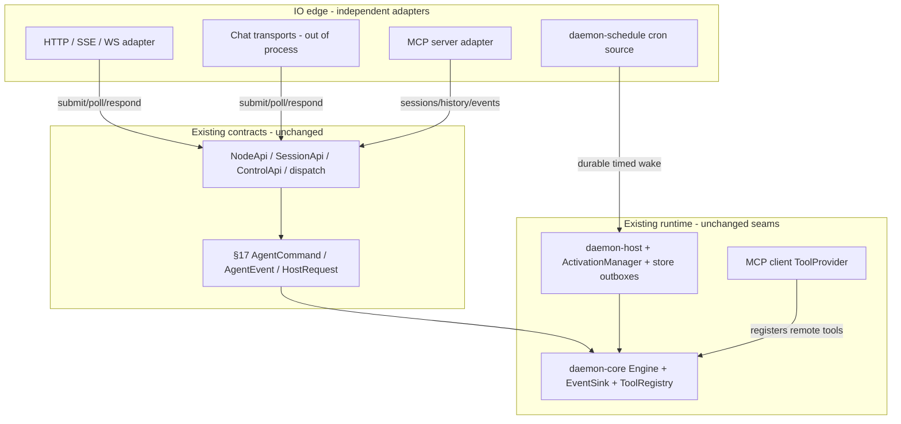
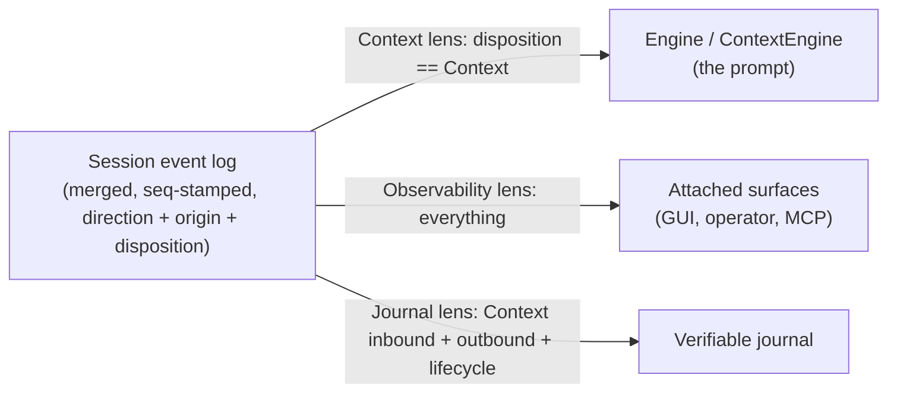

# Daemon Event / IO Architecture — research and target design

Status: research / design proposal (no code yet). Companion to `daemon-core-spec.md` (§17 host
protocol), `daemon-core-host-interface.md`, `daemon-core-messaging-surface.md`,
`daemon-orchestration-synthesis.md`, and `daemon-host-spec.md`.

This document studies how `hermes-agent` implements its **gateway**, **cron**, **MCP**, **IO/event**
and **tool** subsystems; constructively criticises that design; and proposes how the equivalent
capability should land in `daemon` (which has no concept of any of it yet). It deliberately does
**not** presuppose that a "gateway" is the right unit of architecture. Its load-bearing finding is
that the capability decomposes into small, independent transport adapters; whether daemon later
stands up a thin front-of-house aggregator over those adapters and brands it a "gateway" is an open
packaging/naming choice this doc does not foreclose. What it does reject is porting hermes's gateway
*monolith*.

Sources studied:
- `hermes-agent/gateway/` (`run.py`, `platforms/base.py`, `session.py`, `delivery.py`,
  `stream_events.py`, `platforms/api_server.py`, `platforms/webhook.py`)
- `hermes-agent/cron/` (`jobs.py`, `scheduler.py`)
- `hermes-agent/mcp_serve.py`, `hermes-agent/tools/mcp_tool.py`, `hermes-agent/optional-mcps/`
- `hermes-agent/tools/registry.py`, `hermes-agent/model_tools.py`, `hermes-agent/toolsets.py`
- daemon: `crates/contracts/daemon-api/src/lib.rs`, `crates/contracts/daemon-protocol/src/lib.rs`,
  `crates/engine/daemon-core/src/{events,actor,control,engine}.rs`,
  `crates/adapters/daemon-acp/src/lib.rs`, `crates/substrate/daemon-host`,
  `crates/substrate/{daemon-store,daemon-activation}`.

---

## 0. Conclusions up front

1. **Daemon should not port hermes's gateway *monolith*.** Hermes's `GatewayRunner` is a ~16k-line
   god-object that fuses transport handling, session management, agent lifecycle, the cron ticker,
   auth, slash commands and streaming into one class. Daemon already has the seams that decompose all
   of that: the §17 protocol, the `NodeApi`/`SessionApi` surface, the `HostRequestHandler` trait, the
   `EventSink`, and the store-backed wake/job outboxes. The capability hermes packs into a gateway
   should land in daemon as **a set of small, independent transport adapters** that each speak only
   the existing `NodeApi`/§17 surface — exactly the shape the existing `daemon-acp` adapter already
   has. This is the load-bearing decision. Note that "no monolith" is *not* the same as "no gateway":
   daemon may still choose to put a thin aggregator/front-of-house process over those adapters (a
   single listen address, shared auth/TLS, a process to supervise) and call it a gateway. That is a
   packaging choice left open here; the constraint is only that such an aggregator stays thin and
   owns no session/agent/cron logic of its own.

2. **The event core is already good and should not be replaced.** §17 `AgentEvent` is typed,
   carries a monotonic `seq`, and is lossless-primary with `seq`-resync. Blocking I/O is a typed
   `HostRequestHandler` trait, not an event + side-channel. This is strictly better than hermes's
   positional callbacks + presentation-stream-on-the-side. What is missing is purely the **IO
   edge**: inbound normalisation, outbound delivery to many surfaces, scheduled triggers, and MCP.

   The one *structural* change to the core model is to make a session a **single merged, `seq`-stamped
   event log with two directions** (§5.4): outbound (`AgentEvent`/`HostRequest`) is already
   first-class, but inbound is currently mere engine intake (`Inbound = Command | Response`, with no
   `seq`, not observable, not recorded). Lifting inbound to the same status — sequenced, recorded,
   observable, and tagged with `Origin` + a `Disposition` (`Context` by default, `Transport` as an
   opt-in lever) — is what unlocks multi-surface observability (a GUI watching a Telegram
   conversation) and a clean "in the prompt vs transport-only" axis that is cache-safe by
   construction.

3. **Cron is not a gateway concern and not an engine concern.** It is a *trigger source*. It should
   write timed wakes into the existing `SessionStore` wake outbox and fire through
   `ActivationManager`, surfacing in §17 as a turn trigger — reusing durability, fencing and
   at-most-once that the substrate already provides, rather than re-implementing hermes's
   file-locked `jobs.json` ticker.

4. **MCP is two adapters, never core.** An MCP **client** is a `ToolProvider` that registers remote
   tools into the engine's `ToolRegistry`. An MCP **server** is a host adapter over `NodeApi`. Both
   sit at the edge. Use the official `rmcp` crate for both roles. The server is richer than hermes's
   chat-only `mcp_serve.py`: because daemon has a real control plane (`ControlApi`), the server
   exposes both a **session bridge** (sessions / history / send) *and* **fleet control** (tree,
   per-unit transcripts, `assign`/`cancel`, `scale`/`pause`/`resume`, journal audit) behind a
   capability gate — i.e. it is a genuine fleet-management surface, not just a messaging bridge
   (§5.6).

5. **Recommended new dependencies** (detail in §6): `rmcp` (MCP both roles), `axum` + `tower-http`
   (HTTP/SSE/WS surface; `tower` already fits daemon-core's recovery-layer direction), and `croner`
   (cron-expression parsing only — *not* a scheduler runtime). Everything else (timers, fan-out,
   CBOR) is already in the workspace.

---

## 1. Scope and method

The user's question has four parts; this doc answers each:

- **Study** hermes's gateway / cron / MCP / IO / tools (§2).
- **Recognise what is good** and **constructively criticise** (§3).
- **Determine the better event/IO architecture** and **where it fits in daemon's current
  architecture** (§4 catalogues the seams, §5 proposes the design).
- **Determine useful dependency crates** (§6).

Method: three parallel codebase explorations (hermes IO/gateway, daemon architecture map, daemon
spec synthesis), then close reading of the daemon contract/seam files cited above, then crates.io
version/maintenance verification for every recommended dependency.

---

## 2. Hermes subsystems (condensed)

### 2.1 Gateway (`gateway/`)

The gateway is hermes's multi-platform messaging integration layer. It connects the same `AIAgent`
core used by the CLI/TUI to ~20 chat platforms, normalises inbound traffic, manages persistent
sessions, routes cron deliveries, and handles outbound (including streaming).

Core abstractions:

| Abstraction | File | Role |
| --- | --- | --- |
| `GatewayRunner` | `gateway/run.py` (~16k LOC) | Lifecycle, routing, agent cache, slash commands, cron ticker, auth, streaming |
| `BasePlatformAdapter` | `gateway/platforms/base.py` (~4.9k LOC) | Per-platform connect / send / receive; busy-session queueing; media |
| `MessageEvent` | `gateway/platforms/base.py` | Normalised inbound message all adapters produce |
| `SessionSource` / `build_session_key` | `gateway/session.py` | Origin metadata + deterministic session key |
| `DeliveryRouter` | `gateway/delivery.py` | Cron / notification output routing |
| stream events | `gateway/stream_events.py` | Presentation-layer deltas, *not* conversation history |
| `api_server` | `gateway/platforms/api_server.py` | OpenAI-compatible HTTP + SSE surface (`127.0.0.1:8642`) |
| `webhook` | `gateway/platforms/webhook.py` | Generic signed webhook → synthetic `MessageEvent` |

Inbound lifecycle: platform adapter receives a raw update → builds a `MessageEvent` +
`SessionSource` → `BasePlatformAdapter.handle_message` checks busy-session policy
(queue / interrupt / process) → background `asyncio` task → `GatewayRunner._handle_message`
(auth → slash commands → session resolve → build context → `AIAgent.run_conversation` in a thread
pool) → outbound via `adapter.send` + a `GatewayStreamConsumer` queue.

The normalised inbound shape (the genuinely good idea here):

```python
@dataclass
class MessageEvent:
    text: str
    message_type: MessageType = MessageType.TEXT
    source: SessionSource = None        # platform / chat / thread / user
    # + attachments, reply context, internal flag, ...
```

`build_session_key` is the single source of truth for turning an origin into a stable session id,
e.g. `agent:main:telegram:dm:6308981865`, `agent:main:discord:group:123:456`, with per-user
isolation rules.

Presentation vs history separation is explicit:

```python
# gateway/stream_events.py
#   Events describe *transport*, never *context*. Nothing here is persisted to
#   conversation history ... History is owned by the agent; these events are a
#   presentation-layer stream only.
```

`tui_gateway/` is a **second, separate** backend (newline-delimited JSON-RPC over stdio + optional
WebSocket) for the Ink/desktop UI. It reuses the same `AIAgent` and `SessionDB` but **not**
`GatewayRunner` — so hermes effectively has two turn engines joined only by the SQLite DB
(`state.db`) and `sessions.json`. This is the "two-engine problem" called out in
`daemon-core-messaging-surface.md`.

### 2.2 Cron (`cron/`)

Scheduled jobs that either run an LLM agent turn or a script-only watchdog (`no_agent=True`), then
deliver output.

- **Store:** `~/.hermes/cron/jobs.json`; per-run audit at `~/.hermes/cron/output/{job}/{ts}.md`.
- **Locks:** `.jobs.lock` (cross-process store), `.tick.lock` (one tick at a time).
- **Schedule kinds** (`parse_schedule`): `"30m"`/ISO → `once`; `"every 30m"` → `interval`;
  `"0 9 * * *"` → `cron` (via `croniter`).
- **Ticker:** a background thread calls `tick()` every 60s; `tick()` loads due jobs, **advances
  `next_run_at` before running** (at-most-once), and executes in thread pools (a parallel pool for
  normal jobs, a single sequential pool for `workdir` jobs that mutate `os.environ`).
- **Stale-miss handling:** a grace window that scales with the period; on restart it fast-forwards
  instead of bursting every missed run.
- **Isolation:** each run spawns a *separate* cron session (`cron_{job}_{ts}`), never merged into a
  live gateway session — this preserves message-role alternation / prompt cache. Cron sessions get
  a hardened tool policy (e.g. `cronjob`, `messaging`, `clarify` always disabled) and a 3-minute
  hard interrupt.
- **Delivery:** reuses gateway adapters + `DeliveryRouter` when running inside the gateway; a
  standalone cron daemon must be handed the adapter dict or falls back to a send tool.

### 2.3 MCP (`mcp_serve.py`, `tools/mcp_tool.py`)

Hermes plays both roles:

- **Server** (`hermes mcp serve`, stdio via FastMCP): its own `instructions` describe it as a
  "Hermes Agent messaging bridge." It registers exactly **10 tools**, all conversation / channel /
  permission oriented: `conversations_list` (`mcp_serve.py` L471), `conversation_get` (L528),
  `messages_read` (L561), `attachments_fetch` (L618), `events_poll` (L670), `events_wait` (L699),
  `messages_send` (L733), `channels_list` (L769), `permissions_list_open` (L823),
  `permissions_respond` (L839). Crucially, the event model is an `EventBridge` that **polls
  `SessionDB` + `sessions.json`** for changes — it does not embed `GatewayRunner` and has no live
  event stream; live approvals exist only in the bridge's in-memory session. **It has no notion of
  managing agents, subagents, or a fleet** — there is no fleet concept in hermes to manage. It is an
  operator/automation window onto chats and nothing more. (Daemon's equivalent server is
  deliberately broader — see §5.6.)
- **Client** (`tools/mcp_tool.py`): connects to external MCP servers (stdio / StreamableHTTP / SSE)
  on a dedicated background asyncio loop, discovers their tools, and registers them into the tool
  registry under a `mcp-{server}` toolset. `optional-mcps/` is an install catalog of manifests.

### 2.4 IO / event layering

Hermes has **no central event bus**. It uses layered normalisation + callbacks + queues:

| Layer | Mechanism | Persisted |
| --- | --- | --- |
| Platform I/O | Adapter-specific (HTTP / WS / polling) | No |
| Normalised inbound | `MessageEvent` | metadata → `sessions.json` |
| Agent conversation | OpenAI-format messages | `state.db` (`SessionDB`, FTS5) |
| Presentation stream | `stream_events.py` → consumer queue | No |
| TUI RPC events | JSON-RPC notifications | No |
| MCP bridge events | in-memory queue + DB poll | partial |
| Cron | job records + output files | Yes |

Mid-run control (`busy_input_mode`): interrupt / queue / steer; queued events capped at 32.

### 2.5 Tools (`tools/registry.py`, `model_tools.py`, `toolsets.py`)

A `ToolRegistry` singleton; each `tools/*.py` calls `registry.register(name, toolset, schema,
handler, check_fn=…, is_async=…)` at import; `handle_function_call` dispatches by name and returns a
JSON string appended as a `tool` message. **Toolsets** are named bundles — registering a tool is not
enough, its name must appear in a toolset to reach the agent schema. `check_fn` gates a tool out of
the schema when prerequisites are missing (env var, gateway running). MCP tools are a dynamic
`mcp-{server}` toolset. Skills are *not* registry tools — they are markdown playbooks loaded into
the user message (cache-safe), instructing the agent to use existing tools.

Tools are the agent's IO boundary: file (`read_file`/`write_file`/`patch`), terminal
(`terminal_tool.py`: local / docker / modal / ssh backends), browser (Playwright/CDP), network
(`web_search`/`web_extract`), messaging (`send_message_tool.py`), cron (`cronjob_tools.py`).

---

## 3. Critique

### 3.1 What is genuinely good (carry these ideas over)

1. **Normalised inbound envelope.** `MessageEvent` + `SessionSource` give every transport one shape
   to produce. Daemon should have the equivalent thin origin envelope at the edge (§5.3).
2. **Deterministic session-key derivation.** `build_session_key` as the single source of truth for
   origin → session id is exactly right and maps cleanly onto daemon's `SessionId` (§5.3). It is
   also where per-user / per-thread isolation policy lives — one place, not scattered.
3. **Presentation stream vs conversation history separation.** Hermes is explicit that stream
   events never mutate history. Daemon already enforces this structurally (live `poll` drain vs
   durable `session_history`); the lesson is to keep delivery sinks read-only over the event stream
   (§5.4).
4. **Cron correctness details.** Advance-`next_run_at`-before-run (at-most-once), period-scaled
   stale-miss grace + fast-forward (no thundering herd on restart), and **isolated cron sessions**
   that never pollute a live conversation. These semantics are worth porting verbatim even though
   the *mechanism* (file-locked JSON) is not (§5.5).
5. **Tool registry with `check_fn` gating + dynamic MCP toolsets.** Gating a tool out of the schema
   when its prerequisites are missing is a clean pattern; daemon's `ToolRegistry` should keep it and
   reuse it for MCP-sourced tools (§5.6).
6. **Out-of-process breadth.** Hermes's own direction (AGENTS.md, and daemon's `daemon-core-redesign.md`)
   is to push breadth to skills + MCP rather than an in-process plugin zoo. Daemon should commit to
   this: chat platforms and exotic integrations live *outside* the Rust tree (§5.2, §6).

### 3.2 Flaws and what to reject

1. **`GatewayRunner` / `BasePlatformAdapter` god-objects.** A single ~16k-line class owning auth +
   slash commands + agent lifecycle + cron ticker + kanban watchers + model overrides + approvals +
   restart + streaming is the central anti-pattern. It is the reason cron is "coupled to the gateway
   adapter dict" and the reason there are three drifting config paths. **Reject the *monolith*, not
   the word "gateway."** A thin aggregator that only multiplexes transports (one listen address,
   shared auth/TLS, process supervision) is fine; what must not return is a runner that owns session,
   agent, cron, or config logic. Daemon's decomposition (protocol / api / host / orchestration /
   adapters) already prevents the monolith; the IO edge must not re-introduce one behind the name.
2. **Two turn engines joined by a database.** Gateway and `tui_gateway` are separate loops that
   coordinate through `state.db` + `sessions.json`, forcing a cache-invalidation dance and
   `mirror.py` to reconstruct "what was sent." Daemon must have **one** session owner per session
   with delivery as a subscriber set (§5.4) — `daemon-core-messaging-surface.md` already specifies
   this; this doc affirms it.
3. **MCP server polls SQLite for events.** The `EventBridge` is a DB poller because there is no live
   event stream to subscribe to. Daemon *has* a live, sequenced stream (`SessionApi::poll` /
   `unit_outbound` + the durable journal); the MCP server adapter should subscribe/drain that, not
   poll (§5.6).
4. **Implicit global state.** Hermes threads runtime context through `HERMES_*` env vars and
   `ContextVars` (e.g. `HERMES_CRON_SESSION`, `HERMES_SESSION_*`). This is invisible coupling.
   Daemon already passes context explicitly (`SessionId`, `TurnCx`, `TurnTrigger`, trace scope);
   the IO edge must keep doing so — no ambient globals for routing/attribution.
5. **Three config paths (CLI vs gateway vs tools).** Each surface loads config differently and they
   drift. Daemon has one node surface (`NodeApi`) and one config seam; every adapter must bind to
   that, not grow its own config loader.
6. **Cron mechanism (file-locked `jobs.json` + 60s thread).** Correct semantics, wrong substrate.
   Daemon already has durable, fenced, idempotent outboxes (`UNIQUE(session_id, epoch, job_id)`),
   activation, and recovery scanning. Re-implementing a JSON store + cross-process file locks would
   duplicate (worse) what `daemon-store` + `daemon-activation` already guarantee (§5.5).

---

## 4. Daemon today — the seams the edge plugs into

Daemon already has the primitives an IO edge needs. Nothing below needs to change to add the edge;
these are extension points, not rewrites.

- **§17 protocol** (`daemon-protocol`): `AgentCommand` (down) and `AgentEvent` (up, monotonic `seq`,
  lossless-primary). `Outbound = Event(AgentEvent) | Request(HostRequest)` rides one drain queue, so
  a poll-based consumer sees streamed events and blocking requests in order.
- **Turn triggers** (`daemon-protocol`):

  ```rust
  pub enum TurnTrigger {
      User,
      Steer,
      BackgroundCompletion { source: CompletionSource },
  }
  pub enum CompletionSource { Process(JobId), Delegation(JobId) }
  ```

  There is currently **no `Scheduled` trigger** — adding cron implies extending this enum (§5.5).

- **The node surface** (`daemon-api`): `SessionApi` (`submit` / `poll` / `respond` /
  `session_history`) + `ControlApi` (`health`, `stats`, `sessions`, `assign`, `cancel`, `fleet`,
  `tree`, `unit`, `unit_outbound`, `unit_history`, …), composed as `NodeApi`. A single `dispatch`
  serves every non-in-process transport; `ApiRequest`/`ApiResponse` is the CBOR mirror. This is the
  one interface every edge adapter binds to.
- **Blocking I/O** (`daemon-protocol`): `HostRequestHandler::request(HostRequest) -> HostResponse`
  with `HostRequestKind::{Approval, Input, Choice, …}` and a mandatory `request_id`. This is how an
  edge surface drives human-in-the-loop UX (buttons → `HostResponse`).
- **The event sink** (`daemon-core/src/events.rs`): `EventSink` is the single point that stamps
  `seq`; it is generic over its delivery closure, so the same engine drive feeds a broadcast
  fan-out (live actor) or a discarding sink (durable path replays from the store). This is the hook
  for multi-sink delivery (§5.4).
- **The reference adapter** (`daemon-acp`): a foreign protocol (ACP JSON-RPC over stdio) bridged to
  the §17 seam via `AgentSession` + `AgentUnit::start_journaled`, mapping foreign updates to
  `AgentEvent`s and a foreign permission callback to a §17 `HostRequest`. **This is the exact shape
  every new transport adapter should take.**
- **Durable scheduling substrate** (`daemon-store` + `daemon-activation` + `daemon-host`): the wake
  outbox + job outbox, `ActivationManager::wake`, and resident interval services
  (`WakeOutboxDispatcher`, `JobOutboxDispatcher`, `RecoveryScanner`) under an OTP-style supervisor.
  Cron rides this (§5.5).

---

## 5. Proposed daemon model

### 5.1 Framing: an IO *edge* of adapters (gateway optional, and only as a thin shell)

The unit of architecture is the **transport adapter**: a small component that translates one
external world (a chat platform, an HTTP client, an MCP host, a clock) to and from the existing
`NodeApi`/§17 surface, and nothing else. There is no central *runner* that owns all transports.
A "gateway" in daemon, if it exists at all, is at most a thin front-of-house **shell** — one process
that binds a listen address, terminates TLS/auth, and supervises the adapter set — holding **zero**
session/agent/cron/config logic. The decomposition below is identical whether or not such a shell is
present; "gateway" is a deployment-packaging label, not an architectural layer. This is the
inversion `daemon-core-messaging-surface.md` already states:

> A "platform" is not how the agent is constructed — it is a transport attached to a session. The
> session actor emits typed `AgentEvent`s to a subscriber set; the platform adapter and the GUI are
> both just subscribers.

Adapters fall into two families:

- **Inbound/bidirectional transports** — drive sessions: HTTP/SSE/WS, MCP server, (out-of-process)
  chat platforms. They call `submit`/`poll`/`respond` (live) or `assign`/`cancel` (durable).
- **Trigger sources** — produce work without being a conversation surface: the scheduler (cron),
  future webhooks-as-triggers. They enqueue durable wakes and let the substrate fire turns.



### 5.2 The transport-adapter contract

Every inbound adapter is structurally identical to `daemon-acp`:

- own its transport runtime on a dedicated task (so the heavy protocol dep is isolated to that
  crate and never leaks into `daemon-host`);
- map external inbound → an inbound log entry (`Origin` + `Disposition`, §5.4), which for
  context-bearing input is an `AgentCommand` (`StartTurn`/`Steer`/`Interrupt`) via `submit`;
- consume the session log via `subscribe` (live, multi-consumer) or `poll` (single-consumer LCD),
  mapping outbound `AgentEvent` → external presentation and `HostRequest` → external approval UX,
  answering with `respond`;
- never load its own node config or touch the store directly — it talks to `NodeApi` only.

For platforms that are conversation surfaces *and* foreign agents we already have the `AgentSession`
+ `AgentUnit` path. For platforms that drive *our* engine (Telegram, Slack, an HTTP client), the
adapter is a `NodeApi` *client*, not an `AgentSession`.

### 5.3 Inbound normalisation + deterministic `SessionId`

Introduce a thin origin envelope in a contracts crate (proposed: `daemon-io` contracts, or a module
in `daemon-common`), analogous to `MessageEvent`/`SessionSource` but minimal:

```rust
/// Where an inbound item came from. The single input to session-id derivation.
pub struct Origin {
    pub transport: TransportId,   // "telegram" | "http" | "mcp" | "slack" | ...
    pub scope: OriginScope,       // Dm { user } | Group { chat, thread } | Api { key } | ...
}

/// Deterministic, stable mapping origin -> SessionId (the daemon analogue of build_session_key).
/// Isolation policy (per-user / per-thread) lives here and nowhere else.
pub fn session_id_for(origin: &Origin, policy: IsolationPolicy) -> SessionId;
```

This is a port of the *good* part of hermes's `build_session_key`: one place owns origin → session
mapping and isolation rules; the result is an ordinary `SessionId` the rest of daemon already
understands. Attribution (who/where) is carried explicitly, never via env/`ContextVars`.

`Origin` is **per inbound event, not just per session creation.** The `SessionId` is derived once
(e.g. from the Telegram chat), but every inbound item carries its own `Origin` so the log and
journal can record "steered via the GUI by the owner" vs "message from the Telegram user" within one
shared conversation. Each inbound item also carries a `Disposition` (default `Context`; §5.4) so a
transport/meta event can be admitted as observable-only without entering the prompt.

### 5.4 The session event model: a merged inbound/outbound log

This is the load-bearing model for everything at the edge, and it generalises the old "delivery
sinks" idea. Think of a session not as "an engine you send commands to and poll events from," but as
**one ordered, `seq`-stamped event log with two directions** — symmetric to how tool calls and
assistant text are *outbound* and a user message or tool result is *inbound*:

- **Outbound** (session → world): the existing `AgentEvent` stream + `HostRequest` — already typed,
  `seq`-stamped by `EventSink`, observable, journaled.
- **Inbound** (world → session): user/surface messages, steering, foreign tool results, the
  `BackgroundCompletion` and `Scheduled` triggers, *and* transport/meta events (a surface attaching,
  presence, delivery receipts).

Today the protocol is **asymmetric**: `Outbound` is first-class (sequenced, observable, journaled)
but `Inbound = Command | Response` is mere engine intake — it has no `seq`, is not broadcast to other
surfaces, and is not recorded. A Telegram user's message enters as `submit(StartTurn{..})` and
*vanishes into the engine*, so a second surface (a GUI) cannot observe that anything was said until
it surfaces in history. **Closing that asymmetry is the core change**: inbound becomes a first-class,
sequenced, recorded, observable part of the same log.

Each log entry carries three orthogonal axes:

```rust
struct SessionLogEntry {
    seq: u64,                 // one monotonic sequence across BOTH directions (global ordering)
    direction: Direction,     // Inbound | Outbound
    origin: Origin,           // which surface / trigger produced it (per-event, not per-session)
    disposition: Disposition, // Context | Transport
    payload: SessionPayload,  // AgentEvent / HostRequest / inbound command / inbound meta-event
}

enum Disposition {
    Context,    // enters the conversation: a turn, a tool message, a rehydration trigger
    Transport,  // observability only: presence, surface-attach, receipts — never in the prompt
}
```

**Disposition default = `Context`, with `Transport` as an explicit lever.** Anything that arrives at
the conversation is part of the conversation unless something deliberately demotes it. The lever can
be set per category (a presence/typing/attach event defaults to `Transport`) or toggled per event,
and the `ContextEngine` (which already owns the prompt, §10/§11) has final say. Because `Transport`
entries are never in the prompt, they are **cache-safe by construction** — this is the generalised,
first-class form of hermes's "events describe transport, never context" rule.

Three consumers read the one log through different **lenses**:



- **Context lens** (engine) — only `Context` entries; this is the conversation/prompt.
- **Observability lens** (any attached surface) — *everything*, both directions, one timeline a GUI
  renders directly. This is what makes a second surface able to watch a Telegram conversation live.
- **Journal lens** — `Context` inbound + outbound + lifecycle (the verifiable transcript);
  `Transport` entries are ephemeral and never journaled.

**Observability is a non-destructive cursor over the log, not destructive poll.** The logical
contract is `subscribe(session, after_seq)` → entries with `seq > after_seq`; the merged log's `seq`
*is* the cursor, so each surface keeps its own position and N consumers never steal each other's
events. Late-join/resync is intrinsic and by `seq`: a new subscriber backfills journaled history
(`Context` + outbound + lifecycle) up to head, then continues on the live stream — one seam
(`after_seq = 0` from start; `= head` for live-only). **Transport picks delivery, same contract:**
socket / HTTP / WS hold the connection and *push* frames (backed by the live actor's
`broadcast::Sender`); the FFI / one-shot lowest-common-denominator *long-polls* the same cursor
(`wait_ms`). `dispatch` / the mirror stays one-shot — streaming is a transport capability, not an
enum variant. The destructive `SessionApi::poll` stays as a single-consumer convenience but is not
the basis for multi-surface (a destructive drain is inherently one-reader).

This implies the `seq` must be stamped by a **single per-session sequencer across both directions**
(generalise today's outbound-only `EventSink` into the session-log sequencer). One caveat:
`Transport`-disposition entries are not journaled, so a late joiner resyncs only `Context` + outbound
history and sees transport/meta events only from attach-time onward — acceptable, since they are
ephemeral by definition. Guarantees follow §17.1: primary subscribers get backpressure (lossless);
spectators may drop and resync via the cursor.

**"Primary handover" demoted.** Where an *outbound* reply must be posted (the Telegram message send)
is now just an attribute of an outbound delivery target, not the organising concept:

```rust
/// Where a session's OUTBOUND replies are delivered. A property of the session, populated from Origin.
struct DeliveryTarget { transport: TransportId, route: RouteAddr, kind: SinkKind /* Primary | Spectator */ }
```

A GUI attaching to a live Telegram session is, by default, an **observer + submitter**: it
subscribes to the log (sees inbound and outbound) and may `submit` commands; replies still post to
Telegram (the Primary delivery target). "Handover" is then a single explicit op that re-points the
Primary target to the GUI — no longer a tangle of competing primaries. There is no second pipeline,
no `mirror.py`, no DB-as-IPC. (Auth for *who may observe/inject/handover*: single-tenant local-trust
for v1 — any authenticated local client may attach to any session; per-principal ACLs deferred.)

### 5.5 Scheduled triggers (cron) over the store outbox

Cron is a **trigger source**, not a gateway feature and not an engine feature. Proposed crate
`daemon-schedule` (a small substrate-adjacent library), responsibilities:

- Own the job definitions (schedule expression, target session/profile, payload, repeat policy,
  delivery target, isolation = run in a dedicated session id like the hermes cron-session rule).
- Compute `next_run_at` using `croner` for cron expressions and plain duration math for
  once/interval. Port hermes's correctness rules: **advance before run (at-most-once)**, and
  **period-scaled stale-miss fast-forward** on restart.
- At fire time, **enqueue a durable wake** (or job) into the existing `SessionStore` outbox and let
  `ActivationManager` drive the turn — reusing fencing, idempotency
  (`UNIQUE(session_id, epoch, job_id)`), and recovery rather than re-implementing them. This is the
  key inversion vs hermes: the scheduler does not run agents, the substrate does.
- Surface the trigger in §17 by extending `TurnTrigger`:

  ```rust
  pub enum TurnTrigger {
      User,
      Steer,
      BackgroundCompletion { source: CompletionSource },
      Scheduled { job: JobId },   // NEW
  }
  ```

  (Alternatively model a scheduled run as a `BackgroundCompletion` with a new `CompletionSource::Schedule`;
  a dedicated `Scheduled` variant is clearer and is the recommendation.)

In the §5.4 model, a scheduled fire is simply an **inbound, context-bearing event** (`disposition =
Context`, `origin = scheduler`) that opens a turn — the same shape as `BackgroundCompletion`, which
is the already-existing example of an asynchronous inbound result that triggers a turn.

**Placement (resolved, §7 decision 1): node/host.** `daemon-schedule` is a **resident host service**
under the host supervisor (beside `WakeOutboxDispatcher`), not owned by `daemon-orchestration`. Job
definitions live in `SessionStore`; the firing mechanism stays in the substrate. An
orchestrator-agent may *create* jobs (via a cron tool), but ownership of the mechanism and the job
set is the host's. Job *definitions* are a good candidate for a `tkx`-style work source rather than a
bespoke store.

### 5.6 MCP as adapter (both roles)

- **MCP client (tool breadth).** A `ToolProvider` adapter that connects to configured external MCP
  servers (stdio / streamable-HTTP / SSE via `rmcp`), discovers their tools, and registers them into
  the engine `ToolRegistry` under a namespaced toolset (`mcp:{server}`), reusing the existing
  `check_fn`-style gating so a server that fails to connect simply contributes no tools. This is the
  daemon analogue of `tools/mcp_tool.py`, isolated to its own crate (proposed `daemon-mcp-client`)
  so `rmcp` never leaks into `daemon-core`. It is the sanctioned breadth mechanism
  (`daemon-core-redesign.md`: "in-process breadth → out-of-process via MCP").
- **MCP server (expose daemon).** A host adapter (proposed `daemon-mcp-server`) over `NodeApi` that
  exposes daemon to external MCP hosts as tools+resources. It embeds no runtime policy; it is pure
  translation of the `NodeApi` surface, exactly like the surface-mapping table in
  `daemon-core-host-interface.md` ("expose commands and session data as MCP tools/resources without
  embedding runtime policy"). Unlike hermes's `mcp_serve.py` (which polls SQLite via its
  `EventBridge`), it **subscribes to the live sequenced stream** (`poll` / `unit_outbound` + the
  durable journal via `session_history` / `unit_history`).

  Because daemon — unlike hermes — has a real control plane, the server has **two tool families**,
  not one. The first mirrors hermes; the second has no hermes analogue:

  | Family | Backed by | Tools (illustrative) |
  | --- | --- | --- |
  | **Session bridge** (operator chat surface) | `SessionApi` | `sessions_list`, `session_read` (history), `session_submit` (open/continue a turn), `session_poll` (drain live events), `session_respond` (answer a blocking `HostRequest`) |
  | **Fleet control** (no hermes equivalent) | `ControlApi` | `node_health`, `node_stats`, `fleet` (roster + folded usage), `tree` (whole orchestration tree), `unit` / `unit_events` / `unit_outbound` (transcript-fidelity drill-down into *any* node), `unit_history`, `assign` / `cancel` (durable session control), `pause` / `resume` / `scale` (sub-fleet lifecycle), `verifying_key` (journal audit) |

  This makes the daemon MCP server a genuine **fleet-management surface**: an MCP client (an
  operator, an automation, another agent) can inspect the fleet-of-fleets tree, read any unit's
  verifiable transcript, drive durable sessions, and scale/pause sub-fleets — none of which hermes's
  messaging-only bridge can do, because hermes has no fleet concept.

  Two caveats this doc is explicit about:
  - **Maturity.** The *read/inspect* control ops (`fleet`, `tree`, `unit*`, `*_history`) and
    `assign` / `cancel` are real today; the *mutating* lifecycle ops `pause` / `resume` / `scale`
    currently default to `ApiError::Unsupported` on the durable path (declared in `ControlApi` but
    not yet implemented). The MCP server should surface them, but they no-op until the control plane
    fills them in.
  - **Privilege / capability gate.** The fleet-control family is a privileged surface (it can
    `cancel` work and `scale` fleets). The server must gate the two families behind a declared
    capability/scope, so a narrow chat-bridge MCP client gets only the session-bridge tools while an
    operator client opts into fleet control. This is the daemon analogue of hermes's `check_fn`
    gating, applied at the MCP-tool-exposure boundary rather than per built-in tool.

Note: `rmcp` types should be confined to these two adapter crates. The existing workspace already
uses `McpServerStdio` from `agent-client-protocol` *inside ACP* purely to spawn a subprocess — that
is unrelated to being an MCP client/server and should not be conflated.

### 5.7 HTTP / SSE / WS surface

An **optional, launch-enabled in-process surface** (resolved, §7 decision 8). The node's own
clients — `daemon-app` and embedders — talk to the node directly over the **Unix socket or the
FFI**; that is the primary path. But the node may *also* bring up an HTTP/WS surface at init,
configured on/off exactly like the MCP client set (a launch flag + config block), for browser/remote
clients. It runs **in-process in the node** (no separate "gateway shell", §5.1) as a tokio task; a
crashing handler is contained by `panic = unwind` + tower, and chat platforms stay out-of-process.

A single adapter crate (proposed `daemon-http`) binds `daemon_api::dispatch` to an `axum` router:

- request/response endpoints map 1:1 to `ApiRequest`/`ApiResponse`, marshalled as **JSON** (§7
  decision 5; CBOR stays the socket/FFI encoding);
- a streaming endpoint serves the §5.4 cursor `subscribe` as **server push** (SSE for one-way event
  streams; WebSocket via `axum`/`tokio-tungstenite` for bidirectional submit + stream);
- `tower-http` provides the cross-cutting middleware (tracing, CORS, timeouts, compression) so the
  adapter stays thin.

This replaces hermes's `api_server` (OpenAI-compatible HTTP + SSE). Because it is just another
`NodeApi` client running in-process, enabling it adds a surface without adding a `GatewayRunner`.

### 5.8 Concept mapping (hermes → daemon)

| Hermes concept | Daemon home | Notes |
| --- | --- | --- |
| `GatewayRunner` (the monolith) | independent adapters + optional thin shell | The monolith is decomposed into adapters; an optional front-of-house "gateway" shell may multiplex them but owns no session/agent/cron/config logic (§5.1) |
| `BasePlatformAdapter` | a transport-adapter crate per family | Shape of `daemon-acp`; talks `NodeApi` only |
| `MessageEvent` / `SessionSource` | `Origin` + `session_id_for` (§5.3) | Thin envelope + deterministic `SessionId` |
| `build_session_key` | `session_id_for` | Single source of origin → session + isolation policy |
| `GatewayStreamConsumer` / stream events | `EventSink` + `DeliverySink` subscriber set (§5.4) | Reuse §17 stream; sinks are read-only |
| `DeliveryRouter` | `DeliveryTarget`s owned by the session | Routing is a session property, not caller state |
| `api_server` (HTTP+SSE) | `daemon-http` (axum + tower-http) (§5.7) | `dispatch` already exists |
| `webhook` adapter | a trigger-source or thin HTTP adapter | Synthetic inbound → `submit` |
| `tui_gateway` (second engine) | the same `NodeApi` surface | One owner per session; no second loop |
| `cron/` (`jobs.json` + ticker) | `daemon-schedule` over store wake outbox (§5.5) | Port semantics, not the JSON/file-lock mechanism |
| cron isolated session | dedicated `SessionId` + `TurnTrigger::Scheduled` | Same "never pollute live session" rule |
| `mcp_serve.py` (server, chat bridge only) | `daemon-mcp-server` over `NodeApi` (§5.6) | Subscribe to live stream, not poll; adds a **fleet-control** tool family (tree / unit transcripts / assign / cancel / scale / audit) hermes has no equivalent for, behind a capability gate |
| `tools/mcp_tool.py` (client) | `daemon-mcp-client` `ToolProvider` (§5.6) | Registers remote tools into `ToolRegistry` |
| `optional-mcps/` catalog | config + manifest list for the client | Out-of-process breadth |
| `ToolRegistry` + `check_fn` gating | daemon `ToolRegistry` (already present) | Reuse gating for MCP tools |
| skills (markdown playbooks) | same idea, out of scope here | Loaded into user message, cache-safe |
| `HERMES_*` env / `ContextVars` | explicit `SessionId` / `TurnCx` / trace scope | No ambient global routing state |

---

## 6. Recommended dependency crates

Versions verified on crates.io while writing (2026-06). Pin in `[workspace.dependencies]` so each
adapter crate inherits one source of truth, exactly as the workspace already does for `tokio`,
`genai`, `agent-client-protocol`, etc.

### Add

| Crate | Version (latest stable) | Where | Why / rationale |
| --- | --- | --- | --- |
| `rmcp` | 1.7.0 | `daemon-mcp-client`, `daemon-mcp-server` | The **official** Rust MCP SDK (modelcontextprotocol org); both client and server roles, stdio + streamable-HTTP + SSE transports; tokio-native; heavy recent usage (~7.2M recent downloads). Confine to the two MCP adapter crates so it never enters `daemon-core`. |
| `axum` | 0.8.9 | `daemon-http` | Tokio/`tower`-native HTTP; first-class SSE + WebSocket; maps cleanly onto `dispatch`. The de-facto standard; aligns with daemon-core's stated `tower`-layer direction (`daemon-core-redesign.md`, `daemon-core-spec.md` §8). |
| `tower-http` | 0.7.x | `daemon-http` | Middleware (trace / CORS / timeout / compression / body-limit) so the HTTP adapter stays thin. Pairs with `axum`. |
| `croner` | 3.0.1 | `daemon-schedule` | Cron-**expression parsing + next-occurrence** only (the `croniter` analogue). Actively maintained (updated 2025-10). It is *not* a scheduler runtime — daemon owns firing via the store outbox. |

### Reuse (already in the workspace — do not add new deps)

| Need | Use |
| --- | --- |
| Timers, cancellation, tasks | `tokio` (full) + `tokio-util` (`CancellationToken`, `TaskTracker`) |
| Event fan-out to sinks | `tokio::sync::broadcast` (the `EventSink`/actor pattern already uses it) |
| Inbound command queue per adapter | `tokio::sync::mpsc` (as `daemon-acp` does) |
| Wire encoding | `ciborium` (CBOR mirror) + `serde`/`serde_json` (JSON for browsers) |
| HTTP client (if a chat adapter is in-tree) | `reqwest` 0.12 (rustls) — already pinned |
| Concurrent maps (adapter/session registries) | `dashmap` |

### Considered and rejected / deferred

| Crate | Verdict |
| --- | --- |
| `tokio-cron-scheduler` (0.15.1) | **Rejected for firing.** It is an in-memory scheduler that would run jobs *itself*, duplicating (without the durability/fencing) what `daemon-store` + `daemon-activation` already provide. We want only expression parsing (`croner`); the substrate fires. |
| `saffron` | **Rejected.** Cron parser, but unmaintained (last release 2021). `croner` is the maintained choice. |
| `cron` (0.17.0) | **Acceptable alternative** to `croner` (more total downloads, updated 2026-06). `croner` chosen for closer `croniter`-style semantics (seconds, ranges, nth-weekday) matching hermes; either is fine — decide at implementation. |
| `tokio-tungstenite` (0.29) | Only if WebSocket is needed beyond what `axum`'s built-in WS upgrade covers; `axum` alone usually suffices. |
| `teloxide` / `serenity` (Telegram / Discord) | **Deferred / out-of-tree.** Consistent with out-of-process breadth: chat platforms should be separate processes talking to `daemon-http`/the Unix socket, not in-tree workspace deps. Only pull one in-tree if a first-party chat adapter is explicitly required. |

---

## 7. Decisions, open questions, and phasing

### Resolved decisions

1. **Scheduler ownership → node/host.** `daemon-schedule` is a **resident host service** under the
   host supervisor (beside `WakeOutboxDispatcher` / `JobOutboxDispatcher` / `RecoveryScanner`), not
   owned by `daemon-orchestration`. Job definitions live in `SessionStore`; the tick computes
   `next_run_at`, enqueues into the wake outbox, and `ActivationManager` fires. An orchestrator-agent
   may *create* jobs (via a cron tool), but the firing mechanism and the job set are host-owned —
   consistent with "the host owns durable activation."
2. **`TurnTrigger::Scheduled { job }`** (a dedicated variant, not a `CompletionSource::Schedule`).
   Requires a `daemon-protocol` wire-version bump + CDDL update.
3. **Session model is a merged, direction-tagged event log** (§5.4): one `seq`-stamped log over both
   directions, each entry carrying `Origin` + `Disposition`. This is the structural change that the
   inbound/outbound symmetry and multi-surface observability rest on.
4. **Context disposition: default `Context`, with a `Transport`-only lever.** Anything arriving at
   the conversation is part of it unless deliberately demoted (per category or per event); the
   `ContextEngine` has final say. `Transport` entries are observable but never in the prompt
   (cache-safe by construction).
5. **HTTP surface speaks JSON.** `daemon-http` marshals `ApiRequest`/`ApiResponse` as JSON; CBOR
   stays the socket/FFI encoding. Encoding is a transport detail, local to the adapter.
6. **Multi-surface auth: single-tenant local-trust for v1.** Any authenticated local client may
   attach to / observe / inject into / hand over any session; per-principal ACLs deferred.
7. **MCP server scope + gating.** Gate the **fleet-control** family by a **launch-time scope**
   (`read` | `control`, with mutating ops a further opt-in inside `control`), since MCP clients are
   operator-configured rather than open-network — per-connection auth deferred. And **withhold,
   don't no-op**: register a control tool only when the control plane reports the op is supported (the
   `check_fn` pattern at MCP-exposure time), so `pause`/`resume`/`scale` appear only once implemented
   rather than returning `Unsupported` (§5.6).
8. **No gateway shell; HTTP/WS is an optional in-process surface.** The node's own clients
   (`daemon-app`, embedders) use the **Unix socket or FFI** directly. The node may *also* bring up an
   HTTP/WS surface **in-process**, enabled at init via config/flag exactly like the MCP client set
   (§5.7). No separate front-of-house process. A dedicated thin shell is revisited only for a single
   hardened public ingress (shared TLS/auth/rate-limit) on an untrusted network.
9. **Subscribe contract: a non-destructive cursor over the merged log** (§5.4). `subscribe(session,
   after_seq)` returns entries with `seq > after_seq`; the log's `seq` is the cursor (so each
   consumer holds its own position). Transport chooses delivery: socket/HTTP/WS *push* (broadcast-
   backed); FFI/one-shot *long-polls* the same cursor. `dispatch` stays one-shot; streaming is a
   transport capability, not an enum variant. Requires generalising the outbound-only `EventSink`
   into a single per-session sequencer across both directions.

### Open questions

1. **Subscribe framing details.** The decided contract (decision 9) still leaves the concrete
   on-the-wire framing, cancellation handshake, and backpressure/drop policy per transport
   (socket frames vs SSE vs WS) to be specified at implementation.
2. **`tkx` as the cron job store.** Whether scheduled-job *definitions* live in a bespoke store or
   are modelled as a `tkx`-style work source (decision 1 leaves the firing mechanism host-owned
   either way).

### Suggested phasing

- **P0 — contracts.** The merged session event log (`SessionLogEntry`, `Direction`, `Disposition`),
  `Origin` + `session_id_for`, the `subscribe` surface, and `TurnTrigger::Scheduled` (protocol bump).
  No transports yet.
- **P1 — HTTP surface.** `daemon-http` over `dispatch` (JSON request/response) + a streaming
  `subscribe` endpoint (SSE/WS). Proves the edge-as-`NodeApi`-client model and multi-surface
  observability end to end; directly usable by `daemon-app`.
- **P2 — MCP client.** `daemon-mcp-client` `ToolProvider` (`rmcp`), tools registered into
  `ToolRegistry`. Delivers breadth, the sanctioned plugin path.
- **P3 — scheduler.** `daemon-schedule` as a resident host service (`croner` + store wake outbox),
  `Scheduled` trigger, isolated sessions, at-most-once + stale-miss fast-forward.
- **P4 — MCP server.** `daemon-mcp-server` over `NodeApi` (session-bridge + scoped fleet-control),
  subscribing to the live log + journal.
- **P5 — chat transports.** Out-of-process adapters against `daemon-http`/the socket; in-tree only
  if explicitly required.

Each phase is an independent adapter crate that depends only on `daemon-api`/`daemon-protocol`
(plus its isolated transport dep), so none of them can regrow a `GatewayRunner` monolith.
