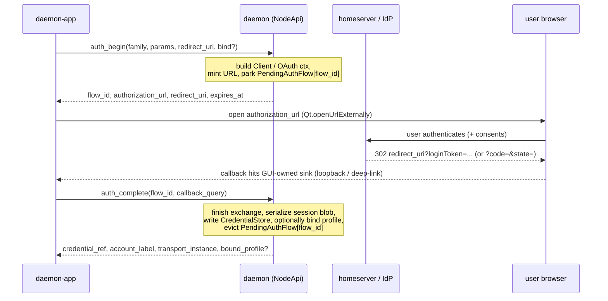

# Interactive auth (SSO / OAuth2) — a client-driven login seam

Status: design / audit + **A1 landed** (wire `AuthApi` v12 + host `PendingAuthFlows`/`AuthFlowFactory`
+ matrix SSO `begin`/`complete`, proven by a generic stub-factory conformance test and a
`MatrixMockServer` SSO test). Companion to
[`daemon-matrix-transport-spec.md`](./daemon-matrix-transport-spec.md) §6 (which introduced SSO as
adapter bring-up) and [`daemon-event-io-spec.md`](./daemon-event-io-spec.md); consumed by the GUI
story in [`daemon-gui-readiness-roadmap.md`](../../../../docs/specs/daemon-gui-readiness-roadmap.md).

This spec generalizes the Matrix `login` flow into a **transport-agnostic, wire-exposed interactive-auth
capability** so a decoupled third-party app (e.g. the Qt `daemon-app`) — possibly on a *different host*
than the daemon — can drive a browser-redirect login (Matrix SSO today; OAuth2/OIDC tomorrow) and have
the resulting credential land in the daemon's existing `CredentialStore`.

---

## 1. Scope and the one finding

**Finding: the daemon has no client-facing interactive-login capability today.** What shipped in M2 is
a *same-host operator CLI*, not something a separate GUI can drive.

- [`daemon matrix login`](../../../adapters/daemon-matrix/src/login.rs) calls matrix-sdk's all-in-one
  `MatrixAuth::login_sso(callback)`, which **spawns a loopback HTTP server inside the daemon process**
  and the callback shells out to `xdg-open` to launch a browser **on the daemon's machine**. This only
  works when daemon + browser + user are one machine — false for a daemon running headless or remote.
- `CredentialApi` (`credential_set` / `credential_list` / `credential_remove`) is on the wire, but
  `credential_set` accepts a *finished* secret string — there is no notion of a multi-step,
  browser-in-the-middle exchange. `AccountProvisioning` (the session-blob read/write seam) is
  **in-process only** (no `ApiRequest` variants).
- The result: a third-party app **cannot initiate or complete an SSO/OAuth flow through the daemon**.

Everything else needed already exists: the credential store is the system of record
([matrix spec §6.2](./daemon-matrix-transport-spec.md)), and matrix-sdk exposes the *splittable*
primitives a relayed flow requires (§6 below).

Out of scope: username/password login (no browser, already covered by `credential_set`); device
verification / cross-signing (matrix spec §6.3, deferred); authenticating the GUI↔daemon channel
itself (§9 notes it as an orthogonal transport-security concern).

---

## 2. Topology decision: GUI-relayed, remote-capable

The load-bearing decision is **who captures the browser redirect** (the `loginToken` for Matrix SSO, or
the `code`+`state` for OAuth). Two options were considered:

- **(Rejected) Daemon-hosted loopback.** The daemon keeps spinning its own loopback server and just
  hands the GUI a URL to open. Simplest, but the homeserver redirects to `http://127.0.0.1:{daemon_port}`,
  which is only reachable if the browser is on the daemon's host. Breaks for a remote daemon, and
  matrix-sdk itself warns that a local-root user can snoop the loopback token.
- **(Chosen) GUI-relayed.** The daemon **mints an authorization URL whose `redirect_uri` the GUI owns**;
  the GUI captures the callback (its own loopback on desktop, or a custom deep-link / app-link on
  mobile) and **relays the callback parameters back to the daemon** to finish the exchange. The daemon
  never opens a browser and never owns a loopback. Works whether the daemon is local or on another host.

The token transits: **homeserver → user's browser → GUI's redirect sink → GUI → daemon**.

---

## 3. The model: `begin → (browser) → complete`

A generic two-call seam, with the daemon parking a *pending flow* between the calls (the matrix-sdk
`Client` — or an OAuth flow context — must survive between minting the URL and finishing the exchange,
because it holds the homeserver, the device store, and for OAuth the PKCE verifier + `state`).



Idempotency / lifecycle: `flow_id` is single-use; `auth_complete` consumes and evicts it. Flows carry a
TTL (`expires_at`) and are capped (§5); `auth_cancel` drops one early.

---

## 4. Wire surface: a new `AuthApi` sub-trait

A new sub-trait composed into `NodeApi` beside `CredentialApi`, dispatched in `dispatch()` so it is
reachable identically over the Unix socket (CBOR) and the optional HTTP `/api` (JSON) — the exact
pattern by which `CredentialSet/List/Remove` were added
([`daemon-api/src/lib.rs`](../../../contracts/daemon-api/src/lib.rs)).

```rust
#[async_trait]
pub trait AuthApi: Send + Sync {
    /// Begin an interactive auth flow. The daemon mints the authorization URL against the
    /// GUI-supplied `redirect_uri`, parks the pending flow, and returns its handle.
    async fn auth_begin(&self, req: AuthBeginRequest) -> Result<AuthBeginResponse, ApiError>;

    /// Finish a flow from the captured redirect. The daemon completes the exchange, persists the
    /// credential blob, optionally binds it to a profile, and evicts the pending flow.
    async fn auth_complete(&self, req: AuthCompleteRequest) -> Result<AuthCompleteResponse, ApiError>;

    /// Drop a pending flow (user aborted / cleanup). Idempotent.
    async fn auth_cancel(&self, flow_id: String) -> Result<(), ApiError>;

    /// Capability discovery: which families support interactive auth and what params they need
    /// (so the GUI can render the right form). May be a static list in v1.
    async fn auth_providers(&self) -> Vec<AuthProviderInfo>;
}
```

### 4.1 Types (proposed)

```rust
pub struct AuthBeginRequest {
    /// Transport/provider family, e.g. "matrix" (later "oauth", or a specific provider id).
    pub family: String,
    /// Family-specific parameters. For Matrix SSO: { homeserver, idp_id? }.
    /// For OAuth/OIDC: { issuer, client_id, scopes, ... } (or a server-known provider id).
    pub params: serde_json::Value,
    /// The redirect URI the GUI controls and will capture (loopback URL or custom-scheme deep link).
    pub redirect_uri: String,
    /// Optional: bind the resulting account to a profile on success (edit `bound_accounts`).
    pub bind: Option<AuthBindRequest>,
}

pub struct AuthBindRequest {
    pub profile: ProfileRef,
    /// The instance-qualified transport id, e.g. "matrix/@bot:hs.org". For families where the id is
    /// only known *after* login (Matrix), this may be omitted and derived in `auth_complete`.
    pub transport_instance: Option<TransportId>,
    /// The CredentialStore key to store the blob under; defaulted/derived if omitted.
    pub credential_ref: Option<String>,
}

pub enum AuthFlowKind { MatrixSso, OAuth2Pkce }

pub struct AuthBeginResponse {
    pub flow_id: String,
    pub authorization_url: String,
    pub redirect_uri: String,
    pub expires_at: u64,          // unix seconds; the flow TTL
    pub flow_kind: AuthFlowKind,
}

pub struct AuthCompleteRequest {
    pub flow_id: String,
    /// The captured callback: either the full redirect URL or just its query string. The daemon
    /// extracts `loginToken` (SSO) or `code`+`state` (OAuth) from it.
    pub callback: String,
}

pub struct AuthCompleteResponse {
    pub credential_ref: String,            // where the blob was stored
    pub account_label: String,             // human label, e.g. the resolved @user:hs.org
    pub transport_instance: TransportId,   // e.g. matrix/@user:hs.org
    pub bound_profile: Option<ProfileRef>, // set if `bind` was honored
}

pub struct AuthProviderInfo {
    pub family: String,
    pub flow_kind: AuthFlowKind,
    pub display_name: String,
    /// A minimal schema of required/optional `params` fields, so the GUI can render a form.
    pub params_schema: serde_json::Value,
}
```

### 4.2 Versioning / CDDL impact

- New `ApiRequest` variants `AuthBegin / AuthComplete / AuthCancel / AuthProviders` and `ApiResponse`
  variants `AuthBegun / AuthCompleted / AuthProviders` — a **wire-version bump to v12**
  (`WireVersion::CURRENT` is currently 11; see
  [`daemon-api.cddl`](../../../contracts/daemon-api/daemon-api.cddl):9 and
  [`daemon-api/src/lib.rs`](../../../contracts/daemon-api/src/lib.rs):54).
- Corresponding CDDL entries in [`daemon-api.cddl`](../../../contracts/daemon-api/daemon-api.cddl)
  under the request/response groups, tagged `; ----- interactive auth (wire v12) -----`, mirroring the
  routing (v7) / delivery (v10) additions.
- `params` / `params_schema` are `serde_json::Value` on the wire (CBOR-encoded generic map) to keep the
  contract provider-agnostic; the family-specific shape is validated inside the family handler, not by
  the wire schema.

---

## 5. Host plumbing: `PendingAuthFlows` + a pluggable `PendingAuthFlow`

The stateful piece (a flow that lives across two round-trips) is owned by the host, not the wire.

- A `PendingAuthFlows` registry in [`daemon-host`](../../../substrate/daemon-host/src/), keyed by
  `flow_id`, holding a boxed **`PendingAuthFlow`** trait object. It enforces a TTL (evict on
  `expires_at`) and a hard cap on concurrent flows (DoS bound), and ideally tags each flow with the
  originating connection id so an unrelated connection cannot complete someone else's flow.

```rust
#[async_trait]
pub trait PendingAuthFlow: Send + Sync {
    /// Finish the exchange from the captured callback and yield the credential blob to persist
    /// plus the resolved account identity.
    async fn complete(self: Box<Self>, callback: &str) -> Result<AuthOutcome, ApiError>;
    fn expires_at(&self) -> u64;
}

pub struct AuthOutcome {
    pub transport_instance: TransportId,  // resolved identity (e.g. matrix/@user:hs.org)
    pub account_label: String,
    pub credential_blob: String,          // opaque; written verbatim to CredentialStore
}

/// One per family; produces a parked flow + the URL to open.
#[async_trait]
pub trait AuthFlowFactory: Send + Sync {
    fn family(&self) -> &str;
    async fn begin(
        &self,
        params: &serde_json::Value,
        redirect_uri: &str,
    ) -> Result<(Box<dyn PendingAuthFlow>, /*authorization_url*/ String, AuthFlowKind), ApiError>;
    fn describe(&self) -> AuthProviderInfo;
}
```

- `NodeApiImpl` implements `AuthApi`:
  - `auth_begin` → look up the family's `AuthFlowFactory`, call `begin`, park the returned
    `PendingAuthFlow` under a fresh `flow_id`, stash the optional `bind` intent alongside it, return
    the handle.
  - `auth_complete` → pop the flow, call `complete(callback)`, take the `AuthOutcome`, write
    `credential_blob` through the existing `CredentialStore`
    ([`credstore.rs`](../../../substrate/daemon-host/src/credstore.rs)) under the resolved
    `credential_ref` (the `bind.credential_ref`, or a derived default), and — if `bind` was set — edit
    the profile's `bound_accounts` ([`profile.rs`](../../../contracts/daemon-api/src/profile.rs)) via
    the existing `ProfileStore`. This reuses the same store the transport adapter restores from, so
    there is **no new persistence path**.
  - `auth_cancel` → drop the parked flow. `auth_providers` → enumerate registered factories.
- Factory registration happens at node assembly (same place `credential_store` / `profiles` are wired
  in [`daemon-node/src/lib.rs`](../../../node/daemon-node/src/lib.rs)); families without an interactive
  flow simply register nothing and `AuthApi` defaults return `Unsupported` / empty (mirroring the
  `CredentialApi` default stubs).

---

## 6. Matrix SSO mapping (the first family)

matrix-sdk exposes exactly the split this design needs (verified against 0.18
`MatrixAuth`):

- `get_sso_login_url(redirect_url, idp_id) -> String` — mint the authorization URL against the
  GUI-supplied redirect.
- `login_with_sso_callback(url_or_query) -> LoginBuilder` — finish from the captured callback (the
  `loginToken` carried in the redirect's query); `login_token(token)` is the lower-level equivalent.

So `daemon-matrix` gains a `MatrixAuthFlowFactory`:

- `begin(params{homeserver, idp_id?}, redirect_uri)`: build a `Client` against `homeserver` with the
  per-account on-disk E2EE store (note: the store dir cannot be keyed by `@user` yet — the user id is
  unknown until completion — so it is keyed by the eventual `credential_ref`, consistent with the
  current `account_store_dir` convention in [`account.rs`](../../../adapters/daemon-matrix/src/account.rs)),
  call `get_sso_login_url(redirect_uri, idp_id)`, and box the `Client` as the `PendingAuthFlow`.
- `complete(callback)`: `client.matrix_auth().login_with_sso_callback(callback)?...send().await`, read
  back `client.matrix_auth().session()`, serialize the existing `StoredSession { homeserver, session }`
  blob, and return `AuthOutcome { transport_instance: "matrix/{user_id}", account_label: user_id,
  credential_blob }`.

This is a **refactor, not a rewrite**: the SSO mechanics currently inlined in
[`login.rs`](../../../adapters/daemon-matrix/src/login.rs) move into reusable `sso_begin` / `sso_complete`
functions that both the new factory and the existing CLI call.

### 6.1 The CLI rebases onto the same seam

`daemon matrix login` stays as a same-host operator convenience, but is reimplemented on top of the
generic seam to keep one code path: it runs a **local** loopback sink itself, calls `auth_begin`
(in-process or over the socket) with that loopback as `redirect_uri`, opens the browser, captures the
redirect, and calls `auth_complete`. The matrix-sdk all-in-one `login_sso` is no longer the primary
path (it is the degenerate "GUI and daemon are the same process on the same host" case).

---

## 7. OAuth2 / OIDC generalization (forward-looking)

The same `begin/complete` shape covers OAuth2 Authorization Code + PKCE, which is how **Matrix MAS
(next-gen Matrix auth)** and most third-party providers work. matrix-sdk provides `client.oauth()` with
a URL builder + `finish_login`, and the generic case can use a small `oauth2`/`openidconnect` client:

- `begin`: generate `code_verifier` + `code_challenge` + `state`, build the authorization URL with the
  GUI `redirect_uri`, and park `{ verifier, state, token_endpoint, client }` as the `PendingAuthFlow`.
- `complete`: parse `code` + `state` from the callback, **validate `state`**, exchange `code` +
  `code_verifier` at the token endpoint, and serialize the resulting token set as the blob.

No new wire surface is needed — `AuthFlowKind::OAuth2Pkce`, `params` carries the issuer/client metadata,
and `flow_kind` tells the GUI it is an OAuth flow. This is why the seam is generic from day one even
though only Matrix SSO is implemented first.

---

## 8. GUI integration contract (for `daemon-app`)

The redirect sink is the GUI's responsibility. Two platform shapes, one API:

- **Desktop.** Open a transient loopback listener on `127.0.0.1:0`, pass `http://127.0.0.1:{port}/cb`
  as `redirect_uri` to `auth_begin`, open `authorization_url` with `Qt.openUrlExternally`, wait for the
  homeserver→browser→loopback redirect, extract the query string, call `auth_complete`, then tear the
  listener down. (Qt: a short-lived `QTcpServer`.)
- **Mobile.** Register a custom URI scheme / app-link (e.g. `daemonapp://auth/cb`) with the OS, pass it
  as `redirect_uri`, open the URL, receive the deep link via the platform's URL-open handler, call
  `auth_complete`.

Both use the same `NodeApi` / Unix-socket seam the app already plans to adopt for turns (see the
`ConversationOrchestrator` adapter seam noted in the GUI audit). The GUI never sees a long-lived secret
— only the single-use `loginToken`/`code` in transit, which it immediately relays.

---

## 9. Security

- The `loginToken` (Matrix SSO) and OAuth `code` are single-use and short-lived; relaying them to the
  daemon over the **trusted Unix socket** is acceptable.
- The wire surface has **no authentication layer today** (permissive HTTP, no socket auth). Interactive
  auth over **unauthenticated HTTP** carries the same caveat as `credential_set` (which already sends
  full secrets over the wire) — recommend the Unix socket, or an authenticated/TLS HTTP deployment, for
  auth ops. This is an orthogonal transport-security gap, called out, not solved here.
- OAuth path **mandates PKCE + `state` validation** and a `redirect_uri` echo check (matrix-sdk's
  `oauth()` enforces this; the generic client must too).
- `PendingAuthFlows` bounds memory with a TTL + concurrent-flow cap, and binds a flow to its
  originating connection so a foreign connection cannot complete it.
- Choosing the GUI-relay topology (over a daemon loopback) avoids matrix-sdk's documented "a local-root
  user can snoop the loopback token" exposure, because the daemon runs no loopback.

---

## 10. Phased implementation plan (M-series)

- **A1 — wire `AuthApi` + matrix SSO begin/complete. ✅ Landed.** Added the `AuthApi` trait + `ApiRequest`/
  `ApiResponse` variants + CDDL (wire v12); `PendingAuthFlows` + `AuthFlowFactory`/`PendingAuthFlow` in
  `daemon-host`; the `NodeApiImpl` impl writing through `CredentialStore` (+ optional profile bind); the
  `daemon-matrix` `MatrixAuthFlowFactory` (refactored `login.rs` into `sso_begin`/`sso_complete`) and
  rebased the `daemon matrix login` CLI onto it over a local loopback. The factory is registered in the
  node assembly (`NodeAssembly.auth_factories`) whenever the matrix transport is enabled. Proven by a
  generic stub-factory conformance test (begin → complete → blob stored + redacted on the wire + profile
  bound; cancel + consumed-flow rejection) and a `MatrixMockServer`-backed `sso_begin`/`sso_complete`
  test. *Deferred within A1:* completion over the in-process surface is exercised directly; a transport
  end-to-end over the Unix socket rides with the GUI wiring in A3.
- **A2 — OAuth2/OIDC family.** A generic `OAuthAuthFlowFactory` (PKCE + state) and/or the matrix-sdk
  `oauth()` path for Matrix MAS; provider metadata in `auth_providers`.
- **A3 — GUI wiring (`daemon-app`).** Desktop loopback sink + mobile deep-link sink; an "add account"
  UI driving `auth_providers` → `auth_begin` → browser → `auth_complete`, bound to a profile.
- **A4 — hardening.** Channel auth for the wire surface (orthogonal but a prerequisite for non-loopback
  HTTP deployments); flow audit logging; per-provider scope/consent UX.
