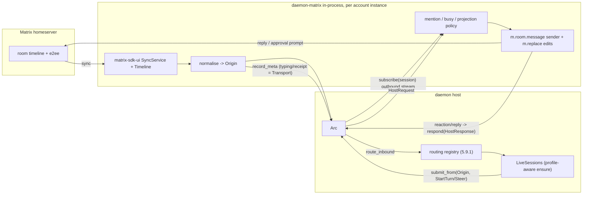

# Matrix transport (SSO + E2EE) — design, feasibility & phased plan

Status: design / feasibility. **Documentation only — no code yet.** Companion to
[`daemon-event-io-spec.md`](./daemon-event-io-spec.md); this doc is the concrete **P5 chat transport**
that spec deferred, and the first real consumer of its §5.9 bidirectional-routing capability.

A Matrix room is itself a bidirectional, ordered, server-synchronized event log with native inbound
meta (typing / receipts / reactions) and a reply target. That is exactly the shape of the merged
session log (event-io §5.4), so Matrix is the *ideal* validator of the "surface input events into
sessions" paradigm — and it forces us to make the previously-implicit routing/multi-account/outbound
rules explicit (now §5.9).

---

## 1. Scope and the one core finding

**Finding: the input-event paradigm is right, and the existing contracts already express everything a
chat transport needs.** Verified against the committed surface:

| Need | Contract | Where |
| --- | --- | --- |
| Per-event attributed inbound | `submit_from(session, Origin, AgentCommand)` | [`daemon-api/src/lib.rs`](../../../contracts/daemon-api/src/lib.rs):108 |
| Deterministic room → `SessionId` | `session_id_for(origin, IsolationPolicy)` | [`daemon-protocol/src/lib.rs`](../../../contracts/daemon-protocol/src/lib.rs):755 |
| Non-destructive outbound observation | `subscribe(session, after_seq)` / merged-log cursor | event-io §5.4 (decision 9) |
| Where replies post; GUI co-attach | `DeliveryTarget` / `SinkKind::Primary` (:811/:823) + `handover` | [`daemon-protocol/src/lib.rs`](../../../contracts/daemon-protocol/src/lib.rs):811 |
| Reply target auto-seeded from origin | `Origin::primary_target()` → `seed_primary` on first submit | protocol :851; [`node_api.rs`](../../../substrate/daemon-host/src/node_api.rs):1289/1404 |
| Observability-only meta (typing/receipts) | `record_meta` + `Disposition::Transport` | [`daemon-api/src/lib.rs`](../../../contracts/daemon-api/src/lib.rs):181 |
| Human-in-the-loop approvals | `HostRequest`/`HostResponse` + `respond` | `HostRequestKind` protocol :393 |

The one honest gap was multi-party context accumulation (§3.3) — since closed by `AgentCommand::Observe`.
Everything else is adapter wiring plus the §5.9 routing capability.

Out of scope: spaces/threads UI, voice/video, widgets, account registration. v1 targets text rooms +
DMs with E2EE on.

---

## 2. Architecture: an in-process `NodeApi`-client adapter

New crate `crates/adapters/daemon-matrix`, structurally the **inverse of `daemon-acp`**: where
`daemon-acp` isolates the `agent-client-protocol` dep and exposes *our* engine to an external ACP
client, `daemon-matrix` isolates the heavy `matrix-sdk` / `matrix-sdk-ui` deps and drives *our* engine
as a `NodeApi` **client**. It is spawned in-process at launch exactly like `daemon-http` — no
`GatewayRunner`, no second engine, no DB-as-IPC (the hermes anti-patterns the event-io spec already
rejected).

- **Dependency containment.** All `matrix-sdk` / `ruma` types stay inside the crate; it depends only on
  `daemon-api` + `daemon-protocol` (plus the isolated Matrix deps), so it cannot regrow a monolith and
  cannot leak Matrix types into `daemon-core`.
- **Multi-account host.** One `daemon-matrix` instance hosts **N accounts**. Each account is a distinct
  **transport instance** — `TransportId("matrix/@bot:hs.org")` (§5.9.2 convention) — owning its own
  `matrix_sdk::Client`, its own E2EE/crypto + state SQLite store, and its own sync loop. The adapter
  keeps an internal `TransportId → Client` map.
- **Host owns routing.** The adapter never picks an agent. It normalises a Matrix event into an
  `Origin` and hands it to the host; the host routing registry (§5.9.1) derives `(SessionId,
  ProfileRef)` and binds the live session. Replies flow back via the session's `DeliveryTarget`
  (subscriber model, §5.9.3).



---

## 3. The input-event paradigm under a real chat transport

### 3.1 Inbound mapping (Matrix → daemon)

| Matrix event | Daemon mapping | Disposition |
| --- | --- | --- |
| `m.room.message` (text), **addressed** (mention / DM / command) | `submit_from(session, origin, StartTurn` or `Steer` if busy`)` | `Context` |
| `m.room.message` (text), **not addressed** (group chatter) | buffered by the adapter, folded into the next addressed `StartTurn` (§3.3 v1) | `Context` when folded |
| `m.room.encrypted` | decrypted by `matrix-sdk` before timeline emits → treated as the cleartext message above | — |
| `m.reaction` on an approval prompt | mapped to `respond(HostResponse)` (§4) | control, not logged as chat |
| `m.reaction` (other) / typing / receipts / presence | `record_meta(origin, …)` | `Transport` (never in prompt/journal) |
| edits (`m.replace`) / redactions | meta or steer, per projection policy | `Transport` / `Context` |

`Origin` shape: `{ transport: "matrix/@bot:hs.org", scope: Group{ chat: room_id, thread? } | Dm{ user } }`.
`session_id_for(origin, binding.isolation)` (default `PerThread`, collapsing to `PerChat` where the
room has no threads) yields the deterministic `SessionId`.

### 3.2 Outbound mapping (daemon → Matrix)

The adapter `subscribe`s the sessions whose Primary names one of its account instances (subscriber
model, §5.9.3) and projects the outbound `AgentEvent` stream down to chat messages — projection policy
is adapter-owned (the mirror of inbound addressing). The discovery + subscribe + handover-stop loop is
**not** hand-rolled per adapter: the reusable `daemon-delivery` crate (`serve_delivery(api, transport,
projector)`, built on `delivery_sessions` wire v9) is the M3/M4 outbound substrate the matrix adapter
plugs its Matrix-message `Projector` into; an in-process deployment can instead register a
`daemon_api::DeliverySink` via `daemon_host::DeliveryHost` for push delivery (see event-io §5.9.3). The
event → action projection table stays adapter-owned:

| Outbound event | Matrix action |
| --- | --- |
| `TurnFinished.final_text` | `m.room.message` to the Primary's room (v1) |
| `TextDelta` (optional, M4) | placeholder message + debounced `m.replace` edits (no native streaming) |
| tool / reasoning events | suppressed by default; optional terse tool-summary line (config) |
| `HostRequest::Approval` / `Choice` | a prompt message + reaction options (§4) |
| `handover` re-points Primary | this instance, if demoted to `Spectator`, **stops posting** (§5.9.3) |

Multi-account demux is free: the Primary carries the account-instance `TransportId` + room
`RouteAddr`, both seeded as the inverse of the opening `Origin` (`Origin::primary_target()` →
`seed_primary`), so a reply always leaves the **right** account into the **right** room with no extra
config.

### 3.3 The one honest gap — multi-party context accumulation

`AgentCommand` is `{StartTurn, Steer, Interrupt, Snapshot, Shutdown}`
([`daemon-protocol/src/lib.rs`](../../../contracts/daemon-protocol/src/lib.rs):39). Every
context-bearing inbound (`StartTurn`/`Steer`) **runs the engine**. In a multi-user room the agent
should *see* other humans' chatter as context but only *turn* on a mention / DM / command. There is no
"append to conversation context without starting a turn." Two answers:

- **v1 (no contract change):** the adapter **buffers** non-addressed messages (bounded ring, cap ~32)
  and folds them, attributed, into the input of the next addressed `StartTurn`. The merged log still
  records each as an inbound entry; only the *turn trigger* is mention-gated.
- **landed (additive contract):** `AgentCommand::Observe { input, request_id }` appends inbound
  context to the conversation **without** opening a turn (wire v8). Chatter folds in while the engine
  is idle and lands in the following turn while busy — so the adapter can surface every room message
  as context and still mention-gate the *turn*, without the buffer-and-fold workaround. Either
  approach works; `Observe` is the cleaner one now that it exists.

**Addressing / trigger + busy policy is pure adapter logic** (prior art: hermes `busy_input_mode`), no
contract home needed:
- *trigger:* explicit mention of the bot, DM, or a `!command` prefix; configurable per route.
- *busy session:* `queue` (default) | `interrupt` | `steer`, with the ring cap; mirrors hermes
  semantics without importing its mechanism.

---

## 4. Approvals & meta (human-in-the-loop over a chat)

`HostRequest` (e.g. a tool wants permission) maps to a chat prompt — the same bridge `daemon-acp`
already does for `resolve_permission`, just rendered as a message:

1. Adapter receives a `HostRequest::Approval|Choice` on the session's outbound stream.
2. It posts a prompt message and adds reaction options (✅/❌ for approval; numbered for choice), or
   accepts a textual reply.
3. The user's reaction/reply → `respond(request_id, HostResponse)`.

Typing indicators, read receipts, reactions (non-control) and presence are pushed via `record_meta`
with `Disposition::Transport`: observable on the live log and broadcast to other surfaces (a GUI
spectator), but never folded into the prompt or the journal — cache-safe by construction.

---

## 5. Routing instantiated (the §5.9 capability, made concrete for Matrix)

This is the Matrix realisation of the general bidirectional routing capability. It answers the two
considerations that motivated §5.9: *rooms → agents* and *multiple accounts*.

### 5.1 Account → profile is the default binding

A Matrix **account** (a login, one transport instance) is **bound to a daemon profile**. That binding
is the baseline: every room/DM that account participates in runs that account's profile, unless a route
override says otherwise. The binding is **data in the credential/profile subsystem**, not a route-table
column (§6.2): the host reads it as precedence step 2.

### 5.2 Per-room profile override (optional)

A single account can still fan multiple agents across its rooms via an explicit route-table row
(`OriginMatcher` on room glob / DM / space → `profile`). For Matrix this is the *exception*; for
non-chat transports (HTTP keys, scheduler) the override row is the *primary* selector.

### 5.3 Profile-resolution precedence (decided)

```
route override (binding.profile, optional)
  >  account's bound profile (credential-derived default for all its rooms)
  >  node default profile
```

### 5.4 N accounts × N rooms → sessions/profiles (worked example)

```
accounts:  matrix/@ops:hs.org   -> profile "ops-agent"   (credential binding)
           matrix/@help:hs.org  -> profile "support"     (credential binding)
route overrides:
           matrix/@ops:hs.org , room #secops  -> profile "secops-agent"

inbound  (room #general via @ops)   -> Origin{ transport: matrix/@ops:hs.org, Group{#general} }
                                     -> session_id_for(.., PerThread)  bound to "ops-agent"
inbound  (room #secops via @ops)    -> override row hits -> bound to "secops-agent"
inbound  (DM to @help)              -> Origin{ transport: matrix/@help:hs.org, Dm{user} }
                                     -> bound to "support"
outbound (any of the above)         -> Primary = inverse of its Origin -> reply leaves the
                                       originating account into the originating room
```

`session_id_for` keeps owning *naming* (and already namespaces by the instance-qualified
`TransportId`, so two accounts never collide); the registry adds *agent selection*. The one invasive
host change this requires is the profile-aware `LiveSessions::ensure(session, ProfileRef)` noted in
§5.9.1 ([`node_api.rs`](../../../substrate/daemon-host/src/node_api.rs):1198 is the current
profile-blind `ensure`).

---

## 6. SSO + E2EE feasibility & the credential model

### 6.1 SSO is adapter bring-up, not per-session

Opening a browser is inherently interactive, so login lives at bring-up, not in the headless run loop.
`matrix-sdk`'s `sso-login` feature provides two paths:

- `client.matrix_auth().login_sso(|url| open_browser(url)).await` — the SDK spawns a local callback
  HTTP server, you open `url`, the SDK completes the token exchange. **Recommended**, wrapped in a
  one-shot operator subcommand.
- `get_sso_login_url(redirect_url, idp_id)` + `login_token(token)` — manual control over the redirect
  server (useful for a custom/remote callback), same outcome.

Recommended UX: a `daemon-matrix login --homeserver <url> [--profile <p>]` subcommand the operator runs
once per account. It performs SSO and **writes the resulting session into the credential store** under
the profile's Matrix credential-ref.

### 6.2 Credential model — the credential subsystem is the system of record (decided)

The Matrix **login material** — homeserver URL, `user_id`, `device_id`, access token, refresh
token/expiry — lives in `CredentialStore` / `CredentialApi`, the *same* surface that already holds
provider keys and web-tool keys (persisted via `FileCredentialStore` at
[`bins/daemon/src/main.rs`](../../../../bins/daemon/src/main.rs):1007). This is **not** the E2EE crypto
store (§6.3).

- **No contract change.** `credential_set` already takes a `String`; the credential *value* is a
  serialized Matrix session blob (the SDK's `MatrixSession` / full-session serialization).
- **Redaction.** `credential_list` shows homeserver / user / device and hides the tokens.
- **Lifecycle.** `daemon-matrix login` (SSO) **writes** the session here; the adapter **restores** from
  here at startup; matrix-sdk token **refreshes are written back** here — the credential store is
  **authoritative** over the SDK's own session copy (observe `Client` session changes via
  `set_session_callback` / save-session hook and persist on change).
- **Account ↔ profile binding — landed (generically).** The profile names its account(s) via the
  transport-agnostic **`ProfileSpec.bound_accounts: Vec<BoundAccount { transport_instance, credential_ref }>`**
  ([`daemon-api/src/profile.rs`](../../../contracts/daemon-api/src/profile.rs)), distinct from
  `credential_ref` (the provider key). For Matrix, `transport_instance` is `matrix/@bot:hs.org` and
  `credential_ref` names the session blob below. The host derives the routing registry's
  `instance_profiles` baseline (precedence step 2) from every profile's `bound_accounts` at assembly
  (`RoutingRegistry::bind_instances_from_profiles`); an explicit config instance binding overrides it.
  A profile owns 1..N accounts; the adapter (M3) discovers them by scanning profiles' `bound_accounts`
  and brings up one `Client` per account.

### 6.3 E2EE store stays matrix-sdk-owned (NOT in the credential store)

The megolm / device / cross-signing crypto store + room-state store is a large binary SQLite database
`matrix-sdk` owns. It lives under `<profile_home>/matrix/<instance>/`, one per account; enable the
`e2e-encryption` + `sqlite` features. Constraints:

- The `device_id` stored in the credential **must** match the device the crypto store was created for —
  restoring a session means re-opening *its* crypto store, not a fresh one.
- v1 accepts unverified sessions / auto-verifies via a recovery key; full cross-signing + SAS
  interactive verification is a follow-up (§9, M5).
- Sync must stay running for key sharing / to-device traffic; a stopped adapter can miss room keys.

---

## 7. Launch wiring (mirrors the HTTP / metta / web pattern)

### 7.1 Config — [`bins/daemon/src/config.rs`](../../../../bins/daemon/src/config.rs)

Add `MatrixConfig` + `FileMatrixConfig` (+ `DAEMON_MATRIX_*` env), shaped like `WebConfig` /
`MettaConfig`:

```toml
[matrix]
enabled       = true
store_root    = "matrix"          # under profile_home; per-account subdir <instance>/

# the route table = the config surface of the routing registry (5.9.1).
# NO account secrets here — accounts/tokens come from the credential subsystem,
# bound to profiles; the adapter enumerates them at bring-up.
[[matrix.route]]
account       = "@ops:hs.org"     # optional; omit to match any account
room_glob     = "#secops*"        # or: dm = true / space = "..."
profile       = "secops-agent"    # OPTIONAL per-room override (precedence step 1)
isolation     = "per_thread"
mention_gating = true
```

`profile` is the optional override; the default profile for an account comes from its credential
binding (§6.2), never from config.

### 7.2 Spawn — [`bins/daemon/src/main.rs`](../../../../bins/daemon/src/main.rs) `run_as_host`

A conditional `tokio::spawn(daemon_matrix::serve(node.clone(), cfg.matrix))` next to the `http_server`
block ([`main.rs`](../../../../bins/daemon/src/main.rs):1205), aborted on ctrl_c alongside the HTTP
server (:1223).

### 7.3 Workspace deps — [`Cargo.toml`](../../../../Cargo.toml) `[workspace.dependencies]`

- `matrix-sdk = { version = "0.18", features = ["e2e-encryption", "sqlite", "sso-login"] }`
- `matrix-sdk-ui = "0.18"` (SyncService + Timeline; UI-friendly observable room/timeline state)
- **Bump workspace `rust-version` to 1.93** (matrix-sdk 0.18 MSRV). All matrix types confined to the
  adapter crate.

---

## 8. Learn-from-hermes

The event-io spec already dissected hermes's gateway; this design **carries over only the good ideas**
— a normalised inbound envelope (`Origin`), a deterministic session key (`session_id_for`), the
busy-input policy, and presentation-vs-history separation (`Disposition`/projection) — while
**rejecting** the `GatewayRunner` monolith, the two-engine TUI/desktop split, and DB-as-IPC. Hermes
desktop notably does *not* surface inbound input events into sessions; this design does, which is the
whole point of the merged-log paradigm.

---

## 9. Risks

- **MSRV 1.93 bump is workspace-wide** (CI + every crate). Verify the existing dep set still compiles;
  heavy compile cost (crypto + sqlite). Biggest blast radius.
- **E2EE device-verification UX** for a headless agent is awkward; v1 leans on recovery-key
  auto-verify, deferring SAS/cross-signing.
- **No native streaming in Matrix.** v1 posts final text; the streaming enhancement is a placeholder +
  debounced `m.replace` edits.
- **`matrix-sdk-ui` sliding sync** needs homeserver support (simplified sliding sync / MSC4186); fall
  back to `matrix-sdk` native `sync` if absent.
- **Multi-party context gap** (§3.3) — *addressed:* `AgentCommand::Observe` (wire v8) appends context
  without a turn; the v1 buffer-and-fold remains a valid no-contract alternative.
- **Profile-aware live binding** was the one genuinely invasive host change — *landed:* `LiveSessions`
  / `SessionEngineBuilder` are profile-aware (`ensure(session, ProfileRef)`), and the per-room
  **profile-scoped memory/context** it implies is done — `profile_home` is per-profile and the live
  §10/§11 context/memory builders thread the resolved `ProfileRef`, so two routed profiles get
  isolated banks (no shared-bank compromise).

---

## 10. Phased implementation plan (M-series)

- **M0 — docs.** This doc + the event-io §5.9 routing capability (decision 10 + P4.5 phasing). *(Done.)*
- **M1 — general routing (both directions).** *(Done.)* Host-level binding registry + profile-aware
  `LiveSessions::ensure(session, ProfileRef)` + the transport-instance convention + the explicit
  outbound dispatch-ownership rule (subscriber self-selects Primary, honors `handover`). The reusable
  foundation; **testable without Matrix** (HTTP-key → profile, reply on the same connection).
- **Foundation hardening (landed ahead of M5).** Pulled forward because they are transport-agnostic
  and the foundation is cleaner with them in: profile-scoped §10/§11 memory/context (isolated banks
  per routed profile), `AgentCommand::Observe` (the §3.3 context-append, wire v8), and the
  account→profile binding as profile data (`ProfileSpec.bound_accounts` → `instance_profiles`,
  precedence step 2); and the **outbound delivery foundation** (§5.9.3 made reusable):
  `delivery_sessions` owned-session discovery (wire v9), the in-process `DeliverySink` push pump
  (`daemon_host::DeliveryHost`), and the reusable `daemon-delivery` pull subscriber (the M3/M4 outbound
  substrate this adapter plugs its `Projector` into). All testable without Matrix.
- **M2 — `daemon-matrix` skeleton + per-account `login`.** SSO writes the session into `CredentialStore`
  under the profile's Matrix credential-ref; the adapter restores from there and opens the per-account
  E2EE store; refresh write-back. Feasibility proof.
- **M3 — inbound projection.** Enumerate credential-bound accounts per profile; SyncService/Timeline →
  router (account→profile default + room override) → `submit_from`; mention/busy policy; final-text
  reply to the per-account `Primary`.
- **M4 — outbound richness.** Outbound delivery via the `daemon-delivery` subscriber (or an in-process
  `DeliverySink`) with a Matrix `Projector`; `HostRequest` → reaction-approval → `respond`;
  typing/receipt → `record_meta`; streaming-edit replies.
- **M5 — hardening.** E2EE cross-signing/SAS verification; `handover` (GUI co-attach); optional
  out-of-process bin. (Profile-scoped memory/context under per-room binding landed early — see
  Foundation hardening above.)
