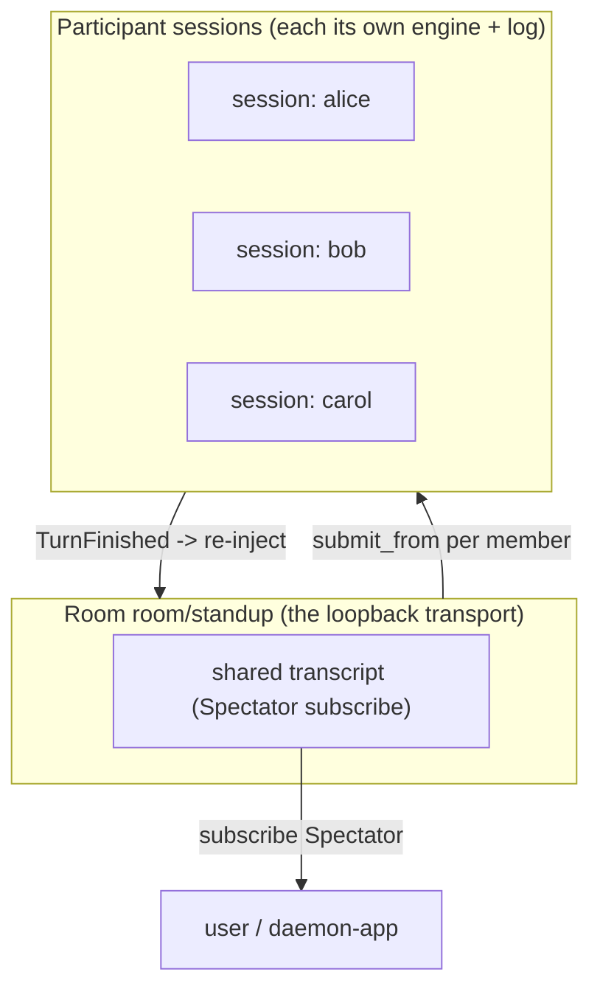
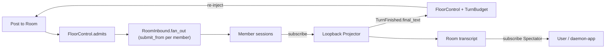
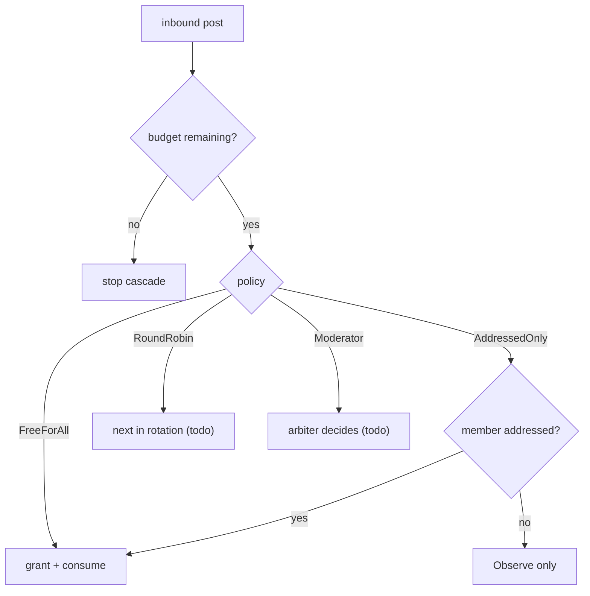

# Rooms — the internal loopback transport (N-participant agent conversations)

Status: landed (the `crates/adapters/daemon-rooms` adapter: `RoomRouter` + `serve` entrypoint, all four
floor-control policies, the loopback `RoomProjector` re-injection, and the sealed per-room transcript;
contract + store in `daemon-protocol` / `daemon-api` / `daemon-store`; see §9 for what is landed vs
deferred).
Companion to [`daemon-event-io-spec.md`](./daemon-event-io-spec.md) (the §5.4 merged session log and
§5.9 bidirectional-routing capability this builds on) and
[`daemon-matrix-transport-spec.md`](./daemon-matrix-transport-spec.md) (the chat-transport shape this
mirrors). This doc is the concrete consumer that turns "surface input events into sessions" inward: a
Room is a chat transport whose homeserver is the daemon itself.

> Room *management* (create / set-topic / send / membership) is realized via the typed
> messaging-adapter interface in [`daemon-messaging-adapter-spec.md`](./daemon-messaging-adapter-spec.md)
> — Rooms is its first reference implementor (`SupportsConversations` + the operator-curated
> membership extension) — rather than the bespoke `room_*` ops sketched here, which are retired.

A Room reuses every routing/ingest/delivery primitive the Matrix transport validated; the only
genuinely new logic is the **floor-control policy** (whose turn it is). A2A (§8) is positioned here as
a *future edge adapter* for cross-node/org federation — explicitly **not** the internal fabric.

---

## 1. Scope and the one core finding

**Finding: a Room is not a new subsystem — it is the existing chat-transport shape pointed at a
loopback "homeserver".** Three asks (agent DMs, group chats, user observability of both) collapse into
**one** new primitive (the Room entity) plus **one** new adapter (`daemon-rooms`), because the merged
`seq`-stamped session log (event-io §5.4), the `Origin`/`Disposition` attribution, the
`SinkKind::Primary|Spectator` fan-out, the `AgentCommand::Observe` ambient path, and the reusable
`daemon-ingest` (addressing -> command) + `daemon-delivery::Projector` (output -> message) halves
already express everything an N-party conversation needs.

| Need | Contract reused | Where |
| --- | --- | --- |
| Per-event attributed inbound | `submit_from(session, Origin, AgentCommand)` | `daemon-api` `SessionApi` |
| Deterministic room -> `SessionId` | `session_id_for(origin, IsolationPolicy)` | `daemon-protocol` |
| Ambient vs. turning context | `AgentCommand::Observe` vs `StartTurn` | `daemon-protocol` |
| Non-destructive observation | `subscribe(session, after_seq)` (merged-log cursor) | event-io §5.4 |
| Where replies post; co-attach | `DeliveryTarget` / `SinkKind` + `handover` | `daemon-protocol` |
| Reusable inbound gate | `daemon_ingest::Ingestor` | `crates/adapters/daemon-ingest` |
| Reusable outbound delivery | `daemon_delivery::serve_delivery` + `Projector` | `crates/adapters/daemon-delivery` |

The single new piece is floor control (§5). The live post fan-out behavior, transcript persistence,
and the moderator/round-robin arbitration have all landed (§9); they ride the messaging-adapter
`Conv*`/`Member*` ops rather than bespoke `room_*` ops. A2A code is out of scope entirely (§8 is
design-only).

---

## 2. The untangling: `Session` is not `Room`

`Session` (one engine incarnation + its merged log) and `Room/Chat` (an N-participant shared space)
are different things that prior thinking conflated. Once separated:

- **DM / session-to-session** = a Room with **2** agent participants.
- **Group chat** = a Room with **N** participants.
- **User observability** = the user is a `Spectator` (and optional participant) on the Room.

A Room owns no engine. Each *participant* is an ordinary `Session` (its own engine + log + journal);
the Room is the routing fabric that fans posts between them and records the shared transcript. This is
exactly the relation a Matrix room has to the bot accounts in it — except here every participant is a
local session and the "server" is the daemon.

---

## 3. The internal loopback transport

A Room presents as a transport instance, structurally identical to a Matrix account but with the
daemon as homeserver:

- **Identity.** `TransportId("room/<room_id>")` (the `room/` family, mirroring `matrix/@bot:hs.org`),
  routing scope `OriginScope::Group { chat: <room_id>, thread: None }`. `RoomId::transport()` and the
  `Group` scope are the only handles the router threads through `Origin`.
- **Inbound (`inbound.rs`).** One post is fanned out to **every** member: for each member the router
  submits the floor-chosen command (`StartTurn` if addressed, else `Observe`) to that member's
  pre-resolved session via `submit_from`, attributed to the room's loopback `Origin`. The membership
  table binds `(room, member) -> (ProfileRef, SessionId)` so each member is its own session (distinct
  from the single-account Matrix case, where one origin maps to one session).
- **Outbound (`outbound.rs`).** A loopback `daemon_delivery::Projector` subscribes each member
  session's merged log; on `TurnFinished.final_text` it applies the floor policy, **re-injects** the
  text as a new inbound Room post, appends it to the transcript, and pushes it to the user's
  `Spectator`s. In the same callback it drives the inbound gate's busy state from
  `TurnStarted`/`TurnFinished`, so the gate needs no second subscription (mirrors the Matrix
  projector).

The loop `post -> session -> TurnFinished -> re-inject -> post` is what makes agents converse; the
turn budget (§5) is what stops it from running away.

---

## 4. The Room entity, membership, and transcript

A Room is durable, modeled on the `chat_routes` pin row (the store stays protocol-free; typed columns
the host indexes + an opaque host descriptor blob).

- **`rooms`** — `id` (PK), `name`, `policy` (the floor-control tag), `descriptor` (CBOR of the wire
  `Room` metadata).
- **`room_members`** — `(room_id, member)` (PK), `profile`, `session_id`.

The wire DTOs (`daemon-api`) mirror the `ChatRoute`/`RoomInfo` derive set:

- `Room { id: RoomId, name, policy: RoomPolicy, members: Vec<RoomMemberView> }`
- `RoomMemberView { member, profile, session }`

and the protocol newtypes (`daemon-protocol`): `RoomId` (`room/<id>` transport), `RoomMember`
(`member` + `profile` + resolved `session`), and `RoomPolicy` (§5). `Room` is distinct from the
existing read-only `RoomInfo` (the per-transport room *enumeration* the `transport_rooms` op lists):
`RoomInfo` answers "what chats does this transport see?", `Room` is the first-class entity managed via
the messaging-adapter `Conv*`/`Member*` ops (`ConvCreate`/`ConvList`/`ConvGet`, `MemberInvite`/
`MemberRemove`) — the bespoke `room_*` ops sketched earlier were retired.

**Transcript.** The Room transcript is the merged log already produced by the member sessions plus the
re-injected posts; durable history rides the existing verifiable-journal `TranscriptBlock` path
(event-io). No new transcript store is introduced — a Room transcript is a *view* over the participant
logs keyed by the room origin. (The transcript-append on each post + re-injection is implemented as a
sealed verifiable-journal block in `RoomRouter`.)

---

## 5. Floor-control policies (the only novel logic)

Floor control decides, for an inbound post, *which* members may open a turn, and a turn budget caps
how far a single post may cascade so a room cannot echo-storm. The policy is the enum
(`daemon-protocol::RoomPolicy`) with the logic in `daemon-rooms::policy` (`FloorControl::admits`):

| Policy | Who turns on a post | Status |
| --- | --- | --- |
| `AddressedOnly` (default) | only an explicitly mentioned member; others `Observe` | implemented |
| `FreeForAll` | every member (bounded only by the budget) | implemented |
| `RoundRobin` | members in a fixed rotation (per-room cursor) | implemented |
| `Moderator { profile }` | a moderator member arbitrates the next speaker | implemented |

`TurnBudget { max_turns }` (config `[rooms].max_turns`, default 16; `0` = unbounded) is consumed per
granted turn and reset at the start of each originating post (`FloorControl::begin_post`). It is the
echo-storm guard: without it, `FreeForAll`/`RoundRobin` would re-inject indefinitely.

---

## 6. Observability: Spectator, subscribe, handover

The user observes and participates through the **existing** primitives, unchanged:

- **Spectator.** A user surface (daemon-app) attaches to a participant session — or to the room origin
  — as a `SinkKind::Spectator` and reads the full merged log via `subscribe(session, after_seq)`. It
  sees every post and every `TurnFinished` without being the reply sink.
- **Participate.** The user injects a post as an ordinary member (a `ConvSend` from the user handle),
  which the router fans out like any other.
- **Take the floor.** `handover` re-points a session's `Primary` to the user surface, so the user can
  seize a participant's reply sink (e.g. to answer on its behalf). Both `Spectator` attach and
  `handover` are already first-class (event-io §5.4); Rooms add no new observability mechanism.

---

## 7. The routing-manager GUI surface

A Room is not a bespoke sidebar scope in the client. Because it is structurally a
transport (one whose participants are agents), a Room appears in the **unified,
transport-agnostic conversation roster** exactly like a Matrix room, is **observed**
via `subscribe` (the merged-log Spectator view), and is **wired/managed** — created,
membership, floor policy — in the routing manager. This is the classic
multi-protocol messenger split (one roster across accounts + a separate account/
wiring manager); the daemon user stories capture it as the conversation-surfaces
model (see `daemon/user-stories/README.md`, "Conversation surfaces").

The daemon-app routing manager already builds on these wire ops, reused unchanged:

- `routing_list_chats` / `routing_get` / `routing_set` / `routing_bind_chat` / `routing_unbind_chat`
  — the chat->session pins (a Room member binding is one such pin).
- `transport_rooms` — enumerate the rooms a transport instance knows about (now includes `room/*`).
- `tree` / `tree_subscribe` — the orchestration tree the GUI renders.
- `subscribe` — the live merged-log stream the GUI tails for a Spectator view.

Room management rides the typed messaging-adapter `Conv*`/`Member*` ops on the same `ControlApi`
(forwarded to the registered `daemon-rooms` adapter; `ApiError::Unsupported` on a node built without
it). A Room is a conversation of `ConversationType::{GroupDm, Channel}`; its floor policy is carried in
`CreateConversationDetails.extras`:

| Op | Request | Response | Meaning |
| --- | --- | --- | --- |
| `conv_list` | `ConvList { transport }` | `Conversations(Vec<ConversationInfo>)` | every Room on the `room` transport |
| `conv_get` | `ConvGet { transport, conv }` | `Conversation(Option<ConversationInfo>)` | one Room by id |
| `conv_create` | `ConvCreate { transport, details }` | `Conversation(Some)` / `Error` | create a Room (policy in `details.extras`) |
| `conv_delete` | `ConvDelete { transport, conv }` | `Ok` / `Error` | delete a Room |
| `member_invite` | `MemberInvite { transport, conv, who, message? }` | `Ok` / `Error` | add a member |
| `member_remove` | `MemberRemove { transport, conv, who, reason? }` | `Ok` / `Error` | remove a member |
| `conv_send` | `ConvSend { transport, conv, from?, message }` | `Ok` / `Error` | inject a post (router fans out) |

These ops are in `daemon-api.cddl` and the generated CBOR codec; `WireVersion` is at 18–20.

---

## 8. A2A's role — a future EDGE adapter, NOT the internal fabric (design only)

A2A (Agent-to-Agent protocol) is **1:1 client/server task-RPC**: no rooms, no group, no third-party
observation, a server-local `contextId`. That is the opposite of the internal Rooms fabric (N-party,
observed, shared transcript). So A2A is **not** how local sessions talk to each other; it is the
**edge protocol for cross-node / cross-org federation**, a sibling of `daemon-matrix` / `daemon-acp`.
This task creates **no** `daemon-a2a` crate — this section is design only.

Two future adapters (siblings, both deferred):

- **`daemon-a2a` server.** Expose local profiles as `AgentCard`s; an external `Task` becomes a
  `submit_routed` under `Origin { transport: "a2a/<client>" }`, replies stream back over SSE.
- **`daemon-a2a` client.** An external A2A agent becomes a **remote Room participant**: the
  `RoomRouter` bridges room posts -> A2A `SendMessage` and the A2A stream -> re-injected room posts
  (the loopback projector's remote analogue).

### A2A <-> daemon mapping table

| A2A concept | daemon concept | Notes |
| --- | --- | --- |
| `AgentCard` | `ProfileSpec` (exposed) | one card per published profile |
| `contextId` | `SessionId` | server-local conversation key -> our durable session |
| `Message` / `Message.Part` | `UserMsg` (`AgentCommand::StartTurn`/`Observe`) | parts concatenated/attributed into the input body |
| `Task` | one routed turn (`submit_routed`) | task lifecycle == turn lifecycle |
| SSE stream (`tasks/sendSubscribe`) | `subscribe(session, after_seq)` | merged-log cursor projected to A2A events |
| push notification config | `DeliverySink` / `DeliveryTarget` | where async results post |
| `a2a/<client>` | `TransportId` | one transport instance per federated peer |

The internal fabric (this doc) and the edge protocol (A2A) are deliberately separate layers: Rooms own
multi-party + observation; A2A owns federated 1:1 task-RPC. Bridging the two is the `daemon-a2a` client
adapter's job, later.

---

## 9. What is landed vs deferred

Landed:

- Protocol newtypes `RoomId` / `RoomMember` / `RoomPolicy`.
- `daemon-api` `Room` / `RoomMemberView` DTOs and the management surface — realized via the typed
  messaging-adapter `Conv*`/`Member*` ops (`ConvCreate`/`ConvList`/`ConvGet`/`ConvSend`/`ConvSetTopic`,
  `MemberInvite`/`MemberRemove`), forwarded to the registered `daemon-rooms` adapter. (The bespoke
  `room_*` `ControlApi` ops were retired; CDDL parity + `WireVersion` 18–20 done.)
- `daemon-store` `Room` / `RoomMember` rows + sqlite `rooms` / `room_members` tables + their CRUD impls.
- `daemon-rooms` crate: `RoomsConfig`, `RoomRouter` + `serve` (loads durable rooms, subscribes member
  delivery), `Membership` + `RoomInbound` fan-out, `FloorControl` + `TurnBudget`, and the loopback
  `RoomProjector` re-injection.
- `RoomProjector::reinject` — the session -> Room resolution, floor gating, sealed-transcript append,
  and fan-out of a finished turn.
- `FloorControl::admits` for all four policies, including `RoundRobin` (turn-order cursor) and
  `Moderator` (arbiter state).
- The live post -> `RoomInbound::fan_out` wiring (via `ConvSend`) and loading membership into the
  router on `MemberInvite`/`MemberRemove`.
- Wiring: workspace member + dep, `[rooms].enabled` config; the adapter is registered in the
  `AdapterRegistry` in `bins/daemon` and lifecycle-driven by `AdapterRegistry::spawn_all`.

Deferred:

- The `daemon-a2a` server + client adapters (§8 — design only here).
