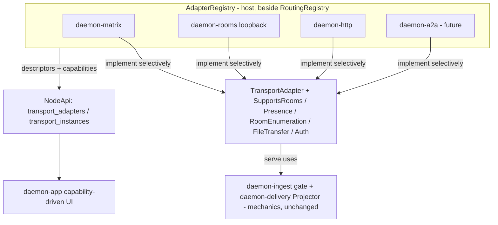
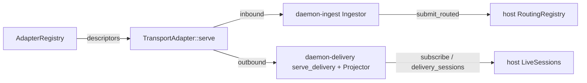

# Daemon Transport-Adapter Framework — first-class events-IO adapters

Status: landed. The **declarative layer** (capability/presence DTOs, the `TransportAdapter` trait, the
host `AdapterRegistry`, and the `transport_adapters` / `transport_instances` wire ops) is the live
foundation; the behavioural wiring (adapters implementing the traits, the registry driving lifecycle,
live instances) has since landed via the messaging-adapter spec (`daemon-rooms`/`daemon-matrix`
registered in `bins/daemon`; `AdapterRegistry::spawn_all`). Companion to `daemon-event-io-spec.md`
(§5 the IO edge, §5.9 routing), `daemon-rooms-spec.md` (the internal loopback transport), and
`daemon-matrix-transport-spec.md` (the reference chat transport).

> **Extended / specialized by [`daemon-messaging-adapter-spec.md`](./daemon-messaging-adapter-spec.md).**
> That spec layers a typed, libpurple-3-style feature-trait family (`SupportsConversations`,
> `SupportsMembership`, `SupportsRoster`, `SupportsContacts`, `SupportsDirectory`,
> `SupportsFileTransfer`, each with a per-verb `supported()` probe) on top of the `TransportAdapter`
> base here, reached via `TransportAdapter::messaging()`. The `AdapterRegistry`,
> `AdapterInfo`/`AdapterCapabilities`, `TransportInstanceInfo`, and the presence/connection DTOs in this
> doc remain the live foundation (the presence primitive is reconciled to libpurple's 8-value set
> there). The only part of this doc not built as written is §3.1's optional **marker** capability traits
> (`SupportsRooms`/`SupportsPresence`/…): coarse capability is carried by the `AdapterCapabilities`
> bool struct, and the fine-grained per-verb capability by that spec's typed feature traits.

This document studies how three mature multi-protocol messengers — Pidgin/**libpurple 3**,
**Kopete** (KDE/Qt), and **Adium** (a native client over libpurple) — model first-class support for
many protocols, and proposes how the equivalent capability should land in daemon, where "protocols"
are **events-IO transport adapters** (`daemon-matrix`, the `daemon-rooms` internal loopback,
`daemon-http`, a future `daemon-a2a`) over the `NodeApi` surface.

Sources studied: `/home/j/experiments/multiprotocol-instant-messengers/{pidgin-496de266ac6c,kopete,adium}`
and daemon: `crates/contracts/daemon-api/src/lib.rs`, `crates/contracts/daemon-protocol/src/lib.rs`,
`crates/substrate/daemon-host/src/{routing.rs,node_api.rs}`,
`crates/adapters/{daemon-ingest,daemon-delivery,daemon-matrix,daemon-rooms,daemon-http,daemon-acp}`.

---

## 0. Conclusions up front

1. **The three messengers independently converge on one architecture.** Despite different languages
   (C/GObject, C++/Qt, Objective-C/Cocoa) and 20 years of divergence, all three decompose
   multi-protocol support into the same six concepts: **Adapter → Account → Capability descriptor →
   Conversation (DM/Group/Channel) → Person/MetaContact → Presence**. This convergence is strong
   evidence the decomposition is correct, not incidental.

2. **daemon already has the harder half.** The *conversation/log/routing* layer
   (`Origin`/`OriginScope`, the merged `seq`-stamped session log, `DeliveryTarget` with
   `Primary`/`Spectator`, `subscribe`, the `RoutingRegistry`) is exactly libpurple 3's
   `PurpleConversation` + `PurpleConversationType{DM,GROUP_DM,CHANNEL,THREAD}` model — and the
   `daemon-rooms` work shows a Room is just a conversation on an internal transport. The two reusable
   halves `daemon-ingest` (inbound gate) and `daemon-delivery` (outbound `Projector`) already factor
   the per-adapter *mechanics*.

3. **The gap this spec closed was the *adapter-facing declarative layer*.** Previously an adapter was an
   anonymous `pub async fn serve(api, cfg)` wired by hand in `bins/daemon/src/main.rs`; nothing
   declared *what an adapter is, what it can do, or how to configure an account of it* in a way the
   GUI/TUI can read. The three gaps this spec closed (now landed):
   - **(a) A `TransportAdapter` descriptor + a registry** — the `PurpleProtocol` /
     `Kopete::Protocol` / `AIService` analogue, so adapters are enumerable and self-describing.
   - **(b) A capability model** — the `implements_*()` probes / `Capability` flags / service bool
     flags analogue, so generic UI adapts to what a transport supports.
   - **(c) Normalized presence / connection-state** — the `PurplePresencePrimitive` /
     `OnlineStatus` / `AIStatusSummary` analogue, so per-account status is uniform.

4. **No new crate, no reimplemented mechanics.** The declarative trait + capability marker traits
   live in `daemon-api` (next to the capability DTOs every adapter already depends on); the registry
   lives in `daemon-host` (beside `RoutingRegistry`). `daemon-ingest`/`daemon-delivery` remain the
   mechanics a `TransportAdapter::serve` uses — they are **not** reimplemented.

5. **A2A's `AgentCard` *is* the capability descriptor.** A future `daemon-a2a` adapter does not need
   a parallel concept: an `AgentCard` populates the same `AdapterInfo` / `AdapterCapabilities`
   struct. This is where A2A slots into the model (federation at the edge; see §5 and
   `daemon-rooms-spec.md` for the A2A-as-remote-participant case).

6. **Person/MetaContact is the one concept daemon should adopt but can defer.** Unifying one logical
   peer across transports (a human on Matrix + Slack; one agent exposed via an internal Room + A2A)
   with a preferred-endpoint routing algorithm is the messengers' "killer feature". It is designed in
   §6 and **deferred** — not in the skeleton.

---

## 1. The convergent model

| Universal concept | libpurple 3 | Kopete | Adium | daemon today |
| --- | --- | --- | --- | --- |
| **Adapter** (protocol + capabilities + factory) | `PurpleProtocol` + feature ifaces | `Kopete::Protocol` | `AIService` | `TransportAdapter` (+ `MessagingProtocol` + feature traits), registered in `AdapterRegistry` |
| **Account** (configured instance + conn state) | `PurpleAccount` / `PurpleConnection` | `Kopete::Account` | `AIAccount` | `TransportId` + `bound_accounts` + `credential_ref` |
| **Capability descriptor** | `implements_*()` + `PurpleTags` | `Capability` flags | service bool flags + optional protocols | `AdapterCapabilities` (coarse) + feature-trait `*Ops` probes (fine) |
| **Conversation** (DM/Group/Channel) | `PurpleConversation` + `PurpleConversationType` | `ChatSession` | `AIChat` | session + `OriginScope{Dm,Group,Api,Internal}` |
| **Person / MetaContact** | `PurplePerson` → `PurpleContact` | `MetaContact` → `Contact` | `AIMetaContact` → `AIListContact` | `Person` → `PersonEndpoint` (`daemon_api::person` + host `PersonManager`; §6) |
| **Presence** (normalized + per-proto map) | `PurplePresencePrimitive` | `OnlineStatus` + manager | `AIStatusSummary` | `PresenceState` / `ConnectionState` on `TransportInstanceInfo` |
| **Adapter registry** | `PurpleProtocolManager` | `PluginManager` | `AdiumServices` | `AdapterRegistry` (`daemon-host`) |

The structural match is closest with **libpurple 3**, whose recent GObject refactor split the old
monolithic `PurplePluginProtocolInfo` into a base `PurpleProtocol` plus *optional feature interfaces*
(`PurpleProtocolConversation`, `PurpleProtocolRoster`, `PurpleProtocolDirectory`,
`PurpleProtocolFileTransfer`, …) that a protocol implements selectively. That is exactly the trait
shape proposed in §3.1, and its `PurpleConversationType` enum is already the daemon's `OriginScope`.



---

## 2. What daemon has today (the seams)

- **Adapters are now self-describing values.** `daemon-matrix`/`daemon-rooms` implement
  `TransportAdapter` (+ `MessagingProtocol`), are registered in the host `AdapterRegistry` in
  `bins/daemon/src/main.rs`, and the registry drives their `serve` lifecycle via
  `AdapterRegistry::spawn_all` (`node.spawn_adapters()`). (`daemon_http::serve_http` is the remaining
  bespoke `cfg.<x>.enabled` spawn not yet retrofitted onto the trait.)
- **Mechanics are already factored** (do not reimplement): `daemon-ingest` owns the inbound
  decision (addressing → which `AgentCommand` → `submit_routed`, with busy/queue/fold);
  `daemon-delivery` owns the outbound loop (`serve_delivery` = `delivery_sessions` + `subscribe` +
  `Projector` + handover-stop).
- **Conversation/routing layer exists:** `Origin{transport, scope}`, `OriginScope`, `session_id_for`,
  the merged `SessionLogEntry` log, `DeliveryTarget`/`SinkKind`, `subscribe`, and the host
  `RoutingRegistry` (`crates/substrate/daemon-host/src/routing.rs`).
- **Account-setup schema exists in one place only:** `AuthProviderInfo { family, flow_kind,
  display_name, params_schema: Vec<AuthParamField> }` (auth flows). This is the seed the
  general adapter account-setup schema generalizes (§3.2).
- **Read-only room enumeration exists:** `ControlApi::transport_rooms(transport) -> Vec<RoomInfo>`
  (pins-only today; EIO-8 tracks live enumeration).

**Gaps (now closed):** the adapter descriptor/registry (a), the capability model (b), and
presence/connection-state (c) all landed (the latter two finalized by `daemon-messaging-adapter-spec.md`).

---

## 3. The design

### 3.1 `TransportAdapter` trait + optional capability traits

> Concretized by [`daemon-messaging-adapter-spec.md`](./daemon-messaging-adapter-spec.md) §3: the
> marker traits below were never built as written — they are realized as that spec's typed feature
> traits (real method sets ported from libpurple 3) with per-verb `supported()` probes, layered on the
> `TransportAdapter` base. Retained here for historical context.

A small declarative trait, co-located in `daemon-api` (so an adapter crate, which already depends on
`daemon-api`, implements it without a new dependency — and **no new crate**):

```rust
/// A self-describing events-IO transport. The declarative analogue of libpurple's `PurpleProtocol`
/// / Kopete's `Kopete::Protocol` / Adium's `AIService`. The runtime *mechanics* still come from
/// `daemon-ingest` (inbound) + `daemon-delivery` (outbound); this trait only adds identity,
/// capabilities, account-setup schema, and a lifecycle entry point.
#[async_trait]
pub trait TransportAdapter: Send + Sync {
    /// Stable adapter id / transport family (e.g. "matrix", "room", "http", "a2a").
    fn family(&self) -> &str;
    /// Human descriptor + capabilities + account-setup schema (rendered by the GUI "Add channel").
    fn info(&self) -> AdapterInfo;
    /// Drive the transport until shutdown. Implementations wire `daemon-ingest`/`daemon-delivery`;
    /// this replaces the bespoke `serve(api, cfg)` free functions in `bins/daemon/src/main.rs`.
    async fn serve(self: Arc<Self>, api: Arc<dyn NodeApi>);
}
```

**Optional capability traits** (the libpurple-3 split-interface pattern — implement only what the
transport supports; the registry probes them to build `AdapterCapabilities`):

```rust
pub trait SupportsRooms {}            // group/channel conversations (matrix, room, slack)
pub trait SupportsPresence {}         // reports per-account / peer presence
pub trait SupportsRoomEnumeration {}  // live `transport_rooms` (not just pins)
pub trait SupportsFileTransfer {}     // attachments
pub trait SupportsAuth {}             // interactive login (drives the AuthApi flow)
```

These were sketched as marker traits; in the shipped design the behavioural method sets (send, join,
set-topic, …) live on `daemon-messaging-adapter-spec.md`'s typed feature traits, while message
send/receive *mechanics* remain owned by the existing `daemon-ingest`/`daemon-delivery` seams.

### 3.2 Capability descriptor + account-setup schema

```rust
/// What a transport adapter is and can do — the descriptor the GUI reads to render the
/// "Add channel" picker and to capability-gate affordances (join, invite, set-topic, file send).
pub struct AdapterInfo {
    pub family: String,            // "matrix" | "room" | "http" | "a2a"
    pub display_name: String,      // "Matrix", "Rooms (internal)", ...
    pub capabilities: AdapterCapabilities,
    pub account_schema: AccountSettingsSchema,  // generalizes AuthProviderInfo.params_schema
}

pub struct AdapterCapabilities {
    pub rooms: bool,
    pub direct_messages: bool,
    pub presence: bool,
    pub room_enumeration: bool,
    pub file_transfer: bool,
    pub interactive_auth: bool,
}

/// The typed account-setup form (the generalisation of `AuthProviderInfo.params_schema`). Reuses the
/// existing `AuthParamField` field shape; an adapter without interactive auth still describes its
/// instance config (e.g. an HTTP listen address) with the same fields.
pub struct AccountSettingsSchema {
    pub fields: Vec<AuthParamField>,
}
```

### 3.3 Normalized presence / connection-state

```rust
/// Per-account live connection state (the Pidgin connection-state-machine analogue).
pub enum ConnectionState { Offline, Connecting, Connected, Error }

/// Normalized presence primitive (libpurple `PurplePresencePrimitive` / Kopete `OnlineStatus`
/// category / Adium `AIStatusSummary`). Each adapter maps its wire-format presence into this.
pub enum PresenceState { Unknown, Offline, Available, Idle, Away, Busy }

/// One configured transport instance (account) with its live status — what the GUI status bar and
/// the unified roster render. Closes the EIO-9 gap (per-account connection state) noted in the
/// channels user stories.
pub struct TransportInstanceInfo {
    pub transport: TransportId,        // instance-qualified, e.g. "matrix/@bot:hs.org"
    pub family: String,
    pub display_name: String,
    pub connection: ConnectionState,
    pub presence: PresenceState,
    pub bound_profile: Option<ProfileRef>,
    // (+ v30 disconnect provenance: reason / message / fatal — omitted here for brevity)
    pub enabled: bool,                 // v35: operator's desired state (node-overlaid from the store)
    pub label: Option<String>,         // v35: operator rename (node-overlaid; falls back to display_name)
}
```

### 3.4 `AdapterRegistry` + wire surface

The registry is **host-owned**, mirroring `RoutingRegistry` (builder + immutable snapshot behind the
existing `ArcSwap`): it holds the registered `Arc<dyn TransportAdapter>`s, answers descriptor/instance
queries, and drives adapter lifecycle via `AdapterRegistry::spawn_all` (called by
`NodeApiImpl::spawn_adapters`, used from `bins/daemon` — the bespoke `main.rs` per-adapter spawn blocks
are retired for the retrofitted adapters).

```rust
pub struct AdapterRegistry { adapters: Vec<Arc<dyn TransportAdapter>> }
impl AdapterRegistry {
    pub fn new() -> Self { /* empty: a node with no transports */ }
    pub fn with_adapter(self, a: Arc<dyn TransportAdapter>) -> Self { /* ... */ }
    pub fn infos(&self) -> Vec<AdapterInfo> { /* ... */ }
}
```

Two read-only `ControlApi` ops (default empty, so a node without a registry inherits the surface,
exactly like `transport_rooms`):

- `transport_adapters() -> Vec<AdapterInfo>` — the available adapter families + their capabilities +
  account-setup schemas (the GUI "Add channel" picker).
- `transport_instances() -> Vec<TransportInstanceInfo>` — the configured accounts with live
  connection/presence state (the GUI status bar + roster grouping).

`ApiRequest::{TransportAdapters, TransportInstances}` + `ApiResponse::{Adapters, TransportInstances}`
+ `dispatch` arms landed, with CDDL parity and the `WireVersion` bump (18–20) done.

### 3.5 Relationship to existing seams (no reimplementation)



The trait is a *thin declarative wrapper*: its `serve` body is the same `Ingestor` + `Projector`
wiring `daemon-matrix`/`daemon-rooms` already do. The registry adds enumeration + lifecycle
(`spawn_all`). Routing, profile binding, and delivery storage stay host-owned and unchanged.

---

## 4. Wire surface summary

- DTOs (in `daemon-api`): `AdapterInfo`, `AdapterCapabilities`, `AccountSettingsSchema`,
  `TransportInstanceInfo`, `ConnectionState`, `PresenceState`.
- `ControlApi`: `transport_adapters()`, `transport_instances()` (default empty).
- `ApiRequest`/`ApiResponse` variants + `dispatch` arms.
- CDDL + `WireVersion` bump (18–20) and the generated CBOR codec — landed.

---

## 5. A2A: the `AgentCard` is the capability descriptor

A2A (Agent2Agent) is a 1:1 client↔server task-RPC protocol — not a group/room fabric (see
`daemon-rooms-spec.md` §A2A). Its **`AgentCard`** is a discovery + capability document: identity,
supported interfaces/bindings, skills, streaming/push capabilities, security schemes. That maps
directly onto this framework:

- `AgentCard` → `AdapterInfo` (display, capabilities, account/endpoint schema).
- `AgentCard.capabilities{streaming, pushNotifications, ...}` → `AdapterCapabilities`.
- `AgentCard.securitySchemes` / interface URLs → `AccountSettingsSchema`.
- A2A `contextId` ↔ `SessionId`; `Message.Part` ↔ `UserMsg`; SSE ↔ `subscribe`; push ↔
  `DeliverySink`.

So a future `daemon-a2a` adapter is *just another `TransportAdapter`* whose `info()` is derived from
an `AgentCard` — for the **server** role (expose daemon profiles as A2A agents) and the **client**
role (an external A2A agent becomes a remote Room participant, bridged by the RoomRouter). No
parallel descriptor concept is needed. Build deferred.

---

## 6. Person / MetaContact (IMPLEMENTED — W3-J `port-person`)

The messengers' highest-value pattern: one **Person** (libpurple `PurplePerson`, Kopete
`MetaContact`, Adium `AIMetaContact`) unifies many per-account **endpoints** (`PurpleContact` /
`Kopete::Contact` / `AIListContact`) into a single roster entry, with a **preferred-endpoint**
routing algorithm (most-available / highest-priority account) deciding which transport to use when
you message that person.

For daemon this maps to:

- A `Person` (logical peer) with `endpoints: Vec<Endpoint>`, each an `(TransportId, handle)` on a
  specific transport instance.
- A `preferred_endpoint()` algorithm (open conversation > best presence > account priority), the
  daemon analogue of Kopete `MetaContact::preferredContact()` / Adium `preferredContact`.
- Two concrete uses: unify *one human* across their Matrix + future Slack accounts; unify *one agent*
  exposed via an internal Room + an A2A endpoint.

**Status: implemented** (was deferred). The model now exists, ported from `purpleperson.c` under
TDD: the `Person` wire DTO with
`endpoints: Vec<PersonEndpoint>` (`(TransportId, ContactInfo)` bindings) and `preferred_endpoint()`
live in `crates/contracts/daemon-api/src/person.rs`; the person-aware display layering
(`person-alias → display_name → id`) in `crates/contracts/daemon-api/src/matching.rs`; the host
registry (create/remove/associate/dissociate/lookup) in `crates/substrate/daemon-host/src/person.rs`;
and the read surface (`PersonList` → `Persons`, `NodeEvent::PersonsChanged`) in the wire contract
(wire v37). `preferred_endpoint()` is the presence-comparator algorithm the libpurple tests
assert; the open-conversation / account-priority tiers remain future layers.

---

## 7. Phasing

- **P0 — declarative layer (landed).** Capability/presence DTOs, the `TransportAdapter` trait (in
  `daemon-api`), the host `AdapterRegistry`, and the `transport_adapters`/`transport_instances` wire
  ops — default-empty until a registry is installed. Plus the daemon-app client-surface spec + core
  seam stubs.
- **P1 — adapter retrofit (landed).** `daemon-matrix` / `daemon-rooms` implement `TransportAdapter`
  (real `info()` + capabilities) and the typed feature traits; the registry drives lifecycle
  (`spawn_all`, retiring those `main.rs` spawn blocks); `transport_instances` reports connection state.
  *(Concretized by [`daemon-messaging-adapter-spec.md`](./daemon-messaging-adapter-spec.md), which
  defines the typed feature-trait family these adapters implement. `daemon-http` is not yet retrofitted.)*
- **P2 — presence + live room enumeration (partial).** Per-account `ConnectionState` reported (Matrix);
  richer `PresenceState` and generalising `transport_rooms` to live enumeration (EIO-8) remain open.
- **P3 — Person/MetaContact (§6, landed).** Endpoint unification + preferred-endpoint model
  (`daemon_api::person`, host `PersonManager`, `PersonList` wire op — W3-J `port-person`).
- **P4 — `daemon-a2a`.** Server + client roles; `AgentCard` ↔ `AdapterInfo` (§5).
- **Deferred (optional) — server-side `daemonnet()` projection.** A read-only, additive, **stateless**
  aggregation surface (`daemonnet(scope)` over a node neighbourhood + an optional `daemonnet_subscribe`
  delta stream, with `NetNode` (kinds: Agent / Peer / User / Session / Room / Channel / Transport /
  Host — note **Session is a first-class node**, and `Peer` is an external party of unverifiable
  nature) and `NetEdge` (kinds: Runs / Over / Participant / InPlace / Delegation) DTOs) that assembles
  the **DaemonNet** — the unifying model the client uses
  (`daemon-app/docs/multi-protocol-client-surface.md` §1.1/§1.5): the daemon's network of actor/place
  nodes plus session nodes joined by those edges — from the subsystems that already own each fact
  (supervision `tree`, `SessionsQuery`, the messaging-adapter `Conv*` ops, `transport_instances`,
  `delivery_targets`). It would be the **same read-only projection pattern as `transport_adapters`**: a
  projection, **not** a new source of truth, **not** an execution model, and **not** a refactor of
  ownership. It is *not built
  now* and is *not required*: the DaemonNet is firstly a conceptual model and secondly a **client-side
  view-model** the GUI/TUI assembles by joining the existing endpoints on `SessionId` (client-surface
  spec §1.5). Promote to this server-side projection only if the client join becomes too many
  round-trips, more than one client must replicate it, or a single coalesced delta stream is wanted.

Each phase is additive over the prior; the declarative layer in P0 cannot regress existing adapters because it
is purely declarative and default-empty.
