# Mnemosyne: Complete Architecture Map

A full visual map of the [`Mnemosyne/`](Mnemosyne/) codebase — a zero-dependency,
SQLite-backed AI memory layer implementing **BEAM** (Bilevel Episodic-Associative Memory).
~26K LOC of Python in `mnemosyne/core/` plus interfaces (MCP, CLI), integrations, and a sync
server. Produced in the same style as [hermes-agent-architecture.md](hermes-agent-architecture.md).

> Mnemosyne is a *universal, Hermes-first memory layer* usable by any agent (Claude Code,
> Cursor, Codex, OpenWebUI, OpenClaw, or custom). One `pip install`, one SQLite database, no
> external services. Default data root: `~/.hermes/mnemosyne/data/`.

---

## 1. System overview (10,000 ft)

Mnemosyne is a **library + interfaces** (not an agent). Any host reaches one engine —
`BeamMemory` — through the thin `Mnemosyne` facade, and everything persists into a single
SQLite file with `sqlite-vec` + FTS5.

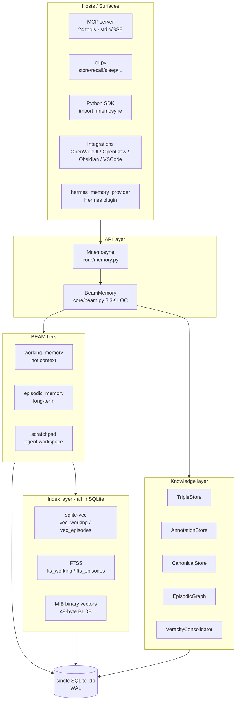

---

## 2. Public API & object model

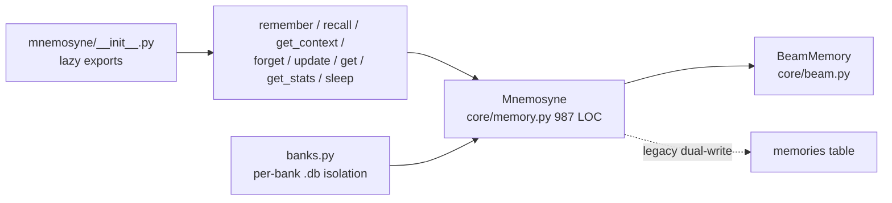

- **`Mnemosyne`** ([core/memory.py](Mnemosyne/mnemosyne/core/memory.py)) is a facade over
  `BeamMemory`, plus legacy dual-write to a flat `memories` table.
- **`BeamMemory`** ([core/beam.py](Mnemosyne/mnemosyne/core/beam.py), 8,326 lines ~ 32% of
  core) holds all BEAM logic and wires the knowledge subgraphs at init.
- **Banks** ([core/banks.py](Mnemosyne/mnemosyne/core/banks.py)) give each named memory bank
  its own directory + `mnemosyne.db`.
- `core/orchestrator.py` is a stub placeholder (not wired into production recall).

Main operations: `remember`, `recall`, `get_context` (prompt injection), `forget`/`update`/
`invalidate`, `sleep` (consolidation), `scratchpad_*`, `reindex_vectors`, `export`/`import`.

---

## 3. BEAM memory tiers

> **BEAM = Bilevel Episodic-Associative Memory.** Three SQLite tables: `working_memory` (hot,
> auto-injected), `episodic_memory` (long-term, vector + FTS5), `scratchpad` (ephemeral).

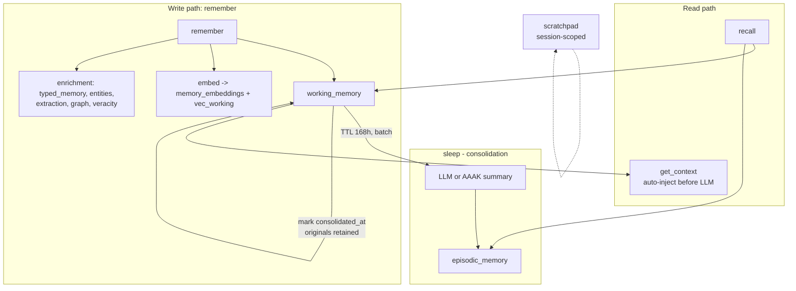

- **Working memory** — hot/recent; searched by FTS5 + sqlite-vec with recency fallback;
  feeds `get_context()` prompt injection.
- **Episodic memory** — long-term; sleep summaries + durable facts; carries the 48-byte MIB
  `binary_vector` and age-based tier degradation (T1 fresh, T2 >30d, T3 >180d).
- **Scratchpad** — ephemeral agent reasoning, no hybrid recall.
- **Sleep** is additive: consolidated WM rows are *marked*, not deleted; `pinned` rows skip
  sleep.

---

## 4. Storage layer (SQLite)

Single-file DB per bank, thread-local connection, `WAL`, `busy_timeout=5000`,
`sqlite_vec.load()` for vector virtual tables. Schema is created/evolved inline in
`init_beam()` via `CREATE TABLE IF NOT EXISTS` + `_add_column_if_missing`.

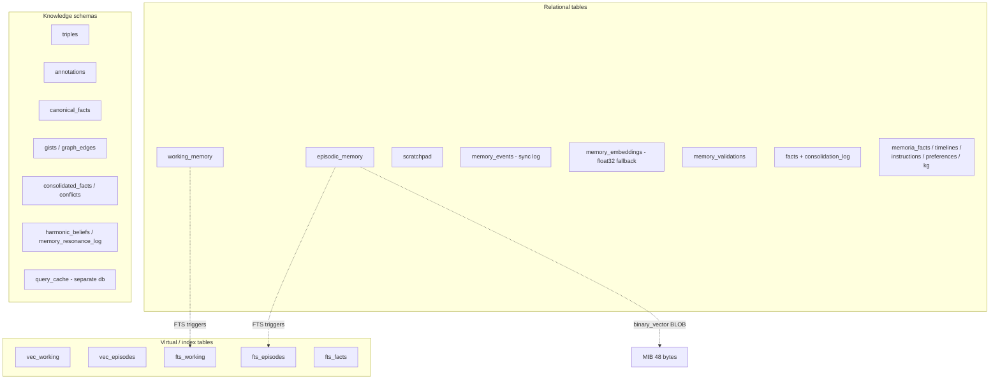

Rich columns on memory rows include lifecycle (`valid_until`, `superseded_by`, `scope`,
`consolidated_at`, `pinned`), identity (`author_id`, `channel_id`, `validator`), trust
(`veracity`, `trust_tier`, `memory_type`, `recall_count`), and temporal (`event_date`,
`temporal_tags`).

### Hybrid search flow

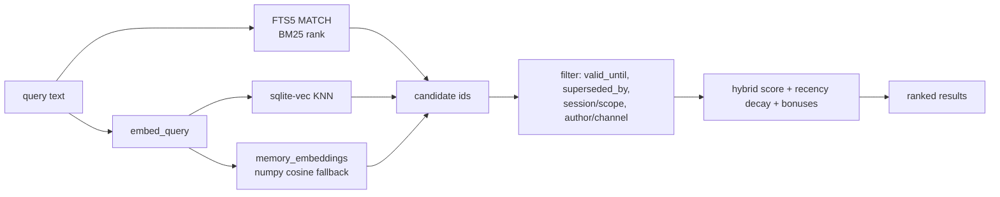

---

## 5. Vectors & embeddings

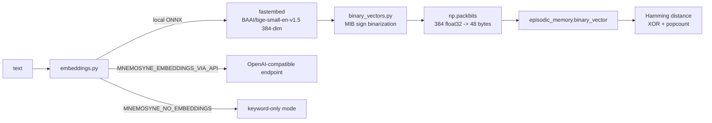

- **Default embeddings:** `BAAI/bge-small-en-v1.5` (384-dim) via local fastembed; alternatives
  via OpenAI-compatible API; can be disabled for keyword-only recall.
- **MIB (Maximally Informative Binarization)** ([core/binary_vectors.py](Mnemosyne/mnemosyne/core/binary_vectors.py)):
  sign-binarize each dimension (bit = 1 if > 0), `packbits` to 48 bytes — 8x smaller than
  float32. Recall scores a small `binary_bonus` from Hamming distance.

---

## 6. Retrieval & ranking pipelines

Three selectable pipelines share the BEAM tiers:

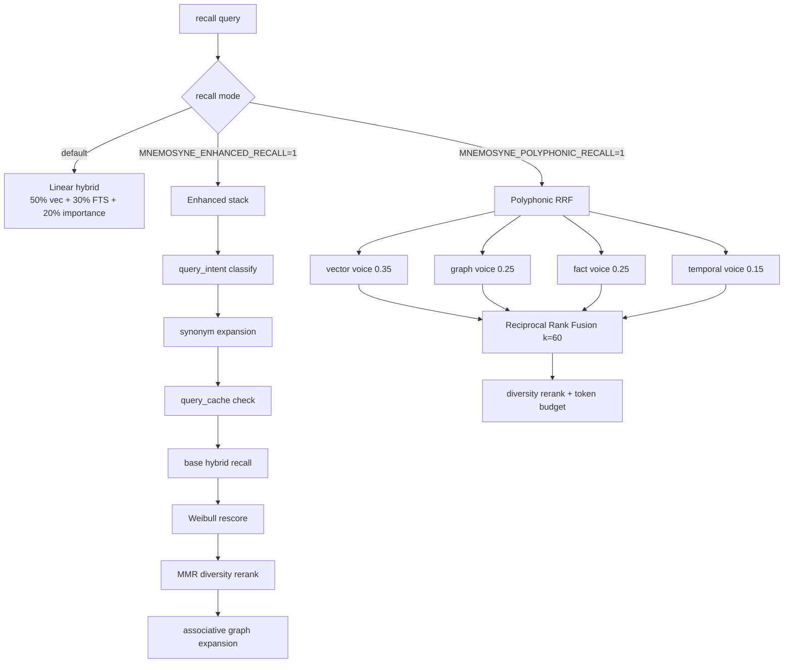

- **Default hybrid score** (episodic): `sim*0.5 + fts*0.3 + importance*0.2`, then
  `* (0.7 + 0.3*decay)` recency, plus graph/fact/binary bonuses, gated by a lexical relevance
  floor and multiplied by a veracity weight (stated 1.0 ... unknown 0.8).
- **MMR** ([core/mmr.py](Mnemosyne/mnemosyne/core/mmr.py)): `λ*relevance - (1-λ)*max_jaccard`.
- **Polyphonic** ([core/polyphonic_recall.py](Mnemosyne/mnemosyne/core/polyphonic_recall.py)):
  4 weighted voices fused by RRF.
- **SHMR** ([core/shmr.py](Mnemosyne/mnemosyne/core/shmr.py)): background "Self-Harmonizing
  Memory Reasoning" — clusters and converges beliefs; separate from main recall.
- Supporting: `query_intent.py` (regex intent -> weight bias), `query_cache.py` (5-tier
  semantic cache), `synonyms.py`, `recall_diagnostics.py` (per-path counters).

---

## 7. Knowledge layer (graph, triples, veracity)

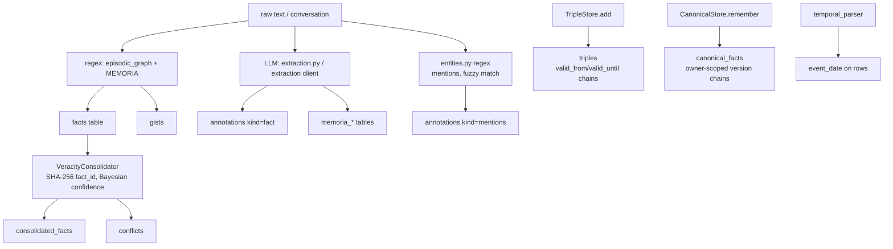

- **TripleStore** ([triples.py](Mnemosyne/mnemosyne/core/triples.py)): single-current-truth
  temporal facts; a new `(subject, predicate, object)` closes prior open triples; `query(as_of=)`
  for historical truth.
- **AnnotationStore** ([annotations.py](Mnemosyne/mnemosyne/core/annotations.py)): append-only
  multi-valued per-memory tags (post-E6 split migration).
- **CanonicalStore** ([canonical.py](Mnemosyne/mnemosyne/core/canonical.py)): owner-scoped
  identity cards with version history.
- **EpisodicGraph** ([episodic_graph.py](Mnemosyne/mnemosyne/core/episodic_graph.py)): gists +
  SPO facts + `graph_edges`; proactive linking of co-occurring entities.
- **VeracityConsolidator** ([veracity_consolidation.py](Mnemosyne/mnemosyne/core/veracity_consolidation.py)):
  compounds mention counts into confidence, detects `(S,P)` contradictions.

---

## 8. Extraction & LLM

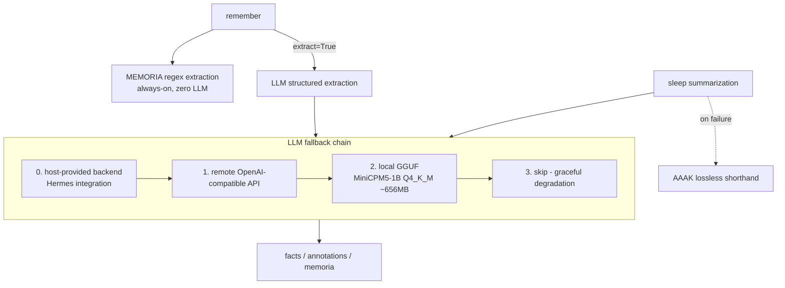

- Extraction backends are pluggable ([llm_backends.py](Mnemosyne/mnemosyne/core/llm_backends.py));
  hosts register via `set_host_llm_backend()`.
- Local path ([local_llm.py](Mnemosyne/mnemosyne/core/local_llm.py)) uses `llama-cpp-python`
  (fallback `ctransformers`); cloud path defaults to `google/gemini-2.5-flash` via OpenRouter.

---

## 9. Memory dynamics

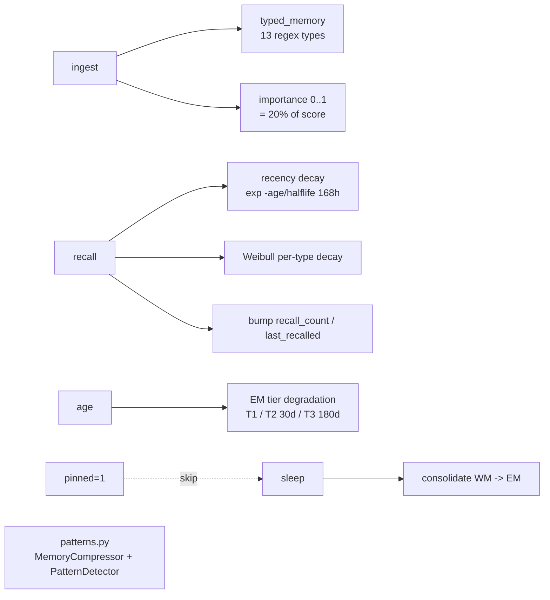

Retention is usage-driven (recall bumps), age-tiered (degradation), type-aware (Weibull), and
trust-weighted (veracity multipliers).

---

## 10. Supporting subsystems

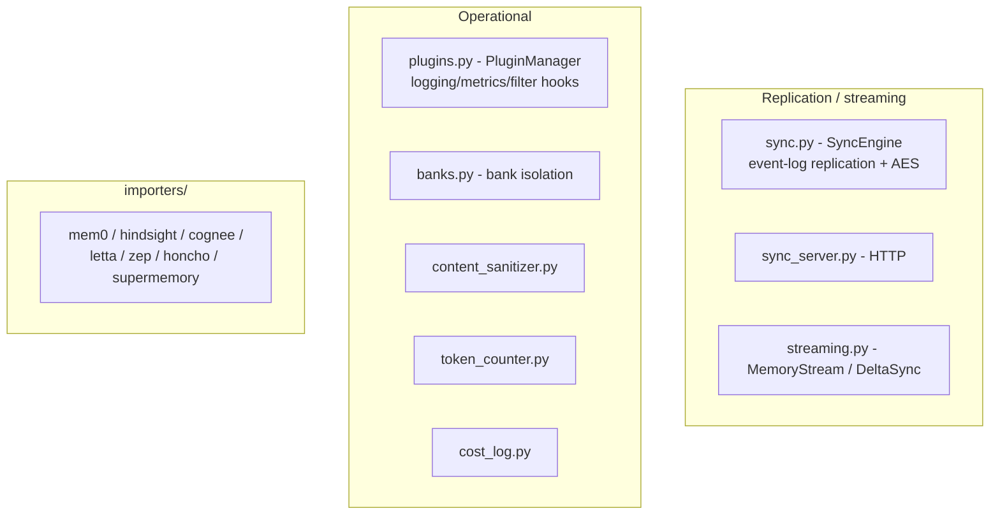

---

## 11. Interfaces

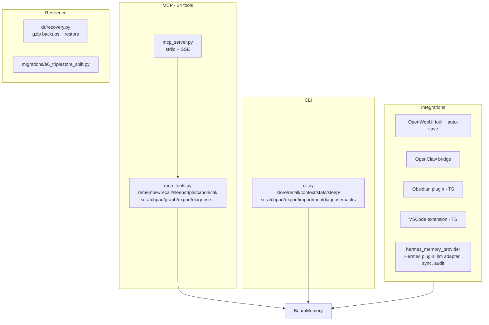

---

## 12. Directory reference

- **`mnemosyne/__init__.py`** — lazy public API (`remember`, `recall`, `get_context`, ...).
- **`mnemosyne/core/`** (~26K LOC, ~35 modules) — the engine:
  - `beam.py` (8.3K) engine, `memory.py` facade, `banks.py` isolation.
  - Index/vectors: `embeddings.py`, `binary_vectors.py`.
  - Recall: `mmr.py`, `shmr.py`, `polyphonic_recall.py`, `query_intent.py`, `query_cache.py`,
    `synonyms.py`, `recall_diagnostics.py`.
  - Knowledge: `triples.py`, `annotations.py`, `canonical.py`, `episodic_graph.py`,
    `entities.py`, `temporal_parser.py`, `veracity_consolidation.py`, `llm_conflict_detector.py`.
  - Extraction/LLM: `extraction.py`, `llm_backends.py`, `local_llm.py`, `aaak.py`.
  - Dynamics: `weibull.py`, `typed_memory.py`, `patterns.py`.
  - Support: `sync.py`, `sync_server.py`, `streaming.py`, `plugins.py`, `content_sanitizer.py`,
    `token_counter.py`, `cost_log.py`, `chat_normalize.py`.
- **`mnemosyne/mcp_server.py` / `mcp_tools.py`** — MCP server (24 tools).
- **`mnemosyne/cli.py`** — command-line interface.
- **`mnemosyne/integrations/`** — OpenWebUI, OpenClaw, memory browser.
- **`mnemosyne/extraction/`** — cloud extraction client + prompts + diagnostics.
- **`mnemosyne/dr/`** — disaster-recovery backups.
- **`mnemosyne/migrations/`** — packaged migrations (E6 triplestore split).
- **`hermes_memory_provider/`** — Hermes plugin (LLM adapter, sync adapter, audit).
- **`integrations/`** — Obsidian + VSCode (TypeScript) + Hermes plugin manifest.
- **`tools/`** — BEAM benchmark + diagnostics scripts (ICLR 2026 BEAM benchmark).
- **`deploy/`** — sync server deployment (Caddy, fly.io, docker-compose).
- **`scripts/`**, **`docs/`**, **`examples/`**, **`tests/`** — tooling, docs, examples, tests.

---

## 13. The one-sentence summary

Mnemosyne is a **single-SQLite-file memory engine** (`BeamMemory`) exposing a tiny facade
(`remember`/`recall`/`get_context`/`sleep`) over **three BEAM tiers** (working / episodic /
scratchpad), a **hybrid recall stack** (sqlite-vec + FTS5 + importance, with optional
polyphonic-RRF and enhanced pipelines), **MIB 48-byte binary vectors**, and a co-located
**temporal knowledge layer** (triples / annotations / canonical / episodic graph / veracity) —
all dependency-free, reachable from any agent via **MCP (24 tools), CLI, SDK, or
host-plugin**, with optional local-LLM extraction, decay/consolidation dynamics, and
event-log sync.
