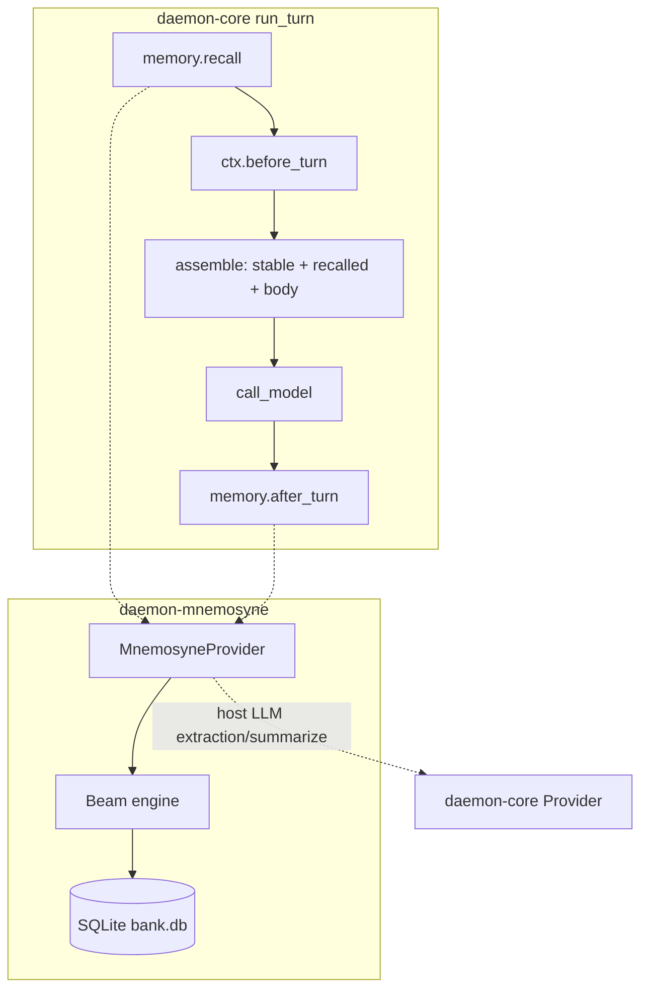

# Mnemosyne -> Rust Port: Architecture Spec & Implementation Guide

A complete, line-referenced specification for porting [`Mnemosyne/`](Mnemosyne/) — the
zero-dependency, SQLite-backed **BEAM** (Bilevel Episodic-Associative Memory) engine — to a native
Rust crate `daemon-mnemosyne` that becomes the **default memory management logic for `daemon-core`**
by implementing its `MemoryProvider` seam (`daemon-core-spec.md` §11).

> Size: `mnemosyne/core/` is ~22.5K LOC including the `importers/` subpackage; excluding importers
> (out of scope) the in-scope core engine is ~19K LOC, plus `dr/`, `diagnose.py`, `extraction/`, and
> `hermes_memory_provider/`.

This document is the executable companion to [`mnemosyne-architecture.md`](mnemosyne-architecture.md)
(the high-level map). Where that document explains *what* Mnemosyne is, this one specifies *exactly
how to rebuild it in Rust*: every table, every scoring constant, every algorithm, with the Python
`file:line` references the implementation must honor and the target Rust shapes it must satisfy.

> Scope (confirmed): port **everything except** these interface/host surfaces, which are explicitly
> out of scope:
> - the MCP server (`mcp_server.py`, `mcp_tools.py`) and the CLIs (`cli.py`,
>   `hermes_memory_provider/cli.py`);
> - the `core/importers/` package (mem0/letta/zep/cognee/honcho/hindsight/supermemory/agentic/
>   holographic);
> - the `integrations/` host adapters (`openwebui_tool.py`, `auto_save_openwebui.py`, `openclaw.py`,
>   `memory_browser.py`);
> - `install.py` (installer) and the non-wired `core/orchestrator.py` stub (19 lines, never invoked
>   in production recall).
>
> In scope: storage, hybrid recall (linear/enhanced/polyphonic), MIB binary vectors, the temporal
> knowledge layer, memory dynamics, LLM extraction, event-log sync, **disaster recovery
> (`dr/recovery.py`), diagnostics (`diagnose.py`), and cost logging (`core/cost_log.py`)**.

> Source paths in this doc are relative to `Mnemosyne/mnemosyne/core/` unless noted. Target paths are
> relative to the daemon workspace at `/home/j/experiments/daemon`.

---

## 0. Table of contents

1. Target: the `daemon-core` `MemoryProvider` seam
2. Crate architecture and module map
3. Dependencies and feature flags
4. Storage layer (the full SQLite schema)
5. Embeddings and MIB binary vectors
6. The write path (`remember`)
7. The read path (`recall`) — exact scoring math
8. Retrieval pipelines (enhanced / polyphonic / SHMR)
9. Memory dynamics (typed memory, Weibull, decay, consolidation)
10. The knowledge layer (triples / annotations / canonical / graph / veracity)
11. Extraction and LLM (routed through the daemon-core Provider)
12. Sync, streaming, disaster recovery, and diagnostics
13. The `MemoryProvider` implementation and tool surface
14. Deliberate divergences from the Python source
15. Phasing
16. Parity test matrix
17. Line-reference appendix

---

## 1. Target: the `daemon-core` `MemoryProvider` seam

`daemon-core` declares the contract this port satisfies. **RECONCILED (as-built):** the seam is now
implemented in [`memory.rs`](../src/memory.rs) and is deliberately **narrower** than earlier drafts —
tools are **not** on the seam. A backend's `remember`/`recall` tools register through the §12
[`ToolRegistry`](../src/tools.rs) (the tool resolves the calling session's `Arc<MnemosyneProvider>`
from a shared per-session bank cache via `cx.session_id`), exactly as the composition layer does in
`bins/daemon` (`MemoryProviderTool` over `MnemosyneBanks`). The locked trait:

```rust
#[async_trait]
pub trait MemoryProvider: Send + Sync {
    fn name(&self) -> &str;
    fn prompt_block(&self) -> Option<PromptBlock> { None }            // stable tier
    async fn recall(&self, q: &RecallQuery) -> Option<RecalledBlock> { None } // volatile tier
    async fn after_turn(&self, turn: &Turn, conv: &Conversation) {}   // remember / extract / sync
    async fn before_compact(&self, conv: &Conversation) {}            // last chance to capture
    async fn on_session_switch(&self, reason: SwitchReason) {}        // Start|Compaction|Handoff|Resume|End|Manual
}
```

`MnemosyneProvider::tools()` / `call_tool()` remain inherent methods (not trait methods); the host
adapts them into the registry. The engine drives `on_session_switch` at the real boundaries:
`Start`/`Resume` before the first turn, `Compaction` after a compaction, `Handoff` at a delegating
suspension, and `End` from `Engine::end_session`.

**Per-session construction (as-built):** the provider is **constructed per-session** by the
composition layer. `EngineProfile::with_memory_builder(MemoryBuilder)` — `Arc<dyn Fn(&SessionId) ->
Vec<Arc<dyn MemoryProvider>>>`, mirroring `ExecEnvBuilder` — gives each engine its own provider bound
to that engine's session id. The bank database is **agent-wide / shared** (one `mnemosyne.db` per
profile); per-session separation is **row-level** via the `session_id` column (`remember` writes it;
`recall`/`get_context` filter `WHERE (session_id = ? OR scope = 'global')`), so sessions share
global/long-term rows while keeping their own session-local working memory. A shared `MnemosyneBanks`
cache (`Mutex<HashMap<SessionId, Arc<MnemosyneProvider>>>`) opens one provider per session over the
shared bank and is held by both the memory builder and the `mnemosyne_*` tools, so the §11 hook and
the tool dispatch always hit the *same* instance for a session. (Contrast LCM: shared store, but the
*engine instance* is per-session because LCM carries per-session runtime state.)

Hook order (spec §11): `recall -> before_turn -> before_compact -> compact -> assemble -> after_turn`.

**Embeddings (as-built):** the engine consumes a host-injected
[`EmbeddingProvider`](../src/embed.rs) (the `daemon-core` seam) rather than owning an embedding
runtime. With no provider injected the default build is **keyword-only** (the `Embedder` wrapper
returns `None`), so the zero-config default still runs without any embedding model. When a provider
*is* injected, the async [`MnemosyneProvider`] hooks embed at the seam (`recall`/`after_turn`/
`call_tool`) and pass the precomputed vectors into the synchronous engine
(`remember_with_vector`/`recall_with_vector`), which persists f32 vectors to `memory_embeddings` and
blends cosine similarity into the working-memory score (a vector-only hit clears the lexical gate at
sim ≥ 0.65). Two providers ship: a remote `genai` embedder and a local `daemon-infer` GGUF embedder,
both in `daemon-providers`; the `fastembed`/ONNX path has been removed in favour of this seam. See
[`local-inference-spec.md`](../../../../docs/specs/local-inference-spec.md) §10 for the
`Command::Embed` protocol + `InferenceBackend::embed` worker path.

The provider binds to the engine's existing typed shapes:

- [`conversation.rs`](../daemon/crates/engine/daemon-core/src/conversation.rs) — `Conversation`,
  `Turn::{User, Assistant, Tool}`, `ToolTurn`, `ToolCall`, `ToolResult` (the source of truth the
  hooks observe).
- [`provider.rs`](../daemon/crates/engine/daemon-core/src/provider.rs) — `Provider` (used as the
  host LLM backend for extraction / sleep summarization, mirroring Mnemosyne's "backend 0").
- [`tools.rs`](../daemon/crates/engine/daemon-core/src/tools.rs) — `ToolDef`, `ToolRegistry`.

The canonical Python adapter to mirror is
[`hermes_memory_provider/__init__.py`](Mnemosyne/hermes_memory_provider/__init__.py) (2,673 lines),
which maps Mnemosyne onto the Hermes agent ABC:

- `system_prompt_block()` (L1437) -> `prompt_block()`
- `prefetch(query)` (L1474) -> `recall()`
- `sync_turn(user, assistant)` (L1668) -> `after_turn()`
- `on_session_end(messages)` (L2546) / `on_pre_compress` (absent) -> `before_compact` / `on_session_switch`
- `get_tool_schemas()` (L1750) + `handle_tool_call()` (L1754) -> `tools()` + `call_tool()`



---

## 2. Crate architecture and module map

New crate `crates/memory/daemon-mnemosyne` (auto-included by the `crates/*/*` workspace glob in
[`Cargo.toml`](../daemon/Cargo.toml) L3). Module-by-module port of `mnemosyne/core/`:

| Rust module | Python source | LOC | Notes |
|---|---|---|---|
| `store/schema.rs` | `beam.py` `init_beam` (L485-L1026) | — | static DDL + `add_column_if_missing` migrator |
| `store/mod.rs` | `beam.py` connection (L404-L443), `banks.py` | — | `Mutex<Connection>` + WAL; per-bank file |
| `engine.rs` | `beam.py` `BeamMemory` | 8326 | remember/recall/get_context/sleep/scratchpad |
| `facade.rs` | `memory.py` `Mnemosyne` | 987 | public API + legacy dual-write (optional) |
| `embeddings.rs` | `embeddings.py` | 254 | adapts an injected `daemon-core::EmbeddingProvider`; keyword-only when `None` |
| `binary_vectors.rs` | `binary_vectors.py` | 372 | MIB sign binarization + Hamming |
| `recall/mmr.rs` | `mmr.py` | 95 | λ=0.7 MMR |
| `recall/polyphonic.rs` | `polyphonic_recall.py` | 878 | 4-voice RRF |
| `recall/query_intent.rs` | `query_intent.py` | 167 | regex intent -> weight bias |
| `recall/query_cache.rs` | `query_cache.py` | 343 | 5-tier semantic cache |
| `recall/synonyms.rs` | `synonyms.py` | 152 | normalize + expand |
| `recall/diagnostics.rs` | `recall_diagnostics.py` | 270 | per-path counters |
| `recall/shmr.rs` | `shmr.py` | 656 | opt-in background harmonization |
| `knowledge/triples.rs` | `triples.py` | 542 | temporal SPO chains |
| `knowledge/annotations.rs` | `annotations.py` | 552 | append-only tags (E6 split) |
| `knowledge/canonical.rs` | `canonical.py` | 563 | owner-scoped version chains |
| `knowledge/episodic_graph.rs` | `episodic_graph.py` | 620 | gists + facts + edges |
| `knowledge/entities.rs` | `entities.py` | 249 | regex extraction + fuzzy match |
| `knowledge/temporal.rs` | `temporal_parser.py` | 404 | NL date parsing |
| `knowledge/veracity.rs` | `veracity_consolidation.py` | 947 | Bayesian confidence + conflicts |
| `knowledge/conflict.rs` | `llm_conflict_detector.py` | 215 | opt-in LLM validation |
| `dynamics/typed_memory.rs` | `typed_memory.py` | 349 | 13 types regex classifier |
| `dynamics/weibull.rs` | `weibull.py` | 183 | per-type survival decay |
| `dynamics/patterns.rs` | `patterns.py` | 412 | compression + detection |
| `extract.rs` | `extraction.py` + `extraction/` | 364 | via daemon-core Provider |
| `aaak.rs` | `aaak.py` | 152 | lossless shorthand fallback |
| `sanitize.rs` | `content_sanitizer.py` | 169 | blob extraction |
| `tokens.rs` | `token_counter.py` | 72 | `len/4` or tiktoken |
| `chat_normalize.rs` | `chat_normalize.py` | 149 | message normalization |
| `sync.rs` | `sync.py` + `sync_server.py` | 1607 | `sync` feature |
| `streaming.rs` | `streaming.py` | 617 | `sync` feature |
| `dr.rs` | [`dr/recovery.py`](Mnemosyne/mnemosyne/dr/recovery.py) | 338 | backup/restore/integrity (no feature gate; §12.2) |
| `diagnose.rs` | [`diagnose.py`](Mnemosyne/mnemosyne/diagnose.py) | 353 | `run_diagnostics`/`auto_fix`; backs `mnemosyne_diagnose` |
| `cost_log.rs` | `cost_log.py` | 78 | `cost_entries` table; LLM cost accounting |
| `plugins.rs` | `plugins.py` | 676 | hook fan-out |
| `provider.rs` | `hermes_memory_provider/__init__.py` | 2673 | `MemoryProvider` impl + tools + audit |

Folded (no dedicated Rust module): `llm_backends.py` and
[`hermes_memory_provider/hermes_llm_adapter.py`](Mnemosyne/hermes_memory_provider/hermes_llm_adapter.py)
collapse into `extract.rs` (the daemon-core `Provider` *is* the host backend, §11);
`extraction/diagnostics.py` becomes `extract.rs` tier counters;
[`hermes_memory_provider/sync_adapter.py`](Mnemosyne/hermes_memory_provider/sync_adapter.py) and
[`audit.py`](Mnemosyne/hermes_memory_provider/audit.py) fold into `provider.rs` (`sync` feature +
audit log).

---

## 3. Dependencies and feature flags

All version pins align with the existing workspace
([`Cargo.toml`](../daemon/Cargo.toml) `[workspace.dependencies]`).

Default dependencies (light; no native ML stack):
- `rusqlite = { version = "0.32", features = ["bundled"] }` — already used by
  [`daemon-store`](../daemon/crates/substrate/daemon-store/Cargo.toml) L20. **`bundled` compiles
  SQLite with FTS5** (`SQLITE_ENABLE_FTS5`), so full-text search works out of the box. Verify in CI.
- `serde` / `serde_json`, `regex`, `sha2`, `unicode-normalization` (NFC for `fact_id`), `async-trait`,
  `thiserror`, `tracing`, `chrono` (ISO timestamps / age math).
- `daemon-core` (path dep) for the `MemoryProvider` trait + `Provider` + `EmbeddingProvider` +
  conversation types.

**Embeddings (as-built):** embeddings are sourced through the `daemon-core`
[`EmbeddingProvider`](../src/embed.rs) seam — **not** an in-crate runtime and **not** a feature flag.
The `embeddings`/`fastembed`/ONNX feature has been **removed**. The host injects one of the
`daemon-providers` implementations and Mnemosyne adapts it via its [`Embedder`](../../../memory/daemon-mnemosyne/src/embeddings.rs)
wrapper (keyword-only when `None`):
- **PREFERRED: GGUF embeddings via the `daemon-infer` worker (`llama-cpp-4`).** A GGUF embedding
  model (e.g. `nomic-embed-text`, `bge-*-gguf`) is embedded through the *same* supervised worker the
  chat providers already build — `llama-cpp-4` exposes native embeddings (`LlamaContextParams`
  `with_embeddings(true)` + `LlamaContext::embeddings_seq_ith`). Zero new ML dependency tree: it
  reuses the crash-isolated worker, its build matrix, and the shared model cache. Realized by
  `Command::Embed` + `InferenceBackend::embed` (`daemon-providers::LocalEmbedder`).
- **REMOTE: `genai` embeddings** (`daemon-providers::GenAiEmbedder`, OpenAI-compatible
  `embed_batch`) for deployments that prefer a hosted embedding model.

Feature-gated (off by default, to keep the engine light and network-free):
- `vec-ext` -> `sqlite-vec` crate + `zerocopy`. Registers `sqlite3_vec_init` via
  `rusqlite::auto_extension::register_auto_extension` (a `RawAutoExtension` transmute — the only
  `unsafe` in the crate, isolated to one function). Provides `vec0` virtual tables and native
  `vec_distance_cosine` / `vec_distance_hamming` / `vec_quantize_binary`. **When disabled, vectors
  are stored as `f32` BLOBs and scored with an in-Rust cosine fallback** — exactly mirroring
  Mnemosyne's numpy fallback path (`beam.py` `_in_memory_vec_search` L1723, `_wm_vec_search`
  numpy branch L2564).
- `sync` -> `chacha20poly1305` + `argon2` + `pbkdf2` + `reqwest` (workspace pin) for the event-log
  replication subsystem.
- `tiktoken` -> `tiktoken-rs` for exact token counts (else `len/4`).
- `local-llm` (deferred, P3) -> now realized out-of-crate by the supervised `daemon-infer` worker
  (`llama-cpp-4` / `mistral.rs`), reachable via `daemon_core::Provider`/`MemoryProvider`, so this
  crate no longer needs its own in-process engine backend.

> Design rule: `daemon-core` defines only the `EmbeddingProvider` *seam*; no embedding runtime lives
> in `daemon-core` or this crate. The heavy stack (`llama-cpp-4`, `genai`) is confined to
> `daemon-providers`/`daemon-infer`, mirroring how `reqwest` is confined to `daemon-providers`. There
> is no `ort`/`fastembed` dependency anywhere in the tree.

---

## 4. Storage layer (the full SQLite schema)

### 4.1 Connection model

Python uses a thread-local connection (`beam.py` L404-L443) with `journal_mode=WAL`,
`busy_timeout=5000`, and `sqlite_vec.load()`. The Rust port adopts the workspace's established
pattern — a single `Mutex<Connection>` serializing all access — exactly as
[`daemon-store/src/sqlite.rs`](../daemon/crates/substrate/daemon-store/src/sqlite.rs) L30-L146 does:

```rust
pub struct Store { conn: Mutex<Connection> }
// open: Connection::open(path)?; register vec ext (feature); execute_batch(SCHEMA)?;
//       PRAGMA journal_mode=WAL; PRAGMA synchronous=NORMAL; PRAGMA busy_timeout=5000;
```

One SQLite file per **bank** (`banks.py`): default bank at `{data_dir}/mnemosyne.db`, named banks at
`{data_dir}/banks/{name}/mnemosyne.db` (`banks.py` L123-L132). The bank is **agent-wide**: it is
*not* per-session — all of a profile's sessions share one bank and are separated at the row level by
`session_id` (§5.x). In the daemon the `data_dir` is **profile-scoped**: the host sets it to
`<DAEMON_DATA_DIR>/<profile>/` (mirroring hermes' per-profile home), so different profiles never share
a bank. The crate itself reads **no environment** (the legacy `MNEMOSYNE_DATA_DIR` / `$HERMES_HOME`
fallbacks are gone); `MnemosyneConfig::default()` is pure data and the host injects `data_dir` plus
the `[mnemosyne]` recall/identity knobs (`DAEMON_MNEMOSYNE__*`) from its layered `NodeConfig`.
Durability follows the session store — an in-memory `daemon-store` keeps the
bank in-memory too (a private per-session in-memory bank, since `:memory:` connections can't be
shared), so the zero-config default node stays fully ephemeral. Bank names: alphanumeric + `-_`, max
64 (`banks.py` L176-L185).

Schema evolution: Python uses `_add_column_if_missing` (`beam.py` L1147-L1154 — `PRAGMA table_info`
then conditional `ALTER TABLE ADD COLUMN`). The Rust port emits all *current* columns in the
`CREATE TABLE` DDL (no historical migration needed for a fresh store) but keeps an idempotent
`add_column_if_missing(conn, table, col, ty)` helper for opening pre-existing Python DBs.

**As-built ([`banks.rs`](../../../memory/daemon-mnemosyne/src/banks.rs)):** the `banks.py`
`BankManager` CRUD is ported 1:1 — `create_bank` / `delete_bank(force)` / `list_banks` /
`bank_exists` / `rename_bank` / `bank_stats`, with the same name validation (alphanumeric + `-_`,
max 64, `default` reserved: always listed, force-only delete, never renamed) and the same path
mapping as `MnemosyneConfig::bank_db_path`. One divergence: no env-derived default root — the
host injects `data_dir`, as everywhere else in the crate.

**As-built ([`store/mod.rs`](../../../memory/daemon-mnemosyne/src/store/mod.rs) `legacy`):** the
open path is `reconcile_columns` -> migration ladder -> `e6_backfill`, all idempotent no-ops on
Rust-created banks. `reconcile_columns` generalizes Python's ladder: the expected shape is read
from a fresh in-memory reference database built by the same migrations, and every existing table
is diffed via `PRAGMA table_info` and `ALTER TABLE ADD COLUMN`-reconciled (non-constant
`CURRENT_TIMESTAMP` defaults are added defaultless, as SQLite requires). It runs *before* the
ladder because the ladder's partial indexes reference columns a legacy bank lacks. E3 semantics
are preserved: when `working_memory.consolidated_at` itself had to be added, pre-existing rows are
backfilled as already-consolidated (beam L578-L607). `e6_backfill` then runs the E6
triplestore-split copy on every open (`migrations/e6_triplestore_split.py` via
`_ensure_e6_schema_with_migration` beam L2688): `INSERT OR IGNORE` against the
`idx_annot_unique` index (same name/shape as Python's) copies — never deletes — annotation-kind
`triples` rows into `annotations`. A `legacy_python_bank_reconciles_on_open` test opens a
hand-built pre-E3/pre-E6 bank and pins all three behaviors.

### 4.2 `working_memory` (hot tier) — `beam.py` L491-L502 + migrations

Columns (with the lifecycle/identity/trust/temporal migrations folded in):

- `id TEXT PRIMARY KEY` (16-char SHA-256 prefix), `content TEXT NOT NULL`, `source TEXT`,
  `timestamp TEXT`, `session_id TEXT DEFAULT 'default'`, `importance REAL DEFAULT 0.5`,
  `metadata_json TEXT`, `veracity TEXT DEFAULT 'unknown'`, `created_at TIMESTAMP`.
- `memory_type TEXT DEFAULT 'unknown'` (L551), `consolidated_at TEXT` (L578),
  `consolidation_claimed_at TEXT` (L603), `recall_count INTEGER DEFAULT 0` (L872),
  `last_recalled TIMESTAMP` (L873), `pinned INTEGER DEFAULT 0` (L878),
  `valid_until TIMESTAMP` (L881), `superseded_by TEXT` (L882), `scope TEXT DEFAULT 'global'` (L883),
  `author_id/author_type/channel_id TEXT` (L911-L913), `trust_tier TEXT DEFAULT 'STATED'` (L918),
  `validator TEXT / validated_at TIMESTAMP / validation_count INTEGER DEFAULT 0` (L929-L931),
  `event_date TEXT` (L1017), `event_date_precision TEXT DEFAULT 'unknown'` (L1018),
  `temporal_tags TEXT DEFAULT '[]'` (L1019), `corrected_by INTEGER` (L1020).

Indexes: session/timestamp/source (L504-L506), partial unconsolidated index
`WHERE consolidated_at IS NULL` (L614-L616), context-injection indexes on `(session_id, importance
DESC, timestamp DESC) WHERE superseded_by IS NULL` (L893-L898), author/channel/validator/event_date.

> Note a real Python quirk to preserve: column default `scope='global'` but `remember()` passes
> `scope='session'` by default (`beam.py` L2838). The Rust `RememberArgs::default().scope` is
> `Session`.

### 4.3 `episodic_memory` (long-term tier) — `beam.py` L509-L522 + migrations

Same shape as working memory plus: `rowid INTEGER PRIMARY KEY AUTOINCREMENT` (the vec/FTS key),
`id TEXT UNIQUE NOT NULL`, `summary_of TEXT DEFAULT ''` (comma-joined source WM ids from sleep),
`tier INTEGER DEFAULT 1` (L530), `degraded_at TEXT` (L534), `binary_vector BLOB` (L561, the MIB
48-byte blob). Lifecycle/identity/trust/temporal columns mirror working memory.

### 4.4 Other relational tables

- `scratchpad` (L625-L633): `id, content, session_id, created_at, updated_at`.
- `memory_events` (L637-L657): the sync log — `event_id PK, memory_id, operation
  CHECK(CREATE|UPDATE|DELETE|CONSOLIDATE), timestamp, device_id, payload, parent_event_ids,
  importance, expiry, event_hash, synced_at`.
- `memory_embeddings` (L860-L867): `memory_id PK, embedding_json TEXT, model TEXT, created_at` — the
  float32 fallback store (and the only vector store when `vec-ext` is off).
- `memory_validations` (L939-L948): ring buffer, max 3/memory via trigger `trim_validations_to_3`
  (L953-L965).
- `consolidation_log` (L849-L856): `id, session_id, items_consolidated, summary_preview, created_at`.
- `facts` (L969-L980): structured SPO — `fact_id PK, session_id, subject, predicate, object,
  timestamp, source_msg_id, confidence, created_at`.
- `memoria_facts/timelines/instructions/preferences/kg` (L754-L840): regex-extracted MEMORIA tables.

**As-built ([`store/schema.rs`](../../../memory/daemon-mnemosyne/src/store/schema.rs)):** the
`PRAGMA user_version` ladder is M1 (full bank schema) → M2 (`sync_meta`) → M3 (index/trigger
completeness). M1 carries Python's write-path `NOT NULL`s (`memory_events.memory_id/operation/
timestamp/device_id`, `memory_validations.memory_id/validator/action`, `facts.session_id/subject/
predicate/object`) and the full `memoria_*` shape — `memoria_facts` versioning columns
(`version_id`, `previous_value`, `updated_msg_idx`, `valid_from/to_msg_idx`, beam L777-L787 —
with the `_insert_fact` version-chaining write path and the evolution-chain fact rendering ported
in [`memoria.rs`](../../../memory/daemon-mnemosyne/src/memoria.rs), beam L4477/L4787) and
the `session_id DEFAULT 'default'` / `confidence REAL DEFAULT 0.7` defaults on the other four. M3
adds every remaining Python index (working-memory source/claims/recall/context/temporal/identity,
episodic timestamp/source/scope/temporal/identity, events, validations, embeddings, facts,
memoria, knowledge-layer) plus the `trim_validations_to_3` ring-buffer trigger and the
`facts_ai`/`facts_ad` FTS sync triggers with a one-shot `fts_facts` rebuild. A golden-file test
(`schema.golden.sql`, `DAEMON_UPDATE_SCHEMA=1` to refresh) pins the final shape; SHMR tables stay
lazily created by `shmr::ensure_schema` exactly as in Python.

### 4.5 Virtual tables and triggers

- sqlite-vec (`vec-ext` feature): `vec_episodes` / `vec_working` / `vec_facts` as
  `vec0(embedding {type}[{DIM}])` (L680-L688, L1008-L1011). `{type}` is `int8` by default
  (`VEC_TYPE`, L256), detected via a savepoint probe (`_detect_vec_type` L446-L482). Rowid = parent
  table rowid.
- FTS5 (always, from bundled SQLite): `fts_episodes` external-content (`content='episodic_memory',
  content_rowid='rowid'`, L694-L699), `fts_working` autonomous (`id UNINDEXED, content`, L703-L707),
  `fts_facts` external-content over `facts` (L987-L990).
- Triggers keep FTS in sync: `em_ai/em_ad/em_au` (L711-L725), `wm_ai/wm_ad/wm_au` (L729-L750),
  `facts_ai/facts_ad` (L993-L1003).

**As-built decision (ratified):** the default vector path is f32-BLOB columns + in-Rust scalar
cosine (`recall/vector.rs`) — no `vec0` virtual tables are created, and `binary_vector` BLOBs
(§5.2) provide the Hamming prefilter. This matches Python's own no-extension fallback
(`sqlite_vec` absent → JSON/BLOB cosine) and keeps the default build free of C extensions and
`unsafe`. The `vec-ext` feature gates the sqlite-vec auto-extension registration; wiring
`vec_episodes`/`vec_working`/`vec_facts` vec0 tables + KNN `MATCH` queries onto it is deferred
until profiling shows the scalar path limiting (banks ≫ 10k episodic rows).

### 4.6 Knowledge tables (co-located in the same bank DB)

- `triples` (`triples.py` L91-L108), `annotations` (`annotations.py` L128-L161),
  `canonical_facts` (`canonical.py` L108-L143), `gists` / `graph_edges` (`episodic_graph.py`
  L113-L155), `consolidated_facts` / `conflicts` (`veracity_consolidation.py` L325-L357).
- `audit_log` ([`hermes_memory_provider/audit.py`](Mnemosyne/hermes_memory_provider/audit.py)
  L19-L34): provider mutation audit — `event_id PK, timestamp, action, memory_id, bank, scope,
  profile, session_id, source_tool, tokens_used, reason, metadata_json`. Created **co-located with
  the active provider DB** (the bank DB); writes are fire-and-forget (audit failures never break a
  memory op). Folds into `provider.rs`.
- `harmonic_beliefs` + `memory_resonance_log` ([`core/shmr.py`](Mnemosyne/mnemosyne/core/shmr.py)
  L40-L52, L53-L63, indexes L64-L66): the **opt-in SHMR** belief/resonance state. Created lazily by
  the SHMR pass in the bank DB; absent unless SHMR runs.

Full DDL for each is reproduced in the implementation (`store/schema.rs`); see the appendix for the
authoritative line references.

### 4.7 Separate-file SQLite stores (NOT the bank DB)

Two stores live in their own files and must **not** be co-located into the bank DB by the port:

- **Query cache** — `query_cache.db`, opened at `{bank_db_path.parent}/query_cache.db`
  (`query_cache.py`), distinct from the bank `mnemosyne.db`. Holds cached recall results keyed by
  query hash (see §8.1). The Rust port opens a second `Connection` for it.
- **Cost log** — `cost_log.db` at `~/.mnemosyne/data/cost_log.db`
  ([`core/cost_log.py`](Mnemosyne/mnemosyne/core/cost_log.py) L12-L13), holding `cost_entries`
  (§11). Its own connection / `cost-log` feature.

---

## 5. Embeddings and MIB binary vectors

### 5.1 Embeddings — `embeddings.py`

- Original Python default model `BAAI/bge-small-en-v1.5`, **384-dim** (`embeddings.py` L52, L88). In
  the Rust port the *model* is the injected provider's concern, not this crate's: the chosen model
  and its dimensionality are configured at the host (`DAEMON_EMBED_*`).
- As-built: the `Embedder` wrapper is `Option<Arc<dyn EmbeddingProvider>>`. `embed_query(text) ->
  Option<Vec<f32>>` and `embed(texts) -> Option<Vec<Vec<f32>>>` are **async** (real backends call out
  to a model); they return `None` in keyword-only mode (no provider) or on backend error.
- Normalization: the shipped providers (`LocalEmbedder` llama path, `GenAiEmbedder`) and the
  `MockEmbedder` return L2-normalized vectors; recall's `daemon_core::cosine` is order-invariant
  regardless, so unnormalized providers still score correctly.
- Both remote (`genai`) and local (`daemon-infer` GGUF) backends are realized; the legacy
  `MNEMOSYNE_EMBEDDINGS_VIA_API` reqwest path is superseded by `GenAiEmbedder`.
- Keyword-only mode (no injected provider): `embed*` return `None`; recall falls back to lexical
  scoring only.

### 5.2 MIB (Maximally Informative Binarization) — `binary_vectors.py`

Pure functions, fully portable and unit-testable:

- `BYTES_PER_VECTOR = DIM / 8` -> **48 bytes** for 384-dim (L39-L40).
- `maximally_informative_binarization(emb) -> [u8; 48]` (L104-L116): `bit_i = 1 if emb[i] > 0 else
  0` (sign binarization — note: positive-only, zero -> 0), then `packbits` MSB-first.
- `hamming_distance(a, b) -> u32` (L133-L147): XOR + popcount (Rust: `(a ^ b).count_ones()` per byte).
- ITS score `1.0 - distance/dim` (L163).
- The recall `binary_bonus` lives in the engine, **not** here (`beam.py` L5783):
  `binary_bonus = 0.08 * (1 - tanh(normalized_dist * 3))`, max 0.08 at distance 0. Gated off by
  `MNEMOSYNE_BINARY_BONUS=0`.

With `vec-ext`, the same can be computed by `vec_quantize_binary` + `vec_distance_hamming`, but the
port keeps the explicit Rust implementation as the source of truth (deterministic, testable).

---

## 6. The write path (`remember`) — `beam.py` L2836-L3043

Signature (`beam.py` L2836):
```
remember(content, source="conversation", importance=0.5, metadata=None, valid_until=None,
         scope="session", memory_id=None, extract_entities=False, extract=False,
         veracity="unknown", trust_tier=None) -> id
```

Ordered steps (port verbatim):
1. `clamp_veracity(veracity)` (L2872; `veracity.py` `clamp_veracity` L148-L180).
2. `sanitize_content(content)` -> `(content, meta)`; blobs spilled to disk (L2874-L2880;
   `sanitize.rs`).
3. Derive `trust_tier` from `source` if unset (`_source_to_trust_tier` L152-L188).
4. `classify_memory(content)` -> `memory_type` (L2889-L2896; `typed_memory.rs`).
5. Exact-content dedup (`_find_duplicate` L2801): on hit, UPDATE bumps importance/timestamp and
   clears `consolidated_at` (L2917-L2937) — returns existing id.
6. INSERT into `working_memory` (L2968-L2978); `wm_ai` trigger populates `fts_working`.
7. `_trim_working_memory` cap (L2980, L3499).
8. Embed + store vector: `_store_working_embedding` -> `memory_embeddings` (+ `vec_working` under
   `vec-ext`) (L2988-L2997, L1856).
9. Temporal: `_add_temporal_triple` (L3471) and optional `extract_temporal` -> `event_date*` columns
   (L2999-L3017; `temporal.rs`).
10. If `extract_entities`: `_extract_and_store_entities` -> `AnnotationStore` `mentions`
    (L3019-L3021, L1309; `entities.rs`).
11. If `extract`: LLM fact extraction (L3023-L3025; `extract.rs` via Provider).
12. MEMORIA regex extraction, always-on (L3027-L3033) -> `memoria_*` tables.
13. `_ingest_graph_and_veracity` (L3311-L3356): gist + facts -> `episodic_graph`, `ctx` edges;
    `consolidate_fact` per fact (`veracity.rs`); optional `_proactively_link` (env-gated, L3358).
14. `_emit_event("MEMORY_ADDED")` (L3038) -> `memory_events` (and `MemoryStream` under `sync`).
15. Invalidate enhanced-recall query cache (L3041-L3043).

---

## 7. The read path (`recall`) — exact scoring math — `beam.py` L5027-L6146

Signature (`beam.py` L5027): `recall(query, top_k=40, *, from_date, to_date, source, topic,
author_id, author_type, channel_id, veracity, memory_type, temporal_weight=0.0, query_time,
temporal_halflife, vec_weight, fts_weight, importance_weight) -> [row]`. The facade default is
`top_k=5` (`memory.py` L388). `MNEMOSYNE_POLYPHONIC_RECALL=1` reroutes to `_recall_polyphonic`
(L5098).

### 7.1 Weight normalization (`beam.py` L1157-L1183)

Defaults `vec=0.5, fts=0.3, importance=0.2` (env-overridable). Clamp `>= 0`, normalize to sum 1.0 ->
`(vw, fw, iw)`. Working-memory derived shares: `kw_share = (1 - iw) * 0.6`, `rc_share = (1 - iw) *
0.4`.

### 7.2 Recency decay (L1202-L1214)

`decay = exp(-age_hours / 168)` (`RECENCY_HALFLIFE_HOURS`, env `MNEMOSYNE_RECENCY_HALFLIFE`). Unknown
timestamp -> `0.5`.

### 7.3 Lexical relevance + floor (L1517-L1638)

`relevance = (exact_token_hits + partial + full_match) / max(len(query_tokens), 1)` where partial
adds 0.75 for a synonym match, 0.4 for a >=4-char substring overlap; `full_match = 1.0` if the whole
query is a substring. CJK fallback: `|q_cjk ∩ c_cjk| / |q_cjk|`.

Lexical floor (`min_relevance`): query tokens `>=4 -> 0.3`, `==3 -> 0.5`, `<=2 -> 0.15` (L1517-L1527).

### 7.4 Working-memory score (L5314-L5328)

```
relevance  = max(lexical, 0.75*lexical + 0.25*normalized_fts)   # if lexical >= floor
base_score = relevance*kw_share + importance*iw + relevance^2 * 0.08
if vec_sim > 0: base_score = base_score*0.80 + vec_sim*0.20
score = base_score * (rc_share + (1 - rc_share)*decay)
```
WM sqlite-vec sim conversion: `sim = clamp(1 - dist/(2*DIM), 0, 1)` (L2559); numpy fallback uses
cosine directly (L2597).

### 7.5 Episodic hybrid score (L5720-L5793)

```
base_score = sim*vw + fts*fw + importance*iw
if lexical < min_relevance and sim < 0.65: drop candidate          # weak-signal gate
graph_bonus  = min(edge_count * 0.02, 0.08)                        # MNEMOSYNE_GRAPH_BONUS
fact_bonus   = min(match_count * 0.04, 0.10)                       # MNEMOSYNE_FACT_BONUS
binary_bonus = 0.08 * (1 - tanh(normalized_hamming * 3))           # MNEMOSYNE_BINARY_BONUS
score = max(base_score, lexical*0.8) * (0.7 + 0.3*decay)
score += graph_bonus + fact_bonus + binary_bonus
```
Episodic sqlite-vec sim: `sim = max(0, 1 - dist/max_dist)` (L5638).

### 7.6 Entity / fact match bonuses

Entity match (L5393, L5454): existing candidate `* 1.3` (cap 1.0); new candidate `(0.6 +
0.2*importance) * (0.7 + 0.3*decay)`. Fact match (L5514, L5574): `* 1.2`; new `(0.5 +
0.2*importance) * (0.7 + 0.3*decay)`.

### 7.7 Post-score multipliers (L5931-L5976)

- Episodic tier weight: `T1=1.0, T2=0.5, T3=0.25` (env `MNEMOSYNE_TIER{1,2,3}_WEIGHT`).
- Veracity weight (both tiers, unless `MNEMOSYNE_VERACITY_MULTIPLIER=0`):
  `stated=1.0, inferred=0.7, tool=0.5, imported=0.6, unknown=0.8` (`veracity.py` `VERACITY_WEIGHTS`
  L122-L128, env-overridable beam L340-L345).

### 7.8 Candidate gathering and finalize

- WM: FTS5 (`_fts_search_working` L2456, k=`max(top_k*3, 50)`), vector (`_wm_vec_search` L2477),
  recency fallback scan (L5262, limit 2000).
- EM: vector (`_vec_search` L2146 or `_in_memory_vec_search` L1723, k=`max(top_k*3, 20)`), FTS5
  (`_fts_search` L2423), fallback scan (L5827).
- Filters (always): `(valid_until IS NULL OR valid_until > now)` AND `superseded_by IS NULL`. Scope:
  `(session_id = ? OR scope = 'global')`, widened by `channel_id`/`author_*` (L5176-L5222,
  L5662-L5707).
- Finalize: sort desc (L5996), dedup cross-tier summaries (L6003), optional MEMORIA supplement
  (L6006), diversity rerank for >=4-token queries (L6061), slice `[:top_k]`, then bump
  `recall_count` / `last_recalled` (L6084-L6119).

**As-built ([`engine.rs`](../../../memory/daemon-mnemosyne/src/engine.rs)):** `recall_with_vector`
gathers WM **and** EM candidates from FTS5 BM25 (`fts_working` / `fts_episodes`, normalized via
`raw/(1+raw)` and blended with lexical per §7.4 in [`scoring::blend_fts`]), the stored embeddings
(cosine), and the recency fallback scan (limit 2000), under the always-on validity + scope filters.
WM rows score with `working_memory_score`; EM rows with `episodic_score` plus the MIB `binary_bonus`
and the `tier_weight` / `veracity_multiplier` post-multipliers. Both tiers now thread the live
knowledge-layer signals (§10 as-built): `Engine::knowledge_bonuses` supplies the additive
`graph_bonus` (incident `graph_edges`) and `fact_bonus` (query entities matched in the row's
`facts`), plus the entity (`*1.3`, capped) / fact (`*1.2`) post-multipliers keyed on the query
entities from `extract_entities_regex`; `Engine::inject_entity_candidates` adds entity-mentioning
(and depth-2 graph-related) rows missed by the lexical/FTS/vector gates at the §7.6 new-candidate
floor. Results are content-deduped (keeping the higher score), MMR-diversified
for >=4-token queries ([`mmr::mmr_rerank`]), sliced to `top_k`, and have `recall_count` /
`last_recalled` bumped. The synonym `+0.75` partial, MEMORIA supplement, and `channel_id`/`author_*`
scope widening remain TODO. Episodic rows are produced by [`Engine::consolidate`] (a minimal
WM->episodic promotion wired to `MemoryProvider::on_session_switch(End|Handoff)`; full BEAM `sleep`
summarization + tier degradation stays P1).

---

## 8. Retrieval pipelines (enhanced / polyphonic / SHMR)

### 8.1 Enhanced recall (`MNEMOSYNE_ENHANCED_RECALL=1`, `beam.py` recall_enhanced ~L6200)

`classify_intent` (`query_intent.rs`) biases weights via `INTENT_WEIGHTS` (`query_intent.py`
L86-L93): temporal `(vec0.6, fts1.5, imp0.8)`, factual `(1.0, 1.2, 0.9)`, entity `(1.1, 1.0, 1.3)`,
preference `(0.9, 0.8, 1.5)`, procedural `(1.3, 0.9, 0.7)`, general `(1,1,1)`; renormalized
(L158-L166). Then synonym expansion (`synonyms.rs`), query cache check (`query_cache.rs`), base
hybrid recall, Weibull rescore (`score*0.7 + wb*0.3`, beam L6272), MMR diversity rerank
(`mmr.rs`, λ=0.7), associative graph expansion.

> The query cache is backed by a **separate** SQLite file `query_cache.db` opened at
> `{bank_db_path.parent}/query_cache.db` (`query_cache.py`), *not* the bank `mnemosyne.db` — the Rust
> port keeps it on its own connection (see §4.7).

### 8.2 Polyphonic recall (`MNEMOSYNE_POLYPHONIC_RECALL=1`, `polyphonic_recall.py`)

Four voices then **Reciprocal Rank Fusion** (`RRF_K=60`, `score = Σ 1/(60 + rank)`, L701-L732;
rank starts at 1, missing -> 999):
- Vector voice: cosine normalized `(cos+1)/2` (L420); sqlite-vec sim by type (bit `1 - d/DIM`, int8
  `1 - d/2`, f32 `1/(1+d)`); top 20 (L490).
- Graph voice: gist match 0.6, fact `confidence*0.5`, traversal `0.4/depth` (depth=2, `ctx` edges,
  min_weight 0.3) (L524-L555).
- Fact voice: words len>=3, `get_consolidated_facts(subject=Word, min_conf=0.5)`, score =
  `confidence` (L582-L604).
- Temporal voice: only on temporal keywords; `exp(-age_days/7) * importance`, last 7 days
  (L659-L677).
- Diversity rerank: 0.8 Jaccard on voice-key sets (L760-L781). Token budget: `budget*4` chars
  (L787-L801).

> **Important quirk** (`polyphonic_recall.py` L128-L133): the documented `voice_weights`
> `{vector:0.35, graph:0.25, fact:0.25, temporal:0.15}` are **metadata only** — fusion is pure RRF.
> The Rust port reproduces this (RRF-only) and exposes the weights in stats; a config flag may
> optionally apply them.

**As-built ([`engine.rs`](../../../memory/daemon-mnemosyne/src/engine.rs),
[`recall/`](../../../memory/daemon-mnemosyne/src/recall/)):** `recall_with_vector` is a dispatcher
keyed on `MnemosyneConfig::recall_mode` (`Base`/`Enhanced`/`Polyphonic`, §13 config). `recall_enhanced`
runs `classify_intent` → `adjust_weights` → `normalize_query`/`expand_query` → `query_cache().get` →
`recall_base` (with the intent-biased weights threaded through `gather_working`/`gather_episodic`) →
`weibull_rescore` (only when no explicit `temporal_weight` filter is set; fetches each row's
`memory_type` from the bank, supplement tiers default to `general`, `score*0.7 + wb*0.3`) →
`mmr_rerank` over `top_k*2` → final sort/truncate to `top_k` →
`episodic_graph::find_related_memories` expansion → `query_cache().put`, matching Python's stage
order exactly. The cache
([`recall/query_cache.rs`](../../../memory/daemon-mnemosyne/src/recall/query_cache.rs)) is a
`OnceLock<QueryCache>` on the engine, persistent (`query_cache.db`) when the bank is on disk and
in-memory otherwise, and is invalidated on `remember` only once initialized. `recall_polyphonic`
gathers the four `VoiceHit` lists (`engine/recall.rs` `poly_*_voice`), fuses them with the pure-RRF
[`polyphonic::combine_voices`](../../../memory/daemon-mnemosyne/src/recall/polyphonic.rs)
(`RRF_K=60`, missing rank 999), applies `diversity_rerank` (0.8 Jaccard on voice-key sets) and the
`budget*4`-char `assemble_context` cut, then materializes ids to `MemoryRow`s with per-voice RRF
provenance in `MemoryRow::voice_scores` and post-RRF veracity + tier-degradation multipliers. The
fact voice reads `consolidated_facts` faithfully: its synthetic `cf_<id>` hits become Fact-tier rows
(`[FACT] subject predicate object`) rather than being dropped, and a low-signal
`memoria_retrieve` supplement is prepended exactly as in Python.

### 8.3 SHMR (`shmr.py`) — opt-in background

Self-Harmonizing Memory Reasoning: greedy connected-component clustering on cosine `>= 0.70`
(`SHMR_SIMILARITY_THRESHOLD`), belief convergence loop (<=3 iterations) until harmony `>= 0.60`,
persists to `harmonic_beliefs` + `memory_resonance_log`. **Not wired into `sleep()` in Python** (the
docstring claims it is, but `beam.sleep` never calls `harmonize` — `shmr.py` L356). The Rust port
ships it as an explicit opt-in background pass, not on the hot path.

**As-built ([`recall/shmr.rs`](../../../memory/daemon-mnemosyne/src/recall/shmr.rs)):**
`Engine::{harmonize, recall_beliefs, reflect, resonance_log}` wrap the module; `harmonize` takes
injected `EmbedFn`/`LlmFn` callbacks (the engine is sync and LLM-free by design) plus
`ShmrOptions` mirroring the env knobs (batch 50, <=3 iterations, sim 0.70, harmony 0.60, min
cluster 2). The `harmonic_beliefs`/`memory_resonance_log` tables are created lazily on first use,
exactly like Python. Belief application ports `_apply_beliefs` verbatim: `reinforce`/`generalize`
insert working-memory rows tagged `[HARMONIC]`/`[PATTERN]`, `dampen` floors fact confidence at 0.1.
One deliberate deviation: Python's `harmonize` filters facts on a nonexistent `facts.status`
column (an OperationalError on any standard bank); the Rust query drops that predicate.

---

## 9. Memory dynamics

### 9.1 Typed memory — `typed_memory.py`

13 types (`fact, preference, decision, commitment, goal, event, instruction, relationship, context,
learning, observation, error, artifact`) + `unknown` (L37-L52). `classify_memory(content)` scores
each of 69 regex patterns (`TYPE_PATTERNS` L67-L168): start at base confidence, `+0.1` if match >20
chars / `+0.05` if >10, `+0.05` per booster, cap 1.0, tie-break `confidence*(1 + 0.1*type_index)`
(L216-L232). No match: `<5 words -> fact@0.3`, else `context@0.3` (L242-L247).

### 9.2 Weibull decay — `weibull.py`

Per-type `{k, eta}` (eta in hours), survival `boost = exp(-(age_hours/eta)^k)` (L150-L154). The
table (L28-L59), to port verbatim:

- `profile {0.3, 8760}`, `preference {0.4, 4380}`, `relationship {0.35, 8760}`, `learning {0.7,
  1440}`, `fact {0.8, 720}`, `entity {0.5, 4380}`, `setup {0.6, 2160}`, `pattern {0.6, 1680}`,
  `context {0.85, 360}`, `observation {0.9, 480}`, `artifact {0.75, 2160}`, `project {0.85, 1080}`,
  `goal {0.9, 720}`, `decision {1.0, 336}`, `commitment {1.0, 240}`, `event {1.2, 168}`,
  `instruction {0.9, 480}`, `error {1.1, 336}`, `issue {1.1, 336}`, `request {1.5, 72}`,
  `general {1.0, 168}` (default).
- `timestamp None -> 0.0`; future -> `1.0`; `halflife` override -> `exp(-age/halflife)`; unknown
  type -> `exp(-age/168)`. Recall blend: `score = score*0.7 + wb*0.3` (`beam.py` L6272). Unknown type
  maps to `general` (beam L6270).

**As-built ([`dynamics/`](../../../memory/daemon-mnemosyne/src/dynamics/)):** `typed_memory::classify`
ports the full 69-pattern `TYPE_PATTERNS` table + `CONFIDENCE_BOOSTERS` (regexes compiled once via
`OnceLock`, case-insensitive), the booster/length confidence math, the `confidence*(1 + 0.1*type_index)`
tie-break, and the no-match default; it is called from `remember_with_vector` (and on the sleep
summary at `finish_sleep`) and persisted as `memory_type`. A `labeled_corpus_matches_python` test
pins the classifications. `weibull::weibull_boost` wraps `weibull_decay_factor` (returns `0.0` for a
`None` age) and honors the `halflife` override (`exp(-age/halflife)`, L129-L134); it is consumed by
`weibull_rescore` on the **enhanced** finalize only — base recall is left untouched to preserve P0
parity.

### 9.3 Sleep / consolidation — `beam.py` L7576-L7844

Cutoff `now - WORKING_MEMORY_TTL_HOURS/2` (84h default; `force` removes the age limit). Select
unconsolidated, unpinned rows (`pinned IS NULL OR pinned=0`), batch `SLEEP_BATCH_SIZE=5000`. Atomic
claim via `consolidated_at` + `consolidation_claimed_at` (L7641). Group by source; heuristic conflict
detect (`_detect_conflicts` L3634, cosine >0.88) then optional LLM validation (`conflict.rs`);
summarize via host/remote/local LLM with **AAAK fallback** (`f"[{source}] {aaak_encode(combined)}"`,
L7773); `consolidate_to_episodic` (L3956) inserts episodic + embeds + graph; clear claim; log to
`consolidation_log`; run `degrade_episodic` (tier T1->T2 at 30d, T2->T3 at 180d). `pinned=1` rows
skip sleep. Consolidation is **additive**: WM rows are marked, not deleted.

**As-built ([`engine/consolidation.rs`](../../../memory/daemon-mnemosyne/src/engine/consolidation.rs), [`aaak.rs`](../../../memory/daemon-mnemosyne/src/aaak.rs)):**
the full `sleep` is live. `Engine::sleep_plan(force)` applies the TTL/2 cutoff
(`MnemosyneConfig::working_memory_ttl_hours`, 84h default; skipped on `force`), skips pinned rows,
batches at `MnemosyneConfig::sleep_batch_size`, **atomically claims** rows
(`consolidated_at`/`consolidation_claimed_at` gated on `consolidated_at IS NULL`), and groups them by
source with aggregated scope (any-global), `valid_until` (earliest), and `veracity::aggregate_veracity`
(mode, conservative tie-break). `Engine::heuristic_sleep_conflicts` ports `_detect_conflicts` (L3634):
per in-group pair, timestamps >=1h apart AND stored-embedding cosine >0.88 AND >=2 shared significant
tokens AND edit-distance ratio >0.3 flags the older row; the no-LLM path invalidates every pair
(`resolve_sleep_conflicts`), while `tools::run_sleep` validates each through the §10.7 LLM gate first.
The async provider summarizes each group through the injected [`Extractor`] LLM
(`Engine::summary_prompt`) and embeds the final text through the injected [`Embedder`], passing both
down as a `GroupSummary`; `Engine::finish_sleep` `<think>`-strips the text (AAAK fallback when it
strips to nothing), typed-memory-classifies it, writes one episodic summary per group (`summary_of` =
the source WM id list, importance 0.6, author/channel stamps from config), embeds + MIB-binarizes it
into `memory_embeddings`/`binary_vector` (beam L4005-L4032), then logs to `consolidation_log`, runs
`degrade_episodic`, and finishes with `veracity::run_consolidation_pass` (§10.6; counted as
`SleepReport::facts_auto_resolved`). `Engine::sleep(force)` is the standalone no-LLM entrypoint
(plan + heuristic-conflict resolve + finish with AAAK). `degrade_episodic` promotes tier 1->2 at
`MnemosyneConfig::tier2_days` (30d default, AAAK-compressed) and tier 2->3 at `tier3_days` (180d,
signal-compressed to `TIER3_MAX_CHARS=300`), invalidating the stale dense embedding (+ binary vector)
when content changes so recall falls back to lexical/FTS. The provider runs a forced sleep at session
End/Handoff and an unforced auto-sleep every `AUTO_SLEEP_EVERY_TURNS=10` turns.

### 9.4 Patterns — `patterns.py`

`MemoryCompressor` (dict/RLE/semantic/auto) and `PatternDetector` (temporal/content/sequence). Pure
logic; P3 priority.

**As-built ([`dynamics/patterns.rs`](../../../memory/daemon-mnemosyne/src/dynamics/patterns.rs)):**
full port. `MemoryCompressor` reproduces dict (sequential ordered phrase replacement), RLE (runs
> 3 -> `[c*count]`, capped 255), semantic (>500 bytes -> first 250 + `[...]` + last 100 chars),
`auto` (dict first, RLE fallback when savings < 5%), `compress_batch`, and `decompress` (dict
reverse map is last-duplicate-wins like Python's `{v: k}` — minus Python's empty-token
`str.replace("", ...)` bug — and RLE is exact), all reporting `CompressionStats`.
`PatternDetector` ports temporal (top-3 hour / top-2 weekday concentrations over >= 3 parseable
timestamps), content (top-5 stopword-filtered keywords + top-3 co-occurring pairs, `most_common`
first-seen tie-order via `BTreeSet` where Python's set iteration is nondeterministic), and
sequence (adjacent source bigrams in timestamp order); `detect_all` sorts by confidence and
`summarize_patterns` emits the JSON summary. Pure logic, no tables; like Python's
`MemoryCore._compressor`/`._pattern_detector`, it is a leaf library not yet called on the hot
path.

---

## 10. The knowledge layer

**As-built (K1, deterministic — [`knowledge/`](../../../memory/daemon-mnemosyne/src/knowledge/)):**
the SQLite-backed stores are live over their schema tables (§4.6): `triples::{add, end, query}`
(temporal SPO chains, supersession + `as_of`), `annotations::{add, add_many, query_by_memory,
query_by_kind}` (`INSERT OR IGNORE`, `mentions` read-time noise filter), `canonical::{remember,
forget}` (versioned identity cards), `episodic_graph::{extract_facts, store_fact, add_edge,
edge_count, find_related_memories}` (regex SPO + `graph_edges` BFS), and `veracity::{consolidate_fact,
record_conflict, run_consolidation_pass}` (`consolidated_facts` upsert with Bayesian confidence,
`(S,P)` contradiction → `conflicts`, higher-confidence-wins pass). Extraction is deterministic only:
`entities::extract_entities_regex` (real) feeds `mentions`, and `extract_facts` feeds `facts` +
`consolidated_facts`. `Engine::ingest_knowledge` runs this on every `remember` (and per episodic id at
`consolidate`), also drawing bounded entity co-occurrence `references` edges; the recall path consumes
the graph/fact signals (§7.8).

**As-built (K2 — LLM extraction + temporal, this milestone):** `Engine::ingest_extracted` layers an
injected-LLM extraction pass (§11) *on top of* the always-on regex baseline — LLM entities become
higher-confidence `mentions`, SPO triples become `facts` + `consolidated_facts`, and free-text
statements become `fact` annotations after the shared `annotations::filter_facts` write filter
(`> MIN_FACT_LENGTH` chars, §10.2 L89; all stores dedupe, so re-ingesting a regex-captured item is
a no-op). Deterministic temporal parsing (§10.5 `parse_nl_date`/`extract_temporal`) is live and
wired into the write path (the `event_date`/`event_date_precision`/`temporal_tags` columns on both
tiers). The tier-2 LLM conflict detector (§10.7), rule-based gists (§10.4), and the E6 legacy
backfill (§4.1) are all live.

### 10.1 TripleStore — `triples.py`

`triples` table (L91-L108): `subject, predicate, object, valid_from, valid_until, source,
confidence`. Single-current-truth: `add(supersede=True)` (default) stamps prior open rows'
`valid_until = new.valid_from` then inserts (L163-L173). `end()` closes without inserting (L178).
`query(as_of)` filters `valid_from <= as_of AND (valid_until IS NULL OR valid_until > as_of)`
(L220-L227); subject match `COLLATE NOCASE`; default `as_of = today`. `supersede=False` allows
simultaneous multi-valued objects.

**As-built divergence:** the Rust `add` supersede and `end` also match the subject
`COLLATE NOCASE`. Python is case-sensitive on the write side while its read side is `NOCASE`, so
`add("maya", p, ...)` over `add("Maya", p, ...)` leaves both rows open and `query` reports two
"current" truths for one `(subject, predicate)`; the port closes the case-variant row instead.

### 10.2 AnnotationStore — `annotations.py`

`annotations` table (L128-L161): `memory_id, kind, value, source, confidence`, unique index
`(memory_id, kind, value)`. Append-only, multi-valued; writes `INSERT OR IGNORE` (L222). Kinds:
`mentions, fact, occurred_on, has_source` (L77-L82). Read-time noise filter for `mentions`
(stop-words L329); fact filter drops `len <= 10` (L89). E6 migration (reversible, anti-join
idempotent): legacy `triples` rows whose `predicate ∈ ANNOTATION_KINDS` are copied (not deleted) to
`annotations` (`migrations/e6_triplestore_split.py` L69-L167); auto-run on init
(`_ensure_e6_schema_with_migration`, beam L2688).

### 10.3 CanonicalStore — `canonical.py`

`canonical_facts` table (L108-L143): `owner_id, category, name, body, source, confidence, version,
valid_from, valid_until`; partial unique index on live rows `WHERE valid_until IS NULL`. `remember()`
(L230-L287, `BEGIN IMMEDIATE`): identical body -> `status="unchanged"`; else `version = max+1`, close
current (`valid_until=now`), insert new. `forget()` stamps `valid_until` (no delete). Owner-scoped
identity cards with version history.

**As-built ([`knowledge/canonical.rs`](../../../memory/daemon-mnemosyne/src/knowledge/canonical.rs)):**
`remember` wraps its read-current + supersede + insert in `BEGIN IMMEDIATE`/`COMMIT` (rollback on
error) like Python — the in-process `Mutex<Connection>` already serializes Rust callers, but the
write lock protects against another *process* (e.g. Python) sharing the bank file. `CanonicalRow`
carries the full provenance (`source`/`confidence`/`valid_from`), and the
`mnemosyne_recall_canonical` tool returns it, matching Python's `dict(row)` results.

### 10.4 EpisodicGraph — `episodic_graph.py`

`gists` (L113-L125), `facts` (L128-L139), `graph_edges` (L146-L155, types `rel/ctx/syn` +
`related_to/references`). Rule-based gist extraction (participants, temporal scope, location, emotion;
L165-L275) and regex SPO fact extraction (`is/has/uses/works_at`, confidence 0.6-0.7, cap 5 facts,
reject pronoun subjects; L292-L372). `find_related_memories(depth=2)` BFS (L432-L484). Proactive
linking lives in the engine (`_proactively_link`, beam L3358, env-gated): FTS content similarity
(`related_to`, weight `1 - i*0.2`) and entity co-occurrence (`references`, weight 0.8).

**As-built ([`knowledge/episodic_graph.rs`](../../../memory/daemon-mnemosyne/src/knowledge/episodic_graph.rs)):**
`extract_gist` ports the rule-based participant/temporal-scope/location/emotion/summary extraction
(regexes via `OnceLock`); `store_gist`/`find_gists_by_participant` persist to and read the `gists`
table. Gists are written on the `remember_with_vector` ingest path and read back by the polyphonic
graph voice (gist match weight 0.6).

### 10.5 entities / temporal — `entities.py`, `temporal_parser.py`

- `extract_entities_regex` (L137-L205): @handles, #tags, quoted, capitalized 1-5-word phrases;
  stopword/number/lowercase filters; substring dedup. `similarity` (L100-L134): exact 1.0, prefix
  `0.7 + ratio*0.3`, substring `0.5 + ratio*0.3`, else Levenshtein `1 - dist/maxlen`.
  `find_similar_entities(threshold=0.8)`.
- `parse_nl_date` (L106-L354): first-match priority — ISO, slash (EU/US heuristic), named month;
  today/yesterday/tomorrow; `last|this|next <weekday>` (`_resolve_relative_day` L60-L103);
  week/month/year; `N units ago` / `in N units`; vague "recently". `extract_temporal` returns
  `{event_date, event_date_precision, temporal_tags, primary_signal}` (L385-L389).
  **As-built ([`knowledge/temporal.rs`](../../../memory/daemon-mnemosyne/src/knowledge/temporal.rs)):**
  the full first-match chain + `extract_temporal`/`extract_temporal_with_ref` are ported over `chrono`
  (`DAY_MAP`/`MONTH_MAP`/`NAMED_TIMES`, `resolve_relative_day`), and `remember_with_vector` populates
  the `event_date`/`event_date_precision`/`temporal_tags` columns (copied to the episodic row at
  consolidation). `entities::similarity`/`find_similar_entities` (threshold 0.8) are ported and wired
  into `Engine::inject_entity_candidates`: the deduped `mentions` annotations form the known-entity
  universe, and memories mentioning a *fuzzy* (non-exact) match are added as graph-expansion seeds
  alongside exact matches.

### 10.6 VeracityConsolidator — `veracity_consolidation.py`

`consolidated_facts` (L325-L344) + `conflicts` (L347-L357). `compute_fact_id(s,p,o)` =
`"cf_" + sha256(len-prefixed NFC-UTF8 SPO)[:24]` (L111-L115). Confidence (the **implementation**,
which differs from the docstring's `1 - 0.7^n`):
- New fact: `base = VERACITY_WEIGHTS[veracity] * 0.5` (L536) — stated 0.5, inferred 0.35, tool 0.25.
- Repeat (same SPO): `new = min(old + (1 - old) * weight * 0.3, 1.0)` (`bayesian_update` L441).
- `(subject, predicate)` contradiction detection on insert (object differs -> `_record_conflict`,
  L520-L556). `run_consolidation_pass` auto-resolves `(S,P)` pairs with `mention_count > 2` by higher
  confidence (L777). Dedup on ingest is full-SPO match, not by fact_id (L482).

### 10.7 LLM conflict detector — `llm_conflict_detector.py`

`validate_conflict_pair` (L135-L214): opt-in (`MNEMOSYNE_LLM_CONFLICT_DETECTION`), JSON-schema prompt
to an OpenAI-compatible endpoint, temp 0.0, 2 retries, logs cost. Tier-2 atop the embedding heuristic
in `beam._detect_conflicts`. The Rust port routes the LLM call through the daemon-core `Provider`.

**As-built ([`knowledge/conflict.rs`](../../../memory/daemon-mnemosyne/src/knowledge/conflict.rs),
[`provider.rs`](../../../memory/daemon-mnemosyne/src/provider.rs)):** `build_prompt`/`strip_json`/
`parse_verdict` produce and decode the `ConflictVerdict`, and the async `validate_conflict_pair` calls
the injected `Extractor` (over `daemon_core::Provider`). `MnemosyneProvider::run_sleep` adds a
`validate_conflicts` pass — gated on `MnemosyneConfig::llm_conflict_detection` **and**
`extractor.available()` — that pulls `Engine::pending_conflicts()` (the `(S,P)` pairs the synchronous
veracity path recorded), validates each with the LLM, and calls `resolve_conflict()`. With the flag
off (default) the engine behaves exactly as the deterministic veracity-only path.

---

## 11. Extraction and LLM (routed through the daemon-core Provider)

Two extraction schemas in Python:
1. MEMORIA dict (`extraction.py`): `{facts, instructions, preferences, timelines, kg}` (note `kg` is
   in the prompt but **not parsed** back, L100-L103) -> string lists. Always-on regex MEMORIA at
   write time; LLM MEMORIA only when `extract=True`.
2. Cloud triple array (`extraction/client.py`): `[{subject, predicate, object, timestamp, source,
   confidence}]`, default model `google/gemini-2.5-flash` via OpenRouter.

Python LLM fallback chain (`local_llm.py`, `llm_backends.py`): **0** host-registered backend
(`set_host_llm_backend`) -> **1** remote OpenAI-compatible API -> **2** local GGUF
(`MiniCPM5-1B-Q4_K_M`, llama-cpp/ctransformers) -> **3** skip.

**Port decision:** in `daemon-core`, the host backend (0) is *already available* — it is the engine's
`Provider`. So the Rust `Extractor` calls into an injected `Arc<dyn Provider>` (or a lightweight aux
provider), preserving the "host first" priority. The remote-API hop (1) is an optional reqwest path;
the local GGUF backend (2) is deferred to P3 behind `local-llm`. The **AAAK** shorthand
(`aaak.rs`, pure string transform, L125-L152) is the dependency-free degradation when no LLM is
available — identical to Python's sleep fallback. The Python analog of "Provider as host backend" is
[`hermes_memory_provider/hermes_llm_adapter.py`](Mnemosyne/hermes_memory_provider/hermes_llm_adapter.py),
which wraps the host LLM and registers it via `set_host_llm_backend`; in Rust this wrapper disappears
because the `Provider` is passed directly.

**As-built ([`extract.rs`](../../../memory/daemon-mnemosyne/src/extract.rs)):** `Extractor` wraps an
`Option<Arc<dyn daemon_core::Provider>>` (the host backend, priority 0). `extract(text)` runs one
structured-extraction completion (system-less `Request` with a single user message, under a
`tokio::time::timeout`) and parses the strict-JSON result (`{entities, triples|kg, facts|statements}`,
fences stripped, outermost object isolated) into `Extracted`; `summarize(prompt)` is the one-shot used
by sleep. The provider injects it via `with_backends`/`open_with_backends`, the daemon resolves it the
same way as `lcm_aux` (the profile builder, mock fallback), and `after_turn` runs extraction at the
async seam before `Engine::ingest_extracted` merges it. The remote-API hop (1) and local GGUF (2) stay
deferred; **AAAK** ([`aaak.rs`](../../../memory/daemon-mnemosyne/src/aaak.rs), full category/phrase/
structural maps) is the no-LLM fallback — both directions: `encode` and the `decode` reversal
(REV maps built with Python's dict-comprehension **last-wins** collision semantics for duplicate
shorthands, longest-key-first replacement, category prefixes restored) round-trip
encode→decode→encode stably.

**Cost logging** (`cost_log.rs` <- [`core/cost_log.py`](Mnemosyne/mnemosyne/core/cost_log.py)): when
an LLM call is made (extraction and `llm_conflict_detector`), `log_cost(session_id, memory_count,
token_count, estimated_cost_usd, model)` (L41-L51) appends a row to the `cost_entries` table
(L28-L37). **This lives in a *separate* SQLite file** `~/.mnemosyne/data/cost_log.db` (L12-L13), not
the bank DB — the Rust port keeps it in its own connection (or, behind a `cost-log` feature, an
in-bank `cost_entries` table if co-location is preferred). `get_cost_stats` (L54-L78) aggregates
calls/tokens/cost for benchmarking.

**As-built ([`cost_log.rs`](../../../memory/daemon-mnemosyne/src/cost_log.rs)):** a standalone
module (no feature gate — it is 3 functions over one table) owning `<data_dir>/cost_log.db`:
`log_cost` opens/creates on demand and appends, `get_cost_stats` aggregates
calls/memories/tokens/cost + per-model breakdown, `estimate_tokens` keeps Python's `len/4`
heuristic and `calculate_cost` its default price tier. Wired exactly where Python wires it —
`validate_conflict_pair_logged` in [`knowledge/conflict.rs`](../../../memory/daemon-mnemosyne/src/knowledge/conflict.rs)
(both the sleep-path and provider-path tier-2 validations) estimates prompt/response tokens and
appends a fire-and-forget row (`memory_count = 2`, model `host-provider`); in-memory banks skip
the write. Extraction itself does not log (parity: Python's `log_cost` has exactly one caller,
`llm_conflict_detector.py`).

**Conversation-level fact extraction as-built:** `extract.rs` also ports the C13 fact-array
schema — `EXTRACTION_SYSTEM_PROMPT` + user template verbatim from `extraction/prompts.py`,
`ExtractedFact {subject, predicate, object, timestamp, source, confidence}`, `parse_fact_array`
(first `[` .. last `]`, list-or-nothing, `client.py` L197-L208), and
`Extractor::extract_conversation_facts` formatting messages as `[i] [role]: content`. Every
attempt (both schemas) feeds the process-global **extraction diagnostics** singleton
([`extract/diagnostics.rs`](../../../memory/daemon-mnemosyne/src/extract/diagnostics.rs) <-
`extraction/diagnostics.py` C13.b): per-tier attempt/success/no_output/failure counters with
bounded, sanitized error samples, outer-call totals + `success_rate`, and a
`get_extraction_stats()` snapshot in the Python shape. The Rust node has one live tier (`host` —
the injected Provider); `remote/local/cloud/wrapper` are kept for shape parity. Divergence:
unknown tiers are logged-and-dropped instead of raising (`ValueError` has no place inside the
extraction path), and Rust error strings are flattened to one line before capping (Python gets
that for free from `repr(exc)`).

`content_sanitizer.rs` (size cap 1 MB, base64/data-URI detection, entropy >5.0 spill to blob),
`tokens.rs` (`len/4` or tiktoken), and `chat_normalize.rs` (contraction/filler normalization) are
straightforward pure ports.

---

## 12. Sync, streaming, disaster recovery, and diagnostics

### 12.1 Sync and streaming (`sync` feature)

- `sync.rs` <- `sync.py`: `SyncEvent` (event_id/memory_id/operation/timestamp/device_id/payload/
  parent_event_ids/importance/expiry/event_hash), `event_hash = sha256(memory_id|operation|timestamp|
  device_id|payload|parents|importance)` (L692-L699). `SyncEngine.{log_event, pull_changes(cursor),
  push_changes(events), sync_with(remote)}`. LWW conflict resolution by `(timestamp, importance,
  device_id)` (L263-L280); v2 causal-chain variant via `parent_event_ids` (L318-L397). Encryption
  (`SyncEncryption`): Fernet/NaCl secretbox over a derived key (Argon2id/PBKDF2) -> Rust
  `chacha20poly1305` + `argon2`. HTTP server endpoints `/sync/{pull,push,status}`
  (`sync_server.py`).
- `streaming.rs` <- `streaming.py`: `MemoryStream` (in-process pub/sub of `MemoryEvent`) and
  `DeltaSync` (row-level mirror of `working_memory`/`episodic_memory` with column allowlists and
  per-peer JSON checkpoints).

Sync is **not** required for the default `MemoryProvider`; it is an opt-in capability.

### 12.2 Disaster recovery (`dr.rs` <- `dr/recovery.py`, `backup` feature)

Not on the default recall path — an operator/maintenance capability behind a `backup` feature.

- `create_backup` ([`dr/recovery.py`](Mnemosyne/mnemosyne/dr/recovery.py) L26-L91): opens the bank DB
  read-only, streams a logical dump (`iterdump`) into a gzip file, records a **SHA-256 checksum** plus
  a JSON manifest (timestamp, size, row counts). `get_default_paths` (L18-L23) resolves the DB and
  backup directory. In Rust this maps to a `rusqlite` online-backup (`Connection::backup`) or
  `VACUUM INTO` for a snapshot, then gzip + `sha2` checksum.
- `restore_backup` (L92-L138) and `emergency_restore` (L139-L171): verify the checksum, restore into a
  fresh DB file, atomically swap.
- `verify_integrity` (L172-L201): `PRAGMA integrity_check` + a foreign-key/vec-consistency probe,
  returning bool.
- `list_backups` (L202-L231), `rotate_backups(keep=10)` (L232-L265), and `health_check` (L266+) round
  out backup lifecycle management.

**As-built ([`dr.rs`](../../../memory/daemon-mnemosyne/src/dr.rs)):** no feature gate (flate2 +
sha2 are already in the tree; a `backup` feature bought nothing). The archive format is Python's —
gzipped SQL text (`mnemosyne_backup_YYYYMMDD_HHMMSS.db.gz` + `.gz.json` sidecar with
timestamp/sizes/16-hex-truncated SHA-256 checksums) — and restore is `execute_batch` of the
decompressed script, i.e. `executescript` semantics: **any archive Python's restore accepts, the
Rust restore accepts** (covered by a legacy-shape round-trip test that restores a Python-style
dump and reopens it through the reconcile ladder). Deliberate divergences: (a) paths are explicit
args (+ `default_backup_dir(config)` = `<data_dir>/backups`) — the node never resolves `~`; (b)
the dump is schema-aware where CPython `iterdump` is broken — FTS5 shadow tables are skipped
(gh-90016 would make the archive fail its own restore), triggers are emitted *after* data so
restore can't double-fire them, external-content FTS indexes get `'rebuild'` commands (+ a
repopulating `INSERT ... SELECT` for the regular `fts_working`), and `PRAGMA user_version` is
embedded so the migration ladder no-ops on a restored bank; (c) restore is atomic — rebuild into
a sibling temp file, `PRAGMA integrity_check`, then rename over the target with WAL sidecars
removed (Python rebuilds in `:memory:` and overwrites in place), keeping the
`.emergency_backup.db` pre-restore copy; (d) `emergency_restore` reports the real `attempts`
count (Python hardcodes 1). `verify_integrity`/`list_backups`/`rotate_backups`/`health_check`
are line-for-line ports.

### 12.3 Diagnostics (`diagnose.rs` <- `diagnose.py`)

Backs the `mnemosyne_diagnose` tool listed in §13.

- `run_diagnostics()` ([`diagnose.py`](Mnemosyne/mnemosyne/diagnose.py) L65+): runs a battery of
  checks — DB integrity (`PRAGMA integrity_check`), `vec_working`/`vec_episodic` ↔ row-table
  consistency, FTS index coverage, orphaned rows, and embedding-dimension sanity — returning a
  structured report of pass/warn/fail per check.
- `auto_fix(repair_vec_working=…)` (L294+): the repair path — rebuilds the sqlite-vec shadow tables
  from the canonical rows, reindexes FTS, and reclaims orphans. In Rust this is feature-gated on
  `vec-ext` for the vector-rebuild branch; the integrity/FTS branches are always available.

**As-built ([`diagnose.rs`](../../../memory/daemon-mnemosyne/src/diagnose.rs)):**
`run_diagnostics(engine, embedder, extractor, opts)` emits the Python entry shape
(`{ts, category, check, status, detail}`), writes the PII-safe JSONL to `<data_dir>/logs/diagnose_*.jsonl`
(bank-adjacent, not `~/.hermes`; skipped for in-memory banks), and returns the summary
(`log_path/checks_total/checks_passed/checks_failed/key_findings/fixable/entries`, same
non-failure status set `OK/YES/set/OPTIONAL`). Check remapping: Python's pip-dependency section
becomes injection/compile facts — `embedder` OK/MISSING (host provider vs hash fallback),
`sqlite_vec` OK/OPTIONAL (`vec-ext` compiled; never a failure since §7 made scalar the runtime
path), `llm_extractor` OK/OPTIONAL (the `ctransformers` analogue). The `vec_working` block maps
to the stores the Rust engine actually reads via `Engine::vector_coverage()` —
`memory_embeddings` (f32 JSON source) + `episodic_memory.binary_vector` (MIB derivative) — with
Python's status vocabulary (`empty/no_vectors/partial/complete`) and count-only fields;
`Engine::repair_vector_coverage(dry_run)` idempotently backfills episodic MIB binaries from
stored embeddings (the deterministic gap; re-embedding absent embeddings stays a host operation,
Python's `reindex_vectors`). The `mnemosyne_diagnose` tool keeps Python's wire args
(`repair_vec_working`, `dry_run` — `_handle_diagnose`) and appends `active_provider_db_path`.
`auto_fix` is shape-compatible (`{fixed, failed, skipped, ran}`) but never executes anything —
there is no pip in a daemon node; fixable findings land in `skipped` with host-side remediations
(dry-run keeps the `WOULD …` phrasing).

---

## 13. The `MemoryProvider` implementation and tool surface

`provider.rs` implements `daemon_core::memory::MemoryProvider` for `MnemosyneProvider { engine:
Arc<Engine>, config }`.

- `prompt_block()` -> a stable-tier `PromptBlock` of memory-override instructions
  (`system_prompt_block` L1437-L1464). Frozen for the session (no churn of the cache prefix).
- `recall(q)` -> `RecalledBlock` from `engine.recall(q.text, top_k)`, formatted as
  (`__init__.py` L1645-L1659):
  ```
  ## Mnemosyne Context
    [{ts[:16]}] (importance {imp:.2f}[, source {src}])[ {TRUST}] {content}
  ```
  (trust tag only if `!= STATED`; source tag omitted when `source == conversation`).
- `after_turn(turn, conv)` <- `sync_turn` (L1668-L1692): from the `Turn`, persist the user text
  (`len > 5`, importance 0.5, `extract_entities=true`) and assistant text (`len > 10`, importance
  0.15); identity-signal capture (substring match -> `[IDENTITY]` row, importance 0.85, scope
  global); increment turn counter; auto-sleep every 10 turns when enabled.

  **As-built:** both writes are gated by `sync_roles` (default `["user"]`, `MEMORY_SYNC_ROLES`)
  and the case-insensitive `ignore_patterns` regex list (`_should_filter` L1215); identity capture
  runs on user turns (`IDENTITY_SIGNALS` substring set); LLM fact extraction *does* run at this
  async seam when a `Provider` is injected (the seam is Rust's equivalent of Python's
  tool/CLI-driven extraction path); auto-sleep checks every 10th persisted turn but only fires when
  `auto_sleep_enabled` (default **off**, `MNEMOSYNE_AUTO_SLEEP`) and `eligible_for_sleep() >=
  auto_sleep_threshold` (default 50).
- `recall(q)` **prefetch hardening as-built ([`prefetch.rs`](../../../memory/daemon-mnemosyne/src/prefetch.rs)
  <- `_prefetch_*`, `__init__.py` L1230-L1546):** 3x over-fetch, then profile-driven filter/rank —
  low-quality fragment drop (len<40 after `[RAW]`-prefix strip, mid-sentence starts, filler/stopword
  openers), distilled-source-only + topic-signal gates (`social-chat` profile), adjusted score
  (`score*(0.5+0.5*source_quality) - raw_penalty`), token-set semantic dedup (0.82 Jaccard), content
  render truncation (300/220 chars), and the always-injected session-scoped identity block
  (`_identity_fichas` L1547: importance-then-recency, deduped against recall output). Profiles:
  `general` (default) and `social-chat` (`MEMORY_PREFETCH_PROFILE`).
- `before_compact(conv)` -> deliberate no-op (Python provider defines no compaction hook; sleep
  covers durability at session boundaries); `on_session_switch(reason)` /
  session end -> forced `run_sleep` on a background task.
- `tools()` / `call_tool()` <- the **26-tool** dispatch (`__init__.py` L920-L929, L1771-L1824), each
  returning a JSON string: `mnemosyne_remember/recall/get/update/forget/invalidate/validate`,
  `mnemosyne_sleep/stats/diagnose`, `mnemosyne_triple_{add,end,query}`,
  `mnemosyne_{remember,recall}_canonical`, `mnemosyne_scratchpad_{write,read,clear}`,
  `mnemosyne_graph_{query,link}`, `mnemosyne_export/import`, and the `shared_*` surface tools. The 3
  `mnemosyne_sync_*` tools are added under the `sync` feature (parity with `mnemosyne_hermes`).

**As-built ([`tools.rs`](../../../memory/daemon-mnemosyne/src/tools.rs)):** the dispatch is factored
into `crate::tools::{defs, dispatch}` (one table + one match, not a giant method) over a `ToolCx`
carrying the private engine, the embedder/extractor seams, and the lazily-opened shared-surface
engine; `tools()`/`call_tool()` delegate to it. The full surface is implemented over the §13 backing
`Engine` methods
(`get`/`update`/`forget`/`invalidate`/`validate`/`stats`/`diagnose`/`scratchpad_{write,read,clear}`/
`export`/`import`/`graph_{query,link}`/`triple_{add,end,query}`/`canonical_{remember,recall,forget}`):
`remember/recall/get/update/forget/invalidate/validate`, `sleep/stats/diagnose`, `triple_{add,end,query}`,
`{remember,recall}_canonical`, `scratchpad_{write,read,clear}`, `graph_{query,link}`, `export/import`,
and the `shared_{remember,recall,forget,stats}` surface. Under the
`sync` feature, `sync_{status,export,import}` land as wrappers over the export-bundle / local surface;
the full event-log replication subsystem stays P3. Arg/response parity notes:

- `mnemosyne_remember` takes the full `_handle_remember` arg set (`source` default **user**, `scope`,
  `valid_until`, `extract_entities`, `extract`, `metadata`, clamped `veracity`) and returns the
  `{"status":"stored", "memory_id", "content_preview", ...}` shape; `extract=true` runs LLM
  extraction at the async dispatch seam.
- `mnemosyne_recall` accepts `limit` (Python's arg name; `top_k` kept as an alias), the temporal
  knobs, the row filters, and per-call `vec_weight`/`fts_weight`/`importance_weight` overrides
  forwarded **only when supplied** (issue #45); results are full row dicts tagged `bank:"private"`,
  and when `shared_surface_read` is on, surface results (tagged `bank:"surface"`,
  `shared_surface:true`) are merged by score and truncated to `limit` (`_handle_recall` L1906).
- `mnemosyne_sleep` supports `dry_run` (non-claiming `sleep_plan_dry_run`, `beam.py` L7639) and
  `force`.

**Shared surface (`_ensure_surface_beam` L1954 -> `MnemosyneProvider::surface_engine`):** a second
`Engine` on its own cross-profile DB (`shared_surface_dir()/mnemosyne.db`, default
`<data_dir>/shared/`, override `HERMES_SHARED_MEMORY_DIR`; in-memory when the private bank is
in-memory), session id `hermes_shared_surface`, lazily opened via `OnceLock` — init failure makes
`shared_*` tools report `{"error": "shared surface DB is not initialized"}` rather than fall back to
the private bank. `shared_remember` ports the whole L1973-L2017 pipeline: `[USER]`/`[ASSISTANT]`
raw-content rejection, `kind` whitelist (meta/preference/correction/identity), kind labeling
(`Surface preference: ...`), the stable content-hash id (`sf_` + sha256(`surface:v1:` +
lowercased/whitespace-collapsed content)[..24]), importance clamp (default 0.8), metadata stamps
(`shared_memory`/`surface_kind`/`write_path`/`source_profile_session`), and
`existing_shared`/`stored_shared` status via the exact-dedup probe. `shared_forget` takes
`memory_id` (Python arg name).

**Audit (`audit.py` + `_audit_event`):** every engine-level mutation writes a fire-and-forget row
into the bank-co-located `audit_log` (remember/update/forget/invalidate/validate/consolidate, §12.4);
tool-level events with no engine counterpart go through `Engine::audit_tool` with explicit
`bank`/`source_tool`/`metadata_json` stamps — `shared_remember`/`shared_forget` audit into the
**private** provider DB with `bank="surface"` (matching Python's provider-side log placement), and
`mnemosyne_sleep` audits `action="sleep"`.

`on_pre_compress` and `on_session_switch` are **not implemented** in the Python provider; in Rust
they are real (no-op-safe) hooks that map to `before_compact` and a session-end sleep respectively.

The `mnemosyne_diagnose` tool dispatches to the diagnostics subsystem documented in §12.3
(`run_diagnostics`/`auto_fix`).

**Plugin hooks (`plugins.rs` <- `plugins.py`).** `PluginManager` (`plugins.py` L428, `register_plugin`
L449) fans out four lifecycle hooks to registered plugins, swallowing per-plugin errors (L620-L649):
`on_remember` (L61), `on_recall` (L66), `on_consolidate` (L71), `on_invalidate` (L76). Four built-ins
ship: `LoggingPlugin` (L91), `MetricsPlugin` (L167), `FilterPlugin` (L245, content/PII filtering),
and `CompressionPlugin` (L322).

**As-built ([`plugins.rs`](../../../memory/daemon-mnemosyne/src/plugins.rs)):** `trait
MnemosynePlugin` (no-op default hooks; `&self` + interior mutability) with the four built-ins ported;
`PluginManager` registers instances (`Arc<dyn MnemosynePlugin>`; no runtime source-file discovery —
hosts link plugins in and register explicitly), lazily loads on `get_plugin`, and fans out
`notify_{remember,recall,consolidate,invalidate}` to loaded+enabled plugins. The manager is a lazy
`OnceLock` on `Engine` (`memory.py`'s lazy `plugins` property): the engine emits the four lifecycle
events from `remember`/`recall_with_scope`/`invalidate`/`finish_sleep` and consults the concrete
`CompressionPlugin` before sleep summarization (`beam.py` L7736-L7743) — all gated on the manager
having been materialized, so an untouched engine pays one atomic load per event. Note the Rust
wiring is a deliberate superset: Python defines `notify_*` but never calls them from `beam.py`
(only the compression consult is wired); Rust makes Logging/Metrics actually observe engine events.
`CompressionPlugin` is permanently in Python's backend-unavailable state (`compress_lines` =
identity) since no `rust_cave_001` equivalent is linked.

---

## 14. Deliberate divergences from the Python source

1. **Connection model:** `Mutex<Connection>` (workspace convention) instead of thread-local. Single
   serialized writer; WAL allows concurrent readers if a read pool is added later.
2. **LLM backends:** extraction/summarization route through the daemon-core `Provider` (host backend
   = priority 0). Remote-API is optional; local GGUF deferred to P3. AAAK remains the offline
   fallback.
3. **Vector search:** sqlite-vec is feature-gated (`vec-ext`); the default build uses an f32-BLOB +
   in-Rust cosine fallback (mirrors Python's numpy fallback), keeping the default crate free of C
   compilation and ONNX.
4. **Embeddings:** sourced via the injected `daemon-core::EmbeddingProvider` seam (remote `genai` or
   a local `daemon-infer` GGUF worker); keyword-only when no provider is injected.
5. **SHMR:** opt-in background pass (Python never wires it into sleep).
6. **Polyphonic voice weights:** RRF-only fusion preserved (weights are metadata, as in Python).
7. **Legacy `memories` dual-write** (`memory.py` L356-L375) is **dropped** — it exists only for
   pre-BEAM backward compatibility and is not needed for a fresh Rust store.
8. **No MCP/CLI/importers** (per scope).
9. **Per-session construction over a shared bank:** the daemon constructs one provider *per session*
   via `EngineProfile::with_memory_builder` (the bank is agent-wide; sessions are row-scoped by
   `session_id`), held in a shared `MnemosyneBanks` cache so the §11 hook and `mnemosyne_*` tools
   share the same instance — replacing Python's `clone_for_agent`/singleton model.

---

## 15. Phasing

- **P0 — minimal default memory (done):** `store` (schema + connection + banks), `binary_vectors`,
  the injected `EmbeddingProvider` seam, the hybrid cross-tier `recall` with exact scoring
  (FTS5 BM25 + vector + recency gather, `binary_bonus`, tier/veracity multipliers, content dedup +
  MMR), `remember`/`get_context`, a minimal WM->episodic promotion ([`Engine::consolidate`]), and
  `MemoryProvider::{prompt_block, recall, after_turn, on_session_switch}`. Result: a working
  SQLite-backed memory provider daemon-core can register.
- **P1 — depth (done):** the deterministic knowledge layer (K1, §10) — triples/annotations/canonical/
  episodic-graph/veracity stores, regex extraction wired into `remember`/`consolidate`, live
  graph/fact/entity recall bonuses — **plus** the K2 depth milestone: the injected-`Provider` LLM
  extraction seam (§11, `Engine::ingest_extracted` layered on the regex baseline), deterministic
  temporal parsing wired into the write path (§10.5), the full `sleep` (cutoff/pin/batch/atomic-claim/
  source-group/`summary_of`, LLM-or-AAAK summary, `consolidation_log`) with tiered `degrade_episodic`
  (§9.3), and the complete ~26-tool `mnemosyne_*` surface (§13, incl. `shared_*` and feature-gated
  `sync_*`).
- **P2 — quality (done):** the dynamics + recall-quality layer is fully ported and wired behind opt-in
  flags. Landed: the 69-pattern `typed_memory` classifier (confidence boosters + `type_index`
  tie-break, persisted as `memory_type` on `remember`); the per-type `weibull` recall blend
  (`score*0.7 + wb*0.3`) inside the enhanced finalize; the 40 `SYNONYM_GROUPS`/`_WORD_TO_CANONICAL`
  expansion plus the `+0.75` lexical-synonym bonus in `lexical_relevance`; the regex `query_intent`
  classifier feeding `adjust_weights`; the 5-tier semantic `query_cache` over a separate
  `query_cache.db` (exact / cosine≥0.88 / cosine≥0.78+Jaccard≥0.15 / ≥70% word-overlap / miss),
  invalidated on `remember`; `Engine::recall_enhanced` (intent→expand→cache→base→weibull→MMR→graph
  expansion→store) and `Engine::recall_polyphonic` (vector/graph/fact/temporal voices → RRF fusion
  (`RRF_K=60`) → 0.8-Jaccard diversity rerank), dispatched by `MnemosyneConfig::recall_mode`
  (host-injected from `[mnemosyne].recall_mode` / `DAEMON_MNEMOSYNE__RECALL_MODE`, default `base`). Recall-adjacent
  carryover also closed: rule-based `extract_gist` (participants/temporal/location/emotion) stored to
  `gists` and consumed by the polyphonic graph voice; the opt-in tier-2 LLM conflict detector
  (`validate_conflict_pair` via the injected `daemon_core::Provider`, `[mnemosyne].llm_conflict_detection`,
  layered atop the `(S,P)` veracity path in `run_sleep`); and threshold-0.8 fuzzy entity matching
  (`entities::find_similar_entities`) wired into `inject_entity_candidates`. MIB binary bonus shipped
  in P0.
- **P3 — ecosystem:** SHMR, patterns, and plugins have since landed (§9.4, §13), and the peripheral
  systems followed: AAAK decode (encode/decode round-trip, §11), `cost_log.rs` wired into the tier-2
  conflict validator (§11), the C13 conversation-level fact-array extraction + process-global
  extraction diagnostics (§11), `diagnose.rs` behind the full `mnemosyne_diagnose` tool surface with
  the §7-remapped vector coverage/repair (§12.3), and `dr.rs` gzip backup/restore compatible with
  Python's archive format (§12.2). Sync/streaming and the local-GGUF fallback remain.

---

## 16. Parity test matrix

Golden tests assert byte/float parity against the Python reference (capture fixtures by running the
Python functions):
- MIB: `maximally_informative_binarization` (known vectors -> 48-byte blobs), Hamming distances.
- Weibull: `weibull_boost` across the per-type table at fixed ages.
- Veracity: `bayesian_update` sequences (`stated` 0.5 -> 0.65 -> 0.755 -> 0.8285 ...); `compute_fact_id`
  exact hashes (NFC + length framing).
- Triples: `add`/`end`/`query(as_of)` chains (e.g. assigned_to auth -> billing).
- Recall scoring: WM and episodic score formulas on synthetic candidate rows (weights, decay, floors,
  bonuses, tier/veracity multipliers).
- Typed memory: `classify_memory` on a labeled corpus.
- Store round-trip: schema creation, `remember` -> `recall`, FTS5 MATCH, dedup, consolidation
  marking.
- MemoryProvider: hook order and prompt-block formatting.

Gate: `cargo build/test --workspace`, `clippy --all-targets`, and the existing daemon flake gate
(cddl/gen-headers/FFI) stay green.

---

## 17. Line-reference appendix

Authoritative Python references (all under `Mnemosyne/mnemosyne/core/` unless noted):

- **Schema / engine:** `beam.py` — `init_beam` L485; `working_memory` L491; `episodic_memory` L509;
  scratchpad L625; memory_events L637; memory_embeddings L860; facts L969; memoria_* L754-L840;
  vec tables L677-L691, L1008; FTS tables L694-L707, L987; triggers L711-L750, L993; connection
  L404-L443; `_add_column_if_missing` L1147.
- **Write:** `remember` L2836; `_ingest_graph_and_veracity` L3311; `_proactively_link` L3358;
  `_store_working_embedding` L1856.
- **Read:** `recall` L5027; weight norm L1157; decay L1202; lexical L1517-L1638; WM score L5314;
  episodic score L5720-L5793; post-multipliers L5931; finalize L5996-L6119.
- **Vectors:** `embeddings.py` L52/L88/L206/L225; `binary_vectors.py` L39/L104/L133/L163; binary_bonus
  `beam.py` L5783.
- **Recall pipelines:** `mmr.py` L41-L84; `polyphonic_recall.py` L128/L490/L524/L659/L701-L781;
  `query_intent.py` L86-L166; `query_cache.py` L167-L309; `synonyms.py` L90-L143; `shmr.py` L356-L523.
- **Dynamics:** `typed_memory.py` L37-L249; `weibull.py` L28-L154; sleep `beam.py` L7576-L7844;
  `degrade_episodic` (tier T1/T2/T3); `patterns.py` L44-L412.
- **Knowledge:** `triples.py` L91-L227; `annotations.py` L128-L331 + `migrations/e6_triplestore_split.py`
  L69-L167; `canonical.py` L108-L287; `episodic_graph.py` L113-L484; `entities.py` L100-L236;
  `temporal_parser.py` L60-L389; `veracity_consolidation.py` L111-L568; `llm_conflict_detector.py`
  L135-L214.
- **Extraction / LLM:** `extraction.py` L42-L335; `llm_backends.py` L24-L123; `local_llm.py`
  L18-L648; `aaak.py` L125-L152; `extraction/client.py` L34-L233; `content_sanitizer.py` L103-L169;
  `token_counter.py` L20-L72; `chat_normalize.py` L56-L128; `plugins.py` L35-L656.
- **Sync:** `sync.py` L41-L1174; `sync_server.py` L32-L333; `streaming.py` L96-L617.
- **Disaster recovery:** `dr/recovery.py` (note: under `mnemosyne/dr/`) — `get_default_paths` L18-L23;
  `create_backup` L26-L91; `restore_backup` L92-L138; `emergency_restore` L139-L171;
  `verify_integrity` L172-L201; `list_backups` L202-L231; `rotate_backups` L232-L265; `health_check`
  L266+.
- **Diagnostics:** `diagnose.py` (note: under `mnemosyne/`) — `run_diagnostics` L65+; `auto_fix`
  L294+.
- **Cost log:** `cost_log.py` — `cost_entries` DDL L28-L37; `log_cost` L41-L51; `get_cost_stats`
  L54-L78; separate-file path L12-L13.
- **SHMR tables:** `shmr.py` — `harmonic_beliefs` L40-L52; `memory_resonance_log` L53-L63; indexes
  L64-L66.
- **Audit:** `hermes_memory_provider/audit.py` — `audit_log` DDL L19-L34; insert L36-L40.
- **Provider:** `hermes_memory_provider/__init__.py` L1100-L2635 (hooks), L920-L929 + L1771-L1824
  (tools), L1645-L1659 (prompt block format). LLM adapter: `hermes_llm_adapter.py`; sync adapter:
  `sync_adapter.py`.
- **Target:** `daemon-core-spec.md` §10 (L764), §11 (L872); `conversation.rs`; `provider.rs`;
  `daemon-store/src/sqlite.rs` (connection pattern).

---

## 18. One-sentence summary

Rebuild Mnemosyne's `BeamMemory` as a feature-gated Rust crate `daemon-mnemosyne` — a single
`Mutex<Connection>` SQLite bank holding the three BEAM tiers, the hybrid recall stack with its exact
scoring constants, MIB 48-byte vectors, and the temporal knowledge layer — exposing it to
`daemon-core` as the default `MemoryProvider` (prompt block / recall / after-turn / tools), with
embeddings, sqlite-vec, LLM extraction, and sync as optional capabilities and the daemon-core
`Provider` standing in for Mnemosyne's host LLM backend.
