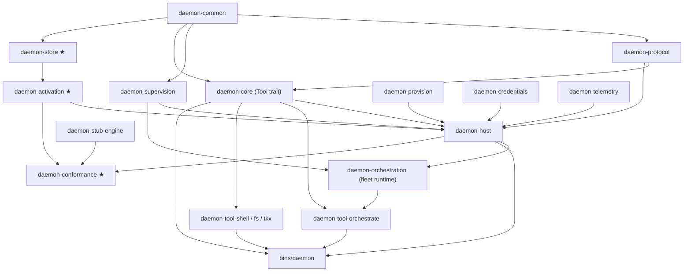
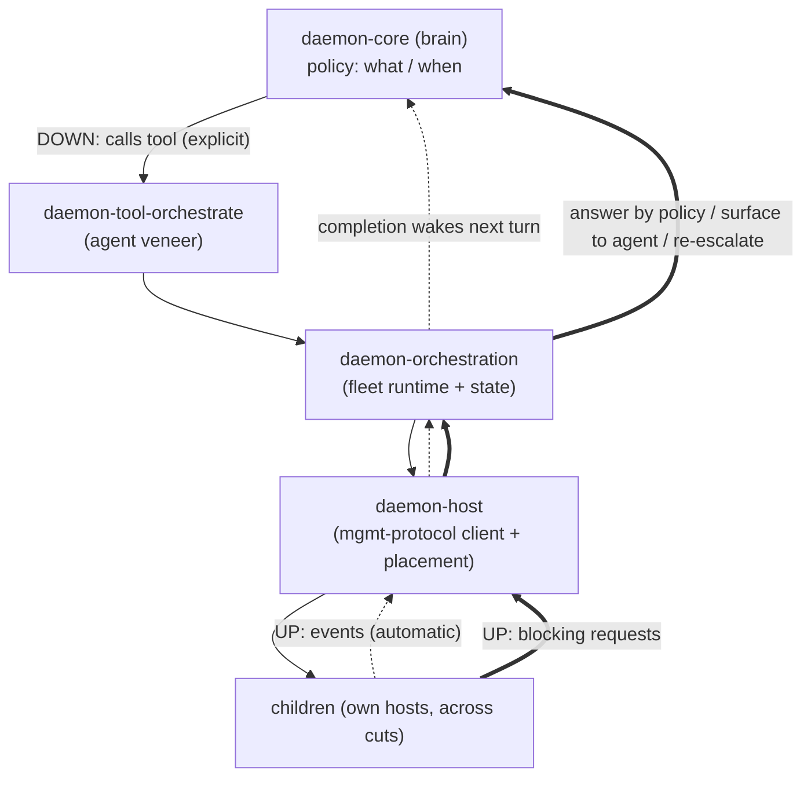

# daemon — workspace layout

The ideal-state Cargo workspace structure for the whole system. Its job is to make the architecture's
two invariants **physically visible in the directory tree**:

1. the **crate-dependency DAG** ([`daemon-supervision-spec.md`](specs/daemon-supervision-spec.md) intro) — a
   crate never depends on one "above" it; and
2. the **durable / borrowable seam** ([`beam-substrate-reference-extraction.md`](research/beam-substrate-reference-extraction.md) §1) —
   the correctness-critical durable core is isolated enough to be built and proven against the seven
   acceptance tests with a *stub* engine, before any borrowable mechanism is layered on.

Companion docs: [`daemon-orchestration-synthesis.md`](research/daemon-orchestration-synthesis.md) §3.1–§3.2 (the
roles, the dual-interface, the unit-tree vs host-tiling framing this layout encodes),
[`daemon-host-spec.md`](specs/daemon-host-spec.md) (the substrate), and
[`rust-substrate-evaluation.md`](specs/rust-substrate-evaluation.md) §6 (the acceptance tests the conformance
crate runs).

---

## 1. Principles

- **Contracts are a layer of their own.** Pure types/traits (the seams) live in `crates/contracts/`
  with no runtime. The crate rule (`daemon-core` depends on `daemon-protocol`, **never** on
  `daemon-supervision`) is then enforced by the graph, not by convention.
- **The durable core is split out of the host.** `daemon-store` + `daemon-activation` are separate
  crates so they can be developed and proven against `daemon-conformance` using `daemon-stub-engine`,
  with zero dependency on `daemon-core`, credentials, placement, or translation. This is what makes the
  build-first milestone (§8) possible.
- **Deferred concerns are stub crates / features, not absences.** A boundary that exists but is
  unimplemented (remote transport, process/container placement) is a real seam behind a feature flag,
  so the shape is defined before the work.
- **Orchestration is a capability, not a node type** (§4). There is no orchestrator *engine* — the
  brain is `daemon-core` — but there **is** a `daemon-orchestration` *fleet-runtime* crate beneath a
  thin tool veneer.
- **`daemon-core` is the *reference* brain, not the only possible one.** §17 (`AgentCommand` /
  `AgentEvent` / `HostRequest`) is the **universal agent-runner leaf**: any brain that speaks it is an
  `Engine`-leaf `ManagedUnit`, indistinguishable to its supervisor from a `daemon-core` engine.
  Foreign agents (e.g. a CLI agent in another language) attach as a `ManagedUnit` over a §17 **process
  cut** via an adapter + a launch profile (`program`/`args`/`env`); they own their own state, so the
  durable hydrate/dehydrate machinery (§2) is a `daemon-core` property, and foreign units get a
  coarser, adapter-owned lifecycle. The FFI direction is the opposite concern — *others embedding our
  brain/node* (see the embedding bullet below) — not us driving a foreign agent.
- **Embedding is a thin shell at a protocol seam, not a new API.** The C ABI / FFI crates
  (`bindings/`) pump CBOR-encoded `daemon-protocol` / `daemon-supervision` messages over opaque
  handles — one more row in the embedding spectrum, riding the existing `wire_version` + CDDL contract
  ([`docs/specs/daemon-ffi-spec.md`](specs/daemon-ffi-spec.md)).
- **Reference material is outside the workspace** (`research/`), so the cloned trees never build or lint.

---

## 2. The tree

```text
daemon/                              # cargo workspace root
├── Cargo.toml                       # [workspace] members = crates/*/*, tools/*, bindings/*, bins/*, tests/*, xtask
├── Cargo.lock
├── rust-toolchain.toml              # pinned toolchain
├── rustfmt.toml · clippy.toml · deny.toml
├── README.md
│
├── docs/
│   ├── specs/                       # authoritative contracts (daemon-core-spec.md lives WITH its crate, below)
│   │   ├── daemon-supervision-spec.md
│   │   ├── daemon-host-spec.md
│   │   ├── daemon-orchestrator-spec.md
│   │   ├── daemon-lifecycle-persistence.md
│   │   └── rust-substrate-evaluation.md
│   ├── research/                    # how we got here (non-normative)
│   │   ├── daemon-orchestration-synthesis.md
│   │   ├── beam-substrate-reference-extraction.md
│   │   ├── kameo-dehytration.md
│   │   ├── source-audit.md
│   │   ├── symphony-architecture-comparison.md
│   │   ├── CMMI for Agentic Fleets.md
│   │   ├── cmm-cmmi-maturity-ladder.md
│   │   └── hermes/                  # legacy hermes/mnemosyne analysis the daemon-core docs cite
│   ├── adr/                         # architecture decision records
│   └── daemon-workspace-layout.md   # this document
│
├── research/                        # NOT a workspace member — reference clones, excluded from build/lint
│   └── actor-otp-supervisors/       #   the --depth=1 trees we mined (kept in the daemon-hermes archive)
│
├── crates/
│   ├── contracts/                   # pure types + traits, the seams. No runtime.
│   │   ├── daemon-common/           #   SessionId/UnitId/JobId, Budget, FenceToken, errors, wire-version, CDDL
│   │   ├── daemon-protocol/         #   §17 host protocol: Agent{Command,Event}, HostRequest   (→ common)
│   │   └── daemon-supervision/      #   management protocol: Manage{Command,Event,Request}, ManagedUnit (→ common)
│   │
│   ├── engine/
│   │   └── daemon-core/             #   the engine: conversation, turn loop, snapshot (§6), Tool trait (→ protocol, common)
│   │       └── docs/                #     the daemon-core spec family (spec/redesign/runtime-model/host-interface/
│   │                                #     messaging-surface/gui-surfaces), co-located with the crate it specifies
│   │
│   ├── substrate/                   # the durable layer + borrowable mechanism — the host's engine-room
│   │   ├── daemon-store/            #   ★ SessionStore trait + SQLite/WAL/CBOR; 5 tables, 4 txns   (→ common)
│   │   ├── daemon-activation/       #   ★ directory + lease/fence + inbox/outbox + recovery scan;
│   │   │                            #     ActivationSubstrate trait + plain-Tokio impl;
│   │   │                            #     optional `elfo` feature = Elfo MapRouter shell   (→ store, common)
│   │   ├── daemon-provision/        #   Provisioner: workspace + placement (in-proc / process / container) = the "cut"
│   │   ├── daemon-credentials/      #   credential authority backing the engine's §7 port (host authority, not a tool)
│   │   ├── daemon-telemetry/        #   trace-in-envelope, metrics, dumps
│   │   ├── daemon-host/             #   composes the above; §17 ↔ management translation; in-process host;
│   │   │                            #     owns the downward management-protocol CLIENT (drive/place ONE child)
│   │   └── daemon-transport/        #   DEFERRED stub: wire form of mgmt protocol + remote host
│   │
│   └── orchestration/
│       └── daemon-orchestration/    #   fleet RUNTIME (not an engine): child registry, Usage/RateLimit/Health
│                                    #     fan-in, child-request answer/escalation policy, optional scheduler;
│                                    #     driven by the tool (agent) or a deterministic policy driver (→ host, supervision)
│
├── tools/                           # the agent toolset, one crate per tool (the engine loads these)
│   ├── daemon-tool-shell/
│   ├── daemon-tool-fs/
│   ├── daemon-tool-tkx/             #   work source = agent-managed tooling (NOT a core crate)
│   └── daemon-tool-orchestrate/     #   thin agent veneer over daemon-orchestration (→ orchestration, core Tool trait)
│
├── bindings/                        # C ABI / embedding shells — thin cdylibs over the protocol seams (docs/specs/daemon-ffi-spec.md)
│   ├── daemon-core-ffi/             #   cdylib+staticlib over §17 — embed the engine (→ core, protocol)
│   └── daemon-ffi/                  #   cdylib+staticlib over host/mgmt surface — embed the durable system (→ host)
│
├── bins/
│   ├── daemon/                      # the node binary — runs as embedder | host | (orchestrating) engine by config
│   └── daemon-cli/                  # operator CLI
│
├── tests/
│   ├── daemon-conformance/          # ★ the 7 acceptance tests as a reusable harness vs ANY substrate impl
│   └── daemon-stub-engine/          #   minimal snapshot/restore engine — decouples substrate tests from daemon-core
│
└── xtask/                           # dev automation: codegen, CDDL gen/check, fuzz, bench
```

(★ = the build-first milestone surface, §8.)

---

## 3. The dependency DAG = the build order

Each crate depends only on crates above it; this is also the order to build.



Note the chain the orchestration split creates: **`daemon-tool-orchestrate → daemon-orchestration →
daemon-host → child`**, with `daemon-core` only supplying the `Tool` trait the tool implements.
Ordinary tools (shell/fs/tkx) depend on `daemon-core` only; the orchestrate tool is the one that
reaches down through the fleet runtime. There is no cycle: `daemon-core` defines `Tool` but depends on
no concrete tool and no orchestration; `bins/daemon` wires engine, host, runtime, and tools together. A
future deterministic-policy driver would depend on `daemon-orchestration` directly, bypassing the tool
and the engine entirely.

---

## 4. Orchestration is a capability, not a node type

A node is the same thing: a brain (a `daemon-core` engine by default) running on a host. "Being an
orchestrator" is not a different kind of node — it is an engine whose toolset includes the
orchestration tool. The brain it supervises need not be `daemon-core`: a child unit may be a foreign
agent process speaking §17 over a cut, presented up the tree as an ordinary `Engine`-leaf
`ManagedUnit` (the supervisor cannot tell which sits behind the interface). But orchestration is not
just "a tool"; there is real fleet machinery between the brain and the wire. It splits into **four**
distinct things, in four homes:

| Layer | Holds | Home |
|---|---|---|
| **Brain** — *what / when* to delegate (reasoning) | the conversation/turn loop deciding fleet actions | `daemon-core` (the **reference** engine; foreign §17 brains attach as `Engine`-leaf units) |
| **Fleet runtime** — the machinery | child registry (`UnitId → status/work/lease`), `Usage`/`RateLimit`/`Health` fan-in, the child-request **answer/escalation policy chain**, optional deterministic scheduler (WIP/retry/reconcile), fleet-level child-supervision policy | **`daemon-orchestration`** (a runtime/state library — **not an engine**) |
| **Per-child mechanism** — drive/place/cancel one child, speak the management protocol downward | the downward management-protocol **client** + placement | `daemon-host` (synthesis §3.2: a host is two-faced for an orchestrator node) |
| **Tool surface** — the agent's handle | `delegate`/`assign`/`cancel`/`status` verbs; rendering fleet state back as observations | `tools/daemon-tool-orchestrate` (thin veneer) |

`daemon-orchestration` is the crate that *would* be "the orchestration engine" — except it is a **fleet
runtime, not a second engine**: the brain stays `daemon-core`, and the runtime is driven *through the
tool* (agent mode) or *directly* by a deterministic policy driver. The brain↔runtime boundary is the
existing snapshot `references.children: Vec<SessionId>` (lifecycle §2): the runtime materializes the
live fleet view from those ids + the store, so the two compose without coupling.



**Why it resists collapse in both directions:**

- **Tool ↔ runtime — keep split.** Collapsing welds orchestration to the agent-driven mode and kills
  the "agent *or* deterministic policy behind the same protocol" pluggability (synthesis §4.1). A
  deterministic scheduler uses the runtime with no tool and no agent.
- **Runtime ↔ `daemon-core` — keep split.** `daemon-core` must stay free of `daemon-supervision`/
  `daemon-host` (the crate rule); the runtime depends on both. Fleet state also has a different durable
  shape than a conversation, and the deterministic-policy node wants the runtime *without* a
  conversation engine at all.

**Parent-management is mostly implied, with one real exception** (the up-edges above):

- **Child → parent *events*** (Started/Progress/Usage/Finished/Health) are **automatic**: they ride the
  management protocol up to the orchestrator's host, the runtime folds them into fleet state, and a
  child `Finished` wakes the orchestrator engine as a `BackgroundCompletion` trigger (host §17.1). The
  parent does not "fetch" replies.
- **Child → parent *requests*** (Approval/Input/Escalate/Resource) are **not** automatic — the parent is
  the **answer-authority** for its children (synthesis §3.1 #3). The runtime answers by policy where it
  can, surfaces the rest to the agent as a `HostRequest`, and re-escalates upward what the agent cannot
  resolve. This is the one genuine downward capability beyond the tool verbs.
- An orchestrator **never manages upward** — its upward face is that it *is managed* by its own
  supervisor (events emitted, requests escalated), automatic via its own host (the §3.2 symmetry).

This still mirrors the work source — `tkx` is *just a tool* (`daemon-tool-tkx`) — but orchestration is
the richer case: a tool veneer **over a real runtime crate**, not a bare tool. The deterministic-policy
driver remains deferred (not built until needed), but `daemon-orchestration` itself is a real crate now,
because the fleet machinery has to live somewhere even in pure agent-driven mode.

---

## 5. Core crate vs tool vs host authority — the boundary

Three categories, and the rule for which is which:

- **Core crate** — anything on the upward/downward protocol path or the durable lifecycle (everything
  under `crates/`). Mandatory mechanism the architecture cannot omit.
- **Tool** (`tools/`) — a capability the *agent* invokes and manages, that is not part of the
  substrate's correctness. The work source (`tkx`) is the canonical example. The orchestration *tool*
  is a thin veneer, but note its backing **fleet runtime** (`daemon-orchestration`) is a core crate, not
  a tool — the tool is the agent's handle onto core machinery (§4).
- **Host authority** — a fleet-wide resource the host *owns* and the engine *consumes through a typed
  port*, not through a tool. **Credentials** (`daemon-credentials`, the §7 authority) is the example.

The credentials/tkx contrast is the load-bearing distinction: both are "external resources," but `tkx`
state is tool-owned and re-read on rehydration (lifecycle §1.2), whereas credentials are an authority
the host governs (rotation, attenuation, fleet rate/cost). Revisiting whether credentials should also
be tool-shaped is possible but out of scope here — it stays a host authority.

---

## 6. Workspace hygiene & profile invariants

- **`panic = "unwind"` is mandatory** (root `Cargo.toml`). Catch-unwind-based supervision is silently
  void under `panic = "abort"` ([`beam-substrate-reference-extraction.md`](research/beam-substrate-reference-extraction.md) §2.2),
  so the release profile must unwind. This is a structural guarantee, not a thing to remember:

  ```toml
  [profile.release]
  panic = "unwind"

  [workspace.dependencies]
  # single source of truth for shared versions: tokio, tokio-util, dashmap, serde, async-trait, ...
  ```

- **Feature gates for swappable/deferred surfaces:** `daemon-activation/elfo` (off by default),
  `daemon-store` backends (`sqlite` default), `daemon-provision/{process,container}`,
  `daemon-transport/remote`.
- **`research/` is excluded** from the workspace (no `members` glob reaches it); the cloned reference
  trees never compile or lint with the project.
- **One node binary, role by config.** `bins/daemon` runs as an embedder, a host, or an orchestrating
  engine depending on configuration — mirroring the recursion: the same binary tiles the unit tree and
  opens cuts via `daemon-provision` (synthesis §3.2). No separate `hostd`/`orchestratord`.

---

## 7. Build-first mapping

The crates marked ★ are the irreducible, no-reference durable core — build them first as a vertical
slice and prove them against `daemon-conformance` with `daemon-stub-engine`, before any borrowable
mechanism:

| Phase | Crates | Gate |
|---|---|---|
| **1 — durable core** | `daemon-common`, `daemon-store`, `daemon-activation`, `daemon-stub-engine`, `daemon-conformance` | acceptance tests #1–#3, #5, #7; #4/#6 via simulated dual ownership |
| **2 — resident supervision** | the supervisor wiring inside `daemon-host` (bounded resident tree) | resident services restart/backoff/meltdown under churn |
| **3 — real engine + translation** | `daemon-protocol`, `daemon-core`, `daemon-supervision`, `daemon-host` (replace the stub) | §17 ↔ management round-trips |
| **4 — orchestration** | `daemon-orchestration` (fleet runtime) + `daemon-tool-orchestrate` | one engine delegates to a child; events fan in, a child request is answered/escalated |
| **5 — placement / the first cut** | `daemon-provision` (process/container) | a child runs in an isolated process; fencing holds across the cut |
| **6 — telemetry, then distribution** | `daemon-telemetry`, then `daemon-transport` (deferred) | trace-in-envelope end-to-end; cross-node lease/fence when fleets-of-fleets is real |

The throughline: **the tree encodes the DAG, the durable/borrowable seam, and the build order in one
shape** — so "where does this code go?" reduces to "which layer does it depend on, and is it
durable-core or borrowable-mechanism?"
