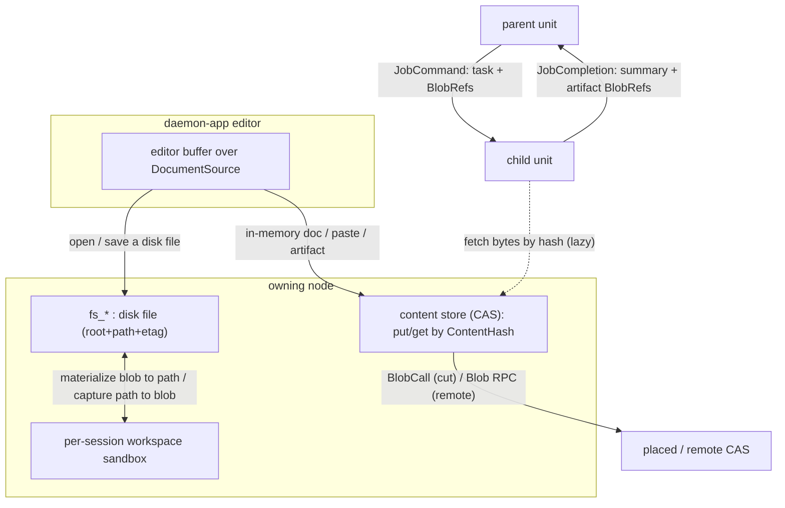

# Content-addressed file / artifact transfer

Status: partially implemented. **Phase 1** (the node content store + `blob_*`/`fs_write_from_blob`
surface) and **Phase 2** (in-process tree transfer: delegation/completion file transfer + inbound
message attachments, backend-only, node-mediated) are shipped — see §10 for the per-phase status and
§5 for the as-built design. Phases 3 (federation over cut/remote) and 4 (GC/pin/quotas) and the
daemon-app GUI surface remain design / feasibility. Companion to `daemon-fs-surface-spec.md` (the
path-based workspace filesystem surface) and the GUI design at
`../../../daemon-app/docs/file-browser-workspace-design.md`.

This spec answers two questions with one primitive:

1. How can the GUI's code/document editor edit files seamlessly when a document may live **only in
   memory** (a scratch buffer, a paste, a generated artifact) or **on disk** (a workspace file)?
2. More generally, how do agents **transfer files to each other through the orchestration tree**
   (parent -> child, child -> parent, across placement cuts and remote nodes)?

The unifying answer: a **file is content-addressed bytes (a blob) plus an optional name/path**.
Transferring a file - GUI to node, or agent to agent - is *passing a content-hash ref* and
*fetching the bytes lazily from whoever holds them*. The daemon already has the right shape for
this (a content-addressed blob store for profiles/skills, and unused ref slots on the supervision
contract); this spec generalizes it.

## 1. Scope and non-goals

In scope:

- A node **content store** (content-addressed store, CAS): put/get/stat immutable blobs by hash.
- A **`BlobRef`** carried in messages, delegation input, and completion results, fetched lazily by
  hash and brokered across placement cuts / remote nodes.
- The GUI editor's **`DocumentSource`** model unifying disk-backed files (the `fs_*` surface) and
  in-memory documents (blobs).
- Bridges between blobs and the path-based workspace (`fs_*`): materialize a blob to a path,
  capture a path as a blob.

Out of scope (noted, deferred):

- Real-time collaborative editing (OT / CRDT) - the `fs_*` revision/etag model and immutable blobs
  are the v1 concurrency story.
- A global cross-node CAS / replication beyond lazy fetch-by-hash from the holding node.
- Binary diffing / delta sync; chunked dedup within a blob.

## 2. Findings: what exists today (and what to reuse)

This design deliberately reuses proven daemon primitives rather than inventing new machinery.

### 2.1 A content-addressed blob store already exists (scoped)

`FileRevisionLog` (`crates/substrate/daemon-host/src/revision.rs`) stores content-addressed blobs
on disk as `blobs/<sha256-hex>.bin` with **write-if-absent** dedup, behind the `RevisionLog` trait
(`append`/`get_at`/`history`/`head`) in `crates/contracts/daemon-common/src/lib.rs`. It is keyed by
`(RevisionKind, id)` (only `Profile` / `Skill`) - i.e. per-artifact history, **not** a flat
`hash -> bytes` pool. The on-disk CAS pattern and `ContentHash` (32-byte SHA-256, `daemon-common`)
are exactly what a general content store needs; only the keying must be generalized.

### 2.2 The supervision contract already has ref slots - unused

`crates/contracts/daemon-supervision/src/lib.rs` defines, but never populates:

- `WorkRef.content: Option<ContentRef>` - a delegation's large input as a ref (vs inline
  `WorkPayload.text`). Today `resolve_work` (`agent_session.rs`) stubs it to
  `UserMsg::new(format!("content:{}", content))` - a placeholder, not a fetch.
- `Outcome.artifacts: Vec<ArtifactRef>` - a child's output artifacts. Always empty in the
  engine -> management mapping.

`ContentRef` / `ArtifactRef` are opaque string newtypes with no resolver. This spec gives them a
content-store-backed meaning (`BlobRef`).

### 2.3 Delegation / completion already cross as opaque byte payloads

- Delegation: `JobCommand.payload: Vec<u8>` (`daemon-store`) - currently the fixed marker
  `b"delegated-work"` (`engine.rs::suspend`), decoded by the `FleetJobWorker` as the child's first
  user message (`daemon-node`).
- Completion: `JobCompletion.payload: Vec<u8>` - currently `"child:{child_id}"`, surfaced to the
  parent's open orchestrate tool slot in `engine.rs::resolve_pending`.

Both are already opaque `Vec<u8>` - natural carriers for a structured `{ task/summary, refs }`
without a schema migration of the store.

### 2.4 The cut already brokers a store by hash-correlated RPC

`crates/substrate/daemon-host/src/cut.rs`: a placed child reaches the parent's `SessionStore` via
`CutFrame::StoreCall`/`StoreReply` with a `RemoteStoreClient` (child) and `serve_store_call`
(parent). Credentials use the same pattern on a dedicated channel. A `BlobCall`/`BlobReply` frame
mirrors this exactly. Cross-node `daemon-transport` uses a simpler request/reply `Wire<Req/Resp>`
that can gain `Blob*` variants.

### 2.5 The "ref + side file + lazy recover" pattern already exists (LCM)

`crates/engine/daemon-context-lcm/src/externalize.rs` externalizes large text to a side file and
leaves an inline `[Externalized ...; ref=<file>]` placeholder, recovered on demand. It is
text-only, session-scoped, and LCM-specific, but validates the principle: **keep large bytes out of
the hot path; carry a ref; fetch when needed.**

### 2.6 Constraint: snapshots and the journal embed bytes inline

`SnapshotBlob` is the whole engine conversation CBOR in `session_record.snapshot`; journal blocks
embed `ToolDetail`/`Content` bodies inline in `journal_entries.bytes`. Putting file bytes in either
bloats the durable store and the audit log. **Therefore blobs live in the content store; only
`BlobRef`s (hashes + small metadata) appear in snapshots, journals, and messages.**

### 2.7 Workspace isolation means transfer must be explicit

Every unit gets its own sandbox (`WorkspaceRoots::session_root` =
`<workspace_root>/<sanitized session id>`; `parent` and `parent/c1` are *different* directories).
Files never flow between units implicitly; a transfer is always an explicit ref + fetch (or a
materialize into the recipient's workspace).

## 3. Core model

### 3.1 Blob, ContentHash, BlobRef

- A **blob** is immutable bytes, identified by its `daemon_common::ContentHash` (32-byte SHA-256 of
  the bytes). Identity is the content: two identical files are one blob.
- A **`BlobRef`** is the wire-carried handle: the hash plus small, optional metadata that never
  requires fetching the bytes to render a useful UI or route a transfer.

```rust
// proposed (daemon-common, re-exported by daemon-api)
pub struct BlobRef {
    pub hash: ContentHash,        // identity = SHA-256 of the bytes
    pub size: u64,                // byte length (known at put time)
    pub name: Option<String>,     // suggested file name (display / default save path)
    pub mime: Option<String>,     // best-effort content type
}
```

A "file" in any envelope is a `BlobRef` (+ optionally a target workspace path). The bytes are never
inline; they are fetched by `hash` from the content store.

### 3.2 The node content store (CAS)

A per-node, flat, content-addressed store - the generalization of `FileRevisionLog`'s blob pool:

```rust
// proposed (daemon-host)
#[async_trait]
pub trait BlobStore: Send + Sync {
    async fn put(&self, bytes: &[u8]) -> Result<BlobRef, BlobError>;          // write-if-absent
    async fn get(&self, hash: &ContentHash, range: Option<ByteRange>) -> Result<Vec<u8>, BlobError>;
    async fn has(&self, hash: &ContentHash) -> bool;
    async fn stat(&self, hash: &ContentHash) -> Option<BlobStat>;             // size, refcount
}
```

- **On disk:** `<data_dir>/blobs/<sha256-hex>.bin`, write-if-absent (reuse the exact pattern in
  `revision.rs`). Dedup is automatic: identical content writes once.
- **Integrity:** a **full-blob** `get` verifies the bytes hash to the requested `ContentHash`
  (content-addressing makes tampering / corruption detectable for free). A **ranged** `get`
  (`range: Some(..)`) returns a slice that *cannot* be verified against the whole-content hash;
  ranged reads therefore trade off per-fetch verification (the holder is trusted, or the client
  re-verifies after assembling the whole blob). Verified ranged reads would require a future
  chunk/Merkle scheme over the blob.
- **Relationship to `FileRevisionLog`:** the revision log keeps *named, versioned* history
  (profiles/skills) and can share the same on-disk blob pool; the `BlobStore` is the *anonymous,
  content-keyed* face. Implementation may layer both over one `blobs/` directory.

### 3.3 The load-bearing principle: refs in envelopes, bytes external + lazy

Every durable or streamed envelope (snapshot, journal block, §17 message, delegation job,
completion) carries **`BlobRef`s, never bytes**. Bytes live in the content store and are fetched on
demand from the node that holds them. This keeps the durable store and audit journal small (per the
2.6 constraint) and makes transfer uniform: the *same* `BlobRef` is valid anywhere in the tree, and
resolves against the nearest holder.



## 4. GUI editor: the `DocumentSource` model

The editor (daemon-app) holds one buffer abstraction over a `DocumentSource`, so a code/document
tab behaves identically whether it is backed by disk or memory:

```
DocumentSource =
  | WorkspaceFile { root: FsRootId, path: String, revision: FsRevision }  // disk-backed
  | Blob          { ref: BlobRef }                                        // content-addressed, no path
  | Ephemeral     { }                                                     // unsaved local buffer only
```

- **WorkspaceFile** - the shipped `fs_*` surface: open via `fs_read(root, path)`, edit in the
  buffer, save via `fs_write(root, path, bytes, base_revision)` with the `FsRevision` etag for
  optimistic concurrency. (No change to the FS surface.)
- **Blob** - an in-memory document with no path (a scratch doc, a paste, an agent-generated
  artifact opened from a message). `blob_get(ref.hash)` loads it; "save" is `blob_put(bytes)`
  yielding a new `BlobRef` (content-addressed, so saving a blob is idempotent for unchanged bytes).
- **Ephemeral** - a brand-new untitled buffer not yet committed anywhere; becomes a `Blob` on first
  `blob_put` or a `WorkspaceFile` on first "save as" to a path.

### 4.1 Save / promote / send routing

| User action | Effect |
| --- | --- |
| Save a `WorkspaceFile` | `fs_write(root, path, bytes, base_revision)`; conflict -> reload/overwrite/diff (per fs spec). |
| Save a `Blob` / `Ephemeral` | `blob_put(bytes) -> BlobRef`; the tab now tracks the new ref. |
| "Save to workspace" (promote) | `blob_put` (if dirty) then `fs_write_from_blob(root, path, ref)`; the tab becomes a `WorkspaceFile`. |
| "Attach to message" | put if needed, then send the `BlobRef` as a composer attachment (section 5.3). |
| Open an agent artifact | a `BlobRef` from a transcript/message opens directly as a `Blob` tab. |

The GUI **streams bytes to/from the node** and never needs the file on its own local disk; an
in-memory document is a first-class blob, not a forced temp file. Dirty state is per source
(etag mismatch for `WorkspaceFile`; "bytes differ from `ref`" for `Blob`).

## 5. Agent-to-agent transfer through the tree

Files move between units as `BlobRef`s carried in the envelopes that already cross each boundary;
the recipient fetches bytes lazily and either holds the blob or materializes it into its workspace.

### 5.1 Delegate (parent -> child) — *implemented*

The fixed `b"delegated-work"` payload is replaced with a structured, CBOR-encoded job payload
(`daemon-protocol`):

```rust
// the decoded shape of JobCommand.payload (stays Vec<u8> on the store)
pub struct DelegationInput {
    pub task: String,             // the instruction seeded as the child's first message
    pub attachments: Vec<String>, // parent-workspace-relative paths handed down to the child
}
```

Note the **paths, not inline `BlobRef`s**: the agent names files it can already see in its own
workspace; the node (which holds the `BlobStore` + `WorkspaceRoots`) does the CAS round-trip. This
keeps the engine content-store-free.

- Built by the orchestrate tool from its label + an `attachments: [path]` arg and carried on
  `Effect::Delegate { job, payload }`; `engine.rs::suspend` passes the opaque bytes into the
  suspension (no `BlobStore` in core).
- The `FleetJobWorker` (`daemon-node`, +`WorkspaceRoots` +`BlobStore`) decodes the payload, seeds
  the child's first message from `task`, and **materializes** each attachment: read the parent file
  (`session_root(parent)/<path>`), `blob_put` -> `blob_get`, write into `session_root(child)/inbox/`.
- The dormant `WorkRef.content` is **not** repurposed as a `BlobRef` (see §5.4): the live/foreign
  `resolve_work` path stays as-is; the structured vocabulary lives on the durable delegation payload.

### 5.2 Complete (child -> parent) — *implemented*

Symmetric structured completion payload:

```rust
// the decoded shape of the completion payload (stays Vec<u8> on the store)
pub struct DelegationResult {
    pub summary: String,
    pub artifacts: Vec<BlobRef>,  // files the child produced (captured from its outbox/)
}
```

- The child's `CoreIncarnation` captures its `outbox/` at `Step::Completed` (`blob_put` each regular
  file), encodes a `DelegationResult`, and surfaces it via `Incarnation::completion_payload()`. The
  activation layer attaches it to the `Checkpoint` (new additive `completion_payload` field) and
  `mark_completed` records it as the completion payload instead of the `"child:{id}"` marker.
- The waking parent's `CoreIncarnation` materializes `artifacts` into `session_root(parent)/inbox/`
  on hydrate; `engine.rs::resolve_pending` decodes the `summary` into the open orchestrate tool slot.
- `Outcome.artifacts` is **not** populated from this (see §5.4).

**Back-compat (implemented).** `DelegationInput::decode` / `DelegationResult::decode` attempt CBOR
and, on failure, treat the raw bytes as the legacy text (task string / completion summary), so
durable jobs and completions enqueued *before* the upgrade (`b"delegated-work"` / `"child:{id}"`)
still resolve after it — safe across a rolling restart.

### 5.3 Messages / attachments — *implemented (backend), GUI deferred*

- `UserMsg` carries an optional `attachments: Vec<BlobRef>` (`#[serde(default)]`), flowing through
  `StartTurn` (+ `daemon-api.cddl`). `NodeApiImpl::submit` materializes each attachment node-side
  into `session_root(session)/inbox/` before the turn, so the engine/tools see the on-disk files
  (the engine ignores the field). The client first `blob_put`s the bytes, then submits the refs.
- The daemon-app GUI composer `@file:` -> `BlobRef` flow is **not** part of this phase (Phase 2 is
  backend-only); the message model now supports it.

### 5.4 One ref vocabulary — *reconciled*

The structured file vocabulary (`DelegationInput`/`DelegationResult` carrying `BlobRef`s, plus
`UserMsg.attachments`) lives on the **durable delegation payload and the message model**. The coarse
`daemon-supervision` refs (`ContentRef`/`ArtifactRef`) are deliberately left as opaque string handles
and the management event projection (`WorkRef.content` / `Outcome.artifacts`) stays **payload-agnostic
by design** — it never interprets blob content. So rather than collapsing those newtypes into
`BlobRef`, the one handle type (`BlobRef`) is the vocabulary of the content-bearing paths, and the
management tree keeps its agnostic refs. (The earlier proposal to unify the newtypes was dropped to
respect that boundary.)

## 6. Transport: lazy fetch by hash

A `BlobRef` is valid tree-wide; resolving it fetches bytes from the holder. Three boundaries, all
using the request/reply patterns the codebase already proves:

- **In-process (same node):** one shared `BlobStore`; recipients call `get(hash)` directly. No
  copy, no serialization.
- **Placed child (separate process, over a cut):** add `BlobCall`/`BlobReply` to `CutFrame`, a
  `RemoteBlobClient` on the child, and `serve_blob_call` on the parent's reader loop - a direct
  mirror of `StoreCall`/`serve_store_call`/`RemoteStoreClient` (`cut.rs`). The child fetches from
  the parent CAS on demand (and may `put` results back up). This is also what unblocks placed/remote
  unit browsing noted in `daemon-fs-surface-spec.md`.
- **Remote node (TCP):** add `BlobGet { hash, range }` / `BlobPut { bytes }` `Req`/`Resp` variants
  to `daemon-transport`'s `Wire<Req/Resp>` (`remote.rs`) - simpler than the cut (no multiplex
  reader loop needed; it is already request/reply).

Content-addressing makes all three safe and uniform: the fetched bytes are verified against the
requested hash, duplicates are coalesced, and a ref can be re-resolved from whatever holder is
reachable.

## 7. NodeApi surface (sketch)

Grouped on `ControlApi` with `Unsupported` defaults, exactly like the `fs_*` ops, and mirrored in
`crates/contracts/daemon-api/daemon-api.cddl`:

- `blob_put(bytes) -> BlobRef`
- `blob_get(hash, range?) -> { bytes, blob_ref }`
- `blob_stat(hash) -> Option<BlobStat>` (size, present, refcount)
- `fs_write_from_blob(root, path, hash, base_revision?, force) -> FsRevision` - materialize a blob
  to a workspace path, reusing the fs gating (containment, sensitive-path, checkpoint).
- `fs_read` MAY additionally return a `BlobRef` for the bytes it served, so the GUI can hand the
  same content to an agent without re-uploading.

`ApiRequest`/`ApiResponse` variants + `dispatch` arms follow the `fs_*` precedent; the socket/FFI
ride the shared `dispatch`, HTTP rides `POST /api` (a `GET /blob/{hash}` byte route is an optional
convenience).

## 8. Lifecycle, GC, and integrity

- **Dedup:** write-if-absent by hash; identical content is stored once (the `revision.rs` pattern).
- **Pinning / refcount:** a blob is retained while referenced by a pin set. The pin set MUST cover
  every place a `BlobRef` can persist, not just live state: an open editor tab, a pending/unapplied
  delegation job or completion, a workspace path materialized from it, an explicit `blob_pin`, and -
  critically - any **durable session snapshot or journal block** that carries the ref (e.g. an
  attachment in a dormant session's conversation, kept for history/replay). Missing the durable
  snapshot/journal references would let a sweep drop a blob that a completed-but-replayable session
  still points at, dangling its history. Unreferenced blobs (by the full pin set) are eligible for
  sweep.
- **Retention + sweep:** a background reclaimer removes unpinned blobs past a TTL / above a store
  quota (LRU by last access). Conservative default: never sweep a blob referenced by an
  uncompleted job, a live session, or a durable snapshot/journal entry.
- **Integrity:** a full-blob `get` verifies bytes against the requested hash; a mismatch is a hard
  error (corruption / tamper), never silently served. Ranged reads are not per-fetch verifiable
  against the whole-content hash (see 3.2).
- **Size:** `blob_put` enforces a max blob size + a per-node store quota; large transfers use the
  `range` read to stream rather than buffering whole.

## 9. Security

- **Containment on materialize:** `fs_write_from_blob` goes through `contain()` + the FS surface's
  sensitive-path / `ApprovalPolicy::Deny` / checkpoint gating - blobs cannot write outside a root or
  past the same gates an operator/agent write faces.
- **Fetch scoping:** `blob_get` is capability/scope-checked - a unit may fetch a blob it was handed
  (referenced in its delegation input, its session, or a message addressed to it), not arbitrary
  hashes by guessing. (Content hashes are not secrets, but the fetch surface should not be an open
  read oracle across tenants.)
- **No bytes in snapshots/journal:** only `BlobRef`s are persisted in `SnapshotBlob` and journal
  blocks; the audit trail records the hash (and thus integrity) without bloating.
- **Provenance:** a put records author (Operator vs Agent) like the revision log, so an artifact's
  origin is auditable.

## 10. Phasing

1. **Content store + GUI in-memory docs (one node).** *(Implemented.)* `BlobStore` over
   `<data_dir>/blobs`; `blob_put`/`blob_get`/`blob_stat` + `fs_write_from_blob` on `ControlApi`
   (+ cddl); GUI `DocumentSource` (`WorkspaceFile` already works, add `Blob`/`Ephemeral`). Delivers
   seamless in-memory-or-disk editing.
2. **In-process tree transfer (backend).** *(Implemented; node-mediated — the node holds the
   `BlobStore` + `WorkspaceRoots`, the engine stays content-store-free, exchanging only opaque
   payload bytes.)* Split into:
   - **2a — delegation/completion file transfer.** The opaque `Effect::Delegate` payload now carries
     a CBOR `DelegationInput { task, attachments: [path] }` (orchestrate tool `attachments` arg); the
     `FleetJobWorker` seeds the child from `task` and materializes each parent-workspace path through
     the CAS into the child's `inbox/`. On completion the child's `CoreIncarnation` captures its
     `outbox/` into a CBOR `DelegationResult { summary, artifacts: [BlobRef] }` carried on the
     `Checkpoint`/`mark_completed` completion payload; the waking parent's incarnation materializes
     the artifacts into its own `inbox/` and `resolve_pending` surfaces the summary text. Both
     decoders fall back to the legacy plaintext markers (`b"delegated-work"` / `"child:{id}"`), so
     in-flight jobs survive a rolling restart. The coarse supervision/management projection
     (`WorkRef.content` / `Outcome.artifacts`) stays payload-agnostic by design: the ref vocabulary
     lives on the durable delegation payload, not the management event stream.
   - **2b — inbound message attachments (backend message model only; no GUI).** `UserMsg.attachments:
     [BlobRef]` (`#[serde(default)]`, + cddl) flows through `StartTurn`; `NodeApiImpl::submit`
     materializes each attachment node-side into the session's `inbox/` before the turn, so the
     engine/tools see on-disk files. The daemon-app GUI compose surface is **not** part of this phase.
3. **Federation.** `BlobCall`/`BlobReply` over the placement cut; `Blob*` RPC on `daemon-transport`
   for remote nodes; lazy fetch-by-hash across boundaries. Delivers transfer through placed/remote
   parts of the tree. (The cut's `MarkCompleted` does not yet carry the completion payload — a
   single-node-only limitation to lift here.)
4. **Lifecycle hardening.** Refcount/pin + retention sweep + quotas + fetch scoping.

## 11. Out of scope (future)

- Real-time collaborative (OT/CRDT) editing of a shared document.
- A replicated / global CAS beyond lazy fetch-by-hash from the holding node.
- Chunked/rolling-hash dedup within a blob and binary delta sync.

