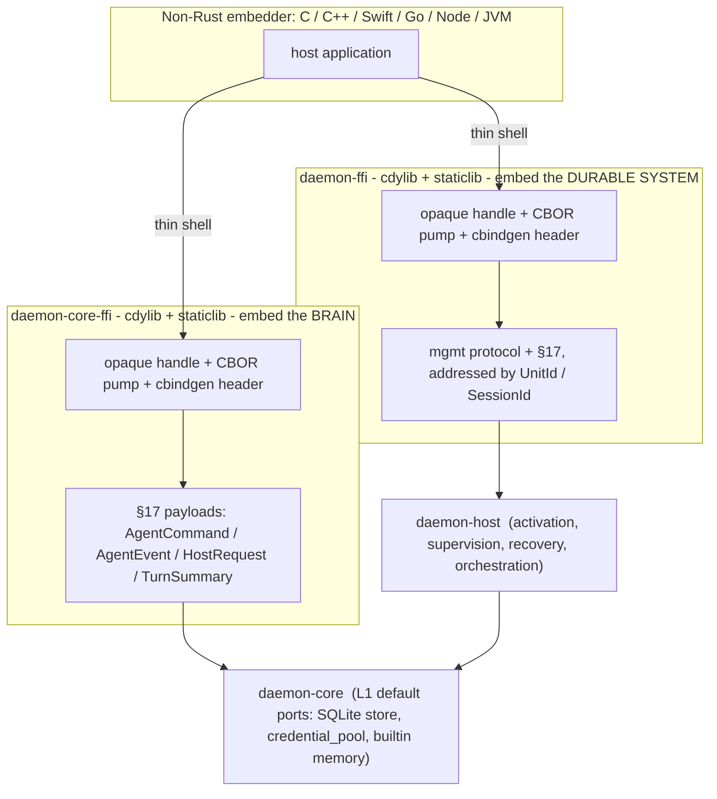
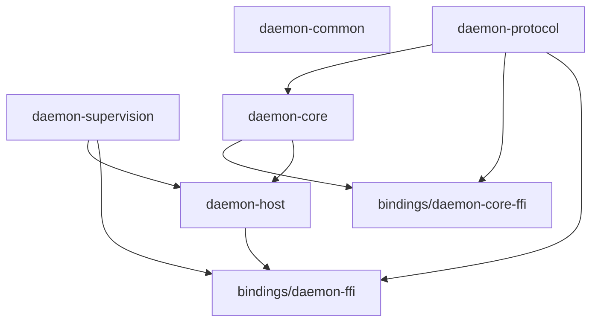

# daemon — C FFI / embedding boundary

Where the C ABI seams belong so the daemon system is **embeddable from non-Rust hosts** (C, C++,
Swift, Go cgo, Node N-API, JVM Panama/JNI, Python ctypes/cffi), and how those seams reuse contracts
the architecture already defines rather than inventing a parallel API.

Companion docs:
[`daemon-core-host-interface.md`](../../crates/engine/daemon-core/docs/daemon-core-host-interface.md)
(the §17 boundary this rides),
[`daemon-core-spec.md`](../../crates/engine/daemon-core/docs/daemon-core-spec.md) §6/§17 (serde +
`wire_version` + CDDL),
[`daemon-core-gui-surfaces.md`](../../crates/engine/daemon-core/docs/daemon-core-gui-surfaces.md) §3
(the embedding spectrum the C ABI extends),
[`daemon-supervision-spec.md`](daemon-supervision-spec.md) §5 (the management protocol the system seam
rides), [`daemon-host-spec.md`](daemon-host-spec.md) (the durable substrate), and
[`daemon-workspace-layout.md`](../daemon-workspace-layout.md) (where the `bindings/` crates sit).

---

## 1. Principle: the FFI is a thin shell at an existing protocol seam

A C ABI cannot carry Rust enums, `async fn`, generics, lifetimes, or `Arc<dyn Trait>`. Exposing the
engine's or host's Rust API directly across `extern "C"` is therefore a non-starter — it would mean
hand-marshalling the entire type surface and re-doing it for every embedder language.

The architecture already removes that problem. Both load-bearing boundaries are **message protocols**,
not call graphs, and both were explicitly built to be encoded over a transport for non-Rust clients:

- **§17 host protocol** (`daemon-protocol`): `AgentCommand` / `AgentEvent` / `HostRequest` +
  `HostResponse` / `TurnSummary`. `serde` + `#[non_exhaustive]` + an explicit `wire_version`, with a
  **published CDDL contract "so non-Rust clients have a stable contract while Rust stays the source of
  truth"** (`daemon-core-spec.md` §17.2, §6).
- **Management protocol** (`daemon-supervision`): `ManageEvent` / `ManageRequest` / `Ack`, with the
  same in-process-enums / out-of-process-JSON+CBOR + CDDL + `wire_version` split
  (`daemon-supervision-spec.md` §5).

The host-interface doc states the governing rule directly: **"transport schemas are adapters, not the
core contract"** (host-interface §8), and the gui-surfaces "embedding spectrum" (§3) already lists
in-process / in-process+server / out-of-process as *the same code path in three deployment shapes*.

> **The C ABI is one more row in that spectrum.** A cdylib that pumps **CBOR-encoded protocol
> messages** across **opaque handles** is, by construction, a thin-shell adapter exactly like the
> WS/SSE browser surface — only the language boundary differs. The CDDL schema that already exists
> *is* the FFI payload contract; `wire_version` already governs payload evolution. The FFI crate adds
> only the handle/lifecycle/error/threading shell around those bytes — it defines **no new domain
> types**.

Consequence: this spec is small on purpose. It fixes the shell (handles, byte buffers, event delivery,
error/panic discipline, threading, versioning, crate placement). It does **not** restate the message
schemas — those live in `daemon-protocol` / `daemon-supervision` and their CDDL artifacts.

---

## 2. Two seams, two crates

There are two distinct things an embedder might want, matching the user-facing question ("the daemon
system should be embeddable; we could also consider `daemon-core` embeddable"). They are different
boundaries with different dependency footprints, so they are **two crates**.



### 2.1 `daemon-core-ffi` — embed the engine (the brain)

A cdylib over the §17 host protocol. The C side **is the host**: it creates a runtime + a session
(opaque handles), submits `AgentCommand`, drains `AgentEvent`, and answers `HostRequest`.

What makes this a genuinely *thin* embed is that the engine ships **L1 standalone default ports** — the
embedded `credential_pool` (`daemon-core-spec.md` §7), the SQLite `SessionStore` (§14), and builtin
memory (§11). So a C embedder gets a working agent **without implementing any host-side port**. It
hands over config (workspace root, model/provider settings, store path, budget caps — all
construction-time inputs per §17.3) and drives turns.

- Depends on: `daemon-core`, `daemon-protocol`. **Not** `daemon-host` / `daemon-supervision`.
- Mirrors the crate-DAG discipline: just as `daemon-core` never depends on `daemon-supervision`
  (supervision-spec §4), `daemon-core-ffi` stays free of the durable substrate. You can embed the
  brain without the host.
- Embeddability level: **L1 cross-language brain** — no durability, no supervision; one process owns
  the session for its lifetime.

### 2.2 `daemon-ffi` — embed the durable system (host + engine)

A cdylib over the host control surface (the management protocol plus §17 routed by id). The C side
boots an **in-process `daemon-host`** (the embedder implementation, `daemon-host-spec.md` §1), then
opens/activates sessions **by `UnitId` / `SessionId`** and drives them — gaining **durable activation,
passivation/rehydration, crash recovery, resident-service supervision, and orchestration** for free.

This is `bins/daemon` "embedder mode" (`daemon-workspace-layout.md` §6) exposed as a **library**
instead of a process: the same assembly, reachable across a C ABI.

- Depends on: `daemon-host` (and transitively `daemon-core`, `daemon-protocol`, `daemon-supervision`).
- Embeddability level: **L2 cross-language durable host** — sessions survive process restarts via the
  store; supervision and single-activation/fencing hold.
- This is the seam that makes the durable "embed our project anywhere" promise true for non-Rust apps.

### 2.3 Why not one crate

The whole point of the contracts split is that the brain and the durable substrate are separable
(layout §1; supervision-spec §4). Collapsing both seams into one cdylib would force every engine
embedder to link the host, the store, the activation layer, and `daemon-supervision` — re-coupling
exactly what the DAG keeps apart. Two crates keep the dependency footprint honest and let an embedder
pay only for the seam it uses.

---

## 3. The ABI shell (the load-bearing mechanics)

The message schemas are settled; the FFI work is the shell around them. These are the decisions that
make the boundary safe.

### 3.1 Handles, buffers, ownership

- **Opaque handles.** `daemon_runtime_t*`, `daemon_session_t*` (and for `daemon-ffi`, a
  `daemon_host_t*`) are opaque pointers to boxed Rust state. Created by `*_new`/`*_open`, destroyed by
  an explicit `*_free`. C never sees Rust layout.
- **Payloads are CBOR byte buffers.** Every protocol message crosses as `(const uint8_t* ptr, size_t
  len)` holding a CBOR encoding of the corresponding `daemon-protocol` / `daemon-supervision` value
  (CBOR per `daemon-core-spec.md` §6; JSON MAY be offered as a debug-only alternative behind a flag).
- **Ownership convention:** callee-allocates / callee-frees. Buffers returned by the library are owned
  by the library and released with `daemon_buf_free`; buffers passed *in* are borrowed for the
  duration of the call and copied if retained. Strings are UTF-8, length-delimited (never assume NUL).

### 3.2 Async over a synchronous ABI — poll/drain, not Rust→C callbacks

The cdylib **owns the Tokio runtime** (created in `daemon_runtime_new`). C calls are synchronous
handle operations that enqueue work onto it.

Event delivery uses a **drain queue the embedder pumps from its own loop**, not Rust invoking a C
function pointer on a runtime worker thread:

```c
// submit a command (CBOR-encoded AgentCommand); returns a request id for correlation
daemon_status daemon_session_submit(daemon_session_t* s,
                                    const uint8_t* cmd_cbor, size_t len,
                                    uint64_t* out_request_id);

// drain up to `cap` bytes of the next queued AgentEvent (CBOR). Returns DAEMON_EMPTY when idle.
daemon_status daemon_session_poll(daemon_session_t* s,
                                  uint8_t* out_buf, size_t cap, size_t* out_len);

// optional: an eventfd/fd the embedder can select() on to avoid busy-polling
int daemon_session_event_fd(daemon_session_t* s);
```

Rationale: a poll/drain queue keeps the embedder single-threaded and runtime-agnostic, avoids
re-entrancy and lock-ordering hazards of Rust calling back into arbitrary C on a Tokio thread, and
composes with any host event loop. An optional readiness fd avoids busy-waiting. (A callback-register
variant MAY be added later for languages that prefer it, but the drain queue is the contract.)

The drain is **destructive and live-only**: each item is delivered once, to a connected client, at
full §17 fidelity (streaming deltas included). It is *not* the transcript of record. Durable,
non-destructive **reconnect / scroll-back** is a distinct read — `session_history` /`unit_history` on
the node surface (`ApiResponse::Journal`) — over the unified verifiable journal (host-spec §5.1):
cursor-paged, returning *decoded, finished* blocks (not deltas) each stamped with its sealed
segment's `verified` flag. A reconnecting GUI rebuilds scroll-back from the history read, then
follows the live drain for new deltas. (The session-only FFI exposes the drain today; a history read
over the C ABI is an optional later addition — `dispatch_session` already accepts the request.)

### 3.3 `HostRequest` — the one genuinely blocking sub-seam

Blocking human-in-the-loop / delegation requests (`HostRequestKind::Approval/Input/Choice/Delegate`,
§17.1 item 2) are the only place the engine *waits on the host*. Across the ABI they are **surfaced
through the same drain queue** and answered by an explicit call, rather than a reentrant C callback:

```c
// a drained item tagged as a request carries its request_id; answer it (CBOR HostResponse):
daemon_status daemon_session_respond(daemon_session_t* s,
                                     uint64_t request_id,
                                     const uint8_t* resp_cbor, size_t len);
```

This directly uses §17.1's **mandatory `request_id` + per-request typed responses** (item 3) for
correlation, supports concurrent in-flight requests (parallel tools), and lets a headless embedder
answer `Unsupported` so policy decides whether the turn fails or proceeds (host-interface §10). The
internal `HostRequestHandler` trait (§17.1 item 2) is implemented Rust-side as an adapter that parks
the request on the drain queue and completes its `oneshot` when `daemon_session_respond` arrives.

### 3.4 Panics never cross the boundary

Every `extern "C"` function wraps its body in `catch_unwind` and converts a panic into a `daemon_status`
error code — unwinding across the FFI boundary is undefined behavior. This relies on the workspace
already pinning `panic = "unwind"` (layout §6;
[`beam-substrate-reference-extraction.md`](../research/beam-substrate-reference-extraction.md) §2.2) —
under `panic = "abort"` the `catch_unwind` guard is void, so the profile invariant is a hard
prerequisite for a sound FFI.

### 3.5 Errors and threading

- **Errors:** functions return an integer `daemon_status`; a thread-local last-error message is
  retrievable via `daemon_last_error(char* buf, size_t cap, size_t* out_len)`. No errors are signalled
  by panicking.
- **Threading:** handles are `Send + Sync` (state behind the runtime / a mutex); the ABI documents
  that a handle may be used from multiple threads but each call is internally serialized. `*_free` must
  not race with in-flight calls on the same handle (embedder responsibility).

### 3.6 Versioning and headers

- **Two version axes, both already-or-trivially covered:** payload evolution is the protocol's existing
  `wire_version` + `#[non_exhaustive]` + CDDL (§17.2); the *shell* gets a tiny
  `uint32_t daemon_abi_version(void)` with semver discipline for the handle/function surface itself.
- **Headers are generated**, not hand-written: `cbindgen` produces `daemon_core.h` / `daemon.h` from
  the crates. This is wired as an **`xtask gen-headers` subcommand** (the layout already earmarks
  `xtask` for "codegen, CDDL gen/check"; layout §2). The generated header + the published CDDL together
  are the complete non-Rust contract.

---

## 4. Crate placement

A new top-level **`bindings/`** directory, a sibling to `tools/` and `bins/` (these are edge adapters,
not part of the core DAG):

```text
daemon/
├── bindings/
│   ├── daemon-core-ffi/     # cdylib+staticlib over §17 (→ daemon-core, daemon-protocol)
│   │   ├── Cargo.toml       #   [lib] crate-type = ["cdylib","staticlib"]
│   │   ├── cbindgen.toml
│   │   └── src/lib.rs
│   └── daemon-ffi/          # cdylib+staticlib over host/mgmt surface (→ daemon-host, …)
│       ├── Cargo.toml
│       ├── cbindgen.toml
│       └── src/lib.rs
```

- Root `Cargo.toml` `members` gains `bindings/*`.
- `crate-type = ["cdylib", "staticlib"]` — `cdylib` for dynamic embedding, `staticlib` for static
  linking into another binary.
- Header generation lives in `xtask`; generated headers are committed (or emitted to `target/include`)
  per the codegen convention.

Dependency placement keeps the DAG intact:



---

## 5. Embeddability spectrum (the C ABI rows)

Extending the gui-surfaces §3 table — the C ABI is the cross-language continuation of the same
boundary:

| Mode | Who | Seam | Transport |
| --- | --- | --- | --- |
| In-process actor (Rust) | TUI, desktop, ACP, tests | link `daemon-core` | typed channels, no serialization |
| In-process + server | dashboard / self-hosting | `daemon-server` (axum) | WS/SSE |
| Out-of-process (Rust/TS) | browser, CI, SDK | remote `daemon-server` | serialized `daemon-protocol` |
| **C ABI — brain** | C/C++/Swift/Go/Node/JVM embedding the agent | **`daemon-core-ffi`** | CBOR over opaque handles (§17) |
| **C ABI — durable system** | same, needing persistence + supervision | **`daemon-ffi`** | CBOR over opaque handles (mgmt + §17) |

- `daemon-core-ffi` = **L1** cross-language brain (matches `daemon-core`'s standalone-L1 framing,
  host-spec §1).
- `daemon-ffi` = **L2** cross-language durable host (matches the `daemon-host` embedder, host-spec §1).

---

## 6. Out of scope / deferred

- **Tools are not an FFI surface.** Tools are Rust-side (`tools/daemon-tool-*`) or out-of-process via
  MCP/subprocess; a C embedder does not implement tools across this ABI. (A future *C-provided tool
  host* is conceivable but explicitly deferred.)
- **Distribution is `daemon-transport`, not FFI.** Cross-node/remote management runs over
  `daemon-transport` (host-spec §11), a wire transport — orthogonal to embedding in a local process.
- **GUI surfaces** remain the Rust/TS thin shells (gui-surfaces) — they embed via the in-process or
  WS/SSE rows, not the C ABI.
- **Inverted ports (C supplies `Provider`/`SessionStore`/`MemoryProvider`).** Letting the embedder
  implement host-side ports *in C* is the mirror image of today's PyO3 extension layer
  (`daemon-core-spec.md` §18, where Python plugs providers *into* Rust). It requires async callbacks
  *into* C and is materially heavier than the message-pump seams above. Deferred; the symmetry is
  noted so it can be added behind the same crates later (e.g. a `daemon_register_provider`-style
  surface) without disturbing the message boundary.

---

## 7. Build-first note

This spec defines the contract only; no crates are scaffolded here (the current environment has no
Rust toolchain). When a toolchain is available, the natural first slice is **`daemon-core-ffi` over the
in-process §17 handle** (P0/P1 surface per §17.3) with `xtask gen-headers`, proven by a tiny C harness
that scripts an `AgentCommand` transcript and asserts the drained `AgentEvent` stream — the
cross-language analogue of the in-process transcript test the host-interface doc already prescribes.
