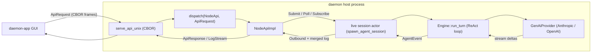

# Daemon GUI-Readiness and Hermes-Agent Parity Roadmap (bottom-up)

> Status: research / audit artifact. No code is changed by this document.
> It is a coverage map and roadmap for connecting `daemon` to a GUI app (`daemon-app`)
> over a Unix socket (FFI/stdio alternatives documented), with the concrete goal of:
> **create/select/edit a profile, open a session, pick `claude-opus-4-8` over Anthropic,
> chat, and render streamed turns.**

## 0. How to read this document

### 0.1 Methodology: bottom-up from `hermes-agent`

The spine of this audit is the **complete `hermes-agent` subsystem inventory** (~116 `agent/`
modules, ~176 `hermes_cli/` modules, 87 `tools/` modules, 28 model-provider plugins, plus the
gateway / cron / kanban / ACP / web surfaces). We start from "what does Hermes actually do",
then for each capability we ask "what must Daemon expose over `NodeApi` / the host to give a GUI
the same behavior", then we record Daemon's current state.

Every capability row has four columns:

1. **Capability** — what Hermes does.
2. **Hermes anchor** — `path:line` in the sibling `daemon-hermes/hermes-agent` tree.
3. **Required Daemon surface** — what a GUI needs over `NodeApi`/host.
4. **Daemon state + gap** — current Rust implementation with anchor, and the gap.

This methodology is deliberate: the three issues raised during planning (live profile/config
control, dynamic model discovery, usage/context/telemetry richness) are **not** special cases —
they are simply the rows in Domain A and Domain D that are `MISSING`/`STUB` today, and they fall
out of the inventory automatically.

Hermes paths are relative to `../../../daemon-hermes/hermes-agent/` (sibling worktree). Daemon
paths are repo-relative and rendered as markdown links.

### 0.2 Status legend and parity tiers

Status: **DONE** (works end to end) · **PARTIAL** (exists but incomplete or not host-visible) ·
**STUB** (placeholder/TODO) · **MISSING** (nothing).

Tiers:

- **D0** — required for the concrete demo (the critical path in §2).
- **P0–P3** — the existing parity-map phases from
  [`hermes-agent-parity-map.md`](../research/hermes/hermes-agent-parity-map.md):
  P0 production survival, P1 long-session coding, P2 ecosystem breadth, P3 long-tail.

### 0.3 Companion documents (the roadmap triangle)

- [`hermes-agent-parity-map.md`](../research/hermes/hermes-agent-parity-map.md) — the runtime parity checklist.
- [`daemon-core-spec.md`](../../crates/engine/daemon-core/docs/daemon-core-spec.md) §22 "Phased roadmap" (line 1666) — engine roadmap on the same tiers.
- [`daemon-core-host-interface.md`](../../crates/engine/daemon-core/docs/daemon-core-host-interface.md) — typed §17 host boundary.
- [`model-management-spec.md`](model-management-spec.md) — local-model (HF/GGUF) management parity bar.

---

## 1. Architecture and transport

### 1.1 The path a GUI drives today

- Unix-socket server: `serve_api_unix` and per-connection `dispatch` —
  [crates/substrate/daemon-host/src/socket.rs](../../crates/substrate/daemon-host/src/socket.rs):17,39.
- Canonical dispatch over the full `NodeApi`:
  [crates/contracts/daemon-api/src/lib.rs](../../crates/contracts/daemon-api/src/lib.rs):849.
- Optional HTTP+SSE/WS mirror for browser-style shells:
  [crates/adapters/daemon-http/src/lib.rs](../../crates/adapters/daemon-http/src/lib.rs):82,104.
- Live session actor and event broadcast:
  [crates/engine/daemon-core/src/actor.rs](../../crates/engine/daemon-core/src/actor.rs):237-370.
- Turn loop: `Engine::run_turn` —
  [crates/engine/daemon-core/src/engine.rs](../../crates/engine/daemon-core/src/engine.rs):603-764.

### 1.2 Transport decision

**Primary: Unix-socket CBOR.** It is the only transport that already reaches the real
`GenAiProvider` (Anthropic included) with the full `NodeApi`. The three control-surface gaps in
this document are transport-independent — they live in `daemon-api` / `daemon-core` / `daemon-host`
— so building them once on the socket path makes them available to every transport later.

Alternatives are documented in §6.

---

## 2. The critical path (D0): the concrete demo, step by step

Each step lists what works and what blocks it today.

### Step 1 — list / create / select / edit a profile

- **Hermes:** profile CRUD is a first-class runtime operation — `create_profile`
  (`hermes-agent/hermes_cli/profiles.py:784`), `delete_profile` (`:1073`), `rename_profile`
  (`:1742`), `set_active_profile` (`:1414`), `list_profiles` (`:716`), plus dashboard REST
  `GET/POST /api/profiles`, `POST /api/profiles/active`, `PATCH/DELETE /api/profiles/{name}`,
  `PUT /api/profiles/{name}/model` (`hermes-agent/hermes_cli/web_server.py:9011-9357`).
- **Daemon:** **MISSING.** There is no profile variant in `ApiRequest`
  ([crates/contracts/daemon-api/src/lib.rs](../../crates/contracts/daemon-api/src/lib.rs):504-718).
  The provider/profile bindings are frozen at startup in `build_providers`
  ([bins/daemon/src/main.rs](../../bins/daemon/src/main.rs):81-147) and a session's provider is a
  frozen registry lookup `provider_for`
  ([crates/node/daemon-node/src/lib.rs](../../crates/node/daemon-node/src/lib.rs):128-132). The
  only runtime knob is env/TOML `DAEMON_PROFILE`
  ([bins/daemon/src/config.rs](../../bins/daemon/src/config.rs):29,578-580).
- **Blocks the demo:** yes — there is no way for a GUI to create or set a profile at runtime.
  Design in §5.1.

### Step 2 — open a session bound to that profile

- **Hermes:** ACP `new_session` / `load_session` / `resume_session`
  (`hermes-agent/acp_adapter/server.py:1109-1209`); the agent is built per session by
  `SessionManager._make_agent` (`hermes-agent/acp_adapter/session.py:558-623`).
- **Daemon:** **DONE** (session core). `Submit` spawns a live session actor; `Poll`/`Subscribe`
  stream it back — handled by `serve_session`/`dispatch`
  ([crates/contracts/daemon-api/src/lib.rs](../../crates/contracts/daemon-api/src/lib.rs):801-845,949-956)
  via `NodeApiImpl`
  ([crates/substrate/daemon-host/src/node_api.rs](../../crates/substrate/daemon-host/src/node_api.rs)).
- **Gap:** the session cannot yet be *bound to a chosen profile at open time* (depends on Step 1).
  No `fork_session`/`list_sessions`-with-cwd.

### Step 3 — discover and select `claude-opus-4-8`, supply an Anthropic key

- **Hermes:** native Anthropic ids include `claude-opus-4-8`
  (`hermes-agent/hermes_cli/models.py:331-342`); model lists are discovered live via
  `provider_model_ids` → Anthropic `GET /v1/models`
  (`hermes-agent/plugins/model-providers/anthropic/__init__.py:16-39`) with a static fallback
  (`hermes-agent/hermes_cli/models.py:1728-1750`); per-session switch via `set_session_model`
  (`hermes-agent/acp_adapter/server.py:1989`); multi-source key resolution in
  `hermes-agent/agent/anthropic_adapter.py:1162-1203`.
- **Daemon:**
  - Model id is a free-form config string; the provider is no longer enumerated daemon-side. The
    wire selector collapsed to `mock | genai | llama_cpp | mistral_rs` (`ProviderSelector`,
    [crates/contracts/daemon-api/src/profile.rs](../../crates/contracts/daemon-api/src/profile.rs)),
    and `genai` infers the adapter (Anthropic/OpenAI/Gemini/Groq/…) from the model id, so
    `claude-opus-4-8` *just works* — `GenAiProvider::for_model`
    ([crates/providers/daemon-providers/src/genai_provider.rs](../../crates/providers/daemon-providers/src/genai_provider.rs)).
    Legacy per-provider profile names (`anthropic`, `openai`, …) deserialize to `genai` via serde
    aliases (wire `v3`).
  - **Dynamic discovery: DONE (genai-native).** `ModelApi::models()` lists networked models live
    from `genai::Client::all_model_names` for every adapter whose key resolves
    (`daemon_providers::genai_listed_models`, namespaced ids), injected into the provider-agnostic
    host via the `CloudCatalog` hook
    ([crates/substrate/daemon-host/src/node_api.rs](../../crates/substrate/daemon-host/src/node_api.rs)),
    with the static catalog as the no-key fallback + pricing/context overlay
    ([crates/contracts/daemon-api/src/profile.rs](../../crates/contracts/daemon-api/src/profile.rs));
    local GGUF models still merge from the `ModelManager` catalog.
  - **Key injection: PARTIAL.** The credential lease feeds `Request.auth`
    ([crates/engine/daemon-core/src/engine.rs](../../crates/engine/daemon-core/src/engine.rs):357-365),
    but the host source is `StubCredentialSource`
    ([crates/substrate/daemon-credentials/src/source.rs](../../crates/substrate/daemon-credentials/src/source.rs))
    and there is no `NodeApi` op to register/rotate a real Anthropic key.
- **Blocks the demo:** model id is trivial (D0); model *picker* and key *registration* require new
  surface (§5.2). For a hardcoded single-key launch, env `ANTHROPIC_API_KEY` + `DAEMON_MODEL`
  suffices to get a first turn.

### Step 4 — send a user message

- **Daemon:** **DONE.** `AgentCommand::StartTurn` via `Submit`; the ReAct loop calls the model and
  runs tools — [crates/engine/daemon-core/src/engine.rs](../../crates/engine/daemon-core/src/engine.rs):603-764.

### Step 5 — render streamed turn events (incl. usage, context fill, cost)

- **Hermes:** streams text/thought/tool chunks plus two usage shapes — ACP `UsageUpdate`
  (context-window `{size, used}`, `hermes-agent/acp_adapter/server.py:661-711`) and per-turn
  `Usage` billing tokens (`hermes-agent/acp_adapter/server.py:1659-1667`); cost via
  `estimate_usage_cost` (`hermes-agent/agent/usage_pricing.py:776`).
- **Daemon:**
  - Event stream **DONE**: `AgentEvent` variants `TurnStarted`/`TextDelta`/`ReasoningDelta`/
    `ToolStarted`/`ToolFinished`/`Usage`/`RateLimit`/`TurnFinished`
    ([crates/contracts/daemon-protocol/src/lib.rs](../../crates/contracts/daemon-protocol/src/lib.rs):230-327),
    delivered as `Outbound` via `Poll`/`Subscribe`.
  - **Usage richness: PARTIAL/MISSING.** `UsageDelta` carries only
    `input_tokens`/`output_tokens`/`api_calls`
    ([crates/contracts/daemon-common/src/lib.rs](../../crates/contracts/daemon-common/src/lib.rs):226-233)
    — no cache/reasoning tokens, no cost, no context-window fill. `TurnSummary.usage` reflects only
    the **last** model call, not the whole turn
    ([crates/engine/daemon-core/src/engine.rs](../../crates/engine/daemon-core/src/engine.rs):793-798).
    Context pressure (`Pressure { used_tokens, budget_tokens }`) is engine-internal
    ([crates/engine/daemon-core/src/context.rs](../../crates/engine/daemon-core/src/context.rs):51-56)
    and never reaches the host.
- **Blocks a *good* demo:** basic turn rendering works; the usage/cost/context HUD a GUI wants
  needs §5.3.

### 2.1 Minimal blocking-gap list for the demo

| # | Gap | Tier | Section |
|---|-----|------|---------|
| 1 | Set/allow `claude-opus-4-8` + supply Anthropic key (env path works; no API to register key) | D0 | §5.2 |
| 2 | Create / select / edit a profile at runtime over `NodeApi` | D0 | §5.1 |
| 3 | Discover model list for the picker (Anthropic `/v1/models` + static fallback) | D0 | §5.2 |
| 4 | Usage richness: cache/reasoning tokens, accumulated turn usage, context-window fill event | D0 | §5.3 |
| 5 | Useful chat tools (web_search, todo, clarify) | P1 | Domain E |

Everything else for a first chat (session lifecycle, streaming, fs/shell tools) is already DONE.

---

## 3. Bottom-up parity matrix

Tables list the consequential rows per domain with anchors. Status as of this audit.

### Domain A — Host / control surface (USER-FLAGGED)

| Capability | Hermes anchor | Required Daemon surface | Daemon state + gap |
|---|---|---|---|
| Session lifecycle | `acp_adapter/server.py:1109-1303` | `Submit`/`Poll`/`Respond`/`Subscribe`/`Sessions`/`Cancel`/`SessionHistory` | DONE — [daemon-api/src/lib.rs](../../crates/contracts/daemon-api/src/lib.rs):504-599,801-845. No fork/list-with-cwd. |
| Profile CRUD (runtime) | `hermes_cli/profiles.py:716,784,1073,1414,1742`; `web_server.py:9011-9357` | `Profile{List,Get,Create,Update,Delete,Select}` ApiRequest variants | **DONE** — `Profile{List,Get,Create,Update,Delete,Select}` over a durable `ProfileStore` ([node_api.rs](../../crates/substrate/daemon-host/src/node_api.rs)); `ProfileUpdate` is the **sole** durable editor (the separate runtime `Config` surface was collapsed in wire v9). Daemon goes beyond hermes (which is clone-only): a profile is **editable** in place. §5.1 |
| Profile distributions (clone/export/import) | `hermes_cli/profiles.py` clone/export/import | `ProfileClone`/`ProfileExport`/`ProfileImport` + `Distribution` | **DONE** — a distribution = the `ProfileSpec` + the profile's **local** skills (bundled reconstituted on import) + manifest; `credential_ref` kept (a name, not a secret). Wire v6 ([daemon-api/src/lib.rs](../../crates/contracts/daemon-api/src/lib.rs); [node_api.rs](../../crates/substrate/daemon-host/src/node_api.rs)). |
| Profile + skill version history (USER-FLAGGED) | hermes profiles are **not** git repos (flat dirs + `distribution.yaml`) | `Profile{History,At,Revert}` / `Skill{History,At,Revert}` over a native revision log | **DONE** — native append-only, content-addressed `RevisionLog` ([daemon-common](../../crates/contracts/daemon-common/src/lib.rs); `FileRevisionLog` [revision.rs](../../crates/substrate/daemon-host/src/revision.rs)) shared by profiles + skills; non-destructive revert ⇒ roll-forward; first-class `Author` provenance (operator vs `agent:skill_manage`). See [host-spec §7.2](daemon-host-spec.md). |
| Config get/set (runtime) | `hermes_cli/config.py:5279,5541,6242`; `web_server.py:3040-3055,3606` | `Config{Get,Set,Schema}` | **REMOVED (folded)** — the runtime `Config` surface was a thin facade over the profile store and is gone (wire v9). Durable edits go through `ProfileUpdate`; transient per-session tweaks go through the new `SetSessionOverlay` (model/provider/tools/approval). §5.1 |
| Model select per session | `acp_adapter/server.py:1989` | `SetSessionModel` / per-session provider override | **DONE** — `SetSessionModel` is now an overlay write: it **persists** the model/provider override on the session's `SessionOverlay` (host-level metadata) and swaps the live actor's provider in place (`Engine::set_provider` + `ActorMsg::SetProvider`). The override is **restored on rehydration** rather than lost on restart. §5.2 |
| Modes / edit-approval policy | `acp_adapter/server.py:2023` | session mode + `HostRequest` approval prompts | **DONE** — `ApprovalPolicy` (`Ask`/`AcceptEdits`/`AutoAllow`/`Deny`) per-session with an `is_sensitive_path` carve-out; fs + shell edit gates; `SetSessionMode`/`ApprovalMode` now **persist** on the `SessionOverlay` and apply to the live `ParkingHandler` (auto-allow/deny vs park), restored on rehydration. Autonomous durable engines default `AutoAllow`. |
| Auth / credential registration | `agent/anthropic_adapter.py:1162-1203`; `acp_adapter/server.py:895`, `acp_adapter/auth.py:41` | `Credential{Set,List,Remove}` + lease | PARTIAL — lease→`Request.auth` ([engine.rs:357](../../crates/engine/daemon-core/src/engine.rs)); host source is stub ([source.rs](../../crates/substrate/daemon-credentials/src/source.rs)); no register API. §5.2 |
| Advertise commands | `acp_adapter/server.py:1692` | push `AvailableCommands` event | MISSING. |

### Domain B — Conversation engine

| Capability | Hermes anchor | Daemon state + gap |
|---|---|---|
| Per-turn ReAct loop | `agent/conversation_loop.py:469` | DONE — `Engine::run_turn` ([engine.rs:603-764](../../crates/engine/daemon-core/src/engine.rs)). |
| Prompt assembly + Anthropic prompt caching | `agent/system_prompt.py:387`; `agent/prompt_caching.py:49` | PARTIAL — `SystemPrompt` is text-only ([conversation.rs:12-23](../../crates/engine/daemon-core/src/conversation.rs)); no cache-control breakpoints. P1. |
| Message sanitization / repair | `agent/message_sanitization.py`; `agent/agent_runtime_helpers.py:347` | PARTIAL — tool-arg repair in pipeline ([tool_pipeline.rs:27-41](../../crates/engine/daemon-core/src/tool_pipeline.rs)); no full message-sequence repair. P0/P1. |
| Recovery / retry / error classification | `agent/error_classifier.py:441`; `agent/retry_utils.py` | DONE/PARTIAL — `recovery.rs` + §8 failure taxonomy; provider fallback hop ([engine.rs:401-409](../../crates/engine/daemon-core/src/engine.rs)). |
| Streaming `<think>` scrubber | `agent/think_scrubber.py` | PARTIAL — `ReasoningDelta` exists; no stateful scrubber for inline models. |

### Domain C — Providers & models (USER-FLAGGED for discovery)

| Capability | Hermes anchor | Daemon state + gap |
|---|---|---|
| Provider abstraction + transports | `providers/base.py`; `agent/transports/*` | PARTIAL — `Provider` trait + `GenAiProvider`/`LocalProvider` ([provider.rs:252-306](../../crates/engine/daemon-core/src/provider.rs)); ~3 families vs 28 Hermes plugins. P2/P3 breadth. |
| Anthropic + Opus 4.8 | `hermes_cli/models.py:331-342` | D0 — free-form id works; default is `claude-3-5-sonnet-latest` ([config.rs:631-633](../../bins/daemon/src/config.rs)). |
| Dynamic model discovery (live `/v1/models` + fallback) | `hermes_cli/models.py:1728-1750,2175`; `providers/base.py:162`; `plugins/model-providers/anthropic/__init__.py:16-39` | **MISSING** — `ModelApi` HF/local only ([daemon-models/src/lib.rs:1-9](../../crates/providers/daemon-models/src/lib.rs)); no list-models on `Provider`/`GenAiProvider`. §5.2 |
| Model metadata (context length, pricing, capabilities) | `agent/model_metadata.py:191`; `agent/models_dev.py`; `hermes_cli/inventory.py:111` | MISSING — `capabilities().max_context` always `None` ([genai_provider.rs:294-301](../../crates/providers/daemon-providers/src/genai_provider.rs)). §5.2/§5.3 |
| Fallback chain + credential pool | `agent/credential_pool.py:449`; `hermes_cli/fallback_config.py` | MISSING — single frozen profile lookup. P2. |
| Local inference (GGUF worker) | n/a (Hermes uses Ollama/LM Studio) | DONE — `daemon-infer` + `SwitchableLocalProvider` ([local.rs:117-145,568-666](../../crates/providers/daemon-providers/src/local.rs)). |

### Domain D — Usage / cost / context / telemetry (USER-FLAGGED)

| Capability | Hermes anchor | Daemon state + gap |
|---|---|---|
| Canonical per-call usage (incl. cache/reasoning) | `agent/usage_pricing.py:30-46,703` | PARTIAL — `UsageDelta` lacks cache/reasoning ([daemon-common:226-233](../../crates/contracts/daemon-common/src/lib.rs)). §5.3 |
| Cost estimation | `agent/usage_pricing.py:776` | **MISSING** — no pricing tables, no cost field. §5.3 |
| Turn/session usage accumulation | `agent/conversation_loop.py:1808-1839`; `agent/turn_finalizer.py:326-354` | PARTIAL — `TurnSummary.usage` = last call only ([engine.rs:793-798](../../crates/engine/daemon-core/src/engine.rs)). §5.3 |
| Context-window pressure → UI | `acp_adapter/server.py:661-711`; `agent/context_compressor.py:712-835` | **MISSING over NodeApi** — `Pressure` engine-internal ([context.rs:51-56](../../crates/engine/daemon-core/src/context.rs)); `context_budget_tokens` marked "not yet enforced" ([config.rs:39-41](../../crates/engine/daemon-core/src/config.rs)) though compaction uses it ([engine.rs:527-543](../../crates/engine/daemon-core/src/engine.rs)). §5.3 |
| Compression events | `agent/conversation_compression.py:48` | MISSING — no compaction event on the §17 stream. |
| Iteration budget | `agent/iteration_budget.py:17` | PARTIAL — enforced internally (`max_iterations`, [config.rs:35-58](../../crates/engine/daemon-core/src/config.rs)); not surfaced. |
| Rate limits | `agent/rate_limit_tracker.py` | DONE — `AgentEvent::RateLimit` + `RateLimitSnapshot` ([daemon-protocol:289-294](../../crates/contracts/daemon-protocol/src/lib.rs); [daemon-common:247-254](../../crates/contracts/daemon-common/src/lib.rs)). |
| Session stats / analytics | `hermes_state.py:514-542`; `web_server.py:9878` | MISSING — `StatsReport` is queue/session counts only ([daemon-api:366-376](../../crates/contracts/daemon-api/src/lib.rs)); `daemon-telemetry` `Metrics`/`Dump` not exposed over `NodeApi` ([metrics.rs:28-37,58-105](../../crates/substrate/daemon-telemetry/src/metrics.rs)). §5.3 |

### Domain E — Tools

| Capability | Hermes anchor | Daemon state + gap |
|---|---|---|
| Tool registry + dispatch | `tools/registry.py`; `model_tools.py:876` | DONE — `ToolRegistry` + `run_tool` ([tools.rs:60-108](../../crates/engine/daemon-core/src/tools.rs)). |
| Tool executor (sequential / parallel) | `agent/tool_executor.py:243,770` | PARTIAL — sequential only; parallel batch deferred ([tool_pipeline.rs:12-15](../../crates/engine/daemon-core/src/tool_pipeline.rs)). P1. |
| Loop guardrails | `agent/tool_guardrails.py:224` | MISSING — no duplicate-call guardrail. |
| Core tools (fs/shell) | `tools/file_tools.py`; `tools/terminal_tool.py` | DONE — `fs`/`shell` with workspace containment ([daemon-tool-fs](../../tools/daemon-tool-fs/src/lib.rs):71-161; [daemon-tool-shell](../../tools/daemon-tool-shell/src/lib.rs):74-151). |
| Web / browser / vision / todo / clarify | `tools/web_tools.py`, `browser_tool.py`, `vision_tools.py`, `todo_tool.py`, `clarify_tool.py` | MISSING — no web_search/web_extract/browser/vision/todo/clarify. `tkx` is a STUB ([daemon-tool-tkx:5](../../tools/daemon-tool-tkx/src/lib.rs)). P1–P3. |
| Approval + checkpoints + tool-search | `tools/approval.py`; `tools/checkpoint_manager.py`; `tools/tool_search.py` | DONE — shell + fs edit approval (policy-gated, durable HITL park→decide→resume); **checkpoints/rewind** (`Tool::mutates()` hint, git-first/snapshot-fallback `CheckpointStore` over the exec root, `run_tool` checkpoint stage, `Checkpoint{List,Rewind}` `ControlApi` family + ledger, wire v9 — [checkpoint.rs](../../crates/engine/daemon-core/src/checkpoint.rs)); **tool-search** progressive disclosure (`ToolRegistry` core/deferrable split + `tool_search`/`tool_describe`/`tool_call` bridge tools, byte-threshold collapse in `Engine::tool_defs` — [tools.rs](../../crates/engine/daemon-core/src/tools.rs), [tool_pipeline.rs](../../crates/engine/daemon-core/src/tool_pipeline.rs)). |
| External tool breadth (MCP client) | `mcp/` clients | DONE — `daemon-mcp-client` registers external MCP servers' tools through the `ToolProvider` seam (rmcp; stdio child-process + streamable-HTTP; namespaced `mcp__{server}__{tool}`, untrusted-fenced; lazy connect + reconnect), wired via the `[mcp]` config block ([daemon-mcp-client](../../crates/adapters/daemon-mcp-client/src/lib.rs)). MCP *server* adapter deferred (P4). |
| Delegation tool | `tools/delegate_tool.py:3086` | DONE — `orchestrate` ([daemon-tool-orchestrate](../../tools/daemon-tool-orchestrate/src/lib.rs):103-158). |

### Domain F — Context & memory

| Capability | Hermes anchor | Daemon state + gap |
|---|---|---|
| Context engine / compression | `agent/context_compressor.py:593` | PARTIAL/landed — LCM port `daemon-context-lcm`, 7 `lcm_*` tools ([tools/mod.rs:24-93](../../crates/engine/daemon-context-lcm/src/tools/mod.rs)). |
| Long-term memory | `agent/memory_manager.py`; `tools/memory_tool.py:795` | PARTIAL — `daemon-mnemosyne` P0/P1/**P2 done** (typed-memory classifier, Weibull recall blend, synonyms, query-intent, 5-tier query cache, opt-in enhanced + polyphonic recall, rule-based gists, tier-2 LLM conflict detector, fuzzy entity-similarity injection — [engine.rs](../../crates/memory/daemon-mnemosyne/src/engine.rs), [port-spec §15](../../crates/engine/daemon-core/docs/mnemosyne-rust-port-spec.md)); ~20 `mnemosyne_*` tools ([tools.rs:28-170](../../crates/memory/daemon-mnemosyne/src/tools.rs)). P3 ecosystem (sync/streaming, SHMR, patterns, plugins, local-GGUF) remains. |
| Background memory write/review | `agent/background_review.py:675` | MISSING. P2. |

### Domain G — Skills

| Capability | Hermes anchor | Daemon state + gap |
|---|---|---|
| SKILL.md discovery + progressive-disclosure index | `agent/skill_utils.py`; `agent/prompt_builder.py:1127` | DONE — `daemon-skills` (`SkillStore::discover`/`render_index`) + `SkillsPromptSource` folds the cache-stable index into the stable system-prompt tier via `EngineProfile::with_prompt_block` ([daemon-skills/src/lib.rs](../../crates/skills/daemon-skills/src/lib.rs)). |
| `skill_view` (full body + linked files) | `tools/skills_tool.py` | DONE — `skill_view(name, file_path?)` ([daemon-tool-skill/src/lib.rs](../../tools/daemon-tool-skill/src/lib.rs)). |
| `skills_list` | `tools/skills_tool.py` | DONE — `skills_list`. |
| `skill_manage` (create/edit/patch/delete/write_file/remove_file) | `tools/skill_manager_tool.py:1217` | DONE — `skill_manage` (all six actions) writing the local skills dir, invalidating the index cache on write. |
| Background review fork | `agent/background_review.py:675` | DONE — engine-native `Effect::Spawn` → attached, self-closing `skill_review` background child (counter-triggered via `skill_review_interval`); see [daemon-core-spec](../../crates/engine/daemon-core/docs/daemon-core-spec.md) §4.6 + [daemon-host-spec](daemon-host-spec.md) §7. Opt-in (interval `0` by default). |
| Bundled default skills | `skills/` (73, auto-synced by `tools/skills_sync.py`); `get_bundled_skills_dir` | PARTIAL (curated) — daemon embeds + seeds a **portable subset** on first run (see *Bundled-skills delta* below). |
| Skill version history + revert | (hermes has none — flat dirs) | `Skill{History,At,Revert}` over the shared revision log | **DONE** — every `skill_manage` write (incl. the agent's background-review edits) records a `SkillBundle` snapshot in the native `RevisionLog`; non-destructive revert + roll-forward; binary-bundled skills are read-only (revert rejected). Wire v6. See [host-spec §7.2](daemon-host-spec.md). |
| Per-profile (per-agent) skill libraries | `agent/skill_utils.py` (per-agent skills dir) | **DONE** — skills are resolved *per profile* like memory/context, not built once over the launch agent: `SkillsProvider::for_profile(id)` yields each agent's `Arc<SkillStore>` rooted at `<data_dir>/<id>/skills` (seeded + revision-logged), and `daemon-node`'s `SkillsResolver` seam registers each session's own `skill_*` tools + index in `resolve_effective` (allowlist-gated). A profile distribution carries + reconstitutes that profile's own local skills. See [daemon-skills/src/lib.rs](../../crates/skills/daemon-skills/src/lib.rs). |
| Curator lifecycle (usage telemetry, archival, provenance) | `agent/curator.py:198`; `tools/skill_usage.py`; `tools/skill_provenance.py` | **DONE** — provenance via the revision log's `Author` *and* the per-profile `.usage.json` sidecar (`SkillUsageLog`/`FileSkillUsageLog`: view/use/patch counts, `created_by` agent/user/bundled, `pinned`, lifecycle state). Deterministic curator (`apply_automatic_transitions`: idle→stale→archive, reactivate, skip pinned/user/bundled) + physical `archive`/`restore` to `.archive/` with revision provenance. Operator surface `Curator{List,Pin,Unpin,Archive,Restore,Run}` (per profile, `daemon-cli curator …`). Wire v12. LLM-consolidation fork remains P3. |
| Hub install + slash-commands + `--skills` preload + skill bundles | `tools/skills_hub.py`; `agent/skill_commands.py`; `agent/skill_bundles.py` | MISSING. P3 — no remote hub, `/skill` slash, CLI preload, or YAML skill-bundles. |
| Conditional/environment/platform gating + external dirs | `agent/skill_utils.py:128-269,478-492` | MISSING — daemon renders the index unconditionally (no `platforms`/`environments`/`requires_toolsets` filtering, no `skills.external_dirs`). P3. |

**Bundled-skills delta (what daemon ships vs hermes' 73).** Hermes auto-syncs **all 73** skills under
`skills/` into the active profile and offers ~100 more under `optional-skills/` via the hub. Daemon
deliberately bundles only a **curated, tool-agnostic subset** (`crates/skills/daemon-skills/bundled/`,
embedded via `include_dir` and seeded by `SkillStore::seed_bundled`, ~412 KB), because most hermes
bundled skills are integrations against tools daemon does not host. What daemon ships today:

- **software-development** (methodology, no tool deps): `plan`, `systematic-debugging`,
  `test-driven-development`, `spike`, `simplify-code`, `requesting-code-review`.
- **creative**: `design-md` (+ `templates/starter.md`).
- **research**: `research-paper-writing` (SKILL.md + `references/` only — the heavy LaTeX/PDF
  `templates/` are dropped).

Excluded (and why), tracked here so the gap is explicit:

- **Tool-bound integrations** (~50 skills): `apple/*` (notes, imessage, findmy, macos-computer-use),
  `email/himalaya`, `github/*`, `productivity/*` (notion, airtable, google-workspace, powerpoint…),
  `note-taking/obsidian`, `smart-home/openhue`, `social-media/xurl`, `media/*`, `mlops/*` — each
  needs a CLI/MCP/credential that daemon does not yet wire. Re-bundle per-skill as the matching tool
  lands.
- **Hermes-internal** skills: `devops/kanban-*`, `dogfood`, `yuanbao`, `autonomous-ai-agents/*`,
  `software-development/hermes-agent-skill-authoring` (hardcodes `/home/bb/hermes-agent` paths) — not
  portable; a daemon-native skill-authoring guide should replace the last one.
- **All `optional-skills/`** (~100): out of scope by hermes' own design (hub-install only, never
  auto-synced).
- **Heavy assets**: `research-paper-writing/templates/` (LaTeX + PDFs, ~1.4 MB) and
  `productivity/powerpoint` OOXML schemas are excluded to keep the embedded bundle small.

### Domain H — Sessions & persistence

| Capability | Hermes anchor | Daemon state + gap |
|---|---|---|
| Session store (messages, FTS, token columns) | `hermes_state.py:657,514-542` | PARTIAL — `daemon-store` InMemory/SQLite ([daemon-store/src/lib.rs:286,477](../../crates/substrate/daemon-store/src/lib.rs)); no FTS / token columns. P1. |
| History replay on load/resume | `acp_adapter/server.py:1019-1107` | DONE — `session_history` / `log_after` ([daemon-api:570-587](../../crates/contracts/daemon-api/src/lib.rs)). |
| Titles / search / goals / recap | `agent/title_generator.py`; `tools/session_search_tool.py`; `hermes_cli/goals.py`; `hermes_cli/session_recap.py` | MISSING. P2/P3. |

### Domain I — Delegation & orchestration

| Capability | Hermes anchor | Daemon state + gap |
|---|---|---|
| Subagent delegation (sync/parallel, depth) | `tools/delegate_tool.py:3086` | DONE/PARTIAL — `orchestrate` tool + durable fleet (`FleetJobWorker`, [daemon-node:449-476](../../crates/node/daemon-node/src/lib.rs)); durable HITL now parks an `Ask` edit-approval (`DelegateResolver` returns `Deferred`, the activation layer routes `Step::ParkApproval` to `park_approval`, `ApprovalDecide` wakes it). |
| Fleet tree / supervision | n/a (Hermes flat) | DONE+ (beyond Hermes) — `Tree`/`Fleet`/`Unit` ([daemon-api:547-568](../../crates/contracts/daemon-api/src/lib.rs)). |

### Domain J — Out-of-core ecosystem (SCOPED OUT, documented)

These are deliberately **not** part of the core/GUI parity goal; Daemon's design rejects porting
the gateway monolith ([daemon-event-io-spec](../../crates/engine/daemon-core/docs/daemon-event-io-spec.md) §0.1)
and treats breadth as an MCP/edge concern.

| Subsystem | Hermes anchor | Daemon position |
|---|---|---|
| Messaging gateway + ~25 platform adapters | `gateway/run.py`; `gateway/platforms/*` | OUT — not in core; future edge adapters over `NodeApi`. |
| Cron / scheduler / blueprints | `cron/scheduler.py`; `cron/jobs.py` | OUT — host activation layer is the durable substrate, not a cron port. |
| Kanban multi-agent board | `hermes_cli/kanban_db.py`; `tools/kanban_tools.py` | OUT — fleet/orchestrator is the Daemon analogue. |
| General plugin system | `hermes_cli/plugins.py` | OUT — PyO3 / MCP seam ([daemon-core-spec](../../crates/engine/daemon-core/docs/daemon-core-spec.md) §18). |
| MCP client/server | `tools/mcp_tool.py`; `mcp_serve.py` | DEFERRED — intended breadth seam (client = `ToolProvider`, server = host adapter). |
| Voice / computer-use / image+video gen | `tools/voice_mode.py`; `tools/computer_use_tool.py`; `tools/image_generation_tool.py` | OUT — P3 long-tail. |

---

## 4. Daemon `NodeApi` surface as it stands (reference)

The canonical wire types a GUI talks to:

- `ApiRequest` — 37 variants ([daemon-api:504-718](../../crates/contracts/daemon-api/src/lib.rs)):
  session (`Submit`/`Poll`/`Respond`/`SessionHistory`/`Subscribe`/`DeliveryTargets`/`Handover`/
  `RecordMeta`), control (`Health`/`Stats`/`Sessions`/`Assign`/`Cancel`/`Fleet`/`Tree`/`Unit`/
  `UnitEvents`/`UnitOutbound`/`UnitHistory`/`Pause`/`Resume`/`Scale`/`VerifyingKey`), and model
  (`Model*`, 14 variants — HF/local only).
- `ApiResponse` — 23 variants ([daemon-api:722-769](../../crates/contracts/daemon-api/src/lib.rs)).
- Traits: `SessionApi` ([:51-141](../../crates/contracts/daemon-api/src/lib.rs)),
  `ControlApi` ([:145-223](../../crates/contracts/daemon-api/src/lib.rs)),
  `ModelApi` ([:234-325](../../crates/contracts/daemon-api/src/lib.rs)),
  `NodeApi = SessionApi + ControlApi + ModelApi` ([:328-329](../../crates/contracts/daemon-api/src/lib.rs)).

**There is no profile, config, credential, or cloud-model-discovery family.** That is the heart of
the three deep dives.

---

## 5. Three design-level deep dives (user-flagged)

### 5.1 Profile & config as a live `NodeApi` surface

**Problem.** Profiles, the active model, and the provider are all construction-time: `NodeConfig`
([config.rs:323-378](../../bins/daemon/src/config.rs)) + `NodeAssembly`
([daemon-node:45-91](../../crates/node/daemon-node/src/lib.rs)), with a `ProviderRegistry` frozen by
`build_providers` ([main.rs:81-147](../../bins/daemon/src/main.rs)) and a per-session frozen lookup
`provider_for` ([daemon-node:128-132](../../crates/node/daemon-node/src/lib.rs)). A GUI cannot
create, select, or edit a profile.

**Hermes shape to match.** A profile is an isolated home with `config.yaml` + `.env` + `SOUL.md` +
skills; CRUD lives in `hermes_cli/profiles.py` and is exposed over REST in `web_server.py`. Config
read/write is `load_config`/`save_config`/`set_config_value` with a typed schema endpoint.

**Proposal (sketch).**

1. New `ApiRequest`/`ApiResponse` families and a `ProfileApi` trait:
   - `ProfileList`, `ProfileGet { name }`, `ProfileCreate { name, base?, spec }`,
     `ProfileUpdate { name, spec }`, `ProfileDelete { name }`, `ProfileSelect { session?, name }`.
   - `SetSessionOverlay { session, overlay }` for transient per-session tweaks (model / provider /
     tool allowlist / approval mode). *(The earlier `ConfigGet`/`ConfigSet`/`ConfigSchema` runtime
     surface was collapsed in wire v9: it duplicated the profile store. `ProfileUpdate` is the sole
     durable editor; the persisted `SessionOverlay` carries the per-session, non-durable overrides.)*
   A `ProfileSpec` mirrors the union of `NodeConfig` provider/model/credential fields plus the
   engine `Config` tunables and a system-prompt/persona slot (the analogue of `SOUL.md`, replacing
   the hardcoded prompts in `assemble`, [daemon-node:167-228](../../crates/node/daemon-node/src/lib.rs)).
2. Make provider selection dynamic: either make `ProviderRegistry` mutable behind the host lock, or
   resolve a **per-session provider override** at `spawn_agent_session`
   ([actor.rs:237](../../crates/engine/daemon-core/src/actor.rs)) from the selected profile, so a
   new session binds to the chosen profile/model without restarting the node.
3. Persist profiles under the data-root (`<data_dir>/<profile>/`, already used for LCM/Mnemosyne,
   [main.rs:176-184](../../bins/daemon/src/main.rs)), so they survive restarts like `HERMES_HOME`.
4. Credentials register through the same surface (see §5.2) keyed by profile.

**Minimal D0 slice.** `ProfileCreate` + `ProfileSelect`-at-open + `SetSessionOverlay{model, provider}`
— enough for the GUI to make an Anthropic/Opus profile and open a session on it.

### 5.2 Dynamic model discovery (cloud + local, unified)

**Problem.** `ModelApi` only covers HF/GGUF local models; cloud model lists are invisible to the
GUI; the active cloud model is just `NodeConfig.model`.

**Hermes shape to match.** `curated_models_for_provider` → live `provider_model_ids`
(Anthropic/OpenAI `/v1/models`) with a static `_PROVIDER_MODELS` fallback, enriched by
context-length/pricing/capabilities (`hermes_cli/inventory.py:build_models_payload`).

**Proposal (sketch).**

1. Add a catalog capability to the provider layer — either a new method on the `Provider` trait or
   a sibling `ProviderCatalog` trait — so `GenAiProvider` can fetch Anthropic/OpenAI `/v1/models`
   ([genai_provider.rs:67-70](../../crates/providers/daemon-providers/src/genai_provider.rs)). Ship
   a static fallback table (Opus/Sonnet/Haiku ids, mirroring `hermes_cli/models.py:331-342`).
2. Extend `ModelApi` with a unified `models()` (cloud discovery + local
   `ModelManager::catalog()`, [manager.rs:250-273](../../crates/providers/daemon-models/src/manager.rs))
   and `model_current { profile }`, returning entries with
   `{ id, provider, context_length, pricing?, capabilities? }`.
3. Populate `Capabilities.max_context` so the context-fill HUD (§5.3) has a denominator
   ([genai_provider.rs:294-301](../../crates/providers/daemon-providers/src/genai_provider.rs)).
4. Pair with `ProfileSelect`/`SetSessionModel` from §5.1 so the picker actually switches the model.

**Minimal D0 slice.** Anthropic `/v1/models` fetch + static fallback + `models()` over `NodeApi`.

### 5.3 Usage / context / telemetry streaming

**Problem.** `UsageDelta` is tokens+calls only; `TurnSummary.usage` is last-call-only; context
pressure and telemetry never reach the host.

**Hermes shape to match.** Canonical usage (input/output/cache_read/cache_write/reasoning), cost,
per-turn and per-session accumulation, ACP `UsageUpdate {size, used}` for context fill, plus
analytics.

**Proposal (sketch).**

1. Extend `UsageDelta` ([daemon-common:226-233](../../crates/contracts/daemon-common/src/lib.rs))
   with `cache_read_tokens`, `cache_write_tokens`, `reasoning_tokens`, and an optional
   `cost_micros`. Keep `add()` additive so the supervision-tree fold still holds. Map fields 1:1 to
   Hermes `CanonicalUsage` (`agent/usage_pricing.py:30-46`).
2. Accumulate per-turn: make `complete()` fold every iteration's `out.usage` into
   `TurnSummary.usage` instead of taking the last
   ([engine.rs:793-798](../../crates/engine/daemon-core/src/engine.rs)).
3. Add a context-pressure event: surface `Pressure { used_tokens, budget_tokens }`
   ([context.rs:51-56](../../crates/engine/daemon-core/src/context.rs)) and a `compaction` marker as
   an `AgentEvent` (new variant) so the GUI can render a context-fill bar and "compacting" state —
   matching Hermes ACP `UsageUpdate` + the `COMPACTION_STATUS` marker.
4. Cost: add a small pricing table (per-model input/output/cache rates) and compute `cost_micros`
   from accumulated usage, mirroring `estimate_usage_cost` (`agent/usage_pricing.py:776`).
5. Expose telemetry: add a `NodeApi` op returning `daemon-telemetry::Dump`
   ([metrics.rs:28-37](../../crates/substrate/daemon-telemetry/src/metrics.rs)) and enrich
   `StatsReport` ([daemon-api:366-376](../../crates/contracts/daemon-api/src/lib.rs)) with folded
   usage, so a GUI can show session/fleet totals (Hermes `/api/analytics/usage`).

**Minimal D0 slice.** Add cache/reasoning to `UsageDelta`, accumulate `TurnSummary.usage`, and emit
a context-fill event; cost and analytics are P1.

---

## 6. Transport alternatives (documented, not primary)

### 6.1 (B) Session-only C FFI — `bindings/daemon-core-ffi`

Working poll loop end to end (`daemon_session_open/submit/poll/respond`,
[lib.rs:179-346](../../bindings/daemon-core-ffi/src/lib.rs)) but the engine is hardcoded to
`MockProvider` with an embedded credential pool and no journal
([lib.rs:493-510](../../bindings/daemon-core-ffi/src/lib.rs)). Unknown `AgentCommand` variants
return `Unsupported` ([:668](../../bindings/daemon-core-ffi/src/lib.rs)).

**Missing for the demo:** a C ABI to inject a real provider + Anthropic credentials + config. Effort:
medium (add provider/credential constructors to the FFI, reuse §5.1/§5.2 once they exist).

### 6.2 (C) Full-host C FFI — `bindings/daemon-ffi`

A doc-comment TODO with no `extern "C"` functions
([lib.rs:11-12](../../bindings/daemon-ffi/src/lib.rs)). To embed the durable `NodeApi` in-process a
GUI would need the entire opaque-handle + CBOR message-pump surface built out. Effort: large.
Recommended only after the socket path and §5 surfaces stabilize, per
[daemon-ffi-spec.md](daemon-ffi-spec.md).

### 6.3 (D) stdio JSON-RPC / ACP-server (Daemon-as-agent)

Does not exist. Today `daemon-acp` is an ACP **client** that bridges *external* ACP agents into the
fleet ([daemon-acp/src/lib.rs:1-17](../../crates/adapters/daemon-acp/src/lib.rs)). To let an
editor/GUI attach to Daemon over stdio we would build the mirror of Hermes
`acp_adapter/server.py` (initialize/new_session/prompt/cancel/set_session_model/...). This is the
natural home for the §5.1/§5.2 control ops if/when a JSON-RPC surface is wanted. Effort: large; do
after the socket `NodeApi` extensions land so there is one source of truth to project.

---

## 7. Critical-path roadmap (ordered)

| Order | Task | Tier | Anchors |
|---|---|---|---|
| 1 | Allow `claude-opus-4-8` + real Anthropic key (env path now; `Credential*` API next) | D0 | [config.rs:629-638](../../bins/daemon/src/config.rs); [engine.rs:357-365](../../crates/engine/daemon-core/src/engine.rs) |
| 2 | Profile create/select/edit over `NodeApi` (§5.1 minimal slice) | D0 | [daemon-api:504-718](../../crates/contracts/daemon-api/src/lib.rs); [daemon-node:128-132](../../crates/node/daemon-node/src/lib.rs) |
| 3 | Per-session model selection (`SetSessionModel`) + dynamic model list (§5.2 minimal slice) | D0 | [genai_provider.rs:67-70,294-301](../../crates/providers/daemon-providers/src/genai_provider.rs) |
| 4 | Usage richness for rendering (§5.3 minimal slice) | D0 | [daemon-common:226-233](../../crates/contracts/daemon-common/src/lib.rs); [engine.rs:793-798](../../crates/engine/daemon-core/src/engine.rs); [context.rs:51-56](../../crates/engine/daemon-core/src/context.rs) |
| 5 | Chat-useful tools: web_search/web_extract, todo, clarify | P1 | Domain E; [daemon-tool-tkx:5](../../tools/daemon-tool-tkx/src/lib.rs) |
| 6 | Credential registration API + cost/analytics + context-fill bar (full §5.2/§5.3) | P1 | [source.rs](../../crates/substrate/daemon-credentials/src/source.rs); [metrics.rs:28-37](../../crates/substrate/daemon-telemetry/src/metrics.rs) |

After tasks 1–4 the demo (profile → session → Opus 4.8 → chat → rendered turns with a usage HUD) is
achievable on the Unix-socket path, and the same surface backs FFI/ACP later.

---

## 8. Full-parity appendix (P0–P3)

Keyed to the `hermes-agent` subsystem checklist; each line is tagged with status + tier and maps to
the parity-map. Use this as the long-horizon backlog after the D0 demo.

**P0 — production survival** (mostly DONE in `daemon-core`):
- ReAct loop, effects, recovery/retry, failure taxonomy, shell approval, path safety, result-byte
  budget — DONE ([daemon-core-spec](../../crates/engine/daemon-core/docs/daemon-core-spec.md) §22 "Landed so far", line 1671).
- Message-sequence repair (Domain B), tool loop guardrails (Domain E) — PARTIAL/MISSING.

**P1 — long-session coding:**
- SQLite session store with FTS + token columns (Domain H) — PARTIAL.
- Anthropic prompt caching (Domain B) — PARTIAL.
- Parallel tool batch (Domain E) — MISSING.
- Cost + analytics + context-fill HUD (Domain D, §5.3) — MISSING.
- Web/todo/clarify tools (Domain E) — MISSING.

**P2 — ecosystem breadth:**
- Provider breadth + credential pool + fallback (Domain C) — MISSING.
- Skills subsystem: discovery, index, `skill_view`/`skills_list`/`skill_manage`, background review,
  curated bundled-skill seeding, **per-profile (per-agent) skill libraries**, and the **curator
  lifecycle** (usage `.usage.json` sidecar, stale/archive/reactivate, pin, `Curator*` operator surface,
  wire v12) (Domains F/G) — DONE (`daemon-skills` + `daemon-tool-skill` + the `SkillsProvider`/
  `SkillsResolver` seam + engine-native `Effect::Spawn`); hub / slash-commands / conditional gating +
  LLM-consolidation remain P3 (see Domain G).
- Profiles-as-environments: clone/export/distributions + profile/skill version history (Domain A) —
  DONE (wire v6: `ProfileClone`/`ProfileExport`/`ProfileImport` + the native `RevisionLog` shared by
  profiles and skills; non-destructive revert / roll-forward; operator-vs-agent provenance).

**P3 — long tail:**
- Curator *hub / slash-commands / conditional gating / LLM-consolidation* (Domain G — the deterministic
  curator + usage + per-profile libraries landed in P2), titles/search/goals/recap (Domain H),
  gateway/cron/kanban/voice/computer-use/image+video (Domain J) — MISSING / scoped out.

Cross-references: [`hermes-agent-parity-map.md`](../research/hermes/hermes-agent-parity-map.md),
[`daemon-core-spec.md`](../../crates/engine/daemon-core/docs/daemon-core-spec.md) §22 (line 1666),
and the `daemon-hermes/implementation-plan.md` build phasing.

---

## 9. Doc-hygiene findings

- **Cross-links OK (correction).** `docs/research/hermes/` is present and populated (including
  [`hermes-agent-parity-map.md`](../research/hermes/hermes-agent-parity-map.md)); the relative
  links from [daemon-core-spec.md](../../crates/engine/daemon-core/docs/daemon-core-spec.md):67,121
  resolve. (An earlier audit snapshot saw this directory empty before the files were committed.)
- **Stale provider note.** [daemon-host-spec.md](daemon-host-spec.md) §7 still says the provider is
  "deterministic" and networked model I/O is "deferred"; this contradicts the landed `GenAiProvider`
  (Anthropic/OpenAI streaming). Worth a one-line update when next editing that spec.
- **`context_budget_tokens` comment.** [config.rs:39-41](../../crates/engine/daemon-core/src/config.rs)
  says "not yet enforced", but compaction hooks do consume it
  ([engine.rs:527-543](../../crates/engine/daemon-core/src/engine.rs)); the comment understates
  current behavior.

## 10. Out of scope

No code changes and no GUI work are performed by this document. It is the readiness map that should
precede both the `NodeApi` extensions in §5 and the GUI build.
