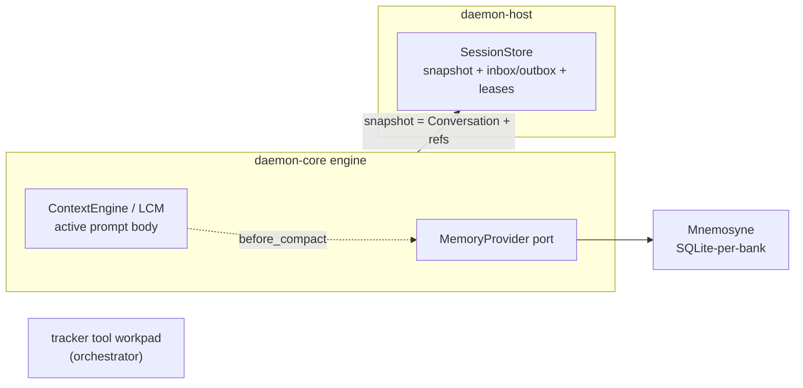

# Daemon Lifecycle and Persistence

The cross-cutting decision record for how a `daemon-core` engine — and therefore every node in the
tree, since an orchestrator is itself an engine ([`daemon-orchestration-synthesis.md`](../research/daemon-orchestration-synthesis.md)
§4.1) — is **suspended (dehydrated), kept durable, and reactivated (rehydrated)**. `daemon-core`,
`daemon-supervision` (the management protocol), and `daemon-host` all depend on this contract.

It builds directly on:

- [`rust-substrate-evaluation.md`](rust-substrate-evaluation.md) — the substrate verdict (Tokio + a durable activation layer; no actor framework owns the lifecycle).
- [`kameo-dehytration.md`](../research/kameo-dehytration.md) — the passivation analysis and the gotchas baked in below.
- [`daemon-core-spec.md`](../../crates/engine/daemon-core/docs/daemon-core-spec.md) §6 (serialization), §14 (`SessionStore`), §16 (delegation/processes), §17 (host protocol).

---

## 1. Two principles

### 1.1 The system models a generic serializable engine, not tickets

The daemon system has **no concept of a ticket, an issue, or a "delegation-as-sub-run."** Work
tracking is an *agent tool* (e.g. `tkx`, which persists itself in git); the orchestrator-agent
manages it through its toolset. The system's only durable-state concern is **generic engine
serialization**: any engine can be reduced to a snapshot, dropped from memory, and reconstructed.

### 1.2 Tools own their own state; the engine snapshot owns only conversation + references

> **A snapshot contains serializable engine state only — never tool state, never live runtime
> resources.** Tools persist their own state in their own backends and re-read it on rehydration.
> The snapshot carries only the *references* needed to re-establish tool handles.

This is the single rule that makes dehydration tractable and recursive.

---

## 2. The snapshot contract

```rust
/// The complete, serializable state of one engine incarnation. Nothing else is durable.
struct Snapshot {
    session_id: SessionId,        // stable logical identity (NOT a live ActorRef / task handle)
    epoch: u64,                   // monotonic; bumped on every suspension; fences stale incarnations
    conversation: Conversation,   // the typed §5 core (source of truth)
    references: References,       // handles to re-establish on rehydration (see below)
    waiting_for: Vec<JobId>,      // outstanding background work this incarnation suspended for
}

struct References {
    children: Vec<SessionId>,     // delegated child engines (§16.2) — by id, recursively
    processes: Vec<ProcHandle>,   // host-owned OS processes (§16.1) — by handle, re-attached by host
    tools: Vec<ToolBinding>,      // tool identities + the keys tools use to reload their OWN state
}
```

**In a snapshot:** `Conversation` (§5), the `epoch`, the stable `SessionId`, and the *references*.
**Never in a snapshot:** live OS processes, LSP sessions, open sockets, child task handles, tool
working state (a `tkx` working tree, a file buffer), credentials (held as a handle to the
substrate authority — see [`daemon-core-spec.md`](../../crates/engine/daemon-core/docs/daemon-core-spec.md) §7 amendment).

**Recursive composition.** Because `references.children` holds child `SessionId`s (not live
handles), rehydrating a parent does not require its children to be live: the parent reattaches to
children by id through the host's router. This is the recursive snapshot/rehydration pattern
(`kameo-persistence` is a useful *reference* for the shape — a manager persisting child keys and
respawning them on start — but it is implemented on our own `SessionStore`, not that crate).

**Serialization.** Snapshots use the [`daemon-core-spec.md`](../../crates/engine/daemon-core/docs/daemon-core-spec.md) §6 strategy:
typed Rust structs are canonical; the persisted form is **CBOR via `ciborium`**. Snapshots stay
Rust-serde-internal (no external CDDL contract; CDDL is published only for the live host protocol,
§17). If field-number stability is later required, `minicbor` with explicit tags is the escalation
path (§6).

---

## 3. The durable activation architecture

No actor framework owns this; it is plain Tokio + `SessionStore` (the sole authority).

```text
                         +---------------------------+
SessionId  ------------->| durable partition/owner   |
                         | router + fencing lease    |
                         +-------------+-------------+
                                       |
                                       v
                         +---------------------------+
                         | active-only directory     |
                         | SessionId -> Activation    |   (in-memory; running sessions only)
                         +-------------+-------------+
                                       |
                                       v
                         +---------------------------+
                         | Tokio session task        |   (TaskTracker-tracked; frees on exit)
                         | hydrated incarnation      |
                         +-------------+-------------+
                                       |
                       checkpoint + outbox transaction
                                       |
                                       v
                            task exits; memory freed
```

### 3.1 Lifecycle states and transitions

| Event | Behaviour |
|-------|-----------|
| **Activate** (`Wake` or new work for a `SessionId`) | partition owner acquires/increments the fencing lease; spawn exactly one Tokio task; the task hydrates the snapshot and applies unapplied completions before processing messages; publish into the active-only directory *after* hydration |
| **Run** | the engine processes commands at phase boundaries (the §4.1 single-owner actor loop) |
| **Suspend for background work** | at a phase boundary: bump `epoch`; transactionally `checkpoint(snapshot) + enqueue(job)` into the outbox; then exit the task (memory freed). Background work runs in a durable worker, **never** as a child of the session task |
| **Background completion** | a worker writes the completion durably, marks the session `Ready`, and enqueues a durable `Wake(SessionId)` (one transaction) |
| **Wake** | the partition owner receives the wake hint and re-activates (as above). The wake is only a hint; the authoritative completion is in the store |
| **Crash of an active task** | re-activate from the last snapshot + unapplied completions (idempotent); the live incarnation left no authoritative state behind |
| **Process/node restart** | the **recovery scanner** finds every `Ready`/resumable session and re-activates it; in-memory directories are rebuilt from the store |

### 3.1a Recursive durable delegation (one orchestrator shape at every depth)

Delegation is *the same mechanism as background work*, applied recursively. A `daemon-core` engine —
top or nested — delegates by emitting `Effect::Delegate` at a phase boundary, which suspends it and
`checkpoint + enqueue(job)`s onto the node's **single shared job outbox**. The one
`JobOutboxDispatcher` materializes the job as a **fresh parent-linked durable child session** (seeded
with the delegated work as its first turn, a deterministic `{parent}/c{epoch}` id, and the same
orchestrator-capable engine profile) and enqueues a wake — it does **not** run the child inline. The
child is then just another durable session: if *it* delegates, it suspends and enqueues onto the same
outbox (parent = the child), so nesting is recursive by construction and every depth is driven by the
same dispatcher set.

On a child's **terminal** `mark_completed`, the store consults its delegation binding and — in the
same transaction — `record_completion_and_wake`s the *parent's* job (payload = the child's summary),
marking the parent `Ready` and waking it; the parent resumes via the normal completion-application
path. Because the binding is durable, this holds across a crash: a child that completes after a
restart still fulfills its delegator. A depth/fan-out guard (carried by the `OrchestrateTool`, keyed
off the `{parent}/cN` id depth) terminates the recursion. This **supersedes** the earlier synchronous
brainless orchestrator unit, the sub-fleet recursion, and the synthetic tree root.

### 3.2 Why suspension is clean only at phase boundaries

The engine's single-owner actor (§4.1) checks steering/cancellation at phase boundaries; suspension
is another phase-boundary operation. Between turns the engine owns only its `Conversation` +
references — no in-flight tool call, no half-written effect — so the snapshot is consistent. Live
background resources (processes §16.1, LSP) are owned by the **host**, not the engine, so they
survive the engine's suspension without serialization (see [`daemon-core-spec.md`](../../crates/engine/daemon-core/docs/daemon-core-spec.md)
§16.1 amendment).

---

## 4. Durability invariants (the correctness core)

These are binding; they come straight from [`kameo-dehytration.md`](../research/kameo-dehytration.md) and the
substrate survey, and they are what the host's acceptance tests verify
([`rust-substrate-evaluation.md`](rust-substrate-evaluation.md) §6).

1. **`SessionStore` is authoritative; the wake message is only a hint.** Every activation loads
   unapplied completions from the store; it never trusts a mailbox.
2. **Idempotent completion application**, keyed `UNIQUE(session_id, epoch, job_id)`. A completion
   may be delivered repeatedly; applying it twice is a no-op.
3. **Persist before stop.** The checkpoint + outbox enqueue is one transaction that must commit
   *before* the task exits — not in a best-effort `on_stop`.
4. **Route by durable `SessionId`, never a retained handle.** A reactivation is a new task; old
   task handles are not durable addresses. All sends go through the router.
5. **Fencing.** Each activation holds a fencing token (the `epoch`/lease); a stale incarnation
   after ownership transfer cannot commit.
6. **Single activation per `SessionId`.** The partition owner + lease guarantees exactly one live
   incarnation cluster-wide; duplicate wakes are harmless.
7. **Recovery scan.** A lost wake must not strand a session; a scanner re-activates any `Ready`
   session whose wake never arrived.
8. **Bounded memory.** The active directory holds only running sessions; `TaskTracker` releases a
   task's memory on completion; no per-incarnation metadata accumulates (the failure mode that
   disqualified the in-memory-supervisor designs).
9. **Durable parent-linkage.** A delegation binding (`child → parent JobCommand`) is persisted before
   the child runs and outlives a crash; a child's terminal completion fulfills its delegator's job in
   the **same transaction** as marking the child complete. So a nested delegation recovers exactly
   like a top-level one — the recovery scanner re-drives the chain at any depth and the parent is
   woken whether the child finished before or after the restart.

---

## 5. `SessionStore` additions (§14 extension)

The §14 `SessionStore` trait persists sessions/turns/lineage. The lifecycle needs four additions
(same SQLite/WAL/CBOR backend, kept behind the trait):

```rust
#[async_trait]
trait SessionStore: Send + Sync {
    // ... existing §14 methods (create_session, append, load_active, search, ...) ...

    // --- lifecycle additions ---
    /// Atomically write the snapshot and enqueue the background job. Bumps the stored epoch.
    async fn checkpoint_and_enqueue(&self, snap: &Snapshot, job: JobCommand) -> Result<(), StoreError>;
    /// Load snapshot + unapplied completions for activation, under a fencing token.
    async fn load_for_activation(&self, id: &SessionId, fence: FenceToken) -> Result<Activation, StoreError>;
    /// Record a completion durably and enqueue a Wake (one transaction). Idempotent per (session, epoch, job).
    async fn record_completion_and_wake(&self, c: &JobCompletion) -> Result<(), StoreError>;
    /// Acquire/renew the activation lease for a SessionId; returns a monotonic fencing token.
    async fn acquire_activation_lease(&self, id: &SessionId) -> Result<FenceToken, StoreError>;
    /// Scan for sessions in `Ready` (or otherwise resumable) state for the recovery scanner.
    async fn scan_resumable(&self, partition: PartitionId) -> Result<Vec<SessionId>, StoreError>;

    // --- durable parent-linkage (recursive delegation) ---
    /// Bind a child session to the parent `JobCommand` that delegated it (parent session + epoch +
    /// job id + work label). The binding outlives a crash, so on the child's terminal completion it
    /// can fulfill its delegator even after a restart.
    async fn bind_delegation(&self, child: SessionId, job: JobCommand) -> Result<(), StoreError>;
    /// The reverse parent→children index — the spine of the durable tree projection.
    async fn children_of(&self, parent: &SessionId) -> Vec<SessionId>;
    /// The work label a child was delegated with (its parent job's payload), for the tree node's `work`.
    async fn delegation_work(&self, child: &SessionId) -> Option<String>;
    /// Fold per-turn usage into a session's durable total — the per-node `usage` the tree reads.
    async fn record_usage(&self, id: &SessionId, delta: UsageDelta);
    async fn usage_of(&self, id: &SessionId) -> UsageDelta;
}

struct Activation { snapshot: Snapshot, unapplied: Vec<JobCompletion>, fence: FenceToken }
```

A durable `SessionRecord` underpins these:

```text
SessionRecord { session_id, version, epoch, status: Active | Suspended { job_id } | Ready,
                snapshot, activation_lease, lease_fencing_token }
completion inbox: UNIQUE(session_id, epoch, job_id)
wake / job outbox: durable queues consumed by the host's dispatchers
```

These extensions are **single-scoped and profile-agnostic** like the rest of §14 (one store
instance per host-supplied data-root); the partition/ownership layer lives in the host, not in the
engine's store interface.

---

## 6. Memory & durability domains (SessionStore vs Mnemosyne vs LCM)

Three **non-overlapping** durability domains exist in the system. They are easy to conflate — they
all touch "memory" and two of them happen to use SQLite — but they have different owners,
lifetimes, and purposes, and must **never** be merged into one store or one concept.

| domain | owner | mechanism | lifetime / purpose |
|--------|-------|-----------|--------------------|
| **Session activation** | `SessionStore` (host) | CBOR `Snapshot` = `Conversation` + references + epoch; completion inbox; wake/job outbox; fencing | suspend → rehydrate one engine incarnation (this doc) |
| **Cross-session recall** | Mnemosyne, via the `MemoryProvider` port ([`daemon-core-spec.md`](../../crates/engine/daemon-core/docs/daemon-core-spec.md) §11) | separate **SQLite-per-bank**, own data-root; hybrid recall (vec + FTS + importance/recency) | facts/episodes injected into the prompt; **survives session rotation** |
| **In-session body** | `ContextEngine` (LCM by default, [`daemon-core-spec.md`](../../crates/engine/daemon-core/docs/daemon-core-spec.md) §10) | lossless compaction DAG + drill-down tools | the single compaction owner of the **active prompt** |

**Composition rules (binding):**

1. **Mnemosyne captures `before_compact`; LCM compacts the body afterward.** The block Mnemosyne
   *recalls* into the prompt is **not** part of the body LCM compacts — recall is assembled outside
   the compaction window (the hook order is `recall → before_turn → before_compact → compact →
   assemble → after_turn`).
2. **Two SQLite databases, by design — never merged.** The host's `SessionStore` (activation,
   snapshots, outboxes) and Mnemosyne's per-bank DB live in different data-roots and have different
   schemas; relate them only through the `MemoryProvider`/`ContextEngine` hooks, not a shared table.
3. **A `Snapshot` carries `Conversation` content only.** Memory and tools are *not* serialized into
   it; on rehydration the `MemoryProvider` and each tool **reload their own external state** from
   their own backends (the tools-own-their-state rule, §1.2). Mnemosyne recall is recomputed, not
   snapshotted.
4. **The orchestration workpad is a fourth, separate thing.** Symphony's "workpad" (a durable
   scratchpad attached to a work item) is **orchestration-layer handoff memory** owned by the
   orchestrator's tracker tool ([`daemon-orchestrator-spec.md`](daemon-orchestrator-spec.md) §2.1),
   orthogonal to all three domains above; it is never part of an engine snapshot.



---

## 7. What this pins for the other specs

- **[`daemon-core-spec.md`](../../crates/engine/daemon-core/docs/daemon-core-spec.md) amendments** (next deliverable): the `Snapshot`
  type and phase-boundary suspension in §14/§17.1.5; host-owned processes in §16.1; the
  `CredentialProvider` handle in §7; the §6 snapshot-format note.
- **[`daemon-supervision-spec.md`](daemon-supervision-spec.md)**: `WorkRef`/`Outcome`/resume-token
  payloads are shaped by the snapshot + activation contract here.
- **[`daemon-host-spec.md`](daemon-host-spec.md)**: implements §3's architecture — the
  partition/owner router, leases/fencing, active-only directory, `TaskTracker` tasks, completion
  consumer, wake/job outbox dispatchers, and recovery scanner — and must pass the seven acceptance
  tests.

---

## 8. Persistence versioning (on-disk migrations)

On-disk/format compatibility is a distinct axis from the release version (the `VERSION` files) and
the wire version (`WireVersion`). It is governed per artifact, with **schema-version integers
driving migrations** and the **app/release SemVer stamped only as provenance** on append-only
artifacts (never used as a migration key):

| Artifact | Owner | Version mechanism | Bump policy |
|---|---|---|---|
| `daemon-store` SQLite (sessions, journal tables, cron, routes) | `daemon-store` | `PRAGMA user_version` via `rusqlite_migration` (`MIGRATIONS` ladder, `M1 = SCHEMA`) | Append an `M::up("ALTER …")` for any DDL change; never edit a released migration |
| LCM SQLite (`daemon-context-lcm`) | `daemon-context-lcm` | `PRAGMA user_version` ladder (`metadata.schema_version` is an app-readable mirror only) | Append a migration |
| Mnemosyne bank SQLite (`daemon-mnemosyne`) | `daemon-mnemosyne` | `PRAGMA user_version` ladder | Append a migration |
| Engine `Snapshot` (CBOR `SnapshotBlob`) | `daemon-core` | additive `#[serde(default)]` fields; `writer_version` = `daemon_common::VERSION` (provenance) | Add fields with `#[serde(default)]`; bump nothing — decode stays tolerant; `decode` warns if written by a newer build |
| Verifiable journal entries (CBOR, Gordian-envelope signed) | `daemon-telemetry` / host | append-only + `writer_version` provenance (asserted into the envelope only when present) | Never rewrite a row; add tolerant fields only |
| daemon-app `daemon_cache.db` | `daemon-app` | internal `cache::kSchemaVersion` integer → **drop-and-rebuild** | Bump on cache DDL change (non-authoritative; re-baselined from the daemon) — decoupled from app/wire version |
| daemon-app QSettings | `daemon-app` | `_meta/settingsSchemaVersion` integer ladder in `QtSettingsStore::migrate()` | Bump when a key is renamed/retyped/removed; add an ordered `if (v < N)` step |

**Pragmas vs. migrations.** Connection pragmas (`journal_mode=WAL`, `synchronous`, `busy_timeout`)
are applied in each store's `open()`/`init()` *before* the migration ladder — `to_latest` runs in a
transaction and `journal_mode` cannot change inside one.

**Gates.** Each SQLite store has a `MIGRATIONS.validate()` test and a schema-drift golden
(`src/**/schema.golden.sql`, refreshed with `DAEMON_UPDATE_SCHEMA=1`, run via `just check-schema`) —
the on-disk analogue of the wire `codec-drift` gate, forcing a migration on any DDL change.
`Snapshot` decode tolerance is proptest/unit-tested (older shapes still decode).

**Supported skew.** Stores carry a monotonic `user_version`; an older binary meeting a newer
on-disk schema is refused by `rusqlite_migration` (`to_latest` errors rather than mis-reading). A
snapshot/journal record written by a newer node still decodes but is logged. There are no legacy
production databases, so no pre-`user_version` baseline shim is required.
