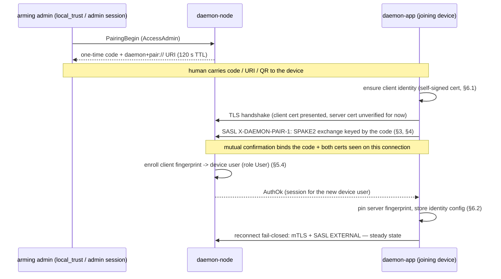

# LAN Pairing — SPAKE2 Enrollment into Certificate-Bound Authentication

Status: BINDING SPEC (lan-discovery track, phase 2), design accepted, implementation staged.
Where this document and code disagree, the code is wrong until a stage brings it into
compliance. Companion to [`daemon-lan-discovery-spec.md`](daemon-lan-discovery-spec.md), which
finds nodes; this spec makes a found node trust a device (and vice versa) without anyone typing
a password. The legacy `daemon-q1-2026` pairing is source material only; §9 records what
carries over.

## 1. Problem and scope

Discovery (the lan-discovery spec) gets a `daemon-app` to a node's TLS listener, but first
contact still requires two manual trust acts: accepting the node's self-signed certificate
(trust-on-first-use, "TOFU"; lan-discovery §6.3) and a SCRAM username/password. Pairing
replaces both with one ceremony: a short one-time code, armed by an admin on the node, typed
(or delivered by URI/QR) into the app.

### 1.1 Actors and ceremony at a glance

Two human roles, which may be the same person at two keyboards:

- The **arming admin** — someone who already holds an Admin principal on the node (via the
  `local_trust` Unix socket, the CLI, or an authenticated admin app session). They *arm*
  pairing: ask the node to mint a short-lived one-time code, and carry that code (as text or a
  QR/URI) to the joining device by any human channel — reading it aloud, a chat message, a
  scanned QR.
- The **joining user** — the person at the `daemon-app` that should gain access. They enter the
  code (or paste the URI) into the app's pairing dialog.

This node-armed one-time-code ceremony is the **only pairing mode in v1**. (An alternative
mode — the app submits an unsolicited pair request that an admin later reviews and approves —
is deliberately deferred; see §12.)



The code authenticates the exchange (via a password-authenticated key exchange, §3), the
exchange authenticates both certificates, and the certificates are what each side stores. After
the ceremony the code is dead and never needed again.

**End state of a successful pairing (binding):**

- The app holds a locally generated self-signed **client certificate** (one identity per app
  install, §6.1) and the node's **pinned server fingerprint** (written to the per-target pin
  store of lan-discovery §5.2).
- The node holds an `external_identities` row: client-cert fingerprint → a **device-scoped
  user** with role `User` (never Admin by default), plus device display name metadata (§5.4).
- Every subsequent connection is mTLS + SASL **EXTERNAL**
  (`crates/substrate/daemon-host/src/authn.rs`, `validate_external` — already wired to the
  store, fail-closed): no password, no bearer secret, key-bound identity on both sides.

Pairing is **authentication enrollment**, not the legacy peer-mesh trust: it produces a user
principal in the node's existing identity system and nothing else. No sync, group keys, peer
inference, or replication semantics ride on it.

**Scope (binding):**

- Desktop app (GUI/TUI) in v1. Mobile is a **recorded follow-up, not a redesign** (§12): once
  lan-discovery §5.3 gives Android/iOS the native TLS stream transport — which carries
  client-certificate capability with it — this ceremony runs there as specified, with QR camera
  scanning as the natural mobile entry. Only WASM is excluded on principle: a browser WebSocket
  client cannot present client certificates, so certificate-bound enrollment has nothing to bind
  to there.
- One pairing mode: the node-armed one-time code/URI ceremony of §1.1. App-initiated pending
  requests reviewed by an admin are NOT in v1 (§12).
- Wire impact: **no envelope change** (the exchange is a SASL mechanism riding the existing
  `AuthStart`/`AuthChallenge`/`AuthStep` variants, `WIRE_VERSION` stays 2), but the admin
  arming/management surface is new `ApiRequest`/`ApiResponse` arms — a wire-contract change:
  CDDL edit, `just update-codec`, `API_WIRE_VERSION` 52 → 53.
- No discovery TXT changes. There is **no** "ready to pair" TXT hint; `txtvers=1` stays frozen
  as bound in lan-discovery §2.2. Apps learn a node is armed only by attempting (or by the
  admin telling the human).

## 2. Prerequisites this spec builds on (facts, not choices)

- SASL EXTERNAL is advertised under TLS and validates the connection's client-cert fingerprint
  against `external_identities` (`daemon-auth` migration M2), denying when unmapped. The gap is
  enrollment: `AuthStore::set_external_identity` has no API/UX surface. Pairing IS that surface.
- The TLS acceptor (`crates/substrate/daemon-host/src/tls.rs`) captures
  `TlsState.peer_cert_fingerprint` as SHA-256 of the leaf DER, lowercase hex — the same format
  as the app's pin store and the discovery TXT `fp`. One fingerprint format everywhere.
- Client certs are currently only requested when `require_client_cert` + `tls_client_ca` are
  set, via `WebPkiClientVerifier` (CA-verified). Self-signed app certs cannot pass; §5.1 fixes
  this.
- The app transport already carries `conn/tls/clientCertFile` / `conn/tls/clientKeyFile`
  (`tlsConfigFromSettings()` in `daemon_connection_service.cpp`); pairing populates them.
- Qt cannot mint certificates; the legacy OpenSSL `CertificateGenerator` is the ported basis
  for the app identity (§6.1).

## 3. Cryptographic core (normative)

The exchange is **SPAKE2** (RFC 9382), a balanced password-authenticated key exchange. In
outline: both sides derive the same secret scalar `w` from the pairing code (§3.2); each sends
one elliptic-curve share — `pA` from the initiator, `pB` from the responder — which is an
ephemeral Diffie-Hellman public value *blinded by `w`* (using the RFC's fixed group elements M
and N). Each side unblinds the other's share and derives the session transcript keys: a shared
key `Ke` and confirmation keys from which each computes an HMAC over the protocol transcript —
`cA` from the initiator, `cB` from the responder. A party that does not know the code cannot
produce a verifying confirmation MAC, and observing or relaying the exchange reveals nothing
that allows offline guessing of the code. Verifying `cA`/`cB` therefore proves, mutually and
explicitly, that both ends hold the same code — and, via the additional authenticated data
("AAD") of §3.3, that they are on the same TLS connection.

### 3.1 Ciphersuite

**SPAKE2 per RFC 9382, suite SPAKE2-P256-SHA256-HKDF-HMAC** (uncompressed SEC1 point encoding,
the RFC's P-256 M/N constants). A PAKE is what makes a *short, typed* code safe against an
active man-in-the-middle — the alternatives (QR-only delivery of a long fingerprint, or asking
humans to compare fingerprint strings) either preclude typing or reintroduce a skippable human
step.

Both implementations (Rust node, C++ app) MUST pass the RFC 9382 Appendix B test vectors for
this suite; that conformance test is the interop gate and lands with each implementation.
Node side: a small in-workspace implementation over the audited RustCrypto primitives (`p256`,
`sha2`, `hkdf`, `hmac`, `subtle`, `zeroize`) in a new crate `crates/substrate/daemon-pake`.
(`pakery-spake2` implements the right RFC but is months old with no adoption; do not take it
without an explicit human review decision.) App side: the same suite over OpenSSL libcrypto EC
primitives (libcrypto is required anyway for §6.1), in `src/core/pairing/`, gated by the same
vectors.

### 3.2 Password-to-scalar derivation

The pairing code's canonical form is its Crockford-base32 payload: uppercase, separators
stripped, confusables folded (`I`/`L`→`1`, `O`→`0`) — both sides normalize identically.

```
w = int( HKDF-SHA256( salt = "daemon-pair-v1", ikm = canonical_code_bytes,
                      info = "spake2-w", L = 48 ) ) mod p
```

48 output bytes make the mod-p bias negligible. No memory-hard function: the code is one-time,
short-lived, and online-guess-limited (§5.3); SPAKE2 already prevents offline attack.

### 3.3 Roles, identities, channel binding

- App = **Party A** (initiator), identity string `A = "daemon-app"`.
  Node = **Party B**, identity string `B = "daemon-node"`. (The node's `node_id` is not in the
  identity strings — the app may not know it when typing a bare code; binding to *this* node
  comes from the certificate AAD below, which is strictly stronger than a name.)
- **Channel binding (the anti-relay measure, binding):** the RFC 9382 confirmation-key
  derivation AAD is

  ```
  AAD = server_leaf_fp_raw32 || client_leaf_fp_raw32 || device_name_utf8
  ```

  where each fingerprint is the raw 32-byte SHA-256 of the leaf certificate DER **as observed
  on this TLS connection by each side**, and `device_name` is the display name the app sent in
  its first message (§4). A MITM relaying the exchange across two TLS legs sees different
  certificates on each leg, so the confirmation MACs cannot verify on both sides. Verifying the
  MACs simultaneously authenticates the code, both certificates, and the device name.

Consequences (binding): the app MUST present its client certificate in the pairing connection's
TLS handshake (generate the identity first, §6.1); the node MUST refuse the mechanism when no
client cert was presented; the node enrolls the **handshake-observed** client fingerprint —
never any fingerprint claimed in payload; the app pins the **handshake-observed** server
fingerprint — the URI `fp` (§7) is a pre-check, not the pinned value's source.

## 4. Wire placement — SASL mechanism `X-DAEMON-PAIR-1`

No envelope change: the exchange rides `WireC2S::AuthStart`/`AuthStep` and
`WireS2C::AuthChallenge`/`AuthOk`/`AuthError` (`daemon-api/src/wire.rs`), with CBOR payloads in
the opaque byte fields. `Authenticator::begin` branches on the mechanism name before rsasl is
involved; rsasl never sees it.

Advertisement (binding): `X-DAEMON-PAIR-1` appears in `Hello.auth_mechanisms` only when ALL
hold — pairing is armed (§5.3), the connection is TLS, and a client certificate was presented.
When not armed the mechanism is absent and an `AuthStart` naming it fails with reason
`pairing-not-armed`.

Message flow (one exchange = one SASL conversation):

| # | Direction | Envelope | CBOR payload |
|---|---|---|---|
| 1 | app → node | `AuthStart { mechanism: "X-DAEMON-PAIR-1", initial }` | `{ v: 1, pa: bytes(65), name: tstr }` — SPAKE2 share pA (uncompressed SEC1) + device display name (≤64 chars, sanitized). |
| 2 | node → app | `AuthChallenge { data }` | `{ pb: bytes(65), cb: bytes(32) }` — share pB + node's confirmation MAC. |
| 3 | app → node | `AuthStep { data }` | `{ ca: bytes(32) }` — app's confirmation MAC, sent **only after** the app verified `cb`. |
| 4 | node → app | `AuthOk { token, principal }` | Enrollment (§5.4) committed before the reply, in one store transaction. |

Failure at any step → `AuthError { reason }` with exactly one of: `pairing-not-armed`,
`pairing-no-client-cert`, `pairing-failed` (covers wrong code, expired code, MAC mismatch,
malformed payload — deliberately indistinguishable to the unauthenticated caller), or
`pairing-locked` (attempt budget exhausted, §5.3). Every non-`AuthOk` outcome of a started
exchange counts one attempt.

The derived SPAKE2 shared key `Ke` is not used to carry data in v1; the TLS channel (now
mutually confirmed via the AAD) carries everything, and metadata is authenticated by inclusion
in the AAD.

## 5. Node side

### 5.1 TLS acceptor: request-optional client certificates

`build_server_config` (`daemon-host/src/tls.rs`) gains a third client-auth mode, and it becomes
the default for the TLS API listener:

| `[api]` config | Client-auth behavior |
|---|---|
| `require_client_cert` + `tls_client_ca` (existing) | `WebPkiClientVerifier`, mandatory, CA-verified — unchanged. |
| default (new behavior) | **Request-optional-any**: a custom `rustls::server::danger::ClientCertVerifier` with `offer_client_auth() == true`, `client_auth_mandatory() == false`, and a `verify_client_cert` that accepts any presented certificate. All trust judgment is deferred to SASL, which is fail-closed (no mapping ⇒ EXTERNAL denies; SCRAM unaffected). |

This changes no existing client's outcome: clients presenting nothing still connect and SCRAM
as before; the only new capability is that a presented self-signed cert reaches
`TlsState.peer_cert_fingerprint`. The existing fingerprint capture and format are reused as-is.

### 5.2 Configuration

```toml
[api.pairing]
enabled = true   # master switch for the mechanism + arming API; default true
```

(`DAEMON_API__PAIRING__ENABLED`.) `enabled = true` exposes nothing by itself — pairing is inert
until an admin arms a code. `enabled = false` hard-disables arming and the mechanism for
operators who want the surface gone. Pairing requires the TLS listener; on a node without one,
arming fails with a clear error.

### 5.3 PairingManager (armed state)

In-memory only, inside `daemon-host` next to the `Authenticator`:

- **Arm** (`PairingBegin`, §5.5): generate 10 Crockford-base32 chars from the OS CSPRNG
  (≈50 bits), display-grouped `XXXXX-XXXXX`. Derive and hold `w` (§3.2); hold the plaintext
  code only long enough to compose the response, then drop it. **Nothing is ever persisted**;
  a node restart disarms.
- **One armed code at a time**: re-arming replaces (and invalidates) the previous code.
- **TTL 120 s**: expiry disarms.
- **Single use**: the first successful enrollment disarms.
- **Attempt budget 5**: five failed exchange attempts (§4) disarm and mark the manager locked
  until an admin explicitly re-arms; subsequent `AuthStart`s get `pairing-locked`.
- One exchange in flight at a time; a second concurrent `AuthStart` gets `pairing-failed`
  without consuming the in-flight attempt.
- Arming, every failed attempt, disarm cause, enrollment, and revocation are logged at
  `info`/`warn` — this is the audit trail.

### 5.4 Enrollment (one transaction)

On verified `ca` (§4), atomically in the auth store (`daemon-auth`):

1. Create the device-scoped user: username `device-<client_fp[:12]>` (stable, collision-free,
   no sanitization pain), role **`User`**, enabled, **no password credentials** — a new store
   seam `create_external_user` (the existing `create_user` always writes Argon2 + SCRAM rows).
   SCRAM attempts against such a user fail closed via the authenticator's existing decoy
   mechanism (it serves a fake SCRAM verifier for users without credentials, so an attacker
   cannot probe which usernames exist or which are passwordless).
2. Insert `external_identities[client_fp] → user_id`.
3. Store device metadata: migration **M3** extends `external_identities` with
   `display_name TEXT`, `created_at`, `last_seen_at` (updated on each successful EXTERNAL
   login).
4. Mint the session and reply `AuthOk` (the standard `mint_session` path; the pairing
   connection ends up authenticated as the new device user).

Role elevation (device acting as Operator/Admin) is an explicit post-pairing admin act through
the existing role machinery, never part of the ceremony.

### 5.5 Admin API surface (api/53) and events

All `AccessAdmin`-gated (same enforcement as `UserCreate`), CDDL-mirrored, codec-regenerated:

| Request | Response | Notes |
|---|---|---|
| `PairingBegin` | `PairingCode { code, expires_at, uri, addresses, server_fp, node_id, node_name }` | `uri` per §7; `addresses` = the node's non-loopback addresses (reuse the interface enumeration the discovery advertiser already needs) so the admin client can render alternates. The code appears once, here, and is never retrievable again. |
| `PairingCancel` | ack | Disarms; also clears the locked state. |
| `PairingStatus` | `{ armed, expires_at?, attempts_remaining?, locked }` | Never returns the code. |
| `PairedDeviceList` | rows `{ user_id, username, display_name, fingerprint, created_at, last_seen_at, enabled }` | |
| `PairedDeviceRevoke { fingerprint }` | ack | Deletes the `external_identities` row, **disables** (not deletes — audit) the device user, and terminates its live sessions and authenticated connections. |

A coalescing `NodeEvent` invalidation fires on pairing-state change and on paired-device-set
change, so admin UIs refetch instead of polling (house API-shape rule).

`daemon-cli` (first auth-adjacent grammar): `daemon-cli pair new | status | cancel | devices |
revoke <fingerprint>`. `pair new` prints the grouped code, the URI, and the expiry. Typically
run over the `local_trust` Unix socket (system principal). There is no auto-arming anywhere —
not on first boot, not when the user table is empty; first-admin bootstrap
(`seed_first_admin_if_empty`) is unchanged and remains the root of the admin chain.

## 6. App side

### 6.1 Device identity (one per app install)

- Generated lazily on first pairing: **EC P-256** self-signed X.509, CN `daemon-app device`,
  SHA-256 signature, validity 10 years — the legacy `CertificateGenerator` OpenSSL approach
  ported to EC. This adds a direct libcrypto dependency to the desktop app (flake + CMake, same
  gating as qmdnsengine). libcrypto here is a *crypto library* (cert generation + SPAKE2, §3.1),
  independent of which TLS backend Qt uses — relevant for the mobile follow-up (§12): Android
  already bundles OpenSSL for the lan-discovery §5.3 transport, while iOS uses SecureTransport
  for TLS and would bundle libcrypto for these operations only.
- Stored under the app data dir: `identity/key.pem` (mode 0600) and `identity/cert.pem`, dir
  0700. Plain file in v1 (desktop) — explicitly no worse than today's tokens in plain
  QSettings; hardening this into the desktop OS keychain via QtKeychain is a listed follow-up
  (§12). The PEM layout is a desktop-v1 shape only: the mobile follow-up (§12) stores the same
  identity in the platform keystore from the start and never writes PEM files. Never synced,
  never exported by any support/diagnostic path.
- **One identity for all nodes** the install pairs with (`external_identities` on each node maps
  the same fingerprint to that node's local device user). Per-node client certs are forbidden —
  they multiply key management for zero security gain.
- Expiry or key loss ⇒ re-pair; there is no rotation protocol in v1 (§12). The stale node-side
  row is cleaned up via `PairedDeviceRevoke`.

### 6.2 Pairing service

New `src/core/pairing/` → CMake target `da_pairing`, mirroring the discovery module layout
(per-platform source swap + always-compiled mock): real sources on desktop; the null backend
(`available == false`) on WASM permanently and on Android/iOS until the §12 mobile follow-up
lands. `IPairingService` seam
(`pairWithCode(target, code)`, `pairWithUri(uri)`, progress/state signals, `errorOccurred`),
the SPAKE2-P256 implementation (§3.1), the identity keystore (§6.1), and the URI parser (§7).
`AppServiceGraph` gains `pairing::IPairingService*`; mock mode gets `MockPairingService`
(scripted success/wrong-code/locked outcomes for tests and hermetic GUI runs). QML context
property: `Pairing`.

Sequence for `pairWithCode` (binding):

1. Ensure identity exists (generate §6.1).
2. Connect TLS to the target with the pairing-mode config: client cert presented, server
   verification deferred (`QueryPeer`-equivalent). This is the **only** permitted relaxation of
   the app's fail-closed transport, and the connection may carry nothing but the SASL pairing
   exchange — no API calls, ever, on an unpinned connection.
3. Run §4. If a URI supplied `fp`, first compare it against the handshake-observed server cert
   and abort on mismatch (`pairing-failed` UX) before sending `AuthStart`.
4. On `AuthOk`: persist the observed server fingerprint to the per-target pin
   (lan-discovery §5.2), set `conn/tls/clientCertFile`/`clientKeyFile` to the identity paths,
   record the target via `setLastConnection`, then **disconnect and reconnect through the
   normal fail-closed path** using EXTERNAL. The steady-state path is exercised immediately;
   pairing-mode TLS config never survives the ceremony.

### 6.3 Mechanism selection and revoked-device UX

- Connect-time auth order (in `DaemonConnectionService`): if a client identity is configured
  and the server's `Hello.auth_mechanisms` includes `EXTERNAL`, try EXTERNAL first; on denial
  fall back to the SCRAM credential prompt.
- When EXTERNAL is denied against a target the app had paired (per-target pin + identity
  configured), the failure surface says so: "This device's pairing was revoked or is no longer
  recognized — pair again or sign in with a password", with a re-pair affordance. The node
  discloses nothing beyond the generic SASL denial; the interpretation is client-side from its
  own pairing records.
- "Forget this node" (Settings): clears the per-target pin, per-target token, and the paired
  marker for that target. It does not touch the device identity (other nodes still use it).

## 7. URI contract — `daemon+pair:` (normative)

```
daemon+pair://<host>:<port>/?v=1&code=<XXXXXXXXXX>&fp=<64hex>&node=<32hex>&name=<pct-encoded>[&alt=<host:port>...]
```

- `host` — the node's primary non-loopback address (IPv6 bracketed); `alt` repeats for
  additional addresses. The app tries `host` first, then each `alt`.
- `v=1` — URI schema version; unknown versions are rejected, unknown extra params ignored.
- `code` — canonical (ungrouped) Crockford payload.
- `fp` — the server leaf-cert SHA-256, lowercase hex: out-of-band channel authentication. When
  present the app verifies the handshake cert against it before starting the exchange (§6.2).
- `node`, `name` — the persistent node id and display name (lan-discovery §3.2/§3.3), display
  and bookkeeping only; trust never derives from them.

The node composes the canonical URI in `PairingCode.uri` (the node decides; clients render).
Admin clients present it as text and as a QR code: GUI paints it via the vendored single-file
`qrcodegen` (Nayuki, MIT); the TUI renders the same via Unicode half-blocks. The *joining* v1
desktop app consumes a pasted URI or a typed code — camera scanning arrives with the mobile
follow-up (§12), which is the audience QR encoding exists for.

Typed-code flow (no URI, no `fp`): the target comes from a discovered row or manual entry, and
channel authentication comes entirely from SPAKE2 + AAD (§3.3) — that is exactly the case the
PAKE was chosen for.

## 8. UX surfaces

GUI (both shared surfaces get both sides of the ceremony):

- **Joining side** — wizard and Settings→Connection: a "Pair with node…" affordance on each
  discovered row (and next to manual entry). Dialog: paste URI or type code (auto-formatting
  the `XXXXX-XXXXX` grouping, Crockford normalization live), progress states (connecting /
  verifying / enrolled), the §6.3 failure texts. On success the wizard proceeds exactly as a
  successful connect does today. Pairing success replaces the lan-discovery §6.3 TOFU dialog
  for this target (the pin was written by the ceremony); TOFU remains the fallback for
  never-paired manual TLS targets.
- **Arming side** — Settings→Connection, admin-gated section "Pair a new device": shows the
  grouped code, expiry countdown, the URI, and the QR; Cancel disarms. Below it, the paired
  devices list (`PairedDeviceList` rows: name, `fp[:12]`, created, last seen) with Revoke —
  rendered from the API, refetched on the §5.5 invalidation event. The section is hidden for
  non-admin principals.

TUI parity (mandatory, same delivery): the first-run connect step and Settings hub gain
"Pair with node" (code entry) via the same `IPairingService`; the admin arming view renders
code + URI + Unicode QR; the paired-device list with revoke rides the same models through
`DisplayRoleAdapter`. All strings through the 12 i18n catalogs.

## 9. Legacy port ledger

From `daemon-q1-2026/apps/daemon/src/core/services/peer/`:

**Ported:** the `CertificateGenerator` OpenSSL self-signed identity approach (RSA-2048 → EC
P-256); trust-only-on-explicit-affirmation (relocated: the affirmation is the admin arming +
the human carrying the code); pin-on-success semantics (now the per-target pin store);
timeout/rate-limit discipline (30 s pair timer → 120 s armed TTL + attempt budget); revocation
= unpin + drop connections (now: mapping delete + user disable + session kill).

**Dropped:** "easy-pair" auto-accept (`PairingHandler::onPairPacket` auto-completing on
`pair=true` — the central defect; nothing in this design ever auto-accepts); the
`llamachat.pair` packet protocol and its `RequestedByPeer` dead states; trust-as-DER-file keyed
by spoofable deviceId; the short-authentication-string display (`verificationKeyFor`, an 8-char
hash over both public keys meant for human comparison — superseded by SPAKE2's mutual
confirmation, which is stronger and has no human comparison step to skip); the lexicographic
initiator; all post-pair mesh machinery (group keys, credential sync, peer inference,
`peer_trust_events` replication).

## 10. Security invariants (binding, never relaxed)

1. Nothing auto-accepts, auto-arms, or auto-pairs. Arming is an explicit `AccessAdmin` act;
   enrollment requires the code; the ceremony's failure mode is always "no trust change".
2. The node enrolls only the handshake-observed client fingerprint; the app pins only the
   handshake-observed server fingerprint. Payload-claimed and URI-claimed values are hints and
   pre-checks, never the stored value.
3. The code is single-use, 120 s TTL, ≈50-bit, CSPRNG-generated, never persisted, never
   retrievable after `PairingBegin` returns, and online-guess-limited to 5 attempts before
   lockout. `w` and all SPAKE2 state are zeroized on drop.
4. Confirmation-MAC AAD binds both leaf certificates and the device name (§3.3): a relay MITM
   cannot complete the exchange, and a completed exchange authenticates everything the two
   sides then store.
5. The pairing mechanism is advertised only when armed, on TLS, with a client cert presented;
   the exchange runs only on the TLS API listener (never Unix socket, pipe, plaintext WS, or
   anything under `local_trust` — pairing from a `local_trust` surface is meaningless anyway).
6. Device users are role `User`, passwordless (decoy-SCRAM, fail-closed), and elevation is a
   separate explicit admin act.
7. The app's pairing-mode TLS relaxation (§6.2 step 2) exists only inside `pairWithCode`/
   `pairWithUri`, carries only the SASL exchange, and is followed by a mandatory fail-closed
   reconnect. No API traffic on an unpinned connection, ever.
8. Revocation is immediate: mapping deleted, user disabled, sessions and live connections
   terminated in the same act.
9. Both SPAKE2 implementations MUST pass the RFC 9382 test vectors; a suite change is a new
   mechanism name (`X-DAEMON-PAIR-2`), never a silent re-parameterization.

## 11. Verification

- **`daemon-pake`:** RFC 9382 Appendix B vectors (golden test); property tests (wrong `w` never
  confirms, AAD mismatch never confirms); zeroization smoke. `cargo test -p daemon-pake`.
- **Node:** verifier-mode matrix (no cert / self-signed / CA-verified × SCRAM / EXTERNAL /
  pairing); PairingManager lifecycle (TTL, single-use, attempt lockout, replace-on-rearm,
  restart disarms); enrollment transaction atomicity; `create_external_user` decoy-SCRAM
  behavior; M3 migration; API authz (`AccessAdmin` on all five requests); mechanism
  advertisement gating. `just deny` in the stage that adds the crypto crates.
- **App:** C++ SPAKE2 against the same RFC vectors (`tst_spake2.cpp`); URI parse/compose
  round-trip incl. hostile inputs; code normalization; keystore permissions and lazy
  generation; `tst_pairing_service.cpp` against a fake exchange (success, wrong code, revoked,
  locked, fp-precheck mismatch); the §6.2 reconnect rule (no API bytes pre-pin) at the
  transport-test level; mechanism-selection order in the connection service tests.
- **Cross-implementation:** a checked-in transcript fixture (full §4 exchange generated by the
  Rust side with pinned randomness via a test-only deterministic RNG) that the C++ tests replay
  — catches encoding drift the RFC vectors alone would miss.
- **GUI/TUI:** kwin-mcp mock-mode journeys (arm → code shown; pair → pin written, no
  auto-connect-before-ceremony) with `MockPairingService`; TUI dialog tests; i18n drift gate.
- **Opt-in LAN e2e** (real arm via CLI, real app pairing, then EXTERNAL reconnect): same
  policy as discovery — never in `just e2e` or default gates.
- Standard tiers otherwise: diff-scoped `just lint`, `just verify-stage` per stage,
  `just conformance` + `just verify-landing` at the end (this track DOES change the CDDL).

## 12. Out of scope / future extensions

- **Admin-approved pair requests** (the deferred second mode of §1.1): the app submits an
  unsolicited pair request; an admin later reviews it, compares a short authentication string
  derived from both certificates against what the requesting app displays, and approves. The
  right shape for "no admin near the node when the device arrives"; needs a pending-request
  store and one more event, and layers cleanly on §5.4 enrollment.
- **Attach-to-existing-user pairing** (`PairingBegin { user: … }`): maps the new fingerprint to
  a person's existing account instead of a device user. The store already supports N
  fingerprints → 1 user; only the arming API and UX grow.
- **Mobile pairing** (the follow-up promised in §1 scope; gated on lan-discovery §5.3 /
  stages 8–9 — the native mobile TLS transport and the mobile build lane): the ceremony itself
  needs **no redesign** — mobile dials `tls` natively, presents the same client certificate,
  and runs the same SASL exchange. What the mobile stage adds: **QR camera scanning** as the
  joining entry (the `daemon+pair:` URI of §7 was designed for it — code + server `fp`
  out-of-band in one scan); identity storage in the platform keystore (Android Keystore / iOS
  Keychain) instead of the §6.1 PEM files; libcrypto bundled per §6.1 (already present on
  Android via §5.3, crypto-only on iOS). One named verification risk before promising it:
  client-certificate presentation through Qt's iOS SecureTransport backend must be proven in
  the mobile lane — if it falls short, iOS pairing waits on a transport answer, not a spec
  change.
- **WASM**: permanently out of certificate-bound pairing (no client certs on a browser
  WebSocket). If browser enrollment is ever wanted it is a token-based design with its own
  spec, not an adaptation of this one.
- **Key rotation** (old key signs the successor's enrollment) instead of re-pairing at expiry.
- **Desktop keychain storage** for the device private key: move the §6.1 PEM files into the OS
  keychain via QtKeychain (KWallet/GNOME Keyring, macOS Keychain, Windows Credential Manager).
  This is desktop-only hardening of the v1 file layout. It is deliberately distinct from the
  mobile follow-up above, which is NOT this item deferred: mobile never ships the PEM layout at
  all — its identity lands in the platform keystore (Android Keystore / iOS Keychain) from its
  first release, as a binding part of the mobile stage. The two storage migrations share the
  §6.1 identity semantics (one key per install, same fingerprint) but nothing else — different
  APIs, different stages, different obligations (optional here, mandatory there).
- **CLI QR rendering** (`daemon-cli pair new --qr`).
- **Runtime `[api.pairing].enabled` toggle over the API** — same posture as the discovery
  advertiser: config-only until a real need appears.

## 13. Staged delivery

Each stage lands green and independently (`just verify-stage`).

1. **Spec + store groundwork:** this document; M3 migration; `create_external_user`;
   `last_seen_at` update on EXTERNAL login; unit tests. No behavior visible yet.
2. **TLS verifier:** request-optional-any client-cert mode (§5.1) + matrix tests. EXTERNAL
   becomes end-to-end usable for a hand-enrolled fingerprint (store-level write) — an
   integration checkpoint with zero pairing code.
3. **`daemon-pake`:** SPAKE2-P256-SHA256-HKDF-HMAC + RFC vectors + `just deny`.
4. **Node pairing:** PairingManager, `X-DAEMON-PAIR-1` mechanism branch in `Authenticator`,
   `[api.pairing]` config, admin API + CDDL + `update-codec` + api/53, invalidation events,
   `daemon-cli pair` grammar, transcript fixture generation.
5. **App core:** identity keystore (libcrypto dep), C++ SPAKE2 + vectors + fixture replay,
   `da_pairing` service + mock + URI parser, per-target client-cert wiring, mechanism
   selection.
6. **GUI surfaces:** joining dialog, admin arming section + `qrcodegen`, paired-device list +
   revoke, revoked-UX; i18n.
7. **TUI parity:** all §8 TUI surfaces; tests; i18n.
8. **Landing:** `just conformance`, `just verify-landing`, builds, opt-in LAN pairing smoke on
   real hardware.

The mobile follow-up (§12) is not a numbered stage here: it rides the lan-discovery mobile
stages (its §12 stages 8–9 — native TLS transport + mobile build lane) and gets its own stage
plan when that prerequisite exists.
