# Session Unification — One Authority for Engine Incarnation

Status: BINDING SPEC (session-unification track). Stages 1–5 implement it; each stage lands green
and independently. This document is the protocol, not a sketch: where it and code disagree, the
code is wrong until a stage brings it into compliance.

## 1. Problem and scope

[`daemon-lifecycle-persistence.md`](daemon-lifecycle-persistence.md) §4 already binds the correct
invariants — the store is authoritative (#1), fencing (#5), single activation (#6), lost-wake
recovery of runnable sessions (#7). The interactive ("live") path violates them:

- `session_create` claims the session `Lifecycle::Live` in the in-memory `owners` map
  (`crates/substrate/daemon-host/src/node_api.rs`) but writes a durable `'ready'` row — presenting
  a non-runnable blank session as scanner work. The `RecoveryScanner` activates it; the live actor
  runs the same session concurrently; two epoch-0 incarnations race and the last committer wins.
- The `owners`/`Lifecycle` map is a second, in-memory authority over who may run a session. It is
  not durable, not fenced, and not shared with activation.
- Directory reservation is check-then-insert *after* the lease is acquired
  (`crates/substrate/daemon-activation/src/lib.rs`): concurrent wakes can fence an in-flight
  incarnation of the same session on the same node.
- Seeded producers (cron, background spawn, fleet job worker) publish the `'ready'` row before
  bindings/edges/first-input, so a scan racing construction can run a session with wrong inputs or
  fail to notify its parent.
- Activation terminalizes every completed turn (`TurnOutcome::Completed` → `mark_completed` →
  `'completed'`), so an interactive session cannot live across turns on the durable path at all.

**Resolution:** the durable `SessionStore` becomes the *sole* authority for Core session
incarnation. Interactive sessions become ordinary durable sessions whose turns are driven by a
typed durable inbox; "live" becomes an attachment policy over the activation substrate; the
parallel live-actor authority is deleted.

**Scope (binding):** this track guarantees single-incarnation per process and durable-state safety
cross-node (fenced commits). It does NOT deliver cross-node execution/side-effect exclusivity —
that requires the holder + expiry/renewal lease, deferred to the sync-protocol track.
`LiveHandle::Foreign` (foreign-backend engines) keeps its explicit actor rail; this spec governs
Core engines.

## 2. Lifecycle states

The store's `SessionStatus` gains one state, `Idle`. `Suspended { job_id }` keeps its implemented
contract exactly (checkpoint + outbox; approval parking keeps its durable representation via
`park_approval`). No other states are invented.

```mermaid
stateDiagram-v2
    [*] --> Idle: create_idle (blank interactive; never scanner work)
    [*] --> Ready: create_runnable (seeded producers; Ready last, atomic)
    Idle --> Ready: splice accepted (atomic with append)
    Ready --> Active: wake -> slot reservation -> lease
    Active --> Suspended: checkpoint_and_enqueue (job) / park_approval
    Suspended --> Ready: completion recorded / approval answered
    Active --> Idle: commit_turn, no unconsumed work (interactive root)
    Active --> Ready: commit_turn with unconsumed splices/completions
    Active --> Completed: terminal per persisted execution policy
    Completed --> [*]
```



- **`Idle`** = durable "exists, no runnable work", independent of whether a hydrated incarnation
  happens to be resident in memory. Blank creates land here; interactive turns return here. The
  recovery scanner never selects `Idle` (`scan_resumable` stays `('ready','active')`); `wake()`
  treats `Idle` like `Completed` (nothing to do).
- **Status rule (binding):** a session is `Ready` iff unconsumed work exists for it (pending
  splices, unapplied completions); `Idle` iff none does. Every transition that creates work
  flips `Idle → Ready` in the same transaction that records the work.
- **Wire projection:** `map_state` (`crates/substrate/daemon-host/src/node_api/roster.rs`) projects
  `Idle → SessionState::Ready`. No CDDL/codec change in this track; an explicit `idle` wire state
  is an optional follow-up for a human wire decision.

## 3. Atomic creation and runnable publication

Two store seams, both single-transaction. An insert-as-Ready-then-update sequence is forbidden —
it recreates the scanner race at every construction boundary.

- **`create_idle`** — blank interactive creation: session row + meta, status `Idle`. Replaces
  `session_create`'s `'ready'` write. `create_session`'s `INSERT OR REPLACE` becomes
  insert-if-absent (a duplicate create is an error, never a silent state reset).
- **`create_runnable`** — the seeded-producer factory: snapshot + session meta + edges/bindings
  (`delegations` / `completion_notices` / `background_edges` / cron metadata) + the Foreign child's
  first input (stage 1: the legacy `pending_session_input` row, published atomically here; stage 2
  migrates it to `inbox_splice`) + the persisted execution policy — committed together, with
  status `Ready` written **last inside the same transaction**. Cron, background spawn, and the
  fleet job worker all construct through it. A scan firing at any point during construction sees
  either nothing runnable or the complete session.

### Execution policy

A persisted per-session `execution_policy`, written at creation, never inferred from the presence
of one binding:

| policy | commit_turn on success | on failure |
|---|---|---|
| `interactive-root` | `Idle` (or `Ready` if unconsumed work) | `Idle` + journal `mgmt.error`; splice `Consumed`; retry = a new user action |
| `joining-child` | terminal `mark_completed` → parent woken transactionally | terminal; parent woken with failure summary |
| `detached-child` | terminal; completion notice via outbox | terminal; failure notice |
| `background-child` | terminal; background edge closed | terminal; edge closed with failure |
| `cron-run` | terminal; run closed | terminal; run closed as failed |

The engine backend (Core vs Foreign) is an **orthogonal dimension** the session already carries —
a foreign child may itself be joining or detached. Backend kind is NOT a policy value.

## 4. Durable inbox

Refines [`daemon-durable-inbox-spec.md`](daemon-durable-inbox-spec.md) (design note) into the
binding protocol. One correction to it is recorded here (§4.3, Observe).

### 4.1 Envelope

```text
InboxSplice {
    splice_seq:   store-assigned monotonic sequence per session (never reused, never renumbered)
    kind:         StartTurn | Steer | Observe
    payload:      UserMsg (typed; kind, request_id, Origin preserved — the F4 bare-bytes collapse is retired)
    origin_op:    dedupe identity (see 4.2)
    origin:       producer provenance (wire client, notice worker, parent, ...)
    received_at:  wall-clock provenance
    claim:        Pending | Claimed { fence } | Consumed { turn_seq }
}
```

### 4.2 Transaction protocol

- **Append** = one transaction: insert splice + transition `Idle → Ready` + return `SpliceSeq`.
  Append is **append-or-return-existing** on the dedupe key `UNIQUE(session_id, origin_op)`:
  `origin_op` is the wire `ReqId` for client commands (`StartTurn`/`Steer`/`Observe` all carry
  one) and a minted UUIDv7 op-id for internal producers (e.g. the notice worker). Uniqueness
  scope: per session, valid for the splice retention window — a client retry after a
  crash-before-ack returns the original `splice_seq` instead of duplicating. Append returns
  `Result` and errors surface; the wire ack is sent only after the commit (splice-before-ack, the
  design note's ordering contract).
- **Claim** = fenced CAS `Pending → Claimed { fence }`. A newer fence may reclaim a stale claim
  (`Claimed { old_fence }` where `old_fence <` current) exactly once — the crash-recovery path. A
  claim by an equal-or-older fence fails.
- **Consume** = written only inside `commit_turn`'s transaction (§5), never separately.
- **Hydrate** replays splices above the snapshot's consumed cursor (a new `#[serde(default)]`
  snapshot field recording the highest consumed `splice_seq`), replacing the destructive
  `take_session_inputs` drain. Retention: consumed splices are prunable once older than the
  retention window; the dedupe guarantee is scoped to that window.

### 4.3 Observe IS spliced (correction to the design note)

The design note declared Observe "read-only attach, not spliced". That conflated two things.
`AgentCommand::Observe` (`crates/contracts/daemon-protocol/src/lib.rs`) appends a context-only
`UserMsg` that must survive restart — "folds into the conversation when idle, and lands in the
following turn when busy". That is a durable mutation and rides the inbox:

- An `Observe` splice never triggers a model turn. It is drained at the next turn's phase
  boundary, or consumed by a **fold-only `commit_turn`** (snapshot fold, no provider call) when
  the session is idle.
- A session with unconsumed observes is `Ready` (consistent with the §2 status rule); the fold
  returns it to `Idle`.
- Pure read-only attach (subscribe/watch) remains un-spliced projection — that is the line the
  design note was actually drawing.

## 5. The durable turn boundary

`commit_turn` (new store op, fenced CAS on the session's fence) commits in ONE transaction:

1. snapshot blob + monotonic `turn_seq`,
2. consumed-splice cursor + `Consumed { turn_seq }` claim rows,
3. journal segment promotion/seal for this turn,
4. next status: `Idle` iff no unconsumed splices/completions remain, else `Ready` — input that
   raced in mid-turn is never stranded on an `Idle` session,
5. terminal `mark_completed` instead, iff the persisted execution policy says the turn ends the
   session (§3 table). `TurnOutcome::Completed` alone never terminalizes; `Step::TurnCommitted`
   is the non-terminal activation step.

Failure is role-aware per the §3 table. Rewind stays legal: snapshot-regression protection is
revision/parent-hash CAS, never a length floor
([`conversation-rewind-spec.md`](conversation-rewind-spec.md)).

### Journal fencing

Journal segment identity becomes `turn_seq` (chained on the prior seal); `epoch` remains
suspension fencing per the lifecycle spec. Journal appends on the durable path thread the
activation fence (attempt-scoped writes): a stale writer can neither append into nor seal the
winning `turn_seq` segment. `commit_trace_segment`'s CAS alone is insufficient — the fence rides
every append.

### Stage-3 mechanics (as landed)

- `Activation` carries `policy` + `turn_seq` from the SAME load transaction as the snapshot; the
  manager hands them to the incarnation as a `TurnCtx` (policy, turn_seq, fence). A resumed
  suspension re-loads the same `turn_seq` — the turn is still in flight — and its journal sink
  (`JournalSink::for_turn`) re-opens the same segment, continuing the per-segment `seq` past the
  entries already appended (never colliding under the idempotent `(stream, segment, seq)` key).
- **Deferred seal**: on the interactive path the sink computes + signs the root at the turn
  boundary but does not commit it; the `TurnSeal` rides `commit_turn`'s transaction, so the root
  lands atomically with the snapshot it covers. A repeated seal within one activation (the
  coalescer seals on both an error record and the turn boundary) recomputes over everything
  appended so far — same segment id, last recompute wins. Non-interactive turns seal directly
  (their terminal commit closes the session anyway).
- A terminal `mark_completed` IS that turn's boundary: it advances the same `turn_seq` counter
  and stamps its consumed splices with the committed turn's identity.
- Suspension commits (`checkpoint_and_enqueue`, `park_approval`) are mid-turn: they stamp
  `Consumed { turn_seq }` with the in-flight turn WITHOUT advancing it.
- **Migration (M20)**: legacy sessions journaled durable segments keyed by epoch, so the new
  counter is seeded past every segment their stream already used (entries or sealed roots) —
  turn-keyed segments can never collide with a historically sealed segment.

## 6. Ownership

- **In-process:** an RAII slot guard — atomic insert-if-vacant directory reservation acquired
  **before** the lease (inverting today's lease-then-check order), owned token released on every
  exit path (lease failure, spawn failure, cancellation, panic, shutdown), generation-checked so a
  release never removes a newer incarnation's reservation.
- **Durable:** fence-CAS on every `session_record` / journal / splice write (`mark_completed`,
  `checkpoint_and_enqueue`, `park_approval`, `commit_trace_segment`, `commit_turn`).
- The in-memory `owners: DashMap<SessionId, Lifecycle>` map is deleted at cutover (§8); until
  then it may only shadow, never decide.

## 7. Live is an attachment

A host-owned per-session **`AttachmentHub`** gives an activation incarnation everything the live
actor rail provided:

- **EventSink fan-out**: MergedLog pump + `SessionAdvanced` + journal feeder + usage fold — one
  sink, all consumers; the activation path stops being journal-only.
- **TurnControl registry** with an occupied-slot notifier: a durable mid-turn `Steer` whose wake
  finds the slot occupied is claimed and delivered into the resident turn (the timing contract —
  steering does not wait for the next turn).
- **Parking resolver**: activation gains the `ParkingHandler`/`Respond` semantics for
  `Input`/`Choice`/`Approval` (today's `DelegateResolver` auto-answer is retired for interactive
  sessions).

**Residency: commit first, then linger.** `commit_turn` executes immediately at the turn
boundary. The incarnation then stays hydrated draining the inbox (no rehydrate cost per message);
the idle timeout only passivates the already-committed incarnation — releasing the slot, with no
commit owed at passivation. Crash-of-resident loses nothing that a fresh hydrate cannot replay.

### Stage-4 mechanics (as landed, dark)

- `node_api::attachments` owns the hub: `AttachmentHubs` is a host-owned get-or-create registry
  (`attach`/`get`/`detach`; absent session = zero overhead), each `AttachmentHub` bundling the
  live rail's four surfaces around the SAME internals the live actor uses — a `MergedLog`
  (non-destructive `log_after`/`subscribe`, appends badge `SessionAdvanced` on the node feed), a
  destructive `poll` drain, a parked-request table answered by `respond` (an `Approval` park
  badges `ApprovalPending`; answered = removed, a second respond errs), and an occupied-turn
  `TurnControl` slot with a `watch` notifier (`send_replace`, so occupancy is correct even with
  no subscriber). `deliver_steer` claims into the resident turn and returns `false` when the slot
  is empty — the caller routes unclaimed steers durably (splice + wake, §8).
- `CoreEngineFactory::with_attachments` threads the registry into every `CoreIncarnation`. A turn
  whose session has a hub attached streams engine events to it from the live `EventSink` (the
  journal capture is unchanged and journals at the boundary as before), brackets `run_turn` with
  `begin_turn`/`end_turn` on every exit path, and — interactive-root only — wraps the
  `DelegateResolver` in a `HubParkingResolver`: `Input`/`Choice`/`Approval` park on the hub for a
  client `respond` (live-`ParkingHandler` parity; a dropped hub declines safely), while
  `Delegate`/`Spawn` keep the durable resolution. Non-interactive policies and hubless sessions
  keep today's auto-answer/deferral behavior exactly.
- Dark: the production assembly builds one `AttachmentHubs` on the node feed and wires it into the
  durable factory, but nothing attaches hubs yet — the wire (`Poll`/`Subscribe`/`Respond`/
  `Steer`/`Interrupt`) keeps routing to the live actor until the §8 cutover.
- Parity conformance (`unification_stage4_suite`, both backends, through the REAL activation
  loop): mid-turn occupancy + steer claimed into the resident turn and acked `Steered` on the
  hub's surfaces; destructive poll vs non-destructive log/subscription over one seq timeline;
  `SessionAdvanced` on the node feed; a hubless session under the same factory runs the exact
  stage-3 path.

## 8. Cutover routing matrix (stage 5)

| command | route after cutover |
|---|---|
| `StartTurn` | splice (`StartTurn`) + wake; wire ack after splice commit |
| `Steer` | splice (`Steer`) + wake; occupied slot → delivered into the resident turn via TurnControl |
| `Observe` | splice (`Observe`); fold-only consumption per §4.3 |
| `Snapshot` | resident incarnation's live snapshot when a turn is active; durable snapshot otherwise (current live semantics preserved) |
| `RewindTo` | interrupt-first via hub TurnControl when a turn is active, then the fenced rewind commit (revision/parent-hash CAS) |
| `Interrupt` | hub TurnControl |
| `Shutdown` | directory/slot teardown (passivate; already committed) |
| subscribe / watch | hub projection (the only truly read-only attach) |
| sidecars | re-homed onto the hub |

After the matrix is green: retire the Core live actor, delete `owners`/`Lifecycle`, route
everything through activation + attachments. The Foreign actor rail is untouched.

## 9. Failure classification (containment, stage 1)

- New `Failure::InvalidRequest` — deterministic, non-retryable 4xx (plain 400/422) →
  `Recovery::Abort`. `FormatError` keeps bounded retry for provider-response decode errors.
- The streaming path loses HTTP status: `classify_genai_error`
  (`crates/providers/daemon-providers/src/lib.rs`) maps `genai::Error::WebStream` blanket to
  `TransientTransport` without routing status/body through `classify_api_error` (the
  `HttpError`/`WebModelCall` arms classify properly). Extract the embedded status/body and route
  it through the classifier.
- Empty-assembly gate: a turn that assembles zero messages fails before the wire — a malformed
  request is a bug surfaced, never a provider call. The gate lives at the networked-provider
  boundary (`daemon-providers`, as `Failure::InvalidRequest`), NOT in the engine: scripted/mock
  providers legitimately drive blank-session turns (the conformance harness's orchestrators), and
  the property being protected is the wire.

## 10. Acceptance (the track's binding gates)

1. Multi-turn interactive chat survives passivation and node restart.
2. A scan racing every producer between row / meta / edge / input / Ready publication never
   mis-runs a session (fault injection at every construction boundary: cron, background, Core
   child, Foreign child).
3. Lost wake recovers: cron, background, Core child, Foreign child, completion resume, parked
   approval.
4. Crash after splice commit / before ack: retry returns the original splice. Crash after claim:
   a newer fence reclaims exactly once.
5. Input arriving during commit lands `Ready`, never stranded `Idle`.
6. A stale writer cannot append to or seal the winning journal segment.
7. Steer / Interrupt / Respond / approvals / rewind / reconnect keep current wire semantics; a
   mid-turn durable Steer reaches an occupied resident turn.
8. Failed interactive roots stay retryable; failed children (joining, detached, background, cron)
   terminalize and notify correctly — success AND failure paths per execution policy.
9. Single-process single-incarnation guaranteed; cross-node execution exclusivity explicitly NOT
   claimed (deferred to the sync-protocol lease track).
10. The originating incident (`session_create` → `scan_once` → `Submit` ⇒ exactly one engine turn,
    non-empty provider request, no snapshot clobber) stays pinned green from stage 1 onward.
