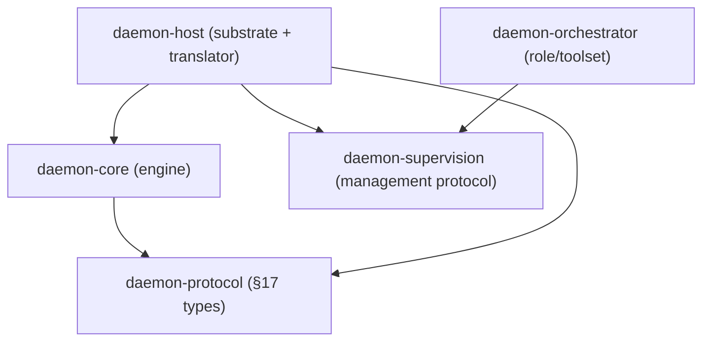

# daemon-supervision — the management protocol specification

The shared, upward-facing contract spoken by **every managed unit** in the daemon tree — engine,
host, or orchestrator. It is `daemon-core`'s §17 host protocol *lifted one level of abstraction*:
§17 is exactly this protocol's **`Engine` leaf profile**.

This spec makes [`daemon-orchestration-synthesis.md`](../research/daemon-orchestration-synthesis.md) §3.1
concrete, mirroring the conventions of `daemon-protocol`/§17 ([`daemon-core-spec.md`](../../crates/engine/daemon-core/docs/daemon-core-spec.md)
§17): lossless-primary event delivery with monotonic `seq`, blocking correlated requests through a
trait (not a side-channel), mandatory `request_id`, `#[non_exhaustive]` enums, an explicit
`wire_version`, and a published CDDL contract for non-Rust clients.

Crate: **`daemon-supervision`** — depended on by `daemon-host` and `daemon-orchestrator`,
**never by `daemon-core`**. The engine depends only on `daemon-protocol` and stays free of the
management protocol; the host is the adapter that translates §17 ↔ the management protocol (§4
publication decision). The canonical crate-dependency graph:



Companion docs: [`daemon-host-spec.md`](daemon-host-spec.md) (the translator + substrate),
[`daemon-orchestrator-spec.md`](daemon-orchestrator-spec.md) (a unit that speaks it both ways),
[`daemon-lifecycle-persistence.md`](daemon-lifecycle-persistence.md) (the snapshot/activation
contract that `Snapshot`/`Outcome` ride on).

---

## 1. Why one protocol

The recursive three-role architecture (synthesis §3) holds together only because the **upward face
is uniform**: a supervisor drives any child — a single conversation, an embedding host, or a
sub-fleet orchestrator — through the *same* four parts. Translation happens in exactly one place,
the host (§5), which collapses the generic protocol to the concrete §17 of one engine. Everything
above the host routes the generic protocol unchanged, so nesting orchestrators (fleets-of-fleets)
needs no new wiring.

The uniform upward face is implemented by **two indistinguishable presenters**
([`daemon-orchestration-synthesis.md`](../research/daemon-orchestration-synthesis.md) §3.2): a **host** presents
the one engine it runs as a `ManagedUnit`, and an **orchestrator** presents an entire sub-tree as a
`ManagedUnit`. A supervisor cannot tell which sits behind the interface — and that opacity is exactly
why nesting needs no new wiring. It also separates two orthogonal structures the reader should keep
distinct: the **logical `ManagedUnit` tree** (the recursion) and the **host tiling** over it, where a
placement/isolation boundary is just a *cut* at which this protocol runs over the wire instead of
in-process.

```text
        ManageCommand  v        ^  ManageEvent / ManageRequest
                 +-----------------------+
                 |   ManagedUnit         |   uniform: Engine | Host | Orchestrator
                 +-----------------------+
```

---

## 2. The four parts

### 2.1 Commands (parent → unit)

```rust
#[non_exhaustive]
enum ManageCommand {
    Assign   { request_id: ReqId, work: WorkRef, budget: Budget }, // hand it a unit of work
    Pause,                                                          // stop scheduling new work; keep state
    Resume,
    Cancel   { reason: Option<String> },
    Scale    { target: Concurrency },        // orchestrator: target child count; leaf: no-op
    Snapshot { request_id: ReqId },           // request a durable checkpoint (returns SnapshotRef)
    Shutdown { drain: bool },                 // drain = finish in-flight work first
}
```

- `WorkRef` is an **opaque work reference**, *never a ticket* (synthesis §4.1): an id plus an
  optional inline payload and a content reference the unit resolves through its own tools/store.
  ```rust
  struct WorkRef { id: WorkId, payload: Option<WorkPayload>, content: Option<ContentRef> }
  ```
  At the engine leaf, `WorkRef` resolves to a `UserMsg` (the `StartTurn` input).
- `Budget` carries the caps a supervisor sets per assignment: iteration/turn caps (§4.2 leaf), wall
  clock, and a cost ceiling (`tokens`/`spend`) governed against the credential authority (§7 / host
  authority).
- `Scale` is meaningful only for orchestrators; an engine leaf treats it (and `Pause`/`Resume`) as a
  no-op, returning `Ack::Unsupported` rather than failing.

### 2.2 Events (unit → parent)

Lossless-primary with a monotonic `seq`, exactly as §17.1 item 1: the in-process and durable
out-of-process paths apply backpressure rather than drop; a lossy live consumer must resync from the
last acked `seq` by reading durable state.

```rust
#[non_exhaustive]
enum ManageEvent {
    Started   { seq: u64, trigger: StartTrigger },
    Progress  { seq: u64, delta: ProgressDelta },     // role-polymorphic (§3)
    Usage     { seq: u64, delta: UsageDelta },         // identical at every level; aggregates up
    RateLimit { seq: u64, snapshot: RateLimitSnapshot },
    Health    { seq: u64, status: HealthStatus },      // drives supervision/restart decisions
    Finished  { seq: u64, outcome: Outcome },           // outcome carries EndReason
    Error     { seq: u64, failure: FailureView },
}

enum StartTrigger { Assigned(WorkId), Resumed, BackgroundCompletion { source: CompletionSource }, ChildEvent }
enum CompletionSource { Delegation(UnitId), Process(ProcId), Child(UnitId) }

struct Outcome { end_reason: EndReason, summary: Option<String>, artifacts: Vec<ArtifactRef> }
enum   EndReason { Completed, Interrupted, BudgetExhausted, Failed(FailureClass) }

enum HealthStatus { Ok, Degraded { reason: String }, Unhealthy { reason: String } }
```

`Usage`/`RateLimit` are **the same type at every level** — an orchestrator's usage is the fold of
its children's. This is why §17 already promoted them to first-class events: they aggregate up the
tree by construction and feed the L4 control charts ([`daemon-orchestrator-spec.md`](daemon-orchestrator-spec.md)).

### 2.3 Requests (unit → parent, blocking + correlated, escalating up)

Like §17.1 item 2, blocking human-in-the-loop / resource requests go through a **trait**, not an
event + side-channel, so request/response stays correlated and typed.

```rust
struct ManageRequest  { request_id: ReqId, kind: ManageRequestKind }
struct ManageResponse { request_id: ReqId, body: ManageResponseBody }

#[non_exhaustive]
enum ManageRequestKind {
    Approval(ApprovalReq),           // "may I run this?"          (leaf: §17 HostRequest::Approval)
    Input(InputReq),                 // "I need input/clarify"
    Choice(ChoiceReq),               // "pick one of N"
    Delegate(Vec<DelegationSpec>),   // "attach me N child units"  — grows the tree (§16.2)
    Escalate(EscalationReq),         // "I can't resolve this — raise to my supervisor"
    Resource(ResourceReq),           // "I need budget / credentials / placement"
}

#[async_trait]
trait ManageRequestHandler: Send + Sync {     // same shape as §17.1 item 2
    async fn request(&self, req: ManageRequest) -> ManageResponse;
}
```

- **`Delegate`** is how the tree *grows* at any level: a leaf asks its host to run child
  engine instances (§16.2); an orchestrator asks for a sub-orchestrator. `DelegationSpec` carries
  the child's `WorkRef`, an attenuated toolset/credential scope (never exceeding the parent's — §7),
  and a `Budget`.
- **`Escalate`/`Resource`** have no §17-leaf analog (an engine cannot escalate above its host). They
  exist so a host or orchestrator that cannot answer locally **re-raises up the chain**, recursively
  to the root — the same correlated trait at every hop.

### 2.4 The unit (as seen by its supervisor)

```rust
#[async_trait]
trait ManagedUnit: Send + Sync {
    fn id(&self) -> UnitId;                          // generalizes §17.3 SessionId
    fn kind(&self) -> UnitKind;                      // Engine | Orchestrator
    async fn command(&self, cmd: ManageCommand) -> Ack;
    fn events(&self) -> EventStream<ManageEvent>;    // lossless-primary; seq-resyncable
    // upward requests flow through a ManageRequestHandler the parent installs at attach time:
    fn install_request_handler(&self, handler: Arc<dyn ManageRequestHandler>);

    // The drill-down + recursive-projection seam (default: a leaf answers only for its own id):
    fn drain_outbound(&self, max: u32) -> Vec<Outbound>;          // this unit's §17 stream
    fn project_subtree(&self) -> Vec<UnitNode>;                   // descendants, flat, children-filled
    fn locate_node(&self, id: &UnitId) -> Option<UnitNode>;       // a descendant's node
    fn locate_events(&self, id: &UnitId, max: u32) -> Vec<ManageEventView>;
    fn locate_outbound(&self, id: &UnitId, max: u32) -> Vec<Outbound>;
    async fn locate_command(&self, id: &UnitId, cmd: ManageCommand) -> Option<Ack>;
}

enum UnitKind { Engine, Orchestrator }
enum Ack { Accepted, Queued, Busy, Unsupported, Rejected { reason: String } }
```

`UnitId` is the durable routing key (it generalizes the §17.3 `SessionId` activation key, §3 of the
lifecycle doc) — supervisors route by `UnitId`, never by a retained handle.

### 2.1 The recursive projection / routing seam

The GUI/TUI manages the whole orchestration through one surface ([`daemon-api`](daemon-host-spec.md)
`ControlApi`) as a **nested tree** — a single agent, a team, fleets-of-fleets — every node
addressable by `UnitId` at any depth. The projection/routing methods above are the recursion vehicle
that makes this work *through orchestrator opacity*: an `Orchestrator` overrides them to forward into
the [`FleetRuntime`](daemon-orchestration-synthesis.md) it owns, so projection and id-routing recurse
uniformly across any nesting (and, at the deferred cross-node cut, a remote-host proxy implements the
same methods over the wire). A leaf keeps the trait defaults (empty / `None`): its own node is built
by the fleet that holds its record (the **authority split** below), so the methods carry only the
*descent*.

- **Authority split.** The fleet that holds a unit's `ChildRecord` is the source of truth for *that*
  unit's status / work / usage (folded from its `ManageEvent` stream). So `project_subtree`/`locate_*`
  never re-derive a node's own record-backed fields; an orchestrator returns its **descendants'**
  nodes and routes id-addressed reads/commands one level down, where the sub-fleet repeats the split.
- **Unique ids.** Each sub-fleet namespaces its minted child ids under its owning orchestrator's id
  (`{orchestrator}/child-N`), so every node in the whole tree is addressable by a *unique* `UnitId`.
- **Projection DTO.** `UnitNode` / `TreeReport` / `UnitState` / `ManageEventView` live in
  `daemon-protocol` (next to the §17 `Outbound`) and are re-exported by `daemon-api`, so this
  management contract carries the projection seam without an edge to the consumer-surface crate while
  the wire mirror (`daemon-api.cddl`) stays unchanged — the same resolution used for `Outbound`.

> **No `Host` unit kind (in-process scope).** A host is the **translator/substrate**, not a managed
> unit: it *presents* the engine(s) it drives as `Engine` units to the supervisor above it (§4,
> [`daemon-host-spec.md`](daemon-host-spec.md) §9). A remote-host **aggregate** kind — where a whole
> remote host appears to its parent as one opaque unit that fans out to its engines — is **deferred
> to the cross-node work** ([`daemon-host-spec.md`](daemon-host-spec.md) §11) and will reintroduce a
> `UnitKind` variant then.

---

## 3. Role-polymorphic payloads

`ProgressDelta` is the one payload that genuinely differs by role; everything else is shared.

```rust
#[non_exhaustive]
enum ProgressDelta {
    // Engine leaf — the §17 fine-grained turn stream:
    Text(String), Reasoning(String), ToolStarted(ToolRef), ToolFinished(ToolResultRef),
    // Orchestrator — fleet-shaped progress:
    ChildStarted(UnitId), ChildFinished { unit: UnitId, outcome: Outcome },
    QueueDepth(u32), GateResult { gate: GateId, passed: bool },
}
```

`Usage`, `RateLimit`, `Outcome`, `HealthStatus`, and every `ManageRequestKind` payload are identical
across roles — that uniformity is what lets telemetry aggregate and requests escalate without
per-role wiring.

---

## 4. §17 as the `Engine` leaf profile

When `kind() == Engine`, every generic type collapses to its concrete §17 form. The mapping is the
binding contract for the host's translation (§5):

| generic (`daemon-supervision`) | §17 leaf (`daemon-core`) | note |
|---|---|---|
| `ManageCommand::Assign { work }` | `AgentCommand::StartTurn { input }` | `work` resolves to a `UserMsg`; the leaf additionally has `Steer` (no generic analog) |
| `Cancel` / `Snapshot` / `Shutdown` | `Interrupt` / `Snapshot` / `Shutdown` | direct |
| `Pause` / `Resume` / `Scale` | — (`Ack::Unsupported`) | no-ops at a single conversation |
| `ManageEvent::Started` | `TurnStarted { trigger }` | `StartTrigger` ⊇ `TurnTrigger` (incl. `BackgroundCompletion`) |
| `Progress { delta }` | `TextDelta` / `ReasoningDelta` / `ToolStarted` / `ToolFinished` | leaf's fine-grained stream |
| `Usage` / `RateLimit` | `Usage` / `RateLimit` | **identical** — §17 already made these generic |
| `Finished { outcome }` | `TurnFinished { summary }` | `outcome.end_reason` = §17.3 `EndReason` |
| `ManageRequestKind` | `HostRequestKind` | §17 = `{Approval, Input, Choice, Delegate}`; leaf lacks `Escalate`/`Resource`/`Health` |

### Who speaks which protocol

| node | upward face | downward face | role |
|---|---|---|---|
| `daemon-core` (Engine) | **§17** | — | leaf |
| `daemon-host` | **management protocol** | **§17** | **translator** — collapses generic ↔ concrete |
| `daemon-orchestrator` | **management protocol** | **management protocol** | pure routing / aggregation / supervision |

**Publication decision (re-export vs adapter).** §17 is published as the management protocol's
`Engine` profile by **adapter translation in the host**, *not* by re-exporting §17 types as the
generic types. Rationale: the engine crate must not depend on `daemon-supervision` (it stays
embeddable and standalone, L1), and the generic enums are `#[non_exhaustive]` supertypes that carry
variants (`Escalate`, `Resource`, `Health`, `Scale`) an engine never produces. The host's adapter is
total in one direction (every §17 message maps up) and partial in the other (generic commands an
engine cannot honor return `Ack::Unsupported`). The mapping table above is the adapter's conformance
spec.

---

## 5. Transport, versioning, schema

- **In-process:** the Rust enums directly (the embedding win — no serialization), exactly as §17
  in-process.
- **Out-of-process:** JSON by default, CBOR negotiated (§6 of the core spec); `ManageEvent`,
  `ManageRequestKind`, and `FailureView` are `#[non_exhaustive]` with serde internally-tagged
  representations and an explicit **`wire_version`**, so adding a variant is non-breaking for clients
  that match with a default arm.
- **CDDL contract.** Like §17.2, the out-of-process management protocol publishes a CDDL schema
  generated/validated against the Rust serde types (round-trip tested with the `cddl` crate), so
  non-Rust supervisors/dashboards have a stable contract while Rust stays the source of truth.
- **Reasoning scrubbing** stays unit-side: `ProgressDelta::Reasoning` is a deliberate separate
  channel, never interleaved into `Text`, so no supervisor can accidentally render it (mirrors §17.2).

---

## 6. Invariants (conformance checklist)

1. Events are lossless-primary with monotonic `seq`; lossy consumers resync from the last acked
   `seq`, never silently skip.
2. Every `ManageCommand` expecting a reply and every `ManageRequest` carries a mandatory `request_id`
   with a **typed per-kind response** (no stringly-typed `Value`).
3. Requests block and escalate up the chain through `ManageRequestHandler`; events do not.
4. `Usage`/`RateLimit` are identical at every level and MUST aggregate up.
5. Supervisors route by `UnitId`, never a retained handle (durable activation key, lifecycle doc §4).
6. `Delegate` attenuates: a child's toolset/credential scope never exceeds its parent's (§7, §16.2).
7. The host adapter MUST satisfy the §4 mapping table for `UnitKind = Engine`.
