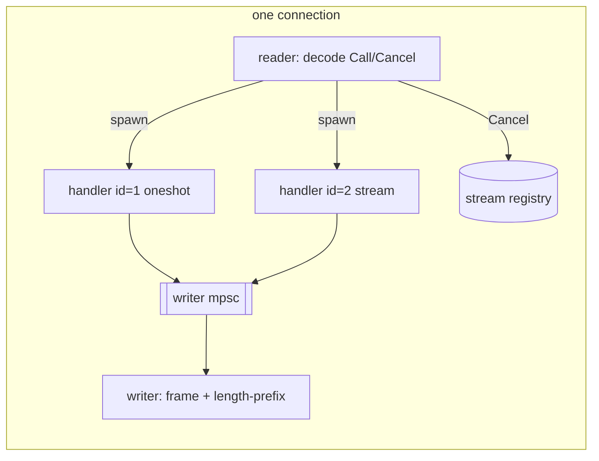
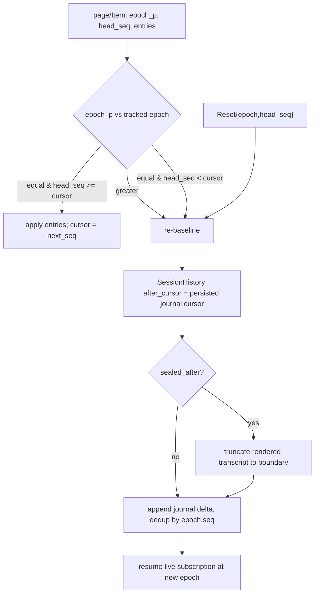
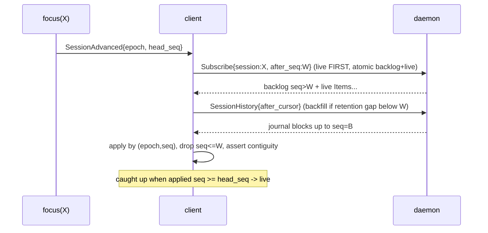
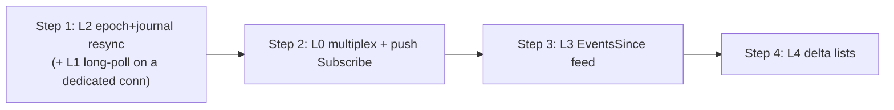

# daemon sync/resync protocol — target design specification

Status: research / design proposal (no code yet).

Companion to [`daemon-host-spec.md`](daemon-host-spec.md) (the Unix-socket host + durable activation),
[`daemon-event-io-spec.md`](../../crates/engine/daemon-core/docs/daemon-event-io-spec.md) (the merged
session log + `subscribe` contract + transport-adapter model), and the authoritative wire contract
[`daemon-api.cddl`](../../crates/contracts/daemon-api/daemon-api.cddl). The client-side consumption
of this protocol is specified in `daemon-app/docs/client-sync-architecture.md`.

This document defines how a thin GUI/TUI client (`daemon-app`) **stays in sync with `daemon-node`
across disconnects, daemon restarts, and focus changes, at minimal bandwidth**. It is the protocol
half; the client architecture half lives in the companion doc. It deliberately does **not** rewrite
the event core (`AgentEvent` + monotonic `seq` + seq-resync is already good per
`daemon-event-io-spec.md` §0); it specifies the *transport, resync, and notification* layers that
sit on top of it.

---

## 0. Conclusions up front (the load-bearing decisions)

1. **The socket must gain a multiplexing envelope and server-streaming.** Today the Unix socket is
   strictly one request → one response per connection with **no correlation id and no push**
   ([`socket.rs`](../../crates/substrate/daemon-host/src/socket.rs) `serve_conn`). A reliable,
   bandwidth-efficient client needs several concurrent long-lived subscriptions (the focused session
   log + a node-wide change feed + any extra watched sessions) *alongside* latency-sensitive
   one-shot commands. A single held request on a single in-flight connection head-of-line-blocks
   everything. The target is a **framed, multiplexed protocol with a per-connection `stream id` and
   server-streaming (push) frames** — the gRPC/HTTP-2 model, and the same capability
   [`daemon-http`](../../crates/adapters/daemon-http/src/lib.rs) already exposes over SSE/WS.
   **Connection-per-stream is an interim**, not the destination (see §2.6).

2. **Resync must be epoch-safe and durable, not cursor-only.** The live merged log is in-memory and
   **resets to `seq = 1` whenever the session actor is (re-)activated** — including on the daemon
   restart that Phase-1 managed-daemon supervision deliberately triggers. A client cursor of `50`
   then silently mismatches a fresh log whose `head_seq = 0`, and nothing detects it. The fix is to
   carry the **`epoch`** that the durable journal already records
   ([`daemon-api.cddl`](../../crates/contracts/daemon-api/daemon-api.cddl) `journal-record.epoch`)
   onto the live `log-page-view`, detect epoch/`head_seq` regressions on the client, and **re-baseline
   from the durable journal** (`SessionHistory` → `Journal`) rather than the volatile live log.

3. **Out-of-focus awareness belongs in one cheap notification feed, not N polls.** A client should
   subscribe in detail only to what it is *looking at*, and learn that *anything else* changed
   (roster, another session advanced, an approval is pending) from a single lightweight
   **`EventsSince{cursor}`** feed carrying notifications **without payloads**, then lazily fetch the
   full data on focus. This is the socket-facing surface of the in-process `fleet_events` /
   `tree_subscribe` bus that exists today but is HTTP-only.

4. **Lists should resync by delta, not full refetch.** Roster/profiles/models/approvals each get a
   monotonic `revision` (or honor the `next_cursor` that `session-page` already returns), so a
   reconnect re-syncs the delta and prunes removed rows, instead of re-pulling whole lists.

5. **Ship reliability first, multiplexing second.** The correctness bugs (§1.4) are fixable with a
   long-poll `Subscribe` + the epoch/journal resync **without** the full multiplexing rework. The
   recommended sequencing is L1+L2 (reliability) → L0 (multiplex/push) → L3 (events feed) → L4
   (delta lists). See §8.

---

## 1. Baseline: what exists today, and where it breaks

### 1.1 Transport — one-shot request/response, no correlation, no push

[`socket.rs`](../../crates/substrate/daemon-host/src/socket.rs) accepts each connection as its own
Tokio task (so multiple *connections* are concurrent) but serves each connection strictly
sequentially:

```rust
// serve_conn: read one framed ApiRequest, dispatch, write one framed ApiResponse, repeat.
while let Some(bytes) = read_frame(&mut stream).await? {
    let response = dispatch(api.as_ref(), request).await;
    write_frame(&mut stream, &to_cbor(&response)).await?;
}
```

Framing is a 4-byte big-endian length prefix + a CBOR `ApiRequest`/`ApiResponse`. There is **no
request-id envelope** — a response carries nothing identifying which request it answers — and the
server **never writes unsolicited frames**. Correlation today lives only *inside* payloads
(`host-request.request_id`), not on the wire.

The client mirrors this with a **single in-flight + FIFO queue**
(`daemon-app/src/core/daemon/node_api_client.{h,cpp}`): at most one request is on the wire; the rest
queue; a 30 s per-request timeout unsticks a silent daemon. Every consumer — the Health heartbeat,
every repository, and every `DaemonTurnEngine` — shares this one client, so they all serialize.

### 1.2 Two logs: a volatile live log and a durable journal

| Layer | Storage | Cursor | Durable across restart? | Wire op |
|---|---|---|---|---|
| **Merged live log** | in-memory `Vec` + `tokio::broadcast` (`node_api.rs` `MergedLog`) | `seq` (monotonic from 1) | **No** — re-created on every actor activation | `Subscribe{session, after_seq, max}` → `LogPage` |
| **Verifiable journal** | SQLite (`SessionStore`) | `cursor` + `epoch` + `sealed_after` | **Yes** | `SessionHistory{session, after_cursor, max}` → `Journal` |

The wire shapes ([`daemon-api.cddl`](../../crates/contracts/daemon-api/daemon-api.cddl)):

```cddl
log-page-view = { "entries": [* session-log-entry], "next_seq": uint, "head_seq": uint }

journal-record   = { "cursor": uint, "segment": uint, "seq": uint, "epoch": uint,
                     "trace": uint, "kind": tstr, "timestamp_ms": uint, "verified": bool,
                     "payload": journal-record-payload-t }
journal-page-view = { "entries": [* journal-record], "next_cursor": uint,
                     "head_cursor": uint, "sealed_after": (uint / null) }
```

Crucially: **`Subscribe`/`log-page-view` does not carry `epoch`, but the durable `journal-record`
already does.** The live log's `page(after_seq, max)` returns *immediately* (no blocking) with
`entries (seq > after_seq)`, `next_seq` = last returned seq (or the input `after_seq` if empty), and
`head_seq` = highest retained seq. `Subscribe` is wire-marshaled `log_after` — the async
`subscribe()` push stream stays an in-process/HTTP capability and is **not** reachable over the
socket.

### 1.3 How the client consumes it today

- **Active turn:** `DaemonTurnEngine` Submits, then **polls `Subscribe` every 120 ms** from
  `m_cursor` (reset to `0` at turn start), advancing `m_cursor = next_seq`. The "stalled" path
  (Phase 1) re-issues the same poll with backoff after a transport failure.
- **Reconnect refresh:** on the transition into `ready`, `app_service_graph.cpp` does a **full**
  refetch — `SessionsQuery` + `ProfileList` (+ N× `ProfileGet`) + `CredentialList` + `Models` +
  `ModelCurrent` + `ApprovalsPending` — edge-triggered (it does not re-fire on a heartbeat that
  merely re-affirms `ready`).
- **Background polls:** Health every 12 s (while ready); `ModelDownloads` every 600 ms (only while a
  download is active); the turn `Subscribe` every 120 ms (only while a turn is active). **Nothing
  polls sessions the user is not viewing.**
- **Cache:** the SQLite client cache persists the roster (read on startup → stale-until-refresh) but
  **`daemon_session_log` and `daemon_sync_cursors` are written but never read**, transcript content
  is not cached, and removed sessions are never purged. `SessionsQuery.next_cursor` is stored and
  never sent back. There is **no delta/ETag/revision layer** anywhere on the client.

### 1.4 The failure modes this spec must fix

1. **Daemon-restart desync (correctness, self-inflicted by Phase 1).** Supervision re-spawns a
   crashed daemon; the live log resets to `seq 1`; the client's `m_cursor` (e.g. `50`) now points
   past a fresh empty log. `Subscribe{after_seq:50}` returns `entries:[]`, `next_seq:50`,
   `head_seq:0`. The turn engine **does not compare `head_seq` to `m_cursor`**, so it polls empty
   pages until the 180 s deadline and the turn dies silently. The durable journal that *could* replay
   it is never consulted.
2. **Busy-poll bandwidth.** Because the socket cannot hold a request, an active-but-idle turn issues
   ~8 empty `LogPage` round-trips/second. Multiply by panes/tabs.
3. **Head-of-line blocking.** All traffic serializes on one in-flight connection, so any future
   long-held request would stall the heartbeat and commands.
4. **No out-of-focus awareness.** The roster only refreshes on a reconnect edge; between reconnects
   it silently goes stale, and there is no way to learn another session changed without polling.
5. **Full-refetch resync.** Every reconnect re-pulls whole lists and cannot prune removed rows.

### 1.5 What is already right (do not regress)

- The event core: typed `AgentEvent`, one monotonic `seq` across both directions, `disposition`
  (`Context` vs `Transport`) as the cache-safety lever, lossless-primary with seq-resync
  (`daemon-event-io-spec.md` §0).
- Focus-scoped detail: the client already subscribes in detail only to the active session.
- A durable journal with `epoch` + `cursor` + `sealed_after` already exists — the resync substrate
  is present; it is simply unused by the client.
- `dispatch` is one-shot and transport-agnostic; this spec adds an envelope *around* it without
  changing the per-call surface, preserving the FFI/in-process callers.

---

## 2. Layer 0 — multiplexed, server-streaming transport

The foundation. Everything else (push subscriptions, the events feed) needs more than one logical
exchange in flight on one connection without head-of-line blocking.

### 2.1 Framed envelope

Keep the 4-byte length prefix. Wrap the existing `ApiRequest`/`ApiResponse` in a tagged envelope so
frames are correlated and can be one-shot *or* streaming:

```cddl
; client -> server
wire-c2s = call / cancel
call   = { "Call":   { "id": stream-id, "req": api-request } }   ; open an exchange
cancel = { "Cancel": { "id": stream-id } }                       ; tear down a stream early

; server -> client
wire-s2c = reply / item / end / reset
reply = { "Reply": { "id": stream-id, "res": api-response } }     ; one-shot result, closes id
item  = { "Item":  { "id": stream-id, "res": api-response } }     ; one stream chunk, id stays open
end   = { "End":   { "id": stream-id, ? "error": (api-error / null) } } ; stream closed
reset = { "Reset": { "id": stream-id, "epoch": uint, "head_seq": uint } } ; re-baseline (see §2.5)

stream-id = uint   ; client-chosen, unique per connection, monotonically increasing
```

- `id` is per-connection and chosen by the client; the server only echoes it. This is the
  correlation envelope §1.1 lacks. It removes the need for the client's single-in-flight constraint:
  many `Call`s can be outstanding, matched by `id`.
- A **one-shot** request (`Submit`, `ProfileList`, …) is a `Call` answered by exactly one `Reply`.
- A **streaming** request (the new streaming `Subscribe`, `EventsSince`) is a `Call` answered by zero
  or more `Item`s and terminated by `End` (clean or error) or by a client `Cancel`.
- The server decides one-shot vs streaming from the request variant; the client knows which it asked
  for. No per-variant flag is needed on the wire.

### 2.2 Server dispatch becomes per-exchange, not per-connection

`serve_conn` changes from "read one, await `dispatch`, write one" to a reader loop that **spawns a
task per `Call`** and a single writer multiplexing `Reply`/`Item`/`End`/`Reset` frames back over the
shared `UnixStream` (writes serialized through an `mpsc` to the writer task). One slow handler no
longer blocks others on the same connection. `dispatch(api, req)` is unchanged for one-shot arms; a
small streaming dispatch path handles the streaming arms (§3) by pumping the in-process broadcast
into `Item` frames.



### 2.3 Concurrency budget — why one extra connection is not enough

A realistic foreground client holds, simultaneously: the focused-session log stream (1), the
node-wide `EventsSince` feed (1), zero-or-more additional watched sessions in a fleet/rooms/multi-pane
view (N), and bursts of latency-sensitive commands that must not queue behind a 25 s held exchange.
A single "second stream connection" provides exactly one held slot and breaks the moment the events
feed and a focused stream coexist. Multiplexing makes the held-exchange count a non-issue: all of the
above share one connection, bounded only by per-stream queues (§2.5).

### 2.4 Capability negotiation (back-compat)

The first frame on a connection is an optional handshake:

```cddl
hello = { "Hello": { "wire_version": uint, "features": [* tstr] } }   ; e.g. ["mux","stream"]
```

- A client that sends `Hello` and gets a `Hello` back uses the envelope.
- A connection whose first bytes decode as a bare `ApiRequest` (no `Hello`) is served in **legacy
  one-shot mode** — the exact current behavior — so the FFI/CLI/old clients keep working unchanged.
  This makes L0 strictly additive on the wire.

### 2.5 Backpressure and lossy re-baseline

Each server-side stream has a bounded outbound queue. The in-process broadcast is lossy for slow
consumers (`broadcast::error::RecvError::Lagged`). When a stream's consumer lags or its queue
overflows, the server does **not** silently skip: it emits a `Reset{id, epoch, head_seq}` and then
resumes from the new high-water mark. `Reset` is the wire signal that the client's cursor for that
stream is no longer trustworthy and it must re-baseline (for a session log: replay from the journal,
§4; for the events feed: refetch the affected list baselines, §5). This makes lossy push **safe**:
the client always learns when it missed something.

### 2.6 Migration interim: connection-per-stream

Until the envelope lands, the client can lift the busy-poll and head-of-line limits partway by
opening a **dedicated socket connection per long-lived exchange** (the server already serves
connections concurrently, §1.1; `ApiClient` already does connection-per-call). Commands stay on the
existing shared client; each long-poll `Subscribe`/`EventsSince` (§3, §5) gets its own connection.
This needs **no wire change** and scales to a handful of FDs — acceptable for a single foreground
client, and the stepping stone to full multiplexing. It is explicitly a bridge, not the end state:
it does not generalize to many watched sessions and duplicates connection/auth setup.

---

## 3. Layer 1 — streaming subscriptions (push primary, long-poll fallback)

The bandwidth fix: the client must stop issuing ~8 empty `LogPage`/s for an idle-but-active turn.
There are two delivery modes; the wire `Subscribe` request gains the parameters for both, and the
transport's capabilities decide which is used.

### 3.1 Push subscription (primary on the multiplexed socket)

Once L0 exists, a streaming `Subscribe` `Call` opens a server-driven stream: the handler attaches to
the session's in-process `broadcast` (the `subscribe()` already implemented in `node_api.rs`,
backlog-from-`after_seq` then live), and emits each batch as an `Item{id, LogPage}` frame as events
occur. No client re-request between events; idle turns cost zero frames. The client tears down with
`Cancel{id}` when the user navigates away. This is exactly what
[`daemon-http`](../../crates/adapters/daemon-http/src/lib.rs) already does over SSE/WS — L0 brings
the same capability to the socket.

### 3.2 Long-poll subscription (fallback + interim + FFI/one-shot transports)

For transports that cannot multiplex (the connection-per-stream interim §2.6, the C FFI, any
one-shot HTTP caller), `Subscribe` gains an optional **`wait_ms`**:

```cddl
request-subscribe = { "Subscribe": {
  "session": session-id, "after_seq": uint, "max": uint, ? "wait_ms": (uint / null) } }
```

- `wait_ms` absent / `0` → today's behavior: return immediately with whatever is past `after_seq`
  (preserves the existing contract; back-compat).
- `wait_ms > 0` → the server **holds** the request, awaiting the broadcast, and returns as soon as
  there is at least one new entry **or** `wait_ms` elapses (an empty page = "still nothing, re-poll").
  `wait_ms` must be chosen below the client request timeout (e.g. 25 s vs the 30 s client timeout) so
  a held poll never trips the timeout. The client loop becomes "issue → apply → re-issue", with no
  120 ms busy timer.

A held long-poll on the **shared single-in-flight** client would block Health/commands — hence
long-poll is only safe on its own connection (§2.6) or under L0 multiplexing. This is the concrete
reason L0/§2.6 is a prerequisite for L1 on anything but a dedicated connection.

### 3.3 Heartbeat and liveness within a stream

A long-lived push stream needs its own liveness so a silently dead socket is detected without the
12 s Health probe (which now shares the connection): the server emits a periodic empty `Item` (or a
keepalive frame) on an otherwise-idle subscription, and the client treats a missing keepalive within
a window as a drop → reconnect (§4). Long-poll mode gets this for free (the `wait_ms` return is the
heartbeat).

### 3.4 What does not change

- The `LogPage` payload shape (`entries`/`next_seq`/`head_seq`, plus the new `epoch`, §4) is identical
  whether delivered by push `Item` or long-poll `Reply`. The decode path is shared.
- `max` still bounds a batch; `0` still means "all available". Push simply removes the *polling*, not
  the paging.
- Per-session scoping is unchanged: a subscription is still `session`-keyed. A client may hold
  **several concurrent per-session streams at once** - one per session it is actively viewing (the
  GUI/TUI opens a tab per session, and a fleet/rooms multi-pane watches more) - each its own
  `stream_id` over the one multiplexed connection (§2.3). The daemon keeps no cross-session
  per-client state, so this is entirely client-driven bookkeeping; the server just serves each
  `session`-keyed stream independently. Awareness of sessions a client is **not** streaming is the
  `EventsSince` feed's job (§5), not a speculative fan-out of session subscriptions.

---

## 4. Layer 2 — epoch-safe, durable resync

The correctness core. It makes "the daemon (or the session actor) restarted under me" a recoverable,
*detected* event instead of a silent stall.

> The cursored-stream contract this layer (and §5/§6) extends — monotonic + non-destructive +
> epoch-stamped + lossy-safe, with the daemon-node conformance inventory of every read/stream/drain
> surface — is stated authoritatively in
> `daemon-node/crates/engine/daemon-core/docs/daemon-event-io-spec.md` §5.4.1. The non-session
> live-surface convergence (drains, fs-watch, cursor vocabulary) is Phase 5 of the implementation
> plan.

### 4.1 The invariant the client needs

A `(epoch, seq)` pair must totally order live log positions, and a regression in either component
must be **observable** so the client can re-baseline. Today the live `log-page-view` exposes only
`seq` (via `next_seq`/`head_seq`), and the only durable order (`epoch`) lives in the journal the
client never reads.

### 4.2 Surface `epoch` on the live log (small, additive)

Add `epoch` to `log-page-view` so every page/stream item self-identifies its generation:

```cddl
log-page-view = { "entries": [* session-log-entry], "next_seq": uint, "head_seq": uint, "epoch": uint }
```

`epoch` is the session-activation generation — the same value the journal already stamps on every
`journal-record` (`journal-record.epoch`). A fresh in-memory log after a restart/reactivation carries
a **strictly greater** `epoch` than the previous incarnation (sourced from the durable store on
activation, so it is monotonic across restarts, not reset).

### 4.3 Client reset detection

On every page/`Item`, the client compares against its tracked `(epoch, cursor)` for that session:

| Observation | Meaning | Action |
|---|---|---|
| `epoch == tracked` and `head_seq >= cursor` | normal continuation | apply entries, advance `cursor = next_seq` |
| `epoch > tracked` | session re-activated (restart, wake) | **re-baseline** (§4.4), then resume at the new epoch |
| `epoch == tracked` but `head_seq < cursor` | live log truncated/reset within the same epoch (should not happen, but defensive) | **re-baseline** |
| `Reset{epoch, head_seq}` frame (§2.5) | server dropped us (lag/overflow) | **re-baseline** from `head_seq` |

This single check closes failure-mode §1.4(1): the busy-poll-until-deadline becomes an immediate,
explicit re-baseline.

### 4.4 Re-baseline from the durable journal, not the volatile log

The live log after a restart is empty (or only carries post-restart events); the **journal** is the
durable, replayable truth. To re-baseline a session the client:

1. Reads the durable transcript via `SessionHistory{session, after_cursor, max}` →
   `journal-page-view`, starting from the **persisted journal cursor** for that session (the last
   cursor it durably rendered, §4.5), paging to `head_cursor`.
2. Honors `sealed_after`: a non-null `sealed_after` marks a rewind/seal boundary (e.g. a
   conversation rewind) — entries after it in the prior epoch are superseded, so the client truncates
   its rendered transcript to that boundary before applying the new tail (this is the existing
   `conversation-rewind-spec` boundary, surfaced for resync).
3. Switches back to the **live** subscription at the new `epoch` for anything past the journal head.

The journal already decodes to consumer-ready `transcript-block`s
(`transcript-block-message`/`-tool-call`/`-tool-result`/`-request`/`-content`), so the re-baseline
renders the same shapes the live path produces — no second rendering model.

### 4.5 Persist and *read* the cursors (wire up the dormant cache)

The client cache already has a `daemon_sync_cursors` table that is written-but-never-read. This spec
makes it load-bearing:

- Persist **two** cursors per session: the live `(epoch, seq)` high-water mark and the durable
  `journal cursor` of the last block durably cached.
- Persist the rendered **transcript** durably (today transcript content is not cached), keyed by
  journal cursor, so a refocus or cold start replays from cache + a short journal delta instead of a
  full re-stream.
- On reconnect/refocus, **read** these cursors to resume incrementally; on `epoch` change, the
  journal cursor (not the live seq) is the resume point.

### 4.6 One cursor/epoch contract shared with Phase 1 and Phase 3

These three mechanisms must agree on cursor semantics or they corrupt each other:

- **Phase 1 turn resume** retries `Subscribe` from `m_cursor` after a transport drop. With L2 it must
  also honor the `epoch`/`Reset` check: a drop that coincides with a restart becomes a re-baseline,
  not a same-cursor retry (this is the precise bug §1.4(1)).
- **Phase 3 HITL park** advances `m_cursor = entry.seq` on a parked `Request` and resumes from there.
  A re-baseline must re-surface an unanswered parked `Request` (it is durable in the journal as
  `transcript-block-request`) so an approval prompt is not lost across a reconnect.
- **Rule:** `after_seq`/`after_cursor` are **exclusive** lower bounds; the client advances a cursor
  only after an entry is *rendered/acted on*; re-baseline replays from the last durably-cached
  journal cursor and de-duplicates by `(epoch, seq)` so already-rendered entries are not doubled.

### 4.7 Resync decision flow



### 4.8 Lazy focus: the snapshot↔stream handoff

When the client lazily focuses a session that is **actively streaming** (the L3 feed only told it
"session X advanced", §5), it must load existing content *and* capture the in-flight generation with
no loss, no gap, and no duplication. This is the snapshot↔stream consistency problem, and it is where
a naive lazy load silently corrupts a transcript. The guarantee decomposes into four properties, each
with a concrete mechanism.

**(a) `(epoch, seq)` is the order *and* the dedup key.** Every live entry — including each individual
`TextDelta` — carries a monotonic `seq` within an `epoch`. The client keeps a per-`(session, epoch)`
**applied-seq watermark `W`** and **applies an entry iff `seq > W`** (then sets `W = seq`). This is
mandatory specifically because streamed deltas are *additive*: re-applying a delta doubles text, so
dedup must be by `seq`, never by content. Apply-once-by-watermark is what makes overlapping sources
safe to stitch.

**(b) Subscribe-first, backfill-second.** The loss bug is snapshot-then-subscribe: read up to `seq=S`,
*then* attach the listener, dropping `S+1..S+k` emitted in the window. The required order is:

```
1. OPEN the live subscription first:  Subscribe{session, after_seq = W}
2. THEN backfill older history:        SessionHistory{after_cursor}
3. Apply both by (epoch, seq), dropping seq <= W
```

The server's `subscribe(after_seq)` computes its backlog (`seq > after_seq`) and attaches the
`broadcast` receiver **under one lock**, so the set `{seq > W}` is captured at the subscription
instant and the live tail continues from exactly there. Therefore any token generated *during* the
subsequent history fetch is already queued in the live stream — the round-trip latency of the
backfill cannot drop it. Open the firehose first, fill in the past behind it.

**(c) The journal is the durable floor; stitch at the journaled `seq`.** The in-memory log is bounded
and may not retain from `seq 1`, so correctness cannot rely on it alone. The durable `journal-record`
carries **both `cursor` and `seq`**, so the last journaled `seq = B` is the exact stitch boundary:
backfill coalesced blocks from the journal up to `B`, then apply live entries with `seq > B`. The
journal stores *coalesced finished blocks* while the live log streams *fine-grained deltas*; they
align because both are seq-stamped and the watermark rule applies only `seq > W`. Neither source alone
is sufficient — the join (durable floor + live edge, keyed by `seq`) is what guarantees the data is
fully loaded.

**(d) A definite "caught up" signal, and explicit loss/restart edges.** The first page reports
`head_seq`; the session is "loading" until applied `seq >= head_seq`, then "live" — a precise
loading→streaming transition, not a guess. Contiguity (`seq == W+1`) detects gaps; a `Reset{epoch,
head_seq}` (lag/overflow, §2.5) or an `epoch` increase (the session re-activated mid-focus) routes to
the re-baseline path (§4.4) rather than silently skipping. A transport drop mid-catch-up resumes
idempotently from `Subscribe{after_seq = W}`.



**Push vs long-poll.** Under L0 push this is zero-gap *by construction* (the atomic attach leaves no
window). On the long-poll interim (§3.2) it is zero-gap *by cursor monotonicity* — always re-issue
`Subscribe{after_seq = W}` advancing `W` only by what was applied — with retention covered by the
journal floor; same correctness, higher latency.

The bandwidth/awareness balance. The client subscribes in *detail* only to what it is looking at
(§3); it learns that *anything else* changed from **one** cheap feed of payload-free notifications,
then fetches detail lazily on focus.

### 5.1 The request and shape

```cddl
request-events-since = { "EventsSince": {
  "cursor": uint, ? "wait_ms": (uint / null), ? "filter": (event-filter / null) } }

node-event = session-advanced / session-meta-changed / roster-changed / fleet-changed
           / approval-pending / download-progress / resync-needed
session-advanced     = { "SessionAdvanced":    { "session": session-id, "epoch": uint, "head_seq": uint } }
session-meta-changed = { "SessionMetaChanged": { "session": session-id, "rev": uint } }
roster-changed       = { "RosterChanged":      { "rev": uint } }
fleet-changed        = { "FleetChanged":       { "rev": uint } }   ; the subagent tree changed -> refetch Tree
approval-pending     = { "ApprovalPending":    { "session": session-id, "request_id": tstr } }
download-progress    = { "DownloadProgress":   { "id": download-id, "pct": uint, "state": tstr } }
resync-needed        = { "ResyncNeeded":       { "scope": tstr } }   ; the feed itself lagged

events-page = { "events": [* node-event], "next_cursor": uint, "head_cursor": uint }
```

Each `node-event` is a **pointer, not a payload**: "session X advanced to (epoch,head_seq)", "roster
is at rev R", "an approval is pending in session Y". The client uses them to update badges, mark a
roster row stale, or — if X is the focused session — nudge its detail subscription. It fetches the
*content* only for what the user can see.

### 5.2 Delivery: push (primary) or long-poll (fallback)

`EventsSince` is a streaming request exactly like `Subscribe` (§3): under L0 it is a push stream of
`Item{events-page}` frames; on the interim/FFI it long-polls with `wait_ms`. One feed per client, not
one per session — this is the key bandwidth property versus fanning out N session subscriptions.

### 5.3 Backed by the in-process bus that already exists

The daemon already maintains the substrate: the `fleet_events` broadcast and the `tree_subscribe`
snapshot/delta stream, and `emit_tree_changed()` is **already called on `session_update_meta`**
(rename/pin/archive) to nudge live subscribers. `EventsSince` is the socket-facing, cursored
projection of that bus into payload-free `node-event`s — the missing socket surface of capability
that is HTTP-only today, and the concrete first slice of user story 04 (channels & events-IO).

### 5.4 Lossy-safe by construction

The bus is lossy for slow consumers. The feed carries a monotonic `cursor`; if the server cannot
serve from the client's `cursor` (it aged out) or the consumer lagged, it emits `ResyncNeeded{scope}`
instead of fabricating events. The client responds by refetching the affected baselines (the roster
list, the focused session via §4) and resuming the feed at `head_cursor`. Missing a notification is
therefore always *detected* and *bounded*, never silent.

### 5.5 What it deliberately does not do

- It does not carry transcript content, tool output, or model tokens — only pointers. Detail always
  comes from `Subscribe`/`SessionHistory` for the focused session.
- It is not a per-session ordering authority; within a session, `(epoch, seq)` from §4 governs. The
  feed only says "go look".

---

## 6. Layer 4 — delta resources & versioning

The last bandwidth/staleness fix: turn the full-refetch-on-reconnect (§1.3) into a delta, and let
the client prune rows that were removed while it was away.

### 6.1 Roster: a revision the feed already references

`RosterChanged{rev}` (§5.1) implies the roster carries a monotonic `rev`. Make `SessionsQuery` honor
it and the already-returned cursor:

```cddl
session-query = { ? "scope": session-scope, ? "after": (session-id / null),
                  ? "limit": uint, ? "since_rev": (uint / null) }
session-page  = { "sessions": [* session-info], ? "next_cursor": (session-id / null),
                  "rev": uint, ? "removed": [* session-id] }
```

- `since_rev` absent → full page (today's behavior; back-compat).
- `since_rev = R` → the server returns only sessions whose state changed after `rev R`, plus a
  `removed` list of ids deleted since `R`, plus the current `rev`. The client applies the delta and
  prunes `removed` (closing the "removed sessions never purged" gap §1.3).
- `next_cursor` is finally **sent back** as `after` for pagination (it is currently stored and
  ignored).

The client's reconnect path then becomes: read persisted `rev` → `SessionsQuery{since_rev: rev}` →
apply delta. Only a cold cache (no `rev`) does a full page.

### 6.2 Generalize the pattern (opt-in per resource)

The same `(rev, since_rev, removed)` shape applies to the other lists that are full-refetched today —
profiles (`ProfileList`), models/catalog, credentials, approvals. Each is independent and can adopt
the delta shape when its list grows enough to matter; until then full refetch is acceptable (these
lists are small). The events feed (§5) already names the per-resource signals
(`SessionMetaChanged`, `RosterChanged`, `ApprovalPending`, `DownloadProgress`) so the client knows
*when* a delta is worth fetching, rather than polling.

### 6.3 Relationship to optimistic concurrency already on the wire

FS and model-file ops already carry a `base_revision` for optimistic concurrency. L4 is the read-side
analogue (a *list* revision for delta reads) and is intentionally separate from those *write*
preconditions; the two should not be conflated. No change to the existing `base_revision` semantics.

### 6.4 Why this is last

It is the smallest correctness lever (full refetch is correct, just wasteful) and depends on the
events feed (§5) to be worth it (without notifications, a delta query still needs a poll to know when
to run). Ship it after L1/L2/L0/L3.

---

## 7. Wire contract deltas, codec & compatibility

### 7.1 Summary of CDDL changes (all additive)

| Layer | Change | Kind |
|---|---|---|
| L0 | `hello`, `wire-c2s` (`Call`/`Cancel`), `wire-s2c` (`Reply`/`Item`/`End`/`Reset`), `stream-id` | new top-level frame types around the existing `api-request`/`api-response` |
| L1 | `request-subscribe` gains `? "wait_ms"` | additive optional field |
| L2 | `log-page-view` gains `"epoch": uint` | additive field (already present on `journal-record`) |
| L3 | `request-events-since`, `node-event` union, `events-page` | new request/response arms |
| L4 | `session-query` gains `? "since_rev"`; `session-page` gains `"rev"` + `? "removed"` | additive fields |

No existing field changes type or meaning; every addition is an optional/new arm. The merged-log and
journal payloads (`session-log-entry`, `transcript-block`, `agent-event`) are untouched.

### 7.2 Codec regeneration impact

The Qt client's vendored zcbor codec is generated from this CDDL (`just update-codec`,
`codec-drift`). New optional fields and new union arms regenerate cleanly; the `wire-s2c`/`wire-c2s`
envelope is a new top-level type the client codec must encode/decode around `ApiRequest`/
`ApiResponse`. Watch the `--default-max-qty` array cap (already lifted 16→64 for model lists) for
`events-page.events` and large `journal-page-view.entries` pages — page these rather than relying on
one giant array. The Rust side adds the envelope + streaming dispatch but `ApiRequest`/`ApiResponse`
serde is unchanged, so existing conformance fixtures stay valid.

### 7.3 Version negotiation & backward compatibility

- `Hello{wire_version, features}` (§2.4) gates the envelope. A connection that does not send `Hello`
  is served in legacy bare one-shot mode (the current behavior), so the C FFI, the operator CLI, and
  any old client keep working with zero changes.
- Within the envelope, optional fields default to current behavior: `wait_ms` absent = immediate
  return; `since_rev` absent = full page. A new client therefore degrades gracefully against an old
  daemon (it simply gets immediate pages / full lists, i.e. today's semantics).
- `wire_version` lets either side refuse or down-negotiate features it does not implement.

### 7.4 Acceptance criteria (extend the existing gates)

- **daemon-node conformance** (`tests/daemon-conformance`): (a) a push `Subscribe` delivers backlog
  then live `Item`s and terminates on `Cancel`; (b) `wait_ms` holds until an event or timeout; (c)
  after a simulated reactivation the live `log-page-view.epoch` increments and `SessionHistory`
  replays the durable transcript with the correct `sealed_after`; (d) `EventsSince` emits
  `SessionAdvanced`/`RosterChanged` and a `ResyncNeeded` on forced lag; (e) `SessionsQuery{since_rev}`
  returns only the delta + `removed`; (f) a legacy (no-`Hello`) connection still round-trips.
- **system-tests** (hermetic): kill+restart the daemon mid-turn and assert the client re-baselines
  from the journal and the turn completes (not a 180 s stall); assert an idle active turn produces no
  busy-poll traffic (frame count bounded); assert a background session change reaches the client via
  `EventsSince` without a focused subscription.
- **Gates unchanged otherwise**: `codec-drift`, `verify-codec`, `conformance`, `just e2e` stay green;
  the legacy path keeps the current fixtures valid.

---

## 8. Rollout / sequencing

Each step is independently shippable and ordered by correctness-value-per-effort, not by layer
number. The layer numbers describe the architecture; this is the build order.



1. **Reliability first (L2, plus L1 long-poll on the §2.6 interim connection).** Add `epoch` to
   `log-page-view`; implement client reset detection + journal re-baseline + persisted-cursor read;
   put the turn `Subscribe` on its own connection in `wait_ms` long-poll mode. This alone fixes the
   daemon-restart desync and removes the 120 ms busy-poll **without** the envelope rework. Highest
   value, smallest surface.
2. **Multiplex + push (L0 + L1 push).** Land the `Hello`/envelope, per-exchange dispatch, and push
   `Subscribe`. Collapses the interim connections into one multiplexed connection and removes the
   long-poll round-trips for the focused session.
3. **Events feed (L3).** Project the in-process bus into the cursored `EventsSince` stream; the client
   gains out-of-focus awareness (badges, roster freshness) at one cheap feed.
4. **Delta lists (L4).** Add `since_rev`/`rev`/`removed` to the roster (then other lists as needed);
   reconnect becomes a delta with pruning.

### 8.1 Open questions for implementation

- **Epoch source of truth on activation:** confirm the activation layer can stamp the live
  `MergedLog` with the journal's next `epoch` so live and durable epochs agree (vs. deriving epoch
  lazily). Owned by `daemon-host` (activation) + `node_api.rs` (`MergedLog`).
- **Per-stream queue depth / lag policy:** the bound at which the server emits `Reset`/`ResyncNeeded`
  vs. blocking the producer — tune against the broadcast capacity.
- **Auth/identity across multiplexed streams:** today auth is per-connection (implicit, local
  socket); confirm the envelope does not need per-`Call` identity for the local-socket case (remote
  hosts may later).
- **FFI/in-process parity:** the FFI path long-polls the same cursor; confirm it consumes `epoch`/
  re-baseline identically so resync semantics are transport-independent (the `daemon-event-io-spec`
  principle "dispatch stays one-shot; transport chooses delivery").
