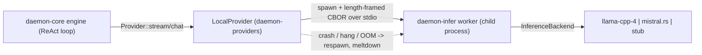
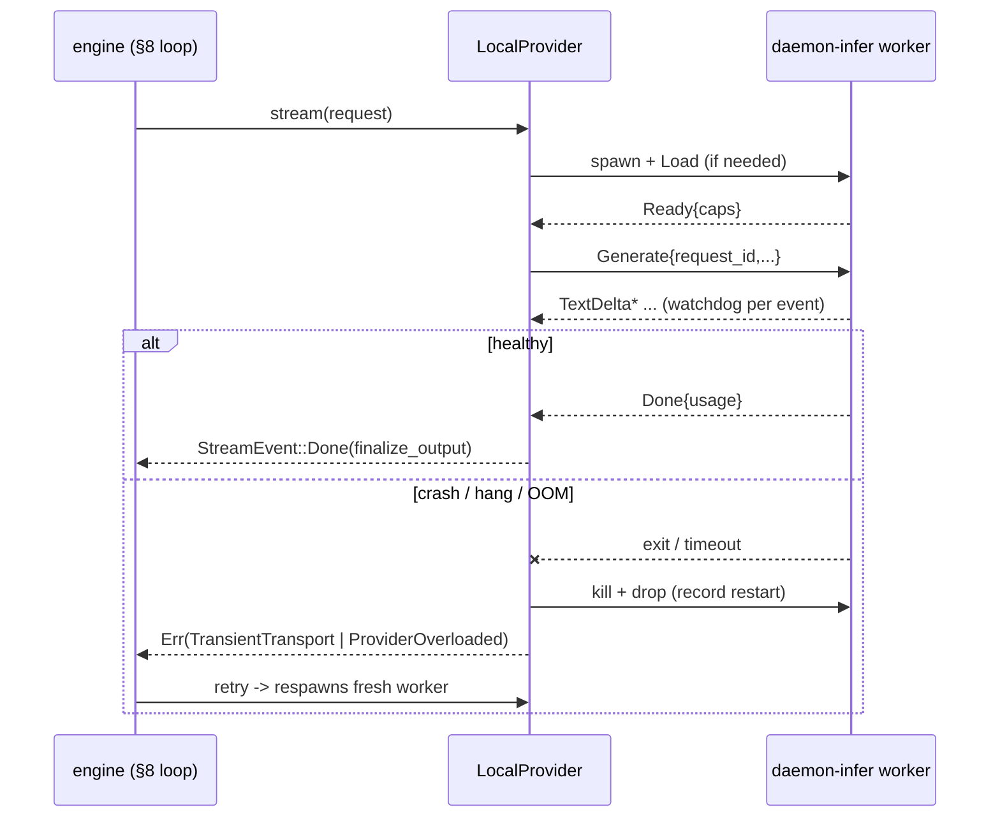

# daemon local inference — supervised worker, protocol, supervision & recovery

This spec documents the **runtime** that lets the daemon run local models (`llama.cpp` via
`llama-cpp-4`, and `mistral.rs`) without putting an engine in-process. It covers the architecture,
the wire protocol, the engine-agnostic `InferenceBackend` seam, the supervision/recovery model, and
the build matrix.

Scope boundary: **model search/download/cache/catalog is out of scope here** — that is owned by the
model-management work ([`model-management-spec.md`](model-management-spec.md)). This document is about
*how a ready model is hosted, supervised, and recovered*, not how its files arrive. `Command::Load`'s
`model` is treated as an already-resolved opaque string (a local GGUF path or an HF id / dir).

Related:
- [`daemon-core-spec.md`](../../crates/engine/daemon-core/docs/daemon-core-spec.md) §7 (the `Provider`
  port), §8 (the `Failure` taxonomy + recovery loop), §9 (tool-call repair / `finalize_output`).
- [`daemon-supervision-spec.md`](daemon-supervision-spec.md) §8 (the restart link this reuses).
- [`mnemosyne-rust-port-spec.md`](../../crates/engine/daemon-core/docs/mnemosyne-rust-port-spec.md) §3
  (the PREFERRED GGUF-embeddings path that reuses this worker).

---

## 1. Why a separate, supervised worker

Local inference engines link large native libraries and run on the GPU, where a driver fault, a VRAM
allocator OOM, a CUDA illegal-access, or a wedged kernel can **crash or hang the whole process**.
Hosting an engine in-process would couple the daemon's durable core to that fault domain. Instead:

- The engine runs in a **separate `daemon-infer` child process** (the *worker*), so a crash takes
  down only the worker.
- The worker is **supervised** by `LocalProvider` (in `daemon-providers`), which respawns it after a
  crash / watchdog kill / OOM and trips a crash-loop **meltdown** to a fatal failure.
- Recovery reuses the existing **§8 `daemon-core` recovery loop**: the worker's classified errors map
  onto the `Failure` taxonomy, so retry/compact/abort decisions are unchanged from the networked
  providers.



---

## 2. Crate layout

- **`crates/providers/daemon-infer`** — the worker (library + binary).
  - `protocol` — engine-agnostic `Command`/`Event` frames + a CBOR codec (§3). Light deps only
    (`serde`/`serde_json`/`ciborium`), so consumers that need just the wire types stay cheap.
  - `backend` — the `InferenceBackend` trait, `GenerateRequest`, `BackendChunk`, `BackendError`, and
    the `StubBackend` fallback (§4).
  - `backends/{llama,mistralrs}` — the feature-gated engine impls (§4).
  - `tooling` — engine-independent, unit-tested tool-call helpers (preamble, parse, JSON-Schema→GBNF)
    (§6).
  - `bin/daemon-infer` — the worker binary: a framed stdio loop dispatching to the selected backend.
- **`crates/providers/daemon-providers`** — `LocalProvider` + the worker supervisor (`src/local.rs`),
  alongside the existing `GenAiProvider`. Depends on `daemon-infer` for the light `protocol` only.
- **`bins/daemon`** — `ProviderKind::{LlamaCpp, MistralRs}` config + `build_providers` wiring (§7).

---

## 3. The wire protocol (`daemon_infer::protocol`)

Length-framed CBOR over the worker's stdio (the native `daemon_provision::CutChannel`,
`Framing::Length`). The `u32`-LE length prefix is owned by the channel; each body is CBOR.

Parent → worker `Command`:
- `Load { engine, model, params }` → answered by `Ready { capabilities }` or `Error`.
- `Generate { request_id, system, messages, tools, sampling, max_tokens }` → a stream of
  `TextDelta`/`ReasoningDelta`/`ToolCall` then `Done { usage }`, or `Error`.
- `Cancel { request_id }` — cooperative cancel of an in-flight generation.
- `Shutdown` — exit cleanly. `Ping` → `Pong`.

Worker → parent `Event`: `Ready`, `TextDelta`, `ReasoningDelta`, `ToolCall`, `Done`, `Error`,
`Pong`, `Health { backend, model_loaded }`.

`ModelParams { n_gpu_layers, n_ctx, n_threads, flash_attn, isq }` and
`Sampling { temperature, top_p, top_k, seed }` are the shared knobs (engine-specific ones optional).

`ErrorClass` is the classified failure carried on `Event::Error` — the single point that maps engine
faults onto the daemon's recovery taxonomy:

| `ErrorClass`      | `daemon_core::Failure`        | §8 recovery        | worker replaced? |
| ----------------- | ----------------------------- | ------------------ | ---------------- |
| `ContextOverflow` | `ContextOverflow`             | compact + retry    | no (prompt issue)|
| `OutOfMemory`     | `ProviderOverloaded`          | retry w/ backoff   | yes (reclaim VRAM)|
| `Transient`       | `TransientTransport`          | retry w/ backoff   | yes              |
| `Fatal`           | `Fatal`                       | abort              | yes              |
| `Cancelled`       | `Cancelled`                   | abort              | no (reusable)    |

The protocol round-trips under CBOR (unit tests in `protocol.rs`).

---

## 4. The `InferenceBackend` seam

One async trait normalizes both engines:

```rust
trait InferenceBackend: Send + Sync {
    fn capabilities(&self) -> Capabilities;
    async fn generate(&self, req: GenerateRequest,
                      tx: UnboundedSender<BackendChunk>,
                      cancel: CancellationToken) -> Result<Usage, BackendError>;
}
```

- **llama (`llama-cpp-4`, feature `llama`)** is synchronous and `!Send`, so the model/context live on
  a **dedicated OS thread**; `generate` enqueues a job (request + chunk sender + cancel token + a
  oneshot for the result) onto that thread, which runs the prefill/decode loop and streams
  `BackendChunk::Text`. `tokio`'s `UnboundedSender` and `CancellationToken` are both usable from the
  sync thread, so no second runtime is needed. Context-full vs allocator OOM are classified onto
  `ErrorClass`; EOG tokens stop generation; cancel is polled each step.
- **mistral.rs (`mistralrs`, feature `mistralrs`)** is async/tokio-native: `Model::stream_chat_request`
  yields `Response::Chunk`s forwarded directly; cancel drops the stream. Phase-1 seam depth = text +
  streaming + recovery; native `Tool`/`ToolChoice`, exact usage, paged-attention and CUDA/Metal perf
  tuning are the Phase-2 `mistralrs-depth` upgrade.
- **`StubBackend`** is compiled when no engine feature is on (the default workspace gate). It loads
  trivially but refuses to `generate` with `ErrorClass::Fatal "no backend"`, so the default build
  drags in **no cmake / no ML tree** and `cargo test --workspace` stays light.

---

## 5. Supervision & recovery (`LocalProvider`)

`LocalProvider` is engine-agnostic — one impl serves both engines (the engine is just a `WorkerConfig`
field). It implements `daemon_core::Provider` (`chat` + streaming `stream`).

- **Lazy spawn**: the worker is spawned on the first generation via `ProcessProvisioner` + `CutChannel`
  (`--engine {llama|mistralrs}`), then `Load`ed; `LocalProvider` blocks until `Ready` (load timeout).
- **Serialized generations**: a single local model is single-stream, so the worker is held behind a
  mutex for the duration of each call; `request_id`s correlate frames.
- **Inner watchdog**: a **time-to-first-token** budget guards the first event and an **inter-token**
  budget guards each subsequent event. A timeout kills the worker and surfaces `TransientTransport`.
- **Crash detection**: a reader task decodes `Event`s into an inbox; on EOF / broken pipe the inbox
  closes, which a generation reads as a mid-stream worker exit (`TransientTransport`).
- **Replace-on-failure**: failures that warrant a fresh process (`TransientTransport`,
  `ProviderOverloaded`, `Fatal`) tear the worker down so the **next call (a §8 retry) respawns it**; a
  `ContextOverflow` keeps the healthy worker (it is a prompt issue), and `Cancelled` leaves it
  reusable.
- **Meltdown**: respawns are counted in a sliding `restart_window`; exceeding `max_restarts` returns
  `Failure::Fatal` instead of fork-bombing the host.



Output assembly reuses the §9 pipeline: streamed deltas are accumulated and run through
`finalize_output` (think-scrub + tool-name/arg repair) for the canonical `ModelOutput` on `Done`.

---

## 6. Tool calling (Phase 1b)

Tool support is engine-independent and built from **pure, unit-tested** helpers in `tooling.rs`:

- `tool_preamble(tools)` — a Hermes-style advertisement injected into the system prompt
  (`<tool_call>{"name":...,"arguments":...}</tool_call>` + the offered tools' schemas).
- `extract_tool_calls(text)` — decodes Hermes blocks (and a bare JSON object) out of generated text,
  returning the cleaned text + `ToolCall`s; names pass through for the daemon's §9 fuzzy repair.
- `tools_to_gbnf(tools)` — a JSON-Schema→GBNF grammar (tool-call wrapper + name alternation + generic
  JSON arguments) for grammar-constrained decoding when a tool call is *required*. Per-parameter
  schema translation is a Phase-2 refinement.

When tools are offered, a backend **buffers** output (rather than streaming live), parses tool calls,
and emits cleaned text + `ToolCall` frames so the markup never leaks into the canonical text.
`llama` advertises via the preamble and parses text (`tool_call_format = HermesXml`,
`supports_native_tools = false`); `mistral.rs` uses the same path in Phase 1b, with native
`Tool`/`ToolChoice` decode arriving in Phase 2.

---

## 7. Configuration & wiring

`bins/daemon` config (`config.rs`) selects a local engine via `DAEMON_MODEL_PROVIDER=llama|mistralrs`
(TOML `model_provider`), with `DAEMON_MODEL` as the resolved model string. A `[local]` TOML table /
`DAEMON_INFER_*` env block tunes the worker:

- `worker_bin` (`DAEMON_INFER_BIN`, default: a `daemon-infer` next to the daemon binary), and the
  `ModelParams` knobs `n_gpu_layers`, `n_ctx`, `n_threads`, `flash_attn`, `isq`, plus `max_tokens`.
- Watchdog/meltdown: `load_timeout`, `ttft_timeout`, `inter_token_timeout` (all `*_MS` env), and
  `max_restarts` / `restart_window`.
- `WorkerConfig.env` forwards extra child env (e.g. `CUDA_VISIBLE_DEVICES`).

`build_providers` constructs **one** `LocalProvider` and shares it (cloned `Arc`) across every
profile, so a single local model lives in VRAM once and serializes generations. `Mock` remains the
zero-config default; the local kinds are opt-in.

---

## 8. Build matrix

The default workspace build (and CI gate) compiles only the **stub** worker — no engine, no cmake, no
ML tree — keeping `cargo test --workspace` fast and host-agnostic. Engines are opt-in features on the
`daemon-infer` crate, each forwarding to the underlying crate's hardware feature:

| feature           | engine        | accelerator        |
| ----------------- | ------------- | ------------------ |
| `llama`           | llama-cpp-4   | CPU (OpenMP)       |
| `cuda`            | llama-cpp-4   | NVIDIA CUDA        |
| `vulkan`          | llama-cpp-4   | Vulkan             |
| `hip`             | llama-cpp-4   | AMD ROCm           |
| `metal`           | llama-cpp-4   | Apple Metal        |
| `opencl`          | llama-cpp-4   | OpenCL             |
| `mistralrs`       | mistral.rs    | CPU                |
| `mistralrs-cuda`  | mistral.rs    | NVIDIA CUDA        |
| `mistralrs-metal` | mistral.rs    | Apple Metal        |

`llama-cpp-4` is a `llama-cpp-2` fork that tracks upstream llama.cpp closely (TurboQuant KV-cache
quantization, GBNF grammar, native GGUF embeddings); we own the feature matrix in-tree and can switch
back to `llama-cpp-2` if/when changes merge upstream.

**Toolchain (`flake.nix`):** the default dev shell carries `cmake`/`clang`/`libclang` (`LIBCLANG_PATH`
for bindgen), plus optional `.#vulkan` / `.#cuda` shells. The default `cargo test --workspace` never
enables an engine feature, so it never invokes cmake.

**Compile-verifying an engine lane** — build it through crane, not raw `cargo`. The flake exposes
`packages.daemon-infer-llama` and `packages.daemon-infer-mistralrs` (`craneLib.buildPackage` with
`--features {llama,mistralrs}` + the engine `nativeBuildInputs`); `nix build .#daemon-infer-llama`
compiles llama.cpp from source and type-checks the backend glue against the real engine APIs. This is
the *only* way that works on NixOS: the `cmake` crate runs GNU `make`, which hardcodes `/bin/sh` — a
path NixOS does not provide — so a raw `cargo build --features llama` in the dev shell fails the
cmake C-compiler probe, whereas the nix build sandbox supplies `/bin/sh` and a full stdenv. (Note: a
flake build only sees git-tracked files, so newly added sources must be `git add`-ed before
`nix build` can compile them.)

**Build-matrix shrinking:** `llama-cpp-4`'s `prebuilt` feature links a pre-built llama.cpp from
`$LLAMA_PREBUILT_DIR` instead of compiling it per-lane — point it at a cached build to drop the cmake
step in CI.

---

## 9. Testing

- **protocol** — CBOR round-trip unit tests (`protocol.rs`).
- **tooling** — pure-function unit tests for preamble / parse / GBNF (`tooling.rs`), run in the default
  (no-engine) build.
- **supervision/recovery** — a scripted `fake-infer-worker` bin speaks the real protocol; the
  `daemon-providers` integration tests cover streaming deltas, tool-call decode, worker-crash →
  restart → retry, hang → watchdog kill → restart, crash-loop → `Fatal` meltdown, and a fatal load —
  **with no engine compiled**, so the full recovery surface is verified host-agnostically.
- **engine backends** compile only in their feature lanes (require cmake/clang); the CPU lanes are
  compile-verified with `nix build .#daemon-infer-llama` and `nix build .#daemon-infer-mistralrs`
  (which type-check the backend glue against the real `llama-cpp-4` / `mistral.rs` APIs), and the
  accelerator variants run in dedicated CI lanes, not the default gate.

---

## 10. Deferred / follow-ups

- **Phase 2 `mistralrs-depth`** — native `Tool`/`ToolChoice` decode, exact token usage, paged-attn,
  CUDA/Metal + flash-attn perf tuning, full `ModelParams` honoring.
- **Embeddings (DONE for llama; mistral.rs deferred)** — the protocol now carries `Command::Embed` /
  `Event::Embeddings` and `ModelParams.embeddings`; `InferenceBackend::embed` has a default (reject)
  with the **llama** backend implementing pooled GGUF embeddings (`LlamaContextParams`
  `with_embeddings(true)` + `with_pooling_type(Mean)` + `embeddings_seq_ith`, L2-normalized). The
  worker bin dispatches `Embed` on a task; `daemon-providers::LocalEmbedder` drives it and Mnemosyne
  consumes it via the `daemon-core::EmbeddingProvider` seam (no `ort`/`fastembed`). **Remaining:** the
  mistral.rs backend's `embed` currently returns a clear error — wiring its `EmbeddingModelBuilder`
  path is the follow-on. See
  [`mnemosyne-rust-port-spec.md`](../../crates/engine/daemon-core/docs/mnemosyne-rust-port-spec.md) §3.
- **Model acquisition** — owned by the model-management work
  ([`model-management-spec.md`](model-management-spec.md)); `Command::Load` consumes its resolved
  output.
