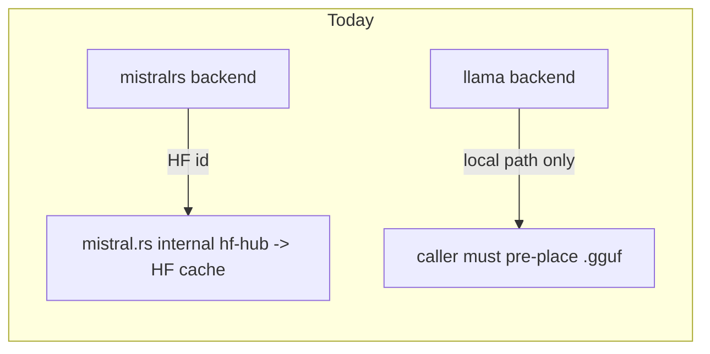
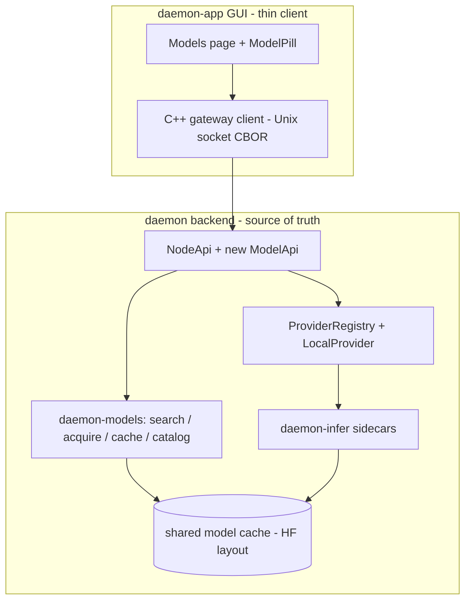
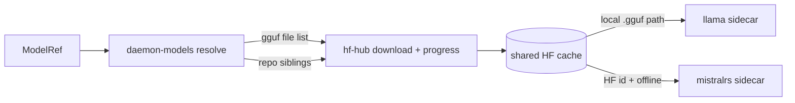
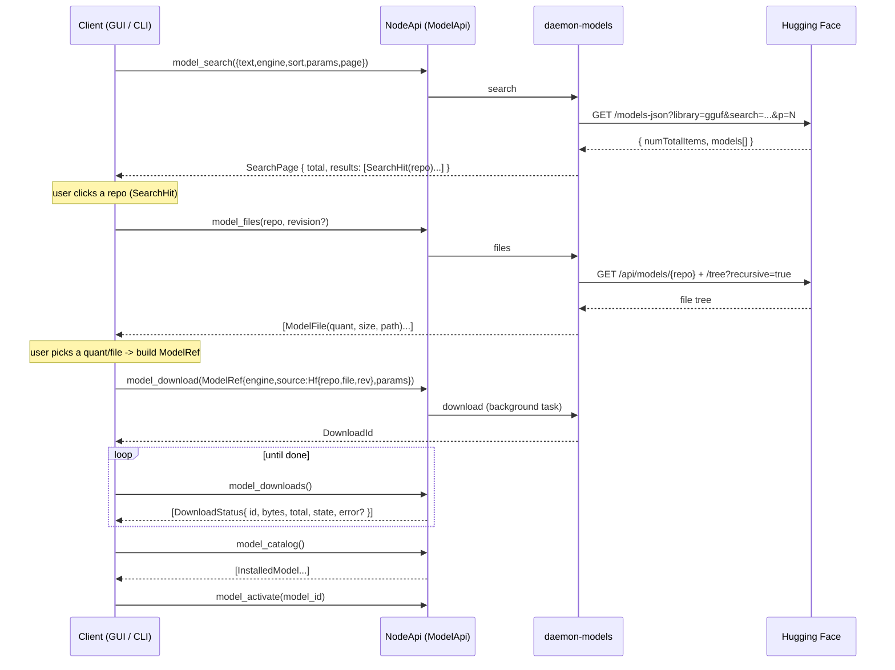

# daemon model management — search, download, cache, and local-inference parity

This spec defines how the daemon system unifies **model search, downloading, caching, and usage**
across the two local inference engines (`mistral.rs` and `llama-cpp-4`), and where each
responsibility lives across `daemon` (Rust backend) and `daemon-app` (Qt/QML GUI).

It is a design document intended to inform implementation. It maps the current state with file/line
references, identifies the parity gaps, and proposes the target architecture.

Scope: model discovery (Hugging Face), acquisition (download + resume + cache), the catalog/registry
of installed models, and the wiring that hands a ready model to each backend. Remote providers
(genai) are in scope only where they touch the shared provider/config surface.

Related:
- [`daemon-host-spec.md`](daemon-host-spec.md) — durable substrate, NodeApi implementation home.
- [`daemon-orchestrator-spec.md`](daemon-orchestrator-spec.md) — `ModelRef` concept (currently doc-only).
- [`../../crates/contracts/daemon-api/src/lib.rs`](../../crates/contracts/daemon-api/src/lib.rs) — the `NodeApi` surface.
- [`../../research/mistral-rs-feature-analysis.md`](../../research/mistral-rs-feature-analysis.md) — mistral.rs download/quant analysis.

---

## 1. Current state

### 1.1 The local-inference sidecar (`daemon-infer`)

`daemon-infer` is a library plus a supervised sidecar binary that speaks **length-framed CBOR over
stdio**. The parent (`LocalProvider`) spawns it with `--engine {llama|mistralrs}` and drives it with
`Command::Load`/`Command::Generate`.

- Protocol types: [`crates/providers/daemon-infer/src/protocol.rs`](../../crates/providers/daemon-infer/src/protocol.rs:174-265).
  - `Command::Load { engine, model, params }` — `model` is an **opaque string**: a local GGUF path
    (llama) or an HF id / local dir (mistral.rs): `protocol.rs:177-182`.
  - `ModelParams { n_gpu_layers, n_ctx, n_threads, flash_attn, isq }`: `protocol.rs:73-84`.
- Backend trait `InferenceBackend { capabilities(), generate() }`:
  [`crates/providers/daemon-infer/src/backend.rs`](../../crates/providers/daemon-infer/src/backend.rs:99-111).
  There is **no `load`/`embeddings`/`unload` trait method**; loading is a free function per backend.
- Dispatch by engine + compile feature: [`crates/providers/daemon-infer/src/backends/mod.rs`](../../crates/providers/daemon-infer/src/backends/mod.rs:17-52).
- llama backend loads **local file only** via `LlamaModel::load_from_file`:
  [`crates/providers/daemon-infer/src/backends/llama.rs`](../../crates/providers/daemon-infer/src/backends/llama.rs:113-125).
- mistralrs backend hands the string straight to `TextModelBuilder::new(model)`:
  [`crates/providers/daemon-infer/src/backends/mistralrs.rs`](../../crates/providers/daemon-infer/src/backends/mistralrs.rs:30-40).

Gaps in this crate today: no download, no search, no cache, no load/download progress events.
`Event::Health` is defined (`protocol.rs:259-264`) but never emitted; mistralrs ignores most
`ModelParams` and reports stub token usage (`mistralrs.rs:108-113`).

### 1.2 Engine download capability (the core asymmetry)

- **mistral.rs auto-downloads from HF Hub** by repo id, using the `hf-hub` crate, into the standard
  HF cache (`HF_HUB_CACHE` -> `HF_HOME/hub` -> `~/.cache/huggingface/hub`). See
  [`../../research/mistral-rs-feature-analysis.md`](../../research/mistral-rs-feature-analysis.md)
  (resolver `mistral.rs/mistralrs-core/src/pipeline/hf.rs:731-759`, cache `:129-150`).
- **llama-cpp-4 0.3.2 cannot download.** `LlamaModel::load_from_file` / `load_from_splits` take a
  filesystem path only. The HF/URL download (`common_download_model`, `-hf`) lives in vendored
  llama.cpp `common/` C++ and is **neither built** (`LLAMA_BUILD_COMMON=OFF` unless `mtmd`) **nor
  bindgen-exposed**.
  - `~/.cargo/registry/src/index.crates.io-*/llama-cpp-4-0.3.2/src/model.rs:1412-1433`
  - `~/.cargo/registry/src/index.crates.io-*/llama-cpp-sys-4-0.3.2/build.rs:1366-1378,1688-1694`

Implication: if we let each engine fetch its own way, we get **two cache locations, two download
mechanisms, and no unified progress/search**. Unification requires daemon to own acquisition.



### 1.3 The node, providers, and NodeApi

- `NodeApi = SessionApi + ControlApi`; it is the session/orchestration/control surface and exposes
  **no providers, models, or inference config**:
  [`crates/contracts/daemon-api/src/lib.rs`](../../crates/contracts/daemon-api/src/lib.rs:146-148),
  request mirror `ApiRequest` at `:308-407`.
- Transport: framed CBOR over a Unix socket; `daemon-cli` is the reference client.
  [`crates/substrate/daemon-host/src/socket.rs`](../../crates/substrate/daemon-host/src/socket.rs:14-44),
  [`bins/daemon/src/main.rs`](../../bins/daemon/src/main.rs:164-168).
- Inference is abstracted by `daemon_core::Provider` + `ProviderRegistry`, selected at node assembly:
  [`crates/engine/daemon-core/src/provider.rs`](../../crates/engine/daemon-core/src/provider.rs:229-283).
- Remote: `GenAiProvider` (genai): [`crates/providers/daemon-providers/src/genai_provider.rs`](../../crates/providers/daemon-providers/src/genai_provider.rs:19-31).
- Local: `LocalProvider` exists but is **not wired into the host**; `build_providers` only handles
  mock/openai/anthropic and there is no `ProviderKind::Local`:
  [`bins/daemon/src/main.rs`](../../bins/daemon/src/main.rs:65-105),
  [`bins/daemon/src/config.rs`](../../bins/daemon/src/config.rs:47-54).
- Models are referenced as **plain strings** in config (`DAEMON_MODEL` / TOML `model`):
  [`bins/daemon/src/config.rs`](../../bins/daemon/src/config.rs:201-207). No catalog/search/download/
  cache at node level. `ModelRef` exists only in a spec doc, not in code.

### 1.4 The GUI (`daemon-app`)

- Qt 6 QML/C++; **no live link** to the daemon backend yet (no FFI/cxx/Cargo/socket client).
  Integration seam is `EditorController::ingestEvents()` fed today by a mock `TurnSimulator`:
  `daemon-app/src/DaemonApp/BlockEditor/core/agent_ingest.h:12-16`,
  `daemon-app/src/DaemonApp/Transcript/TurnSimulator.qml:3-7`.
- Model UI is cosmetic only — `ModelPill.qml` shows a canned list with no backend:
  `daemon-app/src/DaemonApp/Composer/ModelPill.qml:6-21`.
- No HuggingFace / search / download / cache code anywhere in `daemon-app`.

### 1.5 The reference implementation (`daemon-q1-2026`)

The previous Qt app implemented the full HF flow in C++/QML with `QNetworkAccessManager` (no Rust):

- Search: `GET https://huggingface.co/models-json?library=gguf&...` with header
  `X-Requested-With: XMLHttpRequest`:
  `daemon-q1-2026/apps/daemon/src/core/services/HuggingFaceService.cpp:13-46,153-156`.
- File tree: `GET /api/models/{id}` + recursive `/api/models/{id}/tree/main/?recursive=true&limit=1000`
  (paginated), GGUF-only, resolve URL `https://huggingface.co/{id}/resolve/main/{path}`:
  `HuggingFaceService.cpp:323-434`, `HFModelFilesVM.cpp:174-192`.
- Download: `ModelAcquisitionService` -> `DownloadManagerService` with staging dir, resumable `.part`
  via HTTP `Range`, manual HF 302 redirect handling, GGUF magic validation, atomic rename,
  split-GGUF merge, mmproj auto-match:
  `ModelAcquisitionService.cpp:507-687`, `DownloadManagerService.cpp:341-455,517-699`.
- Cache/registry: install dir = first configured model dir; staging under
  `AppDataLocation/downloads/models/{groupId}`; SQLite tables `download_manager_state_v1`,
  `model_acquisition_state_v1`, `models`, `gguf_scan_cache`; dedupe by filename + GGUF magic;
  `ModelService.refresh()` scans and registers (id = SHA256 of path):
  `ModelService.cpp:125-129,353-357`, `Migrations.sql:343-380,739-751`.

This is the feature bar for parity. The key architectural change for the rewrite: this logic moves
**out of the GUI and into the daemon backend**, behind NodeApi (see §3).

---

## 2. Goals and the parity gap

1. One model **search** path (HF discovery) usable by any client.
2. One model **download + cache** path, shared by both engines, with progress and resume.
3. One model **catalog/registry** (what is installed, where, for which engine).
4. **Feature parity** between `mistral.rs` and `llama-cpp-4` for download and usage.
5. A clear split: what `daemon` owns vs what `daemon-app` owns.

Parity gap summary:

- llama cannot self-download; mistral.rs can. -> daemon must own download so both behave identically.
- mistral.rs uses safetensors repos (+ optional ISQ/UQFF); llama uses a single GGUF file from a repo.
  -> the unified model reference must distinguish "whole repo" vs "specific file".
- No structured progress for either engine today. -> daemon emits progress; GUI renders it.

---

## 3. Responsibility split (the central decision)

Recommendation: **`daemon` owns search, download, cache, and catalog; `daemon-app` is a thin client
that only renders and calls NodeApi.** This includes search (contrary to doing search in the GUI as
the old app did).

Rationale:
- The system's stated invariant is "one canonical NodeApi surface; many transports"
  ([`daemon-api/src/lib.rs`](../../crates/contracts/daemon-api/src/lib.rs:1-15)). Putting model
  management behind NodeApi lets `daemon-cli`, automations, and headless deployments reuse it, not
  just the GUI.
- Download **must** live in daemon regardless (it owns the cache and feeds the sidecars). Keeping
  search next to download avoids split-brain: search returns a repo, and acquisition immediately
  needs that repo's file tree — both are the same HF API surface.
- A single cache shared with mistral.rs requires daemon-side control of the cache dir and the
  `hf-hub` client (§4.2). The GUI cannot own that.
- The GUI stays portable and testable; it never embeds HF endpoints or auth.

Trade-off acknowledged: the old app did search in the GUI with `QNetworkAccessManager` and it worked.
Doing search in `daemon-app` would keep HF traffic off the backend and reduce NodeApi surface, but it
splits the model story across two codebases and duplicates auth/proxy handling. We choose backend
ownership for consistency; if a future requirement needs GUI-side search (e.g. offline daemon), it
can be added without disturbing the download/cache contract.



---

## 4. Target architecture (daemon backend)

### 4.1 New crate: `daemon-models`

A new crate (proposed `crates/providers/daemon-models`) owns model discovery, acquisition, cache, and
catalog. Async (Tokio), using `reqwest` for HF JSON APIs and `hf-hub` for downloads (the same crate
mistral.rs uses, so the cache layout is shared). Responsibilities:

1. **Search** — `models-json` query (port of `HuggingFaceService`), returning catalog rows.
2. **File tree** — `/api/models/{id}` + recursive tree; filter by engine (GGUF for llama; full repo
   for mistral.rs); build resolve URLs.
3. **Resolve** — turn a `ModelRef` (§4.3) into the concrete files to fetch for the target engine.
4. **Acquire** — download via `hf-hub` into the shared cache; resumable; emit progress; handle
   split-GGUF and mmproj; validate GGUF magic.
5. **Catalog/registry** — persistent manifest (SQLite via the existing store, or a JSON index) of
   installed models: id, engine, source (repo/file/revision), quant, size, path, last_used.
6. **Cache lookup** — dedupe / detect already-present (mirrors old app's filename+magic check).

It depends on `daemon-infer` (protocol, `default-features = false`) for `Engine` and `ModelParams`.

### 4.2 Cache strategy (single cache, no double download)

Use **one cache root**, defaulting to the standard HF cache (`HF_HOME` / `HF_HUB_CACHE`), so that
daemon's `hf-hub` downloads and mistral.rs's internal loads share the same files. Configurable via
daemon config (§4.6).

All downloading is done by `daemon-models` using the **`hf-hub` crate directly**. We do **not** call
into the `mistral.rs` crate to acquire models, and we do not reimplement its download path: we depend
on the same crate (`hf-hub`) and the same cache convention it already uses
(`research/mistral.rs/mistralrs-core/src/pipeline/hf.rs:129-150`), so the files we fetch land exactly
where `mistral.rs` will look for them. The only things ported from `mistral.rs` are small helpers/
patterns — its cache-dir precedence and its repo-listing approach (`probe_hf_repo_files`,
`hf.rs:818-840`) — not its loader.

Per-engine acquisition:
- **llama (GGUF)**: daemon resolves the specific `.gguf` (+ split parts + optional mmproj) and
  downloads via `hf-hub`, then passes the **local path** to the sidecar. (Required — llama cannot
  download.)
- **mistral.rs**: daemon **pre-warms** the shared HF cache for the repo via `hf-hub` (listing repo
  siblings, downloading each, emitting progress), then hands the sidecar the **HF id** unchanged
  (`TextModelBuilder::new("<org/repo>")`, as today). Because the cache is shared and already
  populated, `mistral.rs` loads from cache without re-downloading.

  To make "no network at load" airtight, the **mistralrs sidecar process is spawned with two env
  vars**:
  - `HF_HUB_OFFLINE=1` — `mistral.rs` honors this (`is_hf_hub_offline()`, `hf.rs:26-40`); `get_file()`
    then resolves from the cache only and never contacts HF (`hf.rs:746-754`). Without it, `mistral.rs`
    would still make a network round-trip to check revisions/ETags and print its own progress bar.
  - `HF_HOME` (or `HF_HUB_CACHE`) — set to the daemon-configured cache root so the engine resolves the
    same directory `daemon-models` populated. `daemon-models` builds its `hf-hub` `Api` with that same
    cache dir. Both sides must agree or the engine would see an empty cache and (in offline mode) fail.

  (Alternative considered and rejected: pre-download into a self-managed snapshot dir and pass that
  local path. Cache-warming + HF id keeps `mistral.rs`'s normal resolution — chat template, tokenizer,
  quant config — unchanged and avoids us maintaining a valid repo dir by hand.)

This yields one downloader, one cache, and unified progress for both engines, while each engine still
loads the artifact shape it expects.



### 4.3 Unified model reference type

Define a shared `ModelRef` (proposed in `daemon-common` or a small contract crate so node, infer, and
api agree). Shape:

- `engine: Engine` (`Llama` | `MistralRs`) — reuse `daemon_infer::protocol::Engine`.
- `source`:
  - `Hf { repo: String, file: Option<String>, revision: String }` — `file` set for GGUF, `None` for a
    whole mistral.rs repo.
  - `Local { path: PathBuf }`.
- `params: ModelParams` and optional `quant`/`isq` hints.

The installed-catalog entry extends this with `id`, `display_name`, `size_bytes`, `installed_path`,
`last_used` (informed by the old `ModelDescriptor`, `ModelDescriptor.h:8-27`).

### 4.4 NodeApi additions: a `ModelApi` sub-surface

Add a third sub-surface composed into `NodeApi` alongside `SessionApi`/`ControlApi`
([`daemon-api/src/lib.rs`](../../crates/contracts/daemon-api/src/lib.rs:146-148)). This surface does
not exist yet — it is defined here for the first time. The trait (sketch):

```rust
#[async_trait]
pub trait ModelApi: Send + Sync {
    // Discovery (Hugging Face)
    async fn model_search(&self, query: SearchQuery) -> Result<SearchPage, ApiError>;
    async fn model_files(&self, repo: String, revision: Option<String>)
        -> Result<Vec<ModelFile>, ApiError>;
    // Acquisition
    async fn model_download(&self, model: ModelRef) -> Result<DownloadId, ApiError>;
    async fn model_downloads(&self) -> Vec<DownloadStatus>;
    async fn model_cancel(&self, id: DownloadId) -> Result<(), ApiError>;
    async fn model_pause(&self, id: DownloadId) -> Result<(), ApiError>;
    async fn model_resume(&self, id: DownloadId) -> Result<(), ApiError>;
    // Catalog + lifecycle
    async fn model_catalog(&self) -> Vec<InstalledModel>;
    async fn model_delete(&self, id: ModelId) -> Result<(), ApiError>;
    async fn model_activate(&self, id: ModelId) -> Result<(), ApiError>;
}
```

The request/response payload types (in `daemon-common`, §4.3):

```rust
pub struct SearchQuery {
    pub text: String,             // free-text; empty = browse
    pub engine: ModelEngine,      // Llama | MistralRs -> sets library filter (gguf vs all)
    pub sort: SearchSort,         // Trending | Downloads | Likes | Modified | Created
    pub min_params: Option<u64>,  // -> num_parameters "min:..,max:.."
    pub max_params: Option<u64>,
    pub page: u32,                // 0-indexed (HF `p`)
}

pub struct SearchPage {
    pub total: u64,               // HF numTotalItems
    pub page: u32,
    pub results: Vec<SearchHit>,  // one row per repo
}

pub struct SearchHit {           // a Hugging Face repo, not yet a downloadable artifact
    pub repo: String,            // "org/name"
    pub author: String,
    pub downloads: u64,
    pub likes: u64,
    pub num_parameters: Option<u64>,
    pub pipeline_tag: Option<String>,
    pub last_modified: Option<String>,
    pub gated: bool,
    pub private: bool,
}

pub struct ModelFile {           // a concrete downloadable file within a repo
    pub path: String,            // repo-relative, e.g. "model-Q4_K_M.gguf"
    pub size_bytes: u64,
    pub quant: Option<String>,   // parsed from filename, e.g. "Q4_K_M"
    pub is_split: bool,          // part of a *-00001-of-00007.gguf set
    pub resolve_url: String,     // https://huggingface.co/{repo}/resolve/{rev}/{path}
}
```

Each method gets an `ApiRequest`/`ApiResponse` variant and a CDDL entry
([`daemon-api/daemon-api.cddl`](../../crates/contracts/daemon-api/daemon-api.cddl)), and is
implemented on `NodeApiImpl`
([`crates/substrate/daemon-host/src/node_api.rs`](../../crates/substrate/daemon-host/src/node_api.rs:59-73))
delegating to a `daemon-models` service handle. Progress is pollable via `model_downloads()` (no new
streaming transport needed); a future `ModelEvent` poll can be added if push is required.

### 4.4.1 How a client searches and then selects for download

Search and selection are **two steps**, mirroring the old app: `model_search` returns *repos*, and
`model_files` returns the *downloadable files* (quant variants) inside a chosen repo. The client
assembles a `ModelRef` from those two answers and submits it to `model_download`.



Engine-specific selection detail:
- **llama / GGUF**: `model_files` returns one `ModelFile` per `.gguf` (quant). The user picks a quant;
  the `ModelRef.source` is `Hf { repo, file: Some("model-Q4_K_M.gguf"), revision }`. Split sets and a
  matching `mmproj` are resolved automatically at download time (the user picks the primary file only).
- **mistral.rs**: the whole repo is the unit. `model_files` is informational (sizes/quant config);
  selection sets `ModelRef.source = Hf { repo, file: None, revision }`, optionally with an `isq` hint.

For a "paste a URL/repo id" path (old app parity), the client can skip `model_search` and call
`model_files` directly with a repo id, or construct a `ModelRef` from a `resolve/...gguf` URL.

The GUI binding (out of scope here, §5) is then: a results list bound to `SearchPage.results`, a
file-picker popup bound to `model_files`, and a downloads view polling `model_downloads()` — the same
three-screen flow the old app used, but fed by NodeApi instead of direct HTTP.

### 4.5 Provider wiring (per-profile mixed providers)

Decision: providers are selectable **per profile**, so a fleet can mix remote and local — e.g. a
remote (Anthropic/OpenAI) `orchestrator` profile with local-model `child` leaves, or vice versa. The
local model is just another provider option, and `model_activate` chooses which `ModelRef` backs the
local provider(s).

- Replace the single boot-time `ProviderKind` with a **per-profile provider map** in config: each
  profile name (`orchestrator`, `child`, or any named profile) maps to a provider spec that is either
  `Remote { adapter, model, endpoint? }` (genai) or `Local { engine, model: ModelRef }`. This builds a
  `ProviderRegistry` with a distinct builder per profile rather than one `set_default`
  ([`bins/daemon/src/main.rs`](../../bins/daemon/src/main.rs:65-105),
  [`crates/engine/daemon-core/src/provider.rs`](../../crates/engine/daemon-core/src/provider.rs:248-283)).
- For a `Local` profile, the builder resolves the `ModelRef` through `daemon-models` (warming the
  cache) **before** spawning the sidecar, so `Command::Load` always receives a ready artifact.
- Runtime switching: the `ModelManager` owns the active local `ModelRef` per local-bound profile and
  can **(re)spawn the `LocalProvider` worker** when `model_activate` changes it. The registry consults
  the manager so new sessions pick up the new model; in-flight sessions keep their current worker until
  their next turn/activation. Today provider choice is fixed at assembly
  ([`daemon-node/src/lib.rs`](../../crates/node/daemon-node/src/lib.rs:93-98)); this introduces an
  indirection (registry builder -> manager -> current worker) so the binding is no longer immutable.
- A node may run with **no** local profiles (pure remote, as today) — `daemon-models` and `ModelApi`
  remain available for search/download/catalog even then.

### 4.6 Config surface changes

Extend node config ([`bins/daemon/src/config.rs`](../../bins/daemon/src/config.rs:105-123,201-207)):

- Replace the single `model_provider`/`model` pair with a **`[providers.<profile>]` map** (§4.5): each
  entry is `{ kind = "remote"|"local", ... }`. Remote keeps `adapter`/`model`/`base_url`/`credential`;
  local adds `engine` (`llama`|`mistralrs`), `model` (`ModelRef`), and `ModelParams`
  (`n_gpu_layers`/`n_ctx`/`n_threads`/`flash_attn`/`isq`). Keep back-compat by mapping the legacy flat
  fields to a default profile.
- New local-inference fields (shared): `worker_bin` path and the watchdog/meltdown knobs currently
  only in `WorkerConfig`
  ([`crates/providers/daemon-providers/src/local.rs`](../../crates/providers/daemon-providers/src/local.rs:38-61)).
- New model-cache fields: `model_cache_dir` (defaults to HF cache), optional `hf_token` /
  `hf_endpoint`, model registry path.

### 4.7 Download job model and lifecycle

- **Granularity**: one `DownloadId` per `ModelRef`. A job aggregates all the files that `ModelRef`
  needs (a single GGUF, a GGUF split set, or a mistral.rs repo's selected siblings) into one
  `DownloadStatus` with summed `bytes`/`total`. States: `Queued -> Downloading -> {Completed | Failed
  | Cancelled}`.
- **Engine**: all files are fetched with the `hf-hub` **async API** directly into the shared cache.
  hf-hub already provides resume and progress: it preallocates a `*.sync.part` tempfile with an 8-byte
  committed-offset trailer (`hf-hub-0.5.0/src/api/tokio.rs:644-677`), ranges from the committed offset,
  and renames on completion. Progress is captured via a custom `hf_hub::api::Progress` impl that
  forwards bytes into the job's `DownloadStatus`.
- **Pause/resume/cancel**: `pause` cancels the in-flight task (via `CancellationToken`) leaving the
  `.part`; `resume` re-invokes the hf-hub download, which continues from the committed offset (works
  across daemon restarts because the `.part` persists in the cache); `cancel` cancels and deletes the
  `.part`. No custom downloader is required.
- **mistral.rs file selection**: the prewarm does **not** download every sibling. It mirrors
  mistral.rs's own weight-file selection (prefer sharded `model-*-of-*.safetensors`, else
  `model.safetensors`, skip `*.bin` when safetensors exist; always take `config.json`, tokenizer, and
  `*.json` configs), porting the regex from
  `research/mistral.rs/mistralrs-core/src/pipeline/paths.rs`.
- **Integrity + preflight**: validate GGUF magic before commit; check free disk space against summed
  file sizes before starting; max 2 concurrent jobs.
- **Restart**: in-flight jobs are **not** auto-resumed on daemon restart in v1 (the `.part` remains, so
  a re-issued `model_download` resumes; we just do not replay the queue automatically).
- **Catalog metadata**: on completion, parse the GGUF header (arch, quant, context length, param
  count) for llama or `config.json` for mistral.rs to populate `InstalledModel`.

---

## 5. daemon-app (GUI) changes

The GUI becomes a thin NodeApi client; it does **not** talk to Hugging Face directly.

1. **Gateway/client layer** — new C++ module under `daemon-app/src/core/` (e.g. `gateway/`) that
   speaks the Unix-socket CBOR transport (matching `daemon-host` framing) and exposes the model
   surface to QML as `QAbstractListModel`s, registered in `Application::registerContext`
   (`daemon-app/src/DaemonApp/App/application.cpp:41-53`).
2. **Models feature UI** — port the old QML flow (Discover -> file picker -> Downloads -> Installed)
   from `daemon-q1-2026` but bound to NodeApi results instead of `QNetworkAccessManager`. Natural home
   is a new `DaemonApp.Models` module plus wiring into the existing `ModelPill`
   (`daemon-app/src/DaemonApp/Composer/ModelPill.qml`).
3. **Status/gateway chrome** — bind the existing `StatusBar`/`GatewayMenu` placeholders to real model
   state (loaded model, download activity).
4. The transcript ingest seam (`ingestEvents`) is unaffected; this work is parallel to replacing
   `TurnSimulator` with the real session feed.

---

## 6. Feature parity matrix (target)

- Search (HF discovery): daemon-models for both engines (filter: GGUF vs full repo). Today: none.
- Download: daemon-models via hf-hub into shared cache for both. Today: mistral.rs self, llama none.
- Cache: single shared HF-layout cache + registry. Today: mistral.rs HF cache, llama none.
- Resume: hf-hub / Range-based resume for both. Today: none.
- Progress: structured `model_downloads()` for both. Today: none (mistral.rs prints to stderr).
- Load: local path (llama) / HF id from warm cache (mistral.rs). Today: same shapes, no orchestration.
- Generate (text stream): both via `InferenceBackend::generate`. Today: both work (mistral.rs ignores
  most params — `mistralrs.rs:8-11`).
- Embeddings: both engines support it; neither wired (llama `with_embeddings`; mistral.rs embedding
  pipeline). Target: optional `InferenceBackend` extension.
- Tool calls / reasoning: protocol supports both; llama emits none, mistralrs not wired. Out of scope
  here, tracked separately.

---

## 7. Resolved decisions

1. **Search location** — in `daemon`, behind NodeApi (§3).
2. **mistral.rs acquisition** — `daemon-models` downloads via `hf-hub` directly into the shared cache,
   then passes the HF id with `HF_HUB_OFFLINE=1` + shared `HF_HOME` on the sidecar (§4.2). Not the
   mistral.rs crate, not a local snapshot dir.
3. **Registry store** — standalone JSON manifest behind a `ModelRegistry` trait (atomic write); a
   `rusqlite` impl is deferred. hf-hub owns the blob cache; the registry only tracks chosen/installed
   models + metadata.
4. **Provider granularity / runtime switching** — **per-profile mixed providers** (§4.5): each profile
   is independently remote or local; the `ModelManager` owns the active local `ModelRef` and respawns
   the `LocalProvider` worker on `model_activate`.
5. **Cache root default** — the HF cache (`HF_HUB_CACHE` -> `HF_HOME/hub` -> `~/.cache/huggingface/hub`),
   configurable; the mistralrs sidecar is pointed at the same root via env.
6. **Model identity** — stable catalog id = hash of `(engine, repo, file, revision-commit)` for HF
   sources / canonical path for local; `main` is pinned to its commit SHA at download (§4.7).
7. **Download lifecycle** — one `DownloadId` per `ModelRef`; hf-hub provides resume/cancel/progress;
   pause = cancel-and-keep-part, resume = re-invoke (§4.7).
8. **Resumability** — provided by hf-hub 0.5 itself (`*.sync.part` + committed-offset trailer); no
   custom reqwest downloader (§4.7).
9. **mistral.rs prewarm scope** — selective sibling download mirroring mistral.rs weight selection,
   not download-all (§4.7).
10. **Search filter per engine** — llama -> `library=gguf`; mistral.rs -> `library=safetensors` +
    `pipeline_tag=text-generation`.

### 7.1 Deferred / out of scope for v1

- `mmproj` / multimodal acquisition (the llama backend has no `mtmd`/vision path yet).
- Embeddings, tool-call, and reasoning runtime parity (tracked separately, §6).
- Auto-resume of the download queue across daemon restart.
- Hardware auto-detect / mistral.rs `tune` port — worker GPU support is a **compile-time** feature of
  the `daemon-infer` binary (`cuda`/`metal`/`vulkan`, `mistralrs-cuda`); daemon only sets runtime
  params like `n_gpu_layers`.
- `rusqlite` registry backend (JSON ships first).

---

## 8. Suggested phasing

1. **Contracts** — add `ModelRef`/catalog types and the `ModelApi` sub-surface (traits + `ApiRequest`/
   `ApiResponse` + CDDL). No behavior yet.
2. **daemon-models (acquire + cache)** — hf-hub download into shared cache, resume, GGUF resolve,
   registry; wire `model_download`/`model_downloads`/`model_catalog`.
3. **Provider wiring** — `ProviderKind::Local`, resolve-before-load, config surface.
4. **Search** — `models-json` + tree endpoints behind `model_search`/`model_files`.
5. **daemon-app client + Models UI** — gateway client, ports of Discover/Downloads/Installed, bind
   `ModelPill`.
6. **Parity polish** — mistral.rs `ModelParams`/usage wiring, optional embeddings, progress for loads.

---

## 9. File/line reference appendix

daemon (backend):
- Sidecar protocol: [`crates/providers/daemon-infer/src/protocol.rs`](../../crates/providers/daemon-infer/src/protocol.rs:174-265)
- Backend trait: [`crates/providers/daemon-infer/src/backend.rs`](../../crates/providers/daemon-infer/src/backend.rs:99-111)
- Backend dispatch: [`crates/providers/daemon-infer/src/backends/mod.rs`](../../crates/providers/daemon-infer/src/backends/mod.rs:17-52)
- llama load: [`crates/providers/daemon-infer/src/backends/llama.rs`](../../crates/providers/daemon-infer/src/backends/llama.rs:113-125)
- mistralrs load: [`crates/providers/daemon-infer/src/backends/mistralrs.rs`](../../crates/providers/daemon-infer/src/backends/mistralrs.rs:30-40)
- LocalProvider + WorkerConfig: [`crates/providers/daemon-providers/src/local.rs`](../../crates/providers/daemon-providers/src/local.rs:38-61,197-238)
- GenAiProvider: [`crates/providers/daemon-providers/src/genai_provider.rs`](../../crates/providers/daemon-providers/src/genai_provider.rs:19-123)
- Provider trait + registry: [`crates/engine/daemon-core/src/provider.rs`](../../crates/engine/daemon-core/src/provider.rs:229-283)
- NodeApi surface: [`crates/contracts/daemon-api/src/lib.rs`](../../crates/contracts/daemon-api/src/lib.rs:37-148,308-407)
- NodeApiImpl: [`crates/substrate/daemon-host/src/node_api.rs`](../../crates/substrate/daemon-host/src/node_api.rs:59-73)
- Socket transport: [`crates/substrate/daemon-host/src/socket.rs`](../../crates/substrate/daemon-host/src/socket.rs:14-44)
- Host provider wiring: [`bins/daemon/src/main.rs`](../../bins/daemon/src/main.rs:65-105,164-168)
- Node config: [`bins/daemon/src/config.rs`](../../bins/daemon/src/config.rs:47-54,105-123,201-207)

Engines:
- mistral.rs auto-download analysis: [`../../research/mistral-rs-feature-analysis.md`](../../research/mistral-rs-feature-analysis.md)
- llama-cpp-4 load (local only): `~/.cargo/registry/src/index.crates.io-*/llama-cpp-4-0.3.2/src/model.rs:1412-1433`
- llama-cpp-4 download disabled: `~/.cargo/registry/src/index.crates.io-*/llama-cpp-sys-4-0.3.2/build.rs:1366-1378,1688-1694`

daemon-app (GUI):
- Integration seam: `daemon-app/src/DaemonApp/BlockEditor/core/agent_ingest.h:12-16`
- Mock runtime: `daemon-app/src/DaemonApp/Transcript/TurnSimulator.qml:3-7`
- Model pill (cosmetic): `daemon-app/src/DaemonApp/Composer/ModelPill.qml:6-21`
- Context registration: `daemon-app/src/DaemonApp/App/application.cpp:41-53`

daemon-q1-2026 (reference HF flow):
- Search: `apps/daemon/src/core/services/HuggingFaceService.cpp:13-46,153-156,323-434`
- Files VM: `apps/daemon/src/ui/viewmodels/HFModelFilesVM.cpp:174-192`
- Acquisition: `apps/daemon/src/core/services/ModelAcquisitionService.cpp:507-687`
- Download manager: `apps/daemon/src/core/services/DownloadManagerService.cpp:341-455,517-699`
- Registry + scan: `apps/daemon/src/core/ModelService.cpp:125-129,353-357`, `Migrations.sql:343-380,739-751`
- Installed descriptor: `apps/daemon/src/core/ModelDescriptor.h:8-27`
