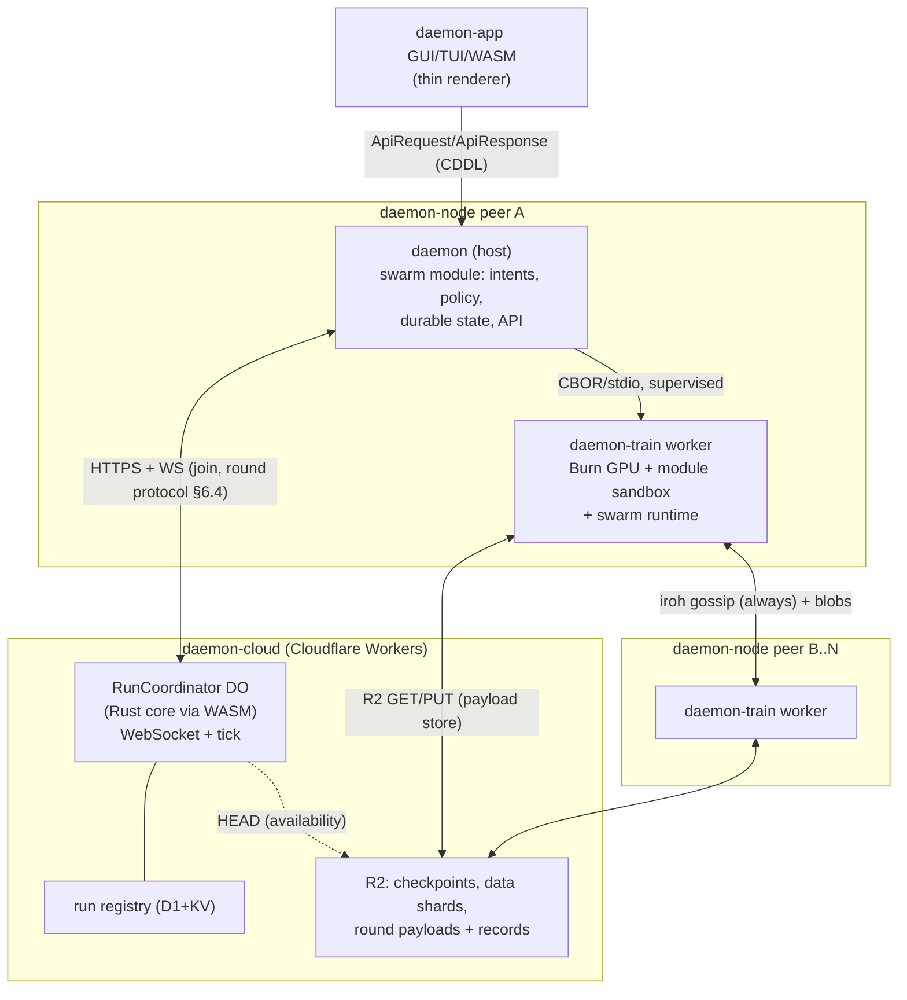

# daemon swarm training — decentralized transformer pretraining on consumer GPUs

**Status:** architecture design (research synthesis + spec draft, not yet scheduled)
**Provenance:** supersedes the C++/hivemind port designs in
`~/experiments/decentralised-llm-training/` (`architecture-design.md`,
`hivemind-node0-cpp-port-specification.md`, `implementation-plan.md`, Feb 2026). Those documents
targeted a C++20 port of hivemind + Pluralis node0 with an embedded Python/PyTorch compute plugin.
This design re-plans the same product idea — *pool consumer GPUs over the internet to pretrain
transformer models* — as a **Rust + Burn** extension of `daemon-node`, coordinated by
`daemon-cloud/daemon-api`, honoring all daemon architecture invariants.

Related daemon specs: [`swarm-tensor-abi-spec.md`](swarm-tensor-abi-spec.md) (**companion
interface spec**: the complete `tensor-abi@1` host↔module contract + `daemon-train-sdk` — §5.1/§5.2
here are its architectural summary), [`local-inference-spec.md`](local-inference-spec.md)
(supervised GPU worker pattern this reuses),
[`model-management-spec.md`](model-management-spec.md) (model artifact lifecycle),
[`daemon-host-spec.md`](daemon-host-spec.md) (resident services),
[`daemon-supervision-spec.md`](daemon-supervision-spec.md) (restart/meltdown links),
`daemon-workspace-layout.md` (crate DAG rules).

---

## 1. Goals and non-goals

### Goals

- **G-T1** Train decoder-only transformers cooperatively across many `daemon-node` peers, each
  contributing a single consumer GPU (8–32 GB VRAM) over commodity internet links
  (10–50 Mbps up / 100–1000 Mbps down).
- **G-T2** The node decides, the apps render: all training domain state (runs, membership, rounds,
  metrics, contribution) is owned by the node + coordinator and exposed to GUI/TUI/WASM clients
  over the existing CBOR/CDDL wire contract as intents + rendered state.
- **G-T3** Pure-Rust compute: Burn (CubeCL) is the tensor/autodiff/optimizer stack. No embedded
  Python, no libtorch, no `tch-rs`. One language across coordination, codecs, and kernels.
- **G-T4** Bandwidth-first profiles: the first-party SDK optimization profiles (§5.3) must keep
  per-peer uplink below ~50 MB per multi-minute round (not per step) at the 1B-param scale.
- **G-T5** Churn is normal: peers join/leave freely; a run survives any single peer loss and
  degrades gracefully under correlated loss.
- **G-T6** GPU fault isolation: driver crashes / OOM / wedged kernels never take down the daemon.
- **G-T7** Ladder of deployment: the same stack runs a single-machine multi-GPU job, a private
  LAN/team swarm, and a public swarm coordinated by `daemon-cloud`.
- **G-T8** Runs are experiments, and an experiment is **one artifact**: a sandboxed wasm module
  (plus its config) that owns model, loss, inner optimizer, and communication math end to end
  (§4.3, §5). The swarm carries the experiment; it never interprets it. Peer binaries expose a
  versioned capability vocabulary and hard-code no model, no algorithm, and no scale ceilings;
  each peer self-assesses eligibility against published requirements (§6.5).

### Non-goals (v1)

- Trustless/permissionless participation (Bittensor/Gauntlet-style scoring, TOPLOC verification,
  slashing, token incentives). v1 swarms are **permissioned** (API-key/org membership). §12 keeps
  the seams open.
- Context-parallel training (MoS) and RL swarms (GRPO) — research lanes, §5.5.
- Serving/inference of the trained model (that is `daemon-infer` / `daemon-models` territory;
  checkpoints land as ordinary model artifacts).
- **In-run held-out evaluation.** v1 runs report training loss, throughput, and state digests
  only. Benchmark/eval passes are an explicit deferral, not an oversight: an eval-committee
  role slots into the same committee machinery as verification (§6.3, §12) once wanted, and
  checkpoints are ordinary artifacts any external harness can evaluate offline meanwhile.
- Mobile trainers / running the worker itself in a browser. (Burn's Vulkan/Metal/WebGPU lanes
  make this conceivable later; explicitly out of scope now. Not to be confused with wasm
  **experiment modules**, §5.1, which run inside the native worker on every platform.)

---

## 2. Landscape and prior art (what we adopt, from where)

| System | Stack | Core idea | What this design adopts |
|---|---|---|---|
| **hivemind** (learning-at-home) | Python + go-libp2p | DHT, matchmaking, butterfly all-reduce, MoE RPC | Group/averaging *semantics* only; epoch/progress tracking model; staleness bounds. No code ported. |
| **node0 / Protocol Models** (Pluralis) | Python on hivemind | Pipeline-parallel pretraining on 16 GB+ consumer GPUs; ~100× lossless subspace compression of stage-boundary activations | Phase-2 algorithm (§5.4); auth/paramstore/stage-assignment patterns; the "consumer GPUs can host a *slice* of a big model" thesis |
| **AsyncPP** (Pluralis, ICML'25) | PyTorch | Nesterov/NAdam (β₁=0.99) correction for asynchronous pipeline staleness; weight stashing | Phase-2 optimizer math (§5.4) |
| **AsyncMesh** (Pluralis, 2026) | PyTorch | Fully async 2-D mesh: async sparse (5%) DP averaging w/ EMA delay correction × AsyncPP | Phase-3 lane (§5.5); its "strictly generalizes eager DiLoCo" framing |
| **OpenDiLoCo / INTELLECT** (Prime Intellect) | PyTorch + hivemind | DiLoCo inner/outer optimizer; int8 all-reduce pseudo-gradients | Inner/outer optimizer split; `WAIT_FOR_ALL` vs `NO_WAIT` straggler policies |
| **DeMo / DisTrO** (Nous) | PyTorch | Per-step compressed momentum (chunked DCT + top-k + sign), 44–857× | Optional profile for datacenter-ish peers (§5.3.3); DCT codec |
| **SparseLoCo** (Templar) + **Covenant-72B** (2026) | PyTorch + Bittensor + R2 | DiLoCo-style local steps + chunk-wise top-k + 2-bit quant + error feedback (~146×); **object storage as the communication backbone**; 72B proven | **v1 flagship profile** (§5.3.1); object-storage relay tier (§7.1) |
| **Psyche** (Nous/PsycheFoundation, Rust, ~69k LoC) | Rust + tch-rs + iroh + Solana | Coordinator state machine (on-chain or TCP); gossip commitments + blob payloads; deterministic committee/batch assignment; witness blooms; pipelined rounds | **Closest prior art.** Coordinator state machine shape, two-tier networking, deterministic data assignment, round pipelining, P2P model sharing, event-sourced observability (§6, §7, §14); pre-tokenized corpora published on the HF Hub (§8). Its tch-rs pain list is our strongest pro-Burn argument (§3) |

The four Pluralis papers and the DeMo/DisTrO papers live as markdown in
`~/experiments/decentralised-llm-training/`; reference checkouts of all systems above live in the
same folder (incl. `psyche/`). **Appendix A** pins every mechanism this spec adopts (or
deliberately replaces) to exact `file:line` references with snippets in those checkouts, at
pinned commits — the implementation-grounding companion to this section's claims.

---

## 3. Why Rust + Burn (decision record)

The old plan (C++ + embedded Python + libtorch, ~75/25 split) existed because in early 2026 there
was no credible native training stack. Two things changed:

1. **Burn 0.19→0.21 (Oct 2025 – May 2026)** shipped: true multi-GPU training with multi-stream
   execution, `burn-collective` (all-reduce/broadcast/reduce; differentiable collectives in 0.21),
   a DDP learning strategy, INT4/INT8 quantization, `burn-store` safetensors interop with PyTorch,
   activation-checkpointing autodiff (`BalancedCheckpointing`), flash attention (causal fixed
   Feb 2026), top-k and FFT kernels, and `burn-remote` with **WebSocket and iroh transports**
   (upstream `examples/p2p-remote-training`). Backends: CUDA, ROCm, Metal, Vulkan, WebGPU,
   LLVM/MLIR CPU — one kernel source (CubeCL) across all consumer GPU vendors.
2. **Psyche demonstrated the alternative's cost.** Its production Rust system still carries a
   custom `tch-rs` fork, `unsafe impl Send` on the optimizer, 10 MB thread stacks, a jemalloc
   global allocator, and TorchTitan Python sidecars for large models (receipts: Appendix A.6). That is precisely the class
   of FFI/runtime coupling `daemon-node` forbids in-process and the old C++ plan spent most of its
   complexity budget on (pybind11 bridge, GIL choreography, `dlopen`-after-`import torch`, venv
   bootstrap). With Burn, coordination, codecs, and GPU compute are one Rust workspace, one
   fault-domain story, one allocator, and `cargo deny`/clippy gates apply to all of it.
3. **Burn's autodiff is tape-based (dynamic), which unlocks run-defined experiments.** Anything
   that composes Burn tensor ops at runtime is differentiable — the tape records ops as they
   execute, PyTorch-style. That is what makes the experiment-module design (§5.1) possible: a
   sandboxed guest streams op calls through a host ABI, and backward falls out for free. The only
   hard binary boundary is the **kernel** level (CubeCL): new fused primitives require a release;
   composition never does.

Costs accepted with Burn (mitigations in §15):

- `burn-collective` is young and its multi-node path is unproven at WAN scale → we use it only
  intra-host; WAN aggregation is experiment-side math over swarm transport.
- Reported per-op host overhead in eager+JIT paths on some versions → fusion lanes, larger
  micro-batches, and kernel-level profiling as a standing gate.
- No off-the-shelf DCT/blockwise-quant kernels → small custom CubeCL kernels (§15.2).
- Model zoo is thin (llama-burn: Llama-3.2 1B/3B) → moot: models are run-defined experiment
  modules over our tensor ABI (§5.1); llama-burn survives as a golden-test reference, not a
  runtime path.

Fallback seam: the trainer worker is a separate binary behind a CBOR protocol (§10.2). If Burn
hits a wall, a `tch`-based worker could implement the same protocol — and the same tensor-ABI
host imports (§5.2), which are engine-agnostic by construction — without touching the node; the
same seam `daemon-infer` uses for llama.cpp vs mistral.rs. This is an escape hatch, not a plan.

---

## 4. System overview

### 4.1 Actors



| Actor | Role |
|---|---|
| **Run author** | Defines the experiment — a wasm module + config owning model, loss, optimizer, and communication math (§5) — and authors the run envelope (§6.1) with tooling that derives participation requirements; signs and publishes both. |
| **Run coordinator** | Authoritative run state machine: membership, phases, round seeds, witness quorum, checkpoint registry. Consumes **only the envelope**; never fetches or executes experiment modules. Publishes envelope + requirements for discovery. One logical instance per run; deployed local (in-node, dev/LAN) or cloud (Durable Object). |
| **Trainer peer** | A `daemon-node` with the `daemon-train` worker: self-assesses eligibility against published requirements (§6.5), joins runs, executes the experiment on assigned batches, exchanges updates, occasionally acts as witness / checkpoint uploader. |
| **Data host** | Static HTTPS host of pre-tokenized shards — R2 or the HF Hub (§8). No custom server logic in v1. |
| **App** | Renders run/round/metric state incl. node-computed eligibility and the (uninterpreted) experiment config; sends intents (join, leave, pause, budget). Never computes domain results. |

### 4.2 Run-mode ladder

| Mode | Coordinator | Transport (control / payload, §7.1) | Trust | Purpose |
|---|---|---|---|---|
| **local** | in-process (node hosts it) | loopback / loopback | n/a | dev loop, single machine multi-GPU, CI e2e |
| **private swarm** | one designated node hosts coordinator (TCP/WS) | WS + iroh gossip / iroh-blobs, optional R2 store | org-internal | teams, homelab clusters |
| **public swarm** | `daemon-cloud` Durable Object | WS + iroh gossip / R2 store (+ iroh-blobs fetch) | API-key/org allowlist (v1) | the product |

Same state machine, same peer code path in all three modes (Psyche's centralized-vs-Solana split
proves this dual-deployment pattern works; we author the state machine once in Rust and reuse it,
§11.2).

### 4.3 The seam rule: envelope vs experiment

A run is exactly two things, plus the artifacts they reference:

- the **run envelope** — a small, signed, frozen data document (§6.1);
- the **experiment** — a wasm module plus its config, owned entirely by the run author (§5).

One question decides every field's home: **does a party that never executes run code need to
read it?** If yes, it belongs in the envelope; if no, it belongs to the experiment. The
non-executing parties are fixed by hard constraints, not taste:

| Non-executing party | What it reads from the envelope, and why |
|---|---|
| coordinator / registry | membership floors, phases, timeouts, batch schedule — it runs the state machine and serves discovery, and the cloud never executes author code (§11) |
| node admission | requirements + capability set — pre-screen "could this peer join?" from the envelope alone, before fetching the module (which the full assess then re-derives from, §6.5) |
| transport | the artifact map (URLs + hashes) and payload caps — the guest has no I/O, so the host must know what to fetch, verify, and cache (§8) |
| app | run identity/status for rendering (experiment config displayed raw, never interpreted) |

Everything only the worker consumes — architecture, loss, inner optimizer, compression and
aggregation math, every hyperparameter — is the experiment's private business. The swarm
carries those bytes and hashes; it has no schema for them. (The earlier notion of a run
"descriptor" that carried `[optimizer.*]` and `[model.params]` sections mixed the two roles and
is rejected, §18.)

Two facts make full delegation to the module safe:

1. **Agreement = identical code × identical inputs.** The envelope pins the module by hash,
   wasm execution is deterministic, and the ops on the agree-path carry an explicit determinism
   contract in the host vocabulary (§5.6). So any math the module runs — including aggregation
   and the outer step — is bit-identical across peers *by construction*. Consensus never
   requires the swarm to understand the math, only to run the same math on the same inputs.
2. **Peer and platform safety never depended on understanding the experiment.** The sandbox
   (§5.1, §12) bounds what a module can consume; a hostile experiment can only waste its own
   run. Robustness *within* a run (e.g. clipping a malicious peer's contribution) is the
   author's concern, with hardened SDK defaults (§5.3).

What is never run-definable — each for a concrete reason, not reflex:

| Host-owned | Reason |
|---|---|
| coordinator `tick` (§6.2) | the cloud must run it without executing author code (§11.2) |
| transport + artifact fetch/verify (§7, §8) | the guest's lack of I/O *is* the security model |
| round lifecycle driver (§5.1) | the GPU governor must be able to preempt between guest calls (§10.5) |
| parameter + persistent-state storage, checkpoints, digests (§5.6, §9) | resume, desync detection, and checkpoint interop must work identically for every experiment |
| sandbox, budgets, autodiff tape, GPU execution (§5.1, §12) | the trust boundary itself |

---

## 5. The experiment

Per §4.3, nothing in this section is peer-side policy: everything the worker computes is defined
by the run's experiment module, composed from the host vocabulary, parameterized by the module's
own config. The shipped profiles (§5.3) are library code an author links — paper-validated
starting points, not host behavior. All v1 profiles are **data-parallel with a full model
replica per peer**; Phase 2 (§5.4) adds pipeline parallelism for models that exceed single-GPU
VRAM.

### 5.1 The experiment module

An experiment is one signed artifact: a **`wasm32-unknown-unknown` module**, executed by the
`daemon-train` worker in a **wasmtime** sandbox. Its *only* imports are the versioned **tensor
ABI** (§5.2): opaque tensor handles, shapes, and scalars — no WASI, no I/O, no shared memory.
Tensor data never crosses the boundary; GPU compute, the autodiff tape, and kernel execution
stay native (Burn/CubeCL). Because Burn's autodiff is tape-based (§3), ops streamed by the guest
are recorded and differentiated exactly as if compiled-in Rust had issued them.

**The host drives the lifecycle; the guest fills in the math.** The worker calls guest entry
points at defined moments of the round structure (§6.2) — never the reverse — which is what
keeps GPU-governor preemption (§10.5) possible between any two guest calls. The complete
contract (all 108 imports, exports, traps, budgets, data formats) is the companion
[`swarm-tensor-abi-spec.md`](swarm-tensor-abi-spec.md); the shape of it:

```rust
// Guest exports — called by the host lifecycle driver (ABI spec §4)
fn da_build(config: &[u8]);            // register params + persistent state from the
                                       //   envelope's [experiment.config]
fn da_step(batch: Batch, inner_step: u32,    // one micro-batch: forward + backward (accumulate);
           mb_index: u32, mb_count: u32,     //   accumulation position + this step's total
           step_seqs: u32);                  //   sequences, so guest loss scaling is exact
fn da_inner_update(inner_step: u32);   // apply inner optimizer at the accumulation boundary
fn da_make_update(round: u64) -> Update;     // round end: compress progress into the container
fn da_ingest_updates(round: u64, count: u32); // decode + aggregate + outer step (det lane, §5.6)
                                             //   over the round record's committed set (§6.4)
// + da_manifest/da_defaults (self-description), da_abi, da_alloc/da_free (glue)

// Host imports — the capability vocabulary (§5.2), illustrative subset (ABI spec §5)
fn param(name: &str, shape: &[u32], init: Init) -> Handle; // canonical state dict, in order
fn persistent(name: &str, shape: &[u32], class: Persist) -> Handle; // moments, error feedback
fn matmul(a: Handle, b: Handle) -> Handle;
fn flash_attn(q: Handle, k: Handle, v: Handle, causal: bool, scale: f64) -> Handle;
fn backward(loss: Handle);                fn grad(p: Handle) -> Handle;
fn adamw_step(p: Handle, g: Handle, m: Handle, v: Handle, hp: AdamHp);  // fused optimizer op
fn topk_chunk(x: Handle, chunk: u32, k: u32) -> (Handle, Handle);
fn det_chunk_scatter_add(acc: Handle, vals: Handle, idx: Handle, chunk: u32); // streaming decode
fn det_sum(xs: &[Handle]) -> Handle;      // det lane: bit-exact aggregation (§5.6)
fn det_axpy_param(p: Handle, x: Handle, alpha: f64); // the outer step, via the fp32 master
fn drop(h: Handle);                       // eager free of step-scoped handles (SDK RAII)
fn scalar(x: Handle) -> f64;              // explicit readouts only (loss, norms)
```

- **State classes.** `param()` registrations are the model — the **canonical state dict**, in
  registration order; the host owns their storage, checkpoints them (§9), and digests them
  (§5.6). `persistent()`/`det_persistent()` registrations are auxiliary optimizer state in one
  of two classes the module declares per tensor: **`local`** (droppable, never
  swarm-checkpointed, never digested — Adam moments, error-feedback residuals; the
  DiLoCo-family property that peers rebuild them in ≤H steps) and **`replicated`** (consensus
  state that feeds the outer step — e.g. det-lane outer momentum: digested every round and
  carried **fp32-exact** in epoch checkpoints, §9, so joiners and resyncers re-enter
  bit-identical; ABI spec §5.1/§5.9). Misclassifying outer state as `local` would desync every
  rejoiner — the digest coverage makes that loud, not silent. Everything else is step-scoped:
  freed eagerly via `drop` (SDK RAII) or wholesale when each entry point returns.
- **Three host modes, one module:**

| Mode | What runs | Used for |
|---|---|---|
| `meta` | shape-only propagation — no allocation, no GPU | authoring: derive `[requirements]` + defaults (§6.1); assess: eligibility footprint on this peer (§6.5) — param layout, activation estimate, op counts, payload-size estimate, required ops |
| `trace` | op-graph capture | audit/provenance export ("what does this run compute?"), debugging, checkpoint-layout validation |
| `execute` | real tensors under `Autodiff<B>` | training |

- **Sandbox budget (self-protection, not domain limits, §4.3):** wasmtime fuel + epoch
  deadlines; small linear-memory cap (the guest holds logic, not tensors); per-step op budget
  seeded from the meta-mode estimate; **step-scoped handle arenas** with generational indices
  (stale handles trap; guest leaks are structurally impossible). A trapping or budget-violating
  module is a typed local error (§13), never a worker crash.
- **Authoring:** the guest SDK (`daemon-train-sdk`, §10.1) mirrors Burn's module-building API
  over the ABI and ships the optimization profiles (§5.3), so an experiment reads like a normal
  Burn training program; Rust is the paved road, anything compiling to wasm works. Modules are
  content-addressed (blake3), signed by the author, and pinned by the envelope (§6.1).
- **Presets are first-party experiments:** `daemon-train` ships signed modules for the
  LLaMA-style decoder family (RMSNorm, SwiGLU, RoPE, GQA) wired to the SDK profiles,
  parameterized via `[experiment.config]` (d_model, layers, heads, seq len, profile knobs…).
  One mechanism, one runtime path; `llama-burn` (tracel-ai/models) is kept as a numerics
  golden-test reference (§15.3), not a runtime path.
- **The kernel boundary:** modules compose host primitives; they cannot ship GPU kernels. A new
  fused primitive (SSM scan, exotic attention, a new quantizer) is a CubeCL kernel in a
  `daemon-train` release, announced in the capability vocabulary and negotiated per run (§16).
  Composition changes never need a release; kernel changes always do.
- **Value-dependent control flow** (adaptive depth via `scalar()` readouts) trains fine in
  `execute` mode but degrades `meta`/`trace` fidelity; validation flags such modules and
  requirements fall back to author-declared bounds (open question, §18).
- **Host facilities around the entry points** (the module composes with these, never
  reimplements them): activation-checkpointing autodiff (`BalancedCheckpointing`), bf16
  storage with host-owned **fp32 canonical masters** (one write discipline for optimizer
  steps and the outer step; also what digests and checkpoints read — ABI spec §5.9), gradient
  accumulation and micro-batch sizing via OOM-probe under the supervised worker (a recoverable
  event, §13; seeded by the meta-mode estimate), and the data pipeline (§8) delivering ready
  token tensors as batches.

**VRAM planning guidance for run authors** (bf16 weights + **fp32 grad accumulators** (ABI
spec §5.1) + fp32 Adam, activation ckpt on, seq 2048; derivable mechanically from meta mode —
peers never enforce these numbers, they probe, §6.5):

| Model params | weights bf16 | grads fp32 | Adam fp32 (m+v) + master | ~total + activations | fits on |
|---|---|---|---|---|---|
| 160M | 0.3 GB | 0.6 GB | 1.9 GB | ~4.5 GB | 8 GB card |
| 500M | 1.0 GB | 2.0 GB | 6.0 GB | ~10.5 GB | 12 GB card |
| 1.2B | 2.4 GB | 4.8 GB | 14.4 GB | ~23 GB | 24 GB card (tight — prefer 8-bit opt states) |
| 1.2B + 8-bit opt states | 2.4 GB | 4.8 GB | ~7.3 GB (8-bit m+v, fp32 master) | ~16 GB | 20 GB card (16 GB marginal) |
| 3B+ | — | — | — | exceeds consumer VRAM | Phase 2 (PP) |

8-bit (blockwise-quantized) optimizer state is an SDK option over Burn's quantization primitives
(block size 4096, absmax scaling — bitsandbytes semantics). Error-feedback buffers (fp32,
1×params) are `persistent(local)` tensors the host offloads to CPU between rounds (Covenant's
phase-dependent offload pattern).

**Host-RAM planning** (same source: meta mode × arithmetic; enters `[requirements].ram_gb_min`,
§6.1): the worker's CPU side carries the fp32 masters materialized at the ingest boundary
(4 B/param), the **round-base snapshot** backing `param_round_base`/`det_param` (4 B/param, ABI
spec §5.1/§5.9), offloaded `local` persistents (e.g. fp32 EF ≈ 4 B/param), staged round payloads
(≤ committed-count × `update_mb_max`), and the det-lane working set (streaming accumulator,
≈ 2 dense fp32 tensors peak — ABI spec §5.9). At 1.2B with 16 peers ≈ **15–16 GB host RAM**;
at 160M ≈ 2 GB. `Probe` reports installed/free RAM alongside VRAM (§10.2).

### 5.2 The host vocabulary

The worker's compiled surface is a flat, versioned vocabulary of `name@version` primitives —
what a peer *can* execute, never what it *should* (§4.3). The envelope lists the subset its
experiment needs (§6.1); peers advertise what they implement (§10.2); admission checks subset
inclusion (§6.5). Growth is additive; breaking changes bump the ABI major (§16).

| Class | Examples | Notes |
|---|---|---|
| tensor / NN ops | `matmul@1`, `rmsnorm@1`, `rope@1`, `flash_attn@1`, `softmax@1`, `cross_entropy@1` | thin wrappers over Burn; autodiff-recorded in `execute` mode |
| fused optimizer steps | `adamw_step@1`, `nadamw_step@1`, `signum_step@1` | performance primitives; experiments may also compose update rules from tensor ops |
| compression primitives | `topk_chunk@1`, `absmax_pack@1` (1/2/4/8-bit), `dct2@1`, `chunk_scatter@1` | the small CubeCL kernels of §15.2 |
| determinism-contracted (det lane) | `det_sum@1`, `det_chunk_scatter_add@1`, `det_l2norm@1`, `det_axpy_param@1` | fp32, fixed order, CPU lane — the agree-path (§5.6); lane-tagged handles make native/det mixing a trap |
| state + I/O-free utilities | `param@1`, `persistent@1`, `backward@1`, `grad@1`, `drop@1`, `scalar@1`, `metric@1` | storage/registration, eager handle free, readouts (digests stay host-side, §5.6) |

The vocabulary is the *entire* import surface of the sandbox — there is deliberately no second
configuration language for composing it. Composition is guest code (§5.1), so "which optimizer,
which compression, which cadence" are ordinary program structure in the experiment, not schema
the swarm must version and validate. The normative op list — signatures, semantics, phase
legality, trap taxonomy — is [`swarm-tensor-abi-spec.md`](swarm-tensor-abi-spec.md) §5; a run's
required subset is derived mechanically as the module's static wasm import list (no execution
needed), which is what `[requirements].capabilities` (§6.1) and admission (§6.5) consume.

### 5.3 SDK optimization profiles

The proven algorithms ship as **profiles in the guest SDK** — first-party, golden-tested library
code (`daemon_train_sdk::profiles::{sparse_loco, diloco, demo}`) that an experiment imports,
composes, and parameterizes through its own config. They are code an author links, not behavior
a peer selects: new ablations (H, k, quant bits, error-feedback decay, outer momentum) are edits
to the experiment config; entirely new algorithms are new guest code over the same primitives
(§5.2). Only a missing *primitive* requires a `daemon-train` release (§16). The math below is
normative for the shipped profiles; the analysis tables are authoring guidance. (Code grounding:
A.7 DeMo/DisTrO production Rust, A.8 OpenDiLoCo, A.14 SparseLoCo status.)

#### 5.3.1 Profile `sparse_loco` (SparseLoCo semantics — the flagship)

Per outer round `t`, peer `r` of `R` participants:

1. Copy global params θ⁽ᵗ⁾ (all peers hold identical θ by construction); run **H inner AdamW
   steps** (profile default H=30) on assigned batches → θᵣ⁽ᵗ'ᴴ⁾.
2. Pseudo-gradient + error feedback + compression:
   - Δᵣ = θ⁽ᵗ⁾ − θᵣ⁽ᵗ'ᴴ⁾
   - acc = β·eᵣ + Δᵣ  (error-feedback decay **β=0.95**; `persistent(local)` buffer)
   - Δ̂ᵣ = Q(TopK_chunk(acc)) — **chunk-wise top-k**: 2-D tensors tiled 64×64, 1-D tensors
     chunked at 4096; **k=64 per 4096-value chunk** (1/64 density); values quantized to
     **2-bit** (4-level, per-chunk absmax codebook); indices ≤12 bits/value within chunk
   - eᵣ ← acc − Δ̂ᵣ  (residual stays local)
3. Publish Δ̂ᵣ as the round payload (§7); download peers' Δ̂; **median-norm clip** each
   contribution (no single peer dominates — the profile's hardened default, §12), then apply
   the identical outer step via the det ops (§5.6):
   - θ⁽ᵗ⁺¹⁾ = θ⁽ᵗ⁾ − α·(1/R)·Σᵣ Δ̂ᵣ, outer **α=1** (optionally lowered late in training;
     Covenant used 0.65 in its final phase). Outer Nesterov momentum (DiLoCo classic, 0.9) is a
     profile parameter; SparseLoCo's error feedback largely replaces it. When enabled it is a
     `replicated` det persistent (§5.1 state classes — digested + checkpointed); the default
     momentum-free profile carries **no** replicated state, so its consensus state is params-only
     and joiners need nothing beyond the checkpoint.

Compression ≈ (32/(2 + 12)) × 64 ≈ **146×** vs fp32 dense. Payload format (profile-defined
bytes, §7.3): `{chunk_len, k, per-chunk absmax codebook (fp16), packed 2-bit values, packed
indices}` per tensor.

#### 5.3.2 Profile `diloco` (plain DiLoCo, compatibility baseline)

H inner steps; pseudo-gradient exchanged **uncompressed or int8**; outer SGD+Nesterov
(lr 0.7, momentum 0.9 — the momentum buffer is the canonical example of a `replicated` det
persistent, §5.1: an input to everyone's outer step, so it is digested and rides the epoch
checkpoint fp32-exact rather than being rebuilt-from-zero like inner moments). Exists to
sanity-check convergence against the literature and for LAN/local mode where bandwidth is
free. (OpenDiLoCo hyperparameters; `WAIT_FOR_ALL`/`NO_WAIT` straggler policies as profile
parameters. **Delta vs OpenDiLoCo:** hivemind serves full training state — params *and* outer
optimizer — to out-of-sync joiners from live peers, Appendix A.8; we reject peer-served state:
the checkpoint is the single recovery artifact, and `replicated` classification is what makes
it sufficient.)

#### 5.3.3 Profile `demo` (DeMo/DisTrO, per-step)

For high-bandwidth swarms (datacenter peers, LAN): no gradient all-reduce; per **step**, each peer
updates local momentum Mᵣ ← β·Mᵣ + g (β=0.999), extracts fast components per 64×64 chunk via DCT,
takes top-k (k=8..16) DCT coefficients, **subtracts α·IDCT(sent) with α=0.2** from local momentum,
transmits sparse coefficients; all peers sum coefficients, IDCT, and apply the **sign** of the
aggregate with lr η and weight decay 0.1 (Signum-style). 44–85× compression, but per-step sync:
at 1B that is ~55 MB/step uplink — a fit for ≥100 Mbps symmetric links, not consumer uplinks.
Caveats from the papers: download volume grows linearly with peer count, and the DisTrO report
states ~1.2B is the smallest scale that trains reliably under its most aggressive settings.

**Cadence compatibility (round modes, §6.4):** `demo` is H=1 — a round per optimizer step,
seconds cadence. That is coherent only where the coordinator round-trip is negligible
(v1 `barrier` round mode on `local`/LAN coordinators) or once the `pipelined` round mode lands
(one-round-delayed apply — exactly how Psyche runs this math against a *blockchain* coordinator,
Appendix A.1/A.7). The module manifest declares its supported round modes and minimum viable
round interval (ABI spec §6.2); assess-time matching (§6.5) makes a `demo` experiment
**ineligible** on a mismatched deployment rather than mysteriously slow.

**Bandwidth reality check for run authors (why the preset experiments default to `sparse_loco`
on consumer uplinks), 1.2B params:**

| Profile | uplink/round | downlink/round (R=16 contributors) | round cadence | consumer 20 Mbps up? |
|---|---|---|---|---|
| `sparse_loco` H=30 | ~33 MB | ~530 MB (overlapped with next round's compute) | minutes | **yes** (~14 s upload) |
| `diloco` int8 H=100 | ~1.2 GB | ~1.2 GB (ring) | tens of minutes | marginal |
| `demo` k=16 | ~55 MB **per step** | grows with R | seconds | no |

### 5.4 Phase 2 — pipeline-parallel swarms (Protocol Models + AsyncPP)

Unlocks models larger than any participating GPU: the experiment declares P stages
(e.g. 8B / 16 stages ≈ 500M params ≈ consumer 12 GB card incl. optimizer state), each stage
replicated m× for throughput and churn tolerance (node0: 32 stages, many replicas each). Stage
boundaries are module annotations surfaced through meta mode; the stage count and replication
factors land in the envelope (coordination-consumed, §4.3) for the coordinator's stage
assignment.

Adopted mechanisms (full math in the papers; parameters are preset-experiment defaults; code
grounding incl. paper-vs-checkout deltas: Appendix A.12 — notably the Grassmann refresh and
modified AdamW exist in the paper but not in the node0 checkout):

- **Stage-boundary subspace compression (Protocol Models):** shared orthonormal U ∈ ℝ^{d×k}
  (k≈d/100, e.g. 40 @ d=4096); transmit (X − PE − T_fixed[t])·U forward and ∇X·U backward
  (~100× reduction, lossless because Row(W_in/out) is constrained to Col(U)); Grassmann update of
  U every ~500 steps, broadcast to all stages; modified AdamW (row-constant second moment) for
  subspace-constrained matrices; per-microbatch boundary payload at b=8, n=2048, k=40, bf16 ≈
  **1.3 MB** — sub-second on consumer uplinks.
- **Asynchronous pipeline with Nesterov correction (AsyncPP):** 1F1B schedule; NAdam with
  **β₁ = 0.99** as the delay-correcting optimizer; weight stashing per in-flight microbatch
  (bounded ring; CPU offload), or the no-stash variant with stage-indexed lr/momentum for tight
  VRAM.
- **Within-stage DP:** replicas of the same stage average with the `sparse_loco` profile on the
  stage shard — this is where the old drafts' PowerSGD/SPARTA role is filled by the newer
  compressor; per-stage groups come from the coordinator's stage assignment rather than DHT
  matchmaking.
- **Data injection:** head-stage peers pull batches (§8); the coordinator schedules
  pipe composition (which replicas form a pipe) and reassigns on churn — replacing node0's
  central "pipeline orchestrator" actor.

### 5.5 Phase 3 research lanes (kept open, not designed here)

- **AsyncMesh:** fully-async DP×PP mesh — async 5%-subset sparse averaging with EMA delay
  correction (λ 0.5→0.01 cosine), delay τ≤50 tolerable; strictly generalizes eager DiLoCo.
- **MoS:** context-parallel K/V subspace compression (132K ctx across peers).
- **RL swarms** (rl-swarm-style GRPO with judge/evaluator roles) — a different product.

### 5.6 Determinism & agreement

Divergent replicas silently destroy DP training. Agreement rests on three legs, none of which
requires the swarm to understand the experiment (§4.3):

- **Identical code.** The envelope pins the module by blake3; every peer executes the same
  bytes; core wasm is deterministic (single-threaded profile, no WASI; NaN payload bits are
  never observable through the ABI). Identical module × identical inputs ⇒ identical decisions.
- **Deterministic primitives on the agree-path.** Ops the outer step needs carry a determinism
  contract in the vocabulary (§5.2): fp32, sorted/fixed reduction order, CPU lane (§15.2). The
  SDK profiles use exactly these for decode → clip → aggregate → outer update, over the round
  record's committed set (§6.4) — identical inputs by construction. Local forward/backward
  needs no cross-peer bit-identity — gradients legitimately differ (data shards, GPU-vendor
  numerics); replicas re-converge because every peer applies the identical outer step to the
  identical aggregate.
- **Detection, host-side.** After each ingest the host computes the **round state digest**:
  xxh3-128 over sampled blocks of the canonical state dict *plus all `replicated` persistents*
  (§5.1), the sampling schedule derived from the round seed so every peer hashes the identical
  blocks; full blake3 over the complete state at epoch checkpoints. The digest travels in the
  `Digest` message (§6.4); a mismatched peer resyncs from checkpoint (§9) instead of poisoning
  the swarm. Digests are computed by the host over storage it owns, so desync detection works
  identically for every experiment. (Content addressing of artifacts, payloads, and checkpoints
  is always full blake3, §7.3/§8 — xxh3 is only the per-round sampled *comparison* digest.)

Assignment and committee roles remain pure functions of (round seed, roster) — §6.3; no
peer-local randomness in anything that must agree.

---

## 6. Run coordination

### 6.1 The run envelope

A run is created from an **envelope**: authored with figment layering exactly like the node's
own config (defaults ← the module's exported defaults (meta mode) ← TOML file ← env ← CLI on
`daemon-cli swarm create` — the house pattern of `bins/daemon/src/config.rs`), then **resolved,
frozen, hashed, and signed**. TOML (below) is the *authoring surface only*: freezing serializes
the resolved envelope to **canonical CBOR** (RFC 8949 §4.2 deterministic encoding — the same
canonicalization the ABI spec §6.1 defines for the config blob, applied to the whole document);
the envelope hash is blake3 over those bytes, the signature covers that hash, and
`[experiment.config]`'s canonical sub-encoding is byte-identically what `da_build` receives —
one unambiguous byte chain from author signature to guest input. R2 stores `envelope.cbor`
(§11.3); renderings back to TOML/JSON are display conveniences. Peers and coordinator only ever
see the frozen snapshot; layering is an authoring convenience, never a runtime ambiguity.
`daemon-cli swarm create --module experiment.wasm` with no TOML at all is a valid authoring
session: defaults come from the module, requirements from meta mode. (Paramstore lineage: node0
`run.yaml`, Psyche `state.toml`.)

```toml
[run]                      # identity + membership
schema     = 1             # envelope schema major (§16)
run_id     = "smollm-500m-01"
min_peers  = 4
max_peers  = 64
access     = "org"         # org | allowlist | open(v2)

[experiment]               # §5 — carried by the swarm, interpreted only by the module
module = "experiment.wasm" # artifact name (below)
abi    = "tensor-abi@1"

[experiment.config]        # opaque bytes handed to build(); displayed raw, never interpreted
d_model    = 1024
n_layers   = 24
n_heads    = 16
n_kv_heads = 4
seq_len    = 2048
profile    = "sparse-loco" # meaningful to this module's code, not to the swarm
h          = 30
top_k      = 64
quant_bits = 2
ef_decay   = 0.95
inner      = { rule = "adamw", lr = 4e-4, betas = [0.9, 0.95], wd = 0.1, warmup_steps = 1500 }

[artifacts]                # every external object: named, pinned, host-fetched (§8)
"experiment.wasm" = { url = "r2://runs/smollm-500m-01/experiment.wasm", blake3 = "…" }
"data.manifest"   = { url = "hf://datasets/acme/fineweb-edu-tokens@9f3c21e/manifest.json", blake3 = "…" }
"tokenizer.json"  = { url = "hf://acme/smollm-tokenizer@41aa02b/tokenizer.json", blake3 = "…" }

[data]                     # coordination-consumed schedule (assignment math, §6.3)
manifest = "data.manifest"
steps_per_round = 30       # inner steps per round (H) — derived from the module manifest
                           #   (ABI spec §6.2), copied here at freeze like `capabilities`;
                           #   peers verify manifest == envelope at assess (§6.5)
global_batch = { start = 256, end = 512, ramp_rounds = 2000 } # sequences per ROUND (split
                           #   across peers §6.3; each peer slices its share into
                           #   steps_per_round inner steps × local micro-batches)
stop = { tokens = 10_000_000_000 }  # termination: target token count (or `rounds = N`);
                           #   reaching it drives Cooldown → Finished (§6.2)

[requirements]             # derived by authoring tooling (meta mode + arithmetic);
vram_mb_min       = 11000  #   author-overridable; peers re-derive locally, never trust it (§6.5)
ram_gb_min        = 16     # host RAM: masters + round base + offloaded persistents + staging (§5.1)
uplink_mbps_min   = 15
downlink_mbps_min = 100
disk_gb_min       = 60
throughput_floor  = "c2"   # measured tokens/s class (§6.3)
update_mb_max     = 40     # per-peer round-payload cap, receive-side enforced (§7.3)
capabilities      = ["tensor-abi@1", "rmsnorm@1", "flash_attn@1", "adamw_step@1",
                     "topk_chunk@1", "absmax_pack@1", "det_chunk_scatter_add@1",
                     "det_sum@1", "det_axpy_param@1"]
                           # = the module's static import list, derived, not authored;
                           #   peers re-derive it from the module at assess (§6.5)

payload_store     = "r2"   # bulk payload plane (§7.1); control plane (WS + iroh gossip)
                           #   is not optional and therefore not listed

[phases]                   # §6.2/§6.4 round protocol parameters (timeouts in seconds)
round_mode = "barrier"     # v1; "pipelined" reserved (§6.4) — module manifest must support it
warmup = 300
round_train_max = 900
round_witness = 60
cooldown = 120
epoch_rounds = 400         # rounds per epoch (default derived: one pass over the data window)
checkpoint_every_epochs = 1
stall_rounds_max = 2       # fetch-recovery budget before a peer must leave (§6.4)
payload_retention_rounds = 8  # R2 lifecycle floor: ≥ stall_rounds_max + resync replay window (§9)
```

Reading it through the seam rule (§4.3): `[run]`, `[data]`, `[phases]` feed the coordinator's
state machine and assignment math; `[artifacts]` + `update_mb_max` feed transport;
`[requirements]` feeds admission; `[experiment]` + `[experiment.config]` are **payload** — the
swarm verifies the module hash and forwards the config bytes to `build()`, nothing more. A
hyperparameter sweep is N envelopes differing only in `[experiment.config]`, all pinning one
content-addressed module (built, signed, and cached once).

`steps_per_round` deserves a note, because it looks like an experiment hyperparameter that
leaked across the seam. It did not: cadence is *coordination-consumed* — the host lifecycle
driver paces `da_inner_update`/`da_make_update` by it and the coordinator advances the data
cursor by `global_batch` per round — so by the seam rule it belongs in the envelope. It is
still **module-derived, not authored**: the module manifest exports it (ABI spec §6.2), freeze
tooling copies it in (exactly like `capabilities`), and peers verify the copy against the
module at assess. The module's own math never needs to read it back — the host passes
run-monotonic `inner_step` counters into every call, so guest LR schedules and profile logic
are cadence-blind.

The `[requirements]` block is **published guidance, not authority**: the tooling computes it
mechanically (meta-mode footprint for VRAM/RAM and payload sizes; payload × cadence × deadline
for bandwidth), the author may override, and every peer re-derives its own view at assess time
(§6.5) against its own hardware.

### 6.2 Coordinator state machine

Adopted from Psyche's proven shape (same phase names, our semantics where noted; code grounding
with deltas: Appendix A.1–A.3). The coordinator consumes envelope fields only — it never
fetches, parses, or executes the experiment (§4.3).

```
Uninitialized → WaitingForMembers → Warmup → (RoundTrain ⇄ RoundWitness)* → Cooldown ↩
                                                              ↘ Paused / Finished
```

| Phase | Entry | Exit |
|---|---|---|
| `WaitingForMembers` | run created / post-cooldown | `min_peers` healthy joins → `Warmup` |
| `Warmup` | roster frozen for epoch | all peers report model-ready (module validated + built, artifacts fetched, checkpoint loaded, micro-batch probed) or timeout → `RoundTrain`; drop below `min_peers` → back |
| `RoundTrain` | `RoundOpen` published (§6.4) | round record committable (all expected commitments attested), or `round_train_max` timeout → `RoundWitness` |
| `RoundWitness` | grace for straggling commitments/attestations | `RoundRecord` published (§6.4) → next `RoundTrain` (round++), or → `Cooldown` on epoch end / peer floor / stop condition |
| `Cooldown` | epoch end / `[data].stop` reached | checkpoint committed (§9) → `WaitingForMembers` (join/leave window), or → `Finished` when `stop` is reached |

- **Epoch** := the roster-stable span of rounds between two `Cooldown`s. Its length is
  `[phases].epoch_rounds` (default derived at freeze: the round count that consumes the data
  window once at the scheduled `global_batch`); pending joins/leaves or a peer-floor breach
  end it early. Joins and leaves take effect only at epoch boundaries (roster frozen in
  `Warmup`), which is what makes epoch checkpoints sufficient entry points for joiners (§9).
  - **Operational note (declared-run authoring).** A join is applied **roster-direct** only while
    the run is still `WaitingForMembers`; a join that arrives **after** the
    `WaitingForMembers → Warmup` transition is staged `pending` and materializes only at the next
    epoch boundary — so with `epoch_rounds = 0` (a single-epoch run) it never materializes mid-run.
    Declared-run authors MUST therefore set `min_peers` = the **expected initial roster size**, or a
    worker that races the warmup transition is stranded pending for the whole run. (Enforced by the
    coordinator `tick`; pinned by `daemon-swarm-coordinator` `tests/pending_join.rs`.)
- **Termination**: `[data].stop` (tokens or rounds) is the `Finished` trigger, evaluated at
  round boundaries; `Paused` is an operator state — only the run author / org admins may
  pause or resume (coordinator-authenticated intent, §11.1), and peers treat it like an idle
  `WaitingForMembers`.
- Rounds **overlap transport, never application** (§6.4 invariant I2): while training round N,
  peers already fetch round-N commitments as they gossip; `da_ingest_updates` runs at the round
  boundary as a barrier. A ring of stored round state (4, Psyche's `NUM_STORED_ROUNDS`) absorbs
  out-of-order arrivals and the stall ladder (§6.4) — this hides the ~530 MB round downlink
  (§5.3.1) behind compute while keeping the pseudo-gradient baseline well-defined.
- The coordinator's `tick(state, events, now) → (state', effects)` is a **pure Rust function**
  in `daemon-swarm-proto`, so local, private, and cloud deployments execute identical logic
  (§11.2), and it is property-testable. Purity is load-bearing beyond testing: a pure,
  float-free transition over signed events is also what an anticipated on-chain/zkVM
  coordinator substrate can re-execute and prove (§18 open q. 14) — which is why the §6.4
  commit rule consumes only signed evidence (I6) and never performs I/O inline.

### 6.3 Deterministic assignment (no per-batch RPC)

Per round, from `(round_seed, roster)` every peer independently derives:

- **committee roles**: trainers, witnesses (deterministic shuffle, separate salts) — witness
  count default 4; quorum ⌈⅔·n⌉ with Psyche's small-n specials adopted verbatim (n=1→1, n=2→2,
  n=3→2; Appendix A.3), and the `round_train_max` timeout bounds the damage of a flaky witness
  set regardless;
- **batch assignment**: the round's global batch (envelope `[data].global_batch`, sequences per
  round) is split into contiguous `BatchId` intervals over the epoch's data window, weighted by
  each peer's declared+measured **throughput class**, with small deliberate overlap (default
  0–10%, envelope config) so a dropped trainer only delays, never loses, data coverage. Each
  peer then slices its interval into `[data].steps_per_round` inner steps and its locally
  probed micro-batches (§5.1) — cadence is uniform across peers; per-step batch share is not.

**Throughput classes** are a coarse, measured tokens/s ladder (micro-bench at probe time,
re-measured from real rounds): `c1` < 1k tok/s, `c2` 1–4k, `c3` 4–16k, `c4` > 16k (per-peer
aggregate across its GPUs, at the run's `seq_len`). They exist so assignment weights and
`[requirements].throughput_floor` compare a one-word class instead of raw benchmarks; exact
boundaries are `daemon-swarm-proto` constants, versioned with `SwarmProtoVersion`.

### 6.4 The round protocol (commit, attest, apply, recover)

The precise contract of a round — who ends it, what gets applied, and how peers recover — is
one protocol, owned here. Roles: the **coordinator** (single-writer authority, §6.2), all peers
as **trainers**, a per-round **witness** committee (§6.3 — every peer fetches every payload for
ingest anyway; witnesses are just whose attestations count), the **payload store** (§7.1), and
the always-on **gossip mesh** (§7.1). Seven signed CBOR messages in `daemon-swarm.cddl` (§7.3):

| Message | From | Content |
|---|---|---|
| `RoundOpen` | coordinator | round, seed, roster digest, batch window, deadline |
| `Commitment` | trainer | round, payload blake3 + size + locators (store key / blob ticket) |
| `Attestation` | witness | round, **set commitment** over its cumulative fetch-verified set: merkle root over the sorted `(peer, hash)` pairs + count. Constant-size at any roster; the witness's full set rides alongside as an inline list while rosters are small (a transport optimization, never the signed field) |
| `StorageReceipt` | coordinator-as-storage-client | round, `(peer, hash, size)` it has `HEAD`-verified against the payload store (§7.1) — availability evidence as a *signed message*, so the commit rule stays a pure function of its inputs (§11.2) |
| `RoundRecord` | coordinator | **the consensus artifact**: the committed set's merkle root + count, drops, next round's seed, and the locator of the full set object (`record-set.cbor`, §11.3) — the ordered `[(peer, hash, size)]` list **sorted by node public-key bytes** (the ed25519 node identity, §7.2 — never the iroh id). Small rosters get the set inlined too; the signed, consensus-critical field is the root either way |
| `Digest` | every peer | round, post-ingest state digest (§5.6) |
| `Straggle` | stalled peer | round being recovered, status (rides the heartbeat) |

Attestations and records carry commitments-to-sets rather than the sets themselves so the
consensus messages are **scale-invariant** (a root is ~32 B at n = 4 and at n = 4000) and
**substrate-portable**: constant-size signed roots with content-addressed data availability is
exactly the shape a future on-chain/ZK coordinator substrate needs (§18 open q. 14), while
losing nothing at v1 scale. Exactness is preserved — a root commits to a definite set,
membership is provable (O(log n) merkle paths), and there is no false-positive class to
recover from. (Psyche's witnesses carry the same `broadcast_merkle` root next to their blooms —
Appendix A.3; we adopt the root and drop the blooms, whose role was substrate-specific.)

```mermaid
sequenceDiagram
    participant C as coordinator
    participant P as peer (trainer)
    participant W as witnesses
    participant R2 as payload store

    C->>P: RoundOpen(r) — seed, deadline
    Note over P: derive roles + BatchId interval from (seed, roster);<br/>train H inner steps (da_step × micro-batches, da_inner_update)
    par overlapped with training
        P->>R2: PUT update(r) when trained
        P->>C: Commitment(r) — also gossiped
        Note over P,W: peers prefetch payloads as commitments gossip;<br/>blake3-verify on arrival
        W->>C: Attestation(r) — root over verified set
        C->>R2: HEAD committed objects → signed StorageReceipt(r)
    end
    C->>P: RoundRecord(r) — set root + record-set object, on all-accounted or deadline
    Note over P: BARRIER — verify set against root, finish fetching it,<br/>stage in record order, da_ingest_updates(r),<br/>host snapshots round base + digests
    P->>C: Digest(r) — also gossiped
    C->>P: RoundOpen(r+1) — ships with the record;<br/>peer starts r+1 only after its local ingest returns
```

**Steady-state round r (`round_mode = "barrier"`):**

1. **Open.** Coordinator publishes `RoundOpen(r)` (WS push + gossip). Every peer derives its
   committee roles and `BatchId` interval (§6.3) locally.
2. **Train ∥ exchange.** The peer runs its `steps_per_round` inner steps. Concurrently, as it
   finishes: PUT its sealed update to the payload store (and/or publish the blob ticket), then
   send + gossip `Commitment(r)`. All peers opportunistically prefetch payloads as commitments
   arrive, verifying blake3 on receipt; witnesses fold each verified fetch into their
   cumulative `Attestation(r)`.
3. **Commit.** A payload enters the round record iff its commitment arrived **and** signed
   **availability evidence** exists for it — either a `StorageReceipt` (in the `r2` plane the
   coordinator `HEAD`s the object it presigned — its own storage, zero egress, §11.1 — and
   *emits the result as a signed message* rather than consuming it inline) or a witness-quorum
   `Attestation` covering the payload (the only path for pure-iroh payloads). The commit rule
   is thereby a **pure function of signed messages** — re-executable, auditable, and provable
   on substrates that cannot perform I/O (§18 open q. 14). The record freezes when every
   roster member is accounted for or at the deadline, whichever first; the coordinator
   publishes `RoundRecord(r)` and stores the full set object next to the payloads (§11.3).
   Absent peers are simply not in it.
4. **Barrier: ingest.** Each peer obtains the committed set (inlined at small rosters, else
   the `record-set.cbor` object — one small fetch on a path already fetching n payloads,
   covered by the same stall ladder), verifies it against the record's root, completes
   fetching exactly that set (usually already prefetched), stages it in record order, and runs
   `da_ingest_updates(r)` — the det-lane decode → clip → aggregate → outer step (§5.6). The
   host snapshots the round base (ABI spec §5.9), computes the round digest, and emits
   `Digest(r)`.
5. **Next round.** `RoundOpen(r+1)` ships with the record; a peer starts training r+1 the
   moment *its own* ingest returns. Digests are compared asynchronously — divergence detection,
   never a round gate.

**Invariants** (each is a named conformance test, TDD §3.1):

- **I1 Replayability** — post-round state is a pure function of (checkpoint, `RoundRecord`s,
  payloads). Anyone can replay a run offline; resync (§9) *is* this replay.
- **I2 Barrier** — the first `da_step` of round r+1 happens-after `da_ingest_updates(r)`
  returns locally. Transport overlaps; application never does (§6.2).
- **I3 Exactness** — the ingest set equals the set committed by the record's root, totally
  ordered by node public-key bytes; subset ingest never happens (ABI spec §5.11). No
  probabilistic structure is ever a consensus input.
- **I4 Liveness** — the record freezes by deadline regardless of stragglers; a missing peer
  costs only its own contribution (assignment overlap covers its data, §6.3).
- **I5 Blindness** — the coordinator handles hashes, sizes, roots, and receipts; payload bytes
  never enter it (§4.3).
- **I6 Evidence** — the commit rule consumes only signed messages (`Commitment` ∧
  (`StorageReceipt` ∨ quorum `Attestation`)); the coordinator performs no unattested side
  effects inside the rule. This keeps `tick` pure (§6.2) and the round provable end to end.

**Recovery ladder** (escalating; every rung is churn-normal, §13):

1. *Missed publish* — no commitment by deadline → absent from the record; no error, nothing to
   apply from this peer. Repeated absence re-weights the peer's class, then drops it.
2. *Missed fetch* — the record names a payload the peer cannot get by its local ingest attempt
   → **stall**: skip training round r+1, keep fetching (`payload_retention_rounds` guarantees
   the bytes outlive the attempt), ingest late, catch up. Budget: `stall_rounds_max` (default
   2) — within it the peer re-enters as an ordinary straggler; beyond it, leave and rejoin at
   the next epoch via checkpoint. Stalled peers publish nothing (their update would be
   stale-based) but keep heartbeating `Straggle`.
3. *Digest mismatch* — resync from checkpoint + record/payload replay (I1, §9); repeated →
   leave + alert.
4. *Preemption / crash* — the same churn path (§10.5): re-enter at whichever rung matches what
   was lost.

**Progress & health.** The record doubles as the liveness signal: peers absent from K
consecutive records are marked `Dropped` (re-joinable at next epoch). Peers heartbeat the
coordinator (WS ping, 15 s); accusation-based health checks (Psyche-style) add direct
peer-to-peer evidence where iroh connectivity exists. Gradient *correctness* verification is
explicitly deferred (§12) — Psyche ships with `verification_percent = 0` and `todo!()` verifier
committees, which we treat as a warning to design the seam but not fake the feature.

**Future `round_mode = "pipelined"`** (reserved in the envelope; not v1): `RoundOpen(r+1)`
ships at commit time and training r+1 starts immediately; `da_ingest_updates(r)` applies one
round late, with a two-round grace at epoch start. This is exactly Psyche's production shape
(`apply_results` consumes the *previous* round at train start — Appendix A.1 delta note), the
prerequisite for `demo`-cadence rounds over high-latency coordinators (§5.3.3). It shifts I2 by
one round — a *profile-visible optimization semantic*, so the module manifest must declare
support (ABI spec §6.2) before a run may select it.

### 6.5 Admission: capability negotiation + self-assessment

Joining is two-sided by design (§4.3): the coordinator publishes suggested participation
requirements and controls *who may* join (auth); the peer alone decides *whether it can*:

1. **Probe** (cached; refreshed on hardware/config change, §10.2): GPUs + VRAM, host RAM,
   backend lanes, measured up/downlink, free disk, micro-bench throughput class (§6.3), and the
   worker's **capability vocabulary** (tensor-ABI version, ops, payload stores).
2. **Effective resources** = probe ∩ local policy (§10.5): a 24 GB card under a
   `vram_cap_mb = 12000` governor policy is a 12 GB peer; `idle`/`scheduled` modes discount
   availability.
3. **Assess** (`AssessRun`, §10.2), staged cheap-to-expensive: (a) *pre-download screen* on the
   envelope alone — published capability list ⊆ advertised, coarse requirements vs effective
   resources, round-mode compatibility (§6.4 vs the module manifest's declared modes); then
   (b) fetch + hash-verify the module and **re-derive locally** what the envelope claims: the
   capability set from the module's static import list and the cadence block from its manifest
   (author-published values are never trusted, merely pre-screened against); then (c) a
   **meta-mode run** (§5.1) for the true footprint (VRAM, RAM, payload) on this peer →
   `Eligibility { eligible, reasons[], headroom }`. The node persists the result and the app
   renders run lists annotated joinable-or-why-not (§10.4) — the node decides, the app renders.
4. **Join**: user intent/policy consents (§10.5) → signed join request → coordinator auth
   admission (§12) → roster entry with declared throughput class.
5. **Warmup confirms**: artifacts fetched + verified, module built in execute mode, checkpoint
   loaded, OOM-probe fixes the real micro-batch. Failure here is a typed local decline (§13),
   not a swarm error.

The coordinator **trusts but verifies**: declared classes only seed assignment weights (§6.3);
measured round performance re-weights or drops chronic stragglers. Peer-side checks exist for
self-protection (sandbox budgets §5.1, payload caps §7.3) — never as domain ceilings. Whether a
run is "too big" is decided by this handshake, not by constants in peer code.

---

## 7. Networking & transport

### 7.1 One control plane, two payload planes

The **control plane is not tiered**: every peer in every mode speaks (a) WS/HTTP to the
coordinator and (b) **iroh gossip** — mandatory, all seven §6.4 messages travel both. Gossip's
sub-4 KB signed messages traverse NAT via iroh relays without hole-punched data channels, so
"gossip everywhere" costs no reachability assumptions; it is what lets the witness protocol be
*one* protocol in every deployment instead of forking per transport. Bulk **payloads** then
move on whichever plane the envelope's `payload_store` names:

| Payload plane | Mechanism | Properties | Used for |
|---|---|---|---|
| **`r2` store** (baseline, public swarm default) | Coordinator-issued presigned R2/S3 URLs; peers PUT their update object, GET committed objects; coordinator `HEAD`s for availability and emits signed `StorageReceipt`s (§6.4 I6) | NAT-proof, availability-attestable server-side, zero-egress verification from the DO; latency ~seconds; egress cost on fetch | update exchange, checkpoints, artifacts — the Covenant/Templar production pattern |
| **`iroh-blobs`** (optimization; private-swarm default; Phase-2 requirement) | content-addressed blob fetch over iroh QUIC (ed25519 `NodeId`), any holder serves; relay servers + hole-punching | direct peer transfer, sub-second latency, swarming redundancy; availability attested by witnesses (§6.4) | update fetch (cheaper+faster than R2 when reachable), P2P model sharing, **all Phase-2 activation traffic** |

Both implement one `SwarmTransport` trait (publish/fetch); commitments carry locators for every
plane the payload is on, and peers fetch from the cheapest reachable one, falling back per
object. v1 milestone order: gossip + R2 store first (suffices for local-step profiles),
blob fetch next.

The old drafts' full hivemind stack — Kademlia DHT, matchmaking buckets, butterfly all-reduce,
64 KB tensor part streaming, msgpack DHT records — is **not ported**: with a coordinator holding
the roster and deterministic assignment (§6.3), DHT discovery and group matchmaking are solved
trivially, and compressed updates are small enough for whole-object transfer. This deletes the
majority of the old L1/L3 surface.

### 7.2 Identity

- Node identity: the daemon's existing ed25519 identity (daemon-credentials) signs all swarm
  control messages.
- P2P identity: iroh `NodeId` (ed25519), generated per node, bound to the node identity at join
  (`join` request carries both + signature). Same dual-key shape as Psyche's `NodeIdentity`.

### 7.3 Message & payload formats

- **Control plane** (coordinator HTTP/WS, gossip envelopes — the seven §6.4 round messages plus
  join/heartbeat): CBOR with a dedicated CDDL contract (`daemon-swarm.cddl`) and its own
  `SwarmProtoVersion` (u16) — independent of the app `WireVersion` but with the same
  conformance-test discipline (fixtures + arbitrary round-trip). Every message is signed by the
  node identity (§7.2); ordering authority is always the coordinator (single writer, §11.2) —
  gossip is dissemination, never arbitration.
- **Round updates**: **experiment-defined bytes** (§4.3) — the swarm moves them, hashes them,
  and enforces the envelope's `update_mb_max` on receive *before* any guest decode; it never
  parses them. (The SDK profiles use a compact little-endian frame per tensor: header +
  fp16 codebook + packed values + packed indices, §5.3.1.)
- **Checkpoints**: safetensors (§9). **Experiment modules**: plain wasm binaries (MB-scale),
  fetched once per run. All payloads are content-addressed (blake3) and signed; commitments
  gossip the hash.

### 7.4 Relay infrastructure

- iroh relays (carrying gossip for all peers + blob traffic where used): default to n0's public
  relays for v1 dev; self-hosted relays (`iroh-relay` is a deployable Rust binary) pinned in
  the envelope for the public swarm. Gossip is mandatory (§7.1), so relay reachability is part
  of the §6.5 probe.
- R2 round objects live under the run prefix with lifecycle rules: auto-expire after
  `[phases].payload_retention_rounds` (§6.1) — the floor that keeps the §6.4 stall ladder and
  the §9 resync replay window honest; checkpoints retained per policy (§9).

---

## 8. Data & artifacts

Everything a run references externally goes through the envelope's **artifact map** (§6.1): a
name → `(url, blake3)` table the *host* fetches, verifies, and caches — the module has no I/O
and addresses artifacts by name only. Supported schemes: `r2://`, `hf://`, `https://`.

- **HF is a first-class source.** `daemon-node` already ships an HF client (`daemon-models`:
  `HfClient` search/tree + `hf-hub` acquisition, daemon-credentials tokens for gated repos,
  cache conventions) — swarm artifacts reuse it. `hf://` references **must pin a revision
  (commit SHA)**: that makes them as immutable as content-addressed R2 objects; the blake3 in
  the artifact map is verified either way. Psyche precedent: its production runs consume
  pre-tokenized corpora published on the Hub over plain HTTP.
- **Corpora are pre-tokenized offline** into fixed-width shards (u16/u32 token streams + doc
  boundary index); `manifest.json` lists shards, sizes, token counts, and a blake3 per shard.
  No tokenizer in the training hot path (Covenant's loader-bottleneck lesson) — the tokenizer
  artifact serves prep and evaluation. Two publication lanes:
  - **prep lane**: `daemon-train prep` pulls a raw HF dataset via the existing HF machinery,
    tokenizes, and publishes shards — to R2 or back to an HF dataset repo;
  - **zero-copy lane**: the manifest points directly at an existing pre-tokenized HF dataset;
    peers ranged-GET shards from the Hub like any static host (§4.1 "data host").
- **Batches**: peers map `BatchId` intervals (§6.3) → (shard, offset) purely locally; the host
  data pipeline materializes token tensors and hands the module `BatchRef`s (§5.1). Shards
  download lazily ahead-of-need into the workspace cache (daemon-models conventions; LRU bounded
  by `[swarm].data_cache_gb`).
- Streaming/weighted mixtures are later extensions behind the same manifest seam (Psyche's
  weighted HTTP provider is the reference).

---

## 9. Checkpointing & model lifecycle

- **Format:** safetensors, tensor names/order = the module's canonical state dict (§5.1) —
  host-owned, so checkpointing works identically for every experiment. Params are stored at
  their declared dtype (bf16 typical); **`replicated` persistents (§5.1) are stored fp32-exact
  alongside them** — they are consensus state (outer momentum, EMA), and a joiner that loads a
  rounded copy would compute a different outer step than incumbents forever. `local` state
  (Adam moments, error-feedback buffers) is *not* checkpointed swarm-wide — peers rebuild it in
  ≤H steps (DiLoCo-family property; DeMo-style profiles keep even momentum `local` because their
  params-only consensus makes it legitimately peer-divergent). The run manifest records module
  hash + `[experiment.config]`, tokenizer artifact, round, data cursor, and the full blake3
  state digest (§5.6).
- **Cadence:** every epoch cooldown (envelope), produced by **2** coordinator-elected
  checkpointer peers. Determinism (§5.6) means their uploads must be bit-identical: the
  coordinator registers the checkpoint only when both uploaded hashes match (one checkpointer
  is a degraded mode, flagged in the run log §14) — hash self-attestation alone never suffices.
- **Join/rejoin:** first epoch fetches from R2 (or HF Hub mirror); once ≥N peers are live,
  **P2P model sharing** (iroh-blobs: layer-wise blob tickets, Psyche's `p2p_model_sharing`)
  offloads the object store.
- **Desync recovery = record replay (§6.4 I1):** digest mismatch ⇒ peer drops to `Warmup`,
  refetches the latest checkpoint, then replays the retained `RoundRecord`s (+ their
  root-verified set objects) + payloads forward
  to the current round (bounded by `payload_retention_rounds`); if the gap exceeds retention,
  it waits for the next epoch checkpoint. Repeated desync ⇒ leave + alert (§13).
- **Delivery:** a finished/aborted run's final checkpoint is importable as a local model artifact
  through `daemon-models` (catalog entry + optional GGUF conversion for `daemon-infer` serving) —
  closing the loop from "swarm-trained" to "locally served".

---

## 10. daemon-node integration

### 10.1 Crate layout (respects the DAG; `crates/*/*` globs pick these up)

| Crate | Group | Deps (→) | Purpose |
|---|---|---|---|
| `daemon-swarm-proto` | `crates/contracts/` | serde only (wasm32-clean) | Envelope schema + validation, coordinator state machine (`tick`), committee/assignment math, capability-set types, swarm CDDL types, `SwarmProtoVersion`. **No tokio, no Burn, no wasmtime.** |
| `daemon-swarm-net` | `crates/swarm/` | proto, iroh, reqwest(egress) | `SwarmTransport`: gossip control plane + `r2`/`iroh-blobs` payload planes (§7.1), presign client, artifact fetch (`r2`/`hf`/`https`) |
| `daemon-swarm-run` | `crates/swarm/` | proto, net | Participant runtime: join/warmup/round loops, artifact + data pipeline, checkpoint manager, digest checks — **engine-agnostic** (drives a `TrainerBackend`) |
| `daemon-train` | `crates/coprocessor/` | swarm-run, burn, wasmtime (feature-gated lanes) | Worker **binary** + host runtime: tensor ABI + module sandbox (meta/trace/execute, §5.1), lifecycle driver, param/persistent storage, det ops + CubeCL kernels (§15.2), first-party preset experiments |
| `daemon-train-sdk` | `crates/contracts/` | serde + CBOR codec only (guest-side, `wasm32` target) | Guest SDK: Burn-like composition API over the tensor ABI + the optimization profiles (§5.3); the preset experiments are its reference consumers |
| `daemon-train-client` | `crates/coprocessor/` | daemon-common, provision | Node-side supervisor: spawn/respawn/meltdown, worker protocol client (mirrors `LocalProvider`↔`daemon-infer`) |
| `daemon-swarm-coordinator` | `crates/swarm/` | proto | Coordinator harness: local/private server (axum/WS) + `wasm32` export for the cloud DO (§11.2) |
| `daemon-swarm-observe` | `crates/swarm/` | proto | Event-sourced run log: per-run ordered event store + projections behind `daemon-cli swarm observe`/`trace` replay (§14; Psyche's event-sourcing lesson, Appendix A.5) |
| (wire types) | `daemon-api` | — | `SwarmApi` requests/responses + CDDL (§10.4) |
| (host wiring) | `daemon-host` | train-client, swarm-run | `NodeApiImpl` handlers, resident `SwarmService`, GPU governor (§10.5) |

Heavy deps (burn, cubecl, iroh, wasmtime) never enter the default workspace gate: `daemon-train`
builds as separate Nix flake outputs per backend lane — `daemon-train-cuda`, `daemon-train-rocm`,
`daemon-train-vulkan`, `daemon-train-cpu` (CI/smoke) — exactly like the `daemon-infer` engine
lanes; default build compiles a stub worker that refuses to train (StubBackend pattern). The
wasm sandbox thereby lives only in the worker — the already-isolated fault domain — never in the
node process.

### 10.2 Worker protocol (`daemon_train::protocol`)

Length-framed CBOR over stdio (`daemon_provision::CutChannel`, `Framing::Length`), same
supervision contract as [`local-inference-spec.md`](local-inference-spec.md) §3/§5: respawn with
backoff, crash-loop meltdown, watchdog on round deadlines.

Parent → worker `Command`:

- `Probe` → `Hardware { gpus, vram, ram, backend_lanes, capabilities, net_measured, disk_free }`
  (extends the daemon-models `HardwareProbe` picture with host RAM (§5.1 host-RAM planning) and
  the capability vocabulary — tensor-ABI version, ops, payload stores — plus measured bandwidth
  and throughput class §6.3)
- `AssessRun { envelope } → Eligibility { eligible, reasons, headroom }` — capability check +
  meta-mode module footprint vs effective resources (§6.5); read-only, no GPU allocation
- `JoinRun { run_id, coordinator, credentials, policy }` → stream of `Event`s below
- `LeaveRun { run_id, mode: graceful|immediate }`
- `Throttle { vram_cap, duty_cycle, paused }` — GPU governor lever (§10.5). `paused` promises
  **memory, not just time**: the worker aborts any in-flight guest call (epoch interrupt),
  drops the wasm instance and all GPU allocations, and keeps only the CPU-side canonical
  state — the §10.5 preemption-is-churn path
- `Shutdown`, `Ping`

Worker → parent `Event` (all persisted/fanned out by the node, §10.3):

- `RunPhase { run_id, phase, epoch, round }`
- `RoundProgress { inner_step, loss, tokens_per_s, comm: {up_bytes, down_bytes, peers} }`
- `RoundOutcome { round, committed, ingested, stalled, digest }` (the §6.4 protocol as seen
  from this peer), `CheckpointPublished { round, hash, location }`
- `Warning { class, detail }` (desync, straggling, quota)
- `Error { class: ErrorClass, detail }` — `OutOfMemory` (worker replaced, micro-batch re-probed),
  `Transient` (network; retry in place), `Desync` (resync path §9), `Module` (experiment-module
  trap / sandbox-budget violation: leave run with reason, worker unharmed, §13), `Fatal`
  (meltdown), `Cancelled`

The **swarm runtime (p2p included) lives inside the worker process**: a GPU fault costs us the
p2p session too, but respawn+rejoin is an already-designed path (churn), and the node process
never links iroh/burn/wasmtime. The node keeps only durable intent ("be joined to run X under
policy Y"), so supervision converges the worker back to desired state after any crash.

### 10.3 Durable state (node side)

New tables (own migration set, `daemon-store` conventions; separate `swarm.db` to keep the
session store lean):

- `swarm_runs` — joined runs: run id, coordinator endpoint, policy, desired state, credentials
  ref (daemon-credentials), last known phase/step
- `swarm_contrib` — per run: rounds participated, tokens processed, bytes up/down, witness
  count, checkpoint credits (renders the "what did my GPU do" ledger)
- `swarm_events` — windowed (ADR-007) recent events for UI; long-term metrics roll up into
  contribution rows

Intents are idempotent via op-id (ADR-006); joining is a durable desired-state flag, so restarts
re-converge (rejoin) without app involvement.

### 10.4 Wire surface (app ↔ node; bumps `WireVersion`)

New `SwarmApi` sub-trait + `ApiRequest`/`ApiResponse` variants + CDDL rules
(`daemon-api.cddl`), following the ModelApi/live-job precedent (mirror class **L** for live run
state; ADR-003: no fake mirror rows — pending intents live in the app outbox):

- `SwarmRunList` / `SwarmRunDetail { run_id }` — discovered + joined runs (discovery via
  coordinator registry, §11.1), each annotated with the **node-computed eligibility** (§6.5):
  the app renders "joinable or why not", it never re-derives it
- `SwarmJoin { run_id, policy, op_id }` / `SwarmLeave { run_id, mode, op_id }` /
  `SwarmSetPolicy { … }`
- `SwarmSubscribe { run_id? }` → stream of `SwarmEvent` items (phase, progress, contribution
  deltas) over the existing mux subscription channel
- `SwarmHardwareReport` — training capability of this node (probe results, active lanes)

Illustrative CDDL fragment (final shapes follow the authoring rules in `daemon-node/AGENTS.md`):

```cddl
swarm-join = { "run_id": tstr, "op_id": tstr, "policy": swarm-policy }
swarm-policy = { "mode": swarm-policy-mode, "vram_cap_mb": uint,
                 "duty_cycle_pct": uint, ? "schedule": tstr }
swarm-policy-mode = "always" / "idle" / "scheduled" / "manual"
swarm-eligibility = { "eligible": bool, "reasons": [* tstr],
                      ? "headroom": { * tstr => int } }
```

GUI **and TUI** render the same view-model (superproject invariant): run list, phase/round
progress, loss sparkline, contribution ledger, governor controls. UI work is out of scope here
but the wire surface above is sized for it.

### 10.5 GPU governor (coexistence with inference)

Training is a background tenant on hardware whose owner primarily wants inference:

- A small **GPU lease registry** in `daemon-host`: `daemon-infer` load and `daemon-train`
  participation declare (device, VRAM) claims; policy arbitrates. Policy caps also define the
  peer's *effective* resources for eligibility (§6.5) — tightening policy can make runs
  un-joinable, by design.
- Default policy: **inference preempts training — the user's inference UX has precedence.**
  Preemption **is the churn path** (§6.4 recovery rung 4), not new machinery: on an inference
  `Load` while training holds the GPU, the worker gets `Throttle { paused }`, epoch-interrupts
  any in-flight guest call (op-granularity latency — even mid-`da_ingest_updates`), drops the
  wasm instance and **all GPU allocations**, and keeps only CPU-side canonical state (fp32
  masters, round base, persistents — already CPU-materialized for the det lane, ABI spec §5.9).
  The aborted round is simply not contributed to. Resume per policy (inference idle threshold,
  default 10 min): re-instantiate, `da_build`, re-upload from CPU masters, rebuild droppable
  moments in ≤H steps, re-enter at the next round boundary — within the §6.4 stall window if
  the pause was brief, at the next epoch otherwise. Crash, preemption, and policy pause are one
  code path (T3 re-instantiation, ABI spec §2.2).
- Policy modes (`swarm-policy-mode` above): `always`, `idle` (only when no inference activity +
  user-idle heuristics), `scheduled` (daemon-schedule cron windows, e.g. nightly), `manual`.
- Round deadlines make preemption safe by construction: a paused peer is just a dropped
  contributor for those rounds — no swarm-visible error path.

### 10.6 Config (figment `[swarm]` section)

```toml
[swarm]
enabled = false                  # default off; feature-gated worker must also be installed
worker_path = "daemon-train"     # resolved like daemon-infer worker
data_cache_gb = 50
default_policy = { mode = "idle", vram_cap_mb = 0, duty_cycle_pct = 100 }
module_trust = "signed"          # "first_party" restricts to daemon-train's preset experiments (§12)
coordinator_allowlist = ["https://api.daemon.ai/api/v1/swarm"]
iroh = { relays = "default" }    # or explicit relay URLs; gossip is mandatory (§7.1), so
                                 #   unreachable relays make the node swarm-ineligible (§6.5)
```

---

## 11. daemon-cloud integration (coordination plane)

`daemon-api` today is an OpenRouter-compatible gateway + hosted-node control plane (Hono on
Cloudflare Workers; D1/KV/DO/R2/Queues; SSE only). Peer coordination is **net-new surface**, built
from its existing primitives:

### 11.1 New gateway surfaces (`/api/v1/swarm/*`)

| Endpoint | Backing | Purpose |
|---|---|---|
| `GET /swarm/runs`, `GET /swarm/runs/:id` | D1 → KV versioned snapshot (registry pattern) | run discovery/detail (envelopes + requirements) |
| `POST /swarm/runs` (org-scoped) | D1 + DO instantiation | create run from a frozen envelope (§6.1): schema + signature + artifact hash/size validation only — the cloud never *executes* experiment modules and does not parse wasm; capability/cadence derivation is freeze-tooling-side, and **every peer re-derives it from the module at assess** (§6.5), so registry trust is never load-bearing |
| `POST /swarm/runs/:id/join` | RunCoordinator DO | roster admission (auth: API key scopes `swarm:join`, org allowlist) |
| `POST /swarm/runs/:id/control` (author/org-admin) | RunCoordinator DO | pause / resume / abort — the only principals who may move a run to `Paused`/`Finished` manually (§6.2) |
| `WS /swarm/runs/:id/ws` | **RunCoordinator DO, WebSocket hibernation API** | round protocol messages (§6.4: opens, commitments, attestations, receipts, records, digests), heartbeats (hibernation keeps idle-peer cost ~zero) |
| `POST /swarm/runs/:id/presign` | R2 | presigned PUT/GET for update objects & checkpoints (`r2` payload plane); the DO `HEAD`s the same objects at zero egress and emits the results as signed `StorageReceipt`s — the §6.4 commit rule consumes only the receipts (I6), never the raw responses |
| `GET /swarm/runs/:id/data/manifest` | R2 | data manifest handoff |

Usage/metering reuses the queue→R2/D1 pipeline; contribution accounting rows feed future
credits/incentives without committing to them now.

### 11.2 RunCoordinator Durable Object — Rust core via WASM

The DO holds the authoritative `Coordinator` state (DO storage), terminates peer WebSockets, and
on every event/alarm calls the **same `daemon_swarm_proto::tick()`** compiled to `wasm32` that
local/private coordinators run natively. TS code in the DO is a thin shell: decode event → call
wasm tick → persist state → emit effects (WS pushes, alarm scheduling, registry publishes).
Single-writer per run (DO guarantee) gives us the ordering the state machine assumes; alarms
implement phase timeouts. (Psyche's Solana-vs-TCP dual shells over one `tick` crate are the
existence proof: Appendix A.4.) This keeps one implementation of the only truly consensus-critical
logic — the daemon codebase's "single authority + generated mirrors" philosophy applied to the
cloud. (Note the two unrelated uses of wasm: the coordinator tick is *our* code compiled for the
DO runtime; experiment modules are *author* code sandboxed in the worker. Neither ever runs in
the other's environment.)

Region note: a DO is single-location; phase-advance latency is seconds against multi-minute
rounds, so this is acceptable for v1 (revisit if round cadence ever drops below ~10 s).

Substrate note: the DO is the v1 shell, not the end state — the anticipated T2 substrate is
Logos/LEZ with the `tick` transition proven in Risc0 (§18 open q. 14). The DO shell already
holds the shape that migration needs: single-writer event ordering, `tick` as a pure wasm-able
function, and a commit rule over signed evidence only (§6.4 I6). Moving substrates changes the
shell and the evidence producers, never the transition function or the message shapes.

### 11.3 R2 layout

```
runs/<run_id>/envelope.cbor                # frozen, signed envelope — canonical CBOR (§6.1);
                                           #   TOML/JSON renderings are display-only derivatives
runs/<run_id>/experiment.wasm              # experiment module, blake3 == envelope pin
runs/<run_id>/experiment.src.tar.zst       # optional source archive (provenance/audit, §12)
runs/<run_id>/data/manifest.json, shards/* # when R2-hosted (HF-hosted data stays on the Hub, §8)
runs/<run_id>/checkpoints/round-<r>.safetensors (+ manifest, hash)
runs/<run_id>/rounds/<r>/record.cbor       # signed RoundRecord (§6.4) — kept with the payloads
                                           #   so resync replay (§9) needs only R2
runs/<run_id>/rounds/<r>/record-set.cbor   # the committed set the record's root signs (§6.4):
                                           #   ordered [(peer, hash, size)] — content-addressed
                                           #   by that root; same retention as the record
runs/<run_id>/rounds/<r>/<peer_id>.upd     # round payload objects, lifecycle-expired after
                                           #   [phases].payload_retention_rounds (§7.4)
```

---

## 12. Trust & security model

**v1 (permissioned):**

- Coordinator admission = daemon-cloud auth (API key scopes + org allowlist); every swarm
  message signed (node ed25519); transport encrypted (iroh QUIC is E2E by NodeId; the R2 store
  via TLS + signed payload hashes).
- **Run-supplied code is sandboxed composition, never native execution.** The experiment module
  (§5.1) runs under wasmtime with **no WASI and no I/O imports** — the tensor ABI is the entire
  import surface — under fuel/epoch/memory/op budgets, blake3-pinned in the signed envelope. It
  can compose tensor ops and waste its own round; it cannot reach the filesystem, network,
  daemon, or other runs. Operators pick their posture via `module_trust` (§10.6): `signed` (any
  author-signed module — the permissioned-org default) or `first_party` (only `daemon-train`'s
  preset experiments). Auditability: `trace` mode exports the op graph (§14), and
  registry-listed runs archive module source (§11.3). The old drafts' Run Packages — arbitrary
  native plugins with process capabilities — remain rejected (§18).
- **Author keys (v1).** "Author-signed" means: signed by an ed25519 key registered with the
  coordinator's org (daemon-cloud account keys / daemon-credentials identities; local and
  private coordinators keep a keyring file). Distribution and revocation ride the registry —
  the envelope carries the author key id, the org allowlists author keys exactly like it
  allowlists member peers, and revoking a key un-lists its runs. No web-of-trust, no key
  hierarchy: org-scoped allowlisting is sufficient for permissioned v1; the third-party
  review/signing flow for a public module gallery is open question 10 (§18).
- **Robustness within a run is the author's concern, with hardened defaults.** The SDK profiles
  median-norm-clip contributions before aggregation (no single faulty/malicious peer dominates a
  round, §5.3.1); round records + witness attestations police liveness and availability (§6.4);
  host digests catch divergence (§5.6). None of
  this is host-enforced policy — an experiment that removes clipping endangers only itself
  (§4.3), and the platform's own protections (sandbox, payload caps, auth) do not depend on it.
- Data/checkpoint/artifact integrity: blake3 everywhere (envelope artifact map, §8);
  coordinator-registered hashes are the source of truth.

**Deferred (explicit seams):** contribution verification (Gauntlet-style loss-probing or
TOPLOC-style attestation) slots in as a verifier committee role in §6.3's committee selection;
incentives (credits → payouts) slot into the §11.1 metering rows. Neither blocks the permissioned
product.

---

## 13. Failure model (summary table)

| Failure | Detection | Response |
|---|---|---|
| Worker GPU crash / driver fault / OOM | process exit / `Error{OutOfMemory}` | supervisor respawn (backoff), re-probe micro-batch, rejoin run (§6.4 recovery rung 4); meltdown → run marked `error` locally, surfaced to app |
| Peer vanishes mid-round | its commitment never attested → absent from the `RoundRecord` (§6.4) | round proceeds without it (overlap covers data); coordinator drops after K record-absences; rejoin at epoch |
| Straggler / slow peer | round deadline | contribute-nothing round (no error); persistent → coordinator reassigns weight class |
| Committed payload a peer can't fetch | local fetch failure at the ingest barrier | **stall ladder** (§6.4 rung 2): skip a training round, keep fetching within `payload_retention_rounds`, catch up within `stall_rounds_max` (2) or leave and rejoin at epoch |
| Inference preemption / policy pause | governor `Throttle{paused}` (§10.5) | abort in-flight guest call, free VRAM, keep CPU state; resume = re-instantiate + rejoin at boundary — same path as crash |
| Coordinator unreachable | WS drop / HTTP errors | worker keeps training current round, buffers events, exponential reconnect; if beyond `max_offline_rounds` → pause (local mode: node-hosted coordinator makes this a non-event) |
| Desync (digest mismatch) | per-round `Digest` comparison (§6.4) | resync = checkpoint + record replay (§9); repeated → leave + alert |
| Experiment-module trap / sandbox-budget violation | wasmtime trap; fuel/epoch/op budget | typed `Module` error: leave run with reason, worker intact; coordinator pauses the run if reported by a quorum of peers |
| Infeasible run (doesn't fit this peer) | `AssessRun` meta-mode / warmup OOM-probe | decline or leave with reasons — surfaced in eligibility (§6.5), never a crash |
| Malformed/oversized round payload | `update_mb_max` + hash check on receive (before guest decode) | reject + demerit peer (coordinator health score); never enters the record without a valid commitment hash |
| R2 / relay outage | transfer errors / gossip silence | per-object fallback across payload planes (§7.1); round timeout absorbs transient loss; gossip loss alone never stalls a round (WS carries the same messages) |
| Node restart | durable desired-state | `SwarmService` re-converges: respawn worker, rejoin runs per policy |

---

## 14. Observability

- Worker events → node `swarm_events` (windowed) + tracing spans with `TraceId` (existing
  telemetry conventions); metrics tick exports round/loss/throughput/bandwidth gauges.
- `daemon-cli swarm trace <run>` exports the experiment module's op graph (`trace` mode, §5.1)
  for audit and debugging — "what exactly does this run compute on my GPU?".
- **Event-sourced run log** (`daemon-swarm-observe`, §10.1; Psyche's most valuable ops lesson —
  its concrete shape: Appendix A.5): every swarm-visible transition
  appends to a per-run ordered log (worker-side ring + coordinator-side D1/DO log), and a
  `daemon-cli swarm observe <run>` replays/merges them — distributed desyncs are undebuggable
  without this. The §6.4 round messages are themselves events in this log, which is what makes
  I1-replay a debugging tool and not just a recovery mechanism.
- Coordinator publishes run-level aggregates (peers, step, loss reported by witnesses) to the
  registry for the website/dashboard.

---

## 15. Burn implementation notes & risks

### 15.1 What Burn gives us directly

- Training loop: custom lifecycle driver over `Autodiff<B>` (burn-train's high-level
  `Learner`/DDP strategies are for single-host; our round structure is bespoke anyway).
  Intra-host multi-GPU (one peer, N local GPUs) uses `burn-collective` all-reduce locally before
  the experiment's compressor — the only place burn-collective is on the critical path.
- Checkpoint I/O: `burn-store` safetensors (PyTorch-interoperable both directions).
- Activation checkpointing (autodiff `BalancedCheckpointing`), bf16 backends, fused optimizers,
  flash attention, top-k kernels, quantization primitives (INT4/INT8; our 2-bit pack is custom).
- `burn-remote`'s iroh transport is *not* used for training math (its tensor-op streaming
  granularity is wrong for WAN), but it validates iroh as an ecosystem-supported substrate and
  remains interesting for Phase-2 stage RPC prototyping.
- Module runtime: wasmtime embedding with fuel + epoch interruption. Guest op calls are sub-µs
  against ms-scale GPU kernels (a 1B forward is a few thousand calls per micro-batch — <1%
  overhead), and CubeCL's JIT fusion sits *below* the ABI, unchanged. Handle table is a
  generational, step-scoped arena (§5.1).

### 15.2 Custom kernels / ops we own (all small, CubeCL or tensor-composed)

| Op | Used by | Notes |
|---|---|---|
| chunked top-k (4096-chunk / 64×64 tile) | SDK profiles (§5.3) | compose reshape+`topk` first; fuse later if profiling demands |
| 2-bit / 1-bit pack + absmax codebook | `sparse_loco` (`demo` signs) | pack on GPU, ship to CPU pinned buffer |
| 64×64 DCT/IDCT (precomputed orthonormal matmuls) | `demo` | two matmuls per tile; trivial |
| blockwise 8-bit optimizer-state quant | 8-bit Adam SDK option | bitsandbytes semantics |
| det-lane ops (`det_sum`, `det_chunk_scatter_add`, `det_l2norm`, `det_axpy_param`, det decoders; fp32, fixed order) | agree-path (§5.6) | CPU lane; payloads are small (~35 MB/peer compressed) but the decoded working set is params-scale — the streaming accumulate op + eager `drop` keep the peak at ~2 dense fp32 tensors regardless of peer count (ABI spec §5.9); GPU later only with a determinism proof |
| round state digest (xxh3-128, seed-keyed sampled blocks) + full blake3 at checkpoints | §5.6 | host-side, over the canonical state dict + `replicated` persistents |

### 15.3 Risks & mitigations

| Risk | Impact | Mitigation |
|---|---|---|
| Burn API churn (0.x, breaking releases) | rework | pin exact version per lane; upgrade as a scheduled task with the conformance suite green |
| wasm-defined training has no prior art (ABI granularity, guest DX unknowns) | ABI rework, author friction | presets are themselves modules over the ABI — dogfooding from P1; `trace` mode for debugging; third-party authoring opens only after the ABI survives P1–P2 behind its version gate |
| Tensor-ABI churn once modules exist in the wild | module breakage | `tensor-abi@N` versioning (§16): additive growth, breaking changes are a new major; SDK pins the ABI; conformance fixtures per version |
| Eager+JIT per-op host overhead on small models | GPU idle time | fusion on; micro-batch autotune; profile gate in P1 (tokens/s vs candle/tch reference within 25% or investigate) |
| `burn-collective` immaturity | intra-host multi-GPU peers | single-GPU peers unaffected (the product's center of mass); naive per-device averaging fallback |
| Numerical parity of the SDK profiles | silent convergence loss | golden tests against reference Python (papers' repos) on fixed seeds — the old plan's golden-test discipline, kept |
| Convergence at consumer scale/churn (research risk, not engineering) | product risk | P2 gate = 160M-model swarm run matching centralized baseline loss within tolerance before scaling |
| iroh relay dependence | connectivity | gossip is small + relay-tolerant (§7.1); payloads fall back to the R2 store per object; self-hosted relays for public swarm; coordinator WS carries all round messages if gossip degrades |

---

## 16. Versioning

- **`SwarmProtoVersion`** (peer↔coordinator + peer↔peer control plane): exact-match per run — a
  run pins the version; peers with a different version cannot join (no mid-run protocol drift).
  Bumps ship in `daemon-swarm-proto` with fixtures.
- **`tensor-abi@N` + capability sets** (experiment ↔ worker): every host primitive carries
  `name@version` (§5.2); the ABI major is itself a capability (wasm import namespace `tabi@N`,
  ABI spec §9). The envelope pins its required set (§6.1) — mechanically, the module's static
  import list — peers advertise theirs (§10.2), and the join predicate is subset inclusion
  (§6.5). Growth is additive (new ops); a breaking ABI change is a new major — hosts may retain
  old entries so existing modules keep running. `tensor-abi@1` freezes at the P1 exit gate
  (§17), enforced by append-only conformance fixtures (ABI spec §11).
- **Envelope schema**: `schema` major in `[run]` (§6.1); coordinator rejects unknown majors.
  `[experiment.config]` is deliberately outside this schema — it is opaque bytes, versioned by
  the module that reads it.
- **App `WireVersion`**: the `SwarmApi` addition bumps it once (to the next `WireVersion` at
  merge time) per the standard CDDL/codec flow (`just update-codec`, conformance gates).
- Worker↔node protocol: internal, versioned by handshake `Hello` like `daemon-infer`'s.

---

## 17. Roadmap & gates

| Phase | Deliverable | Gate (acceptance) |
|---|---|---|
| **P0 — skeleton** | `daemon-swarm-proto` (state machine + assignment + envelope schema/validation + capability sets + CDDL), `daemon-train` stub lane, worker protocol, `SwarmApi` wire + app mirror stubs | state-machine property tests green; envelope + wire conformance fixtures green; stub worker joins a local run and "trains" a fake experiment |
| **P1 — single-host training** | tensor ABI + wasmtime sandbox (execute/meta/trace), `daemon-train-sdk` (core + `sparse_loco` skeleton), first-party llama preset experiment, lifecycle driver, VRAM autotune, safetensors ckpt; `local` coordinator; metrics to app | 160M model pretrains on 1 GPU **through the module path**; loss matches a reference (llama-burn struct / tch) within tolerance; tokens/s within 25% of reference or explained |
| **P2 — DP swarm (R2 store)** | SDK profiles `sparse_loco` + `diloco` complete (det ops, clipping, error feedback); round protocol (§6.4: records, attestations, stall ladder) over gossip + R2 store; artifact fetch (`hf://` incl.); `AssessRun` eligibility; churn handling; digests; contribution ledger | **the research gate:** 160M–500M run across ≥4 heterogeneous consumer GPUs (mixed vendors incl. 1 ROCm/Vulkan peer) over WAN, with forced churn, matches centralized baseline within agreed ε; round overhead <15% (incl. the barrier-mode ingest gap, §6.4) |
| **P3 — public swarm** | daemon-cloud surfaces + RunCoordinator DO (wasm tick), presign, registry publishing envelopes+requirements, eligibility-annotated run lists in GUI+TUI, dashboards; policy governor polish; org-authored (non-first-party) experiments | private→public run promotion; 16-peer org run for ≥1 week unattended; join/leave/rejoin self-serve from the app; an org run with a custom experiment module completes an epoch |
| **P4 — scale + P2P** | iroh-blobs payload plane (blob fetch, p2p model sharing); 1B+ runs; 8-bit optimizer-state SDK option | 1.2B run at ≥16 peers; blob fetch measurably reduces round latency vs the R2 store |
| **P5 — pipeline parallel** | Protocol-Models subspace stack + AsyncPP NAdam as SDK profile machinery + stage assignment/replication (§5.4); stage-boundary annotations in the tensor ABI | 3B+ model trained across peers none of which could hold it alone; stage-boundary compression verified lossless-in-subspace |

Dev-loop integration from P1: `just` recipes to run a local 2-worker swarm against the in-node
coordinator (`just swarm-dev`), wired into `just e2e`.

---

## 18. Rejected alternatives & open questions

### Rejected (with reasons)

| Alternative | Reason |
|---|---|
| C++ port + embedded Python/PyTorch (the old plan) | Entire bridge layer (pybind11/GIL/dlopen/venv) is accidental complexity once a native Rust stack exists; violates daemon's single-fault-domain and dependency-gate norms |
| `tch-rs` (libtorch FFI) as the engine | Psyche demonstrates the ongoing cost (fork, unsafe Send, allocator constraints, Python sidecars); non-Rust fault domain in the worker; kept only as the §3 escape-hatch seam |
| Porting hivemind (DHT + matchmaking + butterfly all-reduce) | Coordinator + deterministic assignment + small compressed updates remove the need; enormous surface for negative value at our scale |
| Compiled-in model zoo + declarative arch config | Binds every experiment to a `daemon-train` release — wrong for a platform whose runs *are* experiments (G-T8); presets survive as first-party modules |
| Run "descriptor" carrying experiment hyperparameters (`[model.params]`, `[optimizer.*]`) | Violates the seam rule (§4.3): no non-executing party reads them, so the swarm was validating and versioning schema it had no business interpreting — the disjoint middle ground this revision removes |
| Declarative optimizer-pipeline DSL (config-selected host stages) | A second composition language beside the module, with its own schema, validator, and versioning — deleted in favor of SDK profiles: composition is guest *code* over host primitives, one mechanism everywhere (§5.2, §5.3) |
| Static graph IR as the model-definition format | Safer-looking but strictly weaker: cannot express value-dependent structure, and needs its own schema/validator/interpreter stack. The module subsumes it — `trace` mode *exports* the static graph for audit — at comparable engineering cost |
| Run Packages executing coordinator-supplied **native/Python** code | Unacceptable capability grant (process-level access). Superseded, not merely deleted: the experiment module delivers run-defined training as *sandboxed composition* — tensor-ABI-only wasm, budgeted, signed (§12) |
| wasmer as the module runtime | Viable (singlepass AOT is attractive); wasmtime picked for Bytecode Alliance governance, first-class fuel/epoch interruption, component-model momentum. Swappable behind the ABI |
| Per-step DP sync (DeMo/DisTrO) as the preset default | Consumer uplink math fails (§5.3.3 table); retained as an SDK profile for fast networks |
| Blockchain coordination (Solana/Bittensor style) | Adds trust machinery v1 doesn't need (permissioned); daemon-cloud DO gives ordering + availability; incentive seams kept (§12) |
| libp2p / dhtnet / libdatachannel / librats | Old drafts already converged on iroh; Psyche + burn-remote validate it; the C-oriented candidates were only relevant for the abandoned C++ host |
| Training inside the node process | GPU fault domain + heavy deps in default build; contradicts the daemon-infer precedent |

### Open questions (tracked, non-blocking)

1. **Overlap factor for batch assignment** (0 vs 10%): trade data efficiency vs churn robustness —
   decide empirically in P2.
2. **Outer momentum with SparseLoCo** (profile parameter): Templar runs α=1 without outer
   Nesterov; DiLoCo classic wants it — P2 ablation. (Mechanics are settled either way: outer
   momentum, when used, is a `replicated` det persistent — digested + checkpointed fp32-exact,
   §5.1/§9 — so the ablation is a config flag, not a state-management question.)
3. **Aggregation locus on the R2 store:** all-download-all (R×size) vs coordinator-side
   pre-aggregation (Workers can't cheaply do tensor math; a small aggregator worker on Fly
   could — but it would have to run the experiment's `da_ingest_updates`, crossing the "cloud
   never executes author code" line; more likely a dedicated *peer* role) — revisit if R grows
   past ~32.
4. **Contribution verification** design (loss-probing validator à la Gauntlet vs attestation à la
   TOPLOC) — required before any `access = "open"` run.
5. **Multi-GPU peers** (burn-collective locally) — priority depends on real fleet telemetry from P3.
6. **Checkpoint cadence vs R2 egress cost** at 1B+ scale — may motivate P2P-first checkpoints
   earlier than P4.
7. **WASM determinism of the coordinator tick** — float-free integer/enum logic keeps it
   trivially deterministic; enforce the no-float lint on the `tick` module specifically (envelope
   types may carry floats as uninterpreted data).
8. **Tensor-ABI granularity**: coarse composite ops (`flash_attn` as one import) vs fine
   composition (guest-built attention) — coarse means fewer calls and easier fusion, fine means
   more expressible experiments. v1 ships coarse (ABI spec §5.6); decide growth by dogfooding
   the preset experiments in P1 — the vocabulary can carry both levels side-by-side.
9. **Requirements for value-dependent modules** (§5.1): author-declared bounds vs meta-mode
   worst-case propagation — needed before adaptive-depth experiments, not before P3.
10. **Third-party experiment authoring** (P3+): review/signing flow for org-authored modules, and
    whether the public swarm defaults `module_trust` to `first_party` until contribution
    verification (open q. 4) lands.
11. ~~Entry-point reporting schema~~ — **settled** in
    [`swarm-tensor-abi-spec.md`](swarm-tensor-abi-spec.md): self-description is
    `da_manifest`/`da_defaults` (§4), footprints/estimates are the meta-mode `MetaReport`
    (§6.4), and streaming metrics go through `metric@1` (§5.12). Residual: display hints for
    the app (chart grouping, units) — decide with the first GUI consumer.
12. **Attestation representation — resolved: set commitments, blooms rejected.** §6.4's
    attestations and records sign merkle roots over the exact sets (constant-size at any
    roster; inline lists ride alongside only as a small-roster transport optimization). The
    earlier open question ("bloom compaction when rosters outgrow exact lists?") is dissolved:
    the signed field never grows with the roster, so there is nothing to compact. Blooms are
    rejected as consensus inputs on principle — a probabilistic structure can never be the
    thing peers agree on (I3/I6) — and their role in Psyche was substrate-specific anyway:
    fixed-size Pod fields that a Solana program can membership-query without proofs, feeding a
    *health heuristic* where false positives merely mis-score (Appendix A.3). Our v1 roster
    ceiling is a **payload-plane consequence** (DP all-to-all downlink = n × `update_mb_max`
    per round), not a control-plane constant — Phase 2/3 sharded aggregation lifts it without
    changing the shape of these artifacts.
13. **`pipelined` round mode** (§6.4): one-round-delayed apply is Psyche-proven and
    literature-backed (eager/streaming DiLoCo), but it is an optimization-semantics change —
    land it as a profile-declared capability with its own P-gate ablation (barrier vs
    pipelined at equal wall-clock), not as a transparent host default.
14. **Anticipated coordinator substrate: Logos/LEZ + Risc0.** The expected T2 coordinator
    deployment beyond the Durable Object is a private-blockchain substrate (Logos/LEZ) with
    the state transition proven in a zkVM (Risc0). Several v1 constraints are load-bearing for
    that move, not incidental, and must not be relaxed: `tick` is a pure, float-free,
    integer-only function over signed CBOR events (§6.2, open q. 7 — a deterministic RISC-V
    guest program in all but name); the commit rule consumes only signed evidence and performs
    no I/O (I6 — a zkVM guest cannot make a `HEAD` call, only verify a signed receipt);
    consensus messages sign constant-size set commitments with content-addressed data
    availability (§6.4/open q. 12 — the standard commitment + DA split); and replayability
    (I1) makes proving a round exactly proving one fold step. What remains open: the evidence
    classes an LEZ deployment accepts (who signs storage receipts when the coordinator no
    longer owns the store), proof cadence (per round vs per epoch), and where the DA layer
    lives. None of these change the v1 message shapes — that is the point of fixing them now.

---

## 19. References

- Old project (superseded drafts + papers + reference checkouts):
  `~/experiments/decentralised-llm-training/` — `architecture-design.md`,
  `hivemind-node0-cpp-port-specification.md`, `implementation-plan.md`,
  `codebase-research-perspectives.md`; papers: Protocol Models, AsyncPP (Nesterov), AsyncMesh,
  MoS, DeMo, DisTrO preliminary report (all as `.md`); repos: `hivemind/`, `node0/`, `AsyncPP/`,
  `AsyncMesh/`, `OpenDiloco/`, `rl-swarm/`, `psyche/`, `p2p/{iroh,dhtnet,libdatachannel,librats}`.
- SparseLoCo: Sarfi et al., 2025. Covenant-72B report: arXiv:2603.08163 (2026).
- Psyche docs: docs.psyche.network (sources in `psyche/psyche-book/`).
- Burn: burn.dev releases 0.19.0 (distributed training, quantization), 0.20.0 (CubeK/CPU),
  0.21.0 (differentiable collectives, burn-dispatch); `tracel-ai/models` (llama-burn);
  burn-remote iroh transport (tracel-ai/burn PR #5111).
- wasmtime: Bytecode Alliance; fuel metering + epoch interruption + deterministic-execution docs
  (NaN canonicalization, fuel-vs-epoch determinism — sandbox budgets §5.1, ABI spec §2.2/§7).
- wasi-nn (rejected for the module interface, ABI spec §12): WASI proposal, Phase 2 —
  inference-only, graph-loader shape, explicitly not a model-builder API.
- Tensor ABI + SDK interface contract: [`swarm-tensor-abi-spec.md`](swarm-tensor-abi-spec.md)
  (companion; normative for §5.1/§5.2).
- daemon: `daemon-node/docs/specs/*` (esp. local-inference, model-management, host, supervision),
  `docs/architecture/00-requirements.md`, `09-specification.md`, ADRs 001–011;
  daemon-cloud: `daemon-api/docs/{architecture,auth,registry,hosted-nodes}.md`;
  daemon-models HF client (`crates/providers/daemon-models/src/hf/`) reused for `hf://`
  artifacts (§8).
- Code grounding: **Appendix A** below — `file:line` references with snippets into the reference
  checkouts, pinned to the commits listed there.

---

## Appendix A — code grounding references (implementation reference)

Every entry pins a claim from the spec body to verified code (or paper text) in
`~/experiments/decentralised-llm-training/`. Paths are relative to that folder; line numbers are
exact at the pinned commits below; snippets are verbatim (abridged with `...` elisions). These
ground *provenance and mechanism* — what the prior art actually does, and where our design
deliberately deviates (flagged as **Delta**). None of it is Rust/Burn implementation guidance;
that lives in the spec body (§10, §15).

| Checkout | Commit | Notes |
|---|---|---|
| `psyche/` | `0bdb13d9` (2026-03-20) | shared crates referenced as `psyche/shared/<crate>/…`; `nousnet/` is the same tree |
| `OpenDiloco/` | `2d750e5` | Prime Intellect OpenDiLoCo |
| `hivemind/` | `4bd43b7` | learning-at-home |
| `node0/` | `32bd084` | Pluralis Protocol Models client |
| `AsyncPP/` | `584658e` | Pluralis async pipeline parallelism |
| `AsyncMesh/` | `969c9a7` | Pluralis async 2-D mesh |
| papers (`*.md`) | working tree | line-cited like code |

### A.1 Coordinator state machine & rounds (grounds §6.2)

**The phase set the spec adopts, verbatim.**
`psyche/shared/coordinator/src/coordinator.rs:47-57`

```rust
pub enum RunState {
    #[default]
    Uninitialized = 0,
    WaitingForMembers = 1,
    Warmup = 2,
    RoundTrain = 3,
    RoundWitness = 4,
    Cooldown = 5,
    Finished = 6,
    Paused = 7,
}
```

**The single `tick` dispatcher — one pure-ish function advances every phase.**
`psyche/shared/coordinator/src/coordinator.rs:437-455`

```rust
    pub fn tick<'a, 'b>(
        &'a mut self,
        new_clients: Option<impl ExactSizeIterator<Item = &'b NodeIdentity>>,
        unix_timestamp: u64,
        random_seed: u64,
    ) -> std::result::Result<TickResult, CoordinatorError> {
        match self.run_state {
            RunState::Uninitialized | RunState::Finished | RunState::Paused => {
                Err(CoordinatorError::Halted)
            }
            RunState::WaitingForMembers => {
                self.tick_waiting_for_members(new_clients, unix_timestamp)
            }
            RunState::Warmup => self.tick_warmup(unix_timestamp, random_seed),
            RunState::RoundTrain => self.tick_round_train(unix_timestamp),
            RunState::RoundWitness => self.tick_round_witness(unix_timestamp, random_seed),
            RunState::Cooldown => self.tick_cooldown(unix_timestamp),
        }
    }
```

**Delta:** Psyche's tick mutates `self` and takes `(pending_clients, now, random_seed)`;
`daemon-swarm-proto`'s `tick(state, events, now) → (state', effects)` (§6.2) purifies the same
shape so effects are explicit and the function is property-testable + DO-embeddable (§11.2).

**Round pipelining: a fixed ring of 4 stored rounds.**
`psyche/shared/coordinator/src/coordinator.rs:237` and `:269-280`

```rust
pub const NUM_STORED_ROUNDS: usize = 4;
// ...
pub struct CoordinatorEpochState {
    pub rounds: [Round; NUM_STORED_ROUNDS],
    // ...
    pub rounds_head: u32,
```

Advance is modulo the ring, threading `height`/`data_index` from the previous round
(`coordinator.rs:1125-1143`):

```rust
                (
                    (self.epoch_state.rounds_head + 1) as usize % self.epoch_state.rounds.len(),
                    prev_round.height + 1,
                    prev_round.data_index + prev_round_batch_size as u64,
                )
```

**Delta (what "pipelined" pipelines):** in Psyche only *transport* overlaps training — results
apply at a round-*start* barrier, one round late, with a grace at each epoch start
(`psyche/shared/client/src/state/train.rs:512-518`: the epoch's first two apply opportunities
short-circuit — "Skipping early apply"). v1's `barrier` round mode (§6.4) keeps the
overlap-transport property but applies at the round *end*; Psyche's exact shape is the reserved
`pipelined` mode.

**Phase timeouts drive transitions.**
`psyche/shared/coordinator/src/coordinator.rs:1110-1113` and `:1002-1010`

```rust
    fn check_timeout(&self, unix_timestamp: u64, duration: u64) -> bool {
        self.run_state_start_unix_timestamp != unix_timestamp
            && unix_timestamp >= duration + self.run_state_start_unix_timestamp
    }
// ...
    fn tick_round_train(
        &mut self,
        unix_timestamp: u64,
    ) -> std::result::Result<TickResult, CoordinatorError> {
        if self.check_timeout(unix_timestamp, self.config.max_round_train_time) {
            self.change_state(unix_timestamp, RunState::RoundWitness);
        }
        Ok(TickResult::Ticked)
    }
```

The per-phase durations (`warmup_time`, `max_round_train_time`, `round_witness_time`,
`cooldown_time`, `coordinator.rs:243-263`) are exactly the envelope's `[phases]` block (§6.1).

### A.2 Deterministic assignment & committees (grounds §6.3)

**Roles from salted shuffles of the round seed.**
`psyche/shared/coordinator/src/committee_selection.rs:9-10` and `:214-219`

```rust
pub const COMMITTEE_SALT: &str = "committee";
pub const WITNESS_SALT: &str = "witness";
// ...
    fn compute_shuffled_index(&self, index: u64, salt: &str) -> u64 {
        let mut seed = [0u8; 32];
        seed.copy_from_slice(&sha256v(&[&self.seed, salt.as_bytes()]));

        compute_shuffled_index(index, self.total_nodes, &seed)
    }
```

**Batch assignment: contiguous `BatchId` intervals derived independently by every peer.**
`psyche/shared/coordinator/src/data_selection.rs:36-56`

```rust
    deterministic_shuffle(&mut trainer_nodes, round.random_seed);

    let total_size = coordinator.get_target_global_batch_size(coordinator.current_round()) as u64;
    let num_trainers = trainer_nodes.len() as u64;
    let base_size = total_size / num_trainers;
    let remainder = total_size % num_trainers;

    let mut assignments = BTreeMap::new();
    let mut current_index = round.data_index;

    for (i, node) in trainer_nodes.iter().enumerate() {
        let node_batch_size = base_size + if (i as u64) < remainder { 1 } else { 0 };

        if node_batch_size > 0 {
            let end_index = current_index + node_batch_size - 1;
            assignments.insert(
                BatchId(ClosedInterval::new(current_index, end_index)),
                node.id,
            );
```

**Delta:** Psyche equal-splits among trainers. §6.3's throughput-class weighting and deliberate
overlap (0–10%) are daemon additions on the same interval scheme.

### A.3 Witnessing, liveness, deferred verification (grounds §6.4, §13)

**Two bloom filters per witness submission.**
`psyche/shared/coordinator/src/coordinator.rs:23-30` and `:156-161`

```rust
pub const BLOOM_FALSE_RATE: f64 = 0.01f64;
pub const WITNESS_QUORUM_RAIO: f64 = 2.0f64 / 3.0f64;
// ...
// bloom filter with 1024 bits (16 u64)
pub type WitnessBloom = Bloom<16, 8>;
// ...
pub struct Witness {
    pub proof: WitnessProof,
    pub participant_bloom: WitnessBloom,
    pub broadcast_bloom: WitnessBloom,
    pub broadcast_merkle: MerkleRoot,
}
```

**The ⌈⅔⌉ quorum math (with small-n special cases).**
`psyche/shared/coordinator/src/coordinator.rs:710-722`

```rust
    pub fn witness_quorum(&self, num_witnesses: u16) -> u16 {
        let witness_nodes = match self.config.witness_nodes {
            0 => num_witnesses,
            witness_nodes => witness_nodes,
        };
        match witness_nodes {
            0 => unreachable!(),
            1 => 1,
            2 => 2,
            3 => 2,
            witness_nodes => ((witness_nodes as f64 * WITNESS_QUORUM_RAIO) as u16).max(1),
        }
    }
```

**How rounds actually advance.** Early `RoundTrain → RoundWitness` fires when *all* witness
slots have submitted (`coordinator.rs:548-550`); at `RoundWitness` timeout the epoch continues
only if the peer floor and witness quorum held (`coordinator.rs:1056-1065`):

```rust
            if self.epoch_state.clients.len() < self.config.min_clients as usize
                || num_witnesses < self.witness_quorum(num_witnesses)
                || self.progress.step >= self.config.total_steps
                || self.pending_pause.is_true()
            {
                self.start_cooldown(unix_timestamp);
                return Ok(TickResult::Ticked);
            }

            self.start_round_train(unix_timestamp, random_seed, 0);
```

**Delta:** the ⅔ ratio gates health scoring and epoch continuation, not the early advance —
§6.4's commit rule simplifies this to one threshold. The small-n table (1→1, 2→2, 3→2) is
adopted verbatim (§6.3). **Delta (blooms vs the merkle root):** note the `Witness` struct
carries *both* — 1024-bit blooms (1% FP) *and* a `broadcast_merkle` root. The blooms exist for
Psyche's substrate: a Solana program needs fixed-size Pod fields it can membership-query
without proofs (`trainer_healthy_score_by_witnesses` probes each witness's *partial,
per-witness-different* observation set — a query a bare root cannot answer), feeding a health
heuristic where false positives merely mis-score. §6.4 adopts the root (set commitments as the
signed field of `Attestation`/`RoundRecord`) and drops the blooms: our commit rule needs exact
set agreement, our coordinator accepts variable-length messages, and no probabilistic
structure may be a consensus input (I3/I6; §18 open q. 12). Psyche's `total_steps` check above
is also the lineage of `[data].stop` (§6.1/§6.2).

**Verification is genuinely deferred — the spec's `todo!()` claim, verbatim.**
`psyche/shared/coordinator/src/coordinator.rs:700-704` and
`psyche/shared/coordinator/src/data_selection.rs:22-24`

```rust
            match proof.committee {
                Committee::TieBreaker => todo!(),
                Committee::Verifier => todo!(),
                Committee::Trainer => self.trainer_healthy(&client.id),
            }
// ...
                    Committee::TieBreaker => assert_eq!(round.tie_breaker_tasks, 0), // TODO
                    Committee::Verifier => assert_eq!(coordinator.config.verification_percent, 0), // TODO
```

Shipped configs set `verification_percent: 0`. This is why §12 designs the verifier-committee
seam but refuses to fake the feature.

**Peer drop is accusation-based.**
`psyche/shared/coordinator/src/coordinator.rs:73-80` and `:554-587`

```rust
pub enum ClientState {
    #[default]
    Healthy = 0,
    Dropped = 1,
    Withdrawn = 2,
    Ejected = 3,
}
// ...
    pub fn health_check(
        &mut self,
        _from: &NodeIdentity,
        checks: HealthChecks,
    ) -> std::result::Result<u32, CoordinatorError> {
        // ...
        for (_id, proof) in &checks {
            let index = proof.index as usize;
            let client = &mut self.epoch_state.clients[index];
            if client.state == ClientState::Healthy {
                client.state = ClientState::Dropped;
                dropped += 1;
            }
        }
```

Witness-committee peers accuse trainers whose prior-round bloom score missed quorum
(`psyche/shared/client/src/state/train.rs:706-727`). **Delta:** §6.4's 15 s coordinator
heartbeat and "K silent rounds" counter are daemon additions; Psyche has only this accusation
path (which §6.4 keeps for the iroh tier, where peers observe each other directly).

### A.4 One state machine, two deployments (grounds §11.2)

**On-chain shell (Solana program — the Durable Object analog).**
`psyche/architectures/decentralized/solana-coordinator/programs/solana-coordinator/src/instance_state.rs:106-113`

```rust
        msg!("Pre-tick run state: {}", self.coordinator.run_state);

        let clock: Clock = Clock::get()?;
        match self.coordinator.tick(
            active_clients_ids.as_ref().map(|v| v.iter()),
            clock.unix_timestamp as u64,
            Self::get_random_seed(&clock),
        ) {
```

**Centralized TCP/WS server, same crate, same call.**
`psyche/architectures/centralized/server/src/app.rs:499-508`

```rust
    async fn on_tick(&mut self) {
        self.kick_unhealthy_clients();
        match self.coordinator.tick(
            Some(SizedIterator::new(
                self.backend.pending_clients.iter(),
                self.backend.pending_clients.len(),
            )),
            Self::get_timestamp(),
            rand::rng().next_u64(),
        ) {
```

Both shells drive the identical `psyche_coordinator::Coordinator::tick` — the existence proof
for §11.2's "author the state machine once, embed it in the DO as wasm and in nodes natively".

### A.5 Event-sourced observability (grounds §14)

`psyche/shared/event-sourcing/src/events.rs:26-50` and `store.rs:110-138`

```rust
pub struct Event {
    pub timestamp: DateTime<Utc>,
    pub data: EventData,
}

pub enum EventData {
    RunStarted(RunStarted),
    CoordinatorEvent(CoordinatorEvent),
    Client(Client),
    P2P(P2P),
    Train(Train),
    Warmup(Warmup),
    Cooldown(Cooldown),
    ResourceSnapshot(ResourceSnapshot),
}
// ...
    pub fn emit(data: EventData, timestamp: DateTime<Utc>) {
        let store = Self::instance().read();
        let event = Event { timestamp, data };

        for backend in &store.backends {
            backend.emit(event.clone());
        }
    }
```

Typed append-only run log with pluggable backends (in-memory, framed file) — the concrete shape
behind §14's per-run ordered log and `daemon-cli swarm observe` replay.

### A.6 The tch-rs pain list (grounds §3, point 2)

Each §3 claim, pinned:

**Custom fork of the FFI layer** — `psyche/Cargo.toml:86-88`

```toml
tch = { git = "https://github.com/NousResearch/tch-rs.git", rev = "dda507e05a776547a112b6854d1e611684f8c729" }
torch-sys = { git = "https://github.com/NousResearch/tch-rs.git", rev = "dda507e05a776547a112b6854d1e611684f8c729" }
pyo3-tch = { git = "https://github.com/NousResearch/tch-rs.git", rev = "dda507e05a776547a112b6854d1e611684f8c729" }
```

**`unsafe impl Send` on the optimizer** — `psyche/shared/modeling/src/distro.rs:700`

```rust
unsafe impl Send for Distro {}
```

**jemalloc global allocator + 10 MB thread stacks** —
`psyche/architectures/decentralized/solana-client/src/main.rs:32-33` and `:368-372`

```rust
#[global_allocator]
static GLOBAL: tikv_jemallocator::Jemalloc = tikv_jemallocator::Jemalloc;
// ...
    let runtime = Builder::new_multi_thread()
        .enable_io()
        .enable_time()
        .max_blocking_threads(8192)
        .thread_stack_size(10 * 1024 * 1024)
```

**Python sidecar processes for multi-GPU / large models** —
`psyche/shared/modeling/src/python_distributed_causal_lm.rs:339-356`

```rust
        let children: Result<Vec<Child>, _> = (1..num_local_ranks)
            .map(|rank| {
                let res = Command::new("python")
                    .arg("-m")
                    .arg("psyche.sidecar")
                    // ... --parent-pid / --backend / --init-method ...
                    .arg("--world-size")
                    .arg(format!("{world_size}"))
                    .arg("--rank")
                    .arg(format!("{rank}"))
                    .spawn();
```

Rank 0 embeds Python (PyO3); further local GPUs are `python -m psyche.sidecar` NCCL workers,
with TorchTitan models behind a Python factory — the exact FFI/runtime coupling §3 rejects.

### A.7 DeMo/DisTrO compression (grounds §5.3.3; production Rust + paper math)

**Precomputed DCT basis matrices (the "two matmuls per tile" trick of §15.2).**
`psyche/shared/modeling/src/distro.rs:35-49`

```rust
                // Pregenerate DCT basis matrices
                if let std::collections::hash_map::Entry::Vacant(e) = f_dict.entry(sc) {
                    let i = Tensor::eye(sc, (Kind::Float, variable.device()));
                    e.insert(
                        Self::dct(&i, true)
                            .to_kind(variable.kind())
                            .to(variable.device()),
                    );
                    b_dict.insert(
                        sc,
                        Self::idct(&i, true)
                            .to_kind(variable.kind())
                            .to(variable.device()),
                    );
                }
```

**Top-k extraction over transformed chunks.** `psyche/shared/modeling/src/distro.rs:359-367`

```rust
        let totalk = *x.size().last().unwrap();
        let topk = Self::clamp_topk(&x, topk);

        let idx = x.abs().topk(topk, -1, true, false).1;
        let val = x.gather(-1, &idx, false);

        let idx = compress_idx(totalk, &idx);

        (idx, val, xshape, totalk)
```

**Error feedback: subtract what was transmitted, decay, accumulate.**
`psyche/shared/modeling/src/distro.rs:566-581`

```rust
                // Remove transmitted from delta
                let _t = delta.g_sub_(&var.shard_other_tensor_like_me(transmit_grad));
            }

            // weight decay
            if self.weight_decay != 0.0 {
                let _t = variable.g_mul_scalar_(1.0 - lr * self.weight_decay);
            }

            // decay delta
            if self.compression_decay != 1.0 {
                let _t = delta.g_mul_scalar_(self.compression_decay);
            }

            // add delta to new gradient
            let _t = delta.g_add_(&variable.grad().multiply_scalar(lr));
```

**Sign-SGD application of the decoded aggregate.** `psyche/shared/modeling/src/distro.rs:655-663`

```rust
            // Set the gradients!!!
            var.set_grad(self.transform.decode(&decompressed));

            // Sign-SGD
            let _t = variable.grad().sign_();
        }
        // SGD step
        self.sgd.set_learning_rate(lr).unwrap();
        let _ = self.sgd.step();
```

**The wire payload (sparse indices + values per tensor) — precedent for §7.3's
experiment-defined frames.** `psyche/shared/network/src/serialized_distro.rs:16-30`

```rust
pub struct SerializedDistroResult {
    pub sparse_idx: SerializableTensor,
    pub sparse_val: SerializableTensor,
    pub xshape: Vec<u16>,
    pub totalk: u32,
}

pub struct TransmittableDistroResult {
    pub step: u32,
    pub trainer_nonce: u32,
    pub batch_id: BatchId,
    pub distro_results: Vec<SerializedDistroResult>,
}
```

Its SHA-256 payload hash (`serialized_distro.rs:32-44`) feeds the signed commitment (A.10).
**Delta:** chunking is `compression_chunk`-configured per tensor via divisor search, not
hard-coded 64×64; §5.3.3 quotes the paper defaults.

**Paper anchors.** `demo__decoupled_momentum_optimization.md:71-87` (Algorithm 1):

```
5:    M_t^i ← β·M_{t-1}^i + G_t^i          # update local momentum buffer
7:    Q_t^{i,[l]} ← Top-k(DCT(M_t^{i,[l]}; {P_j}), k)
8:    M_t^{i,[l]} ← M_t^{i,[l]} − IDCT(Q_t^{i,[l]}; {P_j^T})   # in-place residual
15:   X_t ← X_{t-1} − η(sgn(M_t) + λ·X_{t-1})
```

Defaults s=64 chunks and β=0.999 at `:183`; α=0.2 partial subtraction at `:226` (ablation at
`:254` finds β=0.995 best — §5.3.3's numbers are the paper's main-body defaults). DisTrO report:
857× at 1.2B/32×H100 (`a_preliminary_report_on_distro.md:116-119`) and the "~1.2B is the
smallest reliably-converging scale" observation (`:135`).

### A.8 DiLoCo / OpenDiLoCo (grounds §5.3.2, and §5.3.1/§9 local-state properties)

**Inner AdamW / outer Nesterov-SGD split with the exact §5.3.2 hyperparameters.**
`OpenDiloco/open_diloco/train_fsdp.py:250-253` and defaults at `:79-88`

```python
    inner_optimizer = partial(torch.optim.AdamW, lr=config.lr, weight_decay=0.1, betas=(0.9, 0.95))  # noqa: F821

    if config.hv is not None:
        outer_optimizer = partial(torch.optim.SGD, lr=config.hv.outer_lr, momentum=0.9, nesterov=True)
```

```python
class HvConfig(BaseConfig):
    outer_lr: float = 0.7
    local_steps: int = 500
```

**Delta:** OpenDiLoCo's default is H=500; §5.3.3's bandwidth table uses H=100 as an
illustrative authoring point, not an upstream default.

**Pseudo-gradient = θ_old − θ_new.** `OpenDiloco/open_diloco/hivemind_diloco.py:158-167`

```python
    @torch.no_grad()
    def compute_and_load_pseudo_grad_into_averager(self):
        """compute pseudo gradient by subtracting the offloaded optimizer parameters with the main parameters and load them in the averager"""
        opt_parameters = [param for group in self.offloaded_optimizer.param_groups for param in group["params"]]
        with self.get_tensors() as averaged_grads:
            for opt_param, averaged_grad, main_param in zip(opt_parameters, averaged_grads, self.main_parameters):
                grad = opt_param.data - main_param.detach().to(opt_param.device)
                averaged_grad.copy_(grad, non_blocking=True)
```

**Straggler policies, named as the spec names them.**
`OpenDiloco/open_diloco/hivemind_diloco.py:285-297`

```python
class AllReduceStrategy(Enum):
    # ... WAIT_FOR_ALL: wait for all peers to finish local updates before all-reduce
    # ... NO_WAIT: fastest peer triggers all-reduce when it reaches its local steps
    WAIT_FOR_ALL = "WAIT_FOR_ALL"
    NO_WAIT = "NO_WAIT"
```

**int8 pseudo-gradient compression is a pluggable hook.** `OpenDiloco/open_diloco/utils.py:103-107`

```python
    elif hivemind_compression == "uniform8bit":
        from hivemind import Uniform8BitQuantization

        ret_kwargs["grad_compression"] = Uniform8BitQuantization()
        ret_kwargs["state_averaging_compression"] = Uniform8BitQuantization()
```

**Inner optimizer state is local-only — the §9 "moments are droppable" property.**
`OpenDiloco/open_diloco/hivemind_diloco.py:312-313` (and `state_dict` at `:697-707`)

```python
    :param: outer_optimizer: Callable to an optimizer to update the pseudo gradient, this optimizer is shared between peers. (DiLoCo used the Nesterov opt)
    :param: inner_optimizer: Callable to an optimizer to update the model parameter locally, this optimizer is not shared between peers (DiLoCo used the AdamW opt)
```

Only the outer optimizer enters the shared averager; inner AdamW moments persist solely in
per-peer checkpoints — exactly why §5.1's `persistent(local)` class is never swarm-checkpointed.

**Outer state is shared — and hivemind's recovery is peer-served state transfer.**
`OpenDiloco/open_diloco/hivemind_diloco.py:400` (CPU-offloaded outer optimizer) and `:528-531`:

```python
        if not self.auxiliary and self._should_load_state_from_peers():
            logger.log(self.status_loglevel, "Peer is out of sync")
            self.load_state_from_peers()
            return loss  # local gradients were computed with out-of-sync parameters, must start over
```

**Delta (the §5.1 `replicated` class + §9):** the lineage confirms outer-optimizer state is
consensus state (an input to everyone's outer step, unlike inner moments). But hivemind's
answer — download params *plus outer optimizer statistics* from a live peer on every
join/desync — makes recovery depend on a serving peer and re-transfers redundant state. The
spec instead classifies such state `replicated` (digested per round, checkpointed fp32-exact),
so the epoch checkpoint is the single recovery artifact and joiners never touch a live peer.
DeMo-lineage profiles (A.7) sidestep the question by construction — momentum is peer-local by
algorithm design, consensus state is params-only — which is why the flagship `sparse_loco` at
α=1 ships with zero replicated tensors.

### A.9 The hivemind machinery §7.1 deletes (grounds §2 row + the "not ported" claim)

**Butterfly all-reduce** — `hivemind/hivemind/averaging/allreduce.py:32-35`

```python
class AllReduceRunner(ServicerBase):
    """
    An internal class that runs butterfly AllReduce in a predefined group of averagers.
```

**DHT matchmaking for averaging groups** — `hivemind/hivemind/averaging/matchmaking.py:24-34`
(its docstring documents the A→B→A deadlock class it must break with timeouts — representative
of the complexity §7.1 deletes by having a coordinator-held roster).

**Epoch/progress semantics §2 adopts** — `hivemind/hivemind/optim/progress_tracker.py:20-28`
and `:128-134`

```python
@dataclass(frozen=False)
class GlobalTrainingProgress:
    epoch: int
    samples_accumulated: int
    target_batch_size: int
    num_peers: int
    num_clients: int
    eta_next_epoch: float
    next_fetch_time: float
# ...
    def ready_to_update_epoch(self) -> bool:
        """Whether or not this peer can increment epoch right away."""
        return (
            self.global_epoch > self.local_progress.epoch
            or self.global_progress.samples_accumulated >= self.target_batch_size
            or get_dht_time() >= self.global_progress.eta_next_epoch
        )
```

### A.10 Two-tier transport, commitments, P2P model sharing (grounds §7, §9)

**Three ALPNs on one iroh router: gossip (control) / blobs (bulk) / model sharing.**
`psyche/shared/network/src/router.rs:32-35` and relay modes at `lib.rs:350-354`

```rust
    let mut builder = Router::builder(endpoint.clone())
        .accept(iroh_gossip::ALPN, protocols.0)
        .accept(iroh_blobs::ALPN, protocols.1)
        .accept(p2p_model_sharing::ALPN, protocols.2);
// ...
            let relay_mode = match relay_kind {
                RelayKind::Disabled => RelayMode::Disabled,
                RelayKind::N0 => RelayMode::Default,
                RelayKind::Psyche => RelayMode::Custom(psyche_relay_map()),
            };
```

The disabled / n0-default / custom-relays triple is the exact shape of §10.6's `iroh.relays`.

**Signed commitment gossiped; payload as a content-addressed blob ticket.**
`psyche/shared/client/src/client.rs:466-476`

```rust
                            let signature = p2p_secret_key.sign(&commitment_data_hash).to_bytes();
                            let commitment = Commitment { data_hash: commitment_data_hash, signature};

                            let hash = ticket.hash();
                            event!(p2p::BlobAddedToStore {
                                blob: hash,
                                model_parameter: format!("distro-result-batch-{batch_id}"),
                            });
                            let training_result = Broadcast { step, proof, nonce: rand::rng().random(), commitment, data: BroadcastType::TrainingResult(TrainingResult { batch_id, ticket })};

                            p2p.broadcast(&training_result)?;
```

**Receiver verifies payload hash against the commitment before use.**
`psyche/shared/client/src/state/steps.rs:613-620`

```rust
            if distro_hash != commitment.data_hash {
                debug!(
                    from = %from,
                    batch_id = %batch_id,
                    "Distro result failed commitment hash verification",
                );
                return;
            }
```

This commitment-then-blob pattern is §7.3 verbatim (with blake3 + envelope size caps as our
deltas).

**P2P model sharing: per-parameter blob tickets (the §9 checkpoint-offload path).**
`psyche/shared/network/src/p2p_model_sharing.rs:513-526`

```rust
                    let transmittable_download =
                        TransmittableDownload::ModelParameter(transmittable_parameter);
                    trace!("Adding parameter downloadable {param_name}");
                    let (blob_ticket, _) = p2p
                        .add_downloadable(transmittable_download, tag)
                        .await
                        .map_err(|err| SharableModelError::P2PAddDownloadError(err.to_string()))?;
                    event!(p2p::BlobAddedToStore {
                        blob: blob_ticket.hash(),
                        model_parameter: param_name.to_string(),
                    });
                    loaded_parameters.insert(param_name.to_string(), blob_ticket.clone());
```

### A.11 Data over plain HTTP + HF checkpoints (grounds §8, §9)

**Ranged GETs against static token shards — HF Hub URLs are first-class.**
`psyche/shared/data-provider/src/http.rs:232-238` and
`psyche/config/solana-test/nano-config.toml:31-32`

```rust
        let range = format!("bytes={}-{}", start, start + length - 1);
        let response = client
            .get(url.clone())
            .header("Range", &range)
            .timeout(HTTP_REQUEST_TIMEOUT)
            .send()
            .await
```

```toml
[model.LLM.data_location.Http.location]
SingleUrl = "https://huggingface.co/pefontana/Nano-Llama/resolve/main/tiny-ci-dataset/000_tiny-test.ds"
```

A weighted multi-corpus HTTP provider exists at
`psyche/shared/data-provider/src/weighted/http.rs:11-38` — §8's "streaming/weighted mixtures"
reference.

**Checkpoint upload to the HF Hub via `hf-hub` — the same crate `daemon-models` already ships.**
`psyche/shared/data-provider/src/hub.rs:224-230` (from the cooldown path,
`psyche/shared/client/src/state/cooldown.rs:212-230`)

```rust
    info!(repo = hub_repo, "Uploading checkpoint to HuggingFace");

    let api = hf_hub::api::tokio::ApiBuilder::new()
        .with_token(Some(hub_token.clone()))
        .build()?;
    let repo = Repo::model(hub_repo.clone());
    let api_repo = api.repo(repo);
```

**Delta:** Psyche's uploader is config-gated (`upload_info` on the client), not elected; §9's
coordinator-elected checkpointer peers are a daemon addition.

### A.12 Pipeline parallel: node0 + AsyncPP (grounds §5.4)

**Stage-boundary subspace projection: transmit `Uᵀ·(X − T_fixed)`.**
`node0/src/node0/models/llama/layers.py:502-517`

```python
    def compress_output(self, output):
        rcv = self.rcv.unsqueeze(0).clone()

        # Extract output and token indices
        x = output[:, :, :-1]
        idx = output[:, :, -1:]
        tokens = idx.to(torch.int).squeeze(2)

        # Get fixed embeddings
        fixed_embed = self.fixed_tok_embeddings(tokens)

        # Compress: compressed ≈ rcv.T @ (output - fixed_embeddings)
        compressed_output = (rcv.transpose(2, 1) @ (x - fixed_embed).transpose(2, 1)).transpose(2, 1)

        # Concatenate token indices back to the compressed output
        return torch.cat([compressed_output, output[:, :, -1:]], dim=-1)
```

`rcv` is the shared basis **U**; the backward direction needs no separate hook — gradients flow
through the same matmuls (decompression at `:519-531`).

**k = d/100, U as a pinned artifact.** `node0/src/node0/models/llama/layers.py:464-466` and
`node0/src/node0/configs/llama_8B_C.yaml:14-17`

```python
            self.compression_length = int(model_args.hidden_dim // model_args.compression_rate)
            self.fixed_tok_embeddings = nn.Embedding(model_args.vocab_size, model_args.hidden_dim)
            self.rcv = nn.Parameter(torch.empty(model_args.hidden_dim, self.compression_length), requires_grad=False)
```

```yaml
    compression_rate: 100
    use_compression: True
    max_seq_len: 4096
    ss_component: 'https://d2exiwjpgw0bxb.cloudfront.net/subspace_compression/8B_C/subspace_comp.pt'
```

With `hidden_dim: 4096`, k = 40 — §5.4's numbers. Note the precedent for envelope-pinned
artifacts: the subspace ships as a URL-pinned tensor.

**Weights constrained to Col(U) (the losslessness condition).**
`node0/src/node0/models/llama/layers.py:544-553` and head embeddings at `:580-585`

```python
    def ss_regularize(self):
        # Regularize attention and feedforward weights
        self.rcv.data = self.rcv.data.contiguous()
        with torch.no_grad():
            for i, layer in enumerate(self.layers.values()):
                if self.forward_compression_list[i]:
                    layer.attention.wo.weight.data = self.rcv @ (self.rcv.T @ layer.attention.wo.weight.data)
```

**Delta (paper vs checkout):** the Grassmann refresh of U "per every 500 iterations, and
transmit to all the layers" and the modified row-constant-second-moment AdamW are in the paper
(`protocol_models__scaling_decentralized_training_with_communication_efficient_model_parallelism.md:139`,
`:143`, `:445`) but **absent from this node0 checkout**, which loads U once from `ss_component`
and uses vanilla AdamW (`llama_8B_C.yaml:19-23`). §5.4 adopts the paper's full scheme; budget
implementation accordingly.

**Central stage assignment + resource-declaring join (the §6.5 precedent).**
`node0/src/node0/security/authorization.py:130-145` (join body declares `gpu_memory`, `ram`,
`download_speed`, `upload_speed`, `latency`) and `:179-184`

```python
            self._authority_public_key = RSAPublicKey.from_bytes(response["auth_server_public_key"].encode())
            self.monitor_public_key = str(response["monitor_public_key"])
            self.pipeline_stage = response["stage_type"]
            self.reachable = response["reachable"]
```

Run parameters come from a DHT "paramstore" (`node0/src/node0/utils/get_parameters.py:46-52`);
`num_stages: 32` and within-stage DP via PowerSGD rank 64 (`llama_8B_C.yaml:25-28,36`) — the
role §5.4 fills with the `sparse_loco` profile on the stage shard.

**AsyncPP: NAdam with β₁ = 0.99 + weight stashing.** `AsyncPP/run.bash:16-17`,
`AsyncPP/main_with_runtime.py:342-346`, `AsyncPP/optim/optimizer.py:102-106,154-160`

```bash
# Ours
method="--momentum 0.99 --optimizer nadamw"
```

```python
    elif args.optimizer == "nadamw":
        optimizer = nadamw.NAdamWithWeightStashing(r.modules(), r.master_parameters,
                                          r.model_parameters, loss_scale=args.loss_scale,
                                          num_versions=num_versions,
                                          lr=args.lr, betas=(args.momentum, 0.999), momentum_decay=args.momentum_decay,
```

```python
    def initialize_queue(self):
        self.queue = deque(maxlen=self.num_versions)
        for i in range(self.num_versions):
            self.append_to_queue(self.get_params(clone=True))
        self.buffered_state_dicts = self.get_from_queue(0)[0]
    # ...
    def load_old_params(self):
        if self.num_versions > 1:
            self.set_params(*self.get_from_queue(0))

    def load_new_params(self):
        if self.num_versions > 1:
            self.set_params(*self.get_from_queue(-1))
```

The steady-state loop swaps stashed weights around backward, then steps on fresh weights
(`AsyncPP/main_with_runtime.py:504-509`):

```python
        # load weights for backprop
        optimizer.load_old_params()
        r.run_backward()
        # load weights for optimizer step
        optimizer.load_new_params()
        optimizer.step()
```

### A.13 AsyncMesh (grounds §5.5)

**The 2-D mesh: DP groups × PP stages.** `AsyncMesh/sparta/setup.py:92-95` (groups built at
`:102-121`; reference mesh `STAGES="3,3,3,3"  # 4 x 2 mesh`, `AsyncMesh/run.bash:12`)

```python
        assert self.config.num_nodes % self.config.num_pp_stages == 0, 'Only supports symmetric DP groups'
        # Calculate the number of ranks per PP stage
        self.pp_id = self.rank // self.config.num_pp_stages
        self.pp_stage = self.rank % self.config.num_pp_stages   # dp_id
```

**Async 5%-subset sparse averaging with a delay buffer and EMA correction.**
`AsyncMesh/run.bash:34` and `AsyncMesh/sparta/sparta.py:109-129`

```bash
    --p_sparta 0.05 --beta1 0.99 --async_sparta_delay 10"
```

```python
                # simulating async sparta with buffering and specified delay
                if len(self.buffer[param]) > self.async_sparta_delay:
                    indices_popped, sparse_data_popped = self.buffer[param].pop(0)
                    _, sparse_grad_popped = self.grad_buffer[param].pop(0)
                    # ...
                    elif self.config.sparta_method == 'ema':
                        # w{t+1} = w-avg{t-\tau} + lambda * ema(w{t} - w{t-\tau})
                        # Set sparse gradients
                        param.grad = torch.zeros_like(param.data)
                        param.grad[indices_popped] = -(param_data - (sparse_data_popped - sparse_grad_popped))
```

**Delta (paper vs checkout):** the λ 0.5 → 0.01 cosine schedule after 1k iterations is stated in
the paper
(`asyncmesh__fully_asynchronous_optimization_for_data_and_pipeline_parallelism.md:155`); the
checkout uses a fixed `sparta_lambda` and cosine-anneals a *momentum* coefficient instead. The
"strictly generalizes eager DiLoCo" framing is at `:119`. No τ≤50 bound is enforced in code —
it is the paper's operating envelope.

### A.14 SparseLoCo (§5.3.1) — grounding status

No Templar/SparseLoCo checkout exists in the reference tree; §5.3.1's math is normative from the
papers (Sarfi et al. 2025; Covenant-72B report, §19). Its machinery is nonetheless grounded
piecewise above: DiLoCo inner/outer split and local-only moments (A.8), top-k + error-feedback
compression loops (A.7), and object-storage relay exchange (§7.1, the Covenant production
pattern). When implementing the `sparse_loco` profile, golden-test against the paper's reference
implementation per §15.3 — do not trust these adjacent codebases for its exact constants.

----

# MVP

An MVP already has a name in the spec — the `local` run mode plus the `just swarm-dev` recipe (§17): the P0+P1 gates fused with a thin slice of P2's round protocol, all over loopback. The architecture was deliberately shaped so this is high-fidelity rather than a mock: the coordinator is a pure `tick` function, `daemon-swarm-run` is engine-agnostic, transports hide behind `SwarmTransport`, and the det lane is CPU-by-contract — so the local MVP swaps only I/O backends, never logic. Here's the concrete shape.

## One command, one machine, three processes

```
just swarm-dev
  └─ daemon-node (1 process)
       ├─ in-process coordinator        ← the real daemon-swarm-proto tick, hosted locally
       ├─ local registry + payload store ← a directory: .dev/swarm/<run>/{payloads,records,ckpt}
       ├─ daemon-train worker A (own ed25519 identity)   ← real wasmtime + tabi@1 + Burn
       └─ daemon-train worker B (own identity)           ← a 2-peer roster on one box
```

Two worker *processes* matter: each is a distinct roster identity, so digest comparison is a genuine cross-peer assertion, and killing one is genuine churn — not a simulated flag.

## What must be real vs. what gets a loopback stand-in

The test is only "end to end" if the consensus-critical spine is the production code:

| Real (production code path) | Stand-in (same trait, local backend) |
|---|---|
| Envelope authoring → canonical-CBOR freeze → sign → verify (§6.1) | registry = a JSON/CBOR file in `.dev/` |
| Wasm module: `module check`, static import scan, meta mode, `da_manifest` cadence verification (§6.5) | — (nothing to stub; no I/O in the guest anyway) |
| The full round protocol: `RoundOpen` → `Commitment` → evidence (`StorageReceipt`/`Attestation`) → `RoundRecord` commit rule (set root verified, I6) → barrier ingest → `Digest` (§6.4) | gossip mesh = in-process broadcast channel behind the same trait |
| tabi@1 host: execute + meta modes, fuel/op budgets, trap taxonomy, `drop`, det lane | `trace` mode can slip to post-MVP |
| Worker protocol over CBOR/stdio + supervisor respawn (§10.2) | — (this is exactly the CI shape) |
| Data pipeline: manifest → `BatchId` → (shard, offset), blake3 verification (§8) | one vendored pre-tokenized shard, `file://` URLs |
| Checkpoint write/load incl. `replicated` persistents fp32-exact (§9) | single checkpointer (elect-2 verifies trivially at n=2) |
| Payload store via `SwarmTransport` + availability evidence as signed `StorageReceipt`s (§6.4 I6) | filesystem dir; the receipt-producer `stat()`s instead of `HEAD`s — the commit rule is identical |

Left out entirely: iroh, R2, the Durable Object, `hf://` fetch, the app surface, throughput classes beyond one, verification committees. Each sits behind a seam the MVP proves exists (the trait object, the pure tick, the envelope).

## The experiment under test

A tiny llama preset through the SDK — 4 layers, d=256, ~10–15M params, seq 512 — compiled to wasm like any third-party module would be. Run it in three profile configurations, because they stress different consensus machinery:

- **`sparse_loco`, H=8** — the flagship: top-k + 2-bit pack + error feedback, streaming det ingest (`det_chunk_scatter_add` + `drop`), zero replicated tensors.
- **`diloco` + Nesterov** — exercises the `replicated` det persistent: outer momentum in every digest and in the epoch checkpoint. This is the C1 fix under test — a rejoiner must re-enter bit-identical.
- **`demo`, H=1** — coherent locally per §5.3.3 (seconds-scale coordinator); doubles as the fast smoke run.

CPU backend (ndarray/wgpu) by default so it runs in hosted CI — cross-peer bit-identity never depends on the GPU (TDD §8.1), and loss-goes-down on 10M params is minutes of CPU. A `--backend wgpu/cuda` flag gives the P1 performance sanity check locally.

## The scenario script (what a green run proves)

1. **Author loop:** build the preset to wasm → `daemon-cli swarm module check` (meta run, MetaReport, derived capabilities) → `swarm create` freezes + signs the envelope. Proves: seam rule, cadence derivation, requirements derivation.
2. **Admission:** both workers `Probe` → staged `AssessRun` (envelope pre-screen, then module fetch + import re-derivation + meta run) → join. Include one deliberately infeasible envelope (`vram_mb_min` sky-high) → clean decline, not a crash.
3. **Steady state:** ~20 rounds across 2+ epochs. Assert per round: identical `Digest` from both workers, record ordered by pubkey bytes, loss trending down, budgets never trapping.
4. **Churn drill:** SIGKILL worker B mid-round → record freezes without it (I4), round applies, supervisor respawns B → rejoins at epoch via checkpoint, digests re-converge.
5. **Stall drill:** fault-inject the store (delay one payload past the barrier) → B stalls, skips one training round, late-ingests, catches up within `stall_rounds_max` (rung 2 of §6.4).
6. **Corruption drill:** flip one byte in a stored payload → blake3 mismatch on fetch → excluded per the verify path, never ingested.
7. **Preemption drill:** send `Throttle{paused}` mid-`da_step` → epoch-interrupt abort, VRAM freed, resume re-instantiates and rejoins — the §10.5 churn path.
8. **Replay oracle (I1):** after the run, fold (checkpoint₀, all `RoundRecord`s, payloads) offline → final state bit-identical to what the workers hold. Then restart the whole stack from an epoch checkpoint and confirm continuation digests match a straight-through run.
9. **Observe:** `daemon-cli swarm observe <run>` replays the merged event log — the debugging backbone exists from day one.

Steps 3–8 are precisely PROTO-20, RUN-5/7/8/9, NET-8-as-fs, and CLI-4 from the TDD executed as one integration scenario rather than isolated units.

## Exit criteria

Green means: all six §6.4 invariants held for every round (I1 via the replay tool, I2–I6 via assertions in the harness — I6 checked by asserting the commit rule's inputs were exclusively signed messages), zero digest mismatches except the injected ones, the `diloco` rejoiner re-entered bit-identical (replicated state round-tripped), and the whole thing runs in single-digit minutes wired into `just e2e`.

What a green MVP deliberately does *not* claim: WAN/NAT behavior, R2 latency and retention economics, DO single-writer semantics under real concurrency, mixed-vendor native-lane tolerances, or convergence quality at scale — those are exactly the P2/P3 gates (§17), and the MVP's value is that by the time you attack them, every remaining risk is in the swapped backends, not the logic.

One sequencing note: this MVP is worth building *slightly ahead* of full P1 polish — a stub `TrainerBackend` version (P0's "fake experiment") gets the round protocol + drills 4–8 running before the tensor ABI is complete, since `daemon-swarm-run` never sees Burn. That ordering front-loads the consensus risk, which is where all the genuinely novel design lives.