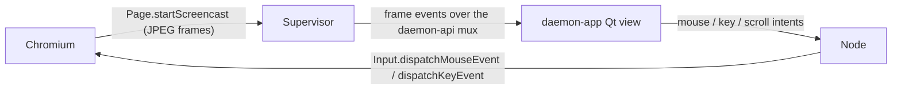

# Option 3 — Observe + control the browser inside `daemon-app` (CDP screencast)

Status: design proposal (not implemented). Options 1 (non-headless persistent window) and 2
(fixed CDP port / attach to a human-owned browser) are implemented; this document specifies the
richer, node-authoritative alternative: stream the daemon's Chromium into the Qt client and inject
user input back, so a human can watch and take over the same instance the agent drives — without a
local OS window and without an external CDP viewer.

## Why this over Options 1 and 2

- Option 1 (`headless = false`) needs a display on the machine the node runs on. A hosted /
  headless / remote node has none.
- Option 2 (fixed CDP port, or `connect_url` to a human-owned browser) works, but the human has to
  attach a separate tool (DevTools, `chrome://inspect`) and it exposes a CDP port.
- Option 3 keeps the node the single authority (it owns the browser, the egress guard, the
  approval gate) and makes `daemon-app` a thin renderer of a live frame stream — consistent with
  the architecture invariant in `daemon-node/AGENTS.md` ("the node decides, the apps render").
  Chromium can stay headless; CDP screencast produces frames without an X server, so this works
  identically on a laptop and a hosted node.

## Architecture

The `BrowserSupervisor` (`src/supervisor.rs`) gains a screencast mode: on subscribe it issues
`Page.startScreencast`, forwards each `EventScreencastFrame` to the client as an output frame, and
acknowledges frames back to Chromium (`ScreencastFrameAck`) so it keeps producing them. Client
input arrives as intents that the node validates and injects with the CDP `Input` domain. All of
this reuses the existing per-page CDP connection the supervisor already holds — no second browser,
no CDP port exposed.

## CDP surface (all in `chromiumoxide::cdp::browser_protocol`)

The supervisor already drives raw CDP via `page.execute(...)` and `page.event_listener::<...>()`
(see the `Fetch`-domain egress guard in `src/supervisor.rs`), so this adds more of the same:

- `page::StartScreencastParams` — `format = jpeg`, tunable `quality`, `max_width`/`max_height`,
  `every_nth_frame` (throttle). Returns nothing; frames arrive as events.
- `page::EventScreencastFrame` — `{ data: base64 jpeg, metadata: { device_width, device_height,
  offset_top, page_scale_factor, ... }, session_id }`. Ack each with
  `page::ScreencastFrameAckParams { session_id }` or Chromium stops after a few in-flight frames.
- `page::StopScreencastParams` — on unsubscribe / page close.
- `input::DispatchMouseEventParams` — `mousePressed`/`mouseReleased`/`mouseMoved`/`mouseWheel`,
  `x`/`y` in CSS px (scale by the frame `metadata`), `button`, `clickCount`, `deltaX`/`deltaY`.
- `input::DispatchKeyEventParams` — `keyDown`/`keyUp`/`char`, `key`, `code`, `text`, modifiers.

## Wire contract (`daemon-api`) — the real work

Frames and input cross the node<->client boundary, so they are wire types and MUST be reflected in
`crates/contracts/daemon-api/daemon-api.cddl`, then `just update-codec` regenerates the vendored C
codec (the drift gate `codec-drift` fails otherwise — see the superproject `flake.nix`). Two shapes
are needed:

1. A server->client frame channel. A screencast is a high-rate stream, so prefer a dedicated
   streaming/subscription frame over one `ApiResponse` per image (mirror whatever the mux already
   uses for other push streams rather than inventing a new carrier). Minimal payload:
   `{ "session": tstr, "seq": uint, "width": uint, "height": uint, "jpeg": byte-array }`.
2. A client->server input intent (a new `ApiRequest` arm), e.g. `browser-input` carrying a tagged
   union of `mouse` / `key` / `wheel` / `resize` events. The node validates it (see Security) and
   maps it to the CDP `Input` calls above. Per AGENTS.md, requests are intents the node validates
   server-side; the client never talks CDP directly.

Follow the CDDL authoring rules in `daemon-node/AGENTS.md` (quote every map key, give each union
arm its own named rule, `byte-array` for `Vec<u8>`). Add conformance coverage
(`cargo test -p daemon-api --test conformance` + the `arbitrary` proptest).

## `daemon-app` (Qt) side

A new view in the Daemon Kit renders the frames and captures input:

- Decode each JPEG frame into a `QImage`/texture and paint it (a `QQuickPaintedItem` or a
  texture-backed item); track the latest `seq` and drop stale frames.
- Translate Qt mouse/key/wheel/resize events to the `browser-input` intent, scaling widget
  coordinates to the frame's device size via the frame metadata.
- Subscribe on view-open, unsubscribe on close (drives `Start`/`StopScreencast`).
- GUI + TUI parity: the frame stream is a GUI-only surface (the TUI cannot paint pixels); the TUI
  keeps the existing text `extract` / status. Document this as an explicit exception.

## Security and lifecycle

- The existing per-request egress guard (`spawn_egress_guard`) and `approve_navigation` HITL stay
  in force — a human clicking a link in the streamed view still triggers a navigation that is
  egress-checked (and approval-gated when enabled), because the click becomes a real page event.
- No new listening socket: frames/input ride the already-authenticated daemon-api mux (SASL on the
  Unix socket / `ws`), so there is no open CDP port to expose (unlike Option 2). If Option 2's
  `remote_debugging_port` is also set, keep it loopback-only.
- Injected input is validated node-side (bounds, event-type allowlist, rate) before reaching CDP;
  a malformed intent is rejected, never forwarded verbatim.
- Reuses the persistent-session semantics from Option 1: the streamed window is not torn down by a
  transient page-op error.

## Open questions / estimate

- Frame transport: reuse an existing mux subscription/stream primitive vs. add a dedicated frame
  channel — pick the one that already backpressures; screencast is bursty.
- Codec/bandwidth: JPEG via CDP is simple but heavy; a later optimization could switch to
  `Page.startScreencast` at a capped `every_nth_frame` + `quality`, or a WebRTC/`Cast` path.
- Multi-page/tab handling: the supervisor drives one working page today; streaming a specific
  target needs a target-id in the wire types.
- Rough size: supervisor screencast plumbing (small), daemon-api wire types + CDDL + codec regen
  (medium, gated), Qt view + input mapping (medium). Land behind the same `browser` feature; keep
  it opt-in via a `[browser]` knob (e.g. `screencast = false`).
